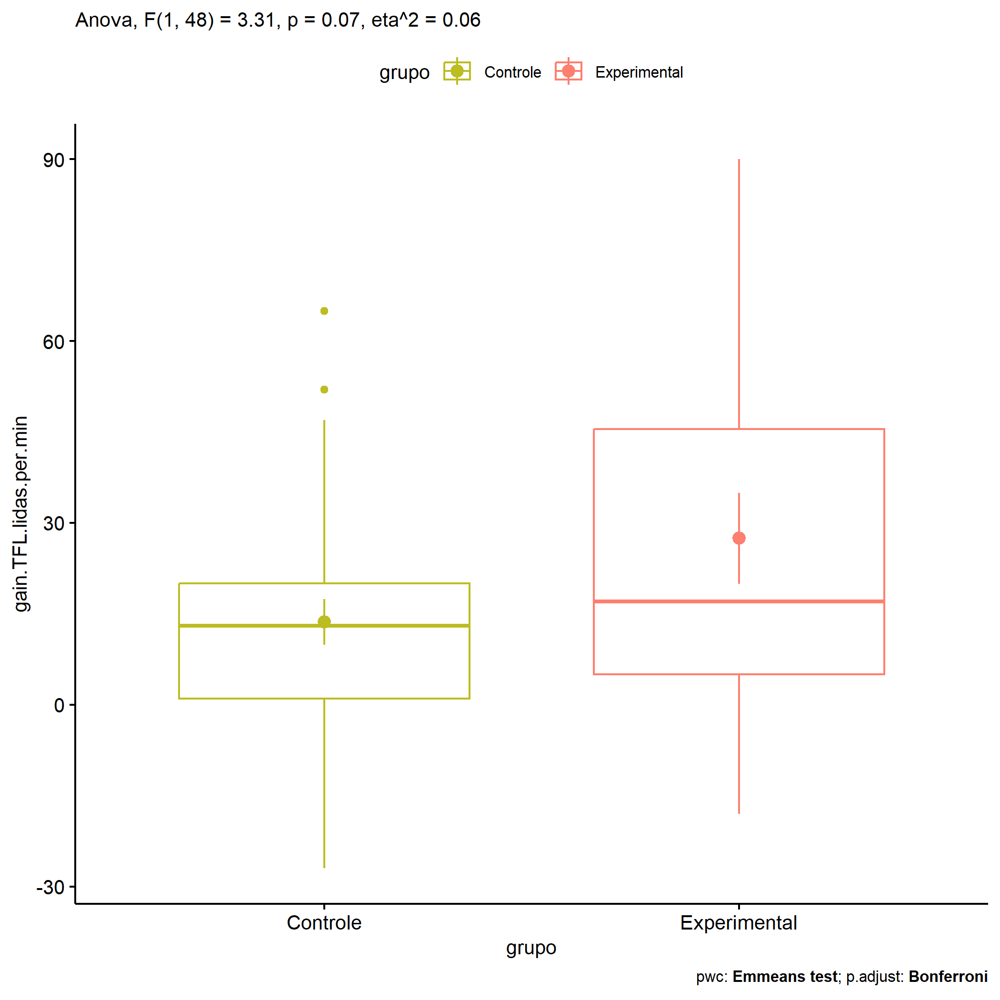
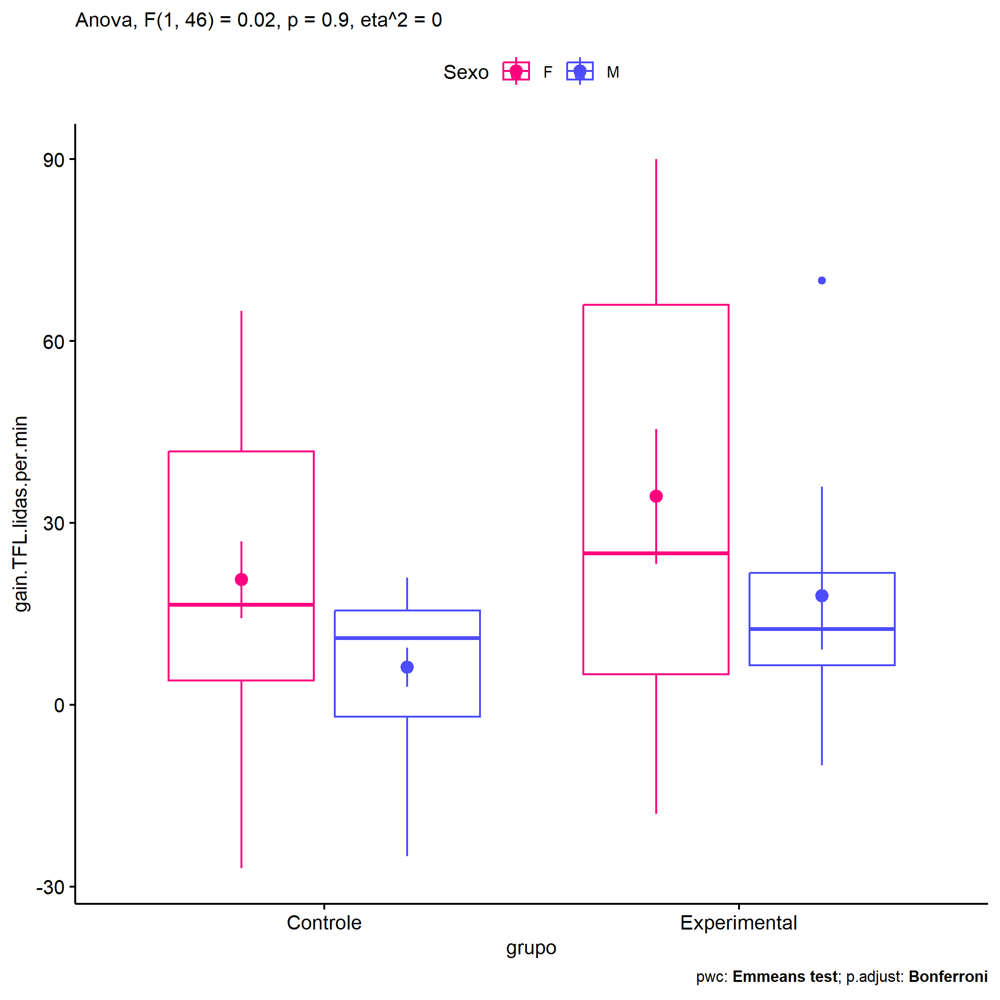
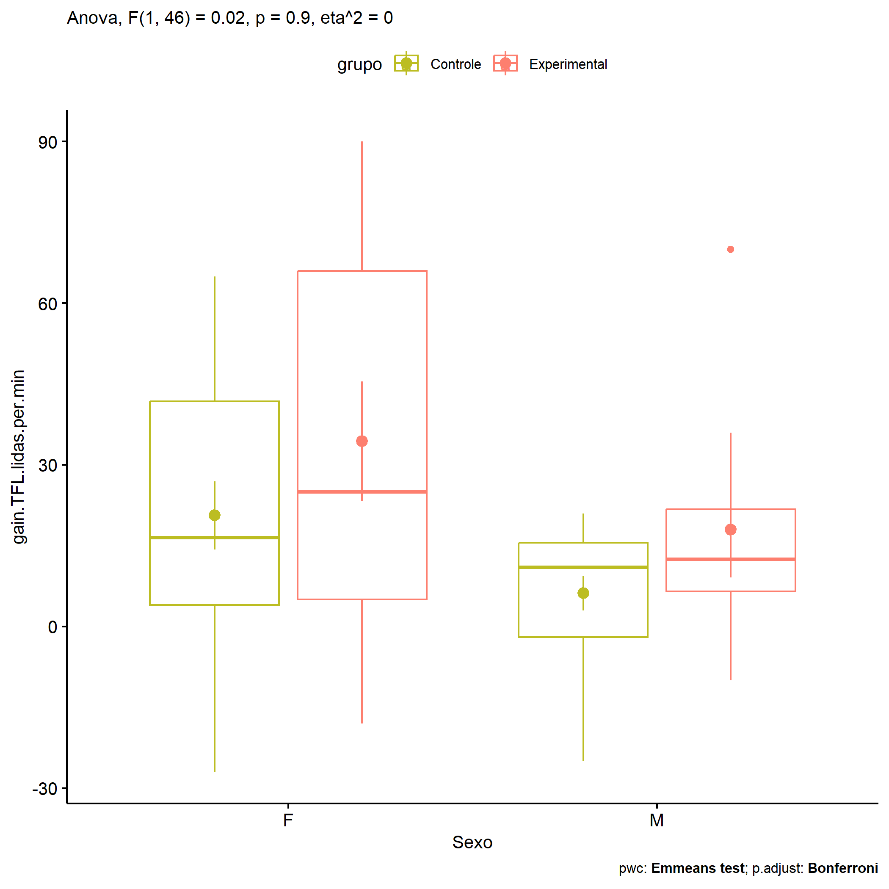

ANOVA in Gains for gain Palavras Lidas (1 Min) (gain Palavras Lidas (1
Min))
================
Geiser C. Challco <geiser@alumni.usp.br>

- [Descriptive Statistics of Initial
  Data](#descriptive-statistics-of-initial-data)
- [Checking of Assumptions](#checking-of-assumptions)
  - [Assumption: Normality distribution of
    data](#assumption-normality-distribution-of-data)
  - [Assumption: Homogeneity of data
    distribution](#assumption-homogeneity-of-data-distribution)
- [Computation of ANCOVA test and Pairwise
  Comparison](#computation-of-ancova-test-and-pairwise-comparison)
  - [ANCOVA tests for one factor](#ancova-tests-for-one-factor)
  - [ANCOVA tests for two factors](#ancova-tests-for-two-factors)
  - [Pairwise comparisons for one factor:
    **grupo**](#pairwise-comparisons-for-one-factor-grupo)
  - [Pairwise comparisons for two
    factors](#pairwise-comparisons-for-two-factors)
    - [factores: **grupo:Sexo**](#factores-gruposexo)
    - [factores: **grupo:Zona**](#factores-grupozona)
    - [factores: **grupo:Cor.Raca**](#factores-grupocorraca)

**NOTE**

- Teste ANOVA para determinar se houve diferenças significativas no gain
  Palavras Lidas (1 Min) (medido usando a diferença entre post-test e
  pre-testes).
- ANOVA test to determine whether there were significant differences in
  gain Palavras Lidas (1 Min) (measured using the difference between
  post-test and pre-tests).

# Descriptive Statistics of Initial Data

| grupo        | Sexo | Zona   | Cor.Raca | variable               |   n |   mean | median | min | max |     sd |     se |     ci |   iqr |
|:-------------|:-----|:-------|:---------|:-----------------------|----:|-------:|-------:|----:|----:|-------:|-------:|-------:|------:|
| Controle     | F    |        |          | gain.TFL.lidas.per.min |  16 | 20.625 |   16.5 | -27 |  65 | 25.324 |  6.331 | 13.494 | 37.75 |
| Controle     | M    |        |          | gain.TFL.lidas.per.min |  15 |  6.200 |   11.0 | -25 |  21 | 12.491 |  3.225 |  6.917 | 17.50 |
| Experimental | F    |        |          | gain.TFL.lidas.per.min |  11 | 34.364 |   25.0 | -18 |  90 | 36.884 | 11.121 | 24.779 | 61.00 |
| Experimental | M    |        |          | gain.TFL.lidas.per.min |   8 | 18.000 |   12.5 | -10 |  70 | 25.134 |  8.886 | 21.012 | 15.25 |
| Controle     |      | Rural  |          | gain.TFL.lidas.per.min |  25 | 10.000 |    7.0 | -27 |  65 | 20.079 |  4.016 |  8.288 | 18.00 |
| Controle     |      | Urbana |          | gain.TFL.lidas.per.min |   3 | 46.333 |   47.0 |  40 |  52 |  6.028 |  3.480 | 14.974 |  6.00 |
| Controle     |      |        |          | gain.TFL.lidas.per.min |   3 | 11.333 |   11.0 |   4 |  19 |  7.506 |  4.333 | 18.645 |  7.50 |
| Experimental |      | Rural  |          | gain.TFL.lidas.per.min |  14 | 24.786 |   15.0 | -18 |  90 | 32.911 |  8.796 | 19.002 | 29.00 |
| Experimental |      | Urbana |          | gain.TFL.lidas.per.min |   4 | 42.250 |   40.0 |   4 |  85 | 35.359 | 17.679 | 56.264 | 42.75 |
| Experimental |      |        |          | gain.TFL.lidas.per.min |   1 |  6.000 |    6.0 |   6 |   6 |        |        |        |  0.00 |
| Controle     |      |        | Branca   | gain.TFL.lidas.per.min |   5 |  6.000 |    4.0 | -25 |  33 | 22.361 | 10.000 | 27.764 | 24.00 |
| Controle     |      |        | Parda    | gain.TFL.lidas.per.min |  17 |  7.353 |    7.0 | -27 |  52 | 17.244 |  4.182 |  8.866 | 16.00 |
| Controle     |      |        |          | gain.TFL.lidas.per.min |   9 | 29.778 |   19.0 |   5 |  65 | 20.462 |  6.821 | 15.729 | 31.00 |
| Experimental |      |        | Amarela  | gain.TFL.lidas.per.min |   1 |  6.000 |    6.0 |   6 |   6 |        |        |        |  0.00 |
| Experimental |      |        | Branca   | gain.TFL.lidas.per.min |   1 | 55.000 |   55.0 |  55 |  55 |        |        |        |  0.00 |
| Experimental |      |        | Indígena | gain.TFL.lidas.per.min |   1 | 24.000 |   24.0 |  24 |  24 |        |        |        |  0.00 |
| Experimental |      |        | Parda    | gain.TFL.lidas.per.min |   7 |  5.000 |   10.0 | -18 |  27 | 16.083 |  6.079 | 14.874 | 22.00 |
| Experimental |      |        |          | gain.TFL.lidas.per.min |   9 | 44.667 |   36.0 |   3 |  90 | 35.861 | 11.954 | 27.565 | 65.00 |

# Checking of Assumptions

## Assumption: Normality distribution of data

| var                    |   n |  skewness |   kurtosis | symmetry | statistic | method       |         p | p.signif | normality |
|:-----------------------|----:|----------:|-----------:|:---------|----------:|:-------------|----------:|:---------|:----------|
| gain.TFL.lidas.per.min |  50 | 0.3339541 | -0.2261928 | YES      | 0.9747881 | Shapiro-Wilk | 0.3582055 | ns       | YES       |
| gain.TFL.lidas.per.min |  46 | 0.7098674 |  0.2604787 | NO       | 0.9403616 | Shapiro-Wilk | 0.0201911 | \*       | NO        |
| gain.TFL.lidas.per.min |  32 | 0.2869743 |  0.4377378 | YES      | 0.9757720 | Shapiro-Wilk | 0.6707925 | ns       | YES       |

## Assumption: Homogeneity of data distribution

| var                    | method        | formula                                      |   n | df1 | df2 | statistic |         p | p.signif |
|:-----------------------|:--------------|:---------------------------------------------|----:|----:|----:|----------:|----------:|:---------|
| gain.TFL.lidas.per.min | Levene’s test | `gain.TFL.lidas.per.min`~`grupo`\*`Sexo`     |  50 |   3 |  46 | 3.1154448 | 0.0351291 | \*       |
| gain.TFL.lidas.per.min | Levene’s test | `gain.TFL.lidas.per.min`~`grupo`\*`Zona`     |  46 |   3 |  42 | 1.9403529 | 0.1377434 | ns       |
| gain.TFL.lidas.per.min | Levene’s test | `gain.TFL.lidas.per.min`~`grupo`\*`Cor.Raca` |  32 |   5 |  26 | 0.7690356 | 0.5805875 | ns       |

# Computation of ANCOVA test and Pairwise Comparison

## ANCOVA tests for one factor

| Effect   | DFn | DFd |      SSn |      SSd |     F |     p |   ges | p\<.05 |
|:---------|----:|----:|---------:|---------:|------:|------:|------:|:-------|
| grupo    |   1 |  48 | 2252.666 | 32681.83 | 3.309 | 0.075 | 0.064 |        |
| Sexo     |   1 |  48 | 3146.964 | 31787.54 | 4.752 | 0.034 | 0.090 | \*     |
| Zona     |   1 |  44 | 4885.801 | 29570.31 | 7.270 | 0.010 | 0.142 | \*     |
| Cor.Raca |   3 |  28 |  519.552 | 10338.17 | 0.469 | 0.706 | 0.048 |        |

## ANCOVA tests for two factors

|     | Effect         | DFn | DFd |      SSn |       SSd |     F |     p |   ges | p\<.05 |
|:----|:---------------|----:|----:|---------:|----------:|------:|------:|------:|:-------|
| 3   | grupo:Sexo     |   1 |  46 |   10.891 | 29830.695 | 0.017 | 0.897 | 0.000 |        |
| 6   | grupo:Zona     |   1 |  42 |  512.465 | 27579.774 | 0.780 | 0.382 | 0.018 |        |
| 9   | grupo:Cor.Raca |   1 |  26 | 1881.402 |  8309.882 | 5.887 | 0.022 | 0.185 | \*     |

## Pairwise comparisons for one factor: **grupo**

| var                    | grupo        |   n |      M |    SE |
|:-----------------------|:-------------|----:|-------:|------:|
| gain.TFL.lidas.per.min | Controle     |  31 | 13.645 | 3.798 |
| gain.TFL.lidas.per.min | Experimental |  19 | 27.474 | 7.506 |

| .y.                    | group1   | group2       | estimate | conf.low | conf.high |    se | statistic |     p | p.adj | p.adj.signif |
|:-----------------------|:---------|:-------------|---------:|---------:|----------:|------:|----------:|------:|------:|:-------------|
| gain.TFL.lidas.per.min | Controle | Experimental |  -13.829 |  -29.114 |     1.457 | 7.603 |    -1.819 | 0.075 | 0.075 | ns           |

    ## Scale for colour is already present.
    ## Adding another scale for colour, which will replace the existing scale.

<!-- -->

## Pairwise comparisons for two factors

### factores: **grupo:Sexo**

| var                    | grupo        | Sexo |   n |      M |     SE |
|:-----------------------|:-------------|:-----|----:|-------:|-------:|
| gain.TFL.lidas.per.min | Controle     | F    |  16 | 20.625 |  6.331 |
| gain.TFL.lidas.per.min | Controle     | M    |  15 |  6.200 |  3.225 |
| gain.TFL.lidas.per.min | Experimental | F    |  11 | 34.364 | 11.121 |
| gain.TFL.lidas.per.min | Experimental | M    |   8 | 18.000 |  8.886 |

| .y.                    | grupo        | Sexo | group1   | group2       | estimate | conf.low | conf.high |     se | statistic |     p | p.adj | p.adj.signif |
|:-----------------------|:-------------|:-----|:---------|:-------------|---------:|---------:|----------:|-------:|----------:|------:|------:|:-------------|
| gain.TFL.lidas.per.min |              | F    | Controle | Experimental |  -13.739 |  -33.816 |     6.338 |  9.974 |    -1.377 | 0.175 | 0.175 | ns           |
| gain.TFL.lidas.per.min |              | M    | Controle | Experimental |  -11.800 |  -34.241 |    10.641 | 11.149 |    -1.058 | 0.295 | 0.295 | ns           |
| gain.TFL.lidas.per.min | Controle     |      | F        | M            |   14.425 |   -3.998 |    32.848 |  9.152 |     1.576 | 0.122 | 0.122 | ns           |
| gain.TFL.lidas.per.min | Experimental |      | F        | M            |   16.364 |   -7.455 |    40.182 | 11.833 |     1.383 | 0.173 | 0.173 | ns           |

    ## Scale for colour is already present.
    ## Adding another scale for colour, which will replace the existing scale.

<!-- -->

    ## Scale for colour is already present.
    ## Adding another scale for colour, which will replace the existing scale.

<!-- -->

### factores: **grupo:Zona**

### factores: **grupo:Cor.Raca**

| var                    | grupo        | Cor.Raca |   n |     M |     SE |
|:-----------------------|:-------------|:---------|----:|------:|-------:|
| gain.TFL.lidas.per.min | Controle     | Branca   |   5 | 6.000 | 10.000 |
| gain.TFL.lidas.per.min | Controle     | Parda    |  17 | 7.353 |  4.182 |
| gain.TFL.lidas.per.min | Experimental | Parda    |   7 | 5.000 |  6.079 |

|     | .y.                    | grupo    | Cor.Raca | group1   | group2       | estimate | conf.low | conf.high |    se | statistic |     p | p.adj | p.adj.signif |
|:----|:-----------------------|:---------|:---------|:---------|:-------------|---------:|---------:|----------:|------:|----------:|------:|------:|:-------------|
| 2   | gain.TFL.lidas.per.min |          | Parda    | Controle | Experimental |    2.353 |  -14.150 |    18.856 | 8.029 |     0.293 | 0.772 | 0.772 | ns           |
| 3   | gain.TFL.lidas.per.min | Controle |          | Branca   | Parda        |   -1.353 |  -20.048 |    17.343 | 9.095 |    -0.149 | 0.883 | 0.883 | ns           |
