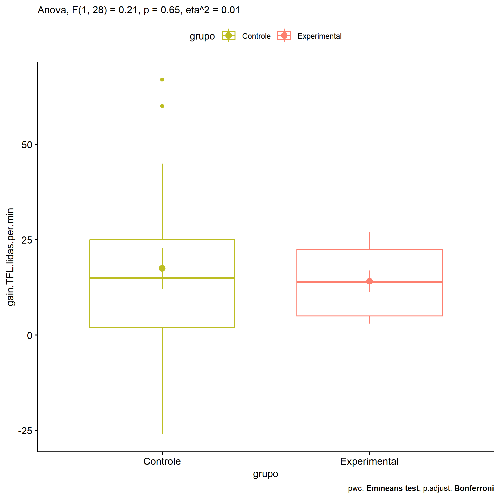

ANOVA in Gains for gain Palavras Lidas (1 Min) (gain Palavras Lidas (1
Min))
================
Geiser C. Challco <geiser@alumni.usp.br>

- [Descriptive Statistics of Initial
  Data](#descriptive-statistics-of-initial-data)
- [Checking of Assumptions](#checking-of-assumptions)
  - [Assumption: Normality distribution of
    data](#assumption-normality-distribution-of-data)
  - [Assumption: Homogeneity of data
    distribution](#assumption-homogeneity-of-data-distribution)
- [Computation of ANCOVA test and Pairwise
  Comparison](#computation-of-ancova-test-and-pairwise-comparison)
  - [ANCOVA tests for one factor](#ancova-tests-for-one-factor)
  - [ANCOVA tests for two factors](#ancova-tests-for-two-factors)
  - [Pairwise comparisons for one factor:
    **grupo**](#pairwise-comparisons-for-one-factor-grupo)
  - [Pairwise comparisons for two
    factors](#pairwise-comparisons-for-two-factors)
    - [factores: **grupo:Sexo**](#factores-gruposexo)
    - [factores: **grupo:Zona**](#factores-grupozona)
    - [factores: **grupo:Cor.Raca**](#factores-grupocorraca)

**NOTE**

- Teste ANOVA para determinar se houve diferenças significativas no gain
  Palavras Lidas (1 Min) (medido usando a diferença entre post-test e
  pre-testes).
- ANOVA test to determine whether there were significant differences in
  gain Palavras Lidas (1 Min) (measured using the difference between
  post-test and pre-tests).

# Descriptive Statistics of Initial Data

| grupo        | Sexo | Cor.Raca | variable               |   n |   mean | median | min | max |     sd |     se |      ci |   iqr |
|:-------------|:-----|:---------|:-----------------------|----:|-------:|-------:|----:|----:|-------:|-------:|--------:|------:|
| Controle     | F    |          | gain.TFL.lidas.per.min |   8 | 25.750 |   17.0 |  -7 |  67 | 23.328 |  8.248 |  19.503 | 27.50 |
| Controle     | M    |          | gain.TFL.lidas.per.min |  11 | 11.455 |   11.0 | -26 |  60 | 22.232 |  6.703 |  14.936 | 24.00 |
| Experimental | F    |          | gain.TFL.lidas.per.min |   4 | 18.500 |   22.5 |   4 |  25 |  9.815 |  4.907 |  15.618 |  7.50 |
| Experimental | M    |          | gain.TFL.lidas.per.min |   7 | 11.571 |    8.0 |   3 |  27 |  8.886 |  3.358 |   8.218 | 11.50 |
| Controle     |      | Branca   | gain.TFL.lidas.per.min |   4 | 15.750 |   14.5 | -26 |  60 | 35.141 | 17.571 |  55.918 | 22.25 |
| Controle     |      | Indígena | gain.TFL.lidas.per.min |   2 | -5.500 |   -5.5 |  -7 |  -4 |  2.121 |  1.500 |  19.059 |  1.50 |
| Controle     |      | Parda    | gain.TFL.lidas.per.min |   9 | 21.222 |   19.0 |  -5 |  67 | 23.091 |  7.697 |  17.749 | 21.00 |
| Controle     |      | Preta    | gain.TFL.lidas.per.min |   1 | 19.000 |   19.0 |  19 |  19 |        |        |         |  0.00 |
| Controle     |      |          | gain.TFL.lidas.per.min |   3 | 23.333 |   17.0 |  13 |  40 | 14.572 |  8.413 |  36.198 | 13.50 |
| Experimental |      | Branca   | gain.TFL.lidas.per.min |   2 | 14.000 |   14.0 |   4 |  24 | 14.142 | 10.000 | 127.062 | 10.00 |
| Experimental |      | Indígena | gain.TFL.lidas.per.min |   3 | 11.000 |    8.0 |   4 |  21 |  8.888 |  5.132 |  22.079 |  8.50 |
| Experimental |      | Parda    | gain.TFL.lidas.per.min |   2 | 23.000 |   23.0 |  19 |  27 |  5.657 |  4.000 |  50.825 |  4.00 |
| Experimental |      |          | gain.TFL.lidas.per.min |   4 | 12.000 |   10.0 |   3 |  25 |  9.832 |  4.916 |  15.645 | 11.50 |

# Checking of Assumptions

## Assumption: Normality distribution of data

| var                    |   n |  skewness |  kurtosis | symmetry | statistic | method       |         p | p.signif | normality |
|:-----------------------|----:|----------:|----------:|:---------|----------:|:-------------|----------:|:---------|:----------|
| gain.TFL.lidas.per.min |  30 | 0.5445078 | 0.7677021 | NO       | 0.9498505 | Shapiro-Wilk | 0.1675080 | ns       | YES       |
| gain.TFL.lidas.per.min |  23 | 0.5214014 | 0.7431005 | NO       | 0.9158666 | Shapiro-Wilk | 0.0543698 | ns       | YES       |

## Assumption: Homogeneity of data distribution

| var                    | method        | formula                                      |   n | df1 | df2 | statistic |         p | p.signif |
|:-----------------------|:--------------|:---------------------------------------------|----:|----:|----:|----------:|----------:|:---------|
| gain.TFL.lidas.per.min | Levene’s test | `gain.TFL.lidas.per.min`~`grupo`\*`Sexo`     |  30 |   3 |  26 | 1.3092211 | 0.2925796 | ns       |
| gain.TFL.lidas.per.min | Levene’s test | `gain.TFL.lidas.per.min`~`grupo`\*`Cor.Raca` |  23 |   6 |  16 | 0.8846263 | 0.5282981 | ns       |

# Computation of ANCOVA test and Pairwise Comparison

## ANCOVA tests for one factor

| Effect   | DFn | DFd |      SSn |       SSd |     F |     p |   ges | p\<.05 |
|:---------|----:|----:|---------:|----------:|------:|------:|------:|:-------|
| grupo    |   1 |  28 |   79.721 | 10583.646 | 0.211 | 0.650 | 0.007 |        |
| Sexo     |   1 |  28 | 1008.200 |  9655.167 | 2.924 | 0.098 | 0.095 |        |
| Cor.Raca |   3 |  19 | 1024.196 |  8700.761 | 0.746 | 0.538 | 0.105 |        |

## ANCOVA tests for two factors

|     | Effect         | DFn | DFd |     SSn |      SSd |     F |     p |   ges | p\<.05 |
|:----|:---------------|----:|----:|--------:|---------:|------:|------:|------:|:-------|
| 3   | grupo:Sexo     |   1 |  26 |  89.149 | 9514.942 | 0.244 | 0.626 | 0.009 |        |
| 6   | grupo:Cor.Raca |   2 |  16 | 236.386 | 8364.806 | 0.226 | 0.800 | 0.027 |        |

## Pairwise comparisons for one factor: **grupo**

| var                    | grupo        |   n |      M |    SE |
|:-----------------------|:-------------|----:|-------:|------:|
| gain.TFL.lidas.per.min | Controle     |  19 | 17.474 | 5.325 |
| gain.TFL.lidas.per.min | Experimental |  11 | 14.091 | 2.836 |

| .y.                    | group1   | group2       | estimate | conf.low | conf.high |    se | statistic |    p | p.adj | p.adj.signif |
|:-----------------------|:---------|:-------------|---------:|---------:|----------:|------:|----------:|-----:|------:|:-------------|
| gain.TFL.lidas.per.min | Controle | Experimental |    3.383 |  -11.706 |    18.471 | 7.366 |     0.459 | 0.65 |  0.65 | ns           |

    ## Scale for colour is already present.
    ## Adding another scale for colour, which will replace the existing scale.

<!-- -->

## Pairwise comparisons for two factors

### factores: **grupo:Sexo**

| var                    | grupo        | Sexo |   n |      M |    SE |
|:-----------------------|:-------------|:-----|----:|-------:|------:|
| gain.TFL.lidas.per.min | Controle     | F    |   8 | 25.750 | 8.248 |
| gain.TFL.lidas.per.min | Controle     | M    |  11 | 11.455 | 6.703 |
| gain.TFL.lidas.per.min | Experimental | M    |   7 | 11.571 | 3.358 |

|     | .y.                    | grupo    | Sexo | group1   | group2       | estimate | conf.low | conf.high |    se | statistic |     p | p.adj | p.adj.signif |
|:----|:-----------------------|:---------|:-----|:---------|:-------------|---------:|---------:|----------:|------:|----------:|------:|------:|:-------------|
| 2   | gain.TFL.lidas.per.min |          | M    | Controle | Experimental |   -0.117 |  -20.149 |    19.915 | 9.683 |    -0.012 | 0.990 | 0.990 | ns           |
| 3   | gain.TFL.lidas.per.min | Controle |      | F        | M            |   14.295 |   -4.956 |    33.547 | 9.306 |     1.536 | 0.138 | 0.138 | ns           |

### factores: **grupo:Zona**

### factores: **grupo:Cor.Raca**
