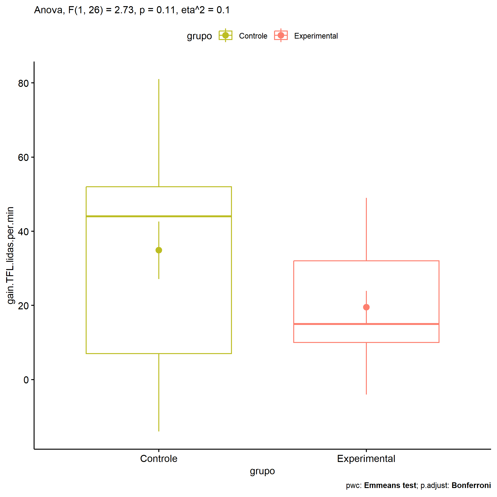

ANOVA in Gains for gain Palavras Lidas (1 Min) (gain Palavras Lidas (1
Min))
================
Geiser C. Challco <geiser@alumni.usp.br>

- [Descriptive Statistics of Initial
  Data](#descriptive-statistics-of-initial-data)
- [Checking of Assumptions](#checking-of-assumptions)
  - [Assumption: Normality distribution of
    data](#assumption-normality-distribution-of-data)
  - [Assumption: Homogeneity of data
    distribution](#assumption-homogeneity-of-data-distribution)
- [Computation of ANCOVA test and Pairwise
  Comparison](#computation-of-ancova-test-and-pairwise-comparison)
  - [ANCOVA tests for one factor](#ancova-tests-for-one-factor)
  - [ANCOVA tests for two factors](#ancova-tests-for-two-factors)
  - [Pairwise comparisons for one factor:
    **grupo**](#pairwise-comparisons-for-one-factor-grupo)
  - [Pairwise comparisons for two
    factors](#pairwise-comparisons-for-two-factors)
    - [factores: **grupo:Sexo**](#factores-gruposexo)
    - [factores: **grupo:Zona**](#factores-grupozona)
    - [factores: **grupo:Cor.Raca**](#factores-grupocorraca)

**NOTE**

- Teste ANOVA para determinar se houve diferenças significativas no gain
  Palavras Lidas (1 Min) (medido usando a diferença entre post-test e
  pre-testes).
- ANOVA test to determine whether there were significant differences in
  gain Palavras Lidas (1 Min) (measured using the difference between
  post-test and pre-tests).

# Descriptive Statistics of Initial Data

| grupo        | Sexo | Zona   | Cor.Raca | variable               |   n |   mean | median | min | max |     sd |     se |      ci |   iqr |
|:-------------|:-----|:-------|:---------|:-----------------------|----:|-------:|-------:|----:|----:|-------:|-------:|--------:|------:|
| Controle     | F    |        |          | gain.TFL.lidas.per.min |   3 | 45.667 |   45.0 |  11 |  81 | 35.005 | 20.210 |  86.957 | 35.00 |
| Controle     | M    |        |          | gain.TFL.lidas.per.min |  12 | 32.167 |   39.5 | -14 |  81 | 29.683 |  8.569 |  18.859 | 49.25 |
| Experimental | F    |        |          | gain.TFL.lidas.per.min |   3 | 17.667 |   25.0 |  -4 |  32 | 19.088 | 11.020 |  47.416 | 18.00 |
| Experimental | M    |        |          | gain.TFL.lidas.per.min |  10 | 20.100 |   14.0 |   0 |  49 | 15.765 |  4.985 |  11.278 | 20.50 |
| Controle     |      | Rural  |          | gain.TFL.lidas.per.min |   5 | 20.800 |    2.0 | -14 |  81 | 38.154 | 17.063 |  47.374 | 35.00 |
| Controle     |      | Urbana |          | gain.TFL.lidas.per.min |   3 | 51.667 |   52.0 |  51 |  52 |  0.577 |  0.333 |   1.434 |  0.50 |
| Controle     |      |        |          | gain.TFL.lidas.per.min |   7 | 37.714 |   44.0 |   3 |  81 | 28.471 | 10.761 |  26.331 | 39.00 |
| Experimental |      | Rural  |          | gain.TFL.lidas.per.min |   6 | 16.500 |   13.0 |   8 |  34 |  9.731 |  3.973 |  10.212 |  9.25 |
| Experimental |      | Urbana |          | gain.TFL.lidas.per.min |   2 | 10.500 |   10.5 |  -4 |  25 | 20.506 | 14.500 | 184.240 | 14.50 |
| Experimental |      |        |          | gain.TFL.lidas.per.min |   5 | 26.800 |   32.0 |   0 |  49 | 20.017 |  8.952 |  24.855 | 27.00 |
| Controle     |      |        | Parda    | gain.TFL.lidas.per.min |   6 |  3.333 |    2.5 | -14 |  18 | 10.838 |  4.425 |  11.374 |  8.50 |
| Controle     |      |        |          | gain.TFL.lidas.per.min |   9 | 55.889 |   52.0 |  35 |  81 | 16.003 |  5.334 |  12.301 | 17.00 |
| Experimental |      |        | Branca   | gain.TFL.lidas.per.min |   1 | 15.000 |   15.0 |  15 |  15 |        |        |         |  0.00 |
| Experimental |      |        | Indígena | gain.TFL.lidas.per.min |   1 | 13.000 |   13.0 |  13 |  13 |        |        |         |  0.00 |
| Experimental |      |        | Parda    | gain.TFL.lidas.per.min |   4 | 18.000 |   16.0 |   8 |  32 | 10.863 |  5.431 |  17.285 | 13.50 |
| Experimental |      |        |          | gain.TFL.lidas.per.min |   7 | 22.000 |   25.0 |  -4 |  49 | 20.453 |  7.731 |  18.916 | 32.00 |

# Checking of Assumptions

## Assumption: Normality distribution of data

| var                    |   n |   skewness |   kurtosis | symmetry | statistic | method       |         p | p.signif | normality |
|:-----------------------|----:|-----------:|-----------:|:---------|----------:|:-------------|----------:|:---------|:----------|
| gain.TFL.lidas.per.min |  28 | -0.0044910 | -0.8892412 | YES      | 0.9847096 | Shapiro-Wilk | 0.9441957 | ns       | YES       |
| gain.TFL.lidas.per.min |  16 |  1.1055338 |  1.7193251 | NO       | 0.8945781 | Shapiro-Wilk | 0.0658452 | ns       | YES       |
| gain.TFL.lidas.per.min |  12 | -0.0224804 | -0.8263277 | YES      | 0.9611421 | Shapiro-Wilk | 0.8000042 | ns       | YES       |

## Assumption: Homogeneity of data distribution

| var                    | method        | formula                                      |   n | df1 | df2 | statistic |         p | p.signif |
|:-----------------------|:--------------|:---------------------------------------------|----:|----:|----:|----------:|----------:|:---------|
| gain.TFL.lidas.per.min | Levene’s test | `gain.TFL.lidas.per.min`~`grupo`\*`Sexo`     |  28 |   3 |  24 | 1.6727007 | 0.1994121 | ns       |
| gain.TFL.lidas.per.min | Levene’s test | `gain.TFL.lidas.per.min`~`grupo`\*`Zona`     |  16 |   3 |  12 | 1.3900056 | 0.2933901 | ns       |
| gain.TFL.lidas.per.min | Levene’s test | `gain.TFL.lidas.per.min`~`grupo`\*`Cor.Raca` |  12 |   3 |   8 | 0.7978402 | 0.5288897 | ns       |

# Computation of ANCOVA test and Pairwise Comparison

## ANCOVA tests for one factor

| Effect   | DFn | DFd |      SSn |       SSd |     F |     p |   ges | p\<.05 |
|:---------|----:|----:|---------:|----------:|------:|------:|------:|:-------|
| grupo    |   1 |  26 | 1636.286 | 15558.964 | 2.734 | 0.110 | 0.095 |        |
| Sexo     |   1 |  26 |  117.144 | 17078.106 | 0.178 | 0.676 | 0.007 |        |
| Zona     |   1 |  14 |  963.910 |  8801.527 | 1.533 | 0.236 | 0.099 |        |
| Cor.Raca |   2 |   9 |   40.400 |  1457.600 | 0.125 | 0.884 | 0.027 |        |

## ANCOVA tests for two factors

|     | Effect         | DFn | DFd |      SSn |       SSd |     F |     p |   ges | p\<.05 |
|:----|:---------------|----:|----:|---------:|----------:|------:|------:|------:|:-------|
| 3   | grupo:Sexo     |   1 |  24 |  298.672 | 15107.900 | 0.474 | 0.498 | 0.019 |        |
| 6   | grupo:Zona     |   1 |  12 | 1132.626 |  6717.467 | 2.023 | 0.180 | 0.144 |        |
| 9   | grupo:Cor.Raca |   0 |   8 |          |   941.333 |       |       |       |        |

## Pairwise comparisons for one factor: **grupo**

| var                    | grupo        |   n |      M |   SE |
|:-----------------------|:-------------|----:|-------:|-----:|
| gain.TFL.lidas.per.min | Controle     |  15 | 34.867 | 7.74 |
| gain.TFL.lidas.per.min | Experimental |  13 | 19.538 | 4.37 |

| .y.                    | group1   | group2       | estimate | conf.low | conf.high |   se | statistic |    p | p.adj | p.adj.signif |
|:-----------------------|:---------|:-------------|---------:|---------:|----------:|-----:|----------:|-----:|------:|:-------------|
| gain.TFL.lidas.per.min | Controle | Experimental |   15.328 |   -3.726 |    34.382 | 9.27 |     1.654 | 0.11 |  0.11 | ns           |

    ## Scale for colour is already present.
    ## Adding another scale for colour, which will replace the existing scale.

<!-- -->

## Pairwise comparisons for two factors

### factores: **grupo:Sexo**

### factores: **grupo:Zona**

### factores: **grupo:Cor.Raca**
