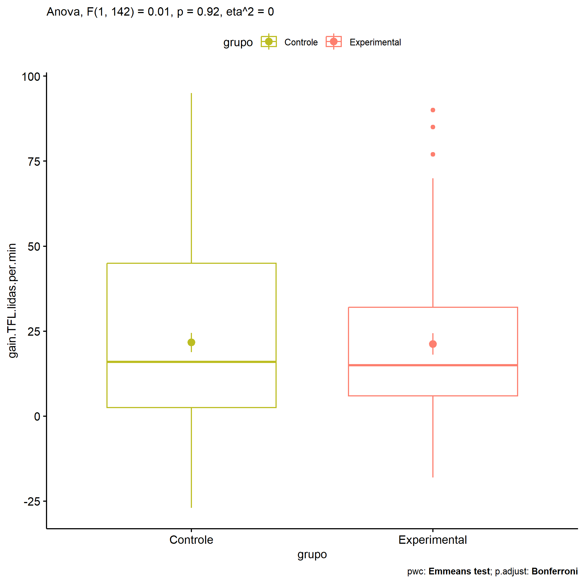
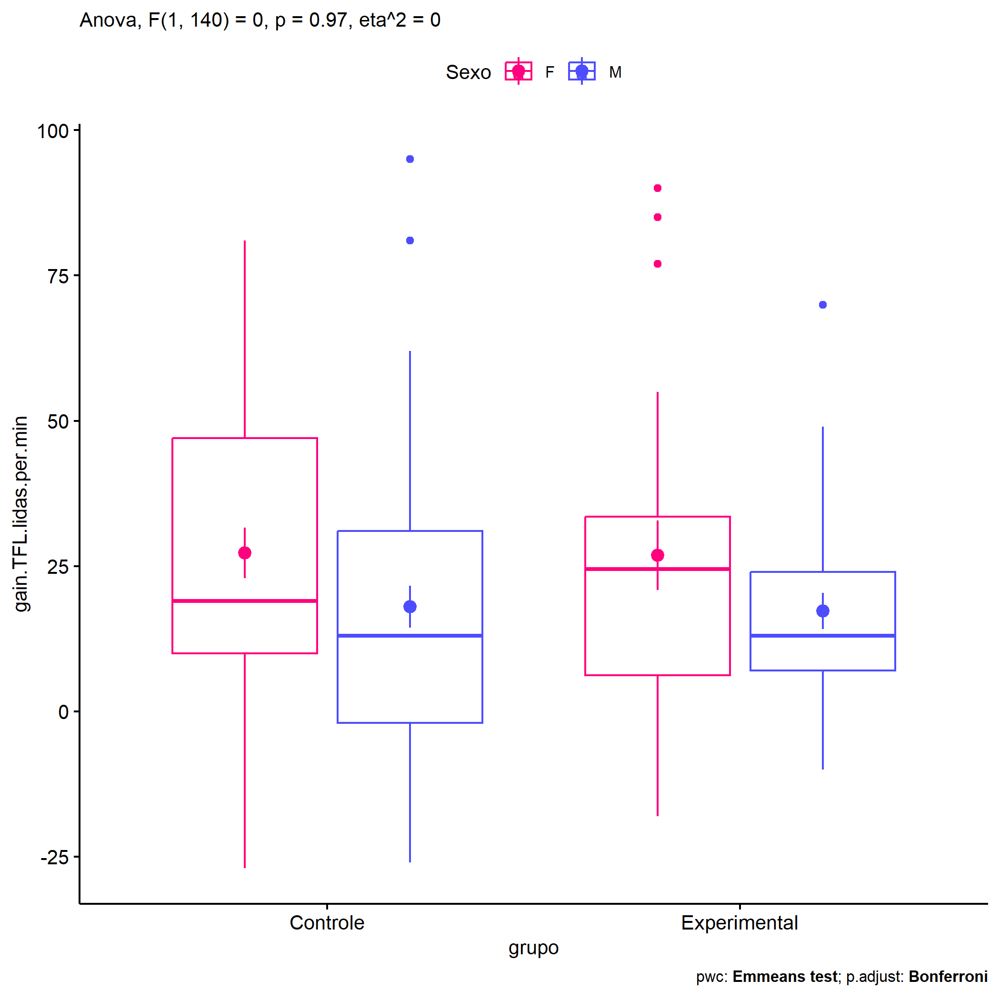
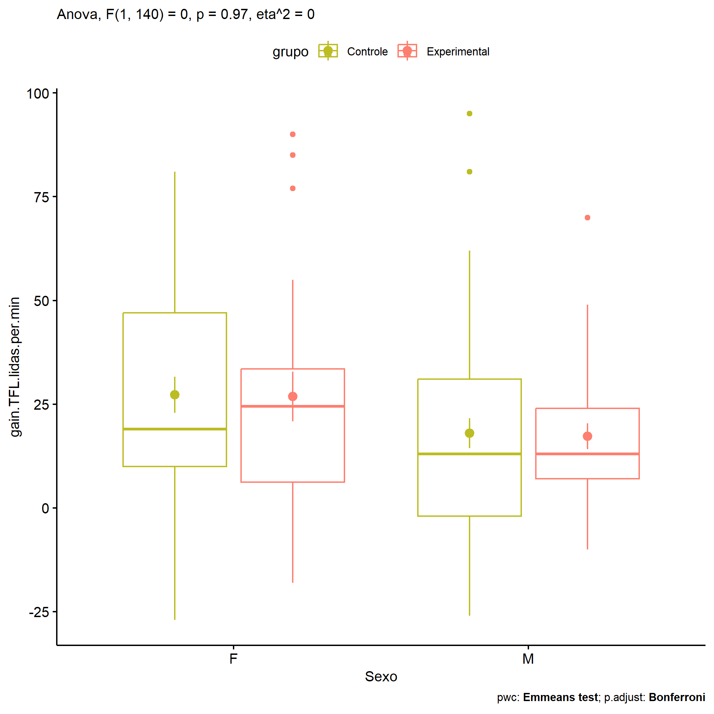
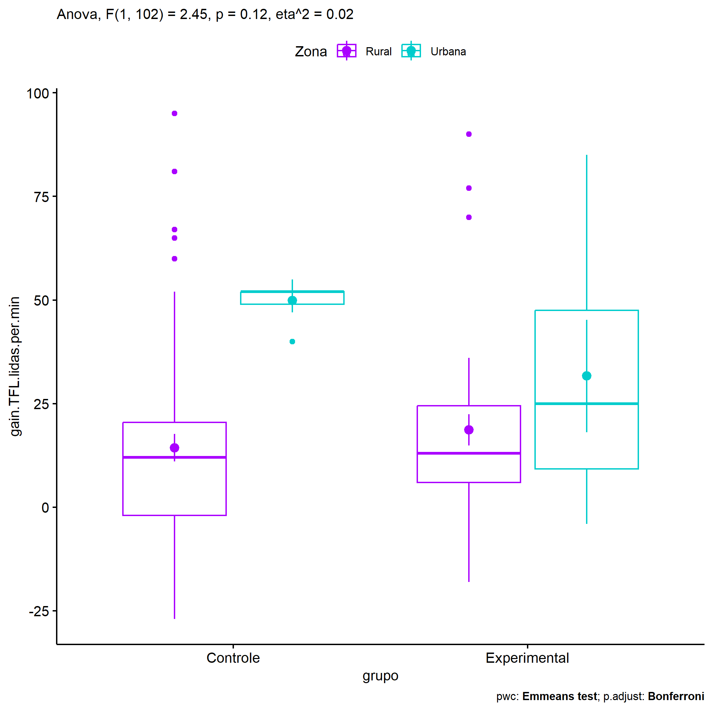
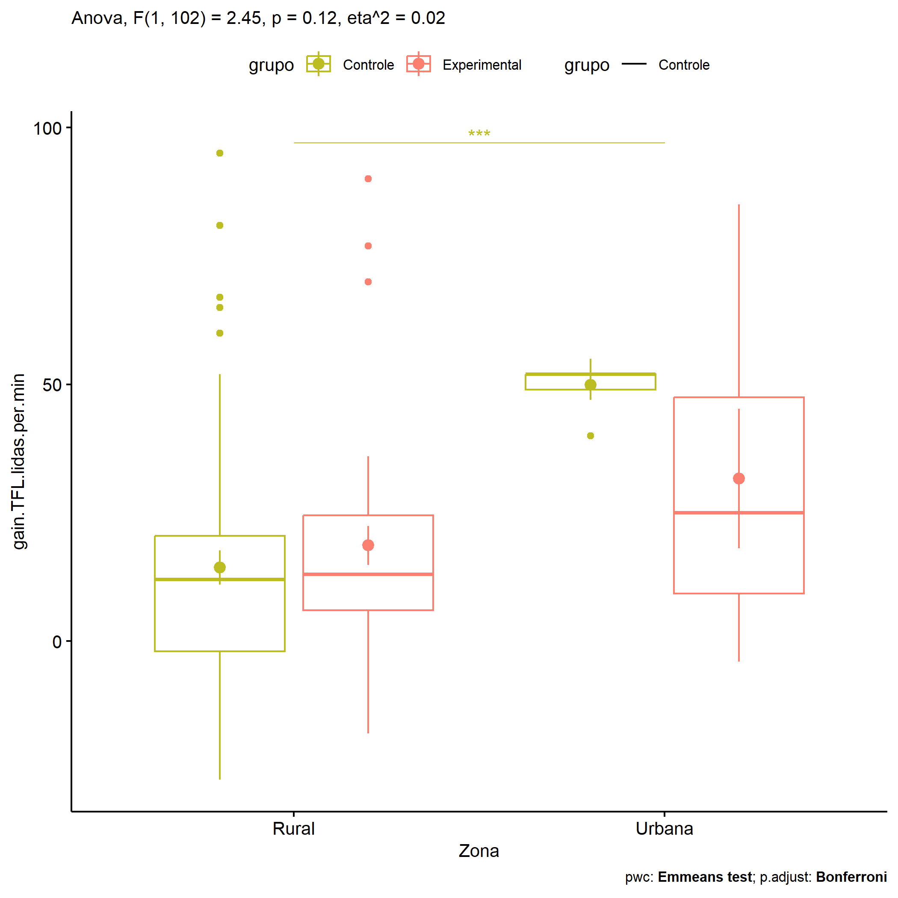
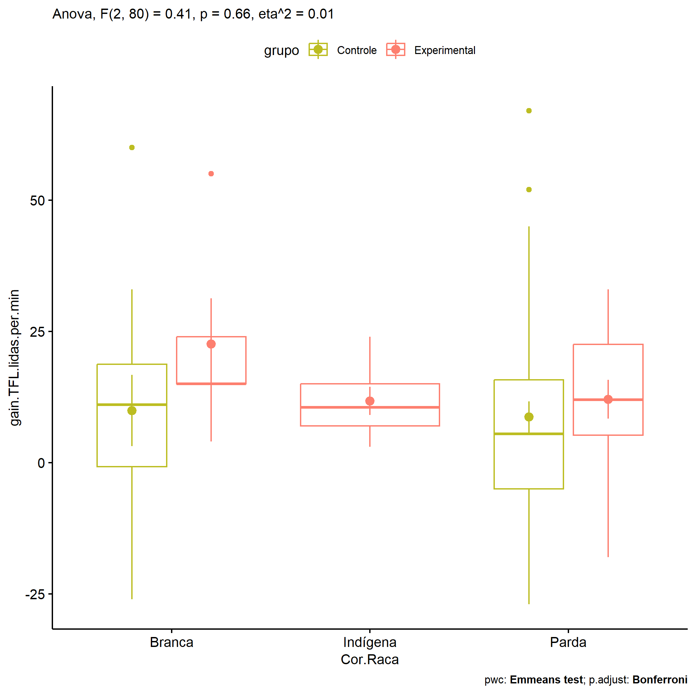

ANOVA in Gains for gain Palavras Lidas (1 Min) (gain Palavras Lidas (1
Min))
================
Geiser C. Challco <geiser@alumni.usp.br>

- [Descriptive Statistics of Initial
  Data](#descriptive-statistics-of-initial-data)
- [Checking of Assumptions](#checking-of-assumptions)
  - [Assumption: Normality distribution of
    data](#assumption-normality-distribution-of-data)
  - [Assumption: Homogeneity of data
    distribution](#assumption-homogeneity-of-data-distribution)
- [Computation of ANCOVA test and Pairwise
  Comparison](#computation-of-ancova-test-and-pairwise-comparison)
  - [ANCOVA tests for one factor](#ancova-tests-for-one-factor)
  - [ANCOVA tests for two factors](#ancova-tests-for-two-factors)
  - [Pairwise comparisons for one factor:
    **grupo**](#pairwise-comparisons-for-one-factor-grupo)
  - [Pairwise comparisons for two
    factors](#pairwise-comparisons-for-two-factors)
    - [factores: **grupo:Sexo**](#factores-gruposexo)
    - [factores: **grupo:Zona**](#factores-grupozona)
    - [factores: **grupo:Cor.Raca**](#factores-grupocorraca)

**NOTE**

- Teste ANOVA para determinar se houve diferenças significativas no gain
  Palavras Lidas (1 Min) (medido usando a diferença entre post-test e
  pre-testes).
- ANOVA test to determine whether there were significant differences in
  gain Palavras Lidas (1 Min) (measured using the difference between
  post-test and pre-tests).

# Descriptive Statistics of Initial Data

| grupo        | Sexo | Zona   | Cor.Raca | variable               |   n |   mean | median | min | max |     sd |     se |     ci |   iqr |
|:-------------|:-----|:-------|:---------|:-----------------------|----:|-------:|-------:|----:|----:|-------:|-------:|-------:|------:|
| Controle     | F    |        |          | gain.TFL.lidas.per.min |  36 | 27.278 |   19.0 | -27 |  81 | 26.123 |  4.354 |  8.839 | 37.00 |
| Controle     | M    |        |          | gain.TFL.lidas.per.min |  55 | 18.000 |   13.0 | -26 |  95 | 26.829 |  3.618 |  7.253 | 33.00 |
| Experimental | F    |        |          | gain.TFL.lidas.per.min |  22 | 26.864 |   24.5 | -18 |  90 | 28.182 |  6.008 | 12.495 | 27.25 |
| Experimental | M    |        |          | gain.TFL.lidas.per.min |  31 | 17.258 |   13.0 | -10 |  70 | 17.307 |  3.108 |  6.348 | 17.00 |
| Controle     |      | Rural  |          | gain.TFL.lidas.per.min |  58 | 14.362 |   12.0 | -27 |  95 | 25.313 |  3.324 |  6.656 | 22.50 |
| Controle     |      | Urbana |          | gain.TFL.lidas.per.min |   7 | 49.857 |   52.0 |  40 |  55 |  4.947 |  1.870 |  4.576 |  3.00 |
| Controle     |      |        |          | gain.TFL.lidas.per.min |  26 | 30.385 |   18.5 |  -8 |  81 | 26.326 |  5.163 | 10.633 | 43.75 |
| Experimental |      | Rural  |          | gain.TFL.lidas.per.min |  35 | 18.657 |   13.0 | -18 |  90 | 22.359 |  3.779 |  7.681 | 18.50 |
| Experimental |      | Urbana |          | gain.TFL.lidas.per.min |   6 | 31.667 |   25.0 |  -4 |  85 | 33.212 | 13.559 | 34.854 | 38.25 |
| Experimental |      |        |          | gain.TFL.lidas.per.min |  12 | 23.583 |   23.0 |   0 |  49 | 17.547 |  5.065 | 11.149 | 31.00 |
| Controle     |      |        | Branca   | gain.TFL.lidas.per.min |  12 |  9.917 |   11.0 | -26 |  60 | 23.520 |  6.790 | 14.944 | 19.50 |
| Controle     |      |        | Indígena | gain.TFL.lidas.per.min |   3 |  1.667 |   -4.0 |  -7 |  16 | 12.503 |  7.219 | 31.060 | 11.50 |
| Controle     |      |        | Parda    | gain.TFL.lidas.per.min |  42 |  8.714 |    5.5 | -27 |  67 | 19.251 |  2.970 |  5.999 | 20.75 |
| Controle     |      |        | Preta    | gain.TFL.lidas.per.min |   1 | 19.000 |   19.0 |  19 |  19 |        |        |        |  0.00 |
| Controle     |      |        |          | gain.TFL.lidas.per.min |  33 | 44.333 |   47.0 |   5 |  95 | 22.480 |  3.913 |  7.971 | 39.00 |
| Experimental |      |        | Amarela  | gain.TFL.lidas.per.min |   1 |  6.000 |    6.0 |   6 |   6 |        |        |        |  0.00 |
| Experimental |      |        | Branca   | gain.TFL.lidas.per.min |   5 | 22.600 |   15.0 |   4 |  55 | 19.450 |  8.698 | 24.150 |  9.00 |
| Experimental |      |        | Indígena | gain.TFL.lidas.per.min |   8 | 11.750 |   10.5 |   3 |  24 |  7.592 |  2.684 |  6.347 |  8.00 |
| Experimental |      |        | Parda    | gain.TFL.lidas.per.min |  16 | 12.062 |   12.0 | -18 |  33 | 14.780 |  3.695 |  7.876 | 17.25 |
| Experimental |      |        |          | gain.TFL.lidas.per.min |  23 | 31.304 |   25.0 |  -4 |  90 | 27.813 |  5.799 | 12.027 | 34.50 |

# Checking of Assumptions

## Assumption: Normality distribution of data

| var                    |   n |  skewness |  kurtosis | symmetry | statistic | method     |         p | p.signif | normality |
|:-----------------------|----:|----------:|----------:|:---------|----------:|:-----------|----------:|:---------|:----------|
| gain.TFL.lidas.per.min | 144 | 0.6804658 | 0.1217573 | NO       |  10.95457 | D’Agostino | 0.0041807 | \*       | QQ        |
| gain.TFL.lidas.per.min | 106 | 1.1814198 | 1.6234281 | NO       |  26.48229 | D’Agostino | 0.0000018 | \*\*\*\* | QQ        |
| gain.TFL.lidas.per.min |  88 | 0.7845714 | 1.3570571 | NO       |  14.08450 | D’Agostino | 0.0008742 | \*\*\*   | NO        |

## Assumption: Homogeneity of data distribution

| var                    | method        | formula                                      |   n | df1 | df2 | statistic |         p | p.signif |
|:-----------------------|:--------------|:---------------------------------------------|----:|----:|----:|----------:|----------:|:---------|
| gain.TFL.lidas.per.min | Levene’s test | `gain.TFL.lidas.per.min`~`grupo`\*`Sexo`     | 144 |   3 | 140 | 2.1751643 | 0.0936659 | ns       |
| gain.TFL.lidas.per.min | Levene’s test | `gain.TFL.lidas.per.min`~`grupo`\*`Zona`     | 106 |   3 | 102 | 2.0946162 | 0.1055689 | ns       |
| gain.TFL.lidas.per.min | Levene’s test | `gain.TFL.lidas.per.min`~`grupo`\*`Cor.Raca` |  88 |   7 |  80 | 0.9524978 | 0.4715539 | ns       |

# Computation of ANCOVA test and Pairwise Comparison

## ANCOVA tests for one factor

| Effect   | DFn | DFd |      SSn |      SSd |      F | p       |   ges | p\<.05 |
|:---------|----:|----:|---------:|---------:|-------:|:--------|------:|:-------|
| grupo    |   1 | 142 |    6.051 | 91479.92 |  0.009 | 0.923   | 0.000 |        |
| Sexo     |   1 | 142 | 3052.968 | 88433.00 |  4.902 | 0.028   | 0.033 | \*     |
| Zona     |   1 | 104 | 7406.671 | 60653.19 | 12.700 | \<0.001 | 0.109 | \*     |
| Cor.Raca |   4 |  83 |  327.801 | 27705.28 |  0.246 | 0.912   | 0.012 |        |

## ANCOVA tests for two factors

|     | Effect         | DFn | DFd |      SSn |      SSd |     F |     p |   ges | p\<.05 |
|:----|:---------------|----:|----:|---------:|---------:|------:|------:|------:|:-------|
| 3   | grupo:Sexo     |   1 | 140 |    0.869 | 88419.75 | 0.001 | 0.970 | 0.000 |        |
| 6   | grupo:Zona     |   1 | 102 | 1422.876 | 59181.47 | 2.452 | 0.120 | 0.023 |        |
| 9   | grupo:Cor.Raca |   2 |  80 |  275.319 | 26785.79 | 0.411 | 0.664 | 0.010 |        |

## Pairwise comparisons for one factor: **grupo**

| var                    | grupo        |   n |      M |    SE |
|:-----------------------|:-------------|----:|-------:|------:|
| gain.TFL.lidas.per.min | Controle     |  91 | 21.670 | 2.809 |
| gain.TFL.lidas.per.min | Experimental |  53 | 21.245 | 3.121 |

| .y.                    | group1   | group2       | estimate | conf.low | conf.high |    se | statistic |     p | p.adj | p.adj.signif |
|:-----------------------|:---------|:-------------|---------:|---------:|----------:|------:|----------:|------:|------:|:-------------|
| gain.TFL.lidas.per.min | Controle | Experimental |    0.425 |   -8.245 |     9.095 | 4.386 |     0.097 | 0.923 | 0.923 | ns           |

    ## Scale for colour is already present.
    ## Adding another scale for colour, which will replace the existing scale.

<!-- -->

## Pairwise comparisons for two factors

### factores: **grupo:Sexo**

| var                    | grupo        | Sexo |   n |      M |    SE |
|:-----------------------|:-------------|:-----|----:|-------:|------:|
| gain.TFL.lidas.per.min | Controle     | F    |  36 | 27.278 | 4.354 |
| gain.TFL.lidas.per.min | Controle     | M    |  55 | 18.000 | 3.618 |
| gain.TFL.lidas.per.min | Experimental | F    |  22 | 26.864 | 6.008 |
| gain.TFL.lidas.per.min | Experimental | M    |  31 | 17.258 | 3.108 |

| .y.                    | grupo        | Sexo | group1   | group2       | estimate | conf.low | conf.high |    se | statistic |     p | p.adj | p.adj.signif |
|:-----------------------|:-------------|:-----|:---------|:-------------|---------:|---------:|----------:|------:|----------:|------:|------:|:-------------|
| gain.TFL.lidas.per.min |              | F    | Controle | Experimental |    0.414 |  -13.031 |    13.860 | 6.801 |     0.061 | 0.952 | 0.952 | ns           |
| gain.TFL.lidas.per.min |              | M    | Controle | Experimental |    0.742 |  -10.417 |    11.901 | 5.644 |     0.131 | 0.896 | 0.896 | ns           |
| gain.TFL.lidas.per.min | Controle     |      | F        | M            |    9.278 |   -1.374 |    19.929 | 5.388 |     1.722 | 0.087 | 0.087 | ns           |
| gain.TFL.lidas.per.min | Experimental |      | F        | M            |    9.606 |   -4.245 |    23.456 | 7.006 |     1.371 | 0.173 | 0.173 | ns           |

    ## Scale for colour is already present.
    ## Adding another scale for colour, which will replace the existing scale.

<!-- -->

    ## Scale for colour is already present.
    ## Adding another scale for colour, which will replace the existing scale.

<!-- -->

### factores: **grupo:Zona**

| var                    | grupo        | Zona   |   n |      M |     SE |
|:-----------------------|:-------------|:-------|----:|-------:|-------:|
| gain.TFL.lidas.per.min | Controle     | Rural  |  58 | 14.362 |  3.324 |
| gain.TFL.lidas.per.min | Controle     | Urbana |   7 | 49.857 |  1.870 |
| gain.TFL.lidas.per.min | Experimental | Rural  |  35 | 18.657 |  3.779 |
| gain.TFL.lidas.per.min | Experimental | Urbana |   6 | 31.667 | 13.559 |

| .y.                    | grupo        | Zona   | group1   | group2       | estimate | conf.low | conf.high |     se | statistic | p       | p.adj   | p.adj.signif |
|:-----------------------|:-------------|:-------|:---------|:-------------|---------:|---------:|----------:|-------:|----------:|:--------|:--------|:-------------|
| gain.TFL.lidas.per.min |              | Rural  | Controle | Experimental |   -4.295 |  -14.521 |     5.931 |  5.156 |    -0.833 | 0.407   | 0.407   | ns           |
| gain.TFL.lidas.per.min |              | Urbana | Controle | Experimental |   18.190 |   -8.391 |    44.771 | 13.401 |     1.357 | 0.178   | 0.178   | ns           |
| gain.TFL.lidas.per.min | Controle     |        | Rural    | Urbana       |  -35.495 |  -54.612 |   -16.378 |  9.638 |    -3.683 | \<0.001 | \<0.001 | \*\*\*       |
| gain.TFL.lidas.per.min | Experimental |        | Rural    | Urbana       |  -13.010 |  -34.120 |     8.101 | 10.643 |    -1.222 | 0.224   | 0.224   | ns           |

    ## Scale for colour is already present.
    ## Adding another scale for colour, which will replace the existing scale.

<!-- -->

    ## Scale for colour is already present.
    ## Adding another scale for colour, which will replace the existing scale.

<!-- -->

### factores: **grupo:Cor.Raca**

| var                    | grupo        | Cor.Raca |   n |      M |    SE |
|:-----------------------|:-------------|:---------|----:|-------:|------:|
| gain.TFL.lidas.per.min | Controle     | Branca   |  12 |  9.917 | 6.790 |
| gain.TFL.lidas.per.min | Controle     | Parda    |  42 |  8.714 | 2.970 |
| gain.TFL.lidas.per.min | Experimental | Branca   |   5 | 22.600 | 8.698 |
| gain.TFL.lidas.per.min | Experimental | Indígena |   8 | 11.750 | 2.684 |
| gain.TFL.lidas.per.min | Experimental | Parda    |  16 | 12.062 | 3.695 |

|     | .y.                    | grupo        | Cor.Raca | group1   | group2       | estimate | conf.low | conf.high |     se | statistic |     p | p.adj | p.adj.signif |
|:----|:-----------------------|:-------------|:---------|:---------|:-------------|---------:|---------:|----------:|-------:|----------:|------:|------:|:-------------|
| 1   | gain.TFL.lidas.per.min |              | Branca   | Controle | Experimental |  -12.683 |  -32.206 |     6.839 |  9.806 |    -1.293 | 0.200 | 0.200 | ns           |
| 3   | gain.TFL.lidas.per.min |              | Parda    | Controle | Experimental |   -3.348 |  -14.123 |     7.427 |  5.412 |    -0.619 | 0.538 | 0.538 | ns           |
| 5   | gain.TFL.lidas.per.min | Controle     |          | Branca   | Parda        |    1.202 |  -10.803 |    13.208 |  6.030 |     0.199 | 0.842 | 0.842 | ns           |
| 7   | gain.TFL.lidas.per.min | Experimental |          | Branca   | Indígena     |   10.850 |  -10.059 |    31.759 | 10.503 |     1.033 | 0.305 | 0.914 | ns           |
| 8   | gain.TFL.lidas.per.min | Experimental |          | Branca   | Parda        |   10.538 |   -8.254 |    29.329 |  9.439 |     1.116 | 0.268 | 0.803 | ns           |
| 9   | gain.TFL.lidas.per.min | Experimental |          | Indígena | Parda        |   -0.313 |  -16.194 |    15.569 |  7.977 |    -0.039 | 0.969 | 1.000 | ns           |

    ## Scale for colour is already present.
    ## Adding another scale for colour, which will replace the existing scale.

<!-- -->
