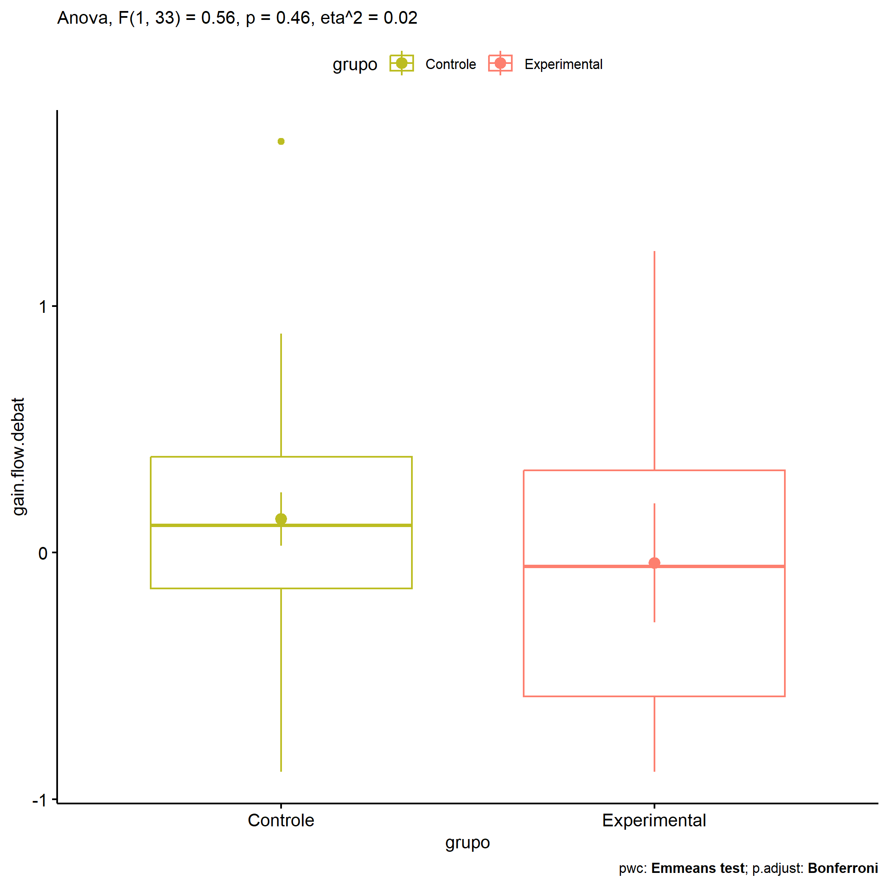

ANOVA in Gains for gain flow (debate) (gain flow (debate))
================
Geiser C. Challco <geiser@alumni.usp.br>

- [Descriptive Statistics of Initial
  Data](#descriptive-statistics-of-initial-data)
- [Checking of Assumptions](#checking-of-assumptions)
  - [Assumption: Normality distribution of
    data](#assumption-normality-distribution-of-data)
  - [Assumption: Homogeneity of data
    distribution](#assumption-homogeneity-of-data-distribution)
- [Computation of ANCOVA test and Pairwise
  Comparison](#computation-of-ancova-test-and-pairwise-comparison)
  - [ANCOVA tests for one factor](#ancova-tests-for-one-factor)
  - [ANCOVA tests for two factors](#ancova-tests-for-two-factors)
  - [Pairwise comparisons for one factor:
    **grupo**](#pairwise-comparisons-for-one-factor-grupo)
  - [Pairwise comparisons for two
    factors](#pairwise-comparisons-for-two-factors)
    - [factores: **grupo:Sexo**](#factores-gruposexo)
    - [factores: **grupo:Zona**](#factores-grupozona)
    - [factores: **grupo:Cor.Raca**](#factores-grupocorraca)

**NOTE**

- Teste ANOVA para determinar se houve diferenças significativas no gain
  flow (debate) (medido usando a diferença entre post-test e
  pre-testes).
- ANOVA test to determine whether there were significant differences in
  gain flow (debate) (measured using the difference between post-test
  and pre-tests).

# Descriptive Statistics of Initial Data

| grupo        | Sexo | Zona   | Cor.Raca | variable        |   n |   mean | median |    min |    max |    sd |    se |     ci |   iqr |
|:-------------|:-----|:-------|:---------|:----------------|----:|-------:|-------:|-------:|-------:|------:|------:|-------:|------:|
| Controle     | F    |        |          | gain.flow.debat |  15 |  0.040 |  0.000 | -0.889 |  0.889 | 0.514 | 0.133 |  0.285 | 0.646 |
| Controle     | M    |        |          | gain.flow.debat |  12 |  0.257 |  0.167 | -0.889 |  1.667 | 0.626 | 0.181 |  0.398 | 0.306 |
| Experimental | F    |        |          | gain.flow.debat |   4 | -0.111 | -0.056 | -0.667 |  0.333 | 0.416 | 0.208 |  0.662 | 0.333 |
| Experimental | M    |        |          | gain.flow.debat |   4 |  0.028 | -0.111 | -0.889 |  1.222 | 0.949 | 0.474 |  1.510 | 1.194 |
| Controle     |      | Rural  |          | gain.flow.debat |  18 |  0.202 |  0.278 | -0.889 |  0.889 | 0.474 | 0.112 |  0.236 | 0.528 |
| Controle     |      | Urbana |          | gain.flow.debat |   3 |  0.519 |  0.000 | -0.111 |  1.667 | 0.996 | 0.575 |  2.474 | 0.889 |
| Controle     |      |        |          | gain.flow.debat |   6 | -0.252 | -0.090 | -0.889 |  0.222 | 0.471 | 0.192 |  0.494 | 0.712 |
| Experimental |      | Rural  |          | gain.flow.debat |   8 | -0.042 | -0.056 | -0.889 |  1.222 | 0.682 | 0.241 |  0.570 | 0.917 |
| Controle     |      |        | Branca   | gain.flow.debat |   3 |  0.000 |  0.111 | -0.333 |  0.222 | 0.294 | 0.170 |  0.730 | 0.278 |
| Controle     |      |        | Parda    | gain.flow.debat |  16 |  0.137 |  0.000 | -0.889 |  1.667 | 0.655 | 0.164 |  0.349 | 0.556 |
| Controle     |      |        | Preta    | gain.flow.debat |   1 |  0.222 |  0.222 |  0.222 |  0.222 |       |       |        | 0.000 |
| Controle     |      |        |          | gain.flow.debat |   7 |  0.181 |  0.333 | -0.778 |  0.778 | 0.523 | 0.198 |  0.484 | 0.535 |
| Experimental |      |        | Branca   | gain.flow.debat |   2 |  0.167 |  0.167 |  0.000 |  0.333 | 0.236 | 0.167 |  2.118 | 0.167 |
| Experimental |      |        | Indígena | gain.flow.debat |   2 |  0.111 |  0.111 | -0.111 |  0.333 | 0.314 | 0.222 |  2.824 | 0.222 |
| Experimental |      |        | Parda    | gain.flow.debat |   2 | -0.722 | -0.722 | -0.889 | -0.556 | 0.236 | 0.167 |  2.118 | 0.167 |
| Experimental |      |        |          | gain.flow.debat |   2 |  0.278 |  0.278 | -0.667 |  1.222 | 1.336 | 0.944 | 12.000 | 0.944 |

# Checking of Assumptions

## Assumption: Normality distribution of data

| var             |   n |  skewness |   kurtosis | symmetry | statistic | method       |         p | p.signif | normality |
|:----------------|----:|----------:|-----------:|:---------|----------:|:-------------|----------:|:---------|:----------|
| gain.flow.debat |  35 | 0.2677058 | -0.0819199 | YES      | 0.9818655 | Shapiro-Wilk | 0.8180697 | ns       | YES       |
| gain.flow.debat |  29 | 0.2635558 | -0.5038719 | YES      | 0.9749070 | Shapiro-Wilk | 0.6980239 | ns       | YES       |
| gain.flow.debat |  26 | 0.5611786 |  1.3969858 | NO       | 0.9245382 | Shapiro-Wilk | 0.0574997 | ns       | YES       |

## Assumption: Homogeneity of data distribution

| var             | method        | formula                               |   n | df1 | df2 | statistic |         p | p.signif |
|:----------------|:--------------|:--------------------------------------|----:|----:|----:|----------:|----------:|:---------|
| gain.flow.debat | Levene’s test | `gain.flow.debat`~`grupo`\*`Sexo`     |  35 |   3 |  31 | 1.1940832 | 0.3281763 | ns       |
| gain.flow.debat | Levene’s test | `gain.flow.debat`~`grupo`\*`Zona`     |  29 |   2 |  26 | 0.6212661 | 0.5450501 | ns       |
| gain.flow.debat | Levene’s test | `gain.flow.debat`~`grupo`\*`Cor.Raca` |  26 |   5 |  20 | 0.6536821 | 0.6622255 | ns       |

# Computation of ANCOVA test and Pairwise Comparison

## ANCOVA tests for one factor

| Effect   | DFn | DFd |   SSn |    SSd |     F |     p |   ges | p\<.05 |
|:---------|----:|----:|------:|-------:|------:|------:|------:|:-------|
| grupo    |   1 |  33 | 0.195 | 11.586 | 0.557 | 0.461 | 0.017 |        |
| Sexo     |   1 |  33 | 0.319 | 11.462 | 0.918 | 0.345 | 0.027 |        |
| Zona     |   1 |  27 | 0.412 |  9.385 | 1.185 | 0.286 | 0.042 |        |
| Cor.Raca |   3 |  22 | 0.038 |  8.163 | 0.034 | 0.991 | 0.005 |        |

## ANCOVA tests for two factors

|     | Effect         | DFn | DFd |   SSn |    SSd |     F |     p |   ges | p\<.05 |
|:----|:---------------|----:|----:|------:|-------:|------:|------:|------:|:-------|
| 3   | grupo:Sexo     |   1 |  31 | 0.009 | 11.233 | 0.026 | 0.873 | 0.001 |        |
| 6   | grupo:Zona     |   0 |  26 |       |  9.056 |       |       |       |        |
| 9   | grupo:Cor.Raca |   1 |  20 | 0.754 |  6.817 | 2.213 | 0.152 | 0.100 |        |

## Pairwise comparisons for one factor: **grupo**

| var             | grupo        |   n |      M |    SE |
|:----------------|:-------------|----:|-------:|------:|
| gain.flow.debat | Controle     |  27 |  0.136 | 0.109 |
| gain.flow.debat | Experimental |   8 | -0.042 | 0.241 |

| .y.             | group1   | group2       | estimate | conf.low | conf.high |    se | statistic |     p | p.adj | p.adj.signif |
|:----------------|:---------|:-------------|---------:|---------:|----------:|------:|----------:|------:|------:|:-------------|
| gain.flow.debat | Controle | Experimental |    0.178 |   -0.307 |     0.663 | 0.239 |     0.746 | 0.461 | 0.461 | ns           |

    ## Scale for colour is already present.
    ## Adding another scale for colour, which will replace the existing scale.

<!-- -->

## Pairwise comparisons for two factors

### factores: **grupo:Sexo**

### factores: **grupo:Zona**

### factores: **grupo:Cor.Raca**
