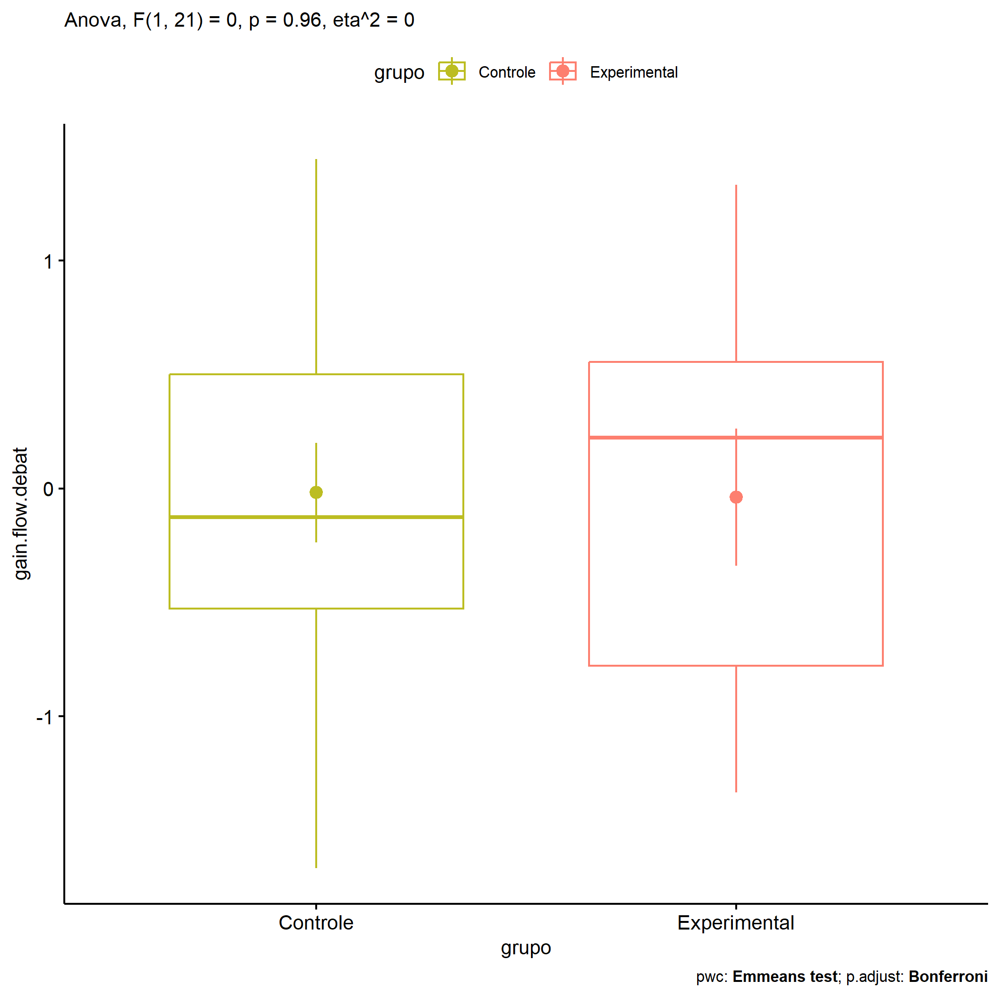

ANOVA in Gains for gain flow (debate) (gain flow (debate))
================
Geiser C. Challco <geiser@alumni.usp.br>

- [Descriptive Statistics of Initial
  Data](#descriptive-statistics-of-initial-data)
- [Checking of Assumptions](#checking-of-assumptions)
  - [Assumption: Normality distribution of
    data](#assumption-normality-distribution-of-data)
  - [Assumption: Homogeneity of data
    distribution](#assumption-homogeneity-of-data-distribution)
- [Computation of ANCOVA test and Pairwise
  Comparison](#computation-of-ancova-test-and-pairwise-comparison)
  - [ANCOVA tests for one factor](#ancova-tests-for-one-factor)
  - [ANCOVA tests for two factors](#ancova-tests-for-two-factors)
  - [Pairwise comparisons for one factor:
    **grupo**](#pairwise-comparisons-for-one-factor-grupo)
  - [Pairwise comparisons for two
    factors](#pairwise-comparisons-for-two-factors)
    - [factores: **grupo:Sexo**](#factores-gruposexo)
    - [factores: **grupo:Zona**](#factores-grupozona)
    - [factores: **grupo:Cor.Raca**](#factores-grupocorraca)

**NOTE**

- Teste ANOVA para determinar se houve diferenças significativas no gain
  flow (debate) (medido usando a diferença entre post-test e
  pre-testes).
- ANOVA test to determine whether there were significant differences in
  gain flow (debate) (measured using the difference between post-test
  and pre-tests).

# Descriptive Statistics of Initial Data

| grupo        | Sexo | Zona   | Cor.Raca | variable        |   n |   mean | median |    min |    max |    sd |    se |    ci |   iqr |
|:-------------|:-----|:-------|:---------|:----------------|----:|-------:|-------:|-------:|-------:|------:|------:|------:|------:|
| Controle     | F    |        |          | gain.flow.debat |   5 |  0.178 |  0.333 | -0.556 |  0.778 | 0.553 | 0.247 | 0.687 | 0.778 |
| Controle     | M    |        |          | gain.flow.debat |   9 | -0.127 | -0.333 | -1.667 |  1.444 | 0.948 | 0.316 | 0.729 | 0.667 |
| Experimental | F    |        |          | gain.flow.debat |   1 |  0.556 |  0.556 |  0.556 |  0.556 |       |       |       | 0.000 |
| Experimental | M    |        |          | gain.flow.debat |   8 | -0.113 | -0.063 | -1.333 |  1.333 | 0.934 | 0.330 | 0.781 | 1.361 |
| Controle     |      | Rural  |          | gain.flow.debat |   6 | -0.093 | -0.444 | -1.667 |  1.444 | 1.164 | 0.475 | 1.222 | 1.306 |
| Controle     |      | Urbana |          | gain.flow.debat |   3 | -0.048 | -0.032 | -0.222 |  0.111 | 0.167 | 0.097 | 0.415 | 0.167 |
| Controle     |      |        |          | gain.flow.debat |   5 |  0.089 |  0.333 | -0.778 |  0.778 | 0.669 | 0.299 | 0.830 | 1.000 |
| Experimental |      | Rural  |          | gain.flow.debat |   6 |  0.148 |  0.500 | -1.333 |  1.333 | 0.998 | 0.407 | 1.047 | 1.111 |
| Experimental |      |        |          | gain.flow.debat |   3 | -0.412 | -0.347 | -1.111 |  0.222 | 0.669 | 0.386 | 1.662 | 0.667 |
| Controle     |      |        | Parda    | gain.flow.debat |   9 |  0.025 | -0.222 | -1.667 |  1.444 | 0.947 | 0.316 | 0.728 | 1.000 |
| Controle     |      |        |          | gain.flow.debat |   5 | -0.095 | -0.032 | -0.778 |  0.778 | 0.610 | 0.273 | 0.757 | 0.667 |
| Experimental |      |        | Branca   | gain.flow.debat |   1 | -1.333 | -1.333 | -1.333 | -1.333 |       |       |       | 0.000 |
| Experimental |      |        | Indígena | gain.flow.debat |   1 |  0.222 |  0.222 |  0.222 |  0.222 |       |       |       | 0.000 |
| Experimental |      |        | Parda    | gain.flow.debat |   3 |  0.556 |  0.556 |  0.444 |  0.667 | 0.111 | 0.064 | 0.276 | 0.111 |
| Experimental |      |        |          | gain.flow.debat |   4 | -0.226 | -0.562 | -1.111 |  1.333 | 1.085 | 0.543 | 1.727 | 0.934 |

# Checking of Assumptions

## Assumption: Normality distribution of data

| var             |   n |   skewness |   kurtosis | symmetry | statistic | method       |         p | p.signif | normality |
|:----------------|----:|-----------:|-----------:|:---------|----------:|:-------------|----------:|:---------|:----------|
| gain.flow.debat |  23 |  0.1745297 | -0.7016055 | YES      | 0.9832678 | Shapiro-Wilk | 0.9535498 | ns       | YES       |
| gain.flow.debat |  15 | -0.0762335 | -0.9815518 | YES      | 0.9675192 | Shapiro-Wilk | 0.8197692 | ns       | YES       |
| gain.flow.debat |  14 | -0.1514781 |  0.2352372 | YES      | 0.9419811 | Shapiro-Wilk | 0.4442976 | ns       | YES       |

## Assumption: Homogeneity of data distribution

| var             | method        | formula                               |   n | df1 | df2 | statistic |         p | p.signif |
|:----------------|:--------------|:--------------------------------------|----:|----:|----:|----------:|----------:|:---------|
| gain.flow.debat | Levene’s test | `gain.flow.debat`~`grupo`\*`Sexo`     |  23 |   3 |  19 | 0.9895371 | 0.4188300 | ns       |
| gain.flow.debat | Levene’s test | `gain.flow.debat`~`grupo`\*`Zona`     |  15 |   2 |  12 | 1.0658866 | 0.3748932 | ns       |
| gain.flow.debat | Levene’s test | `gain.flow.debat`~`grupo`\*`Cor.Raca` |  14 |   3 |  10 | 1.5549418 | 0.2607688 | ns       |

# Computation of ANCOVA test and Pairwise Comparison

## ANCOVA tests for one factor

| Effect   | DFn | DFd |   SSn |    SSd |     F |     p |   ges | p\<.05 |
|:---------|----:|----:|------:|-------:|------:|------:|------:|:-------|
| grupo    |   1 |  21 | 0.002 | 15.215 | 0.003 | 0.956 | 0.000 |        |
| Sexo     |   1 |  21 | 0.578 | 14.639 | 0.829 | 0.373 | 0.038 |        |
| Zona     |   1 |  13 | 0.014 | 11.985 | 0.015 | 0.905 | 0.001 |        |
| Cor.Raca |   2 |  11 | 2.081 |  7.838 | 1.460 | 0.274 | 0.210 |        |

## ANCOVA tests for two factors

|     | Effect         | DFn | DFd |   SSn |    SSd |    F |     p |   ges | p\<.05 |
|:----|:---------------|----:|----:|------:|-------:|-----:|------:|------:|:-------|
| 3   | grupo:Sexo     |   1 |  19 | 0.092 | 14.519 | 0.12 | 0.732 | 0.006 |        |
| 6   | grupo:Zona     |   0 |  12 |       | 11.811 |      |       |       |        |
| 9   | grupo:Cor.Raca |   0 |  10 |       |  7.204 |      |       |       |        |

## Pairwise comparisons for one factor: **grupo**

| var             | grupo        |   n |      M |    SE |
|:----------------|:-------------|----:|-------:|------:|
| gain.flow.debat | Controle     |  14 | -0.018 | 0.219 |
| gain.flow.debat | Experimental |   9 | -0.039 | 0.301 |

| .y.             | group1   | group2       | estimate | conf.low | conf.high |    se | statistic |     p | p.adj | p.adj.signif |
|:----------------|:---------|:-------------|---------:|---------:|----------:|------:|----------:|------:|------:|:-------------|
| gain.flow.debat | Controle | Experimental |     0.02 |   -0.736 |     0.777 | 0.364 |     0.056 | 0.956 | 0.956 | ns           |

    ## Scale for colour is already present.
    ## Adding another scale for colour, which will replace the existing scale.

<!-- -->

## Pairwise comparisons for two factors

### factores: **grupo:Sexo**

| var             | grupo        | Sexo |   n |      M |    SE |
|:----------------|:-------------|:-----|----:|-------:|------:|
| gain.flow.debat | Controle     | F    |   5 |  0.178 | 0.247 |
| gain.flow.debat | Controle     | M    |   9 | -0.127 | 0.316 |
| gain.flow.debat | Experimental | M    |   8 | -0.113 | 0.330 |

|     | .y.             | grupo    | Sexo | group1   | group2       | estimate | conf.low | conf.high |    se | statistic |     p | p.adj | p.adj.signif |
|:----|:----------------|:---------|:-----|:---------|:-------------|---------:|---------:|----------:|------:|----------:|------:|------:|:-------------|
| 2   | gain.flow.debat |          | M    | Controle | Experimental |   -0.014 |   -0.903 |     0.875 | 0.425 |    -0.033 | 0.974 | 0.974 | ns           |
| 3   | gain.flow.debat | Controle |      | F        | M            |    0.305 |   -0.716 |     1.325 | 0.488 |     0.625 | 0.539 | 0.539 | ns           |

### factores: **grupo:Zona**

### factores: **grupo:Cor.Raca**
