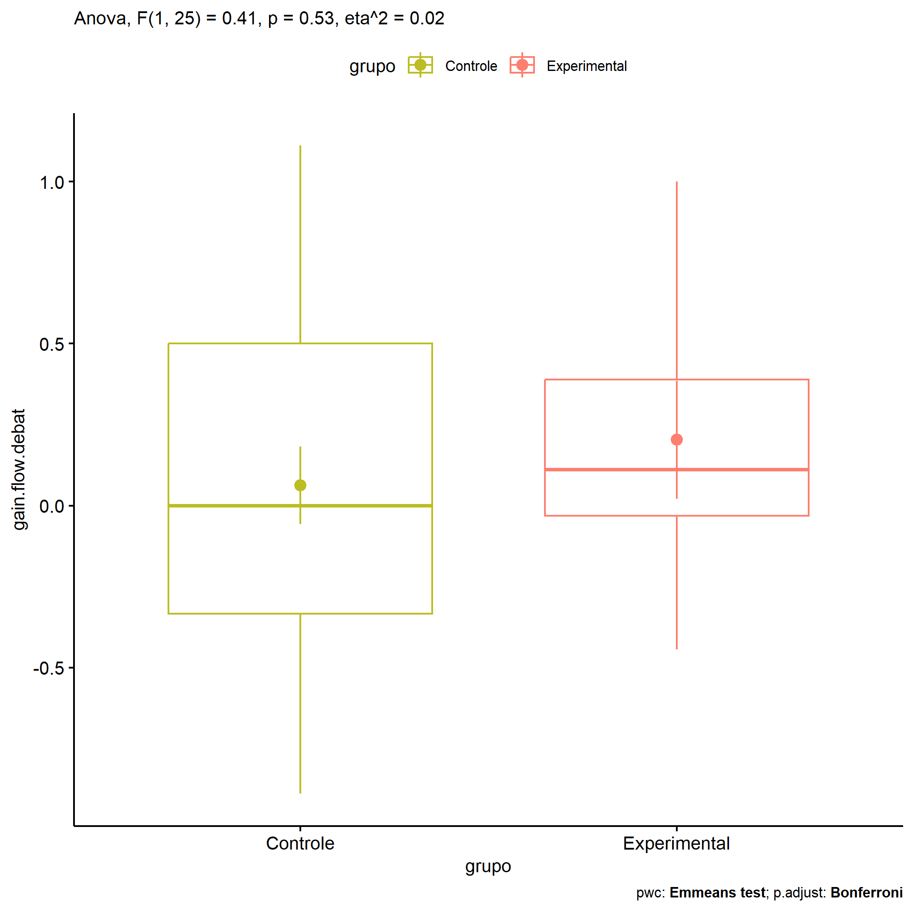

ANOVA in Gains for gain flow (debate) (gain flow (debate))
================
Geiser C. Challco <geiser@alumni.usp.br>

- [Descriptive Statistics of Initial
  Data](#descriptive-statistics-of-initial-data)
- [Checking of Assumptions](#checking-of-assumptions)
  - [Assumption: Normality distribution of
    data](#assumption-normality-distribution-of-data)
  - [Assumption: Homogeneity of data
    distribution](#assumption-homogeneity-of-data-distribution)
- [Computation of ANCOVA test and Pairwise
  Comparison](#computation-of-ancova-test-and-pairwise-comparison)
  - [ANCOVA tests for one factor](#ancova-tests-for-one-factor)
  - [ANCOVA tests for two factors](#ancova-tests-for-two-factors)
  - [Pairwise comparisons for one factor:
    **grupo**](#pairwise-comparisons-for-one-factor-grupo)
  - [Pairwise comparisons for two
    factors](#pairwise-comparisons-for-two-factors)
    - [factores: **grupo:Sexo**](#factores-gruposexo)
    - [factores: **grupo:Zona**](#factores-grupozona)
    - [factores: **grupo:Cor.Raca**](#factores-grupocorraca)

**NOTE**

- Teste ANOVA para determinar se houve diferenças significativas no gain
  flow (debate) (medido usando a diferença entre post-test e
  pre-testes).
- ANOVA test to determine whether there were significant differences in
  gain flow (debate) (measured using the difference between post-test
  and pre-tests).

# Descriptive Statistics of Initial Data

| grupo        | Sexo | Cor.Raca | variable        |   n |   mean | median |    min |    max |    sd |    se |    ci |   iqr |
|:-------------|:-----|:---------|:----------------|----:|-------:|-------:|-------:|-------:|------:|------:|------:|------:|
| Controle     | F    |          | gain.flow.debat |   6 | -0.130 | -0.278 | -0.333 |  0.667 | 0.394 | 0.161 | 0.413 | 0.111 |
| Controle     | M    |          | gain.flow.debat |  13 |  0.152 |  0.222 | -0.889 |  1.111 | 0.560 | 0.155 | 0.338 | 0.667 |
| Experimental | F    |          | gain.flow.debat |   3 |  0.667 |  0.889 |  0.111 |  1.000 | 0.484 | 0.280 | 1.203 | 0.444 |
| Experimental | M    |          | gain.flow.debat |   5 | -0.075 |  0.069 | -0.444 |  0.222 | 0.295 | 0.132 | 0.366 | 0.444 |
| Controle     |      | Branca   | gain.flow.debat |   1 | -0.889 | -0.889 | -0.889 | -0.889 |       |       |       | 0.000 |
| Controle     |      | Parda    | gain.flow.debat |   7 |  0.187 |  0.000 | -0.694 |  1.111 | 0.644 | 0.243 | 0.595 | 0.889 |
| Controle     |      |          | gain.flow.debat |  11 |  0.071 |  0.111 | -0.333 |  0.556 | 0.369 | 0.111 | 0.248 | 0.667 |
| Experimental |      | Branca   | gain.flow.debat |   2 | -0.056 | -0.056 | -0.333 |  0.222 | 0.393 | 0.278 | 3.530 | 0.278 |
| Experimental |      | Indígena | gain.flow.debat |   2 |  0.535 |  0.535 |  0.069 |  1.000 | 0.658 | 0.465 | 5.912 | 0.465 |
| Experimental |      | Parda    | gain.flow.debat |   2 | -0.167 | -0.167 | -0.444 |  0.111 | 0.393 | 0.278 | 3.530 | 0.278 |
| Experimental |      |          | gain.flow.debat |   2 |  0.500 |  0.500 |  0.111 |  0.889 | 0.550 | 0.389 | 4.941 | 0.389 |

# Checking of Assumptions

## Assumption: Normality distribution of data

| var             |   n |   skewness |   kurtosis | symmetry | statistic | method       |         p | p.signif | normality |
|:----------------|----:|-----------:|-----------:|:---------|----------:|:-------------|----------:|:---------|:----------|
| gain.flow.debat |  27 | -0.1438630 | -0.1408477 | YES      | 0.9844588 | Shapiro-Wilk | 0.9461990 | ns       | YES       |
| gain.flow.debat |  14 |  0.0894058 | -1.1003069 | YES      | 0.9637954 | Shapiro-Wilk | 0.7847487 | ns       | YES       |

## Assumption: Homogeneity of data distribution

| var             | method        | formula                               |   n | df1 | df2 | statistic |         p | p.signif |
|:----------------|:--------------|:--------------------------------------|----:|----:|----:|----------:|----------:|:---------|
| gain.flow.debat | Levene’s test | `gain.flow.debat`~`grupo`\*`Sexo`     |  27 |   3 |  23 | 0.8268590 | 0.4925970 | ns       |
| gain.flow.debat | Levene’s test | `gain.flow.debat`~`grupo`\*`Cor.Raca` |  14 |   4 |   9 | 0.7942766 | 0.5577245 | ns       |

# Computation of ANCOVA test and Pairwise Comparison

## ANCOVA tests for one factor

| Effect   | DFn | DFd |   SSn |   SSd |     F |     p |   ges | p\<.05 |
|:---------|----:|----:|------:|------:|------:|------:|------:|:-------|
| grupo    |   1 |  25 | 0.111 | 6.712 | 0.413 | 0.527 | 0.016 |        |
| Sexo     |   1 |  25 | 0.013 | 6.809 | 0.049 | 0.827 | 0.002 |        |
| Cor.Raca |   2 |  11 | 0.933 | 3.884 | 1.321 | 0.306 | 0.194 |        |

## ANCOVA tests for two factors

|     | Effect         | DFn | DFd |   SSn |   SSd |     F |     p |   ges | p\<.05 |
|:----|:---------------|----:|----:|------:|------:|------:|------:|------:|:-------|
| 3   | grupo:Sexo     |   1 |  23 | 1.347 | 5.355 | 5.785 | 0.025 | 0.201 | \*     |
| 6   | grupo:Cor.Raca |   1 |   9 | 0.657 | 3.227 | 1.832 | 0.209 | 0.169 |        |

## Pairwise comparisons for one factor: **grupo**

| var             | grupo        |   n |     M |    SE |
|:----------------|:-------------|----:|------:|------:|
| gain.flow.debat | Controle     |  19 | 0.063 | 0.119 |
| gain.flow.debat | Experimental |   8 | 0.203 | 0.182 |

| .y.             | group1   | group2       | estimate | conf.low | conf.high |    se | statistic |     p | p.adj | p.adj.signif |
|:----------------|:---------|:-------------|---------:|---------:|----------:|------:|----------:|------:|------:|:-------------|
| gain.flow.debat | Controle | Experimental |    -0.14 |    -0.59 |     0.309 | 0.218 |    -0.642 | 0.527 | 0.527 | ns           |

    ## Scale for colour is already present.
    ## Adding another scale for colour, which will replace the existing scale.

<!-- -->

## Pairwise comparisons for two factors

### factores: **grupo:Sexo**

| var             | grupo        | Sexo |   n |      M |    SE |
|:----------------|:-------------|:-----|----:|-------:|------:|
| gain.flow.debat | Controle     | F    |   6 | -0.130 | 0.161 |
| gain.flow.debat | Controle     | M    |  13 |  0.152 | 0.155 |
| gain.flow.debat | Experimental | M    |   5 | -0.075 | 0.132 |

|     | .y.             | grupo    | Sexo | group1   | group2       | estimate | conf.low | conf.high |    se | statistic |     p | p.adj | p.adj.signif |
|:----|:----------------|:---------|:-----|:---------|:-------------|---------:|---------:|----------:|------:|----------:|------:|------:|:-------------|
| 2   | gain.flow.debat |          | M    | Controle | Experimental |    0.227 |   -0.301 |     0.755 | 0.254 |     0.893 | 0.382 | 0.382 | ns           |
| 3   | gain.flow.debat | Controle |      | F        | M            |   -0.281 |   -0.776 |     0.214 | 0.238 |    -1.182 | 0.251 | 0.251 | ns           |

### factores: **grupo:Zona**

### factores: **grupo:Cor.Raca**
