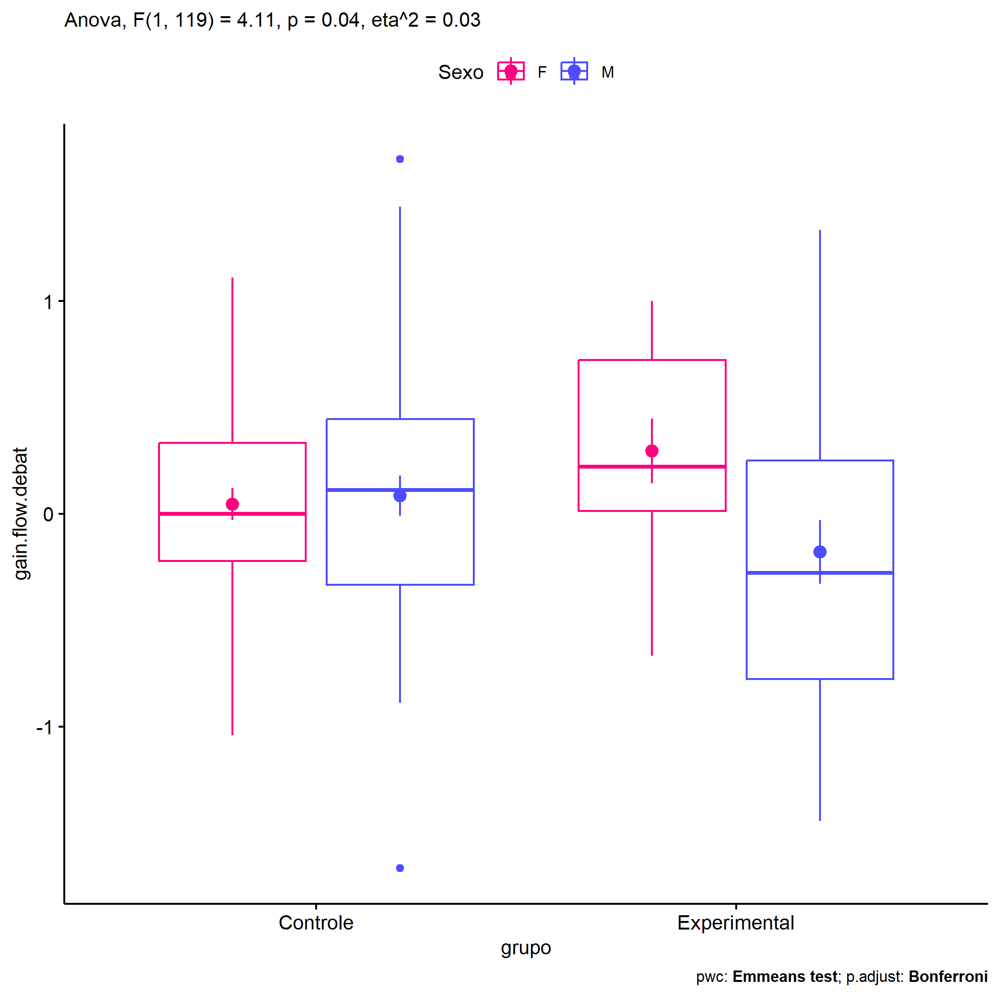
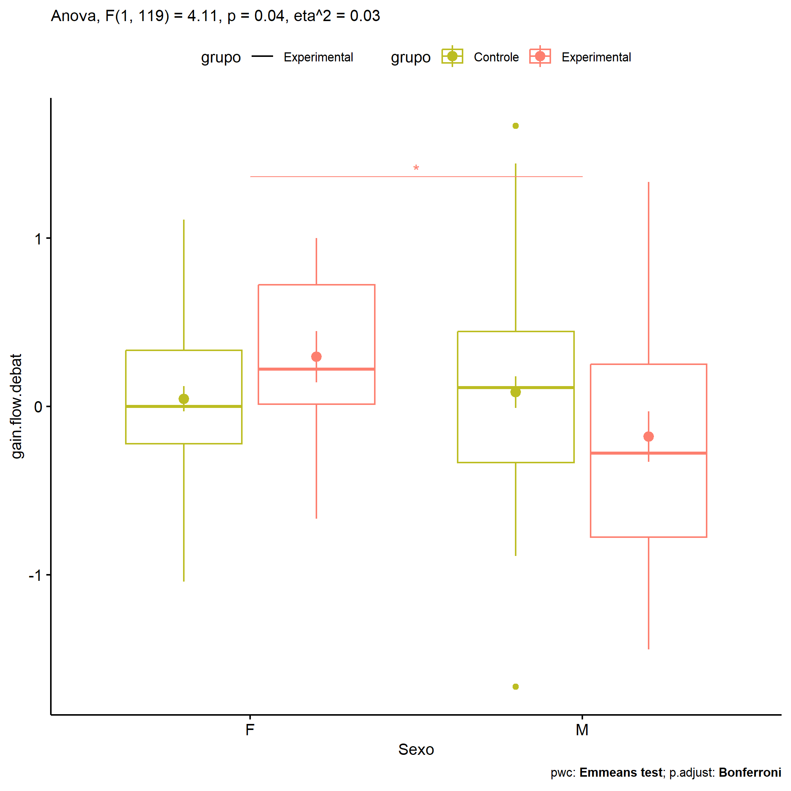
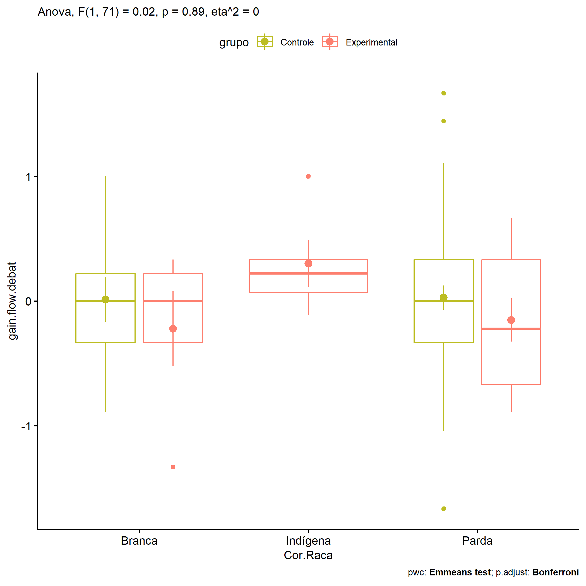

ANOVA in Gains for gain flow (debate) (gain flow (debate))
================
Geiser C. Challco <geiser@alumni.usp.br>

- [Descriptive Statistics of Initial
  Data](#descriptive-statistics-of-initial-data)
- [Checking of Assumptions](#checking-of-assumptions)
  - [Assumption: Normality distribution of
    data](#assumption-normality-distribution-of-data)
  - [Assumption: Homogeneity of data
    distribution](#assumption-homogeneity-of-data-distribution)
- [Computation of ANCOVA test and Pairwise
  Comparison](#computation-of-ancova-test-and-pairwise-comparison)
  - [ANCOVA tests for one factor](#ancova-tests-for-one-factor)
  - [ANCOVA tests for two factors](#ancova-tests-for-two-factors)
  - [Pairwise comparisons for one factor:
    **grupo**](#pairwise-comparisons-for-one-factor-grupo)
  - [Pairwise comparisons for two
    factors](#pairwise-comparisons-for-two-factors)
    - [factores: **grupo:Sexo**](#factores-gruposexo)
    - [factores: **grupo:Zona**](#factores-grupozona)
    - [factores: **grupo:Cor.Raca**](#factores-grupocorraca)

**NOTE**

- Teste ANOVA para determinar se houve diferenças significativas no gain
  flow (debate) (medido usando a diferença entre post-test e
  pre-testes).
- ANOVA test to determine whether there were significant differences in
  gain flow (debate) (measured using the difference between post-test
  and pre-tests).

# Descriptive Statistics of Initial Data

| grupo        | Sexo | Zona   | Cor.Raca | variable        |   n |   mean | median |    min |   max |    sd |    se |    ci |   iqr |
|:-------------|:-----|:-------|:---------|:----------------|----:|-------:|-------:|-------:|------:|------:|------:|------:|------:|
| Controle     | F    |        |          | gain.flow.debat |  41 |  0.045 |  0.000 | -1.042 | 1.111 | 0.481 | 0.075 | 0.152 | 0.556 |
| Controle     | M    |        |          | gain.flow.debat |  47 |  0.086 |  0.111 | -1.667 | 1.667 | 0.645 | 0.094 | 0.189 | 0.778 |
| Experimental | F    |        |          | gain.flow.debat |  11 |  0.295 |  0.222 | -0.667 | 1.000 | 0.506 | 0.153 | 0.340 | 0.708 |
| Experimental | M    |        |          | gain.flow.debat |  24 | -0.180 | -0.278 | -1.444 | 1.333 | 0.733 | 0.150 | 0.310 | 1.028 |
| Controle     |      | Rural  |          | gain.flow.debat |  54 |  0.086 |  0.000 | -1.667 | 1.444 | 0.584 | 0.079 | 0.159 | 0.722 |
| Controle     |      | Urbana |          | gain.flow.debat |   9 |  0.214 |  0.000 | -1.042 | 1.667 | 0.787 | 0.262 | 0.605 | 0.556 |
| Controle     |      |        |          | gain.flow.debat |  25 | -0.029 |  0.000 | -0.889 | 0.778 | 0.454 | 0.091 | 0.187 | 0.556 |
| Experimental |      | Rural  |          | gain.flow.debat |  29 | -0.033 |  0.028 | -1.444 | 1.333 | 0.718 | 0.133 | 0.273 | 0.958 |
| Experimental |      |        |          | gain.flow.debat |   6 | -0.021 |  0.111 | -1.111 | 0.889 | 0.666 | 0.272 | 0.699 | 0.427 |
| Controle     |      |        | Branca   | gain.flow.debat |   9 |  0.012 |  0.000 | -0.889 | 1.000 | 0.534 | 0.178 | 0.411 | 0.556 |
| Controle     |      |        | Parda    | gain.flow.debat |  46 |  0.028 |  0.000 | -1.667 | 1.667 | 0.657 | 0.097 | 0.195 | 0.667 |
| Controle     |      |        | Preta    | gain.flow.debat |   1 |  0.222 |  0.222 |  0.222 | 0.222 |       |       |       | 0.000 |
| Controle     |      |        |          | gain.flow.debat |  32 |  0.132 |  0.111 | -0.778 | 1.111 | 0.457 | 0.081 | 0.165 | 0.667 |
| Experimental |      |        | Branca   | gain.flow.debat |   5 | -0.222 |  0.000 | -1.333 | 0.333 | 0.671 | 0.300 | 0.834 | 0.556 |
| Experimental |      |        | Indígena | gain.flow.debat |   5 |  0.303 |  0.222 | -0.111 | 1.000 | 0.424 | 0.190 | 0.527 | 0.264 |
| Experimental |      |        | Parda    | gain.flow.debat |  11 | -0.152 | -0.222 | -0.889 | 0.667 | 0.576 | 0.174 | 0.387 | 1.000 |
| Experimental |      |        |          | gain.flow.debat |  14 |  0.014 |  0.069 | -1.444 | 1.333 | 0.871 | 0.233 | 0.503 | 1.406 |

# Checking of Assumptions

## Assumption: Normality distribution of data

| var             |   n |   skewness |   kurtosis | symmetry | statistic | method     |         p | p.signif | normality |
|:----------------|----:|-----------:|-----------:|:---------|----------:|:-----------|----------:|:---------|:----------|
| gain.flow.debat | 123 |  0.0989185 |  0.2247098 | YES      | 1.0323154 | D’Agostino | 0.5968093 | ns       | QQ        |
| gain.flow.debat |  92 | -0.0210277 | -0.0648629 | YES      | 0.1183419 | D’Agostino | 0.9425456 | ns       | YES       |
| gain.flow.debat |  77 |  0.1216327 |  0.2727716 | YES      | 1.1870674 | D’Agostino | 0.5523719 | ns       | YES       |

## Assumption: Homogeneity of data distribution

| var             | method        | formula                               |   n | df1 | df2 | statistic |         p | p.signif |
|:----------------|:--------------|:--------------------------------------|----:|----:|----:|----------:|----------:|:---------|
| gain.flow.debat | Levene’s test | `gain.flow.debat`~`grupo`\*`Sexo`     | 123 |   3 | 119 | 1.8801655 | 0.1366260 | ns       |
| gain.flow.debat | Levene’s test | `gain.flow.debat`~`grupo`\*`Zona`     |  92 |   2 |  89 | 0.9426780 | 0.3934379 | ns       |
| gain.flow.debat | Levene’s test | `gain.flow.debat`~`grupo`\*`Cor.Raca` |  77 |   5 |  71 | 0.5848079 | 0.7115046 | ns       |

# Computation of ANCOVA test and Pairwise Comparison

## ANCOVA tests for one factor

| Effect   | DFn | DFd |   SSn |    SSd |     F |     p |   ges | p\<.05 |
|:---------|----:|----:|------:|-------:|------:|------:|------:|:-------|
| grupo    |   1 | 121 | 0.236 | 45.045 | 0.634 | 0.427 | 0.005 |        |
| Sexo     |   1 | 121 | 0.312 | 44.969 | 0.839 | 0.362 | 0.007 |        |
| Zona     |   1 |  90 | 0.233 | 37.710 | 0.555 | 0.458 | 0.006 |        |
| Cor.Raca |   3 |  73 | 0.580 | 27.988 | 0.504 | 0.681 | 0.020 |        |

## ANCOVA tests for two factors

|     | Effect         | DFn | DFd |   SSn |    SSd |     F |     p |   ges | p\<.05 |
|:----|:---------------|----:|----:|------:|-------:|------:|------:|------:|:-------|
| 3   | grupo:Sexo     |   1 | 119 | 1.496 | 43.303 | 4.110 | 0.045 | 0.033 | \*     |
| 6   | grupo:Zona     |   0 |  89 |       | 37.443 |       |       |       |        |
| 9   | grupo:Cor.Raca |   1 |  71 | 0.007 | 27.525 | 0.018 | 0.892 | 0.000 |        |

## Pairwise comparisons for one factor: **grupo**

| var             | grupo        |   n |      M |    SE |
|:----------------|:-------------|----:|-------:|------:|
| gain.flow.debat | Controle     |  88 |  0.067 | 0.061 |
| gain.flow.debat | Experimental |  35 | -0.031 | 0.118 |

| .y.             | group1   | group2       | estimate | conf.low | conf.high |    se | statistic |     p | p.adj | p.adj.signif |
|:----------------|:---------|:-------------|---------:|---------:|----------:|------:|----------:|------:|------:|:-------------|
| gain.flow.debat | Controle | Experimental |    0.097 |   -0.144 |     0.339 | 0.122 |     0.796 | 0.427 | 0.427 | ns           |

    ## Scale for colour is already present.
    ## Adding another scale for colour, which will replace the existing scale.

<!-- -->

## Pairwise comparisons for two factors

### factores: **grupo:Sexo**

| var             | grupo        | Sexo |   n |      M |    SE |
|:----------------|:-------------|:-----|----:|-------:|------:|
| gain.flow.debat | Controle     | F    |  41 |  0.045 | 0.075 |
| gain.flow.debat | Controle     | M    |  47 |  0.086 | 0.094 |
| gain.flow.debat | Experimental | F    |  11 |  0.295 | 0.153 |
| gain.flow.debat | Experimental | M    |  24 | -0.180 | 0.150 |

| .y.             | grupo        | Sexo | group1   | group2       | estimate | conf.low | conf.high |    se | statistic |     p | p.adj | p.adj.signif |
|:----------------|:-------------|:-----|:---------|:-------------|---------:|---------:|----------:|------:|----------:|------:|------:|:-------------|
| gain.flow.debat |              | F    | Controle | Experimental |   -0.251 |   -0.656 |     0.155 | 0.205 |    -1.224 | 0.223 | 0.223 | ns           |
| gain.flow.debat |              | M    | Controle | Experimental |    0.266 |   -0.034 |     0.565 | 0.151 |     1.755 | 0.082 | 0.082 | ns           |
| gain.flow.debat | Controle     |      | F        | M            |   -0.041 |   -0.296 |     0.214 | 0.129 |    -0.317 | 0.752 | 0.752 | ns           |
| gain.flow.debat | Experimental |      | F        | M            |    0.475 |    0.041 |     0.910 | 0.220 |     2.165 | 0.032 | 0.032 | \*           |

    ## Scale for colour is already present.
    ## Adding another scale for colour, which will replace the existing scale.

<!-- -->

    ## Scale for colour is already present.
    ## Adding another scale for colour, which will replace the existing scale.

<!-- -->

### factores: **grupo:Zona**

| var             | grupo        | Zona   |   n |      M |    SE |
|:----------------|:-------------|:-------|----:|-------:|------:|
| gain.flow.debat | Controle     | Rural  |  54 |  0.086 | 0.079 |
| gain.flow.debat | Controle     | Urbana |   9 |  0.214 | 0.262 |
| gain.flow.debat | Experimental | Rural  |  29 | -0.033 | 0.133 |

|     | .y.             | grupo    | Zona  | group1   | group2       | estimate | conf.low | conf.high |    se | statistic |     p | p.adj | p.adj.signif |
|:----|:----------------|:---------|:------|:---------|:-------------|---------:|---------:|----------:|------:|----------:|------:|------:|:-------------|
| 1   | gain.flow.debat |          | Rural | Controle | Experimental |    0.119 |   -0.178 |     0.416 | 0.149 |     0.797 | 0.428 | 0.428 | ns           |
| 3   | gain.flow.debat | Controle |       | Rural    | Urbana       |   -0.128 |   -0.592 |     0.336 | 0.234 |    -0.547 | 0.586 | 0.586 | ns           |

### factores: **grupo:Cor.Raca**

| var             | grupo        | Cor.Raca |   n |      M |    SE |
|:----------------|:-------------|:---------|----:|-------:|------:|
| gain.flow.debat | Controle     | Branca   |   9 |  0.012 | 0.178 |
| gain.flow.debat | Controle     | Parda    |  46 |  0.028 | 0.097 |
| gain.flow.debat | Experimental | Branca   |   5 | -0.222 | 0.300 |
| gain.flow.debat | Experimental | Indígena |   5 |  0.303 | 0.190 |
| gain.flow.debat | Experimental | Parda    |  11 | -0.152 | 0.174 |

|     | .y.             | grupo        | Cor.Raca | group1   | group2       | estimate | conf.low | conf.high |    se | statistic |     p | p.adj | p.adj.signif |
|:----|:----------------|:-------------|:---------|:---------|:-------------|---------:|---------:|----------:|------:|----------:|------:|------:|:-------------|
| 1   | gain.flow.debat |              | Branca   | Controle | Experimental |    0.235 |   -0.458 |     0.927 | 0.347 |     0.675 | 0.502 | 0.502 | ns           |
| 3   | gain.flow.debat |              | Parda    | Controle | Experimental |    0.180 |   -0.237 |     0.596 | 0.209 |     0.859 | 0.393 | 0.393 | ns           |
| 5   | gain.flow.debat | Controle     |          | Branca   | Parda        |   -0.016 |   -0.468 |     0.437 | 0.227 |    -0.069 | 0.945 | 0.945 | ns           |
| 7   | gain.flow.debat | Experimental |          | Branca   | Indígena     |   -0.525 |   -1.310 |     0.260 | 0.394 |    -1.333 | 0.187 | 0.560 | ns           |
| 8   | gain.flow.debat | Experimental |          | Branca   | Parda        |   -0.071 |   -0.740 |     0.599 | 0.336 |    -0.211 | 0.834 | 1.000 | ns           |
| 9   | gain.flow.debat | Experimental |          | Indígena | Parda        |    0.454 |   -0.215 |     1.124 | 0.336 |     1.353 | 0.180 | 0.541 | ns           |

    ## Scale for colour is already present.
    ## Adding another scale for colour, which will replace the existing scale.

<!-- -->
