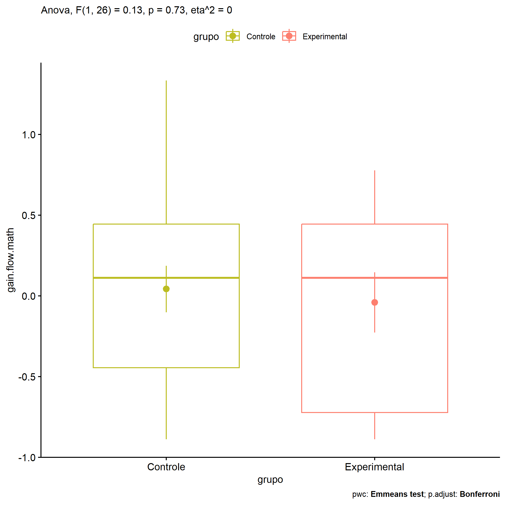

ANOVA in Gains for gain flow (prob. matemática) (gain flow (prob.
matemática))
================
Geiser C. Challco <geiser@alumni.usp.br>

- [Descriptive Statistics of Initial
  Data](#descriptive-statistics-of-initial-data)
- [Checking of Assumptions](#checking-of-assumptions)
  - [Assumption: Normality distribution of
    data](#assumption-normality-distribution-of-data)
  - [Assumption: Homogeneity of data
    distribution](#assumption-homogeneity-of-data-distribution)
- [Computation of ANCOVA test and Pairwise
  Comparison](#computation-of-ancova-test-and-pairwise-comparison)
  - [ANCOVA tests for one factor](#ancova-tests-for-one-factor)
  - [ANCOVA tests for two factors](#ancova-tests-for-two-factors)
  - [Pairwise comparisons for one factor:
    **grupo**](#pairwise-comparisons-for-one-factor-grupo)
  - [Pairwise comparisons for two
    factors](#pairwise-comparisons-for-two-factors)
    - [factores: **grupo:Sexo**](#factores-gruposexo)
    - [factores: **grupo:Zona**](#factores-grupozona)
    - [factores: **grupo:Cor.Raca**](#factores-grupocorraca)

**NOTE**

- Teste ANOVA para determinar se houve diferenças significativas no gain
  flow (prob. matemática) (medido usando a diferença entre post-test e
  pre-testes).
- ANOVA test to determine whether there were significant differences in
  gain flow (prob. matemática) (measured using the difference between
  post-test and pre-tests).

# Descriptive Statistics of Initial Data

| grupo        | Sexo | Zona   | Cor.Raca | variable       |   n |   mean | median |    min |    max |    sd |    se |    ci |   iqr |
|:-------------|:-----|:-------|:---------|:---------------|----:|-------:|-------:|-------:|-------:|------:|------:|------:|------:|
| Controle     | F    |        |          | gain.flow.math |   7 |  0.230 |  0.389 | -0.444 |  0.778 | 0.424 | 0.160 | 0.392 | 0.444 |
| Controle     | M    |        |          | gain.flow.math |  10 | -0.089 | -0.111 | -0.889 |  1.333 | 0.681 | 0.215 | 0.487 | 0.639 |
| Experimental | F    |        |          | gain.flow.math |   3 |  0.593 |  0.556 |  0.444 |  0.778 | 0.170 | 0.098 | 0.422 | 0.167 |
| Experimental | M    |        |          | gain.flow.math |   8 | -0.278 | -0.278 | -0.889 |  0.444 | 0.548 | 0.194 | 0.458 | 0.917 |
| Controle     |      | Rural  |          | gain.flow.math |   6 |  0.056 |  0.056 | -0.889 |  1.333 | 0.749 | 0.306 | 0.787 | 0.528 |
| Controle     |      | Urbana |          | gain.flow.math |   5 | -0.089 | -0.222 | -0.556 |  0.444 | 0.380 | 0.170 | 0.472 | 0.333 |
| Controle     |      |        |          | gain.flow.math |   6 |  0.139 |  0.417 | -0.889 |  0.778 | 0.653 | 0.267 | 0.686 | 0.764 |
| Experimental |      | Rural  |          | gain.flow.math |   6 | -0.222 | -0.278 | -0.889 |  0.778 | 0.659 | 0.269 | 0.692 | 0.861 |
| Experimental |      | Urbana |          | gain.flow.math |   2 |  0.500 |  0.500 |  0.444 |  0.556 | 0.079 | 0.056 | 0.706 | 0.056 |
| Experimental |      |        |          | gain.flow.math |   3 | -0.037 |  0.222 | -0.778 |  0.444 | 0.651 | 0.376 | 1.617 | 0.611 |
| Controle     |      |        | Parda    | gain.flow.math |   9 |  0.160 |  0.111 | -0.889 |  1.333 | 0.694 | 0.231 | 0.534 | 1.000 |
| Controle     |      |        |          | gain.flow.math |   8 | -0.090 | -0.056 | -0.889 |  0.444 | 0.469 | 0.166 | 0.392 | 0.569 |
| Experimental |      |        | Branca   | gain.flow.math |   1 | -0.778 | -0.778 | -0.778 | -0.778 |       |       |       | 0.000 |
| Experimental |      |        | Indígena | gain.flow.math |   1 |  0.444 |  0.444 |  0.444 |  0.444 |       |       |       | 0.000 |
| Experimental |      |        | Parda    | gain.flow.math |   3 |  0.333 |  0.111 |  0.111 |  0.778 | 0.385 | 0.222 | 0.956 | 0.333 |
| Experimental |      |        |          | gain.flow.math |   6 | -0.185 | -0.222 | -0.889 |  0.556 | 0.662 | 0.270 | 0.694 | 1.139 |

# Checking of Assumptions

## Assumption: Normality distribution of data

| var            |   n |  skewness |   kurtosis | symmetry | statistic | method       |         p | p.signif | normality |
|:---------------|----:|----------:|-----------:|:---------|----------:|:-------------|----------:|:---------|:----------|
| gain.flow.math |  28 | 0.4633290 | -0.0705196 | YES      | 0.9576625 | Shapiro-Wilk | 0.3064864 | ns       | YES       |
| gain.flow.math |  19 | 0.5189859 | -0.2407956 | NO       | 0.9618887 | Shapiro-Wilk | 0.6101061 | ns       | YES       |
| gain.flow.math |  14 | 0.1568972 | -0.4825354 | YES      | 0.9803160 | Shapiro-Wilk | 0.9765959 | ns       | YES       |

## Assumption: Homogeneity of data distribution

| var            | method        | formula                              |   n | df1 | df2 | statistic |         p | p.signif |
|:---------------|:--------------|:-------------------------------------|----:|----:|----:|----------:|----------:|:---------|
| gain.flow.math | Levene’s test | `gain.flow.math`~`grupo`\*`Sexo`     |  28 |   3 |  24 |  1.798359 | 0.1744141 | ns       |
| gain.flow.math | Levene’s test | `gain.flow.math`~`grupo`\*`Zona`     |  19 |   3 |  15 |  1.351773 | 0.2953126 | ns       |
| gain.flow.math | Levene’s test | `gain.flow.math`~`grupo`\*`Cor.Raca` |  14 |   3 |  10 |  1.316628 | 0.3228278 | ns       |

# Computation of ANCOVA test and Pairwise Comparison

## ANCOVA tests for one factor

| Effect   | DFn | DFd |   SSn |   SSd |     F |     p |   ges | p\<.05 |
|:---------|----:|----:|------:|------:|------:|------:|------:|:-------|
| grupo    |   1 |  26 | 0.046 | 9.473 | 0.126 | 0.726 | 0.005 |        |
| Sexo     |   1 |  26 | 1.683 | 7.835 | 5.586 | 0.026 | 0.177 | \*     |
| Zona     |   1 |  17 | 0.117 | 6.292 | 0.316 | 0.581 | 0.018 |        |
| Cor.Raca |   2 |  11 | 0.982 | 4.218 | 1.281 | 0.316 | 0.189 |        |

## ANCOVA tests for two factors

|     | Effect         | DFn | DFd |   SSn |   SSd |     F |     p |   ges | p\<.05 |
|:----|:---------------|----:|----:|------:|------:|------:|------:|------:|:-------|
| 3   | grupo:Sexo     |   1 |  24 | 0.433 | 7.401 | 1.406 | 0.247 | 0.055 |        |
| 6   | grupo:Zona     |   1 |  15 | 0.727 | 5.565 | 1.959 | 0.182 | 0.116 |        |
| 9   | grupo:Cor.Raca |   0 |  10 |       | 4.151 |       |       |       |        |

## Pairwise comparisons for one factor: **grupo**

| var            | grupo        |   n |      M |    SE |
|:---------------|:-------------|----:|-------:|------:|
| gain.flow.math | Controle     |  17 |  0.042 | 0.144 |
| gain.flow.math | Experimental |  11 | -0.040 | 0.186 |

| .y.            | group1   | group2       | estimate | conf.low | conf.high |    se | statistic |     p | p.adj | p.adj.signif |
|:---------------|:---------|:-------------|---------:|---------:|----------:|------:|----------:|------:|------:|:-------------|
| gain.flow.math | Controle | Experimental |    0.083 |   -0.397 |     0.563 | 0.234 |     0.355 | 0.726 | 0.726 | ns           |

    ## Scale for colour is already present.
    ## Adding another scale for colour, which will replace the existing scale.

<!-- -->

## Pairwise comparisons for two factors

### factores: **grupo:Sexo**

| var            | grupo        | Sexo |   n |      M |    SE |
|:---------------|:-------------|:-----|----:|-------:|------:|
| gain.flow.math | Controle     | F    |   7 |  0.230 | 0.160 |
| gain.flow.math | Controle     | M    |  10 | -0.089 | 0.215 |
| gain.flow.math | Experimental | M    |   8 | -0.278 | 0.194 |

|     | .y.            | grupo    | Sexo | group1   | group2       | estimate | conf.low | conf.high |    se | statistic |     p | p.adj | p.adj.signif |
|:----|:---------------|:---------|:-----|:---------|:-------------|---------:|---------:|----------:|------:|----------:|------:|------:|:-------------|
| 2   | gain.flow.math |          | M    | Controle | Experimental |    0.189 |   -0.379 |     0.757 | 0.274 |     0.689 | 0.498 | 0.498 | ns           |
| 3   | gain.flow.math | Controle |      | F        | M            |    0.319 |   -0.271 |     0.910 | 0.285 |     1.121 | 0.275 | 0.275 | ns           |

### factores: **grupo:Zona**

| var            | grupo        | Zona   |   n |      M |    SE |
|:---------------|:-------------|:-------|----:|-------:|------:|
| gain.flow.math | Controle     | Rural  |   6 |  0.056 | 0.306 |
| gain.flow.math | Controle     | Urbana |   5 | -0.089 | 0.170 |
| gain.flow.math | Experimental | Rural  |   6 | -0.222 | 0.269 |

|     | .y.            | grupo    | Zona  | group1   | group2       | estimate | conf.low | conf.high |    se | statistic |     p | p.adj | p.adj.signif |
|:----|:---------------|:---------|:------|:---------|:-------------|---------:|---------:|----------:|------:|----------:|------:|------:|:-------------|
| 1   | gain.flow.math |          | Rural | Controle | Experimental |    0.278 |   -0.503 |     1.058 | 0.364 |     0.764 | 0.458 | 0.458 | ns           |
| 3   | gain.flow.math | Controle |       | Rural    | Urbana       |    0.144 |   -0.674 |     0.963 | 0.382 |     0.379 | 0.711 | 0.711 | ns           |

### factores: **grupo:Cor.Raca**
