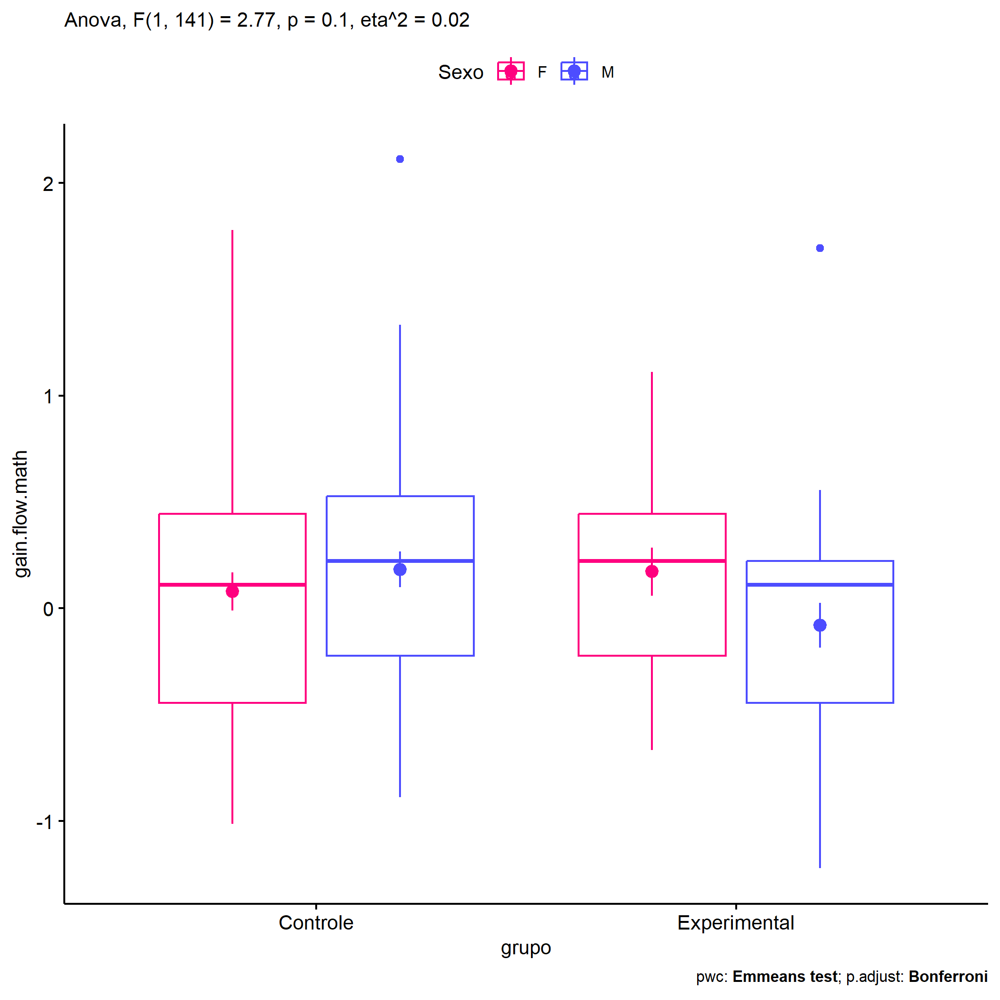
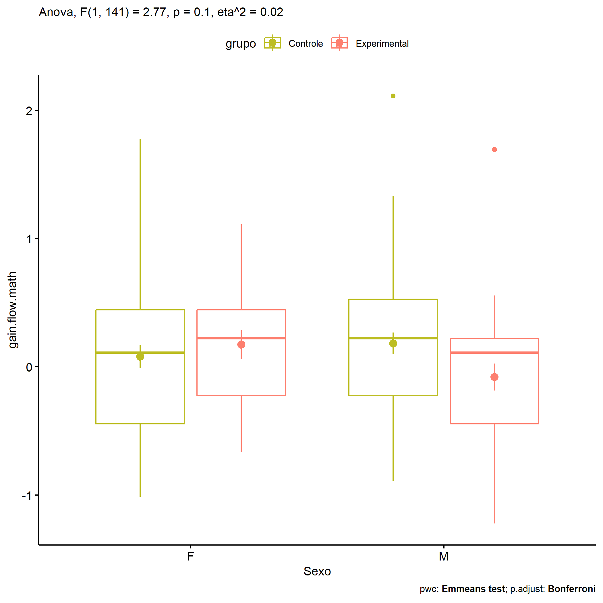
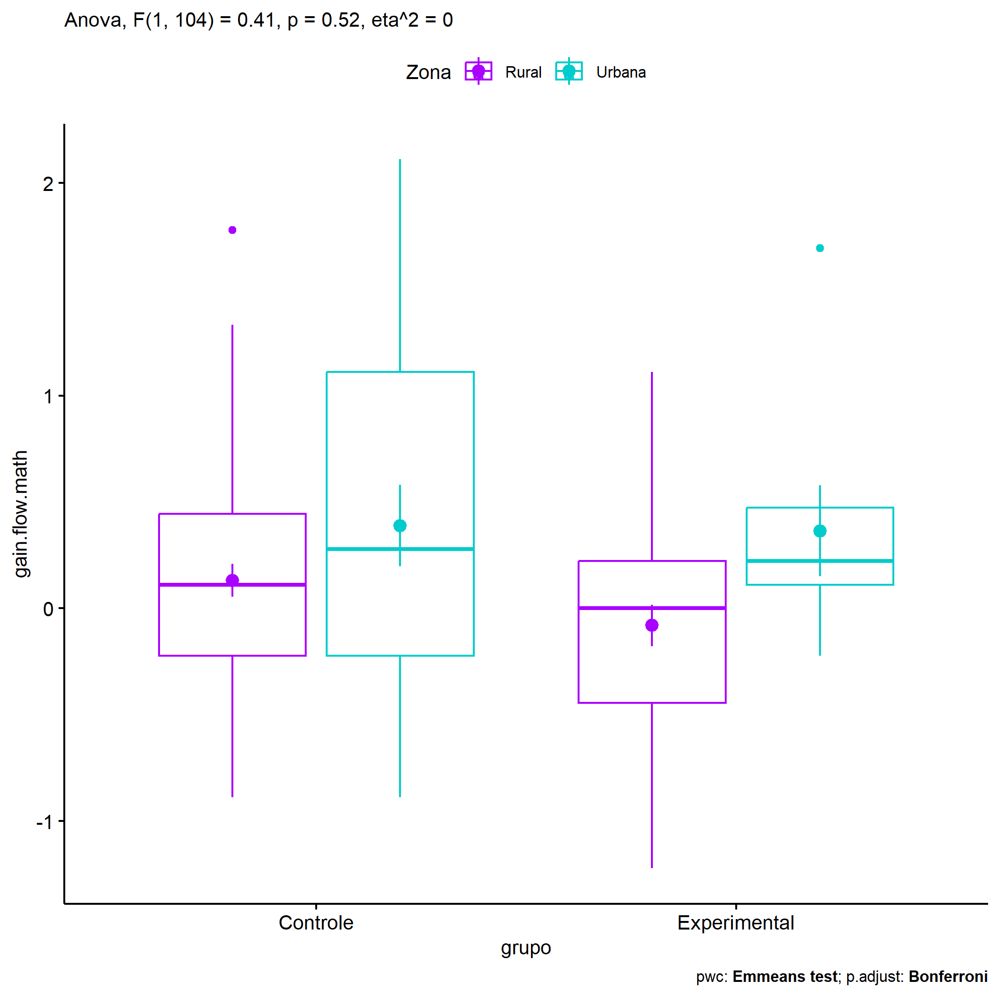
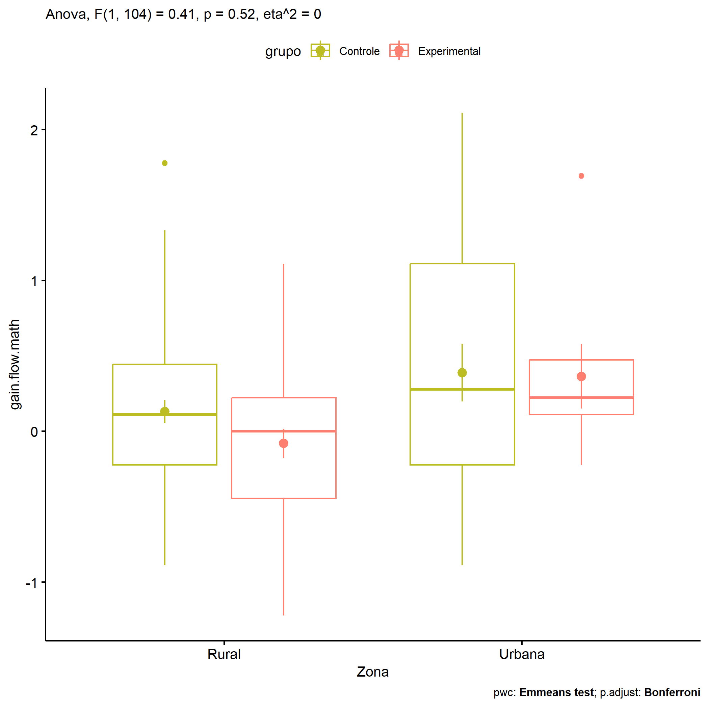
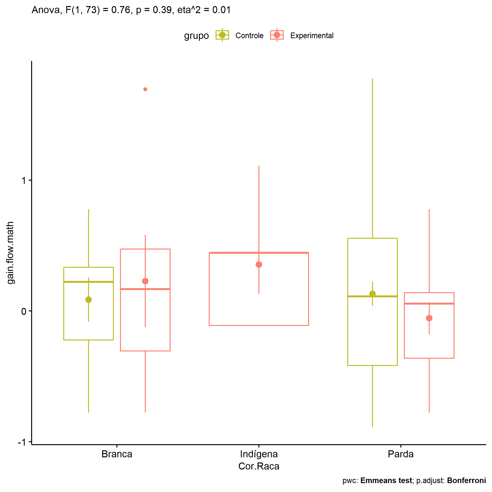

ANOVA in Gains for gain flow (prob. matemática) (gain flow (prob.
matemática))
================
Geiser C. Challco <geiser@alumni.usp.br>

- [Descriptive Statistics of Initial
  Data](#descriptive-statistics-of-initial-data)
- [Checking of Assumptions](#checking-of-assumptions)
  - [Assumption: Normality distribution of
    data](#assumption-normality-distribution-of-data)
  - [Assumption: Homogeneity of data
    distribution](#assumption-homogeneity-of-data-distribution)
- [Computation of ANCOVA test and Pairwise
  Comparison](#computation-of-ancova-test-and-pairwise-comparison)
  - [ANCOVA tests for one factor](#ancova-tests-for-one-factor)
  - [ANCOVA tests for two factors](#ancova-tests-for-two-factors)
  - [Pairwise comparisons for one factor:
    **grupo**](#pairwise-comparisons-for-one-factor-grupo)
  - [Pairwise comparisons for two
    factors](#pairwise-comparisons-for-two-factors)
    - [factores: **grupo:Sexo**](#factores-gruposexo)
    - [factores: **grupo:Zona**](#factores-grupozona)
    - [factores: **grupo:Cor.Raca**](#factores-grupocorraca)

**NOTE**

- Teste ANOVA para determinar se houve diferenças significativas no gain
  flow (prob. matemática) (medido usando a diferença entre post-test e
  pre-testes).
- ANOVA test to determine whether there were significant differences in
  gain flow (prob. matemática) (measured using the difference between
  post-test and pre-tests).

# Descriptive Statistics of Initial Data

| grupo        | Sexo | Zona   | Cor.Raca | variable       |   n |   mean | median |    min |    max |    sd |    se |    ci |   iqr |
|:-------------|:-----|:-------|:---------|:---------------|----:|-------:|-------:|-------:|-------:|------:|------:|------:|------:|
| Controle     | F    |        |          | gain.flow.math |  45 |  0.079 |  0.111 | -1.014 |  1.778 | 0.597 | 0.089 | 0.179 | 0.889 |
| Controle     | M    |        |          | gain.flow.math |  54 |  0.183 |  0.222 | -0.889 |  2.111 | 0.612 | 0.083 | 0.167 | 0.750 |
| Experimental | F    |        |          | gain.flow.math |  17 |  0.172 |  0.222 | -0.667 |  1.111 | 0.468 | 0.114 | 0.241 | 0.667 |
| Experimental | M    |        |          | gain.flow.math |  29 | -0.080 |  0.111 | -1.222 |  1.694 | 0.570 | 0.106 | 0.217 | 0.667 |
| Controle     |      | Rural  |          | gain.flow.math |  54 |  0.131 |  0.111 | -0.889 |  1.778 | 0.571 | 0.078 | 0.156 | 0.667 |
| Controle     |      | Urbana |          | gain.flow.math |  17 |  0.389 |  0.278 | -0.889 |  2.111 | 0.791 | 0.192 | 0.407 | 1.333 |
| Controle     |      |        |          | gain.flow.math |  28 | -0.010 |  0.111 | -1.014 |  0.778 | 0.504 | 0.095 | 0.195 | 0.764 |
| Experimental |      | Rural  |          | gain.flow.math |  29 | -0.080 |  0.000 | -1.222 |  1.111 | 0.523 | 0.097 | 0.199 | 0.667 |
| Experimental |      | Urbana |          | gain.flow.math |   8 |  0.365 |  0.222 | -0.222 |  1.694 | 0.605 | 0.214 | 0.506 | 0.361 |
| Experimental |      |        |          | gain.flow.math |   9 |  0.005 |  0.222 | -0.778 |  0.667 | 0.480 | 0.160 | 0.369 | 0.667 |
| Controle     |      |        | Branca   | gain.flow.math |   9 |  0.086 |  0.222 | -0.778 |  0.778 | 0.512 | 0.171 | 0.393 | 0.556 |
| Controle     |      |        | Parda    | gain.flow.math |  46 |  0.131 |  0.111 | -0.889 |  1.778 | 0.632 | 0.093 | 0.188 | 0.972 |
| Controle     |      |        | Preta    | gain.flow.math |   1 |  0.444 |  0.444 |  0.444 |  0.444 |       |       |       | 0.000 |
| Controle     |      |        |          | gain.flow.math |  43 |  0.143 |  0.222 | -1.014 |  2.111 | 0.609 | 0.093 | 0.188 | 0.639 |
| Experimental |      |        | Amarela  | gain.flow.math |   1 | -0.403 | -0.403 | -0.403 | -0.403 |       |       |       | 0.000 |
| Experimental |      |        | Branca   | gain.flow.math |   6 |  0.227 |  0.167 | -0.778 |  1.694 | 0.864 | 0.353 | 0.907 | 0.778 |
| Experimental |      |        | Indígena | gain.flow.math |   5 |  0.356 |  0.444 | -0.111 |  1.111 | 0.506 | 0.226 | 0.628 | 0.556 |
| Experimental |      |        | Parda    | gain.flow.math |  12 | -0.056 |  0.056 | -0.778 |  0.778 | 0.430 | 0.124 | 0.273 | 0.500 |
| Experimental |      |        |          | gain.flow.math |  22 | -0.066 |  0.111 | -1.222 |  0.667 | 0.501 | 0.107 | 0.222 | 0.528 |

# Checking of Assumptions

## Assumption: Normality distribution of data

| var            |   n |  skewness |   kurtosis | symmetry | statistic | method     |         p | p.signif | normality |
|:---------------|----:|----------:|-----------:|:---------|----------:|:-----------|----------:|:---------|:----------|
| gain.flow.math | 145 | 0.4859260 |  0.5315271 | YES      |  8.034281 | D’Agostino | 0.0180044 | ns       | QQ        |
| gain.flow.math | 108 | 0.3787855 |  0.0732105 | YES      |  3.173560 | D’Agostino | 0.2045833 | ns       | QQ        |
| gain.flow.math |  80 | 0.4155595 | -0.2024430 | YES      |  2.610572 | D’Agostino | 0.2710950 | ns       | YES       |

## Assumption: Homogeneity of data distribution

| var            | method        | formula                              |   n | df1 | df2 | statistic |         p | p.signif |
|:---------------|:--------------|:-------------------------------------|----:|----:|----:|----------:|----------:|:---------|
| gain.flow.math | Levene’s test | `gain.flow.math`~`grupo`\*`Sexo`     | 145 |   3 | 141 | 0.5655815 | 0.6385860 | ns       |
| gain.flow.math | Levene’s test | `gain.flow.math`~`grupo`\*`Zona`     | 108 |   3 | 104 | 1.4912406 | 0.2212859 | ns       |
| gain.flow.math | Levene’s test | `gain.flow.math`~`grupo`\*`Cor.Raca` |  80 |   6 |  73 | 1.3064870 | 0.2651711 | ns       |

# Computation of ANCOVA test and Pairwise Comparison

## ANCOVA tests for one factor

| Effect   | DFn | DFd |   SSn |    SSd |     F |     p |   ges | p\<.05 |
|:---------|----:|----:|------:|-------:|------:|------:|------:|:-------|
| grupo    |   1 | 143 | 0.468 | 49.101 | 1.364 | 0.245 | 0.009 |        |
| Sexo     |   1 | 143 | 0.006 | 49.564 | 0.017 | 0.895 | 0.000 |        |
| Zona     |   1 | 106 | 2.015 | 38.334 | 5.571 | 0.020 | 0.050 | \*     |
| Cor.Raca |   4 |  75 | 0.706 | 27.291 | 0.485 | 0.747 | 0.025 |        |

## ANCOVA tests for two factors

|     | Effect         | DFn | DFd |   SSn |    SSd |     F |     p |   ges | p\<.05 |
|:----|:---------------|----:|----:|------:|-------:|------:|------:|------:|:-------|
| 3   | grupo:Sexo     |   1 | 141 | 0.947 | 48.154 | 2.773 | 0.098 | 0.019 |        |
| 6   | grupo:Zona     |   1 | 104 | 0.148 | 37.485 | 0.412 | 0.523 | 0.004 |        |
| 9   | grupo:Cor.Raca |   1 |  73 | 0.280 | 26.888 | 0.760 | 0.386 | 0.010 |        |

## Pairwise comparisons for one factor: **grupo**

| var            | grupo        |   n |     M |    SE |
|:---------------|:-------------|----:|------:|------:|
| gain.flow.math | Controle     |  99 | 0.136 | 0.061 |
| gain.flow.math | Experimental |  46 | 0.014 | 0.080 |

| .y.            | group1   | group2       | estimate | conf.low | conf.high |    se | statistic |     p | p.adj | p.adj.signif |
|:---------------|:---------|:-------------|---------:|---------:|----------:|------:|----------:|------:|------:|:-------------|
| gain.flow.math | Controle | Experimental |    0.122 |   -0.085 |     0.329 | 0.105 |     1.168 | 0.245 | 0.245 | ns           |

    ## Scale for colour is already present.
    ## Adding another scale for colour, which will replace the existing scale.

<!-- -->

## Pairwise comparisons for two factors

### factores: **grupo:Sexo**

| var            | grupo        | Sexo |   n |      M |    SE |
|:---------------|:-------------|:-----|----:|-------:|------:|
| gain.flow.math | Controle     | F    |  45 |  0.079 | 0.089 |
| gain.flow.math | Controle     | M    |  54 |  0.183 | 0.083 |
| gain.flow.math | Experimental | F    |  17 |  0.172 | 0.114 |
| gain.flow.math | Experimental | M    |  29 | -0.080 | 0.106 |

| .y.            | grupo        | Sexo | group1   | group2       | estimate | conf.low | conf.high |    se | statistic |     p | p.adj | p.adj.signif |
|:---------------|:-------------|:-----|:---------|:-------------|---------:|---------:|----------:|------:|----------:|------:|------:|:-------------|
| gain.flow.math |              | F    | Controle | Experimental |   -0.094 |   -0.423 |     0.235 | 0.166 |    -0.563 | 0.574 | 0.574 | ns           |
| gain.flow.math |              | M    | Controle | Experimental |    0.263 |   -0.003 |     0.529 | 0.135 |     1.952 | 0.053 | 0.053 | ns           |
| gain.flow.math | Controle     |      | F        | M            |   -0.104 |   -0.338 |     0.129 | 0.118 |    -0.885 | 0.378 | 0.378 | ns           |
| gain.flow.math | Experimental |      | F        | M            |    0.252 |   -0.101 |     0.605 | 0.179 |     1.411 | 0.160 | 0.160 | ns           |

    ## Scale for colour is already present.
    ## Adding another scale for colour, which will replace the existing scale.

<!-- -->

    ## Scale for colour is already present.
    ## Adding another scale for colour, which will replace the existing scale.

<!-- -->

### factores: **grupo:Zona**

| var            | grupo        | Zona   |   n |      M |    SE |
|:---------------|:-------------|:-------|----:|-------:|------:|
| gain.flow.math | Controle     | Rural  |  54 |  0.131 | 0.078 |
| gain.flow.math | Controle     | Urbana |  17 |  0.389 | 0.192 |
| gain.flow.math | Experimental | Rural  |  29 | -0.080 | 0.097 |
| gain.flow.math | Experimental | Urbana |   8 |  0.365 | 0.214 |

| .y.            | grupo        | Zona   | group1   | group2       | estimate | conf.low | conf.high |    se | statistic |     p | p.adj | p.adj.signif |
|:---------------|:-------------|:-------|:---------|:-------------|---------:|---------:|----------:|------:|----------:|------:|------:|:-------------|
| gain.flow.math |              | Rural  | Controle | Experimental |    0.212 |   -0.062 |     0.486 | 0.138 |     1.532 | 0.129 | 0.129 | ns           |
| gain.flow.math |              | Urbana | Controle | Experimental |    0.024 |   -0.486 |     0.535 | 0.257 |     0.094 | 0.925 | 0.925 | ns           |
| gain.flow.math | Controle     |        | Rural    | Urbana       |   -0.258 |   -0.589 |     0.073 | 0.167 |    -1.543 | 0.126 | 0.126 | ns           |
| gain.flow.math | Experimental |        | Rural    | Urbana       |   -0.445 |   -0.920 |     0.030 | 0.240 |    -1.856 | 0.066 | 0.066 | ns           |

    ## Scale for colour is already present.
    ## Adding another scale for colour, which will replace the existing scale.

<!-- -->

    ## Scale for colour is already present.
    ## Adding another scale for colour, which will replace the existing scale.

<!-- -->

### factores: **grupo:Cor.Raca**

| var            | grupo        | Cor.Raca |   n |      M |    SE |
|:---------------|:-------------|:---------|----:|-------:|------:|
| gain.flow.math | Controle     | Branca   |   9 |  0.086 | 0.171 |
| gain.flow.math | Controle     | Parda    |  46 |  0.131 | 0.093 |
| gain.flow.math | Experimental | Branca   |   6 |  0.227 | 0.353 |
| gain.flow.math | Experimental | Indígena |   5 |  0.356 | 0.226 |
| gain.flow.math | Experimental | Parda    |  12 | -0.056 | 0.124 |

|     | .y.            | grupo        | Cor.Raca | group1   | group2       | estimate | conf.low | conf.high |    se | statistic |     p | p.adj | p.adj.signif |
|:----|:---------------|:-------------|:---------|:---------|:-------------|---------:|---------:|----------:|------:|----------:|------:|------:|:-------------|
| 1   | gain.flow.math |              | Branca   | Controle | Experimental |   -0.140 |   -0.778 |     0.497 | 0.320 |    -0.439 | 0.662 | 0.662 | ns           |
| 3   | gain.flow.math |              | Parda    | Controle | Experimental |    0.187 |   -0.205 |     0.579 | 0.197 |     0.950 | 0.345 | 0.345 | ns           |
| 5   | gain.flow.math | Controle     |          | Branca   | Parda        |   -0.045 |   -0.486 |     0.396 | 0.221 |    -0.203 | 0.840 | 0.840 | ns           |
| 7   | gain.flow.math | Experimental |          | Branca   | Indígena     |   -0.129 |   -0.861 |     0.604 | 0.367 |    -0.350 | 0.727 | 1.000 | ns           |
| 8   | gain.flow.math | Experimental |          | Branca   | Parda        |    0.282 |   -0.322 |     0.887 | 0.303 |     0.931 | 0.355 | 1.000 | ns           |
| 9   | gain.flow.math | Experimental |          | Indígena | Parda        |    0.411 |   -0.233 |     1.055 | 0.323 |     1.273 | 0.207 | 0.622 | ns           |

    ## Scale for colour is already present.
    ## Adding another scale for colour, which will replace the existing scale.

<!-- -->
