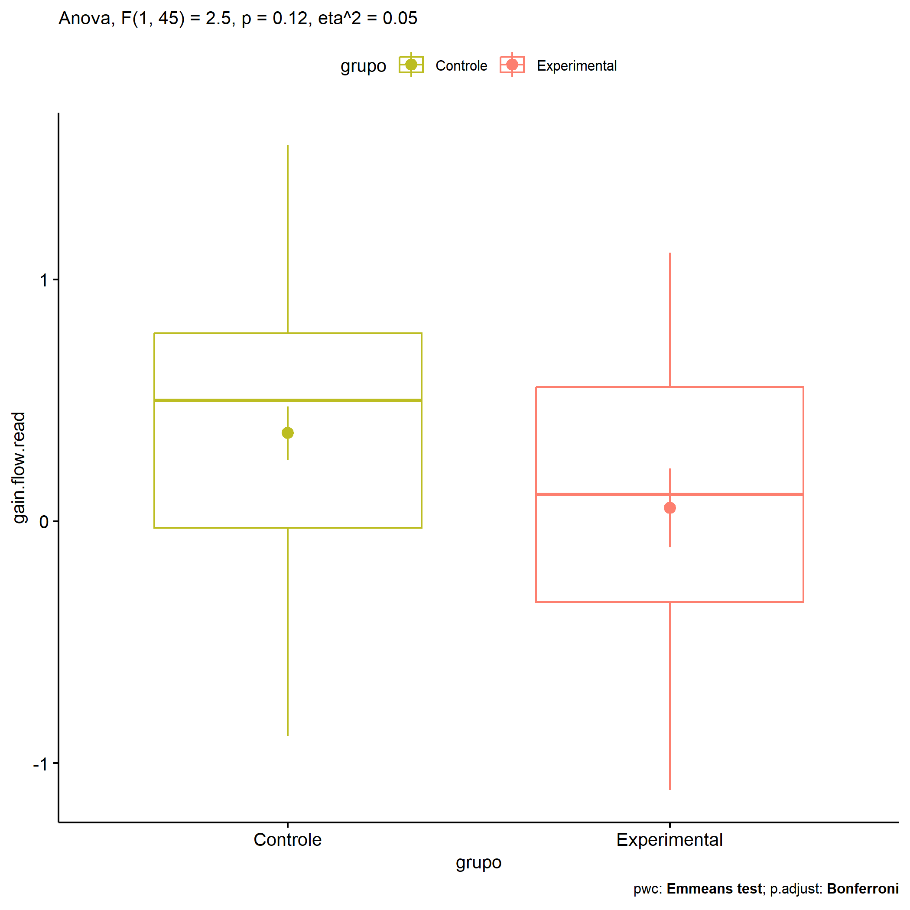
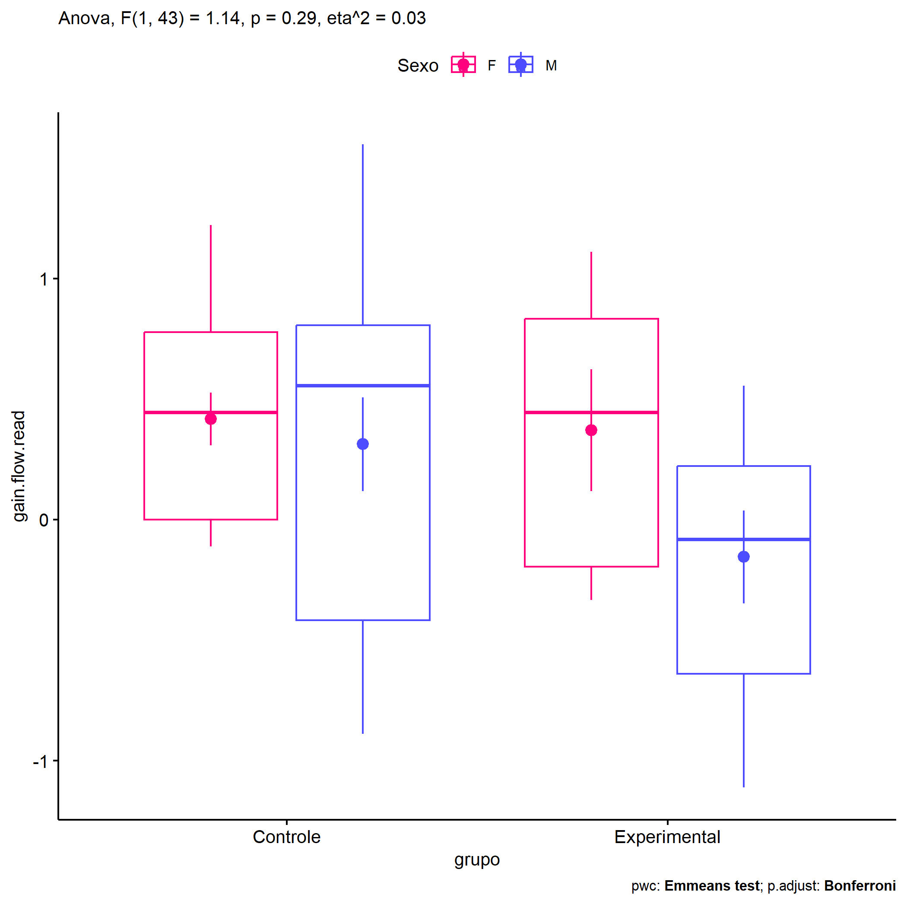
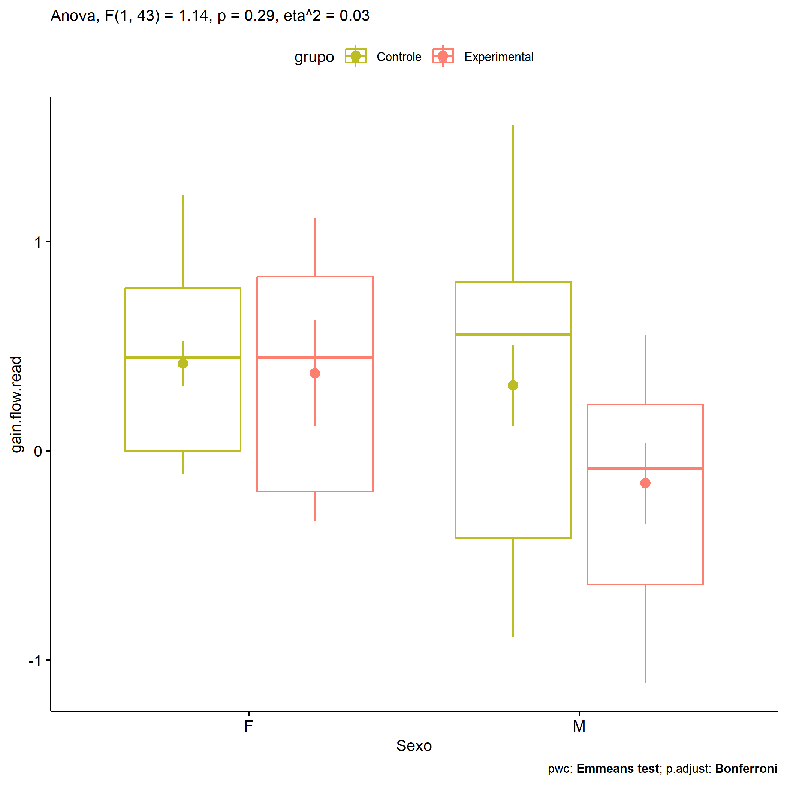

ANOVA in Gains for gain flow (ativ. leitura) (gain flow (ativ. leitura))
================
Geiser C. Challco <geiser@alumni.usp.br>

- [Descriptive Statistics of Initial
  Data](#descriptive-statistics-of-initial-data)
- [Checking of Assumptions](#checking-of-assumptions)
  - [Assumption: Normality distribution of
    data](#assumption-normality-distribution-of-data)
  - [Assumption: Homogeneity of data
    distribution](#assumption-homogeneity-of-data-distribution)
- [Computation of ANCOVA test and Pairwise
  Comparison](#computation-of-ancova-test-and-pairwise-comparison)
  - [ANCOVA tests for one factor](#ancova-tests-for-one-factor)
  - [ANCOVA tests for two factors](#ancova-tests-for-two-factors)
  - [Pairwise comparisons for one factor:
    **grupo**](#pairwise-comparisons-for-one-factor-grupo)
  - [Pairwise comparisons for two
    factors](#pairwise-comparisons-for-two-factors)
    - [factores: **grupo:Sexo**](#factores-gruposexo)
    - [factores: **grupo:Zona**](#factores-grupozona)
    - [factores: **grupo:Cor.Raca**](#factores-grupocorraca)

**NOTE**

- Teste ANOVA para determinar se houve diferenças significativas no gain
  flow (ativ. leitura) (medido usando a diferença entre post-test e
  pre-testes).
- ANOVA test to determine whether there were significant differences in
  gain flow (ativ. leitura) (measured using the difference between
  post-test and pre-tests).

# Descriptive Statistics of Initial Data

| grupo        | Sexo | Zona   | Cor.Raca | variable       |   n |   mean | median |    min |   max |    sd |    se |    ci |   iqr |
|:-------------|:-----|:-------|:---------|:---------------|----:|-------:|-------:|-------:|------:|------:|------:|------:|------:|
| Controle     | F    |        |          | gain.flow.read |  16 |  0.417 |  0.444 | -0.111 | 1.222 | 0.438 | 0.109 | 0.233 | 0.778 |
| Controle     | M    |        |          | gain.flow.read |  16 |  0.312 |  0.556 | -0.889 | 1.556 | 0.776 | 0.194 | 0.414 | 1.222 |
| Experimental | F    |        |          | gain.flow.read |   6 |  0.370 |  0.444 | -0.333 | 1.111 | 0.619 | 0.253 | 0.650 | 1.028 |
| Experimental | M    |        |          | gain.flow.read |   9 | -0.154 | -0.083 | -1.111 | 0.556 | 0.578 | 0.193 | 0.444 | 0.861 |
| Controle     |      | Rural  |          | gain.flow.read |  21 |  0.307 |  0.444 | -0.889 | 1.556 | 0.667 | 0.145 | 0.303 | 0.889 |
| Controle     |      | Urbana |          | gain.flow.read |   8 |  0.569 |  0.778 | -0.778 | 1.111 | 0.595 | 0.210 | 0.498 | 0.333 |
| Controle     |      |        |          | gain.flow.read |   3 |  0.222 |  0.333 | -0.111 | 0.444 | 0.294 | 0.170 | 0.730 | 0.278 |
| Experimental |      | Rural  |          | gain.flow.read |  10 | -0.083 | -0.208 | -1.111 | 0.889 | 0.653 | 0.207 | 0.467 | 1.035 |
| Experimental |      | Urbana |          | gain.flow.read |   4 |  0.361 |  0.333 | -0.333 | 1.111 | 0.618 | 0.309 | 0.983 | 0.694 |
| Experimental |      |        |          | gain.flow.read |   1 |  0.222 |  0.222 |  0.222 | 0.222 |       |       |       | 0.000 |
| Controle     |      |        | Branca   | gain.flow.read |   5 |  0.844 |  0.778 |  0.111 | 1.556 | 0.564 | 0.252 | 0.701 | 0.667 |
| Controle     |      |        | Parda    | gain.flow.read |  13 |  0.043 |  0.000 | -0.889 | 0.889 | 0.577 | 0.160 | 0.348 | 0.667 |
| Controle     |      |        |          | gain.flow.read |  14 |  0.492 |  0.778 | -0.778 | 1.111 | 0.556 | 0.149 | 0.321 | 0.444 |
| Experimental |      |        | Amarela  | gain.flow.read |   1 |  0.222 |  0.222 |  0.222 | 0.222 |       |       |       | 0.000 |
| Experimental |      |        | Parda    | gain.flow.read |   4 | -0.354 | -0.486 | -0.667 | 0.222 | 0.413 | 0.206 | 0.657 | 0.451 |
| Experimental |      |        |          | gain.flow.read |  10 |  0.203 |  0.333 | -1.111 | 1.111 | 0.679 | 0.215 | 0.486 | 0.910 |

# Checking of Assumptions

## Assumption: Normality distribution of data

| var            |   n |   skewness |   kurtosis | symmetry | statistic | method       |         p | p.signif | normality |
|:---------------|----:|-----------:|-----------:|:---------|----------:|:-------------|----------:|:---------|:----------|
| gain.flow.read |  47 | -0.2936539 | -0.8285270 | YES      | 0.9643383 | Shapiro-Wilk | 0.1597401 | ns       | YES       |
| gain.flow.read |  43 | -0.3045642 | -0.6107506 | YES      | 0.9772620 | Shapiro-Wilk | 0.5427765 | ns       | YES       |
| gain.flow.read |  23 | -0.2483214 | -0.9758581 | YES      | 0.9525145 | Shapiro-Wilk | 0.3296840 | ns       | YES       |

## Assumption: Homogeneity of data distribution

| var            | method        | formula                              |   n | df1 | df2 | statistic |         p | p.signif |
|:---------------|:--------------|:-------------------------------------|----:|----:|----:|----------:|----------:|:---------|
| gain.flow.read | Levene’s test | `gain.flow.read`~`grupo`\*`Sexo`     |  47 |   3 |  43 | 1.1440504 | 0.3421361 | ns       |
| gain.flow.read | Levene’s test | `gain.flow.read`~`grupo`\*`Zona`     |  43 |   3 |  39 | 0.4712148 | 0.7040846 | ns       |
| gain.flow.read | Levene’s test | `gain.flow.read`~`grupo`\*`Cor.Raca` |  23 |   3 |  19 | 0.7703002 | 0.5248083 | ns       |

# Computation of ANCOVA test and Pairwise Comparison

## ANCOVA tests for one factor

| Effect   | DFn | DFd |   SSn |    SSd |     F |     p |   ges | p\<.05 |
|:---------|----:|----:|------:|-------:|------:|------:|------:|:-------|
| grupo    |   1 |  45 | 0.975 | 17.584 | 2.496 | 0.121 | 0.053 |        |
| Sexo     |   1 |  45 | 0.789 | 17.771 | 1.997 | 0.165 | 0.042 |        |
| Zona     |   1 |  41 | 0.880 | 17.498 | 2.063 | 0.159 | 0.048 |        |
| Cor.Raca |   2 |  20 | 3.100 |  6.256 | 4.956 | 0.018 | 0.331 | \*     |

## ANCOVA tests for two factors

|     | Effect         | DFn | DFd |   SSn |    SSd |     F |     p |   ges | p\<.05 |
|:----|:---------------|----:|----:|------:|-------:|------:|------:|------:|:-------|
| 3   | grupo:Sexo     |   1 |  43 | 0.439 | 16.507 | 1.144 | 0.291 | 0.026 |        |
| 6   | grupo:Zona     |   1 |  39 | 0.063 | 16.351 | 0.151 | 0.700 | 0.004 |        |
| 9   | grupo:Cor.Raca |   0 |  19 |       |  5.774 |       |       |       |        |

## Pairwise comparisons for one factor: **grupo**

| var            | grupo        |   n |     M |    SE |
|:---------------|:-------------|----:|------:|------:|
| gain.flow.read | Controle     |  32 | 0.365 | 0.110 |
| gain.flow.read | Experimental |  15 | 0.056 | 0.163 |

| .y.            | group1   | group2       | estimate | conf.low | conf.high |    se | statistic |     p | p.adj | p.adj.signif |
|:---------------|:---------|:-------------|---------:|---------:|----------:|------:|----------:|------:|------:|:-------------|
| gain.flow.read | Controle | Experimental |    0.309 |   -0.085 |     0.703 | 0.196 |      1.58 | 0.121 | 0.121 | ns           |

    ## Scale for colour is already present.
    ## Adding another scale for colour, which will replace the existing scale.

<!-- -->

## Pairwise comparisons for two factors

### factores: **grupo:Sexo**

| var            | grupo        | Sexo |   n |      M |    SE |
|:---------------|:-------------|:-----|----:|-------:|------:|
| gain.flow.read | Controle     | F    |  16 |  0.417 | 0.109 |
| gain.flow.read | Controle     | M    |  16 |  0.312 | 0.194 |
| gain.flow.read | Experimental | F    |   6 |  0.370 | 0.253 |
| gain.flow.read | Experimental | M    |   9 | -0.154 | 0.193 |

| .y.            | grupo        | Sexo | group1   | group2       | estimate | conf.low | conf.high |    se | statistic |     p | p.adj | p.adj.signif |
|:---------------|:-------------|:-----|:---------|:-------------|---------:|---------:|----------:|------:|----------:|------:|------:|:-------------|
| gain.flow.read |              | F    | Controle | Experimental |    0.046 |   -0.552 |     0.644 | 0.297 |     0.156 | 0.877 | 0.877 | ns           |
| gain.flow.read |              | M    | Controle | Experimental |    0.467 |   -0.054 |     0.987 | 0.258 |     1.808 | 0.078 | 0.078 | ns           |
| gain.flow.read | Controle     |      | F        | M            |    0.104 |   -0.338 |     0.546 | 0.219 |     0.476 | 0.637 | 0.637 | ns           |
| gain.flow.read | Experimental |      | F        | M            |    0.525 |   -0.134 |     1.183 | 0.327 |     1.607 | 0.115 | 0.115 | ns           |

    ## Scale for colour is already present.
    ## Adding another scale for colour, which will replace the existing scale.

<!-- -->

    ## Scale for colour is already present.
    ## Adding another scale for colour, which will replace the existing scale.

<!-- -->

### factores: **grupo:Zona**

| var            | grupo        | Zona   |   n |      M |    SE |
|:---------------|:-------------|:-------|----:|-------:|------:|
| gain.flow.read | Controle     | Rural  |  21 |  0.307 | 0.145 |
| gain.flow.read | Controle     | Urbana |   8 |  0.569 | 0.210 |
| gain.flow.read | Experimental | Rural  |  10 | -0.083 | 0.207 |

|     | .y.            | grupo    | Zona  | group1   | group2       | estimate | conf.low | conf.high |   se | statistic |     p | p.adj | p.adj.signif |
|:----|:---------------|:---------|:------|:---------|:-------------|---------:|---------:|----------:|-----:|----------:|------:|------:|:-------------|
| 1   | gain.flow.read |          | Rural | Controle | Experimental |    0.390 |   -0.116 |     0.897 | 0.25 |     1.563 | 0.127 | 0.127 | ns           |
| 3   | gain.flow.read | Controle |       | Rural    | Urbana       |   -0.263 |   -0.810 |     0.285 | 0.27 |    -0.972 | 0.337 | 0.337 | ns           |

### factores: **grupo:Cor.Raca**
