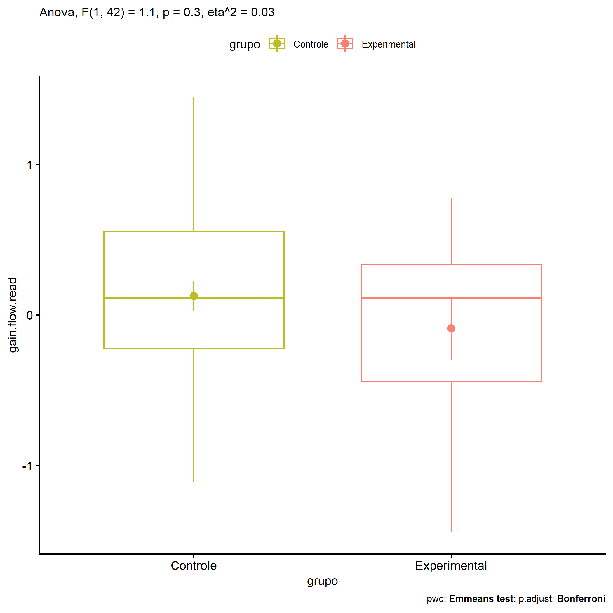

ANOVA in Gains for gain flow (ativ. leitura) (gain flow (ativ. leitura))
================
Geiser C. Challco <geiser@alumni.usp.br>

- [Descriptive Statistics of Initial
  Data](#descriptive-statistics-of-initial-data)
- [Checking of Assumptions](#checking-of-assumptions)
  - [Assumption: Normality distribution of
    data](#assumption-normality-distribution-of-data)
  - [Assumption: Homogeneity of data
    distribution](#assumption-homogeneity-of-data-distribution)
- [Computation of ANCOVA test and Pairwise
  Comparison](#computation-of-ancova-test-and-pairwise-comparison)
  - [ANCOVA tests for one factor](#ancova-tests-for-one-factor)
  - [ANCOVA tests for two factors](#ancova-tests-for-two-factors)
  - [Pairwise comparisons for one factor:
    **grupo**](#pairwise-comparisons-for-one-factor-grupo)
  - [Pairwise comparisons for two
    factors](#pairwise-comparisons-for-two-factors)
    - [factores: **grupo:Sexo**](#factores-gruposexo)
    - [factores: **grupo:Zona**](#factores-grupozona)
    - [factores: **grupo:Cor.Raca**](#factores-grupocorraca)

**NOTE**

- Teste ANOVA para determinar se houve diferenças significativas no gain
  flow (ativ. leitura) (medido usando a diferença entre post-test e
  pre-testes).
- ANOVA test to determine whether there were significant differences in
  gain flow (ativ. leitura) (measured using the difference between
  post-test and pre-tests).

# Descriptive Statistics of Initial Data

| grupo        | Sexo | Zona   | Cor.Raca | variable       |   n |   mean | median |    min |   max |    sd |    se |    ci |   iqr |
|:-------------|:-----|:-------|:---------|:---------------|----:|-------:|-------:|-------:|------:|------:|------:|------:|------:|
| Controle     | F    |        |          | gain.flow.read |  16 |  0.003 |  0.000 | -1.111 | 1.444 | 0.607 | 0.152 | 0.324 | 0.462 |
| Controle     | M    |        |          | gain.flow.read |  17 |  0.242 |  0.333 | -0.444 | 1.333 | 0.494 | 0.120 | 0.254 | 0.889 |
| Experimental | F    |        |          | gain.flow.read |   4 | -0.330 | -0.444 | -1.000 | 0.569 | 0.679 | 0.339 | 1.080 | 0.726 |
| Experimental | M    |        |          | gain.flow.read |   7 |  0.048 |  0.111 | -1.444 | 0.778 | 0.702 | 0.265 | 0.650 | 0.222 |
| Controle     |      | Rural  |          | gain.flow.read |  20 |  0.257 |  0.167 | -0.556 | 1.444 | 0.494 | 0.110 | 0.231 | 0.722 |
| Controle     |      | Urbana |          | gain.flow.read |   5 | -0.042 | -0.319 | -1.111 | 1.333 | 0.924 | 0.413 | 1.147 | 0.778 |
| Controle     |      |        |          | gain.flow.read |   8 | -0.097 |  0.000 | -0.778 | 0.444 | 0.373 | 0.132 | 0.312 | 0.444 |
| Experimental |      | Rural  |          | gain.flow.read |   8 | -0.207 | -0.056 | -1.444 | 0.778 | 0.777 | 0.275 | 0.650 | 1.059 |
| Experimental |      | Urbana |          | gain.flow.read |   1 |  0.444 |  0.444 |  0.444 | 0.444 |       |       |       | 0.000 |
| Experimental |      |        |          | gain.flow.read |   2 |  0.111 |  0.111 |  0.111 | 0.111 | 0.000 | 0.000 | 0.000 | 0.000 |
| Controle     |      |        | Branca   | gain.flow.read |   5 |  0.022 |  0.000 | -0.444 | 0.667 | 0.419 | 0.187 | 0.520 | 0.333 |
| Controle     |      |        | Parda    | gain.flow.read |  17 |  0.068 |  0.000 | -1.111 | 1.444 | 0.701 | 0.170 | 0.361 | 0.917 |
| Controle     |      |        | Preta    | gain.flow.read |   1 |  0.333 |  0.333 |  0.333 | 0.333 |       |       |       | 0.000 |
| Controle     |      |        |          | gain.flow.read |  10 |  0.256 |  0.278 | -0.333 | 0.667 | 0.336 | 0.106 | 0.240 | 0.528 |
| Experimental |      |        | Branca   | gain.flow.read |   3 |  0.000 |  0.222 | -0.667 | 0.444 | 0.588 | 0.339 | 1.461 | 0.556 |
| Experimental |      |        | Indígena | gain.flow.read |   2 | -0.215 | -0.215 | -1.000 | 0.569 | 1.110 | 0.785 | 9.971 | 0.785 |
| Experimental |      |        | Parda    | gain.flow.read |   2 | -0.667 | -0.667 | -1.444 | 0.111 | 1.100 | 0.778 | 9.883 | 0.778 |
| Experimental |      |        |          | gain.flow.read |   4 |  0.194 |  0.111 | -0.222 | 0.778 | 0.419 | 0.210 | 0.667 | 0.250 |

# Checking of Assumptions

## Assumption: Normality distribution of data

| var            |   n |   skewness |   kurtosis | symmetry | statistic | method       |         p | p.signif | normality |
|:---------------|----:|-----------:|-----------:|:---------|----------:|:-------------|----------:|:---------|:----------|
| gain.flow.read |  44 | -0.0417797 |  0.3605732 | YES      | 0.9844760 | Shapiro-Wilk | 0.8099089 | ns       | YES       |
| gain.flow.read |  34 |  0.1639092 | -0.4276704 | YES      | 0.9808206 | Shapiro-Wilk | 0.7982686 | ns       | YES       |
| gain.flow.read |  30 |  0.3261266 | -0.6900972 | YES      | 0.9738989 | Shapiro-Wilk | 0.6503352 | ns       | YES       |

## Assumption: Homogeneity of data distribution

| var            | method        | formula                              |   n | df1 | df2 | statistic |         p | p.signif |
|:---------------|:--------------|:-------------------------------------|----:|----:|----:|----------:|----------:|:---------|
| gain.flow.read | Levene’s test | `gain.flow.read`~`grupo`\*`Sexo`     |  44 |   3 |  40 |  0.085853 | 0.9673835 | ns       |
| gain.flow.read | Levene’s test | `gain.flow.read`~`grupo`\*`Zona`     |  34 |   3 |  30 |  1.446757 | 0.2488440 | ns       |
| gain.flow.read | Levene’s test | `gain.flow.read`~`grupo`\*`Cor.Raca` |  30 |   5 |  24 |  1.098252 | 0.3871070 | ns       |

# Computation of ANCOVA test and Pairwise Comparison

## ANCOVA tests for one factor

| Effect   | DFn | DFd |   SSn |    SSd |     F |     p |   ges | p\<.05 |
|:---------|----:|----:|------:|-------:|------:|------:|------:|:-------|
| grupo    |   1 |  42 | 0.383 | 14.612 | 1.101 | 0.300 | 0.026 |        |
| Sexo     |   1 |  42 | 0.677 | 14.319 | 1.985 | 0.166 | 0.045 |        |
| Zona     |   1 |  32 | 0.036 | 13.706 | 0.084 | 0.774 | 0.003 |        |
| Cor.Raca |   3 |  26 | 0.206 | 12.671 | 0.141 | 0.935 | 0.016 |        |

## ANCOVA tests for two factors

|     | Effect         | DFn | DFd |   SSn |    SSd |     F |     p |   ges | p\<.05 |
|:----|:---------------|----:|----:|------:|-------:|------:|------:|------:|:-------|
| 3   | grupo:Sexo     |   1 |  40 | 0.037 | 13.778 | 0.108 | 0.744 | 0.003 |        |
| 6   | grupo:Zona     |   1 |  30 | 0.656 | 12.281 | 1.602 | 0.215 | 0.051 |        |
| 9   | grupo:Cor.Raca |   1 |  24 | 0.465 | 11.704 | 0.952 | 0.339 | 0.038 |        |

## Pairwise comparisons for one factor: **grupo**

| var            | grupo        |   n |      M |    SE |
|:---------------|:-------------|----:|-------:|------:|
| gain.flow.read | Controle     |  33 |  0.126 | 0.097 |
| gain.flow.read | Experimental |  11 | -0.090 | 0.207 |

| .y.            | group1   | group2       | estimate | conf.low | conf.high |    se | statistic |   p | p.adj | p.adj.signif |
|:---------------|:---------|:-------------|---------:|---------:|----------:|------:|----------:|----:|------:|:-------------|
| gain.flow.read | Controle | Experimental |    0.215 |   -0.199 |      0.63 | 0.205 |     1.049 | 0.3 |   0.3 | ns           |

    ## Scale for colour is already present.
    ## Adding another scale for colour, which will replace the existing scale.

<!-- -->

## Pairwise comparisons for two factors

### factores: **grupo:Sexo**

| var            | grupo        | Sexo |   n |     M |    SE |
|:---------------|:-------------|:-----|----:|------:|------:|
| gain.flow.read | Controle     | F    |  16 | 0.003 | 0.152 |
| gain.flow.read | Controle     | M    |  17 | 0.242 | 0.120 |
| gain.flow.read | Experimental | M    |   7 | 0.048 | 0.265 |

|     | .y.            | grupo    | Sexo | group1   | group2       | estimate | conf.low | conf.high |    se | statistic |     p | p.adj | p.adj.signif |
|:----|:---------------|:---------|:-----|:---------|:-------------|---------:|---------:|----------:|------:|----------:|------:|------:|:-------------|
| 2   | gain.flow.read |          | M    | Controle | Experimental |    0.194 |   -0.332 |     0.721 | 0.260 |     0.747 | 0.460 | 0.460 | ns           |
| 3   | gain.flow.read | Controle |      | F        | M            |   -0.239 |   -0.648 |     0.169 | 0.202 |    -1.187 | 0.243 | 0.243 | ns           |

### factores: **grupo:Zona**

| var            | grupo        | Zona   |   n |      M |    SE |
|:---------------|:-------------|:-------|----:|-------:|------:|
| gain.flow.read | Controle     | Rural  |  20 |  0.257 | 0.110 |
| gain.flow.read | Controle     | Urbana |   5 | -0.042 | 0.413 |
| gain.flow.read | Experimental | Rural  |   8 | -0.207 | 0.275 |

|     | .y.            | grupo    | Zona  | group1   | group2       | estimate | conf.low | conf.high |    se | statistic |     p | p.adj | p.adj.signif |
|:----|:---------------|:---------|:------|:---------|:-------------|---------:|---------:|----------:|------:|----------:|------:|------:|:-------------|
| 1   | gain.flow.read |          | Rural | Controle | Experimental |    0.464 |   -0.083 |     1.010 | 0.268 |     1.732 | 0.094 | 0.094 | ns           |
| 3   | gain.flow.read | Controle |       | Rural    | Urbana       |    0.299 |   -0.355 |     0.952 | 0.320 |     0.933 | 0.358 | 0.358 | ns           |

### factores: **grupo:Cor.Raca**
