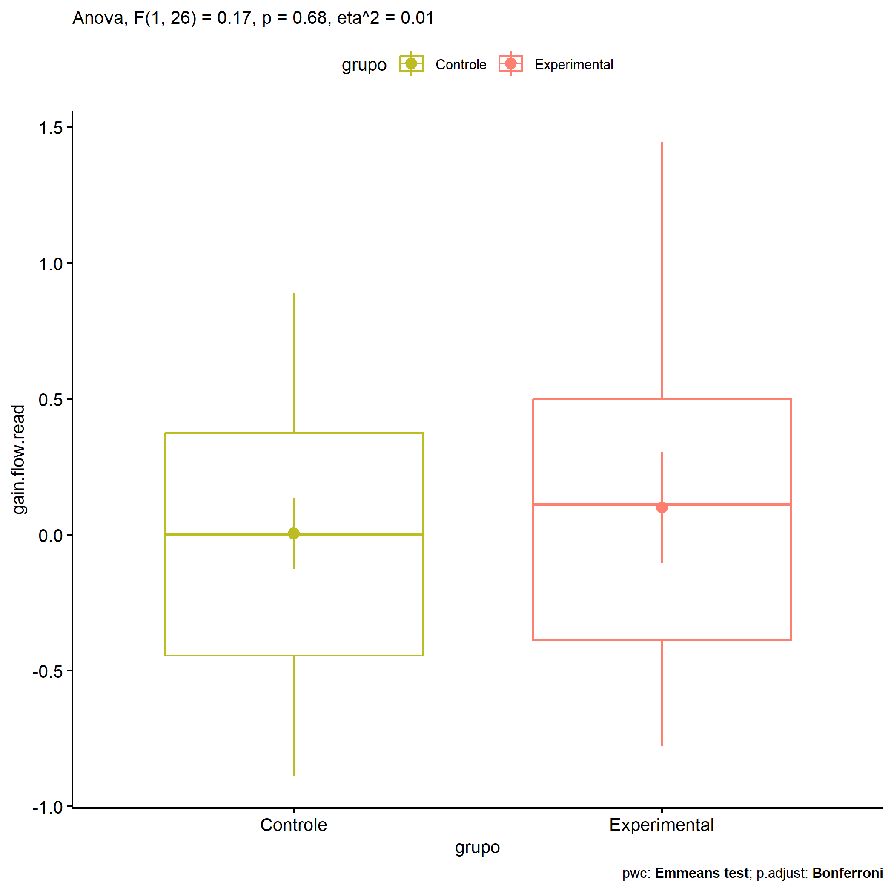

ANOVA in Gains for gain flow (ativ. leitura) (gain flow (ativ. leitura))
================
Geiser C. Challco <geiser@alumni.usp.br>

- [Descriptive Statistics of Initial
  Data](#descriptive-statistics-of-initial-data)
- [Checking of Assumptions](#checking-of-assumptions)
  - [Assumption: Normality distribution of
    data](#assumption-normality-distribution-of-data)
  - [Assumption: Homogeneity of data
    distribution](#assumption-homogeneity-of-data-distribution)
- [Computation of ANCOVA test and Pairwise
  Comparison](#computation-of-ancova-test-and-pairwise-comparison)
  - [ANCOVA tests for one factor](#ancova-tests-for-one-factor)
  - [ANCOVA tests for two factors](#ancova-tests-for-two-factors)
  - [Pairwise comparisons for one factor:
    **grupo**](#pairwise-comparisons-for-one-factor-grupo)
  - [Pairwise comparisons for two
    factors](#pairwise-comparisons-for-two-factors)
    - [factores: **grupo:Sexo**](#factores-gruposexo)
    - [factores: **grupo:Zona**](#factores-grupozona)
    - [factores: **grupo:Cor.Raca**](#factores-grupocorraca)

**NOTE**

- Teste ANOVA para determinar se houve diferenças significativas no gain
  flow (ativ. leitura) (medido usando a diferença entre post-test e
  pre-testes).
- ANOVA test to determine whether there were significant differences in
  gain flow (ativ. leitura) (measured using the difference between
  post-test and pre-tests).

# Descriptive Statistics of Initial Data

| grupo        | Sexo | Zona   | Cor.Raca | variable       |   n |   mean | median |    min |    max |    sd |    se |    ci |   iqr |
|:-------------|:-----|:-------|:---------|:---------------|----:|-------:|-------:|-------:|-------:|------:|------:|------:|------:|
| Controle     | F    |        |          | gain.flow.read |   7 |  0.353 |  0.375 | -0.444 |  0.889 | 0.413 | 0.156 | 0.382 | 0.285 |
| Controle     | M    |        |          | gain.flow.read |  10 | -0.239 | -0.278 | -0.889 |  0.667 | 0.489 | 0.155 | 0.350 | 0.500 |
| Experimental | F    |        |          | gain.flow.read |   3 |  0.593 |  0.667 |  0.333 |  0.778 | 0.231 | 0.134 | 0.575 | 0.222 |
| Experimental | M    |        |          | gain.flow.read |   8 | -0.083 | -0.278 | -0.778 |  1.444 | 0.707 | 0.250 | 0.591 | 0.639 |
| Controle     |      | Rural  |          | gain.flow.read |   6 | -0.086 | -0.278 | -0.556 |  0.667 | 0.491 | 0.201 | 0.516 | 0.642 |
| Controle     |      | Urbana |          | gain.flow.read |   5 | -0.225 | -0.111 | -0.889 |  0.319 | 0.461 | 0.206 | 0.572 | 0.444 |
| Controle     |      |        |          | gain.flow.read |   6 |  0.287 |  0.444 | -0.833 |  0.889 | 0.595 | 0.243 | 0.624 | 0.306 |
| Experimental |      | Rural  |          | gain.flow.read |   6 |  0.167 | -0.056 | -0.667 |  1.444 | 0.804 | 0.328 | 0.843 | 1.000 |
| Experimental |      | Urbana |          | gain.flow.read |   2 |  0.500 |  0.500 |  0.333 |  0.667 | 0.236 | 0.167 | 2.118 | 0.167 |
| Experimental |      |        |          | gain.flow.read |   3 | -0.296 | -0.333 | -0.778 |  0.222 | 0.501 | 0.289 | 1.245 | 0.500 |
| Controle     |      |        | Parda    | gain.flow.read |   9 |  0.060 |  0.222 | -0.556 |  0.667 | 0.454 | 0.151 | 0.349 | 0.667 |
| Controle     |      |        |          | gain.flow.read |   8 | -0.057 | -0.056 | -0.889 |  0.889 | 0.644 | 0.228 | 0.539 | 0.962 |
| Experimental |      |        | Branca   | gain.flow.read |   1 | -0.444 | -0.444 | -0.444 | -0.444 |       |       |       | 0.000 |
| Experimental |      |        | Indígena | gain.flow.read |   1 |  0.222 |  0.222 |  0.222 |  0.222 |       |       |       | 0.000 |
| Experimental |      |        | Parda    | gain.flow.read |   3 |  0.222 |  0.111 | -0.222 |  0.778 | 0.509 | 0.294 | 1.265 | 0.500 |
| Experimental |      |        |          | gain.flow.read |   6 |  0.111 |  0.000 | -0.778 |  1.444 | 0.864 | 0.353 | 0.906 | 1.167 |

# Checking of Assumptions

## Assumption: Normality distribution of data

| var            |   n |  skewness |   kurtosis | symmetry | statistic | method       |         p | p.signif | normality |
|:---------------|----:|----------:|-----------:|:---------|----------:|:-------------|----------:|:---------|:----------|
| gain.flow.read |  28 | 0.8722359 |  1.2049926 | NO       | 0.9375335 | Shapiro-Wilk | 0.0956682 | ns       | YES       |
| gain.flow.read |  19 | 0.5456463 | -0.5048441 | NO       | 0.9652132 | Shapiro-Wilk | 0.6782944 | ns       | YES       |
| gain.flow.read |  14 | 0.0247316 | -1.5116020 | YES      | 0.9455636 | Shapiro-Wilk | 0.4941741 | ns       | YES       |

## Assumption: Homogeneity of data distribution

| var            | method        | formula                              |   n | df1 | df2 | statistic |         p | p.signif |
|:---------------|:--------------|:-------------------------------------|----:|----:|----:|----------:|----------:|:---------|
| gain.flow.read | Levene’s test | `gain.flow.read`~`grupo`\*`Sexo`     |  28 |   3 |  24 | 0.6881320 | 0.5681282 | ns       |
| gain.flow.read | Levene’s test | `gain.flow.read`~`grupo`\*`Zona`     |  19 |   3 |  15 | 0.8846160 | 0.4713796 | ns       |
| gain.flow.read | Levene’s test | `gain.flow.read`~`grupo`\*`Cor.Raca` |  14 |   3 |  10 | 0.9944326 | 0.4345934 | ns       |

# Computation of ANCOVA test and Pairwise Comparison

## ANCOVA tests for one factor

| Effect   | DFn | DFd |   SSn |   SSd |     F |     p |   ges | p\<.05 |
|:---------|----:|----:|------:|------:|------:|------:|------:|:-------|
| grupo    |   1 |  26 | 0.062 | 9.220 | 0.174 | 0.680 | 0.007 |        |
| Sexo     |   1 |  26 | 2.274 | 7.007 | 8.438 | 0.007 | 0.245 | \*     |
| Zona     |   1 |  17 | 0.015 | 6.282 | 0.041 | 0.842 | 0.002 |        |
| Cor.Raca |   2 |  11 | 0.299 | 2.227 | 0.739 | 0.500 | 0.118 |        |

## ANCOVA tests for two factors

|     | Effect         | DFn | DFd |   SSn |   SSd |     F |     p |   ges | p\<.05 |
|:----|:---------------|----:|----:|------:|------:|------:|------:|------:|:-------|
| 3   | grupo:Sexo     |   1 |  24 | 0.010 | 6.779 | 0.036 | 0.852 | 0.001 |        |
| 6   | grupo:Zona     |   1 |  15 | 0.216 | 5.341 | 0.607 | 0.448 | 0.039 |        |
| 9   | grupo:Cor.Raca |   0 |  10 |       | 2.168 |       |       |       |        |

## Pairwise comparisons for one factor: **grupo**

| var            | grupo        |   n |     M |    SE |
|:---------------|:-------------|----:|------:|------:|
| gain.flow.read | Controle     |  17 | 0.005 | 0.130 |
| gain.flow.read | Experimental |  11 | 0.101 | 0.205 |

| .y.            | group1   | group2       | estimate | conf.low | conf.high |   se | statistic |    p | p.adj | p.adj.signif |
|:---------------|:---------|:-------------|---------:|---------:|----------:|-----:|----------:|-----:|------:|:-------------|
| gain.flow.read | Controle | Experimental |   -0.096 |    -0.57 |     0.378 | 0.23 |    -0.417 | 0.68 |  0.68 | ns           |

    ## Scale for colour is already present.
    ## Adding another scale for colour, which will replace the existing scale.

<!-- -->

## Pairwise comparisons for two factors

### factores: **grupo:Sexo**

| var            | grupo        | Sexo |   n |      M |    SE |
|:---------------|:-------------|:-----|----:|-------:|------:|
| gain.flow.read | Controle     | F    |   7 |  0.353 | 0.156 |
| gain.flow.read | Controle     | M    |  10 | -0.239 | 0.155 |
| gain.flow.read | Experimental | M    |   8 | -0.083 | 0.250 |

|     | .y.            | grupo    | Sexo | group1   | group2       | estimate | conf.low | conf.high |    se | statistic |     p | p.adj | p.adj.signif |
|:----|:---------------|:---------|:-----|:---------|:-------------|---------:|---------:|----------:|------:|----------:|------:|------:|:-------------|
| 2   | gain.flow.read |          | M    | Controle | Experimental |   -0.156 |   -0.697 |     0.386 | 0.261 |    -0.595 | 0.558 | 0.558 | ns           |
| 3   | gain.flow.read | Controle |      | F        | M            |    0.592 |    0.029 |     1.155 | 0.271 |     2.182 | 0.040 | 0.040 | \*           |

### factores: **grupo:Zona**

| var            | grupo        | Zona   |   n |      M |    SE |
|:---------------|:-------------|:-------|----:|-------:|------:|
| gain.flow.read | Controle     | Rural  |   6 | -0.086 | 0.201 |
| gain.flow.read | Controle     | Urbana |   5 | -0.225 | 0.206 |
| gain.flow.read | Experimental | Rural  |   6 |  0.167 | 0.328 |

|     | .y.            | grupo    | Zona  | group1   | group2       | estimate | conf.low | conf.high |    se | statistic |     p | p.adj | p.adj.signif |
|:----|:---------------|:---------|:------|:---------|:-------------|---------:|---------:|----------:|------:|----------:|------:|------:|:-------------|
| 1   | gain.flow.read |          | Rural | Controle | Experimental |   -0.252 |   -1.013 |     0.509 | 0.355 |    -0.711 | 0.489 | 0.489 | ns           |
| 3   | gain.flow.read | Controle |       | Rural    | Urbana       |    0.139 |   -0.659 |     0.937 | 0.372 |     0.375 | 0.714 | 0.714 | ns           |

### factores: **grupo:Cor.Raca**
