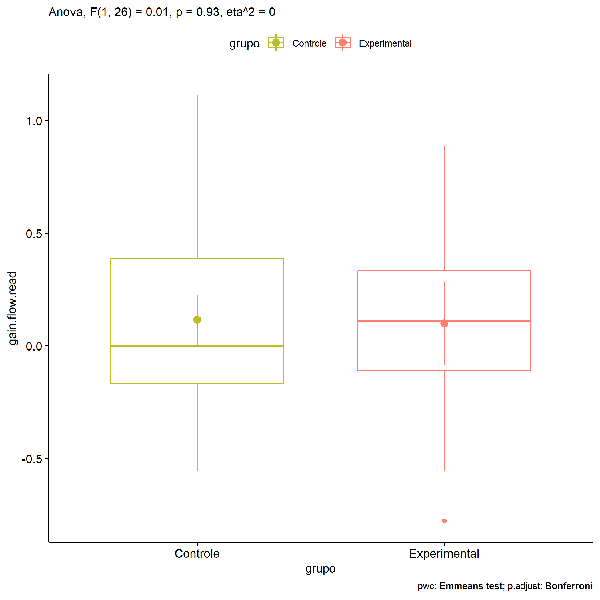

ANOVA in Gains for gain flow (ativ. leitura) (gain flow (ativ. leitura))
================
Geiser C. Challco <geiser@alumni.usp.br>

- [Descriptive Statistics of Initial
  Data](#descriptive-statistics-of-initial-data)
- [Checking of Assumptions](#checking-of-assumptions)
  - [Assumption: Normality distribution of
    data](#assumption-normality-distribution-of-data)
  - [Assumption: Homogeneity of data
    distribution](#assumption-homogeneity-of-data-distribution)
- [Computation of ANCOVA test and Pairwise
  Comparison](#computation-of-ancova-test-and-pairwise-comparison)
  - [ANCOVA tests for one factor](#ancova-tests-for-one-factor)
  - [ANCOVA tests for two factors](#ancova-tests-for-two-factors)
  - [Pairwise comparisons for one factor:
    **grupo**](#pairwise-comparisons-for-one-factor-grupo)
  - [Pairwise comparisons for two
    factors](#pairwise-comparisons-for-two-factors)
    - [factores: **grupo:Sexo**](#factores-gruposexo)
    - [factores: **grupo:Zona**](#factores-grupozona)
    - [factores: **grupo:Cor.Raca**](#factores-grupocorraca)

**NOTE**

- Teste ANOVA para determinar se houve diferenças significativas no gain
  flow (ativ. leitura) (medido usando a diferença entre post-test e
  pre-testes).
- ANOVA test to determine whether there were significant differences in
  gain flow (ativ. leitura) (measured using the difference between
  post-test and pre-tests).

# Descriptive Statistics of Initial Data

| grupo        | Sexo | Zona   | Cor.Raca | variable       |   n |   mean | median |    min |   max |    sd |    se |     ci |   iqr |
|:-------------|:-----|:-------|:---------|:---------------|----:|-------:|-------:|-------:|------:|------:|------:|-------:|------:|
| Controle     | F    |        |          | gain.flow.read |   6 |  0.315 |  0.222 | -0.111 | 0.667 | 0.302 | 0.123 |  0.316 | 0.333 |
| Controle     | M    |        |          | gain.flow.read |  13 |  0.025 | -0.111 | -0.556 | 1.111 | 0.529 | 0.147 |  0.320 | 0.653 |
| Experimental | F    |        |          | gain.flow.read |   4 |  0.333 |  0.278 |  0.000 | 0.778 | 0.327 | 0.164 |  0.520 | 0.278 |
| Experimental | M    |        |          | gain.flow.read |   5 | -0.089 | -0.111 | -0.778 | 0.889 | 0.650 | 0.291 |  0.807 | 0.667 |
| Controle     |      | Rural  |          | gain.flow.read |   8 |  0.139 |  0.111 | -0.444 | 1.111 | 0.605 | 0.214 |  0.506 | 0.833 |
| Controle     |      |        |          | gain.flow.read |  11 |  0.100 | -0.111 | -0.556 | 0.667 | 0.399 | 0.120 |  0.268 | 0.500 |
| Experimental |      | Rural  |          | gain.flow.read |   5 | -0.044 | -0.111 | -0.778 | 0.889 | 0.674 | 0.301 |  0.837 | 0.889 |
| Experimental |      | Urbana |          | gain.flow.read |   1 |  0.222 |  0.222 |  0.222 | 0.222 |       |       |        | 0.000 |
| Experimental |      |        |          | gain.flow.read |   3 |  0.296 |  0.111 |  0.000 | 0.778 | 0.421 | 0.243 |  1.045 | 0.389 |
| Controle     |      |        | Branca   | gain.flow.read |   1 |  0.000 |  0.000 |  0.000 | 0.000 |       |       |        | 0.000 |
| Controle     |      |        | Parda    | gain.flow.read |   7 |  0.095 | -0.111 | -0.556 | 1.111 | 0.674 | 0.255 |  0.623 | 1.000 |
| Controle     |      |        |          | gain.flow.read |  11 |  0.140 |  0.208 | -0.444 | 0.667 | 0.375 | 0.113 |  0.252 | 0.500 |
| Experimental |      |        | Branca   | gain.flow.read |   2 |  0.056 |  0.056 | -0.778 | 0.889 | 1.179 | 0.833 | 10.589 | 0.833 |
| Experimental |      |        | Indígena | gain.flow.read |   2 |  0.111 |  0.111 | -0.111 | 0.333 | 0.314 | 0.222 |  2.824 | 0.222 |
| Experimental |      |        | Parda    | gain.flow.read |   3 | -0.111 |  0.000 | -0.556 | 0.222 | 0.401 | 0.231 |  0.995 | 0.389 |
| Experimental |      |        |          | gain.flow.read |   2 |  0.444 |  0.444 |  0.111 | 0.778 | 0.471 | 0.333 |  4.235 | 0.333 |

# Checking of Assumptions

## Assumption: Normality distribution of data

| var            |   n |  skewness |   kurtosis | symmetry | statistic | method       |         p | p.signif | normality |
|:---------------|----:|----------:|-----------:|:---------|----------:|:-------------|----------:|:---------|:----------|
| gain.flow.read |  28 | 0.7592223 | -0.2346196 | NO       | 0.9248155 | Shapiro-Wilk | 0.0456891 | \*       | NO        |
| gain.flow.read |  14 | 0.3955376 | -1.3038680 | YES      | 0.9055468 | Shapiro-Wilk | 0.1357735 | ns       | YES       |
| gain.flow.read |  15 | 0.3261958 | -1.1997834 | YES      | 0.9487154 | Shapiro-Wilk | 0.5044516 | ns       | YES       |

## Assumption: Homogeneity of data distribution

| var            | method        | formula                              |   n | df1 | df2 | statistic |         p | p.signif |
|:---------------|:--------------|:-------------------------------------|----:|----:|----:|----------:|----------:|:---------|
| gain.flow.read | Levene’s test | `gain.flow.read`~`grupo`\*`Sexo`     |  28 |   3 |  24 | 0.7575428 | 0.5289020 | ns       |
| gain.flow.read | Levene’s test | `gain.flow.read`~`grupo`\*`Zona`     |  14 |   2 |  11 | 0.9396171 | 0.4200148 | ns       |
| gain.flow.read | Levene’s test | `gain.flow.read`~`grupo`\*`Cor.Raca` |  15 |   4 |  10 | 1.4774953 | 0.2802918 | ns       |

# Computation of ANCOVA test and Pairwise Comparison

## ANCOVA tests for one factor

| Effect   | DFn | DFd |   SSn |   SSd |     F |     p |   ges | p\<.05 |
|:---------|----:|----:|------:|------:|------:|------:|------:|:-------|
| grupo    |   1 |  26 | 0.002 | 6.563 | 0.007 | 0.932 | 0.000 |        |
| Sexo     |   1 |  26 | 0.697 | 5.868 | 3.086 | 0.091 | 0.106 |        |
| Zona     |   1 |  12 | 0.022 | 4.482 | 0.059 | 0.812 | 0.005 |        |
| Cor.Raca |   2 |  12 | 0.010 | 4.627 | 0.013 | 0.987 | 0.002 |        |

## ANCOVA tests for two factors

|     | Effect         | DFn | DFd |   SSn |   SSd |     F |     p |   ges | p\<.05 |
|:----|:---------------|----:|----:|------:|------:|------:|------:|------:|:-------|
| 3   | grupo:Sexo     |   1 |  24 | 0.025 | 5.821 | 0.104 | 0.750 | 0.004 |        |
| 6   | grupo:Zona     |   0 |  11 |       | 4.379 |       |       |       |        |
| 9   | grupo:Cor.Raca |   1 |  10 | 0.035 | 4.535 | 0.077 | 0.788 | 0.008 |        |

## Pairwise comparisons for one factor: **grupo**

| var            | grupo        |   n |     M |    SE |
|:---------------|:-------------|----:|------:|------:|
| gain.flow.read | Controle     |  19 | 0.116 | 0.110 |
| gain.flow.read | Experimental |   9 | 0.099 | 0.183 |

| .y.            | group1   | group2       | estimate | conf.low | conf.high |    se | statistic |     p | p.adj | p.adj.signif |
|:---------------|:---------|:-------------|---------:|---------:|----------:|------:|----------:|------:|------:|:-------------|
| gain.flow.read | Controle | Experimental |    0.017 |     -0.4 |     0.435 | 0.203 |     0.086 | 0.932 | 0.932 | ns           |

    ## Scale for colour is already present.
    ## Adding another scale for colour, which will replace the existing scale.

<!-- -->

## Pairwise comparisons for two factors

### factores: **grupo:Sexo**

| var            | grupo        | Sexo |   n |      M |    SE |
|:---------------|:-------------|:-----|----:|-------:|------:|
| gain.flow.read | Controle     | F    |   6 |  0.315 | 0.123 |
| gain.flow.read | Controle     | M    |  13 |  0.025 | 0.147 |
| gain.flow.read | Experimental | M    |   5 | -0.089 | 0.291 |

|     | .y.            | grupo    | Sexo | group1   | group2       | estimate | conf.low | conf.high |    se | statistic |     p | p.adj | p.adj.signif |
|:----|:---------------|:---------|:-----|:---------|:-------------|---------:|---------:|----------:|------:|----------:|------:|------:|:-------------|
| 2   | gain.flow.read |          | M    | Controle | Experimental |    0.113 |   -0.447 |     0.674 | 0.269 |     0.421 | 0.678 | 0.678 | ns           |
| 3   | gain.flow.read | Controle |      | F        | M            |    0.290 |   -0.235 |     0.816 | 0.253 |     1.149 | 0.263 | 0.263 | ns           |

### factores: **grupo:Zona**

### factores: **grupo:Cor.Raca**
