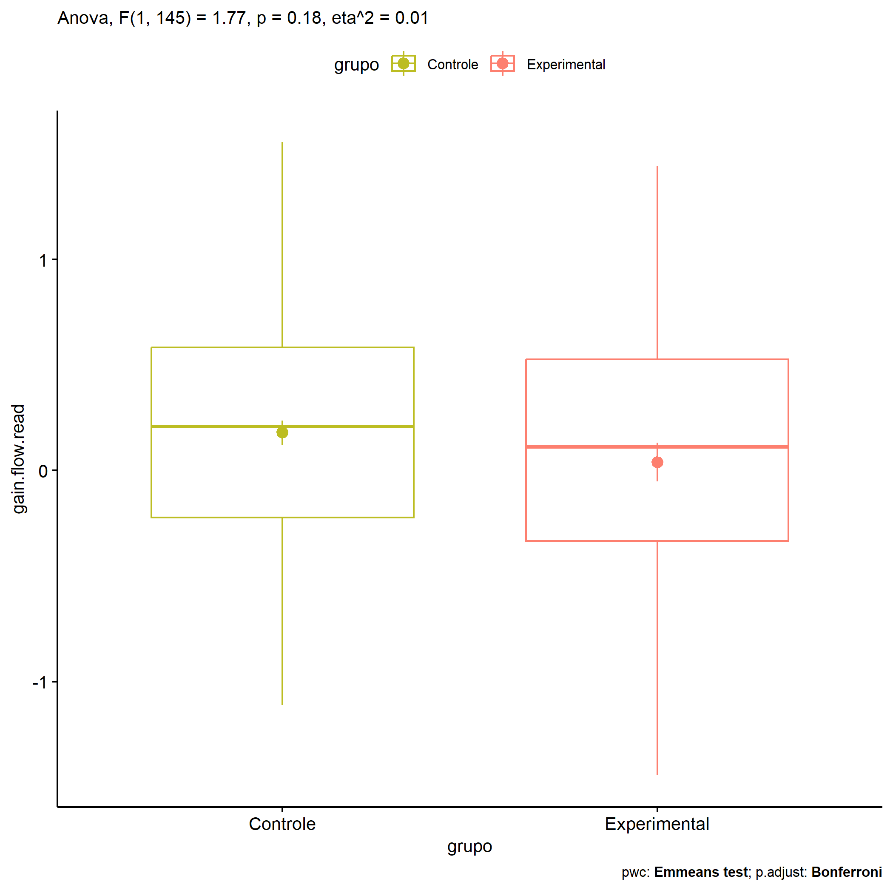
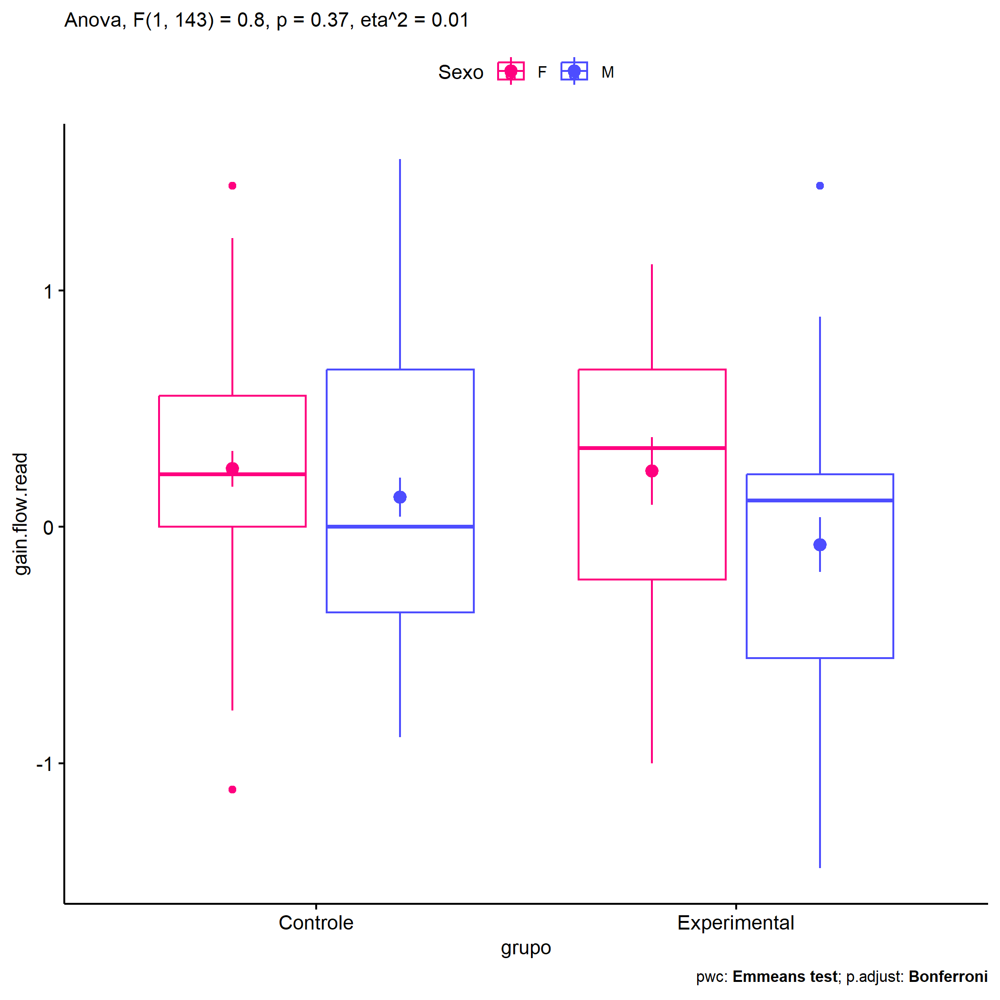
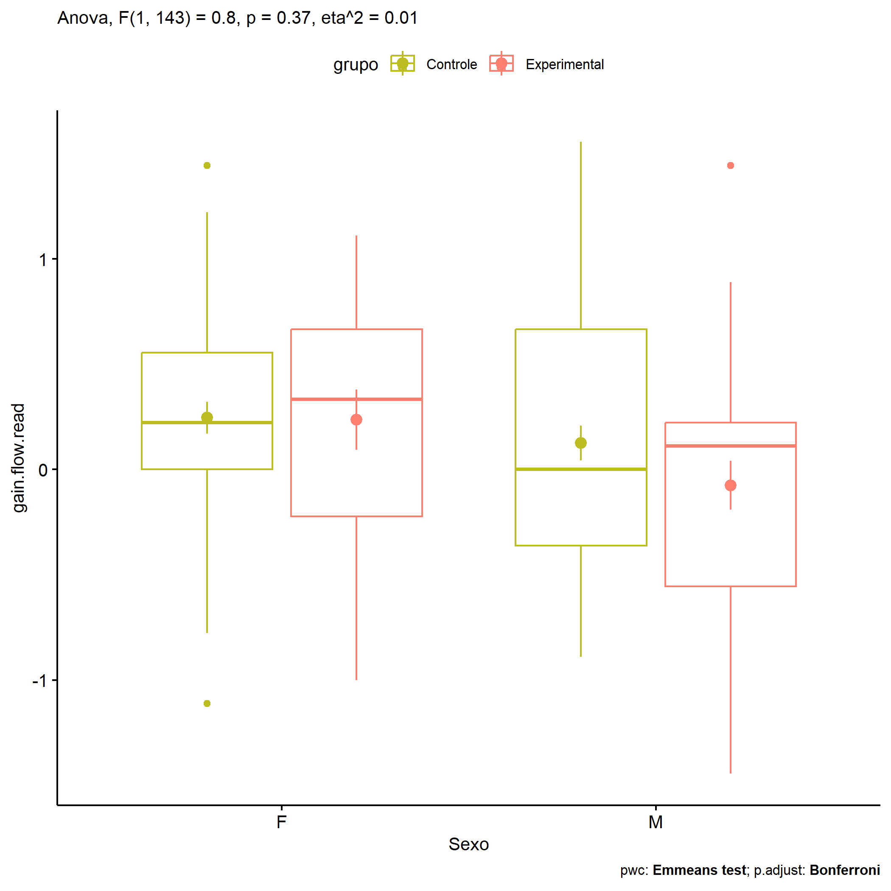
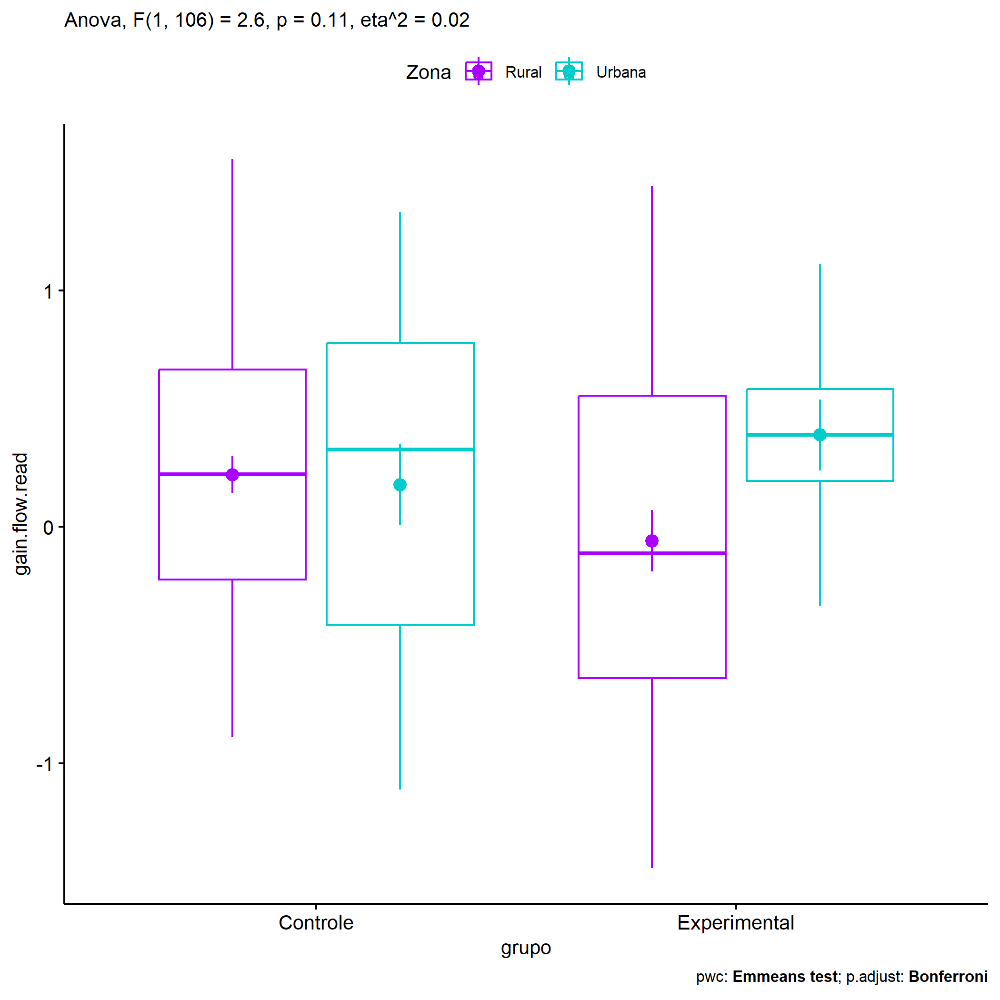
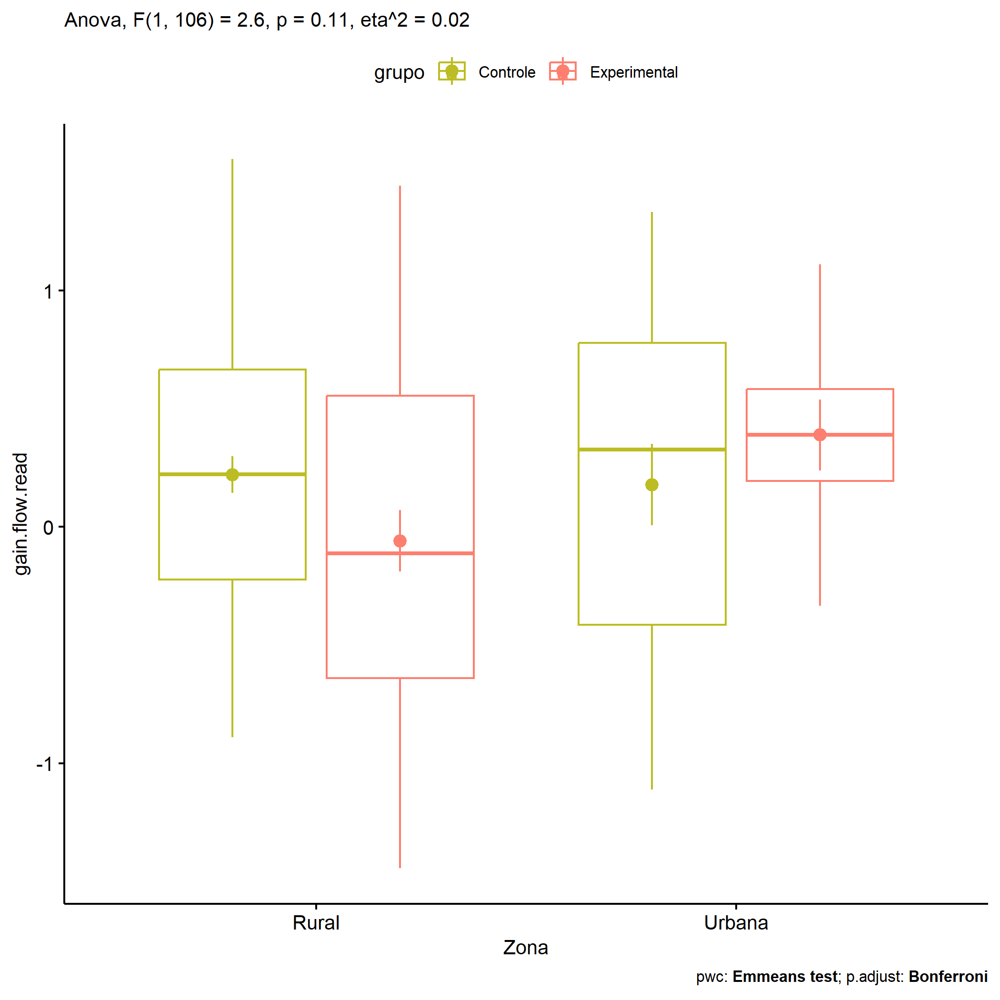
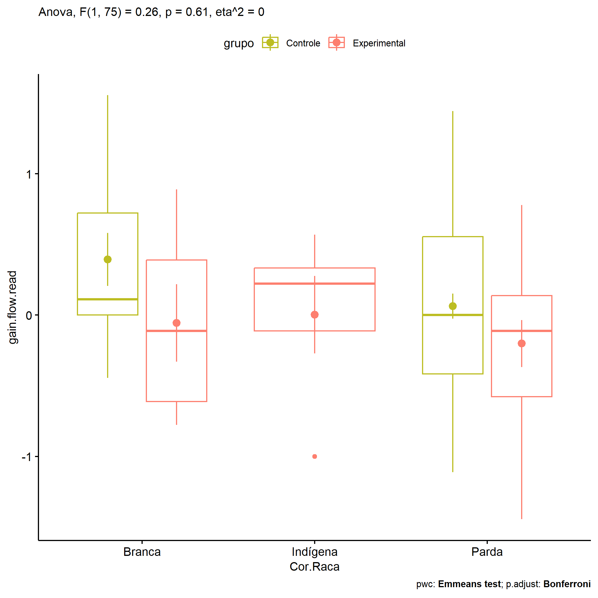

ANOVA in Gains for gain flow (ativ. leitura) (gain flow (ativ. leitura))
================
Geiser C. Challco <geiser@alumni.usp.br>

- [Descriptive Statistics of Initial
  Data](#descriptive-statistics-of-initial-data)
- [Checking of Assumptions](#checking-of-assumptions)
  - [Assumption: Normality distribution of
    data](#assumption-normality-distribution-of-data)
  - [Assumption: Homogeneity of data
    distribution](#assumption-homogeneity-of-data-distribution)
- [Computation of ANCOVA test and Pairwise
  Comparison](#computation-of-ancova-test-and-pairwise-comparison)
  - [ANCOVA tests for one factor](#ancova-tests-for-one-factor)
  - [ANCOVA tests for two factors](#ancova-tests-for-two-factors)
  - [Pairwise comparisons for one factor:
    **grupo**](#pairwise-comparisons-for-one-factor-grupo)
  - [Pairwise comparisons for two
    factors](#pairwise-comparisons-for-two-factors)
    - [factores: **grupo:Sexo**](#factores-gruposexo)
    - [factores: **grupo:Zona**](#factores-grupozona)
    - [factores: **grupo:Cor.Raca**](#factores-grupocorraca)

**NOTE**

- Teste ANOVA para determinar se houve diferenças significativas no gain
  flow (ativ. leitura) (medido usando a diferença entre post-test e
  pre-testes).
- ANOVA test to determine whether there were significant differences in
  gain flow (ativ. leitura) (measured using the difference between
  post-test and pre-tests).

# Descriptive Statistics of Initial Data

| grupo        | Sexo | Zona   | Cor.Raca | variable       |   n |   mean | median |    min |   max |    sd |    se |    ci |   iqr |
|:-------------|:-----|:-------|:---------|:---------------|----:|-------:|-------:|-------:|------:|------:|------:|------:|------:|
| Controle     | F    |        |          | gain.flow.read |  45 |  0.246 |  0.222 | -1.111 | 1.444 | 0.509 | 0.076 | 0.153 | 0.556 |
| Controle     | M    |        |          | gain.flow.read |  56 |  0.126 |  0.000 | -0.889 | 1.556 | 0.614 | 0.082 | 0.164 | 1.028 |
| Experimental | F    |        |          | gain.flow.read |  17 |  0.236 |  0.333 | -1.000 | 1.111 | 0.588 | 0.143 | 0.302 | 0.889 |
| Experimental | M    |        |          | gain.flow.read |  29 | -0.075 |  0.111 | -1.444 | 1.444 | 0.626 | 0.116 | 0.238 | 0.778 |
| Controle     |      | Rural  |          | gain.flow.read |  55 |  0.221 |  0.222 | -0.889 | 1.556 | 0.579 | 0.078 | 0.156 | 0.889 |
| Controle     |      | Urbana |          | gain.flow.read |  18 |  0.179 |  0.326 | -1.111 | 1.333 | 0.729 | 0.172 | 0.362 | 1.191 |
| Controle     |      |        |          | gain.flow.read |  28 |  0.097 |  0.111 | -0.833 | 0.889 | 0.433 | 0.082 | 0.168 | 0.556 |
| Experimental |      | Rural  |          | gain.flow.read |  29 | -0.059 | -0.111 | -1.444 | 1.444 | 0.697 | 0.129 | 0.265 | 1.194 |
| Experimental |      | Urbana |          | gain.flow.read |   8 |  0.389 |  0.389 | -0.333 | 1.111 | 0.424 | 0.150 | 0.355 | 0.389 |
| Experimental |      |        |          | gain.flow.read |   9 |  0.049 |  0.111 | -0.778 | 0.778 | 0.424 | 0.141 | 0.326 | 0.222 |
| Controle     |      |        | Branca   | gain.flow.read |  11 |  0.394 |  0.111 | -0.444 | 1.556 | 0.619 | 0.187 | 0.416 | 0.722 |
| Controle     |      |        | Parda    | gain.flow.read |  46 |  0.063 |  0.000 | -1.111 | 1.444 | 0.601 | 0.089 | 0.178 | 0.972 |
| Controle     |      |        | Preta    | gain.flow.read |   1 |  0.333 |  0.333 |  0.333 | 0.333 |       |       |       | 0.000 |
| Controle     |      |        |          | gain.flow.read |  43 |  0.245 |  0.333 | -0.889 | 1.111 | 0.513 | 0.078 | 0.158 | 0.778 |
| Experimental |      |        | Amarela  | gain.flow.read |   1 |  0.222 |  0.222 |  0.222 | 0.222 |       |       |       | 0.000 |
| Experimental |      |        | Branca   | gain.flow.read |   6 | -0.056 | -0.111 | -0.778 | 0.889 | 0.673 | 0.275 | 0.706 | 1.000 |
| Experimental |      |        | Indígena | gain.flow.read |   5 |  0.003 |  0.222 | -1.000 | 0.569 | 0.612 | 0.274 | 0.760 | 0.444 |
| Experimental |      |        | Parda    | gain.flow.read |  12 | -0.201 | -0.111 | -1.444 | 0.778 | 0.576 | 0.166 | 0.366 | 0.715 |
| Experimental |      |        |          | gain.flow.read |  22 |  0.198 |  0.111 | -1.111 | 1.444 | 0.647 | 0.138 | 0.287 | 0.972 |

# Checking of Assumptions

## Assumption: Normality distribution of data

| var            |   n |  skewness |   kurtosis | symmetry | statistic | method     |         p | p.signif | normality |
|:---------------|----:|----------:|-----------:|:---------|----------:|:-----------|----------:|:---------|:----------|
| gain.flow.read | 147 | 0.0235549 | -0.3511516 | YES      | 0.4845793 | D’Agostino | 0.7848288 | ns       | QQ        |
| gain.flow.read | 110 | 0.0563640 | -0.6501347 | YES      | 2.6172579 | D’Agostino | 0.2701902 | ns       | QQ        |
| gain.flow.read |  82 | 0.1495508 | -0.5334435 | YES      | 1.0713686 | D’Agostino | 0.5852686 | ns       | YES       |

## Assumption: Homogeneity of data distribution

| var            | method        | formula                              |   n | df1 | df2 | statistic |         p | p.signif |
|:---------------|:--------------|:-------------------------------------|----:|----:|----:|----------:|----------:|:---------|
| gain.flow.read | Levene’s test | `gain.flow.read`~`grupo`\*`Sexo`     | 147 |   3 | 143 | 1.1669154 | 0.3245932 | ns       |
| gain.flow.read | Levene’s test | `gain.flow.read`~`grupo`\*`Zona`     | 110 |   3 | 106 | 1.7113460 | 0.1691046 | ns       |
| gain.flow.read | Levene’s test | `gain.flow.read`~`grupo`\*`Cor.Raca` |  82 |   6 |  75 | 0.6780975 | 0.6676992 | ns       |

# Computation of ANCOVA test and Pairwise Comparison

## ANCOVA tests for one factor

| Effect   | DFn | DFd |   SSn |    SSd |     F |     p |   ges | p\<.05 |
|:---------|----:|----:|------:|-------:|------:|------:|------:|:-------|
| grupo    |   1 | 145 | 0.612 | 50.026 | 1.774 | 0.185 | 0.012 |        |
| Sexo     |   1 | 145 | 1.239 | 49.398 | 3.638 | 0.058 | 0.024 |        |
| Zona     |   1 | 108 | 0.281 | 43.712 | 0.694 | 0.407 | 0.006 |        |
| Cor.Raca |   4 |  77 | 0.793 | 28.949 | 0.527 | 0.716 | 0.027 |        |

## ANCOVA tests for two factors

|     | Effect         | DFn | DFd |   SSn |    SSd |     F |     p |   ges | p\<.05 |
|:----|:---------------|----:|----:|------:|-------:|------:|------:|------:|:-------|
| 3   | grupo:Sexo     |   1 | 143 | 0.272 | 48.629 | 0.801 | 0.372 | 0.006 |        |
| 6   | grupo:Zona     |   1 | 106 | 1.031 | 41.975 | 2.602 | 0.110 | 0.024 |        |
| 9   | grupo:Cor.Raca |   1 |  75 | 0.094 | 27.497 | 0.257 | 0.614 | 0.003 |        |

## Pairwise comparisons for one factor: **grupo**

| var            | grupo        |   n |     M |    SE |
|:---------------|:-------------|----:|------:|------:|
| gain.flow.read | Controle     | 101 | 0.179 | 0.057 |
| gain.flow.read | Experimental |  46 | 0.040 | 0.092 |

| .y.            | group1   | group2       | estimate | conf.low | conf.high |    se | statistic |     p | p.adj | p.adj.signif |
|:---------------|:---------|:-------------|---------:|---------:|----------:|------:|----------:|------:|------:|:-------------|
| gain.flow.read | Controle | Experimental |    0.139 |   -0.067 |     0.346 | 0.104 |     1.332 | 0.185 | 0.185 | ns           |

    ## Scale for colour is already present.
    ## Adding another scale for colour, which will replace the existing scale.

<!-- -->

## Pairwise comparisons for two factors

### factores: **grupo:Sexo**

| var            | grupo        | Sexo |   n |      M |    SE |
|:---------------|:-------------|:-----|----:|-------:|------:|
| gain.flow.read | Controle     | F    |  45 |  0.246 | 0.076 |
| gain.flow.read | Controle     | M    |  56 |  0.126 | 0.082 |
| gain.flow.read | Experimental | F    |  17 |  0.236 | 0.143 |
| gain.flow.read | Experimental | M    |  29 | -0.075 | 0.116 |

| .y.            | grupo        | Sexo | group1   | group2       | estimate | conf.low | conf.high |    se | statistic |     p | p.adj | p.adj.signif |
|:---------------|:-------------|:-----|:---------|:-------------|---------:|---------:|----------:|------:|----------:|------:|------:|:-------------|
| gain.flow.read |              | F    | Controle | Experimental |    0.010 |   -0.318 |     0.338 | 0.166 |     0.059 | 0.953 | 0.953 | ns           |
| gain.flow.read |              | M    | Controle | Experimental |    0.200 |   -0.063 |     0.464 | 0.133 |     1.503 | 0.135 | 0.135 | ns           |
| gain.flow.read | Controle     |      | F        | M            |    0.120 |   -0.111 |     0.351 | 0.117 |     1.030 | 0.305 | 0.305 | ns           |
| gain.flow.read | Experimental |      | F        | M            |    0.311 |   -0.041 |     0.663 | 0.178 |     1.745 | 0.083 | 0.083 | ns           |

    ## Scale for colour is already present.
    ## Adding another scale for colour, which will replace the existing scale.

<!-- -->

    ## Scale for colour is already present.
    ## Adding another scale for colour, which will replace the existing scale.

<!-- -->

### factores: **grupo:Zona**

| var            | grupo        | Zona   |   n |      M |    SE |
|:---------------|:-------------|:-------|----:|-------:|------:|
| gain.flow.read | Controle     | Rural  |  55 |  0.221 | 0.078 |
| gain.flow.read | Controle     | Urbana |  18 |  0.179 | 0.172 |
| gain.flow.read | Experimental | Rural  |  29 | -0.059 | 0.129 |
| gain.flow.read | Experimental | Urbana |   8 |  0.389 | 0.150 |

| .y.            | grupo        | Zona   | group1   | group2       | estimate | conf.low | conf.high |    se | statistic |     p | p.adj | p.adj.signif |
|:---------------|:-------------|:-------|:---------|:-------------|---------:|---------:|----------:|------:|----------:|------:|------:|:-------------|
| gain.flow.read |              | Rural  | Controle | Experimental |    0.280 |   -0.006 |     0.567 | 0.144 |     1.941 | 0.055 | 0.055 | ns           |
| gain.flow.read |              | Urbana | Controle | Experimental |   -0.210 |   -0.740 |     0.320 | 0.267 |    -0.785 | 0.434 | 0.434 | ns           |
| gain.flow.read | Controle     |        | Rural    | Urbana       |    0.042 |   -0.296 |     0.381 | 0.171 |     0.248 | 0.804 | 0.804 | ns           |
| gain.flow.read | Experimental |        | Rural    | Urbana       |   -0.448 |   -0.946 |     0.050 | 0.251 |    -1.782 | 0.078 | 0.078 | ns           |

    ## Scale for colour is already present.
    ## Adding another scale for colour, which will replace the existing scale.

<!-- -->

    ## Scale for colour is already present.
    ## Adding another scale for colour, which will replace the existing scale.

<!-- -->

### factores: **grupo:Cor.Raca**

| var            | grupo        | Cor.Raca |   n |      M |    SE |
|:---------------|:-------------|:---------|----:|-------:|------:|
| gain.flow.read | Controle     | Branca   |  11 |  0.394 | 0.187 |
| gain.flow.read | Controle     | Parda    |  46 |  0.063 | 0.089 |
| gain.flow.read | Experimental | Branca   |   6 | -0.056 | 0.275 |
| gain.flow.read | Experimental | Indígena |   5 |  0.003 | 0.274 |
| gain.flow.read | Experimental | Parda    |  12 | -0.201 | 0.166 |

|     | .y.            | grupo        | Cor.Raca | group1   | group2       | estimate | conf.low | conf.high |    se | statistic |     p | p.adj | p.adj.signif |
|:----|:---------------|:-------------|:---------|:---------|:-------------|---------:|---------:|----------:|------:|----------:|------:|------:|:-------------|
| 1   | gain.flow.read |              | Branca   | Controle | Experimental |    0.449 |   -0.163 |     1.062 | 0.307 |     1.463 | 0.148 | 0.148 | ns           |
| 3   | gain.flow.read |              | Parda    | Controle | Experimental |    0.265 |   -0.126 |     0.656 | 0.196 |     1.349 | 0.181 | 0.181 | ns           |
| 5   | gain.flow.read | Controle     |          | Branca   | Parda        |    0.331 |   -0.074 |     0.735 | 0.203 |     1.626 | 0.108 | 0.108 | ns           |
| 7   | gain.flow.read | Experimental |          | Branca   | Indígena     |   -0.058 |   -0.789 |     0.672 | 0.367 |    -0.159 | 0.874 | 1.000 | ns           |
| 8   | gain.flow.read | Experimental |          | Branca   | Parda        |    0.146 |   -0.457 |     0.749 | 0.303 |     0.482 | 0.631 | 1.000 | ns           |
| 9   | gain.flow.read | Experimental |          | Indígena | Parda        |    0.204 |   -0.438 |     0.846 | 0.322 |     0.633 | 0.528 | 1.000 | ns           |

    ## Scale for colour is already present.
    ## Adding another scale for colour, which will replace the existing scale.

<!-- -->
