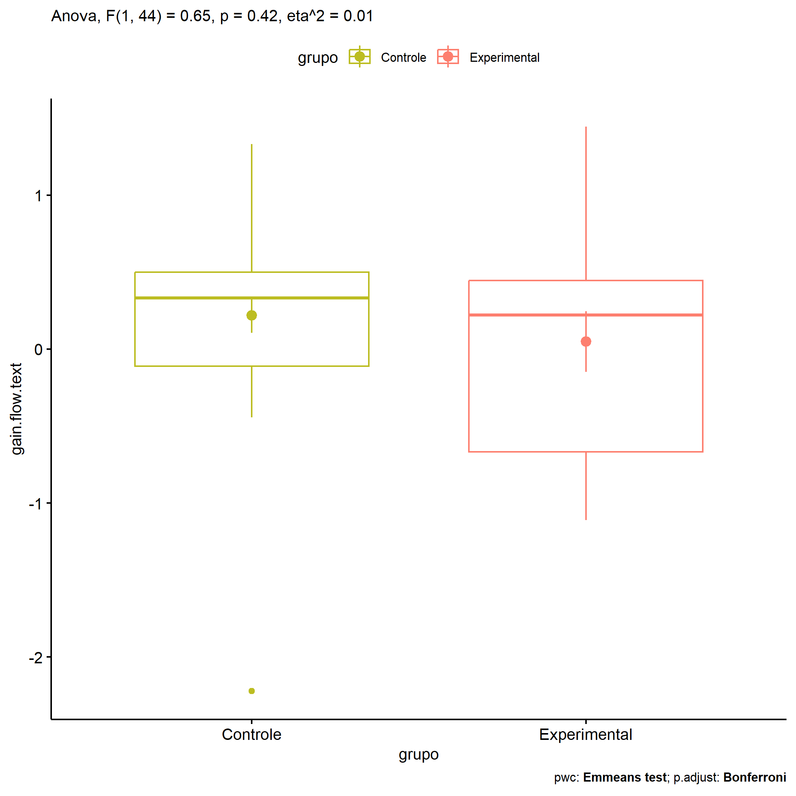
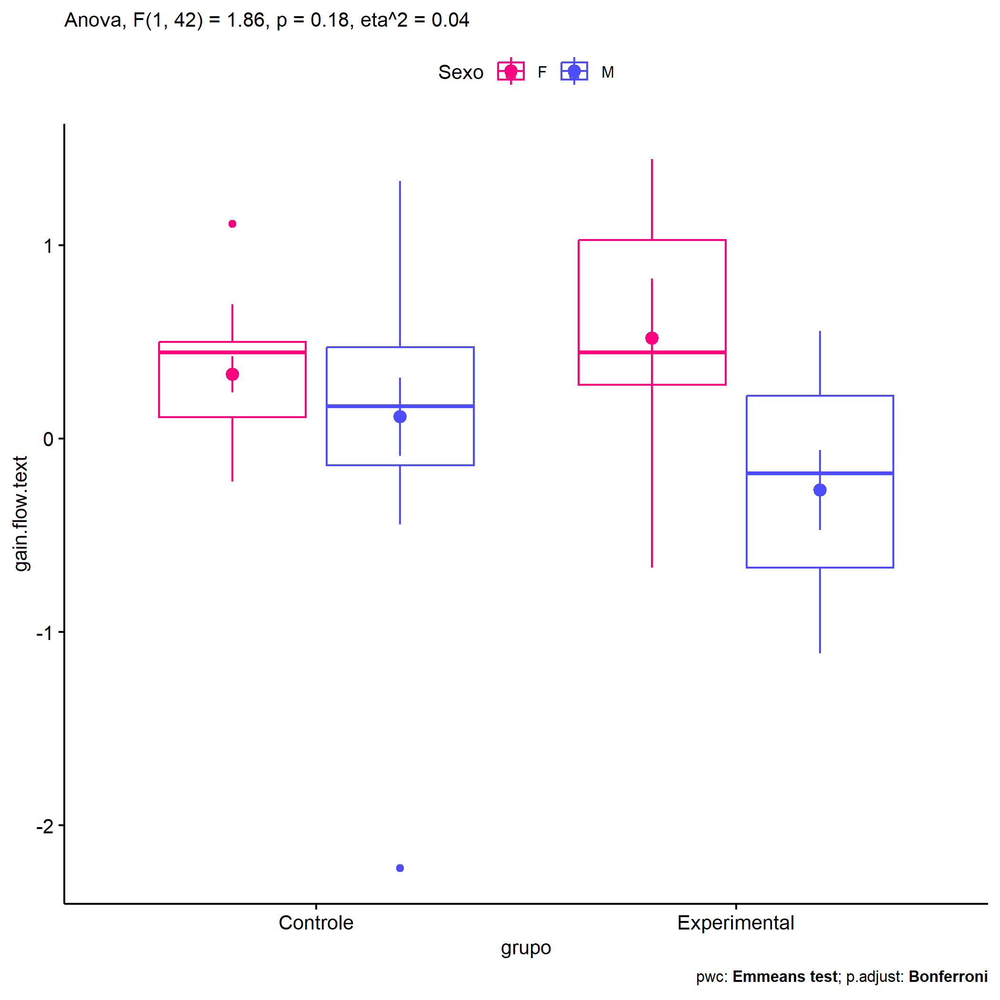
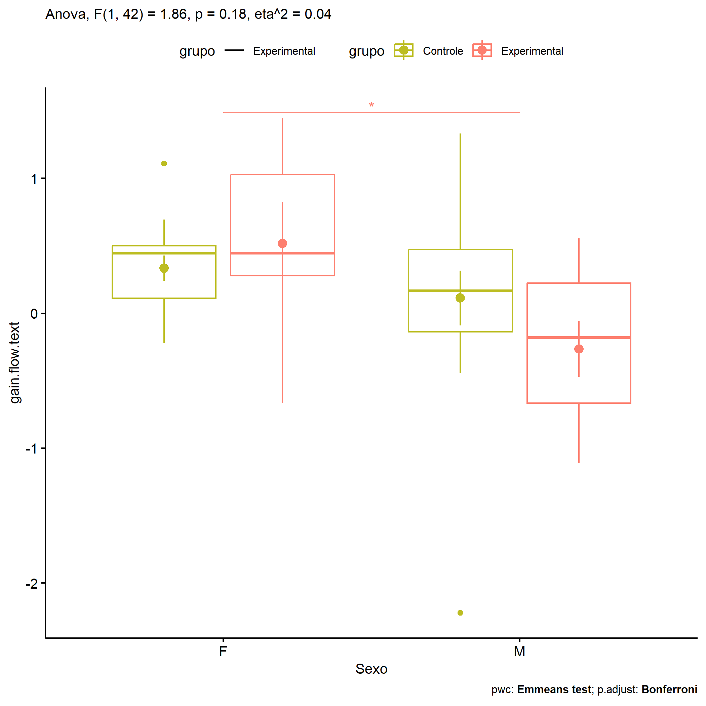

ANOVA in Gains for gain flow (prod. textual) (gain flow (prod. textual))
================
Geiser C. Challco <geiser@alumni.usp.br>

- [Descriptive Statistics of Initial
  Data](#descriptive-statistics-of-initial-data)
- [Checking of Assumptions](#checking-of-assumptions)
  - [Assumption: Normality distribution of
    data](#assumption-normality-distribution-of-data)
  - [Assumption: Homogeneity of data
    distribution](#assumption-homogeneity-of-data-distribution)
- [Computation of ANCOVA test and Pairwise
  Comparison](#computation-of-ancova-test-and-pairwise-comparison)
  - [ANCOVA tests for one factor](#ancova-tests-for-one-factor)
  - [ANCOVA tests for two factors](#ancova-tests-for-two-factors)
  - [Pairwise comparisons for one factor:
    **grupo**](#pairwise-comparisons-for-one-factor-grupo)
  - [Pairwise comparisons for two
    factors](#pairwise-comparisons-for-two-factors)
    - [factores: **grupo:Sexo**](#factores-gruposexo)
    - [factores: **grupo:Zona**](#factores-grupozona)
    - [factores: **grupo:Cor.Raca**](#factores-grupocorraca)

**NOTE**

- Teste ANOVA para determinar se houve diferenças significativas no gain
  flow (prod. textual) (medido usando a diferença entre post-test e
  pre-testes).
- ANOVA test to determine whether there were significant differences in
  gain flow (prod. textual) (measured using the difference between
  post-test and pre-tests).

# Descriptive Statistics of Initial Data

| grupo        | Sexo | Zona   | Cor.Raca | variable       |   n |   mean | median |    min |   max |    sd |    se |    ci |   iqr |
|:-------------|:-----|:-------|:---------|:---------------|----:|-------:|-------:|-------:|------:|------:|------:|------:|------:|
| Controle     | F    |        |          | gain.flow.text |  15 |  0.333 |  0.444 | -0.222 | 1.111 | 0.363 | 0.094 | 0.201 | 0.389 |
| Controle     | M    |        |          | gain.flow.text |  16 |  0.113 |  0.167 | -2.222 | 1.333 | 0.809 | 0.202 | 0.431 | 0.611 |
| Experimental | F    |        |          | gain.flow.text |   6 |  0.519 |  0.444 | -0.667 | 1.444 | 0.756 | 0.309 | 0.793 | 0.750 |
| Experimental | M    |        |          | gain.flow.text |   9 | -0.265 | -0.181 | -1.111 | 0.556 | 0.620 | 0.207 | 0.477 | 0.889 |
| Controle     |      | Rural  |          | gain.flow.text |  20 |  0.111 |  0.222 | -2.222 | 1.111 | 0.688 | 0.154 | 0.322 | 0.583 |
| Controle     |      | Urbana |          | gain.flow.text |   8 |  0.517 |  0.500 | -0.111 | 1.333 | 0.513 | 0.181 | 0.429 | 0.451 |
| Controle     |      |        |          | gain.flow.text |   3 |  0.148 |  0.222 | -0.222 | 0.444 | 0.339 | 0.196 | 0.843 | 0.333 |
| Experimental |      | Rural  |          | gain.flow.text |  10 |  0.101 |  0.222 | -1.000 | 1.444 | 0.721 | 0.228 | 0.516 | 0.941 |
| Experimental |      | Urbana |          | gain.flow.text |   4 | -0.184 | -0.424 | -1.111 | 1.222 | 1.012 | 0.506 | 1.610 | 0.948 |
| Experimental |      |        |          | gain.flow.text |   1 |  0.444 |  0.444 |  0.444 | 0.444 |       |       |       | 0.000 |
| Controle     |      |        | Branca   | gain.flow.text |   5 |  0.511 |  0.444 |  0.222 | 0.889 | 0.243 | 0.109 | 0.302 | 0.111 |
| Controle     |      |        | Parda    | gain.flow.text |  13 |  0.075 |  0.000 | -0.444 | 0.556 | 0.350 | 0.097 | 0.212 | 0.639 |
| Controle     |      |        |          | gain.flow.text |  13 |  0.252 |  0.361 | -2.222 | 1.333 | 0.895 | 0.248 | 0.541 | 0.806 |
| Experimental |      |        | Amarela  | gain.flow.text |   1 |  0.444 |  0.444 |  0.444 | 0.444 |       |       |       | 0.000 |
| Experimental |      |        | Parda    | gain.flow.text |   4 | -0.139 | -0.222 | -0.667 | 0.556 | 0.624 | 0.312 | 0.994 | 0.972 |
| Experimental |      |        |          | gain.flow.text |  10 |  0.083 |  0.118 | -1.111 | 1.444 | 0.861 | 0.272 | 0.616 | 0.990 |

# Checking of Assumptions

## Assumption: Normality distribution of data

| var            |   n |   skewness |  kurtosis | symmetry | statistic | method       |         p | p.signif | normality |
|:---------------|----:|-----------:|----------:|:---------|----------:|:-------------|----------:|:---------|:----------|
| gain.flow.text |  46 | -0.9130072 |  2.518711 | NO       | 0.9390910 | Shapiro-Wilk | 0.0181053 | \*       | NO        |
| gain.flow.text |  42 | -0.6819377 |  1.923901 | NO       | 0.9517636 | Shapiro-Wilk | 0.0747080 | ns       | YES       |
| gain.flow.text |  23 |  0.0461547 | -1.212284 | YES      | 0.9422084 | Shapiro-Wilk | 0.2003990 | ns       | YES       |

## Assumption: Homogeneity of data distribution

| var            | method        | formula                              |   n | df1 | df2 | statistic |         p | p.signif |
|:---------------|:--------------|:-------------------------------------|----:|----:|----:|----------:|----------:|:---------|
| gain.flow.text | Levene’s test | `gain.flow.text`~`grupo`\*`Sexo`     |  46 |   3 |  42 | 1.2689099 | 0.2973523 | ns       |
| gain.flow.text | Levene’s test | `gain.flow.text`~`grupo`\*`Zona`     |  42 |   3 |  38 | 0.4507901 | 0.7182148 | ns       |
| gain.flow.text | Levene’s test | `gain.flow.text`~`grupo`\*`Cor.Raca` |  23 |   3 |  19 | 4.1040543 | 0.0210459 | \*       |

# Computation of ANCOVA test and Pairwise Comparison

## ANCOVA tests for one factor

| Effect   | DFn | DFd |   SSn |    SSd |     F |     p |   ges | p\<.05 |
|:---------|----:|----:|------:|-------:|------:|------:|------:|:-------|
| grupo    |   1 |  44 | 0.297 | 20.179 | 0.647 | 0.425 | 0.015 |        |
| Sexo     |   1 |  44 | 1.915 | 18.561 | 4.538 | 0.039 | 0.094 | \*     |
| Zona     |   1 |  40 | 0.265 | 19.900 | 0.532 | 0.470 | 0.013 |        |
| Cor.Raca |   2 |  20 | 1.006 |  3.018 | 3.335 | 0.056 | 0.250 |        |

## ANCOVA tests for two factors

|     | Effect         | DFn | DFd |   SSn |    SSd |     F |    p |   ges | p\<.05 |
|:----|:---------------|----:|----:|------:|-------:|------:|-----:|------:|:-------|
| 3   | grupo:Sexo     |   1 |  42 | 0.780 | 17.590 | 1.863 | 0.18 | 0.042 |        |
| 6   | grupo:Zona     |   1 |  38 | 0.911 | 18.588 | 1.863 | 0.18 | 0.047 |        |
| 9   | grupo:Cor.Raca |   0 |  19 |       |  2.878 |       |      |       |        |

## Pairwise comparisons for one factor: **grupo**

| var            | grupo        |   n |     M |    SE |
|:---------------|:-------------|----:|------:|------:|
| gain.flow.text | Controle     |  31 | 0.220 | 0.114 |
| gain.flow.text | Experimental |  15 | 0.048 | 0.197 |

| .y.            | group1   | group2       | estimate | conf.low | conf.high |    se | statistic |     p | p.adj | p.adj.signif |
|:---------------|:---------|:-------------|---------:|---------:|----------:|------:|----------:|------:|------:|:-------------|
| gain.flow.text | Controle | Experimental |    0.171 |   -0.258 |     0.601 | 0.213 |     0.805 | 0.425 | 0.425 | ns           |

    ## Scale for colour is already present.
    ## Adding another scale for colour, which will replace the existing scale.

<!-- -->

## Pairwise comparisons for two factors

### factores: **grupo:Sexo**

| var            | grupo        | Sexo |   n |      M |    SE |
|:---------------|:-------------|:-----|----:|-------:|------:|
| gain.flow.text | Controle     | F    |  15 |  0.333 | 0.094 |
| gain.flow.text | Controle     | M    |  16 |  0.113 | 0.202 |
| gain.flow.text | Experimental | F    |   6 |  0.519 | 0.309 |
| gain.flow.text | Experimental | M    |   9 | -0.265 | 0.207 |

| .y.            | grupo        | Sexo | group1   | group2       | estimate | conf.low | conf.high |    se | statistic |     p | p.adj | p.adj.signif |
|:---------------|:-------------|:-----|:---------|:-------------|---------:|---------:|----------:|------:|----------:|------:|------:|:-------------|
| gain.flow.text |              | F    | Controle | Experimental |   -0.185 |   -0.816 |     0.446 | 0.313 |    -0.592 | 0.557 | 0.557 | ns           |
| gain.flow.text |              | M    | Controle | Experimental |    0.378 |   -0.166 |     0.922 | 0.270 |     1.403 | 0.168 | 0.168 | ns           |
| gain.flow.text | Controle     |      | F        | M            |    0.220 |   -0.249 |     0.690 | 0.233 |     0.948 | 0.349 | 0.349 | ns           |
| gain.flow.text | Experimental |      | F        | M            |    0.784 |    0.096 |     1.472 | 0.341 |     2.298 | 0.027 | 0.027 | \*           |

    ## Scale for colour is already present.
    ## Adding another scale for colour, which will replace the existing scale.

<!-- -->

    ## Scale for colour is already present.
    ## Adding another scale for colour, which will replace the existing scale.

<!-- -->

### factores: **grupo:Zona**

| var            | grupo        | Zona   |   n |     M |    SE |
|:---------------|:-------------|:-------|----:|------:|------:|
| gain.flow.text | Controle     | Rural  |  20 | 0.111 | 0.154 |
| gain.flow.text | Controle     | Urbana |   8 | 0.517 | 0.181 |
| gain.flow.text | Experimental | Rural  |  10 | 0.101 | 0.228 |

|     | .y.            | grupo    | Zona  | group1   | group2       | estimate | conf.low | conf.high |    se | statistic |     p | p.adj | p.adj.signif |
|:----|:---------------|:---------|:------|:---------|:-------------|---------:|---------:|----------:|------:|----------:|------:|------:|:-------------|
| 1   | gain.flow.text |          | Rural | Controle | Experimental |    0.010 |   -0.514 |     0.533 | 0.258 |     0.038 | 0.970 | 0.970 | ns           |
| 3   | gain.flow.text | Controle |       | Rural    | Urbana       |   -0.406 |   -0.972 |     0.159 | 0.279 |    -1.458 | 0.154 | 0.154 | ns           |

### factores: **grupo:Cor.Raca**
