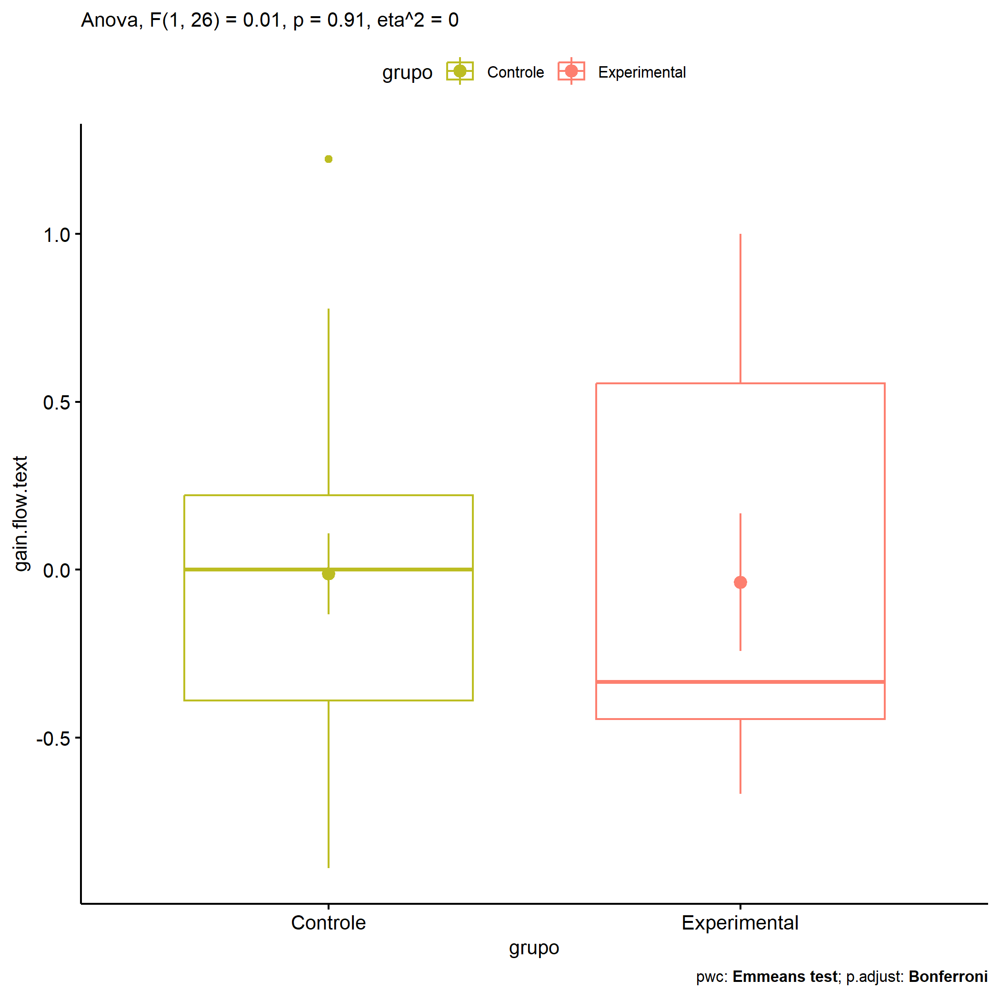

ANOVA in Gains for gain flow (prod. textual) (gain flow (prod. textual))
================
Geiser C. Challco <geiser@alumni.usp.br>

- [Descriptive Statistics of Initial
  Data](#descriptive-statistics-of-initial-data)
- [Checking of Assumptions](#checking-of-assumptions)
  - [Assumption: Normality distribution of
    data](#assumption-normality-distribution-of-data)
  - [Assumption: Homogeneity of data
    distribution](#assumption-homogeneity-of-data-distribution)
- [Computation of ANCOVA test and Pairwise
  Comparison](#computation-of-ancova-test-and-pairwise-comparison)
  - [ANCOVA tests for one factor](#ancova-tests-for-one-factor)
  - [ANCOVA tests for two factors](#ancova-tests-for-two-factors)
  - [Pairwise comparisons for one factor:
    **grupo**](#pairwise-comparisons-for-one-factor-grupo)
  - [Pairwise comparisons for two
    factors](#pairwise-comparisons-for-two-factors)
    - [factores: **grupo:Sexo**](#factores-gruposexo)
    - [factores: **grupo:Zona**](#factores-grupozona)
    - [factores: **grupo:Cor.Raca**](#factores-grupocorraca)

**NOTE**

- Teste ANOVA para determinar se houve diferenças significativas no gain
  flow (prod. textual) (medido usando a diferença entre post-test e
  pre-testes).
- ANOVA test to determine whether there were significant differences in
  gain flow (prod. textual) (measured using the difference between
  post-test and pre-tests).

# Descriptive Statistics of Initial Data

| grupo        | Sexo | Zona   | Cor.Raca | variable       |   n |   mean | median |    min |    max |    sd |    se |    ci |   iqr |
|:-------------|:-----|:-------|:---------|:---------------|----:|-------:|-------:|-------:|-------:|------:|------:|------:|------:|
| Controle     | F    |        |          | gain.flow.text |   6 |  0.056 |  0.111 | -0.556 |  0.778 | 0.501 | 0.204 | 0.525 | 0.639 |
| Controle     | M    |        |          | gain.flow.text |  13 | -0.044 | -0.111 | -0.889 |  1.222 | 0.552 | 0.153 | 0.334 | 0.556 |
| Experimental | F    |        |          | gain.flow.text |   4 |  0.111 |  0.056 | -0.667 |  1.000 | 0.796 | 0.398 | 1.267 | 1.167 |
| Experimental | M    |        |          | gain.flow.text |   5 | -0.156 | -0.333 | -0.556 |  0.667 | 0.488 | 0.218 | 0.606 | 0.333 |
| Controle     |      | Rural  |          | gain.flow.text |   8 | -0.043 | -0.222 | -0.569 |  1.222 | 0.568 | 0.201 | 0.475 | 0.417 |
| Controle     |      |        |          | gain.flow.text |  11 |  0.010 |  0.000 | -0.889 |  0.778 | 0.517 | 0.156 | 0.348 | 0.611 |
| Experimental |      | Rural  |          | gain.flow.text |   5 | -0.178 | -0.333 | -0.556 |  0.556 | 0.442 | 0.198 | 0.548 | 0.333 |
| Experimental |      | Urbana |          | gain.flow.text |   1 | -0.444 | -0.444 | -0.444 | -0.444 |       |       |       | 0.000 |
| Experimental |      |        |          | gain.flow.text |   3 |  0.333 |  0.667 | -0.667 |  1.000 | 0.882 | 0.509 | 2.191 | 0.833 |
| Controle     |      |        | Branca   | gain.flow.text |   1 | -0.333 | -0.333 | -0.333 | -0.333 |       |       |       | 0.000 |
| Controle     |      |        | Parda    | gain.flow.text |   7 |  0.188 |  0.000 | -0.569 |  1.222 | 0.593 | 0.224 | 0.549 | 0.556 |
| Controle     |      |        |          | gain.flow.text |  11 | -0.111 | -0.111 | -0.889 |  0.778 | 0.484 | 0.146 | 0.325 | 0.722 |
| Experimental |      |        | Branca   | gain.flow.text |   2 | -0.389 | -0.389 | -0.444 | -0.333 | 0.079 | 0.056 | 0.706 | 0.056 |
| Experimental |      |        | Indígena | gain.flow.text |   2 |  0.222 |  0.222 | -0.111 |  0.556 | 0.471 | 0.333 | 4.235 | 0.333 |
| Experimental |      |        | Parda    | gain.flow.text |   3 | -0.556 | -0.556 | -0.667 | -0.444 | 0.111 | 0.064 | 0.276 | 0.111 |
| Experimental |      |        |          | gain.flow.text |   2 |  0.833 |  0.833 |  0.667 |  1.000 | 0.236 | 0.167 | 2.118 | 0.167 |

# Checking of Assumptions

## Assumption: Normality distribution of data

| var            |   n |  skewness |   kurtosis | symmetry | statistic | method       |         p | p.signif | normality |
|:---------------|----:|----------:|-----------:|:---------|----------:|:-------------|----------:|:---------|:----------|
| gain.flow.text |  28 | 0.5017546 | -0.5844231 | NO       | 0.9622571 | Shapiro-Wilk | 0.3938423 | ns       | YES       |
| gain.flow.text |  14 | 1.3379589 |  0.9152646 | NO       | 0.8333481 | Shapiro-Wilk | 0.0132995 | \*       | NO        |
| gain.flow.text |  15 | 0.6679294 |  0.6894424 | NO       | 0.9350792 | Shapiro-Wilk | 0.3244989 | ns       | YES       |

## Assumption: Homogeneity of data distribution

| var            | method        | formula                              |   n | df1 | df2 | statistic |         p | p.signif |
|:---------------|:--------------|:-------------------------------------|----:|----:|----:|----------:|----------:|:---------|
| gain.flow.text | Levene’s test | `gain.flow.text`~`grupo`\*`Sexo`     |  28 |   3 |  24 | 0.8979944 | 0.4566064 | ns       |
| gain.flow.text | Levene’s test | `gain.flow.text`~`grupo`\*`Zona`     |  14 |   2 |  11 | 0.2978903 | 0.7481864 | ns       |
| gain.flow.text | Levene’s test | `gain.flow.text`~`grupo`\*`Cor.Raca` |  15 |   4 |  10 | 0.9288495 | 0.4851206 | ns       |

# Computation of ANCOVA test and Pairwise Comparison

## ANCOVA tests for one factor

| Effect   | DFn | DFd |   SSn |   SSd |     F |     p |   ges | p\<.05 |
|:---------|----:|----:|------:|------:|------:|------:|------:|:-------|
| grupo    |   1 |  26 | 0.004 | 7.963 | 0.012 | 0.913 | 0.000 |        |
| Sexo     |   1 |  26 | 0.150 | 7.817 | 0.498 | 0.487 | 0.019 |        |
| Zona     |   1 |  12 | 0.113 | 3.096 | 0.439 | 0.520 | 0.035 |        |
| Cor.Raca |   2 |  12 | 0.454 | 3.530 | 0.771 | 0.484 | 0.114 |        |

## ANCOVA tests for two factors

|     | Effect         | DFn | DFd |  SSn |   SSd |     F |     p |   ges | p\<.05 |
|:----|:---------------|----:|----:|-----:|------:|------:|------:|------:|:-------|
| 3   | grupo:Sexo     |   1 |  24 | 0.04 | 7.765 | 0.125 | 0.727 | 0.005 |        |
| 6   | grupo:Zona     |   0 |  11 |      | 3.040 |       |       |       |        |
| 9   | grupo:Cor.Raca |   1 |  10 | 0.24 | 2.366 | 1.014 | 0.338 | 0.092 |        |

## Pairwise comparisons for one factor: **grupo**

| var            | grupo        |   n |      M |    SE |
|:---------------|:-------------|----:|-------:|------:|
| gain.flow.text | Controle     |  19 | -0.012 | 0.120 |
| gain.flow.text | Experimental |   9 | -0.037 | 0.205 |

| .y.            | group1   | group2       | estimate | conf.low | conf.high |    se | statistic |     p | p.adj | p.adj.signif |
|:---------------|:---------|:-------------|---------:|---------:|----------:|------:|----------:|------:|------:|:-------------|
| gain.flow.text | Controle | Experimental |    0.025 |   -0.436 |     0.485 | 0.224 |      0.11 | 0.913 | 0.913 | ns           |

    ## Scale for colour is already present.
    ## Adding another scale for colour, which will replace the existing scale.

<!-- -->

## Pairwise comparisons for two factors

### factores: **grupo:Sexo**

| var            | grupo        | Sexo |   n |      M |    SE |
|:---------------|:-------------|:-----|----:|-------:|------:|
| gain.flow.text | Controle     | F    |   6 |  0.056 | 0.204 |
| gain.flow.text | Controle     | M    |  13 | -0.044 | 0.153 |
| gain.flow.text | Experimental | M    |   5 | -0.156 | 0.218 |

|     | .y.            | grupo    | Sexo | group1   | group2       | estimate | conf.low | conf.high |    se | statistic |     p | p.adj | p.adj.signif |
|:----|:---------------|:---------|:-----|:---------|:-------------|---------:|---------:|----------:|------:|----------:|------:|------:|:-------------|
| 2   | gain.flow.text |          | M    | Controle | Experimental |    0.112 |   -0.467 |     0.690 | 0.278 |     0.402 | 0.692 | 0.692 | ns           |
| 3   | gain.flow.text | Controle |      | F        | M            |    0.099 |   -0.443 |     0.642 | 0.261 |     0.381 | 0.707 | 0.707 | ns           |

### factores: **grupo:Zona**

### factores: **grupo:Cor.Raca**
