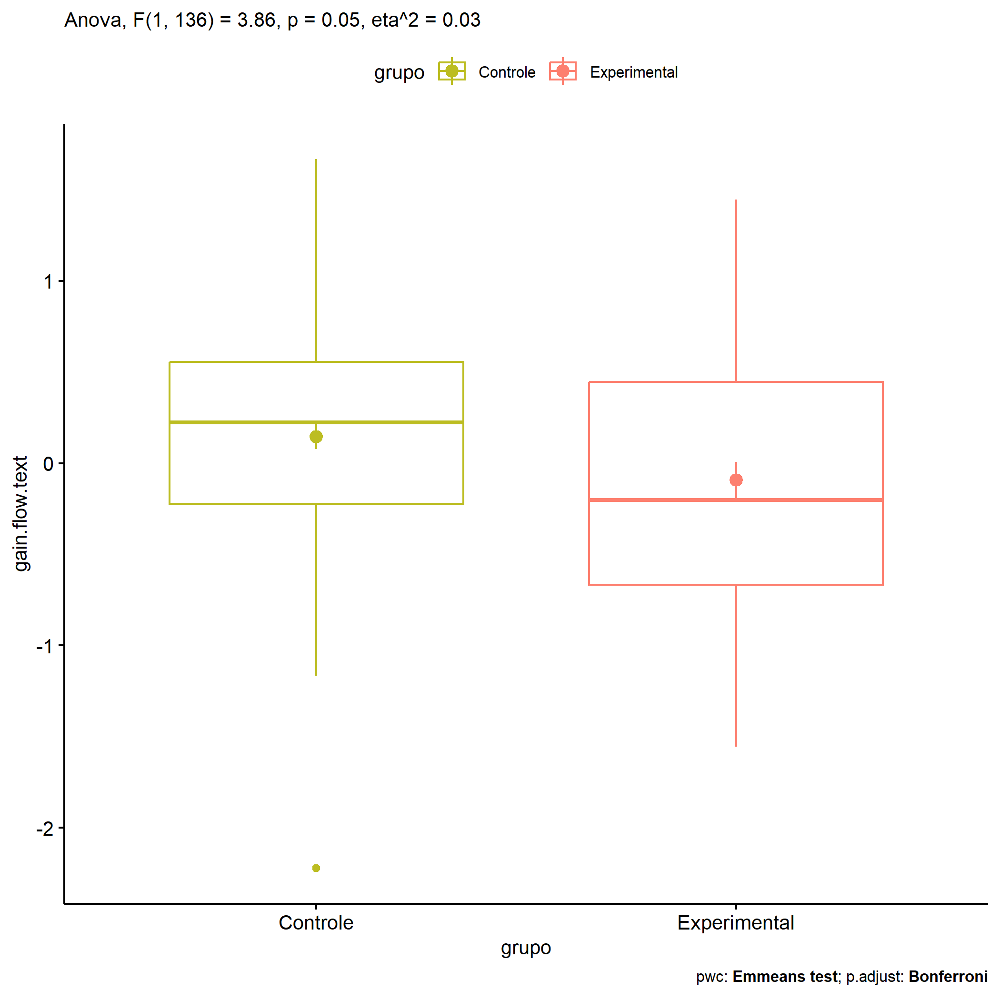
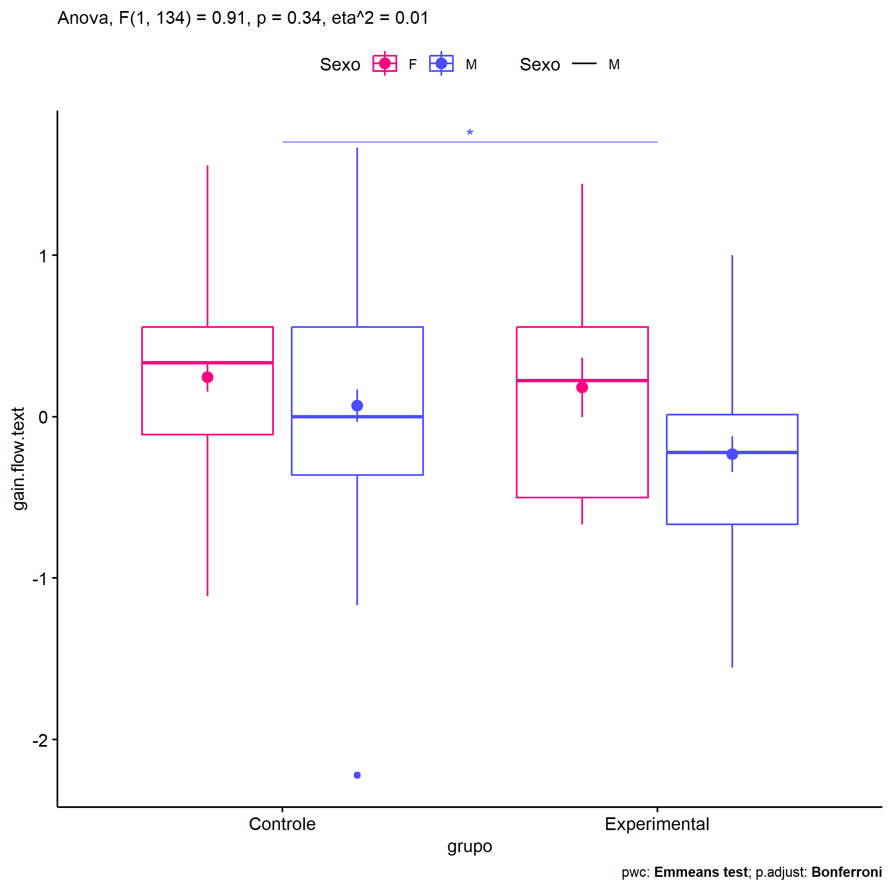
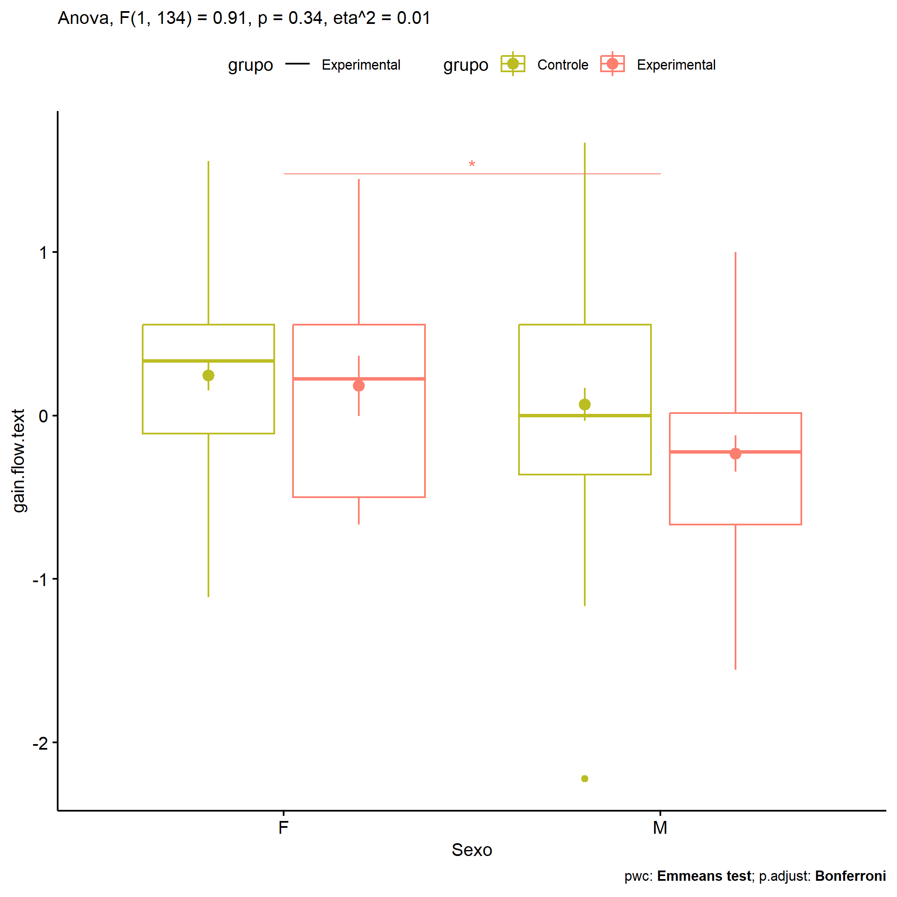
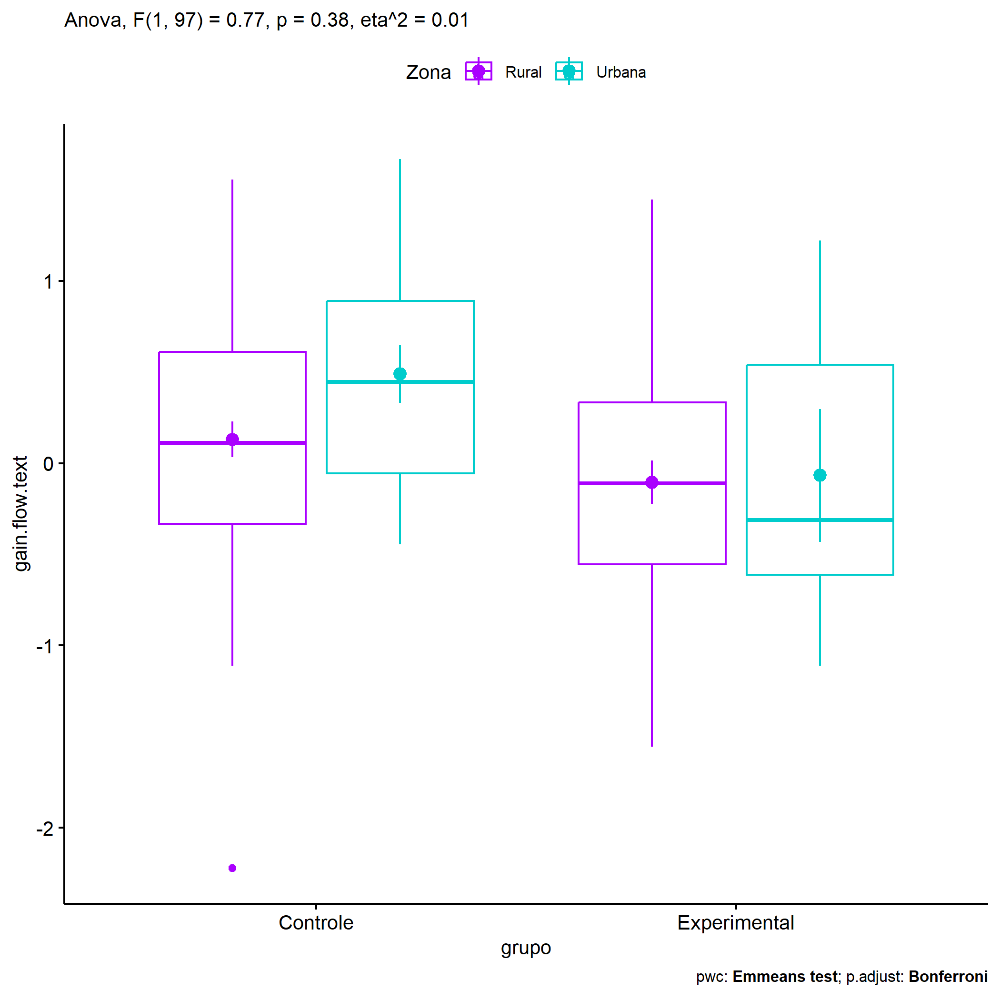
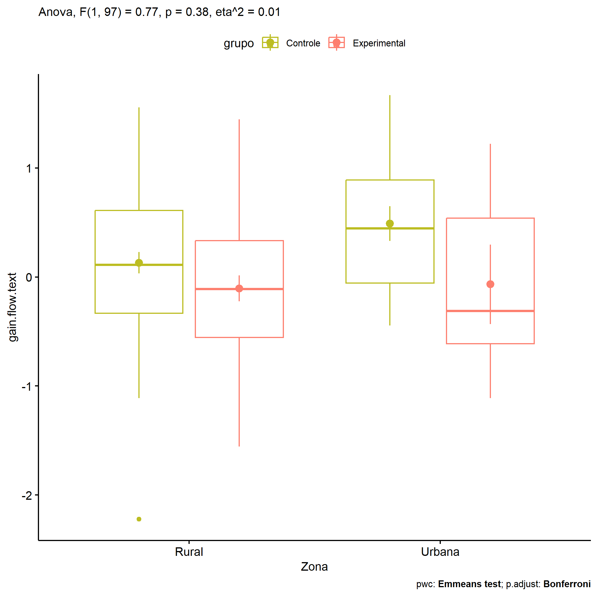
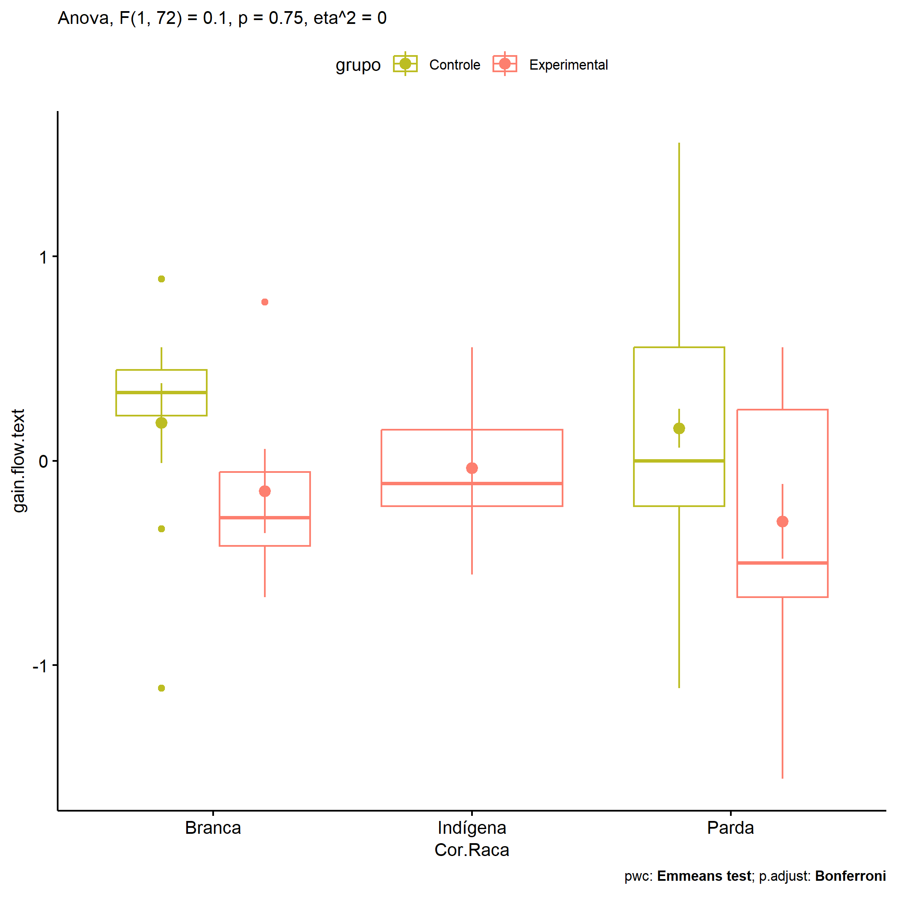

ANOVA in Gains for gain flow (prod. textual) (gain flow (prod. textual))
================
Geiser C. Challco <geiser@alumni.usp.br>

- [Descriptive Statistics of Initial
  Data](#descriptive-statistics-of-initial-data)
- [Checking of Assumptions](#checking-of-assumptions)
  - [Assumption: Normality distribution of
    data](#assumption-normality-distribution-of-data)
  - [Assumption: Homogeneity of data
    distribution](#assumption-homogeneity-of-data-distribution)
- [Computation of ANCOVA test and Pairwise
  Comparison](#computation-of-ancova-test-and-pairwise-comparison)
  - [ANCOVA tests for one factor](#ancova-tests-for-one-factor)
  - [ANCOVA tests for two factors](#ancova-tests-for-two-factors)
  - [Pairwise comparisons for one factor:
    **grupo**](#pairwise-comparisons-for-one-factor-grupo)
  - [Pairwise comparisons for two
    factors](#pairwise-comparisons-for-two-factors)
    - [factores: **grupo:Sexo**](#factores-gruposexo)
    - [factores: **grupo:Zona**](#factores-grupozona)
    - [factores: **grupo:Cor.Raca**](#factores-grupocorraca)

**NOTE**

- Teste ANOVA para determinar se houve diferenças significativas no gain
  flow (prod. textual) (medido usando a diferença entre post-test e
  pre-testes).
- ANOVA test to determine whether there were significant differences in
  gain flow (prod. textual) (measured using the difference between
  post-test and pre-tests).

# Descriptive Statistics of Initial Data

| grupo        | Sexo | Zona   | Cor.Raca | variable       |   n |   mean | median |    min |   max |    sd |    se |    ci |   iqr |
|:-------------|:-----|:-------|:---------|:---------------|----:|-------:|-------:|-------:|------:|------:|------:|------:|------:|
| Controle     | F    |        |          | gain.flow.text |  42 |  0.243 |  0.333 | -1.111 | 1.556 | 0.581 | 0.090 | 0.181 | 0.667 |
| Controle     | M    |        |          | gain.flow.text |  52 |  0.068 |  0.000 | -2.222 | 1.667 | 0.721 | 0.100 | 0.201 | 0.917 |
| Experimental | F    |        |          | gain.flow.text |  15 |  0.181 |  0.222 | -0.667 | 1.444 | 0.713 | 0.184 | 0.395 | 1.056 |
| Experimental | M    |        |          | gain.flow.text |  29 | -0.233 | -0.222 | -1.556 | 1.000 | 0.594 | 0.110 | 0.226 | 0.681 |
| Controle     |      | Rural  |          | gain.flow.text |  51 |  0.130 |  0.111 | -2.222 | 1.556 | 0.706 | 0.099 | 0.199 | 0.944 |
| Controle     |      | Urbana |          | gain.flow.text |  15 |  0.491 |  0.444 | -0.444 | 1.667 | 0.618 | 0.160 | 0.342 | 0.944 |
| Controle     |      |        |          | gain.flow.text |  28 | -0.010 |  0.111 | -1.167 | 0.778 | 0.554 | 0.105 | 0.215 | 0.639 |
| Experimental |      | Rural  |          | gain.flow.text |  29 | -0.105 | -0.111 | -1.556 | 1.444 | 0.639 | 0.119 | 0.243 | 0.889 |
| Experimental |      | Urbana |          | gain.flow.text |   6 | -0.067 | -0.312 | -1.111 | 1.222 | 0.892 | 0.364 | 0.936 | 1.149 |
| Experimental |      |        |          | gain.flow.text |   9 | -0.065 | -0.222 | -0.778 | 1.000 | 0.642 | 0.214 | 0.493 | 1.111 |
| Controle     |      |        | Branca   | gain.flow.text |   9 |  0.185 |  0.333 | -1.111 | 0.889 | 0.585 | 0.195 | 0.450 | 0.222 |
| Controle     |      |        | Parda    | gain.flow.text |  45 |  0.160 |  0.000 | -1.111 | 1.556 | 0.632 | 0.094 | 0.190 | 0.778 |
| Controle     |      |        | Preta    | gain.flow.text |   1 |  0.778 |  0.778 |  0.778 | 0.778 |       |       |       | 0.000 |
| Controle     |      |        |          | gain.flow.text |  39 |  0.105 |  0.222 | -2.222 | 1.667 | 0.730 | 0.117 | 0.237 | 0.778 |
| Experimental |      |        | Amarela  | gain.flow.text |   1 |  0.444 |  0.444 |  0.444 | 0.444 |       |       |       | 0.000 |
| Experimental |      |        | Branca   | gain.flow.text |   6 | -0.148 | -0.278 | -0.667 | 0.778 | 0.505 | 0.206 | 0.530 | 0.361 |
| Experimental |      |        | Indígena | gain.flow.text |   5 | -0.036 | -0.111 | -0.556 | 0.556 | 0.417 | 0.187 | 0.518 | 0.375 |
| Experimental |      |        | Parda    | gain.flow.text |  12 | -0.296 | -0.500 | -1.556 | 0.556 | 0.634 | 0.183 | 0.403 | 0.917 |
| Experimental |      |        |          | gain.flow.text |  20 |  0.007 | -0.090 | -1.111 | 1.444 | 0.771 | 0.172 | 0.361 | 1.174 |

# Checking of Assumptions

## Assumption: Normality distribution of data

| var            |   n |   skewness |   kurtosis | symmetry | statistic | method     |         p | p.signif | normality |
|:---------------|----:|-----------:|-----------:|:---------|----------:|:-----------|----------:|:---------|:----------|
| gain.flow.text | 138 | -0.1087306 |  0.3343071 | YES      | 1.5622038 | D’Agostino | 0.4579012 | ns       | QQ        |
| gain.flow.text | 101 | -0.1152917 |  0.4070018 | YES      | 1.7115709 | D’Agostino | 0.4249493 | ns       | QQ        |
| gain.flow.text |  79 |  0.1427168 | -0.2772480 | YES      | 0.3311349 | D’Agostino | 0.8474127 | ns       | YES       |

## Assumption: Homogeneity of data distribution

| var            | method        | formula                              |   n | df1 | df2 | statistic |         p | p.signif |
|:---------------|:--------------|:-------------------------------------|----:|----:|----:|----------:|----------:|:---------|
| gain.flow.text | Levene’s test | `gain.flow.text`~`grupo`\*`Sexo`     | 138 |   3 | 134 | 0.8518242 | 0.4679605 | ns       |
| gain.flow.text | Levene’s test | `gain.flow.text`~`grupo`\*`Zona`     | 101 |   3 |  97 | 0.3460220 | 0.7920954 | ns       |
| gain.flow.text | Levene’s test | `gain.flow.text`~`grupo`\*`Cor.Raca` |  79 |   6 |  72 | 0.8835732 | 0.5115085 | ns       |

# Computation of ANCOVA test and Pairwise Comparison

## ANCOVA tests for one factor

| Effect   | DFn | DFd |   SSn |    SSd |     F |     p |   ges | p\<.05 |
|:---------|----:|----:|------:|-------:|------:|------:|------:|:-------|
| grupo    |   1 | 136 | 1.697 | 59.767 | 3.863 | 0.051 | 0.028 |        |
| Sexo     |   1 | 136 | 2.382 | 59.083 | 5.482 | 0.021 | 0.039 | \*     |
| Zona     |   1 |  99 | 1.364 | 48.045 | 2.811 | 0.097 | 0.028 |        |
| Cor.Raca |   4 |  74 | 0.705 | 29.108 | 0.448 | 0.774 | 0.024 |        |

## ANCOVA tests for two factors

|     | Effect         | DFn | DFd |   SSn |    SSd |     F |     p |   ges | p\<.05 |
|:----|:---------------|----:|----:|------:|-------:|------:|------:|------:|:-------|
| 3   | grupo:Sexo     |   1 | 134 | 0.391 | 57.360 | 0.914 | 0.341 | 0.007 |        |
| 6   | grupo:Zona     |   1 |  97 | 0.361 | 45.683 | 0.766 | 0.384 | 0.008 |        |
| 9   | grupo:Cor.Raca |   1 |  72 | 0.039 | 26.739 | 0.105 | 0.746 | 0.001 |        |

## Pairwise comparisons for one factor: **grupo**

| var            | grupo        |   n |      M |    SE |
|:---------------|:-------------|----:|-------:|------:|
| gain.flow.text | Controle     |  94 |  0.146 | 0.069 |
| gain.flow.text | Experimental |  44 | -0.092 | 0.099 |

| .y.            | group1   | group2       | estimate | conf.low | conf.high |    se | statistic |     p | p.adj | p.adj.signif |
|:---------------|:---------|:-------------|---------:|---------:|----------:|------:|----------:|------:|------:|:-------------|
| gain.flow.text | Controle | Experimental |    0.238 |   -0.001 |     0.477 | 0.121 |     1.965 | 0.051 | 0.051 | ns           |

    ## Scale for colour is already present.
    ## Adding another scale for colour, which will replace the existing scale.

<!-- -->

## Pairwise comparisons for two factors

### factores: **grupo:Sexo**

| var            | grupo        | Sexo |   n |      M |    SE |
|:---------------|:-------------|:-----|----:|-------:|------:|
| gain.flow.text | Controle     | F    |  42 |  0.243 | 0.090 |
| gain.flow.text | Controle     | M    |  52 |  0.068 | 0.100 |
| gain.flow.text | Experimental | F    |  15 |  0.181 | 0.184 |
| gain.flow.text | Experimental | M    |  29 | -0.233 | 0.110 |

| .y.            | grupo        | Sexo | group1   | group2       | estimate | conf.low | conf.high |    se | statistic |     p | p.adj | p.adj.signif |
|:---------------|:-------------|:-----|:---------|:-------------|---------:|---------:|----------:|------:|----------:|------:|------:|:-------------|
| gain.flow.text |              | F    | Controle | Experimental |    0.063 |   -0.326 |     0.452 | 0.197 |     0.319 | 0.750 | 0.750 | ns           |
| gain.flow.text |              | M    | Controle | Experimental |    0.300 |    0.000 |     0.600 | 0.152 |     1.981 | 0.050 | 0.050 | \*           |
| gain.flow.text | Controle     |      | F        | M            |    0.176 |   -0.093 |     0.444 | 0.136 |     1.295 | 0.197 | 0.197 | ns           |
| gain.flow.text | Experimental |      | F        | M            |    0.413 |    0.002 |     0.825 | 0.208 |     1.986 | 0.049 | 0.049 | \*           |

    ## Scale for colour is already present.
    ## Adding another scale for colour, which will replace the existing scale.

<!-- -->

    ## Scale for colour is already present.
    ## Adding another scale for colour, which will replace the existing scale.

<!-- -->

### factores: **grupo:Zona**

| var            | grupo        | Zona   |   n |      M |    SE |
|:---------------|:-------------|:-------|----:|-------:|------:|
| gain.flow.text | Controle     | Rural  |  51 |  0.130 | 0.099 |
| gain.flow.text | Controle     | Urbana |  15 |  0.491 | 0.160 |
| gain.flow.text | Experimental | Rural  |  29 | -0.105 | 0.119 |
| gain.flow.text | Experimental | Urbana |   6 | -0.067 | 0.364 |

| .y.            | grupo        | Zona   | group1   | group2       | estimate | conf.low | conf.high |    se | statistic |     p | p.adj | p.adj.signif |
|:---------------|:-------------|:-------|:---------|:-------------|---------:|---------:|----------:|------:|----------:|------:|------:|:-------------|
| gain.flow.text |              | Rural  | Controle | Experimental |    0.236 |   -0.081 |     0.553 | 0.160 |     1.477 | 0.143 | 0.143 | ns           |
| gain.flow.text |              | Urbana | Controle | Experimental |    0.558 |   -0.100 |     1.216 | 0.331 |     1.683 | 0.096 | 0.096 | ns           |
| gain.flow.text | Controle     |        | Rural    | Urbana       |   -0.360 |   -0.760 |     0.040 | 0.202 |    -1.787 | 0.077 | 0.077 | ns           |
| gain.flow.text | Experimental |        | Rural    | Urbana       |   -0.038 |   -0.649 |     0.573 | 0.308 |    -0.124 | 0.901 | 0.901 | ns           |

    ## Scale for colour is already present.
    ## Adding another scale for colour, which will replace the existing scale.

<!-- -->

    ## Scale for colour is already present.
    ## Adding another scale for colour, which will replace the existing scale.

<!-- -->

### factores: **grupo:Cor.Raca**

| var            | grupo        | Cor.Raca |   n |      M |    SE |
|:---------------|:-------------|:---------|----:|-------:|------:|
| gain.flow.text | Controle     | Branca   |   9 |  0.185 | 0.195 |
| gain.flow.text | Controle     | Parda    |  45 |  0.160 | 0.094 |
| gain.flow.text | Experimental | Branca   |   6 | -0.148 | 0.206 |
| gain.flow.text | Experimental | Indígena |   5 | -0.036 | 0.187 |
| gain.flow.text | Experimental | Parda    |  12 | -0.296 | 0.183 |

|     | .y.            | grupo        | Cor.Raca | group1   | group2       | estimate | conf.low | conf.high |    se | statistic |     p | p.adj | p.adj.signif |
|:----|:---------------|:-------------|:---------|:---------|:-------------|---------:|---------:|----------:|------:|----------:|------:|------:|:-------------|
| 1   | gain.flow.text |              | Branca   | Controle | Experimental |    0.333 |   -0.307 |     0.974 | 0.321 |     1.038 | 0.303 | 0.303 | ns           |
| 3   | gain.flow.text |              | Parda    | Controle | Experimental |    0.456 |    0.061 |     0.851 | 0.198 |     2.302 | 0.024 | 0.024 | \*           |
| 5   | gain.flow.text | Controle     |          | Branca   | Parda        |    0.026 |   -0.418 |     0.469 | 0.223 |     0.115 | 0.909 | 0.909 | ns           |
| 7   | gain.flow.text | Experimental |          | Branca   | Indígena     |   -0.112 |   -0.848 |     0.624 | 0.369 |    -0.304 | 0.762 | 1.000 | ns           |
| 8   | gain.flow.text | Experimental |          | Branca   | Parda        |    0.148 |   -0.459 |     0.756 | 0.305 |     0.486 | 0.628 | 1.000 | ns           |
| 9   | gain.flow.text | Experimental |          | Indígena | Parda        |    0.260 |   -0.386 |     0.907 | 0.324 |     0.802 | 0.425 | 1.000 | ns           |

    ## Scale for colour is already present.
    ## Adding another scale for colour, which will replace the existing scale.

<!-- -->
