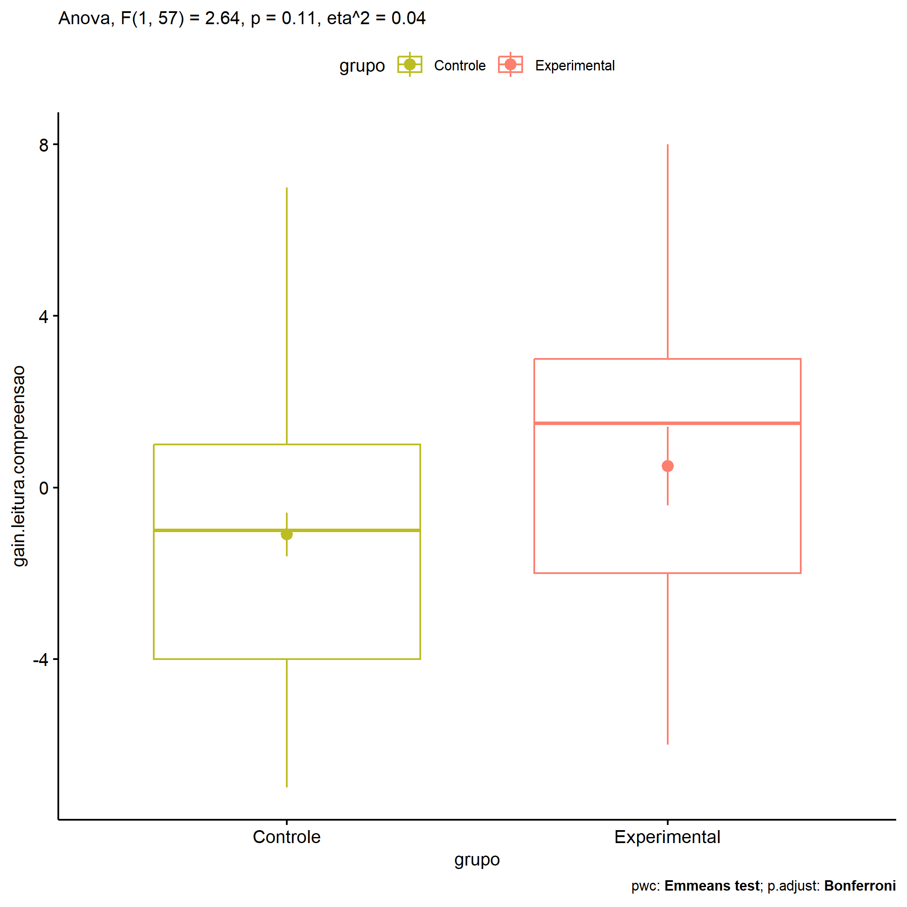
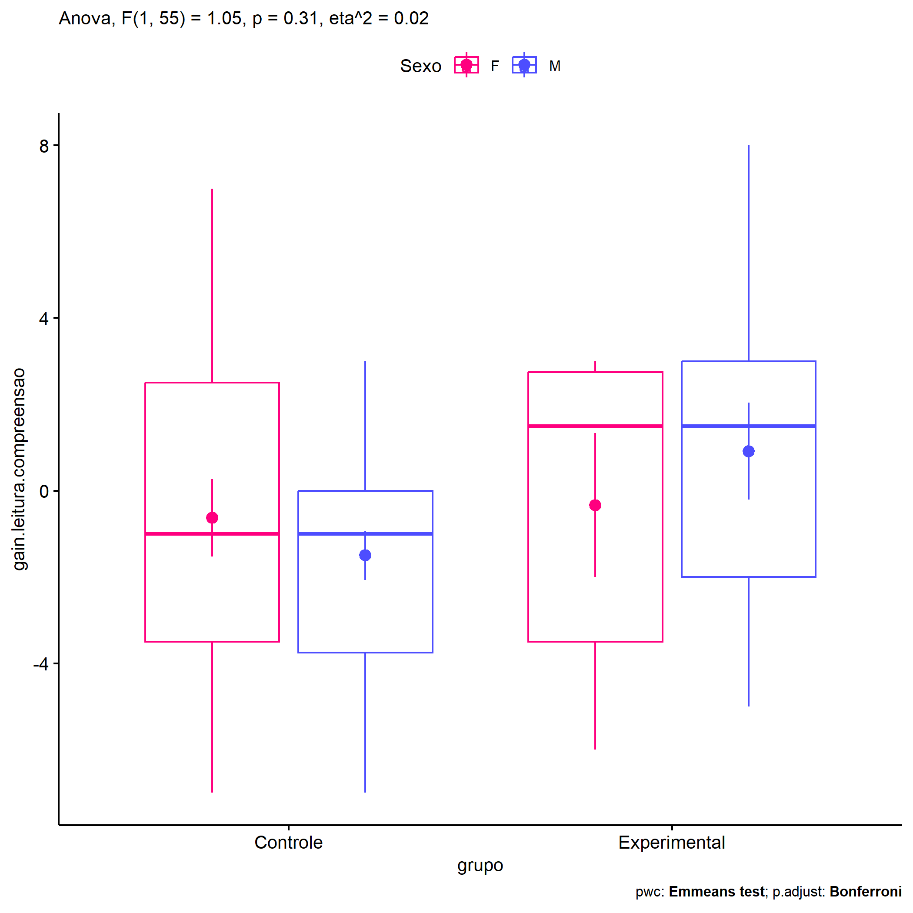
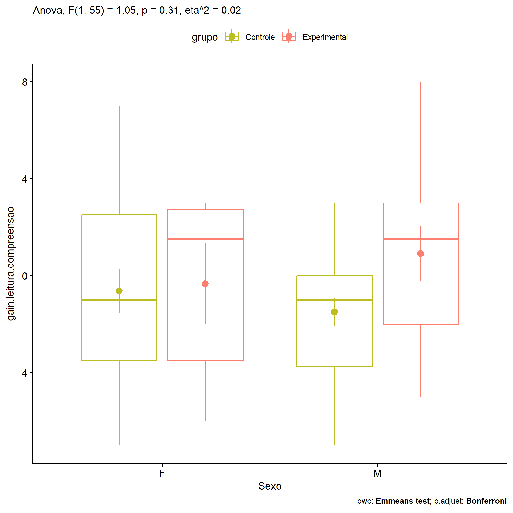

ANOVA in Gains for gain Fluencia Leitora (Compreensão) (gain Fluencia
Leitora (Compreensão))
================
Geiser C. Challco <geiser@alumni.usp.br>

- [Descriptive Statistics of Initial
  Data](#descriptive-statistics-of-initial-data)
- [Checking of Assumptions](#checking-of-assumptions)
  - [Assumption: Normality distribution of
    data](#assumption-normality-distribution-of-data)
  - [Assumption: Homogeneity of data
    distribution](#assumption-homogeneity-of-data-distribution)
- [Computation of ANCOVA test and Pairwise
  Comparison](#computation-of-ancova-test-and-pairwise-comparison)
  - [ANCOVA tests for one factor](#ancova-tests-for-one-factor)
  - [ANCOVA tests for two factors](#ancova-tests-for-two-factors)
  - [Pairwise comparisons for one factor:
    **grupo**](#pairwise-comparisons-for-one-factor-grupo)
  - [Pairwise comparisons for two
    factors](#pairwise-comparisons-for-two-factors)
    - [factores: **grupo:Sexo**](#factores-gruposexo)
    - [factores: **grupo:Zona**](#factores-grupozona)
    - [factores: **grupo:Cor.Raca**](#factores-grupocorraca)

**NOTE**

- Teste ANOVA para determinar se houve diferenças significativas no gain
  Fluencia Leitora (Compreensão) (medido usando a diferença entre
  post-test e pre-testes).
- ANOVA test to determine whether there were significant differences in
  gain Fluencia Leitora (Compreensão) (measured using the difference
  between post-test and pre-tests).

# Descriptive Statistics of Initial Data

| grupo        | Sexo | Zona   | Cor.Raca | variable                 |   n |   mean | median | min | max |    sd |    se |     ci |  iqr |
|:-------------|:-----|:-------|:---------|:-------------------------|----:|-------:|-------:|----:|----:|------:|------:|-------:|-----:|
| Controle     | F    |        |          | gain.leitura.compreensao |  19 | -0.632 |   -1.0 |  -7 |   7 | 3.905 | 0.896 |  1.882 | 6.00 |
| Controle     | M    |        |          | gain.leitura.compreensao |  22 | -1.500 |   -1.0 |  -7 |   3 | 2.668 | 0.569 |  1.183 | 3.75 |
| Experimental | F    |        |          | gain.leitura.compreensao |   6 | -0.333 |    1.5 |  -6 |   3 | 4.082 | 1.667 |  4.284 | 6.25 |
| Experimental | M    |        |          | gain.leitura.compreensao |  12 |  0.917 |    1.5 |  -5 |   8 | 3.895 | 1.125 |  2.475 | 5.00 |
| Controle     |      | Rural  |          | gain.leitura.compreensao |  26 | -0.577 |    0.0 |  -7 |   7 | 3.568 | 0.700 |  1.441 | 4.75 |
| Controle     |      | Urbana |          | gain.leitura.compreensao |   6 | -2.833 |   -3.5 |  -4 |   0 | 1.602 | 0.654 |  1.681 | 1.75 |
| Controle     |      |        |          | gain.leitura.compreensao |   9 | -1.444 |   -1.0 |  -7 |   3 | 3.046 | 1.015 |  2.341 | 3.00 |
| Experimental |      | Rural  |          | gain.leitura.compreensao |  13 |  0.923 |    2.0 |  -5 |   6 | 3.121 | 0.866 |  1.886 | 4.00 |
| Experimental |      | Urbana |          | gain.leitura.compreensao |   3 | -4.333 |   -5.0 |  -6 |  -2 | 2.082 | 1.202 |  5.171 | 2.00 |
| Experimental |      |        |          | gain.leitura.compreensao |   2 |  5.000 |    5.0 |   2 |   8 | 4.243 | 3.000 | 38.119 | 3.00 |
| Controle     |      |        | Branca   | gain.leitura.compreensao |   5 |  0.000 |    0.0 |  -1 |   1 | 0.707 | 0.316 |  0.878 | 0.00 |
| Controle     |      |        | Indígena | gain.leitura.compreensao |   2 |  0.500 |    0.5 |   0 |   1 | 0.707 | 0.500 |  6.353 | 0.50 |
| Controle     |      |        | Parda    | gain.leitura.compreensao |  22 | -0.591 |   -0.5 |  -6 |   7 | 3.750 | 0.800 |  1.663 | 6.00 |
| Controle     |      |        | Preta    | gain.leitura.compreensao |   1 | -1.000 |   -1.0 |  -1 |  -1 |       |       |        | 0.00 |
| Controle     |      |        |          | gain.leitura.compreensao |  11 | -2.909 |   -3.0 |  -7 |   3 | 2.844 | 0.858 |  1.911 | 2.00 |
| Experimental |      |        | Branca   | gain.leitura.compreensao |   4 | -0.250 |    0.5 |  -5 |   3 | 3.948 | 1.974 |  6.281 | 5.75 |
| Experimental |      |        | Indígena | gain.leitura.compreensao |   3 |  2.000 |    2.0 |   1 |   3 | 1.000 | 0.577 |  2.484 | 1.00 |
| Experimental |      |        | Parda    | gain.leitura.compreensao |   5 |  0.200 |   -1.0 |  -4 |   6 | 3.899 | 1.744 |  4.841 | 4.00 |
| Experimental |      |        |          | gain.leitura.compreensao |   6 |  0.500 |    1.5 |  -6 |   8 | 5.244 | 2.141 |  5.503 | 6.25 |

# Checking of Assumptions

## Assumption: Normality distribution of data

| var                      |   n |   skewness |   kurtosis | symmetry | statistic | method       |         p | p.signif | normality |
|:-------------------------|----:|-----------:|-----------:|:---------|----------:|:-------------|----------:|:---------|:----------|
| gain.leitura.compreensao |  59 |  0.0201163 | -0.7713611 | YES      | 1.6766879 | D’Agostino   | 0.4324261 | ns       | YES       |
| gain.leitura.compreensao |  48 | -0.0871253 | -0.3406928 | YES      | 0.9803695 | Shapiro-Wilk | 0.5941501 | ns       | YES       |
| gain.leitura.compreensao |  42 |  0.2490996 | -0.5617203 | YES      | 0.9707555 | Shapiro-Wilk | 0.3499730 | ns       | YES       |

## Assumption: Homogeneity of data distribution

| var                      | method        | formula                                        |   n | df1 | df2 | statistic |         p | p.signif |
|:-------------------------|:--------------|:-----------------------------------------------|----:|----:|----:|----------:|----------:|:---------|
| gain.leitura.compreensao | Levene’s test | `gain.leitura.compreensao`~`grupo`\*`Sexo`     |  59 |   3 |  55 | 0.7531067 | 0.5252711 | ns       |
| gain.leitura.compreensao | Levene’s test | `gain.leitura.compreensao`~`grupo`\*`Zona`     |  48 |   3 |  44 | 1.0781786 | 0.3681787 | ns       |
| gain.leitura.compreensao | Levene’s test | `gain.leitura.compreensao`~`grupo`\*`Cor.Raca` |  42 |   6 |  35 | 2.8845070 | 0.0216654 | \*       |

# Computation of ANCOVA test and Pairwise Comparison

## ANCOVA tests for one factor

| Effect   | DFn | DFd |    SSn |     SSd |     F |     p |   ges | p\<.05 |
|:---------|----:|----:|-------:|--------:|------:|------:|------:|:-------|
| grupo    |   1 |  57 | 31.924 | 688.110 | 2.644 | 0.109 | 0.044 |        |
| Sexo     |   1 |  57 |  0.109 | 719.925 | 0.009 | 0.926 | 0.000 |        |
| Zona     |   1 |  46 | 77.543 | 480.769 | 7.419 | 0.009 | 0.139 | \*     |
| Cor.Raca |   3 |  38 | 15.078 | 412.756 | 0.463 | 0.710 | 0.035 |        |

## ANCOVA tests for two factors

|     | Effect         | DFn | DFd |    SSn |     SSd |     F |     p |   ges | p\<.05 |
|:----|:---------------|----:|----:|-------:|--------:|------:|------:|------:|:-------|
| 3   | grupo:Sexo     |   1 |  55 | 12.893 | 674.171 | 1.052 | 0.310 | 0.019 |        |
| 6   | grupo:Zona     |   1 |  44 | 14.625 | 456.769 | 1.409 | 0.242 | 0.031 |        |
| 9   | grupo:Cor.Raca |   2 |  35 |  2.726 | 407.368 | 0.117 | 0.890 | 0.007 |        |

## Pairwise comparisons for one factor: **grupo**

| var                      | grupo        |   n |      M |    SE |
|:-------------------------|:-------------|----:|-------:|------:|
| gain.leitura.compreensao | Controle     |  41 | -1.098 | 0.513 |
| gain.leitura.compreensao | Experimental |  18 |  0.500 | 0.916 |

| .y.                      | group1   | group2       | estimate | conf.low | conf.high |    se | statistic |     p | p.adj | p.adj.signif |
|:-------------------------|:---------|:-------------|---------:|---------:|----------:|------:|----------:|------:|------:|:-------------|
| gain.leitura.compreensao | Controle | Experimental |   -1.598 |   -3.565 |      0.37 | 0.982 |    -1.626 | 0.109 | 0.109 | ns           |

    ## Scale for colour is already present.
    ## Adding another scale for colour, which will replace the existing scale.

<!-- -->

## Pairwise comparisons for two factors

### factores: **grupo:Sexo**

| var                      | grupo        | Sexo |   n |      M |    SE |
|:-------------------------|:-------------|:-----|----:|-------:|------:|
| gain.leitura.compreensao | Controle     | F    |  19 | -0.632 | 0.896 |
| gain.leitura.compreensao | Controle     | M    |  22 | -1.500 | 0.569 |
| gain.leitura.compreensao | Experimental | F    |   6 | -0.333 | 1.667 |
| gain.leitura.compreensao | Experimental | M    |  12 |  0.917 | 1.125 |

| .y.                      | grupo        | Sexo | group1   | group2       | estimate | conf.low | conf.high |    se | statistic |     p | p.adj | p.adj.signif |
|:-------------------------|:-------------|:-----|:---------|:-------------|---------:|---------:|----------:|------:|----------:|------:|------:|:-------------|
| gain.leitura.compreensao |              | F    | Controle | Experimental |   -0.298 |   -3.584 |     2.987 | 1.640 |    -0.182 | 0.856 | 0.856 | ns           |
| gain.leitura.compreensao |              | M    | Controle | Experimental |   -2.417 |   -4.935 |     0.101 | 1.256 |    -1.923 | 0.060 | 0.060 | ns           |
| gain.leitura.compreensao | Controle     |      | F        | M            |    0.868 |   -1.329 |     3.066 | 1.096 |     0.792 | 0.432 | 0.432 | ns           |
| gain.leitura.compreensao | Experimental |      | F        | M            |   -1.250 |   -4.758 |     2.258 | 1.751 |    -0.714 | 0.478 | 0.478 | ns           |

    ## Scale for colour is already present.
    ## Adding another scale for colour, which will replace the existing scale.

<!-- -->

    ## Scale for colour is already present.
    ## Adding another scale for colour, which will replace the existing scale.

<!-- -->

### factores: **grupo:Zona**

| var                      | grupo        | Zona   |   n |      M |    SE |
|:-------------------------|:-------------|:-------|----:|-------:|------:|
| gain.leitura.compreensao | Controle     | Rural  |  26 | -0.577 | 0.700 |
| gain.leitura.compreensao | Controle     | Urbana |   6 | -2.833 | 0.654 |
| gain.leitura.compreensao | Experimental | Rural  |  13 |  0.923 | 0.866 |

|     | .y.                      | grupo    | Zona  | group1   | group2       | estimate | conf.low | conf.high |    se | statistic |     p | p.adj | p.adj.signif |
|:----|:-------------------------|:---------|:------|:---------|:-------------|---------:|---------:|----------:|------:|----------:|------:|------:|:-------------|
| 1   | gain.leitura.compreensao |          | Rural | Controle | Experimental |   -1.500 |   -3.739 |     0.739 | 1.110 |    -1.352 | 0.184 | 0.184 | ns           |
| 3   | gain.leitura.compreensao | Controle |       | Rural    | Urbana       |    2.256 |   -0.729 |     5.242 | 1.479 |     1.525 | 0.135 | 0.135 | ns           |

### factores: **grupo:Cor.Raca**

| var                      | grupo        | Cor.Raca |   n |      M |    SE |
|:-------------------------|:-------------|:---------|----:|-------:|------:|
| gain.leitura.compreensao | Controle     | Branca   |   5 |  0.000 | 0.316 |
| gain.leitura.compreensao | Controle     | Parda    |  22 | -0.591 | 0.800 |
| gain.leitura.compreensao | Experimental | Parda    |   5 |  0.200 | 1.744 |

|     | .y.                      | grupo    | Cor.Raca | group1   | group2       | estimate | conf.low | conf.high |    se | statistic |     p | p.adj | p.adj.signif |
|:----|:-------------------------|:---------|:---------|:---------|:-------------|---------:|---------:|----------:|------:|----------:|------:|------:|:-------------|
| 2   | gain.leitura.compreensao |          | Parda    | Controle | Experimental |   -0.791 |   -4.352 |     2.770 | 1.741 |    -0.454 | 0.653 | 0.653 | ns           |
| 3   | gain.leitura.compreensao | Controle |          | Branca   | Parda        |    0.591 |   -2.970 |     4.152 | 1.741 |     0.339 | 0.737 | 0.737 | ns           |
