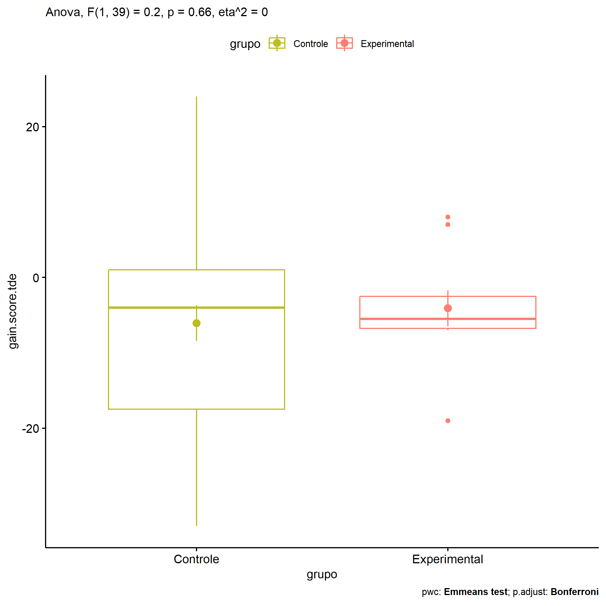

ANOVA in Gains for gain TDE - Escrita (acertos) (gain TDE - Escrita
(acertos))
================
Geiser C. Challco <geiser@alumni.usp.br>

- [Descriptive Statistics of Initial
  Data](#descriptive-statistics-of-initial-data)
- [Checking of Assumptions](#checking-of-assumptions)
  - [Assumption: Normality distribution of
    data](#assumption-normality-distribution-of-data)
  - [Assumption: Homogeneity of data
    distribution](#assumption-homogeneity-of-data-distribution)
- [Computation of ANCOVA test and Pairwise
  Comparison](#computation-of-ancova-test-and-pairwise-comparison)
  - [ANCOVA tests for one factor](#ancova-tests-for-one-factor)
  - [ANCOVA tests for two factors](#ancova-tests-for-two-factors)
  - [Pairwise comparisons for one factor:
    **grupo**](#pairwise-comparisons-for-one-factor-grupo)
  - [Pairwise comparisons for two
    factors](#pairwise-comparisons-for-two-factors)
    - [factores: **grupo:Sexo**](#factores-gruposexo)
    - [factores: **grupo:Zona**](#factores-grupozona)
    - [factores: **grupo:Cor.Raca**](#factores-grupocorraca)

**NOTE**

- Teste ANOVA para determinar se houve diferenças significativas no gain
  TDE - Escrita (acertos) (medido usando a diferença entre post-test e
  pre-testes).
- ANOVA test to determine whether there were significant differences in
  gain TDE - Escrita (acertos) (measured using the difference between
  post-test and pre-tests).

# Descriptive Statistics of Initial Data

| grupo        | Sexo | Zona   | Cor.Raca | variable       |   n |    mean | median | min | max |     sd |    se |     ci |   iqr |
|:-------------|:-----|:-------|:---------|:---------------|----:|--------:|-------:|----:|----:|-------:|------:|-------:|------:|
| Controle     | F    |        |          | gain.score.tde |  16 |  -7.375 |   -9.0 | -22 |  24 | 12.126 | 3.032 |  6.462 | 16.50 |
| Controle     | M    |        |          | gain.score.tde |  15 |  -4.667 |   -1.0 | -33 |  14 | 14.435 | 3.727 |  7.994 | 16.00 |
| Experimental | F    |        |          | gain.score.tde |   4 |  -2.500 |   -5.0 |  -7 |   7 |  6.455 | 3.227 | 10.271 |  5.00 |
| Experimental | M    |        |          | gain.score.tde |   6 |  -5.167 |   -5.5 | -19 |   8 |  8.704 | 3.554 |  9.135 |  4.00 |
| Controle     |      | Rural  |          | gain.score.tde |  21 |  -7.095 |   -4.0 | -33 |  14 | 12.712 | 2.774 |  5.786 | 20.00 |
| Controle     |      | Urbana |          | gain.score.tde |   3 |  -6.667 |   -2.0 | -18 |   0 |  9.866 | 5.696 | 24.508 |  9.00 |
| Controle     |      |        |          | gain.score.tde |   7 |  -2.714 |   -6.0 | -22 |  24 | 16.590 | 6.271 | 15.343 | 20.50 |
| Experimental |      | Rural  |          | gain.score.tde |   8 |  -2.000 |   -4.5 |  -7 |   8 |  6.094 | 2.155 |  5.095 |  6.50 |
| Experimental |      | Urbana |          | gain.score.tde |   2 | -12.500 |  -12.5 | -19 |  -6 |  9.192 | 6.500 | 82.590 |  6.50 |
| Controle     |      |        | Branca   | gain.score.tde |   4 |   4.750 |    1.0 |  -7 |  24 | 13.401 | 6.700 | 21.324 |  9.25 |
| Controle     |      |        | Indígena | gain.score.tde |   1 |  -6.000 |   -6.0 |  -6 |  -6 |        |       |        |  0.00 |
| Controle     |      |        | Parda    | gain.score.tde |  17 |  -7.412 |   -4.0 | -26 |  14 | 11.603 | 2.814 |  5.966 | 18.00 |
| Controle     |      |        | Preta    | gain.score.tde |   1 |  14.000 |   14.0 |  14 |  14 |        |       |        |  0.00 |
| Controle     |      |        |          | gain.score.tde |   8 | -11.125 |  -13.0 | -33 |   9 | 14.045 | 4.966 | 11.742 | 19.75 |
| Experimental |      |        | Branca   | gain.score.tde |   1 | -19.000 |  -19.0 | -19 | -19 |        |       |        |  0.00 |
| Experimental |      |        | Indígena | gain.score.tde |   3 |  -0.667 |   -4.0 |  -5 |   7 |  6.658 | 3.844 | 16.540 |  6.00 |
| Experimental |      |        | Parda    | gain.score.tde |   4 |  -1.750 |   -4.0 |  -7 |   8 |  6.850 | 3.425 | 10.899 |  6.75 |
| Experimental |      |        |          | gain.score.tde |   2 |  -6.500 |   -6.5 |  -7 |  -6 |  0.707 | 0.500 |  6.353 |  0.50 |

# Checking of Assumptions

## Assumption: Normality distribution of data

| var            |   n |   skewness |   kurtosis | symmetry | statistic | method       |         p | p.signif | normality |
|:---------------|----:|-----------:|-----------:|:---------|----------:|:-------------|----------:|:---------|:----------|
| gain.score.tde |  41 |  0.0294396 |  0.1327867 | YES      | 0.9908597 | Shapiro-Wilk | 0.9823771 | ns       | YES       |
| gain.score.tde |  34 | -0.3120055 | -0.4837451 | YES      | 0.9831258 | Shapiro-Wilk | 0.8648304 | ns       | YES       |
| gain.score.tde |  31 |  0.2235957 | -0.5785036 | YES      | 0.9834457 | Shapiro-Wilk | 0.8996691 | ns       | YES       |

## Assumption: Homogeneity of data distribution

| var            | method        | formula                              |   n | df1 | df2 | statistic |         p | p.signif |
|:---------------|:--------------|:-------------------------------------|----:|----:|----:|----------:|----------:|:---------|
| gain.score.tde | Levene’s test | `gain.score.tde`~`grupo`\*`Sexo`     |  41 |   3 |  37 | 1.0177525 | 0.3958455 | ns       |
| gain.score.tde | Levene’s test | `gain.score.tde`~`grupo`\*`Zona`     |  34 |   3 |  30 | 1.5939363 | 0.2114941 | ns       |
| gain.score.tde | Levene’s test | `gain.score.tde`~`grupo`\*`Cor.Raca` |  31 |   6 |  24 | 0.9614904 | 0.4716121 | ns       |

# Computation of ANCOVA test and Pairwise Comparison

## ANCOVA tests for one factor

| Effect   | DFn | DFd |     SSn |      SSd |     F |     p |   ges | p\<.05 |
|:---------|----:|----:|--------:|---------:|------:|------:|------:|:-------|
| grupo    |   1 |  39 |  29.180 | 5700.771 | 0.200 | 0.657 | 0.005 |        |
| Sexo     |   1 |  39 |  25.913 | 5704.038 | 0.177 | 0.676 | 0.005 |        |
| Zona     |   1 |  32 |  46.734 | 3962.207 | 0.377 | 0.543 | 0.012 |        |
| Cor.Raca |   3 |  27 | 534.043 | 3498.667 | 1.374 | 0.272 | 0.132 |        |

## ANCOVA tests for two factors

|     | Effect         | DFn | DFd |     SSn |      SSd |     F |     p |   ges | p\<.05 |
|:----|:---------------|----:|----:|--------:|---------:|------:|------:|------:|:-------|
| 3   | grupo:Sexo     |   1 |  37 |  52.929 | 5626.917 | 0.348 | 0.559 | 0.009 |        |
| 6   | grupo:Zona     |   1 |  30 | 118.727 | 3770.976 | 0.945 | 0.339 | 0.031 |        |
| 9   | grupo:Cor.Raca |   2 |  24 | 574.062 | 2922.284 | 2.357 | 0.116 | 0.164 |        |

## Pairwise comparisons for one factor: **grupo**

| var            | grupo        |   n |      M |    SE |
|:---------------|:-------------|----:|-------:|------:|
| gain.score.tde | Controle     |  31 | -6.065 | 2.360 |
| gain.score.tde | Experimental |  10 | -4.100 | 2.406 |

| .y.            | group1   | group2       | estimate | conf.low | conf.high |    se | statistic |     p | p.adj | p.adj.signif |
|:---------------|:---------|:-------------|---------:|---------:|----------:|------:|----------:|------:|------:|:-------------|
| gain.score.tde | Controle | Experimental |   -1.965 |  -10.858 |     6.929 | 4.397 |    -0.447 | 0.657 | 0.657 | ns           |

    ## Scale for colour is already present.
    ## Adding another scale for colour, which will replace the existing scale.

<!-- -->

## Pairwise comparisons for two factors

### factores: **grupo:Sexo**

| var            | grupo        | Sexo |   n |      M |    SE |
|:---------------|:-------------|:-----|----:|-------:|------:|
| gain.score.tde | Controle     | F    |  16 | -7.375 | 3.032 |
| gain.score.tde | Controle     | M    |  15 | -4.667 | 3.727 |
| gain.score.tde | Experimental | M    |   6 | -5.167 | 3.554 |

|     | .y.            | grupo    | Sexo | group1   | group2       | estimate | conf.low | conf.high |    se | statistic |     p | p.adj | p.adj.signif |
|:----|:---------------|:---------|:-----|:---------|:-------------|---------:|---------:|----------:|------:|----------:|------:|------:|:-------------|
| 2   | gain.score.tde |          | M    | Controle | Experimental |    0.500 |  -11.988 |    12.988 | 6.145 |     0.081 | 0.936 | 0.936 | ns           |
| 3   | gain.score.tde | Controle |      | F        | M            |   -2.708 |  -11.999 |     6.583 | 4.572 |    -0.592 | 0.558 | 0.558 | ns           |

### factores: **grupo:Zona**

### factores: **grupo:Cor.Raca**
