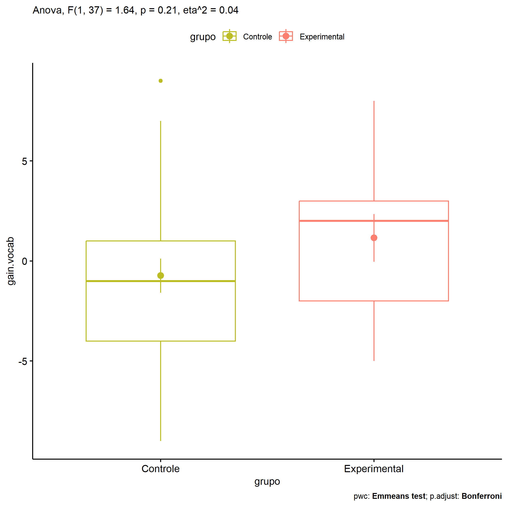
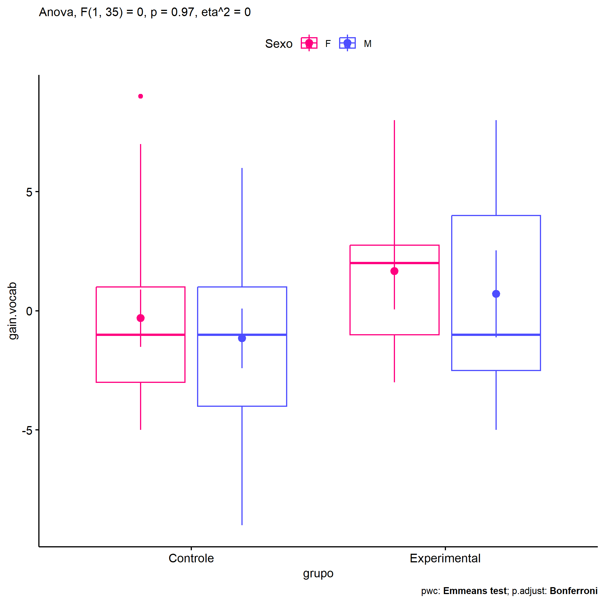
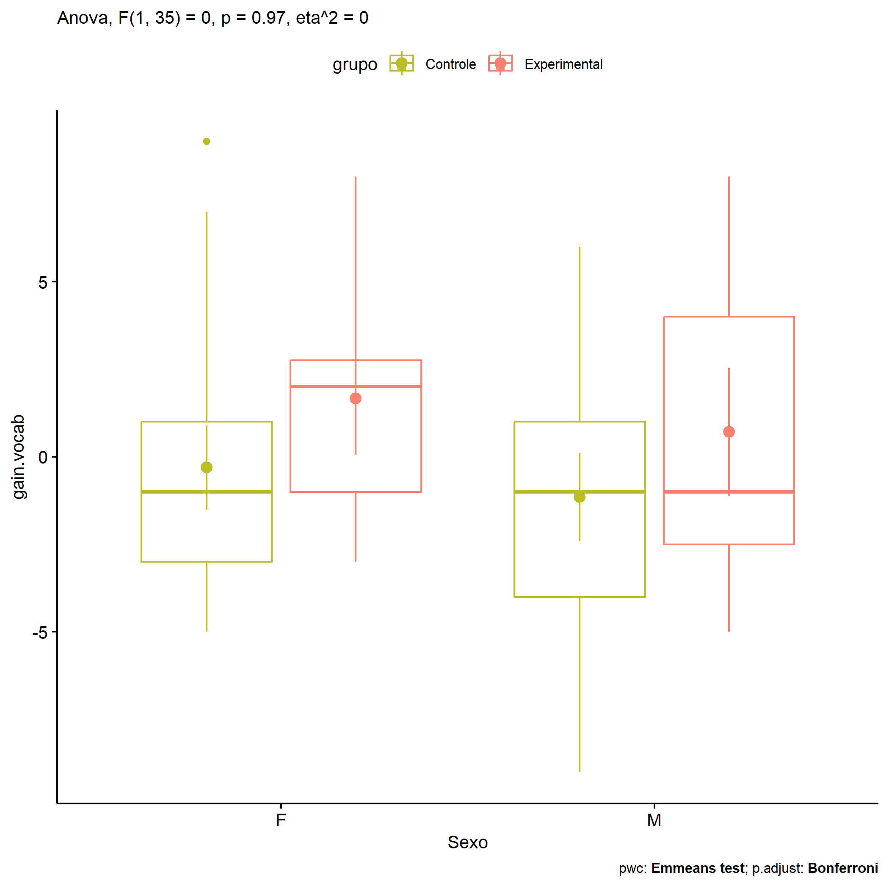

ANOVA in Gains for gain Vocabulario (acertos) (gain Vocabulario
(acertos))
================
Geiser C. Challco <geiser@alumni.usp.br>

- [Descriptive Statistics of Initial
  Data](#descriptive-statistics-of-initial-data)
- [Checking of Assumptions](#checking-of-assumptions)
  - [Assumption: Normality distribution of
    data](#assumption-normality-distribution-of-data)
  - [Assumption: Homogeneity of data
    distribution](#assumption-homogeneity-of-data-distribution)
- [Computation of ANCOVA test and Pairwise
  Comparison](#computation-of-ancova-test-and-pairwise-comparison)
  - [ANCOVA tests for one factor](#ancova-tests-for-one-factor)
  - [ANCOVA tests for two factors](#ancova-tests-for-two-factors)
  - [Pairwise comparisons for one factor:
    **grupo**](#pairwise-comparisons-for-one-factor-grupo)
  - [Pairwise comparisons for two
    factors](#pairwise-comparisons-for-two-factors)
    - [factores: **grupo:Sexo**](#factores-gruposexo)
    - [factores: **grupo:Zona**](#factores-grupozona)
    - [factores: **grupo:Cor.Raca**](#factores-grupocorraca)

**NOTE**

- Teste ANOVA para determinar se houve diferenças significativas no gain
  Vocabulario (acertos) (medido usando a diferença entre post-test e
  pre-testes).
- ANOVA test to determine whether there were significant differences in
  gain Vocabulario (acertos) (measured using the difference between
  post-test and pre-tests).

# Descriptive Statistics of Initial Data

| grupo        | Sexo | Zona   | Cor.Raca | variable   |   n |   mean | median | min | max |    sd |    se |     ci |  iqr |
|:-------------|:-----|:-------|:---------|:-----------|----:|-------:|-------:|----:|----:|------:|------:|-------:|-----:|
| Controle     | F    |        |          | gain.vocab |  13 | -0.308 |   -1.0 |  -5 |   9 | 4.347 | 1.206 |  2.627 | 4.00 |
| Controle     | M    |        |          | gain.vocab |  13 | -1.154 |   -1.0 |  -9 |   6 | 4.506 | 1.250 |  2.723 | 5.00 |
| Experimental | F    |        |          | gain.vocab |   6 |  1.667 |    2.0 |  -3 |   8 | 3.933 | 1.606 |  4.127 | 3.75 |
| Experimental | M    |        |          | gain.vocab |   7 |  0.714 |   -1.0 |  -5 |   8 | 4.821 | 1.822 |  4.458 | 6.50 |
| Controle     |      | Rural  |          | gain.vocab |  21 | -0.952 |   -1.0 |  -9 |   9 | 4.376 | 0.955 |  1.992 | 5.00 |
| Controle     |      | Urbana |          | gain.vocab |   3 | -2.000 |   -3.0 |  -5 |   2 | 3.606 | 2.082 |  8.957 | 3.50 |
| Controle     |      |        |          | gain.vocab |   2 |  3.500 |    3.5 |   0 |   7 | 4.950 | 3.500 | 44.472 | 3.50 |
| Experimental |      | Rural  |          | gain.vocab |  12 |  1.083 |    0.5 |  -5 |   8 | 4.461 | 1.288 |  2.834 | 6.00 |
| Experimental |      | Urbana |          | gain.vocab |   1 |  2.000 |    2.0 |   2 |   2 |       |       |        | 0.00 |
| Controle     |      |        | Branca   | gain.vocab |   5 | -1.600 |    0.0 |  -7 |   3 | 4.219 | 1.887 |  5.239 | 6.00 |
| Controle     |      |        | Parda    | gain.vocab |  13 | -1.000 |   -1.0 |  -5 |   6 | 3.440 | 0.954 |  2.079 | 4.00 |
| Controle     |      |        |          | gain.vocab |   8 |  0.250 |    0.5 |  -9 |   9 | 5.970 | 2.111 |  4.991 | 6.75 |
| Experimental |      |        | Branca   | gain.vocab |   1 |  2.000 |    2.0 |   2 |   2 |       |       |        | 0.00 |
| Experimental |      |        | Parda    | gain.vocab |   6 |  3.500 |    4.0 |  -2 |   8 | 4.461 | 1.821 |  4.681 | 7.75 |
| Experimental |      |        |          | gain.vocab |   6 | -1.333 |   -2.5 |  -5 |   3 | 3.141 | 1.282 |  3.296 | 4.00 |

# Checking of Assumptions

## Assumption: Normality distribution of data

| var        |   n |  skewness |   kurtosis | symmetry | statistic | method       |         p | p.signif | normality |
|:-----------|----:|----------:|-----------:|:---------|----------:|:-------------|----------:|:---------|:----------|
| gain.vocab |  39 | 0.3858936 | -0.7418673 | YES      | 0.9606037 | Shapiro-Wilk | 0.1867946 | ns       | YES       |
| gain.vocab |  37 | 0.3764642 | -0.5260336 | YES      | 0.9696857 | Shapiro-Wilk | 0.3998860 | ns       | YES       |
| gain.vocab |  25 | 0.2068807 | -1.1000590 | YES      | 0.9611055 | Shapiro-Wilk | 0.4369299 | ns       | YES       |

## Assumption: Homogeneity of data distribution

| var        | method        | formula                          |   n | df1 | df2 | statistic |         p | p.signif |
|:-----------|:--------------|:---------------------------------|----:|----:|----:|----------:|----------:|:---------|
| gain.vocab | Levene’s test | `gain.vocab`~`grupo`\*`Sexo`     |  39 |   3 |  35 | 0.1901110 | 0.9024231 | ns       |
| gain.vocab | Levene’s test | `gain.vocab`~`grupo`\*`Zona`     |  37 |   3 |  33 | 0.7931998 | 0.5064379 | ns       |
| gain.vocab | Levene’s test | `gain.vocab`~`grupo`\*`Cor.Raca` |  25 |   3 |  21 | 1.0606920 | 0.3868361 | ns       |

# Computation of ANCOVA test and Pairwise Comparison

## ANCOVA tests for one factor

| Effect   | DFn | DFd |    SSn |     SSd |     F |     p |   ges | p\<.05 |
|:---------|----:|----:|-------:|--------:|------:|------:|------:|:-------|
| grupo    |   1 |  37 | 30.782 | 694.808 | 1.639 | 0.208 | 0.042 |        |
| Sexo     |   1 |  37 |  6.484 | 719.105 | 0.334 | 0.567 | 0.009 |        |
| Zona     |   1 |  35 |  2.215 | 671.515 | 0.115 | 0.736 | 0.003 |        |
| Cor.Raca |   1 |  23 |  9.208 | 406.632 | 0.521 | 0.478 | 0.022 |        |

## ANCOVA tests for two factors

|     | Effect         | DFn | DFd |   SSn |     SSd |     F |     p |   ges | p\<.05 |
|:----|:---------------|----:|----:|------:|--------:|------:|------:|------:|:-------|
| 3   | grupo:Sexo     |   1 |  35 | 0.024 | 687.223 | 0.001 | 0.972 | 0.000 |        |
| 6   | grupo:Zona     |   1 |  33 | 2.635 | 627.869 | 0.138 | 0.712 | 0.004 |        |
| 9   | grupo:Cor.Raca |   1 |  21 | 0.561 | 312.700 | 0.038 | 0.848 | 0.002 |        |

## Pairwise comparisons for one factor: **grupo**

| var        | grupo        |   n |      M |    SE |
|:-----------|:-------------|----:|-------:|------:|
| gain.vocab | Controle     |  26 | -0.731 | 0.855 |
| gain.vocab | Experimental |  13 |  1.154 | 1.187 |

| .y.        | group1   | group2       | estimate | conf.low | conf.high |    se | statistic |     p | p.adj | p.adj.signif |
|:-----------|:---------|:-------------|---------:|---------:|----------:|------:|----------:|------:|------:|:-------------|
| gain.vocab | Controle | Experimental |   -1.885 |   -4.867 |     1.098 | 1.472 |     -1.28 | 0.208 | 0.208 | ns           |

    ## Scale for colour is already present.
    ## Adding another scale for colour, which will replace the existing scale.

<!-- -->

## Pairwise comparisons for two factors

### factores: **grupo:Sexo**

| var        | grupo        | Sexo |   n |      M |    SE |
|:-----------|:-------------|:-----|----:|-------:|------:|
| gain.vocab | Controle     | F    |  13 | -0.308 | 1.206 |
| gain.vocab | Controle     | M    |  13 | -1.154 | 1.250 |
| gain.vocab | Experimental | F    |   6 |  1.667 | 1.606 |
| gain.vocab | Experimental | M    |   7 |  0.714 | 1.822 |

| .y.        | grupo        | Sexo | group1   | group2       | estimate | conf.low | conf.high |    se | statistic |     p | p.adj | p.adj.signif |
|:-----------|:-------------|:-----|:---------|:-------------|---------:|---------:|----------:|------:|----------:|------:|------:|:-------------|
| gain.vocab |              | F    | Controle | Experimental |   -1.974 |   -6.414 |     2.465 | 2.187 |    -0.903 | 0.373 | 0.373 | ns           |
| gain.vocab |              | M    | Controle | Experimental |   -1.868 |   -6.085 |     2.349 | 2.077 |    -0.899 | 0.375 | 0.375 | ns           |
| gain.vocab | Controle     |      | F        | M            |    0.846 |   -2.682 |     4.375 | 1.738 |     0.487 | 0.629 | 0.629 | ns           |
| gain.vocab | Experimental |      | F        | M            |    0.952 |   -4.052 |     5.957 | 2.465 |     0.386 | 0.702 | 0.702 | ns           |

    ## Scale for colour is already present.
    ## Adding another scale for colour, which will replace the existing scale.

<!-- -->

    ## Scale for colour is already present.
    ## Adding another scale for colour, which will replace the existing scale.

<!-- -->

### factores: **grupo:Zona**

### factores: **grupo:Cor.Raca**

| var        | grupo        | Cor.Raca |   n |    M |    SE |
|:-----------|:-------------|:---------|----:|-----:|------:|
| gain.vocab | Controle     | Branca   |   5 | -1.6 | 1.887 |
| gain.vocab | Controle     | Parda    |  13 | -1.0 | 0.954 |
| gain.vocab | Experimental | Parda    |   6 |  3.5 | 1.821 |

|     | .y.        | grupo    | Cor.Raca | group1   | group2       | estimate | conf.low | conf.high |    se | statistic |     p | p.adj | p.adj.signif |
|:----|:-----------|:---------|:---------|:---------|:-------------|---------:|---------:|----------:|------:|----------:|------:|------:|:-------------|
| 2   | gain.vocab |          | Parda    | Controle | Experimental |     -4.5 |   -8.461 |    -0.539 | 1.905 |    -2.363 | 0.028 | 0.028 | \*           |
| 3   | gain.vocab | Controle |          | Branca   | Parda        |     -0.6 |   -4.823 |     3.623 | 2.031 |    -0.295 | 0.771 | 0.771 | ns           |
