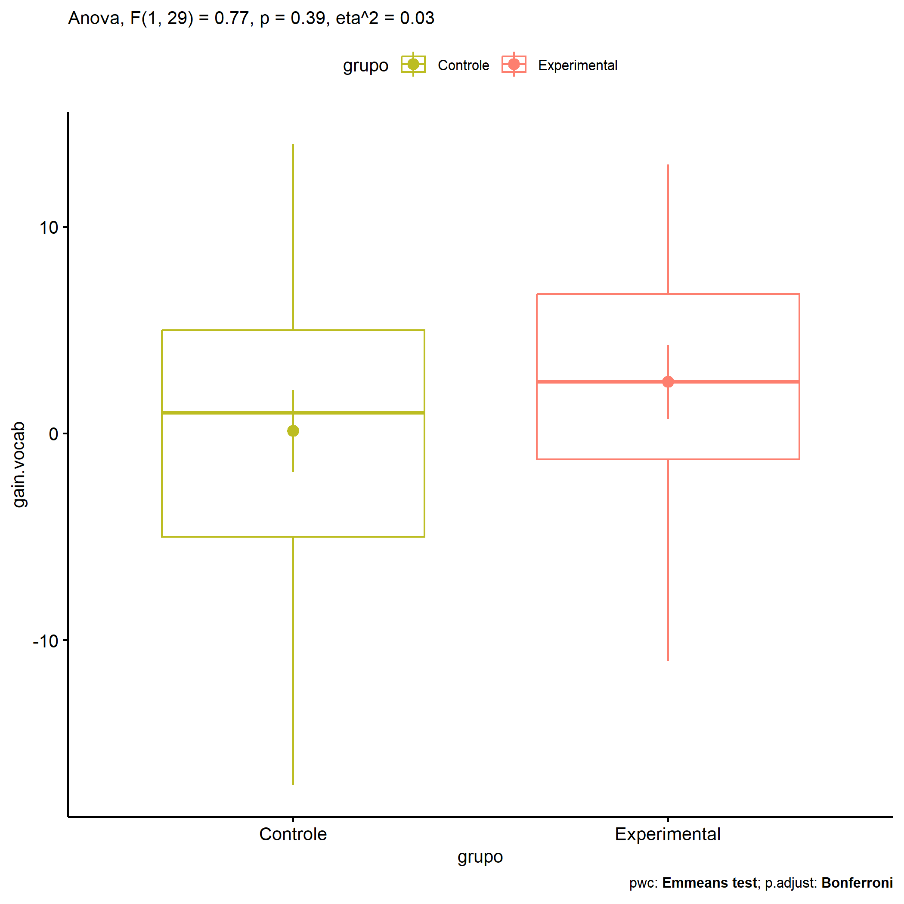

ANOVA in Gains for gain Vocabulario (acertos) (gain Vocabulario
(acertos))
================
Geiser C. Challco <geiser@alumni.usp.br>

- [Descriptive Statistics of Initial
  Data](#descriptive-statistics-of-initial-data)
- [Checking of Assumptions](#checking-of-assumptions)
  - [Assumption: Normality distribution of
    data](#assumption-normality-distribution-of-data)
  - [Assumption: Homogeneity of data
    distribution](#assumption-homogeneity-of-data-distribution)
- [Computation of ANCOVA test and Pairwise
  Comparison](#computation-of-ancova-test-and-pairwise-comparison)
  - [ANCOVA tests for one factor](#ancova-tests-for-one-factor)
  - [ANCOVA tests for two factors](#ancova-tests-for-two-factors)
  - [Pairwise comparisons for one factor:
    **grupo**](#pairwise-comparisons-for-one-factor-grupo)
  - [Pairwise comparisons for two
    factors](#pairwise-comparisons-for-two-factors)
    - [factores: **grupo:Sexo**](#factores-gruposexo)
    - [factores: **grupo:Zona**](#factores-grupozona)
    - [factores: **grupo:Cor.Raca**](#factores-grupocorraca)

**NOTE**

- Teste ANOVA para determinar se houve diferenças significativas no gain
  Vocabulario (acertos) (medido usando a diferença entre post-test e
  pre-testes).
- ANOVA test to determine whether there were significant differences in
  gain Vocabulario (acertos) (measured using the difference between
  post-test and pre-tests).

# Descriptive Statistics of Initial Data

| grupo        | Sexo | Zona   | Cor.Raca | variable   |   n |   mean | median | min | max |     sd |    se |     ci |   iqr |
|:-------------|:-----|:-------|:---------|:-----------|----:|-------:|-------:|----:|----:|-------:|------:|-------:|------:|
| Controle     | F    |        |          | gain.vocab |   5 | -1.600 |    2.0 | -12 |   6 |  7.570 | 3.385 |  9.399 | 10.00 |
| Controle     | M    |        |          | gain.vocab |  12 |  0.833 |    0.0 | -17 |  14 |  8.590 | 2.480 |  5.458 | 10.25 |
| Experimental | F    |        |          | gain.vocab |   3 |  1.667 |    6.0 | -11 |  10 | 11.150 | 6.438 | 27.699 | 10.50 |
| Experimental | M    |        |          | gain.vocab |  11 |  2.727 |    2.0 |  -6 |  13 |  5.746 | 1.733 |  3.860 |  5.50 |
| Controle     |      | Rural  |          | gain.vocab |   7 | -0.286 |    1.0 | -17 |   9 |  8.261 | 3.122 |  7.640 |  5.50 |
| Controle     |      | Urbana |          | gain.vocab |   4 |  1.750 |    1.0 |  -6 |  11 |  8.098 | 4.049 | 12.886 | 11.75 |
| Controle     |      |        |          | gain.vocab |   6 | -0.500 |   -1.5 | -12 |  14 |  9.397 | 3.836 |  9.861 | 10.75 |
| Experimental |      | Rural  |          | gain.vocab |   7 |  4.143 |    6.0 |  -6 |  13 |  7.081 | 2.676 |  6.549 | 10.00 |
| Experimental |      | Urbana |          | gain.vocab |   1 |  1.000 |    1.0 |   1 |   1 |        |       |        |  0.00 |
| Experimental |      |        |          | gain.vocab |   6 |  0.833 |    2.5 | -11 |  10 |  6.969 | 2.845 |  7.313 |  4.00 |
| Controle     |      |        | Parda    | gain.vocab |   7 |  1.000 |    1.0 | -12 |  14 |  7.832 | 2.960 |  7.243 |  5.00 |
| Controle     |      |        |          | gain.vocab |  10 | -0.500 |   -0.5 | -17 |  11 |  8.721 | 2.758 |  6.239 | 11.50 |
| Experimental |      |        | Branca   | gain.vocab |   1 |  7.000 |    7.0 |   7 |   7 |        |       |        |  0.00 |
| Experimental |      |        | Indígena | gain.vocab |   1 |  3.000 |    3.0 |   3 |   3 |        |       |        |  0.00 |
| Experimental |      |        | Parda    | gain.vocab |   5 |  0.800 |    1.0 | -11 |  11 |  8.438 | 3.774 | 10.477 |  9.00 |
| Experimental |      |        |          | gain.vocab |   7 |  3.000 |    2.0 |  -6 |  13 |  6.583 | 2.488 |  6.088 |  7.00 |

# Checking of Assumptions

## Assumption: Normality distribution of data

| var        |   n |   skewness |   kurtosis | symmetry | statistic | method       |         p | p.signif | normality |
|:-----------|----:|-----------:|-----------:|:---------|----------:|:-------------|----------:|:---------|:----------|
| gain.vocab |  31 | -0.2943807 | -0.5448651 | YES      | 0.9780738 | Shapiro-Wilk | 0.7572218 | ns       | YES       |
| gain.vocab |  19 | -0.5691557 | -0.5030761 | NO       | 0.9525110 | Shapiro-Wilk | 0.4355421 | ns       | YES       |
| gain.vocab |  14 | -0.0935572 | -0.4894537 | YES      | 0.9432482 | Shapiro-Wilk | 0.4615177 | ns       | YES       |

## Assumption: Homogeneity of data distribution

| var        | method        | formula                          |   n | df1 | df2 | statistic |         p | p.signif |
|:-----------|:--------------|:---------------------------------|----:|----:|----:|----------:|----------:|:---------|
| gain.vocab | Levene’s test | `gain.vocab`~`grupo`\*`Sexo`     |  31 |   3 |  27 | 0.5159781 | 0.6747875 | ns       |
| gain.vocab | Levene’s test | `gain.vocab`~`grupo`\*`Zona`     |  19 |   3 |  15 | 0.5249996 | 0.6717303 | ns       |
| gain.vocab | Levene’s test | `gain.vocab`~`grupo`\*`Cor.Raca` |  14 |   3 |  10 | 0.6856343 | 0.5809828 | ns       |

# Computation of ANCOVA test and Pairwise Comparison

## ANCOVA tests for one factor

| Effect   | DFn | DFd |    SSn |      SSd |     F |     p |   ges | p\<.05 |
|:---------|----:|----:|-------:|---------:|------:|------:|------:|:-------|
| grupo    |   1 |  29 | 43.574 | 1643.265 | 0.769 | 0.388 | 0.026 |        |
| Sexo     |   1 |  29 | 26.529 | 1660.310 | 0.463 | 0.501 | 0.016 |        |
| Zona     |   1 |  17 |  0.398 |  976.129 | 0.007 | 0.935 | 0.000 |        |
| Cor.Raca |   2 |  11 | 36.583 |  652.917 | 0.308 | 0.741 | 0.053 |        |

## ANCOVA tests for two factors

|     | Effect         | DFn | DFd |    SSn |      SSd |     F |     p |   ges | p\<.05 |
|:----|:---------------|----:|----:|-------:|---------:|------:|------:|------:|:-------|
| 3   | grupo:Sexo     |   1 |  27 |  2.663 | 1619.715 | 0.044 | 0.835 | 0.002 |        |
| 6   | grupo:Zona     |   1 |  15 | 17.463 |  907.036 | 0.289 | 0.599 | 0.019 |        |
| 9   | grupo:Cor.Raca |   0 |  10 |        |  652.800 |       |       |       |        |

## Pairwise comparisons for one factor: **grupo**

| var        | grupo        |   n |     M |    SE |
|:-----------|:-------------|----:|------:|------:|
| gain.vocab | Controle     |  17 | 0.118 | 1.976 |
| gain.vocab | Experimental |  14 | 2.500 | 1.787 |

| .y.        | group1   | group2       | estimate | conf.low | conf.high |    se | statistic |     p | p.adj | p.adj.signif |
|:-----------|:---------|:-------------|---------:|---------:|----------:|------:|----------:|------:|------:|:-------------|
| gain.vocab | Controle | Experimental |   -2.382 |   -7.939 |     3.174 | 2.717 |    -0.877 | 0.388 | 0.388 | ns           |

    ## Scale for colour is already present.
    ## Adding another scale for colour, which will replace the existing scale.

<!-- -->

## Pairwise comparisons for two factors

### factores: **grupo:Sexo**

| var        | grupo        | Sexo |   n |      M |    SE |
|:-----------|:-------------|:-----|----:|-------:|------:|
| gain.vocab | Controle     | F    |   5 | -1.600 | 3.385 |
| gain.vocab | Controle     | M    |  12 |  0.833 | 2.480 |
| gain.vocab | Experimental | M    |  11 |  2.727 | 1.733 |

|     | .y.        | grupo    | Sexo | group1   | group2       | estimate | conf.low | conf.high |    se | statistic |     p | p.adj | p.adj.signif |
|:----|:-----------|:---------|:-----|:---------|:-------------|---------:|---------:|----------:|------:|----------:|------:|------:|:-------------|
| 2   | gain.vocab |          | M    | Controle | Experimental |   -1.894 |   -8.260 |     4.473 | 3.091 |    -0.613 | 0.546 | 0.546 | ns           |
| 3   | gain.vocab | Controle |      | F        | M            |   -2.433 |  -10.552 |     5.685 | 3.942 |    -0.617 | 0.543 | 0.543 | ns           |

### factores: **grupo:Zona**

### factores: **grupo:Cor.Raca**
