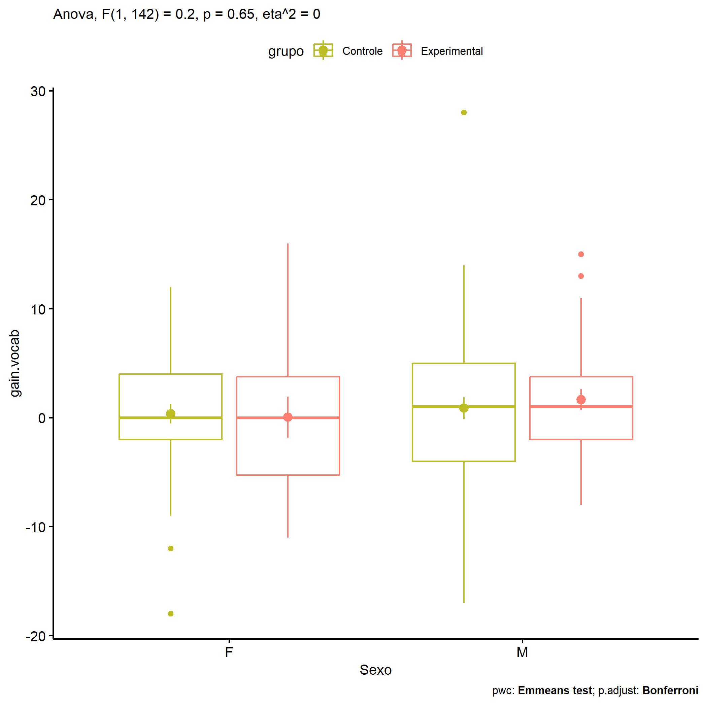
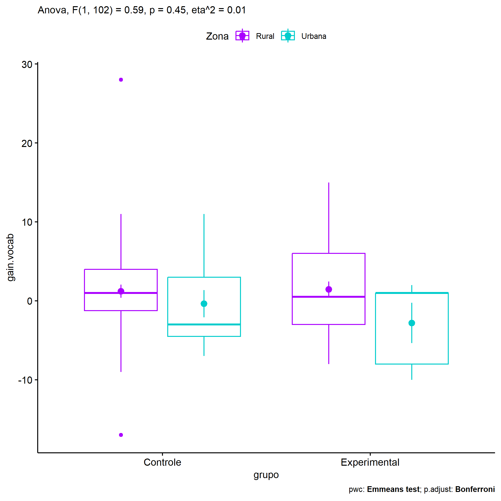
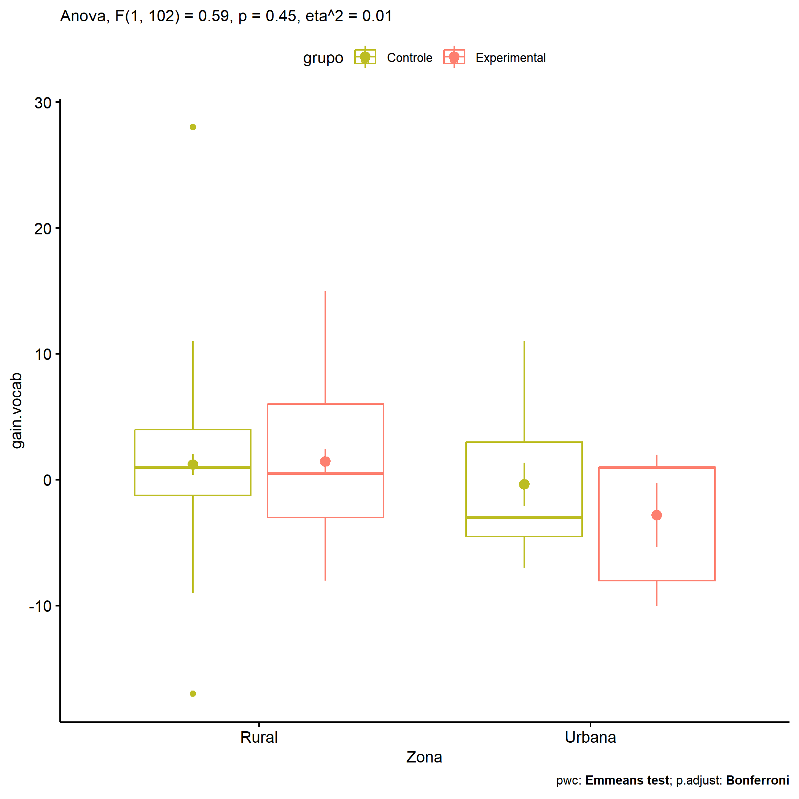
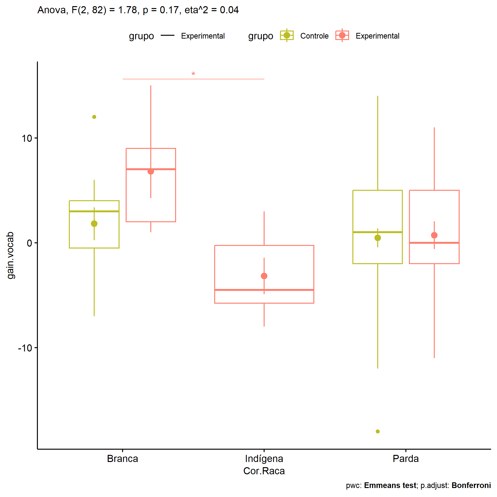

ANOVA in Gains for gain Vocabulario (acertos) (gain Vocabulario
(acertos))
================
Geiser C. Challco <geiser@alumni.usp.br>

- [Descriptive Statistics of Initial
  Data](#descriptive-statistics-of-initial-data)
- [Checking of Assumptions](#checking-of-assumptions)
  - [Assumption: Normality distribution of
    data](#assumption-normality-distribution-of-data)
  - [Assumption: Homogeneity of data
    distribution](#assumption-homogeneity-of-data-distribution)
- [Computation of ANCOVA test and Pairwise
  Comparison](#computation-of-ancova-test-and-pairwise-comparison)
  - [ANCOVA tests for one factor](#ancova-tests-for-one-factor)
  - [ANCOVA tests for two factors](#ancova-tests-for-two-factors)
  - [Pairwise comparisons for one factor:
    **grupo**](#pairwise-comparisons-for-one-factor-grupo)
  - [Pairwise comparisons for two
    factors](#pairwise-comparisons-for-two-factors)
    - [factores: **grupo:Sexo**](#factores-gruposexo)
    - [factores: **grupo:Zona**](#factores-grupozona)
    - [factores: **grupo:Cor.Raca**](#factores-grupocorraca)

**NOTE**

- Teste ANOVA para determinar se houve diferenças significativas no gain
  Vocabulario (acertos) (medido usando a diferença entre post-test e
  pre-testes).
- ANOVA test to determine whether there were significant differences in
  gain Vocabulario (acertos) (measured using the difference between
  post-test and pre-tests).

# Descriptive Statistics of Initial Data

| grupo        | Sexo | Zona   | Cor.Raca | variable   |   n |   mean | median | min | max |    sd |    se |    ci |   iqr |
|:-------------|:-----|:-------|:---------|:-----------|----:|-------:|-------:|----:|----:|------:|------:|------:|------:|
| Controle     | F    |        |          | gain.vocab |  43 |  0.372 |    0.0 | -18 |  12 | 5.847 | 0.892 | 1.800 |  6.00 |
| Controle     | M    |        |          | gain.vocab |  55 |  0.873 |    1.0 | -17 |  28 | 7.478 | 1.008 | 2.022 |  9.00 |
| Experimental | F    |        |          | gain.vocab |  16 |  0.062 |    0.0 | -11 |  16 | 7.558 | 1.890 | 4.028 |  9.00 |
| Experimental | M    |        |          | gain.vocab |  32 |  1.656 |    1.0 |  -8 |  15 | 5.380 | 0.951 | 1.940 |  5.75 |
| Controle     |      | Rural  |          | gain.vocab |  56 |  1.214 |    1.0 | -17 |  28 | 6.169 | 0.824 | 1.652 |  5.25 |
| Controle     |      | Urbana |          | gain.vocab |  11 | -0.364 |   -3.0 |  -7 |  11 | 5.749 | 1.733 | 3.862 |  7.50 |
| Controle     |      |        |          | gain.vocab |  31 |  0.000 |    0.0 | -18 |  14 | 8.157 | 1.465 | 2.992 | 12.00 |
| Experimental |      | Rural  |          | gain.vocab |  34 |  1.441 |    0.5 |  -8 |  15 | 5.759 | 0.988 | 2.009 |  9.00 |
| Experimental |      | Urbana |          | gain.vocab |   5 | -2.800 |    1.0 | -10 |   2 | 5.718 | 2.557 | 7.100 |  9.00 |
| Experimental |      |        |          | gain.vocab |   9 |  2.111 |    2.0 | -11 |  16 | 7.639 | 2.546 | 5.872 |  5.00 |
| Controle     |      |        | Branca   | gain.vocab |  11 |  1.818 |    3.0 |  -7 |  12 | 5.193 | 1.566 | 3.488 |  4.50 |
| Controle     |      |        | Indígena | gain.vocab |   3 |  1.000 |    1.0 |   1 |   1 | 0.000 | 0.000 | 0.000 |  0.00 |
| Controle     |      |        | Parda    | gain.vocab |  45 |  0.467 |    1.0 | -18 |  14 | 5.987 | 0.893 | 1.799 |  7.00 |
| Controle     |      |        | Preta    | gain.vocab |   1 |  4.000 |    4.0 |   4 |   4 |       |       |       |  0.00 |
| Controle     |      |        |          | gain.vocab |  38 |  0.421 |    0.0 | -17 |  28 | 8.359 | 1.356 | 2.748 | 11.00 |
| Experimental |      |        | Branca   | gain.vocab |   5 |  6.800 |    7.0 |   1 |  15 | 5.675 | 2.538 | 7.046 |  7.00 |
| Experimental |      |        | Indígena | gain.vocab |   6 | -3.167 |   -4.5 |  -8 |   3 | 4.262 | 1.740 | 4.473 |  5.50 |
| Experimental |      |        | Parda    | gain.vocab |  18 |  0.722 |    0.0 | -11 |  11 | 5.603 | 1.321 | 2.786 |  7.00 |
| Experimental |      |        |          | gain.vocab |  19 |  1.368 |    1.0 | -10 |  16 | 6.465 | 1.483 | 3.116 |  5.50 |

# Checking of Assumptions

## Assumption: Normality distribution of data

| var        |   n |   skewness |  kurtosis | symmetry | statistic | method     |         p | p.signif | normality |
|:-----------|----:|-----------:|----------:|:---------|----------:|:-----------|----------:|:---------|:----------|
| gain.vocab | 146 |  0.2623168 | 1.6941367 | YES      | 10.689290 | D’Agostino | 0.0047736 | \*       | QQ        |
| gain.vocab | 106 |  0.7666113 | 3.2486314 | NO       | 23.807700 | D’Agostino | 0.0000068 | \*\*\*\* | QQ        |
| gain.vocab |  89 | -0.3054262 | 0.8018739 | YES      |  4.559841 | D’Agostino | 0.1022923 | ns       | YES       |

## Assumption: Homogeneity of data distribution

| var        | method        | formula                          |   n | df1 | df2 | statistic |         p | p.signif |
|:-----------|:--------------|:---------------------------------|----:|----:|----:|----------:|----------:|:---------|
| gain.vocab | Levene’s test | `gain.vocab`~`grupo`\*`Sexo`     | 146 |   3 | 142 | 1.5136865 | 0.2135771 | ns       |
| gain.vocab | Levene’s test | `gain.vocab`~`grupo`\*`Zona`     | 106 |   3 | 102 | 0.1570191 | 0.9249407 | ns       |
| gain.vocab | Levene’s test | `gain.vocab`~`grupo`\*`Cor.Raca` |  89 |   6 |  82 | 0.9024851 | 0.4973282 | ns       |

# Computation of ANCOVA test and Pairwise Comparison

## ANCOVA tests for one factor

| Effect   | DFn | DFd |     SSn |      SSd |     F |     p |   ges | p\<.05 |
|:---------|----:|----:|--------:|---------:|------:|------:|------:|:-------|
| grupo    |   1 | 144 |   7.176 | 6243.454 | 0.166 | 0.685 | 0.001 |        |
| Sexo     |   1 | 144 |  26.781 | 6223.849 | 0.620 | 0.432 | 0.004 |        |
| Zona     |   1 | 104 |  79.888 | 3670.650 | 2.263 | 0.135 | 0.021 |        |
| Cor.Raca |   3 |  85 | 180.145 | 2720.956 | 1.876 | 0.140 | 0.062 |        |

## ANCOVA tests for two factors

|     | Effect         | DFn | DFd |     SSn |      SSd |     F |     p |   ges | p\<.05 |
|:----|:---------------|----:|----:|--------:|---------:|------:|------:|------:|:-------|
| 3   | grupo:Sexo     |   1 | 142 |   8.839 | 6210.312 | 0.202 | 0.654 | 0.001 |        |
| 6   | grupo:Zona     |   1 | 102 |  20.974 | 3649.156 | 0.586 | 0.446 | 0.006 |        |
| 9   | grupo:Cor.Raca |   2 |  82 | 112.903 | 2600.081 | 1.780 | 0.175 | 0.042 |        |

## Pairwise comparisons for one factor: **grupo**

| var        | grupo        |   n |     M |    SE |
|:-----------|:-------------|----:|------:|------:|
| gain.vocab | Controle     |  98 | 0.653 | 0.685 |
| gain.vocab | Experimental |  48 | 1.125 | 0.889 |

| .y.        | group1   | group2       | estimate | conf.low | conf.high |   se | statistic |     p | p.adj | p.adj.signif |
|:-----------|:---------|:-------------|---------:|---------:|----------:|-----:|----------:|------:|------:|:-------------|
| gain.vocab | Controle | Experimental |   -0.472 |   -2.765 |     1.821 | 1.16 |    -0.407 | 0.685 | 0.685 | ns           |

    ## Scale for colour is already present.
    ## Adding another scale for colour, which will replace the existing scale.

<!-- -->

## Pairwise comparisons for two factors

### factores: **grupo:Sexo**

| var        | grupo        | Sexo |   n |     M |    SE |
|:-----------|:-------------|:-----|----:|------:|------:|
| gain.vocab | Controle     | F    |  43 | 0.372 | 0.892 |
| gain.vocab | Controle     | M    |  55 | 0.873 | 1.008 |
| gain.vocab | Experimental | F    |  16 | 0.062 | 1.890 |
| gain.vocab | Experimental | M    |  32 | 1.656 | 0.951 |

| .y.        | grupo        | Sexo | group1   | group2       | estimate | conf.low | conf.high |    se | statistic |     p | p.adj | p.adj.signif |
|:-----------|:-------------|:-----|:---------|:-------------|---------:|---------:|----------:|------:|----------:|------:|------:|:-------------|
| gain.vocab |              | F    | Controle | Experimental |    0.310 |   -3.519 |     4.138 | 1.937 |     0.160 | 0.873 | 0.873 | ns           |
| gain.vocab |              | M    | Controle | Experimental |   -0.784 |   -3.690 |     2.123 | 1.470 |    -0.533 | 0.595 | 0.595 | ns           |
| gain.vocab | Controle     |      | F        | M            |   -0.501 |   -3.162 |     2.161 | 1.346 |    -0.372 | 0.711 | 0.711 | ns           |
| gain.vocab | Experimental |      | F        | M            |   -1.594 |   -5.597 |     2.409 | 2.025 |    -0.787 | 0.433 | 0.433 | ns           |

    ## Scale for colour is already present.
    ## Adding another scale for colour, which will replace the existing scale.

<!-- -->

    ## Scale for colour is already present.
    ## Adding another scale for colour, which will replace the existing scale.

<!-- -->

### factores: **grupo:Zona**

| var        | grupo        | Zona   |   n |      M |    SE |
|:-----------|:-------------|:-------|----:|-------:|------:|
| gain.vocab | Controle     | Rural  |  56 |  1.214 | 0.824 |
| gain.vocab | Controle     | Urbana |  11 | -0.364 | 1.733 |
| gain.vocab | Experimental | Rural  |  34 |  1.441 | 0.988 |
| gain.vocab | Experimental | Urbana |   5 | -2.800 | 2.557 |

| .y.        | grupo        | Zona   | group1   | group2       | estimate | conf.low | conf.high |    se | statistic |     p | p.adj | p.adj.signif |
|:-----------|:-------------|:-------|:---------|:-------------|---------:|---------:|----------:|------:|----------:|------:|------:|:-------------|
| gain.vocab |              | Rural  | Controle | Experimental |   -0.227 |   -2.806 |     2.352 | 1.300 |    -0.174 | 0.862 | 0.862 | ns           |
| gain.vocab |              | Urbana | Controle | Experimental |    2.436 |   -3.963 |     8.835 | 3.226 |     0.755 | 0.452 | 0.452 | ns           |
| gain.vocab | Controle     |        | Rural    | Urbana       |    1.578 |   -2.335 |     5.491 | 1.973 |     0.800 | 0.426 | 0.426 | ns           |
| gain.vocab | Experimental |        | Rural    | Urbana       |    4.241 |   -1.441 |     9.924 | 2.865 |     1.480 | 0.142 | 0.142 | ns           |

    ## Scale for colour is already present.
    ## Adding another scale for colour, which will replace the existing scale.

<!-- -->

    ## Scale for colour is already present.
    ## Adding another scale for colour, which will replace the existing scale.

<!-- -->

### factores: **grupo:Cor.Raca**

| var        | grupo        | Cor.Raca |   n |      M |    SE |
|:-----------|:-------------|:---------|----:|-------:|------:|
| gain.vocab | Controle     | Branca   |  11 |  1.818 | 1.566 |
| gain.vocab | Controle     | Parda    |  45 |  0.467 | 0.893 |
| gain.vocab | Experimental | Branca   |   5 |  6.800 | 2.538 |
| gain.vocab | Experimental | Indígena |   6 | -3.167 | 1.740 |
| gain.vocab | Experimental | Parda    |  18 |  0.722 | 1.321 |

|     | .y.        | grupo        | Cor.Raca | group1   | group2       | estimate | conf.low | conf.high |    se | statistic |     p | p.adj | p.adj.signif |
|:----|:-----------|:-------------|:---------|:---------|:-------------|---------:|---------:|----------:|------:|----------:|------:|------:|:-------------|
| 1   | gain.vocab |              | Branca   | Controle | Experimental |   -4.982 |  -11.101 |     1.137 | 3.075 |    -1.620 | 0.109 | 0.109 | ns           |
| 3   | gain.vocab |              | Parda    | Controle | Experimental |   -0.256 |   -3.420 |     2.908 | 1.590 |    -0.161 | 0.873 | 0.873 | ns           |
| 5   | gain.vocab | Controle     |          | Branca   | Parda        |    1.352 |   -2.464 |     5.168 | 1.918 |     0.705 | 0.483 | 0.483 | ns           |
| 7   | gain.vocab | Experimental |          | Branca   | Indígena     |    9.967 |    3.097 |    16.837 | 3.452 |     2.887 | 0.005 | 0.015 | \*           |
| 8   | gain.vocab | Experimental |          | Branca   | Parda        |    6.078 |    0.342 |    11.813 | 2.882 |     2.109 | 0.038 | 0.114 | ns           |
| 9   | gain.vocab | Experimental |          | Indígena | Parda        |   -3.889 |   -9.237 |     1.459 | 2.687 |    -1.447 | 0.152 | 0.455 | ns           |

    ## Scale for colour is already present.
    ## Adding another scale for colour, which will replace the existing scale.

<!-- -->
