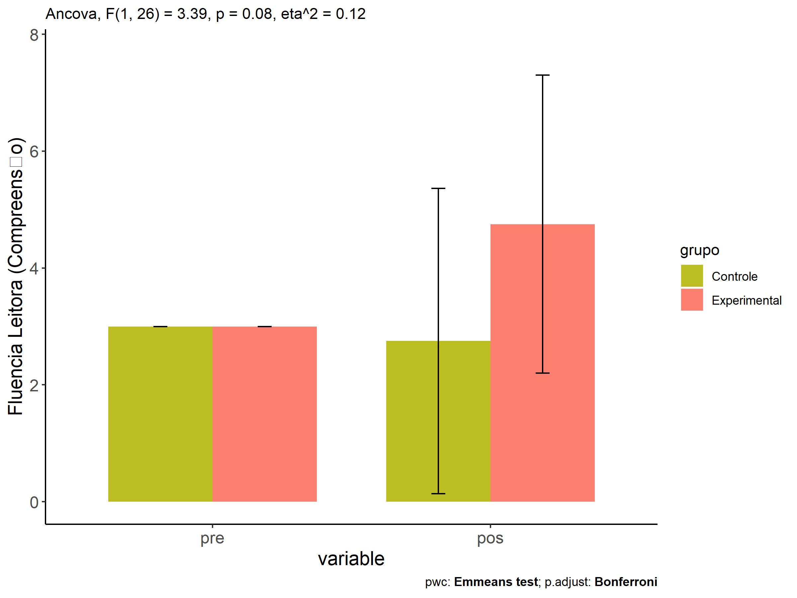
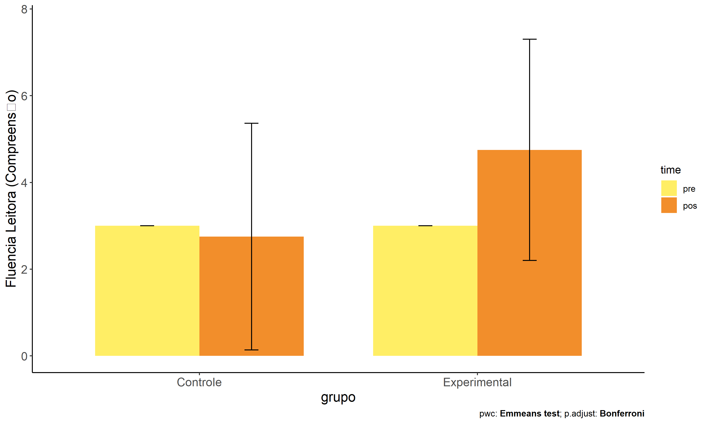
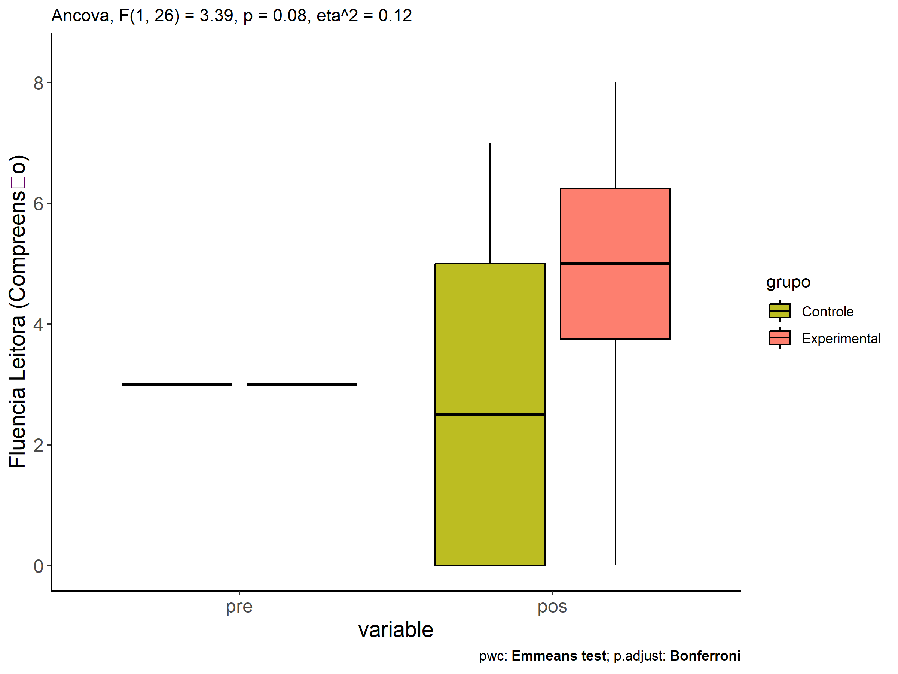
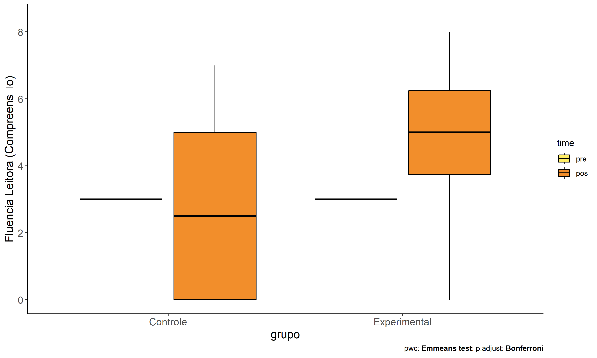
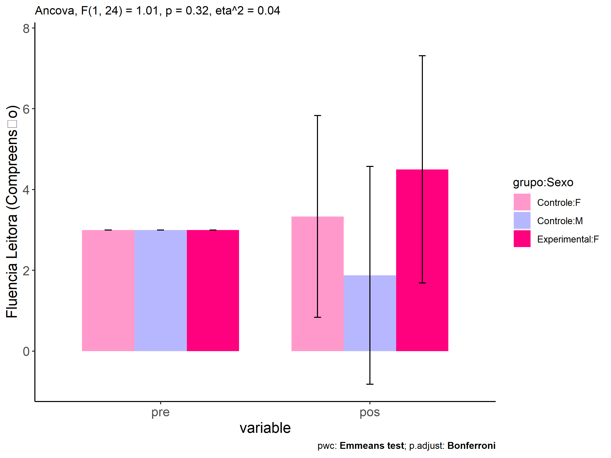
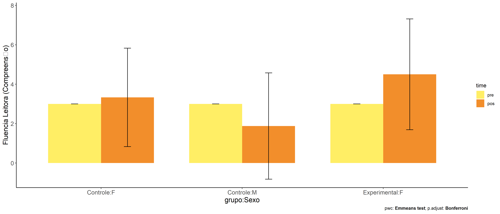
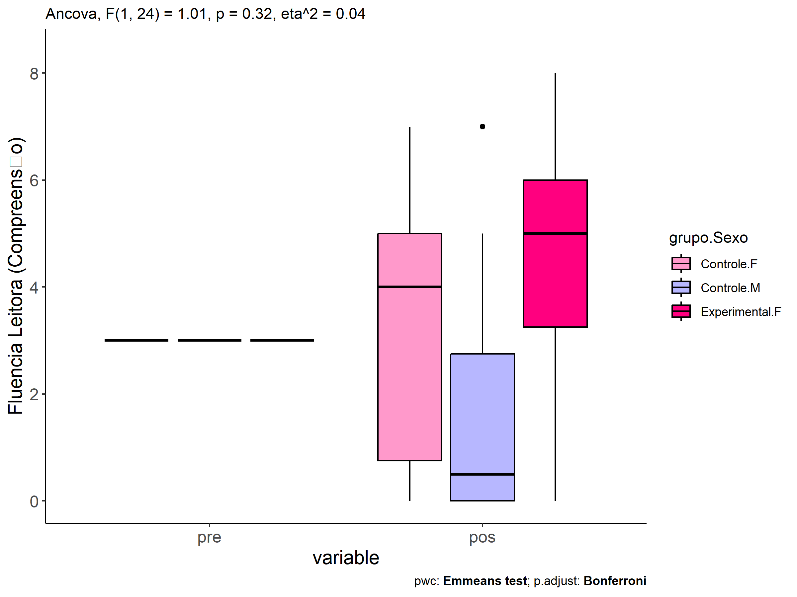
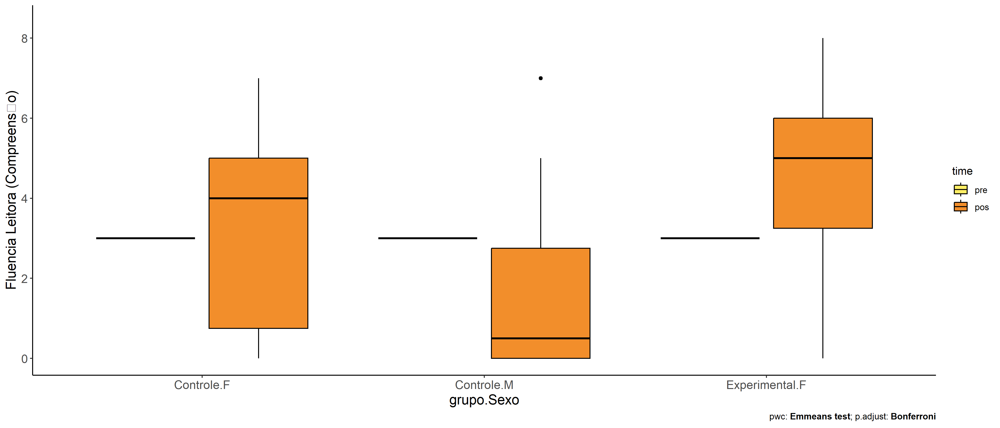

ANCOVA in Fluencia Leitora (Compreens�o) (Fluencia Leitora
(Compreens�o))
================
Geiser C. Challco <geiser@alumni.usp.br>

- [Descriptive Statistics of Initial
  Data](#descriptive-statistics-of-initial-data)
- [Checking of Assumptions](#checking-of-assumptions)
  - [Assumption: Normality distribution of
    data](#assumption-normality-distribution-of-data)
  - [Assumption: Homogeneity of data
    distribution](#assumption-homogeneity-of-data-distribution)
- [Computation of ANCOVA test and Pairwise
  Comparison](#computation-of-ancova-test-and-pairwise-comparison)
  - [ANCOVA tests for one factor](#ancova-tests-for-one-factor)
  - [ANCOVA tests for two factors](#ancova-tests-for-two-factors)
  - [Pairwise comparisons for one factor:
    **grupo**](#pairwise-comparisons-for-one-factor-grupo)
  - [Pairwise comparisons for two
    factors](#pairwise-comparisons-for-two-factors)
    - [factores: **grupo:Sexo**](#factores-gruposexo)
    - [factores: **grupo:Zona**](#factores-grupozona)
    - [factores: **grupo:Cor.Raca**](#factores-grupocorraca)
    - [factores: **grupo:Serie**](#factores-gruposerie)

**NOTE**

- Teste ANCOVA para determinar se houve diferenças significativas no
  Fluencia Leitora (Compreens�o) (medido usando pre- e pos-testes).
- ANCOVA test to determine whether there were significant differences in
  Fluencia Leitora (Compreens�o) (measured using pre- and post-tests).

# Descriptive Statistics of Initial Data

| grupo        | Sexo | Zona   | Cor.Raca | Serie | variable                |   n |  mean | median | min | max |    sd |    se |     ci |  iqr |
|:-------------|:-----|:-------|:---------|:------|:------------------------|----:|------:|-------:|----:|----:|------:|------:|-------:|-----:|
| Controle     | F    |        |          |       | leitura.compreensao.pre |  12 | 3.000 |    3.0 |   3 |   3 | 0.000 | 0.000 |  0.000 | 0.00 |
| Controle     | M    |        |          |       | leitura.compreensao.pre |   8 | 3.000 |    3.0 |   3 |   3 | 0.000 | 0.000 |  0.000 | 0.00 |
| Experimental | F    |        |          |       | leitura.compreensao.pre |   6 | 3.000 |    3.0 |   3 |   3 | 0.000 | 0.000 |  0.000 | 0.00 |
| Experimental | M    |        |          |       | leitura.compreensao.pre |   2 | 3.000 |    3.0 |   3 |   3 | 0.000 | 0.000 |  0.000 | 0.00 |
| Controle     | F    |        |          |       | leitura.compreensao.pos |  12 | 3.333 |    4.0 |   0 |   7 | 2.498 | 0.721 |  1.587 | 4.25 |
| Controle     | M    |        |          |       | leitura.compreensao.pos |   8 | 1.875 |    0.5 |   0 |   7 | 2.696 | 0.953 |  2.254 | 2.75 |
| Experimental | F    |        |          |       | leitura.compreensao.pos |   6 | 4.500 |    5.0 |   0 |   8 | 2.811 | 1.147 |  2.950 | 2.75 |
| Experimental | M    |        |          |       | leitura.compreensao.pos |   2 | 5.500 |    5.5 |   4 |   7 | 2.121 | 1.500 | 19.059 | 1.50 |
| Controle     |      | Rural  |          |       | leitura.compreensao.pre |  12 | 3.000 |    3.0 |   3 |   3 | 0.000 | 0.000 |  0.000 | 0.00 |
| Controle     |      | Urbana |          |       | leitura.compreensao.pre |   5 | 3.000 |    3.0 |   3 |   3 | 0.000 | 0.000 |  0.000 | 0.00 |
| Controle     |      |        |          |       | leitura.compreensao.pre |   3 | 3.000 |    3.0 |   3 |   3 | 0.000 | 0.000 |  0.000 | 0.00 |
| Experimental |      | Rural  |          |       | leitura.compreensao.pre |   4 | 3.000 |    3.0 |   3 |   3 | 0.000 | 0.000 |  0.000 | 0.00 |
| Experimental |      | Urbana |          |       | leitura.compreensao.pre |   2 | 3.000 |    3.0 |   3 |   3 | 0.000 | 0.000 |  0.000 | 0.00 |
| Experimental |      |        |          |       | leitura.compreensao.pre |   2 | 3.000 |    3.0 |   3 |   3 | 0.000 | 0.000 |  0.000 | 0.00 |
| Controle     |      | Rural  |          |       | leitura.compreensao.pos |  12 | 3.000 |    3.5 |   0 |   7 | 2.558 | 0.739 |  1.626 | 5.00 |
| Controle     |      | Urbana |          |       | leitura.compreensao.pos |   5 | 1.400 |    1.0 |   0 |   5 | 2.074 | 0.927 |  2.575 | 1.00 |
| Controle     |      |        |          |       | leitura.compreensao.pos |   3 | 4.000 |    5.0 |   0 |   7 | 3.606 | 2.082 |  8.957 | 3.50 |
| Experimental |      | Rural  |          |       | leitura.compreensao.pos |   4 | 4.500 |    5.0 |   0 |   8 | 3.416 | 1.708 |  5.435 | 3.50 |
| Experimental |      | Urbana |          |       | leitura.compreensao.pos |   2 | 4.500 |    4.5 |   3 |   6 | 2.121 | 1.500 | 19.059 | 1.50 |
| Experimental |      |        |          |       | leitura.compreensao.pos |   2 | 5.500 |    5.5 |   4 |   7 | 2.121 | 1.500 | 19.059 | 1.50 |
| Controle     |      |        | Branca   |       | leitura.compreensao.pre |   2 | 3.000 |    3.0 |   3 |   3 | 0.000 | 0.000 |  0.000 | 0.00 |
| Controle     |      |        | Parda    |       | leitura.compreensao.pre |   4 | 3.000 |    3.0 |   3 |   3 | 0.000 | 0.000 |  0.000 | 0.00 |
| Controle     |      |        |          |       | leitura.compreensao.pre |  14 | 3.000 |    3.0 |   3 |   3 | 0.000 | 0.000 |  0.000 | 0.00 |
| Experimental |      |        | Indígena |       | leitura.compreensao.pre |   3 | 3.000 |    3.0 |   3 |   3 | 0.000 | 0.000 |  0.000 | 0.00 |
| Experimental |      |        | Parda    |       | leitura.compreensao.pre |   1 | 3.000 |    3.0 |   3 |   3 |       |       |        | 0.00 |
| Experimental |      |        |          |       | leitura.compreensao.pre |   4 | 3.000 |    3.0 |   3 |   3 | 0.000 | 0.000 |  0.000 | 0.00 |
| Controle     |      |        | Branca   |       | leitura.compreensao.pos |   2 | 6.000 |    6.0 |   5 |   7 | 1.414 | 1.000 | 12.706 | 1.00 |
| Controle     |      |        | Parda    |       | leitura.compreensao.pos |   4 | 3.750 |    4.5 |   0 |   6 | 2.630 | 1.315 |  4.185 | 2.25 |
| Controle     |      |        |          |       | leitura.compreensao.pos |  14 | 2.000 |    1.0 |   0 |   7 | 2.386 | 0.638 |  1.378 | 3.75 |
| Experimental |      |        | Indígena |       | leitura.compreensao.pos |   3 | 7.000 |    7.0 |   6 |   8 | 1.000 | 0.577 |  2.484 | 1.00 |
| Experimental |      |        | Parda    |       | leitura.compreensao.pos |   1 | 0.000 |    0.0 |   0 |   0 |       |       |        | 0.00 |
| Experimental |      |        |          |       | leitura.compreensao.pos |   4 | 4.250 |    4.0 |   3 |   6 | 1.258 | 0.629 |  2.002 | 0.75 |
| Controle     |      |        |          | 6 ano | leitura.compreensao.pre |   5 | 3.000 |    3.0 |   3 |   3 | 0.000 | 0.000 |  0.000 | 0.00 |
| Controle     |      |        |          | 7 ano | leitura.compreensao.pre |   7 | 3.000 |    3.0 |   3 |   3 | 0.000 | 0.000 |  0.000 | 0.00 |
| Controle     |      |        |          | 8 ano | leitura.compreensao.pre |   5 | 3.000 |    3.0 |   3 |   3 | 0.000 | 0.000 |  0.000 | 0.00 |
| Controle     |      |        |          | 9 ano | leitura.compreensao.pre |   3 | 3.000 |    3.0 |   3 |   3 | 0.000 | 0.000 |  0.000 | 0.00 |
| Experimental |      |        |          | 6 ano | leitura.compreensao.pre |   2 | 3.000 |    3.0 |   3 |   3 | 0.000 | 0.000 |  0.000 | 0.00 |
| Experimental |      |        |          | 8 ano | leitura.compreensao.pre |   4 | 3.000 |    3.0 |   3 |   3 | 0.000 | 0.000 |  0.000 | 0.00 |
| Experimental |      |        |          | 9 ano | leitura.compreensao.pre |   2 | 3.000 |    3.0 |   3 |   3 | 0.000 | 0.000 |  0.000 | 0.00 |
| Controle     |      |        |          | 6 ano | leitura.compreensao.pos |   5 | 4.000 |    5.0 |   1 |   5 | 1.732 | 0.775 |  2.151 | 1.00 |
| Controle     |      |        |          | 7 ano | leitura.compreensao.pos |   7 | 2.000 |    0.0 |   0 |   6 | 2.646 | 1.000 |  2.447 | 4.00 |
| Controle     |      |        |          | 8 ano | leitura.compreensao.pos |   5 | 0.600 |    0.0 |   0 |   2 | 0.894 | 0.400 |  1.111 | 1.00 |
| Controle     |      |        |          | 9 ano | leitura.compreensao.pos |   3 | 6.000 |    7.0 |   4 |   7 | 1.732 | 1.000 |  4.303 | 1.50 |
| Experimental |      |        |          | 6 ano | leitura.compreensao.pos |   2 | 5.000 |    5.0 |   4 |   6 | 1.414 | 1.000 | 12.706 | 1.00 |
| Experimental |      |        |          | 8 ano | leitura.compreensao.pos |   4 | 4.000 |    4.5 |   0 |   7 | 3.162 | 1.581 |  5.032 | 4.00 |
| Experimental |      |        |          | 9 ano | leitura.compreensao.pos |   2 | 6.000 |    6.0 |   4 |   8 | 2.828 | 2.000 | 25.412 | 2.00 |

# Checking of Assumptions

## Assumption: Normality distribution of data

| var                     |   n |   skewness |   kurtosis | symmetry | statistic | method       |         p | p.signif | normality |
|:------------------------|----:|-----------:|-----------:|:---------|----------:|:-------------|----------:|:---------|:----------|
| leitura.compreensao.pos |  28 |  0.1245384 | -0.9794492 | YES      | 0.9713280 | Shapiro-Wilk | 0.6166175 | ns       | YES       |
| leitura.compreensao.pos |  23 | -0.0121684 | -1.1615566 | YES      | 0.9608761 | Shapiro-Wilk | 0.4812858 | ns       | YES       |
| leitura.compreensao.pos |  10 | -0.8634189 |  0.0390496 | NO       | 0.9093076 | Shapiro-Wilk | 0.2762685 | ns       | YES       |
| leitura.compreensao.pos |  28 |  0.0103234 | -0.8090010 | YES      | 0.9654352 | Shapiro-Wilk | 0.4648500 | ns       | YES       |

## Assumption: Homogeneity of data distribution

| var                     | method         | formula                    |   n | DFn.df1 | DFd.df2 | statistic |         p | p.signif |
|:------------------------|:---------------|:---------------------------|----:|--------:|--------:|----------:|----------:|:---------|
| leitura.compreensao.pos | Levene’s test  | `.res`~`grupo`\*`Sexo`     |  28 |       3 |      24 | 0.0788391 | 0.9708569 | ns       |
| leitura.compreensao.pos | Anova’s slopes | `.res`~`grupo`\*`Sexo`     |  28 |       0 |      24 |           |           |          |
| leitura.compreensao.pos | Levene’s test  | `.res`~`grupo`\*`Zona`     |  23 |       3 |      19 | 0.7809493 | 0.5191409 | ns       |
| leitura.compreensao.pos | Anova’s slopes | `.res`~`grupo`\*`Zona`     |  23 |       0 |      19 |           |           |          |
| leitura.compreensao.pos | Levene’s test  | `.res`~`grupo`\*`Cor.Raca` |  10 |       3 |       6 | 0.6102190 | 0.6326218 | ns       |
| leitura.compreensao.pos | Anova’s slopes | `.res`~`grupo`\*`Cor.Raca` |  10 |       0 |       6 |           |           |          |
| leitura.compreensao.pos | Levene’s test  | `.res`~`grupo`\*`Serie`    |  28 |       6 |      21 | 0.6455925 | 0.6930613 | ns       |
| leitura.compreensao.pos | Anova’s slopes | `.res`~`grupo`\*`Serie`    |  28 |       0 |      21 |           |           |          |

# Computation of ANCOVA test and Pairwise Comparison

## ANCOVA tests for one factor

|     | Effect                  | DFn | DFd |    SSn |     SSd |     F |     p |   ges | p\<.05 |
|:----|:------------------------|----:|----:|-------:|--------:|------:|------:|------:|:-------|
| 1   | leitura.compreensao.pre |   0 |  26 |        | 175.250 |       |       |       |        |
| 2   | grupo                   |   1 |  26 | 22.857 | 175.250 | 3.391 | 0.077 | 0.115 |        |
| 4   | Sexo                    |   1 |  26 |  8.096 | 190.011 | 1.108 | 0.302 | 0.041 |        |
| 6   | Zona                    |   1 |  21 |  5.778 | 149.179 | 0.813 | 0.377 | 0.037 |        |
| 8   | Cor.Raca                |   2 |   7 | 33.600 |  36.000 | 3.267 | 0.100 | 0.483 |        |
| 10  | Serie                   |   3 |  24 | 67.790 | 130.317 | 4.162 | 0.017 | 0.342 | \*     |

## ANCOVA tests for two factors

|     | Effect                  | DFn | DFd |    SSn |     SSd |     F |     p |   ges | p\<.05 |
|:----|:------------------------|----:|----:|-------:|--------:|------:|------:|------:|:-------|
| 1   | leitura.compreensao.pre |   0 |  24 |        | 163.542 |       |       |       |        |
| 4   | grupo:Sexo              |   1 |  24 |  6.907 | 163.542 | 1.014 | 0.324 | 0.041 |        |
| 8   | grupo:Zona              |   1 |  19 |  2.477 | 128.700 | 0.366 | 0.552 | 0.019 |        |
| 12  | grupo:Cor.Raca          |   0 |   6 |        |  24.750 |       |       |       |        |
| 16  | grupo:Serie             |   2 |  21 | 10.478 | 103.200 | 1.066 | 0.362 | 0.092 |        |

## Pairwise comparisons for one factor: **grupo**

| var                     | grupo        |   n | M (pre) | SE (pre) | M (unadj) | SE (unadj) | M (adj) | SE (adj) |
|:------------------------|:-------------|----:|--------:|---------:|----------:|-----------:|--------:|---------:|
| leitura.compreensao.pos | Controle     |  20 |       3 |        0 |      2.75 |      0.584 |    2.75 |    0.581 |
| leitura.compreensao.pos | Experimental |   8 |       3 |        0 |      4.75 |      0.901 |    4.75 |    0.918 |

| .y.                     | group1   | group2       | estimate | conf.low | conf.high |    se | statistic |     p | p.adj | p.adj.signif |
|:------------------------|:---------|:-------------|---------:|---------:|----------:|------:|----------:|------:|------:|:-------------|
| leitura.compreensao.pos | Controle | Experimental |       -2 |   -4.232 |     0.232 | 1.086 |    -1.841 | 0.077 | 0.077 | ns           |
| leitura.compreensao.pre | Controle | Experimental |        0 |    0.000 |     0.000 | 0.000 |    -0.625 | 0.537 | 0.537 | ns           |

| .y.                 | grupo        | group1 | group2 | estimate | conf.low | conf.high |    se | statistic |     p | p.adj | p.adj.signif |
|:--------------------|:-------------|:-------|:-------|---------:|---------:|----------:|------:|----------:|------:|------:|:-------------|
| leitura.compreensao | Controle     | pre    | pos    |     0.25 |   -0.915 |     1.415 | 0.581 |     0.431 | 0.669 | 0.669 | ns           |
| leitura.compreensao | Experimental | pre    | pos    |    -1.75 |   -3.592 |     0.092 | 0.918 |    -1.907 | 0.062 | 0.062 | ns           |

<!-- -->

<!-- -->

<!-- -->

<!-- -->

## Pairwise comparisons for two factors

### factores: **grupo:Sexo**

| var                     | grupo        | Sexo |   n | M (pre) | SE (pre) | M (unadj) | SE (unadj) | M (adj) | SE (adj) |
|:------------------------|:-------------|:-----|----:|--------:|---------:|----------:|-----------:|--------:|---------:|
| leitura.compreensao.pos | Controle     | F    |  12 |       3 |        0 |     3.333 |      0.721 |   3.333 |    0.759 |
| leitura.compreensao.pos | Controle     | M    |   8 |       3 |        0 |     1.875 |      0.953 |   1.875 |    0.930 |
| leitura.compreensao.pos | Experimental | F    |   6 |       3 |        0 |     4.500 |      1.147 |   4.500 |    1.074 |

|     | .y.                     | grupo    | Sexo | group1   | group2       | estimate | conf.low | conf.high |    se | statistic |     p | p.adj | p.adj.signif |
|:----|:------------------------|:---------|:-----|:---------|:-------------|---------:|---------:|----------:|------:|----------:|------:|------:|:-------------|
| 1   | leitura.compreensao.pos |          | F    | Controle | Experimental |   -1.167 |   -3.887 |     1.553 | 1.315 |    -0.887 | 0.384 | 0.384 | ns           |
| 5   | leitura.compreensao.pos | Controle |      | F        | M            |    1.458 |   -1.025 |     3.941 | 1.200 |     1.215 | 0.237 | 0.237 | ns           |

| .y.                 | grupo        | Sexo | group1 | group2 | estimate | conf.low | conf.high |    se | statistic |     p | p.adj | p.adj.signif |
|:--------------------|:-------------|:-----|:-------|:-------|---------:|---------:|----------:|------:|----------:|------:|------:|:-------------|
| leitura.compreensao | Controle     | F    | pre    | pos    |   -0.333 |   -1.861 |     1.195 | 0.759 |    -0.439 | 0.663 | 0.663 | ns           |
| leitura.compreensao | Controle     | M    | pre    | pos    |    1.125 |   -0.746 |     2.996 | 0.930 |     1.210 | 0.232 | 0.232 | ns           |
| leitura.compreensao | Experimental | F    | pre    | pos    |   -1.500 |   -3.661 |     0.661 | 1.074 |    -1.397 | 0.169 | 0.169 | ns           |

<!-- -->

<!-- -->

<!-- -->

<!-- -->

### factores: **grupo:Zona**

### factores: **grupo:Cor.Raca**

### factores: **grupo:Serie**
