ANCOVA in Fluencia Leitora (Compreensão) (Fluencia Leitora
(Compreensão))
================
Geiser C. Challco <geiser@alumni.usp.br>

- [Descriptive Statistics of Initial
  Data](#descriptive-statistics-of-initial-data)
- [Checking of Assumptions](#checking-of-assumptions)
  - [Assumption: Normality distribution of
    data](#assumption-normality-distribution-of-data)
  - [Assumption: Homogeneity of data
    distribution](#assumption-homogeneity-of-data-distribution)
- [Computation of ANCOVA test and Pairwise
  Comparison](#computation-of-ancova-test-and-pairwise-comparison)
  - [ANCOVA tests for one factor](#ancova-tests-for-one-factor)
  - [ANCOVA tests for two factors](#ancova-tests-for-two-factors)
  - [Pairwise comparisons for one factor:
    **grupo**](#pairwise-comparisons-for-one-factor-grupo)
  - [Pairwise comparisons for two
    factors](#pairwise-comparisons-for-two-factors)
    - [factores: **grupo:Sexo**](#factores-gruposexo)
    - [factores: **grupo:Zona**](#factores-grupozona)
    - [factores: **grupo:Cor.Raca**](#factores-grupocorraca)
    - [factores:
      **grupo:leitura.compreensao.quintile**](#factores-grupoleituracompreensaoquintile)

**NOTE**

- Teste ANCOVA para determinar se houve diferenças significativas no
  Fluencia Leitora (Compreensão) (medido usando pre- e pos-testes).
- ANCOVA test to determine whether there were significant differences in
  Fluencia Leitora (Compreensão) (measured using pre- and post-tests).

# Descriptive Statistics of Initial Data

| grupo        | Sexo | Zona   | Cor.Raca | leitura.compreensao.quintile | variable                |   n |  mean | median | min | max |    sd |    se |     ci |  iqr |
|:-------------|:-----|:-------|:---------|:-----------------------------|:------------------------|----:|------:|-------:|----:|----:|------:|------:|-------:|-----:|
| Controle     | F    |        |          |                              | leitura.compreensao.pre |  20 | 4.550 |    5.0 |   0 |   8 | 1.731 | 0.387 |  0.810 | 3.00 |
| Controle     | M    |        |          |                              | leitura.compreensao.pre |  20 | 3.700 |    4.5 |   0 |   7 | 2.452 | 0.548 |  1.147 | 3.50 |
| Experimental | F    |        |          |                              | leitura.compreensao.pre |  11 | 5.364 |    5.0 |   3 |   8 | 1.362 | 0.411 |  0.915 | 1.00 |
| Experimental | M    |        |          |                              | leitura.compreensao.pre |  10 | 5.700 |    6.0 |   3 |   8 | 1.703 | 0.539 |  1.218 | 2.50 |
| Controle     | F    |        |          |                              | leitura.compreensao.pos |  20 | 3.750 |    4.5 |   0 |   7 | 2.291 | 0.512 |  1.072 | 2.50 |
| Controle     | M    |        |          |                              | leitura.compreensao.pos |  20 | 3.900 |    4.5 |   0 |   8 | 3.076 | 0.688 |  1.440 | 7.00 |
| Experimental | F    |        |          |                              | leitura.compreensao.pos |  11 | 5.636 |    6.0 |   2 |   9 | 2.014 | 0.607 |  1.353 | 1.50 |
| Experimental | M    |        |          |                              | leitura.compreensao.pos |  10 | 4.400 |    4.0 |   0 |   8 | 3.204 | 1.013 |  2.292 | 5.50 |
| Controle     |      | Rural  |          |                              | leitura.compreensao.pre |  28 | 3.964 |    5.0 |   0 |   7 | 2.219 | 0.419 |  0.860 | 3.25 |
| Controle     |      | Urbana |          |                              | leitura.compreensao.pre |   9 | 4.111 |    5.0 |   0 |   6 | 1.900 | 0.633 |  1.461 | 2.00 |
| Controle     |      |        |          |                              | leitura.compreensao.pre |   3 | 5.667 |    5.0 |   4 |   8 | 2.082 | 1.202 |  5.171 | 2.00 |
| Experimental |      | Rural  |          |                              | leitura.compreensao.pre |  14 | 5.357 |    5.0 |   3 |   8 | 1.781 | 0.476 |  1.028 | 2.75 |
| Experimental |      | Urbana |          |                              | leitura.compreensao.pre |   6 | 5.833 |    6.0 |   5 |   7 | 0.753 | 0.307 |  0.790 | 0.75 |
| Experimental |      |        |          |                              | leitura.compreensao.pre |   1 | 6.000 |    6.0 |   6 |   6 |       |       |        | 0.00 |
| Controle     |      | Rural  |          |                              | leitura.compreensao.pos |  28 | 4.393 |    5.0 |   0 |   8 | 2.331 | 0.440 |  0.904 | 3.00 |
| Controle     |      | Urbana |          |                              | leitura.compreensao.pos |   9 | 1.111 |    0.0 |   0 |   5 | 1.965 | 0.655 |  1.510 | 1.00 |
| Controle     |      |        |          |                              | leitura.compreensao.pos |   3 | 6.667 |    6.0 |   6 |   8 | 1.155 | 0.667 |  2.868 | 1.00 |
| Experimental |      | Rural  |          |                              | leitura.compreensao.pos |  14 | 5.786 |    6.0 |   2 |   9 | 2.293 | 0.613 |  1.324 | 4.00 |
| Experimental |      | Urbana |          |                              | leitura.compreensao.pos |   6 | 3.833 |    5.0 |   0 |   7 | 3.061 | 1.249 |  3.212 | 4.50 |
| Experimental |      |        |          |                              | leitura.compreensao.pos |   1 | 2.000 |    2.0 |   2 |   2 |       |       |        | 0.00 |
| Controle     |      |        | Branca   |                              | leitura.compreensao.pre |   5 | 4.200 |    5.0 |   1 |   6 | 2.168 | 0.970 |  2.692 | 3.00 |
| Controle     |      |        | Parda    |                              | leitura.compreensao.pre |  17 | 4.000 |    5.0 |   0 |   7 | 2.398 | 0.582 |  1.233 | 4.00 |
| Controle     |      |        |          |                              | leitura.compreensao.pre |  18 | 4.222 |    4.5 |   0 |   8 | 1.987 | 0.468 |  0.988 | 1.75 |
| Experimental |      |        | Amarela  |                              | leitura.compreensao.pre |   1 | 6.000 |    6.0 |   6 |   6 |       |       |        | 0.00 |
| Experimental |      |        | Branca   |                              | leitura.compreensao.pre |   1 | 6.000 |    6.0 |   6 |   6 |       |       |        | 0.00 |
| Experimental |      |        | Indígena |                              | leitura.compreensao.pre |   1 | 3.000 |    3.0 |   3 |   3 |       |       |        | 0.00 |
| Experimental |      |        | Parda    |                              | leitura.compreensao.pre |   7 | 5.286 |    5.0 |   4 |   8 | 1.604 | 0.606 |  1.483 | 2.00 |
| Experimental |      |        |          |                              | leitura.compreensao.pre |  11 | 5.818 |    6.0 |   3 |   8 | 1.471 | 0.444 |  0.988 | 1.50 |
| Controle     |      |        | Branca   |                              | leitura.compreensao.pos |   5 | 5.400 |    6.0 |   2 |   7 | 2.074 | 0.927 |  2.575 | 2.00 |
| Controle     |      |        | Parda    |                              | leitura.compreensao.pos |  17 | 4.471 |    5.0 |   0 |   8 | 2.183 | 0.529 |  1.122 | 2.00 |
| Controle     |      |        |          |                              | leitura.compreensao.pos |  18 | 2.778 |    2.0 |   0 |   8 | 2.942 | 0.693 |  1.463 | 5.00 |
| Experimental |      |        | Amarela  |                              | leitura.compreensao.pos |   1 | 2.000 |    2.0 |   2 |   2 |       |       |        | 0.00 |
| Experimental |      |        | Branca   |                              | leitura.compreensao.pos |   1 | 5.000 |    5.0 |   5 |   5 |       |       |        | 0.00 |
| Experimental |      |        | Indígena |                              | leitura.compreensao.pos |   1 | 6.000 |    6.0 |   6 |   6 |       |       |        | 0.00 |
| Experimental |      |        | Parda    |                              | leitura.compreensao.pos |   7 | 7.000 |    8.0 |   4 |   8 | 1.528 | 0.577 |  1.413 | 1.50 |
| Experimental |      |        |          |                              | leitura.compreensao.pos |  11 | 4.000 |    4.0 |   0 |   9 | 2.793 | 0.842 |  1.876 | 3.00 |
| Controle     |      |        |          | 1st quintile                 | leitura.compreensao.pre |   8 | 0.625 |    0.0 |   0 |   2 | 0.916 | 0.324 |  0.766 | 1.25 |
| Controle     |      |        |          | 2nd quintile                 | leitura.compreensao.pre |   5 | 3.000 |    3.0 |   3 |   3 | 0.000 | 0.000 |  0.000 | 0.00 |
| Controle     |      |        |          | 3rd quintile                 | leitura.compreensao.pre |  16 | 4.688 |    5.0 |   4 |   5 | 0.479 | 0.120 |  0.255 | 1.00 |
| Controle     |      |        |          | 4th quintile                 | leitura.compreensao.pre |   8 | 6.000 |    6.0 |   6 |   6 | 0.000 | 0.000 |  0.000 | 0.00 |
| Controle     |      |        |          | 5th quintile                 | leitura.compreensao.pre |   3 | 7.333 |    7.0 |   7 |   8 | 0.577 | 0.333 |  1.434 | 0.50 |
| Experimental |      |        |          | 2nd quintile                 | leitura.compreensao.pre |   2 | 3.000 |    3.0 |   3 |   3 | 0.000 | 0.000 |  0.000 | 0.00 |
| Experimental |      |        |          | 3rd quintile                 | leitura.compreensao.pre |   9 | 4.667 |    5.0 |   4 |   5 | 0.500 | 0.167 |  0.384 | 1.00 |
| Experimental |      |        |          | 4th quintile                 | leitura.compreensao.pre |   5 | 6.000 |    6.0 |   6 |   6 | 0.000 | 0.000 |  0.000 | 0.00 |
| Experimental |      |        |          | 5th quintile                 | leitura.compreensao.pre |   5 | 7.600 |    8.0 |   7 |   8 | 0.548 | 0.245 |  0.680 | 1.00 |
| Controle     |      |        |          | 1st quintile                 | leitura.compreensao.pos |   8 | 1.750 |    1.0 |   0 |   5 | 2.053 | 0.726 |  1.716 | 3.25 |
| Controle     |      |        |          | 2nd quintile                 | leitura.compreensao.pos |   5 | 4.000 |    5.0 |   1 |   5 | 1.732 | 0.775 |  2.151 | 1.00 |
| Controle     |      |        |          | 3rd quintile                 | leitura.compreensao.pos |  16 | 4.125 |    4.5 |   0 |   8 | 2.849 | 0.712 |  1.518 | 4.00 |
| Controle     |      |        |          | 4th quintile                 | leitura.compreensao.pos |   8 | 4.125 |    5.0 |   0 |   7 | 2.748 | 0.972 |  2.298 | 2.50 |
| Controle     |      |        |          | 5th quintile                 | leitura.compreensao.pos |   3 | 6.667 |    6.0 |   6 |   8 | 1.155 | 0.667 |  2.868 | 1.00 |
| Experimental |      |        |          | 2nd quintile                 | leitura.compreensao.pos |   2 | 5.000 |    5.0 |   4 |   6 | 1.414 | 1.000 | 12.706 | 1.00 |
| Experimental |      |        |          | 3rd quintile                 | leitura.compreensao.pos |   9 | 6.556 |    7.0 |   4 |   9 | 1.667 | 0.556 |  1.281 | 3.00 |
| Experimental |      |        |          | 4th quintile                 | leitura.compreensao.pos |   5 | 1.800 |    2.0 |   0 |   5 | 2.049 | 0.917 |  2.545 | 2.00 |
| Experimental |      |        |          | 5th quintile                 | leitura.compreensao.pos |   5 | 5.600 |    6.0 |   3 |   8 | 2.510 | 1.122 |  3.117 | 5.00 |

# Checking of Assumptions

## Assumption: Normality distribution of data

| var                     |   n |   skewness |   kurtosis | symmetry | statistic | method       |         p | p.signif | normality |
|:------------------------|----:|-----------:|-----------:|:---------|----------:|:-------------|----------:|:---------|:----------|
| leitura.compreensao.pos |  61 | -0.4027326 | -1.0399298 | YES      | 8.3124744 | D’Agostino   | 0.0156664 | \*       | NO        |
| leitura.compreensao.pos |  57 | -0.3225687 | -0.8089403 | YES      | 3.1362157 | D’Agostino   | 0.2084392 | ns       | YES       |
| leitura.compreensao.pos |  32 | -0.0859419 | -0.2476423 | YES      | 0.9821754 | Shapiro-Wilk | 0.8597712 | ns       | YES       |
| leitura.compreensao.pos |  61 | -0.3348594 | -0.8118439 | YES      | 3.5926433 | D’Agostino   | 0.1659080 | ns       | YES       |

## Assumption: Homogeneity of data distribution

| var                     | method         | formula                                        |   n | DFn.df1 | DFd.df2 | statistic |         p | p.signif |
|:------------------------|:---------------|:-----------------------------------------------|----:|--------:|--------:|----------:|----------:|:---------|
| leitura.compreensao.pos | Levene’s test  | `.res`~`grupo`\*`Sexo`                         |  61 |       3 |      57 |  1.409983 | 0.2492413 | ns       |
| leitura.compreensao.pos | Anova’s slopes | `.res`~`grupo`\*`Sexo`                         |  61 |       3 |      53 |  1.653000 | 0.1880000 | ns       |
| leitura.compreensao.pos | Levene’s test  | `.res`~`grupo`\*`Zona`                         |  57 |       3 |      53 |  0.539068 | 0.6576009 | ns       |
| leitura.compreensao.pos | Anova’s slopes | `.res`~`grupo`\*`Zona`                         |  57 |       3 |      49 |  2.934000 | 0.0430000 | \*       |
| leitura.compreensao.pos | Levene’s test  | `.res`~`grupo`\*`Cor.Raca`                     |  32 |       5 |      26 |  1.429410 | 0.2468948 | ns       |
| leitura.compreensao.pos | Anova’s slopes | `.res`~`grupo`\*`Cor.Raca`                     |  32 |       2 |      23 |  0.567000 | 0.5750000 | ns       |
| leitura.compreensao.pos | Levene’s test  | `.res`~`grupo`\*`leitura.compreensao.quintile` |  61 |       8 |      52 |  0.969662 | 0.4697626 | ns       |
| leitura.compreensao.pos | Anova’s slopes | `.res`~`grupo`\*`leitura.compreensao.quintile` |  61 |       4 |      47 |  0.312000 | 0.8690000 | ns       |

# Computation of ANCOVA test and Pairwise Comparison

## ANCOVA tests for one factor

|     | Effect                       | DFn | DFd |    SSn |     SSd |      F | p       |   ges | p\<.05 |
|:----|:-----------------------------|----:|----:|-------:|--------:|-------:|:--------|------:|:-------|
| 1   | leitura.compreensao.pre      |   1 |  58 | 24.061 | 396.666 |  3.518 | 0.066   | 0.057 |        |
| 2   | grupo                        |   1 |  58 |  7.169 | 396.666 |  1.048 | 0.31    | 0.018 |        |
| 4   | Sexo                         |   1 |  58 |  0.447 | 403.388 |  0.064 | 0.801   | 0.001 |        |
| 6   | Zona                         |   1 |  54 | 87.648 | 289.511 | 16.348 | \<0.001 | 0.232 | \*     |
| 8   | Cor.Raca                     |   3 |  27 | 20.931 |  74.683 |  2.522 | 0.079   | 0.219 |        |
| 10  | leitura.compreensao.quintile |   4 |  55 | 67.082 | 336.753 |  2.739 | 0.038   | 0.166 | \*     |

## ANCOVA tests for two factors

|     | Effect                             | DFn | DFd |    SSn |     SSd |     F |     p |   ges | p\<.05 |
|:----|:-----------------------------------|----:|----:|-------:|--------:|------:|------:|------:|:-------|
| 1   | leitura.compreensao.pre            |   1 |  56 | 27.336 | 385.160 | 3.974 | 0.051 | 0.066 |        |
| 4   | grupo:Sexo                         |   1 |  56 | 10.998 | 385.160 | 1.599 | 0.211 | 0.028 |        |
| 8   | grupo:Zona                         |   1 |  52 |  3.833 | 268.146 | 0.743 | 0.393 | 0.014 |        |
| 12  | grupo:Cor.Raca                     |   1 |  25 |  7.523 |  58.493 | 3.215 | 0.085 | 0.114 |        |
| 16  | grupo:leitura.compreensao.quintile |   3 |  51 | 50.162 | 283.173 | 3.011 | 0.038 | 0.150 | \*     |

## Pairwise comparisons for one factor: **grupo**

| var                     | grupo        |   n | M (pre) | SE (pre) | M (unadj) | SE (unadj) | M (adj) | SE (adj) |
|:------------------------|:-------------|----:|--------:|---------:|----------:|-----------:|--------:|---------:|
| leitura.compreensao.pos | Controle     |  40 |   4.125 |    0.338 |     3.825 |      0.423 |   3.983 |    0.422 |
| leitura.compreensao.pos | Experimental |  21 |   5.524 |    0.328 |     5.048 |      0.579 |   4.747 |    0.593 |

| .y.                     | group1   | group2       | estimate | conf.low | conf.high |    se | statistic |    p | p.adj | p.adj.signif |
|:------------------------|:---------|:-------------|---------:|---------:|----------:|------:|----------:|-----:|------:|:-------------|
| leitura.compreensao.pos | Controle | Experimental |   -0.764 |   -2.257 |     0.729 | 0.746 |    -1.024 | 0.31 |  0.31 | ns           |
| leitura.compreensao.pre | Controle | Experimental |   -1.399 |   -2.449 |    -0.349 | 0.525 |    -2.666 | 0.01 |  0.01 | \*\*         |

| .y.                 | grupo        | group1 | group2 | estimate | conf.low | conf.high |    se | statistic |     p | p.adj | p.adj.signif |
|:--------------------|:-------------|:-------|:-------|---------:|---------:|----------:|------:|----------:|------:|------:|:-------------|
| leitura.compreensao | Controle     | pre    | pos    |    0.300 |   -0.735 |     1.335 | 0.523 |     0.574 | 0.567 | 0.567 | ns           |
| leitura.compreensao | Experimental | pre    | pos    |    0.476 |   -0.952 |     1.904 | 0.721 |     0.660 | 0.510 | 0.510 | ns           |

    ## Scale for colour is already present.
    ## Adding another scale for colour, which will replace the existing scale.

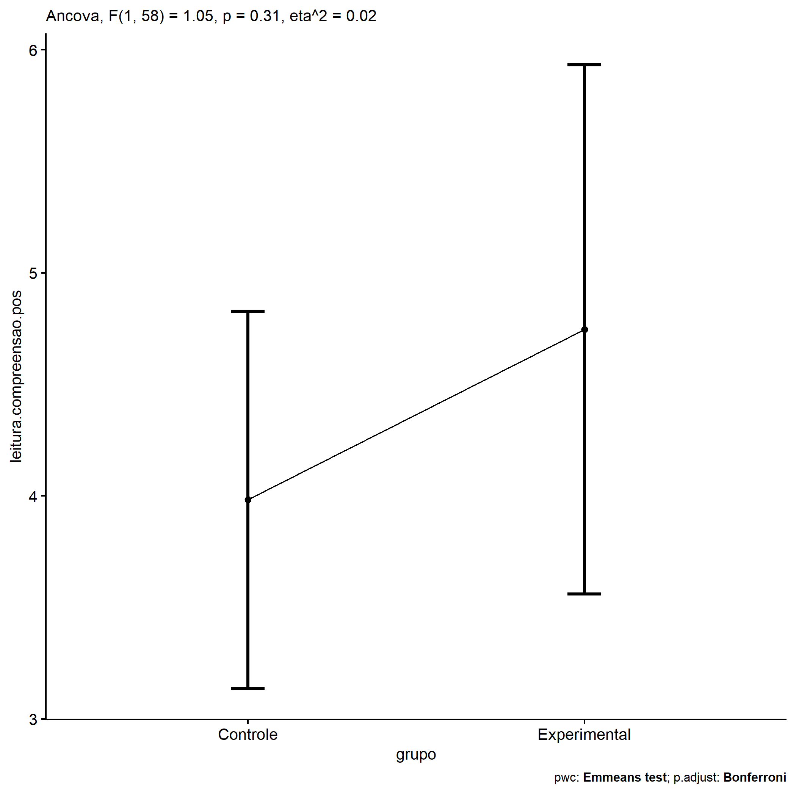<!-- -->

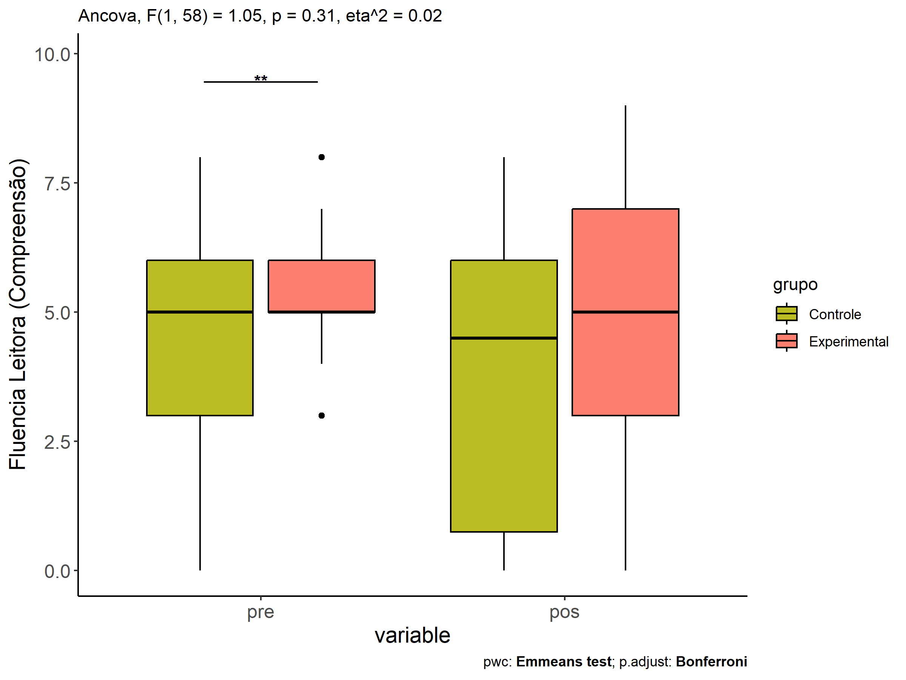<!-- -->

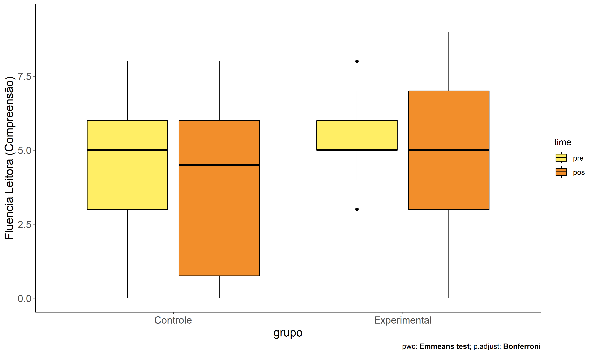<!-- -->

## Pairwise comparisons for two factors

### factores: **grupo:Sexo**

| var                     | grupo        | Sexo |   n | M (pre) | SE (pre) | M (unadj) | SE (unadj) | M (adj) | SE (adj) |
|:------------------------|:-------------|:-----|----:|--------:|---------:|----------:|-----------:|--------:|---------:|
| leitura.compreensao.pos | Controle     | F    |  20 |   4.550 |    0.387 |     3.750 |      0.512 |   3.770 |    0.587 |
| leitura.compreensao.pos | Controle     | M    |  20 |   3.700 |    0.548 |     3.900 |      0.688 |   4.223 |    0.608 |
| leitura.compreensao.pos | Experimental | F    |  11 |   5.364 |    0.411 |     5.636 |      0.607 |   5.367 |    0.802 |
| leitura.compreensao.pos | Experimental | M    |  10 |   5.700 |    0.539 |     4.400 |      1.013 |   4.011 |    0.852 |

| .y.                     | grupo        | Sexo | group1   | group2       | estimate | conf.low | conf.high |    se | statistic |     p | p.adj | p.adj.signif |
|:------------------------|:-------------|:-----|:---------|:-------------|---------:|---------:|----------:|------:|----------:|------:|------:|:-------------|
| leitura.compreensao.pos |              | F    | Controle | Experimental |   -1.597 |   -3.590 |     0.397 | 0.995 |    -1.605 | 0.114 | 0.114 | ns           |
| leitura.compreensao.pos |              | M    | Controle | Experimental |    0.212 |   -1.945 |     2.369 | 1.077 |     0.197 | 0.845 | 0.845 | ns           |
| leitura.compreensao.pre |              | F    | Controle | Experimental |   -0.814 |   -2.276 |     0.649 | 0.730 |    -1.114 | 0.270 | 0.270 | ns           |
| leitura.compreensao.pre |              | M    | Controle | Experimental |   -2.000 |   -3.509 |    -0.491 | 0.754 |    -2.654 | 0.010 | 0.010 | \*           |
| leitura.compreensao.pos | Controle     |      | F        | M            |   -0.453 |   -2.141 |     1.236 | 0.843 |    -0.537 | 0.594 | 0.594 | ns           |
| leitura.compreensao.pos | Experimental |      | F        | M            |    1.356 |   -0.943 |     3.655 | 1.147 |     1.182 | 0.242 | 0.242 | ns           |
| leitura.compreensao.pre | Controle     |      | F        | M            |    0.850 |   -0.382 |     2.082 | 0.615 |     1.381 | 0.173 | 0.173 | ns           |
| leitura.compreensao.pre | Experimental |      | F        | M            |   -0.336 |   -2.039 |     1.366 | 0.850 |    -0.396 | 0.694 | 0.694 | ns           |

| .y.                 | grupo        | Sexo | group1 | group2 | estimate | conf.low | conf.high |    se | statistic |     p | p.adj | p.adj.signif |
|:--------------------|:-------------|:-----|:-------|:-------|---------:|---------:|----------:|------:|----------:|------:|------:|:-------------|
| leitura.compreensao | Controle     | F    | pre    | pos    |    0.800 |   -0.671 |     2.271 | 0.742 |     1.078 | 0.283 | 0.283 | ns           |
| leitura.compreensao | Controle     | M    | pre    | pos    |   -0.200 |   -1.671 |     1.271 | 0.742 |    -0.269 | 0.788 | 0.788 | ns           |
| leitura.compreensao | Experimental | F    | pre    | pos    |   -0.273 |   -2.256 |     1.710 | 1.001 |    -0.272 | 0.786 | 0.786 | ns           |
| leitura.compreensao | Experimental | M    | pre    | pos    |    1.300 |   -0.780 |     3.380 | 1.050 |     1.238 | 0.218 | 0.218 | ns           |

    ## Scale for colour is already present.
    ## Adding another scale for colour, which will replace the existing scale.

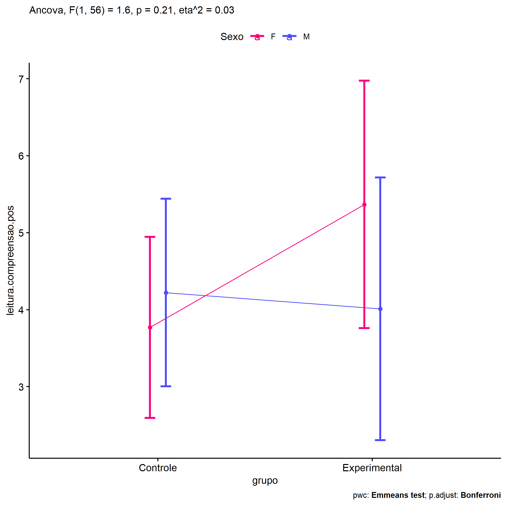<!-- -->

    ## Scale for colour is already present.
    ## Adding another scale for colour, which will replace the existing scale.

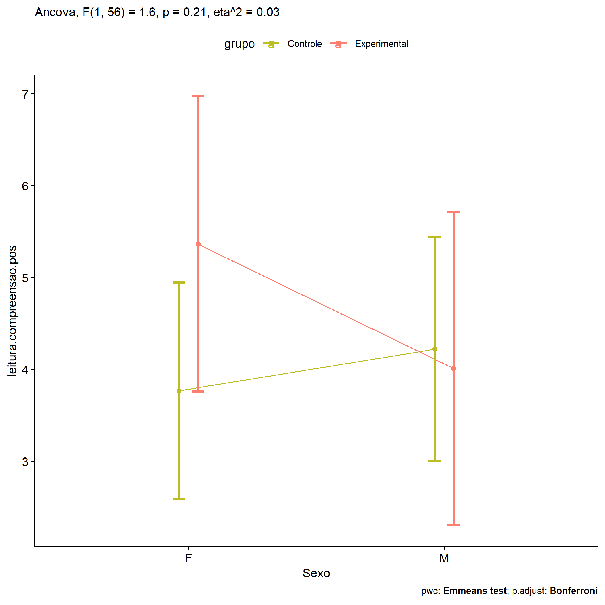<!-- -->

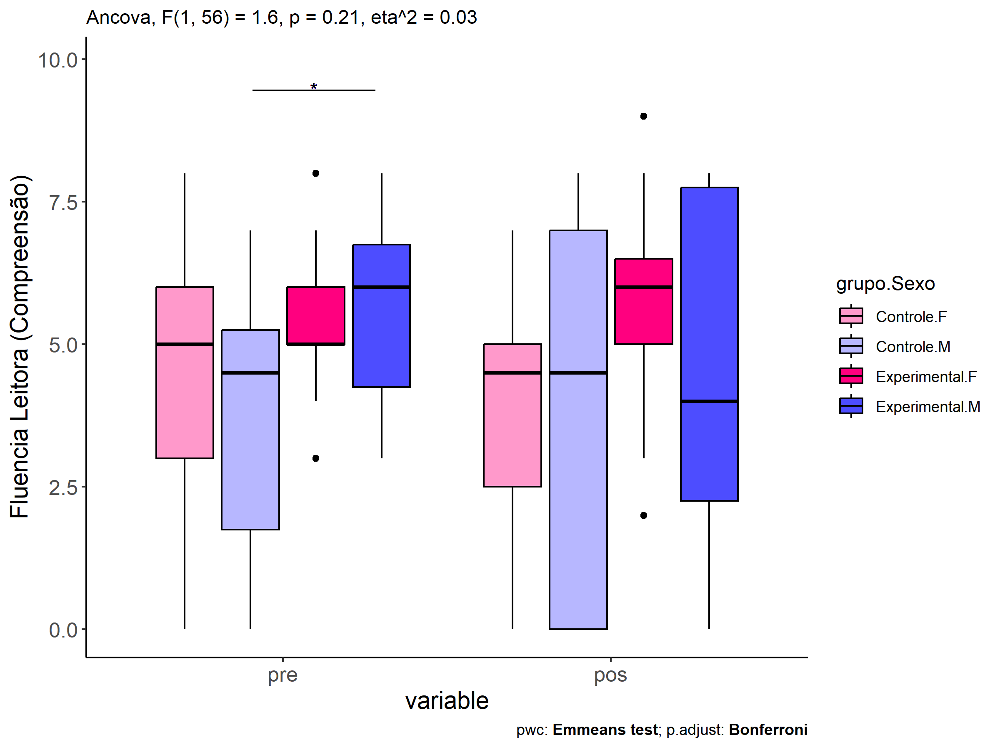<!-- -->

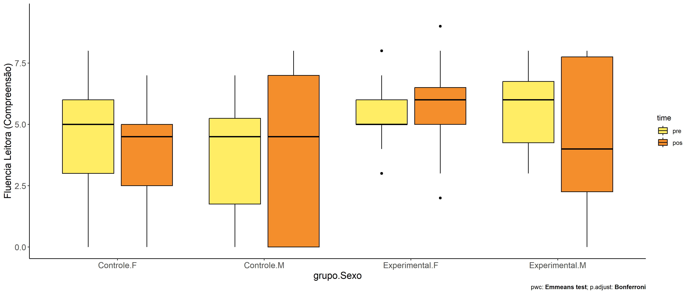<!-- -->

### factores: **grupo:Zona**

| var                     | grupo        | Zona   |   n | M (pre) | SE (pre) | M (unadj) | SE (unadj) | M (adj) | SE (adj) |
|:------------------------|:-------------|:-------|----:|--------:|---------:|----------:|-----------:|--------:|---------:|
| leitura.compreensao.pos | Controle     | Rural  |  28 |   3.964 |    0.419 |     4.393 |      0.440 |   4.587 |    0.438 |
| leitura.compreensao.pos | Controle     | Urbana |   9 |   4.111 |    0.633 |     1.111 |      0.655 |   1.255 |    0.760 |
| leitura.compreensao.pos | Experimental | Rural  |  14 |   5.357 |    0.476 |     5.786 |      0.613 |   5.498 |    0.621 |
| leitura.compreensao.pos | Experimental | Urbana |   6 |   5.833 |    0.307 |     3.833 |      1.249 |   3.381 |    0.950 |

| .y.                     | grupo        | Zona   | group1   | group2       | estimate | conf.low | conf.high |    se | statistic | p       | p.adj   | p.adj.signif |
|:------------------------|:-------------|:-------|:---------|:-------------|---------:|---------:|----------:|------:|----------:|:--------|:--------|:-------------|
| leitura.compreensao.pos |              | Rural  | Controle | Experimental |   -0.911 |   -2.467 |     0.644 | 0.775 |    -1.175 | 0.245   | 0.245   | ns           |
| leitura.compreensao.pos |              | Urbana | Controle | Experimental |   -2.127 |   -4.590 |     0.336 | 1.227 |    -1.733 | 0.089   | 0.089   | ns           |
| leitura.compreensao.pre |              | Rural  | Controle | Experimental |   -1.393 |   -2.687 |    -0.099 | 0.645 |    -2.159 | 0.035   | 0.035   | \*           |
| leitura.compreensao.pre |              | Urbana | Controle | Experimental |   -1.722 |   -3.806 |     0.361 | 1.039 |    -1.658 | 0.103   | 0.103   | ns           |
| leitura.compreensao.pos | Controle     |        | Rural    | Urbana       |    3.333 |    1.586 |     5.079 | 0.870 |     3.829 | \<0.001 | \<0.001 | \*\*\*       |
| leitura.compreensao.pos | Experimental |        | Rural    | Urbana       |    2.117 |   -0.112 |     4.346 | 1.111 |     1.906 | 0.062   | 0.062   | ns           |
| leitura.compreensao.pre | Controle     |        | Rural    | Urbana       |   -0.147 |   -1.662 |     1.368 | 0.755 |    -0.194 | 0.847   | 0.847   | ns           |
| leitura.compreensao.pre | Experimental |        | Rural    | Urbana       |   -0.476 |   -2.405 |     1.453 | 0.962 |    -0.495 | 0.623   | 0.623   | ns           |

| .y.                 | grupo        | Zona   | group1 | group2 | estimate | conf.low | conf.high |    se | statistic |     p | p.adj | p.adj.signif |
|:--------------------|:-------------|:-------|:-------|:-------|---------:|---------:|----------:|------:|----------:|------:|------:|:-------------|
| leitura.compreensao | Controle     | Rural  | pre    | pos    |   -0.429 |   -1.578 |     0.721 | 0.580 |    -0.739 | 0.461 | 0.461 | ns           |
| leitura.compreensao | Controle     | Urbana | pre    | pos    |    3.000 |    0.973 |     5.027 | 1.022 |     2.934 | 0.004 | 0.004 | \*\*         |
| leitura.compreensao | Experimental | Rural  | pre    | pos    |   -0.429 |   -2.054 |     1.197 | 0.820 |    -0.523 | 0.602 | 0.602 | ns           |
| leitura.compreensao | Experimental | Urbana | pre    | pos    |    2.000 |   -0.483 |     4.483 | 1.252 |     1.597 | 0.113 | 0.113 | ns           |

    ## Scale for colour is already present.
    ## Adding another scale for colour, which will replace the existing scale.

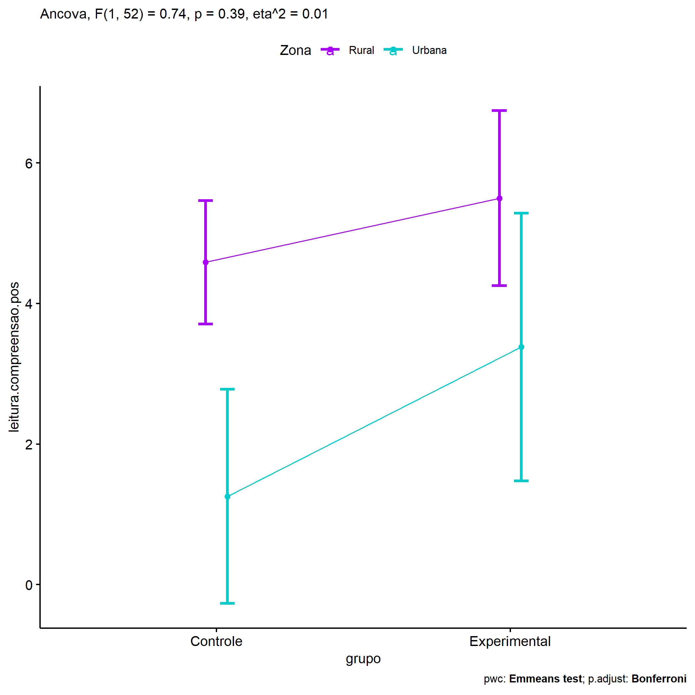<!-- -->

    ## Scale for colour is already present.
    ## Adding another scale for colour, which will replace the existing scale.

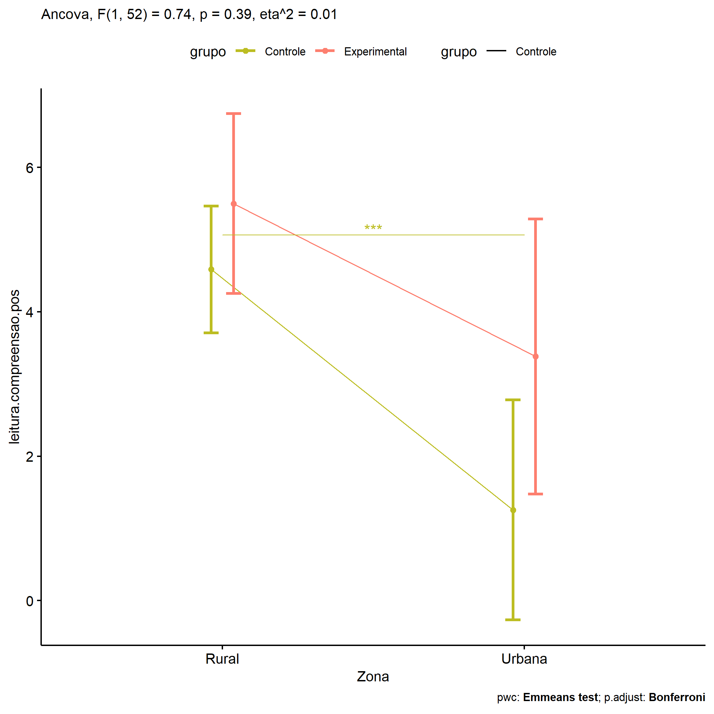<!-- -->

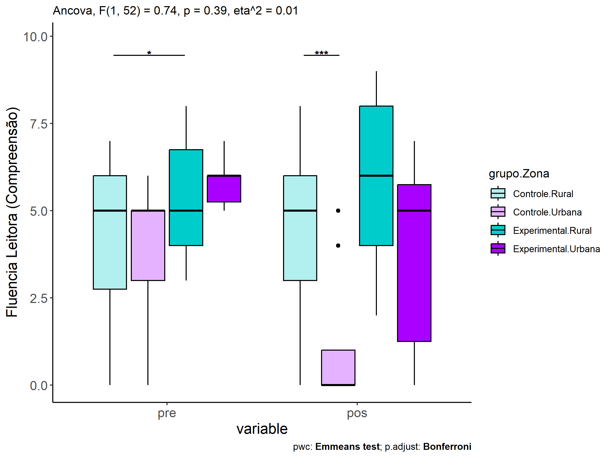<!-- -->

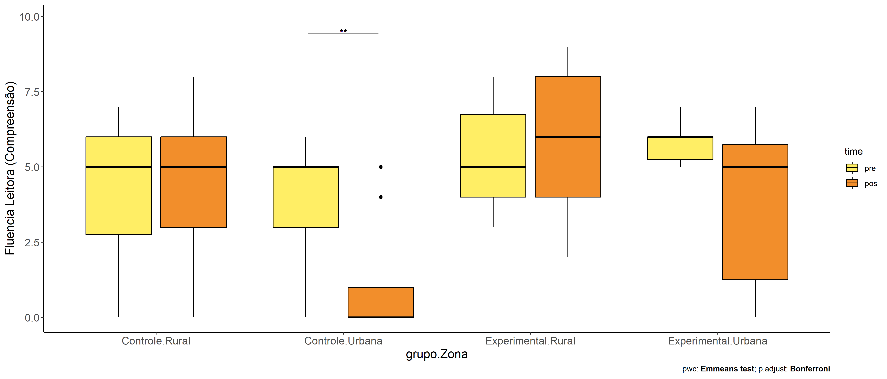<!-- -->

### factores: **grupo:Cor.Raca**

| var                     | grupo        | Cor.Raca |   n | M (pre) | SE (pre) | M (unadj) | SE (unadj) | M (adj) | SE (adj) |
|:------------------------|:-------------|:---------|----:|--------:|---------:|----------:|-----------:|--------:|---------:|
| leitura.compreensao.pos | Controle     | Branca   |   5 |   4.200 |    0.970 |     5.400 |      0.927 |   5.490 |    0.684 |
| leitura.compreensao.pos | Controle     | Parda    |  17 |   4.000 |    0.582 |     4.471 |      0.529 |   4.685 |    0.374 |
| leitura.compreensao.pos | Experimental | Parda    |   7 |   5.286 |    0.606 |     7.000 |      0.577 |   6.414 |    0.592 |

|     | .y.                     | grupo    | Cor.Raca | group1   | group2       | estimate | conf.low | conf.high |    se | statistic |     p | p.adj | p.adj.signif |
|:----|:------------------------|:---------|:---------|:---------|:-------------|---------:|---------:|----------:|------:|----------:|------:|------:|:-------------|
| 2   | leitura.compreensao.pos |          | Parda    | Controle | Experimental |   -1.729 |   -3.189 |    -0.269 | 0.709 |    -2.439 | 0.022 | 0.022 | \*           |
| 4   | leitura.compreensao.pre |          | Parda    | Controle | Experimental |   -1.286 |   -3.320 |     0.748 | 0.990 |    -1.299 | 0.205 | 0.205 | ns           |
| 5   | leitura.compreensao.pos | Controle |          | Branca   | Parda        |    0.805 |   -0.799 |     2.409 | 0.779 |     1.034 | 0.311 | 0.311 | ns           |
| 7   | leitura.compreensao.pre | Controle |          | Branca   | Parda        |    0.200 |   -2.104 |     2.504 | 1.121 |     0.178 | 0.860 | 0.860 | ns           |

| .y.                 | grupo        | Cor.Raca | group1 | group2 | estimate | conf.low | conf.high |    se | statistic |     p | p.adj | p.adj.signif |
|:--------------------|:-------------|:---------|:-------|:-------|---------:|---------:|----------:|------:|----------:|------:|------:|:-------------|
| leitura.compreensao | Controle     | Branca   | pre    | pos    |   -1.200 |   -3.890 |     1.490 | 1.341 |    -0.895 | 0.375 | 0.375 | ns           |
| leitura.compreensao | Controle     | Parda    | pre    | pos    |   -0.471 |   -1.930 |     0.988 | 0.727 |    -0.647 | 0.520 | 0.520 | ns           |
| leitura.compreensao | Experimental | Parda    | pre    | pos    |   -1.714 |   -3.988 |     0.559 | 1.133 |    -1.513 | 0.136 | 0.136 | ns           |

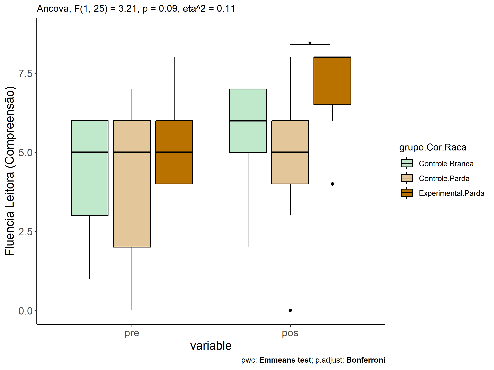<!-- -->

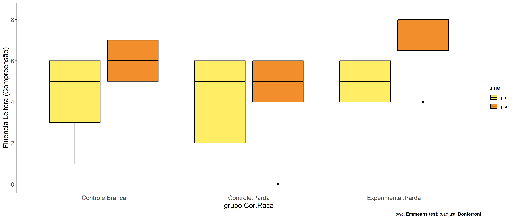<!-- -->

### factores: **grupo:leitura.compreensao.quintile**

| var                     | grupo        | leitura.compreensao.quintile |   n | M (pre) | SE (pre) | M (unadj) | SE (unadj) | M (adj) | SE (adj) |
|:------------------------|:-------------|:-----------------------------|----:|--------:|---------:|----------:|-----------:|--------:|---------:|
| leitura.compreensao.pos | Controle     | 1st quintile                 |   8 |   0.625 |    0.324 |     1.750 |      0.726 |   0.425 |    2.786 |
| leitura.compreensao.pos | Controle     | 2nd quintile                 |   5 |   3.000 |    0.000 |     4.000 |      0.775 |   3.483 |    1.494 |
| leitura.compreensao.pos | Controle     | 3rd quintile                 |  16 |   4.688 |    0.120 |     4.125 |      0.712 |   4.183 |    0.614 |
| leitura.compreensao.pos | Controle     | 4th quintile                 |   8 |   6.000 |    0.000 |     4.125 |      0.972 |   4.629 |    1.322 |
| leitura.compreensao.pos | Experimental | 3rd quintile                 |   9 |   4.667 |    0.167 |     6.556 |      0.556 |   6.606 |    0.810 |
| leitura.compreensao.pos | Experimental | 4th quintile                 |   5 |   6.000 |    0.000 |     1.800 |      0.917 |   2.304 |    1.477 |
| leitura.compreensao.pos | Experimental | 5th quintile                 |   5 |   7.600 |    0.245 |     5.600 |      1.122 |   6.649 |    2.361 |

|     | .y.                     | grupo        | leitura.compreensao.quintile | group1       | group2       | estimate | conf.low | conf.high |    se | statistic | p       | p.adj   | p.adj.signif |
|:----|:------------------------|:-------------|:-----------------------------|:-------------|:-------------|---------:|---------:|----------:|------:|----------:|:--------|:--------|:-------------|
| 3   | leitura.compreensao.pos |              | 3rd quintile                 | Controle     | Experimental |   -2.423 |   -4.443 |    -0.404 | 1.004 |    -2.413 | 0.02    | 0.02    | \*           |
| 4   | leitura.compreensao.pos |              | 4th quintile                 | Controle     | Experimental |    2.325 |   -0.438 |     5.088 | 1.374 |     1.692 | 0.097   | 0.097   | ns           |
| 8   | leitura.compreensao.pre |              | 3rd quintile                 | Controle     | Experimental |    0.021 |   -0.402 |     0.444 | 0.211 |     0.099 | 0.922   | 0.922   | ns           |
| 9   | leitura.compreensao.pre |              | 4th quintile                 | Controle     | Experimental |    0.000 |   -0.579 |     0.579 | 0.288 |     0.000 | 1       | 1       | ns           |
| 11  | leitura.compreensao.pos | Controle     |                              | 1st quintile | 2nd quintile |   -3.058 |   -7.327 |     1.211 | 2.123 |    -1.440 | 0.156   | 0.937   | ns           |
| 12  | leitura.compreensao.pos | Controle     |                              | 1st quintile | 3rd quintile |   -3.758 |   -9.706 |     2.191 | 2.959 |    -1.270 | 0.21    | 1       | ns           |
| 13  | leitura.compreensao.pos | Controle     |                              | 1st quintile | 4th quintile |   -4.204 |  -11.957 |     3.549 | 3.856 |    -1.090 | 0.281   | 1       | ns           |
| 15  | leitura.compreensao.pos | Controle     |                              | 2nd quintile | 3rd quintile |   -0.699 |   -4.092 |     2.694 | 1.687 |    -0.414 | 0.68    | 1       | ns           |
| 16  | leitura.compreensao.pos | Controle     |                              | 2nd quintile | 4th quintile |   -1.146 |   -6.099 |     3.807 | 2.463 |    -0.465 | 0.644   | 1       | ns           |
| 18  | leitura.compreensao.pos | Controle     |                              | 3rd quintile | 4th quintile |   -0.447 |   -3.210 |     2.317 | 1.375 |    -0.325 | 0.747   | 1       | ns           |
| 28  | leitura.compreensao.pos | Experimental |                              | 3rd quintile | 4th quintile |    4.302 |    1.039 |     7.564 | 1.623 |     2.651 | 0.011   | 0.033   | \*           |
| 29  | leitura.compreensao.pos | Experimental |                              | 3rd quintile | 5th quintile |   -0.043 |   -4.886 |     4.801 | 2.409 |    -0.018 | 0.986   | 1       | ns           |
| 30  | leitura.compreensao.pos | Experimental |                              | 4th quintile | 5th quintile |   -4.345 |   -8.113 |    -0.576 | 1.874 |    -2.318 | 0.025   | 0.074   | ns           |
| 31  | leitura.compreensao.pre | Controle     |                              | 1st quintile | 2nd quintile |   -2.375 |   -2.954 |    -1.796 | 0.288 |    -8.244 | \<0.001 | \<0.001 | \*\*\*\*     |
| 32  | leitura.compreensao.pre | Controle     |                              | 1st quintile | 3rd quintile |   -4.062 |   -4.502 |    -3.623 | 0.219 |   -18.566 | \<0.001 | \<0.001 | \*\*\*\*     |
| 33  | leitura.compreensao.pre | Controle     |                              | 1st quintile | 4th quintile |   -5.375 |   -5.883 |    -4.867 | 0.253 |   -21.273 | \<0.001 | \<0.001 | \*\*\*\*     |
| 35  | leitura.compreensao.pre | Controle     |                              | 2nd quintile | 3rd quintile |   -1.688 |   -2.208 |    -1.167 | 0.259 |    -6.518 | \<0.001 | \<0.001 | \*\*\*\*     |
| 36  | leitura.compreensao.pre | Controle     |                              | 2nd quintile | 4th quintile |   -3.000 |   -3.579 |    -2.421 | 0.288 |   -10.414 | \<0.001 | \<0.001 | \*\*\*\*     |
| 38  | leitura.compreensao.pre | Controle     |                              | 3rd quintile | 4th quintile |   -1.312 |   -1.752 |    -0.873 | 0.219 |    -5.998 | \<0.001 | \<0.001 | \*\*\*\*     |
| 48  | leitura.compreensao.pre | Experimental |                              | 3rd quintile | 4th quintile |   -1.333 |   -1.900 |    -0.767 | 0.282 |    -4.730 | \<0.001 | \<0.001 | \*\*\*\*     |
| 49  | leitura.compreensao.pre | Experimental |                              | 3rd quintile | 5th quintile |   -2.933 |   -3.500 |    -2.367 | 0.282 |   -10.407 | \<0.001 | \<0.001 | \*\*\*\*     |
| 50  | leitura.compreensao.pre | Experimental |                              | 4th quintile | 5th quintile |   -1.600 |   -2.242 |    -0.958 | 0.320 |    -5.006 | \<0.001 | \<0.001 | \*\*\*\*     |

| .y.                 | grupo        | leitura.compreensao.quintile | group1 | group2 | estimate | conf.low | conf.high |    se | statistic | p       | p.adj   | p.adj.signif |
|:--------------------|:-------------|:-----------------------------|:-------|:-------|---------:|---------:|----------:|------:|----------:|:--------|:--------|:-------------|
| leitura.compreensao | Controle     | 1st quintile                 | pre    | pos    |   -1.125 |   -2.840 |     0.590 | 0.864 |    -1.302 | 0.196   | 0.196   | ns           |
| leitura.compreensao | Controle     | 2nd quintile                 | pre    | pos    |   -1.000 |   -3.170 |     1.170 | 1.093 |    -0.915 | 0.363   | 0.363   | ns           |
| leitura.compreensao | Controle     | 3rd quintile                 | pre    | pos    |    0.562 |   -0.650 |     1.775 | 0.611 |     0.920 | 0.36    | 0.36    | ns           |
| leitura.compreensao | Controle     | 4th quintile                 | pre    | pos    |    1.875 |    0.160 |     3.590 | 0.864 |     2.169 | 0.032   | 0.032   | \*           |
| leitura.compreensao | Experimental | 3rd quintile                 | pre    | pos    |   -1.889 |   -3.506 |    -0.272 | 0.815 |    -2.318 | 0.023   | 0.023   | \*           |
| leitura.compreensao | Experimental | 4th quintile                 | pre    | pos    |    4.200 |    2.030 |     6.370 | 1.093 |     3.842 | \<0.001 | \<0.001 | \*\*\*       |
| leitura.compreensao | Experimental | 5th quintile                 | pre    | pos    |    2.000 |   -0.170 |     4.170 | 1.093 |     1.829 | 0.07    | 0.07    | ns           |

    ## Scale for colour is already present.
    ## Adding another scale for colour, which will replace the existing scale.

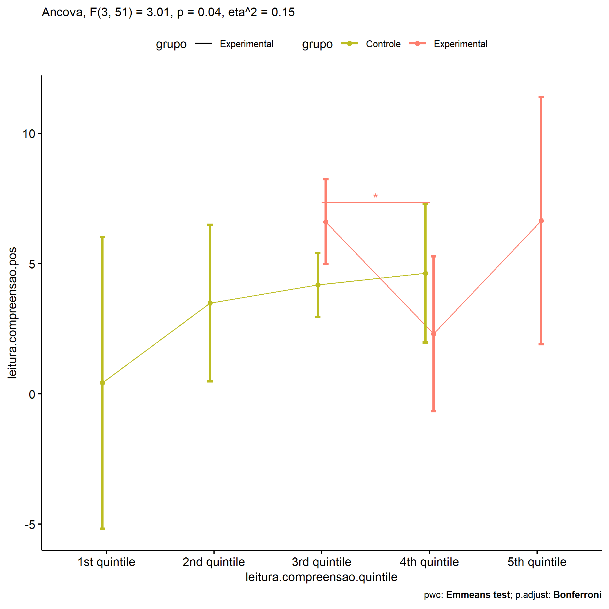<!-- -->

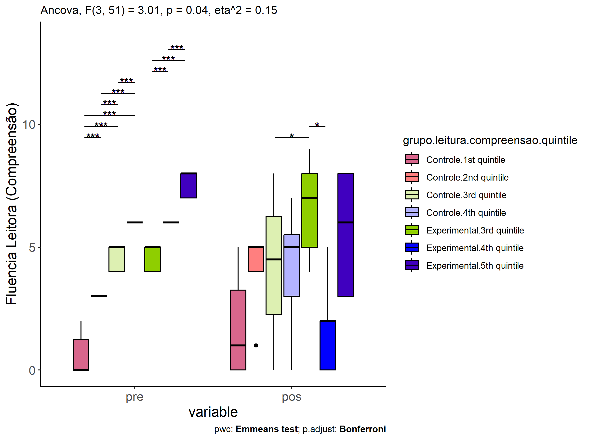<!-- -->

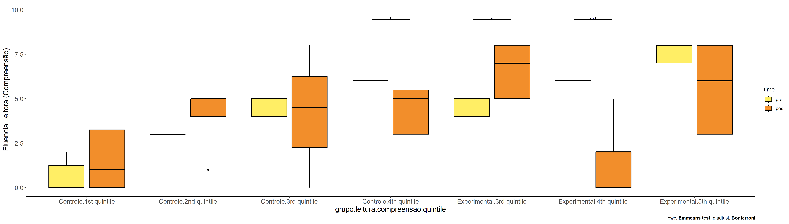<!-- -->
