ANCOVA in Fluencia Leitora (Compreensão) (Fluencia Leitora
(Compreensão))
================
Geiser C. Challco <geiser@alumni.usp.br>

- [Descriptive Statistics of Initial
  Data](#descriptive-statistics-of-initial-data)
- [Checking of Assumptions](#checking-of-assumptions)
  - [Assumption: Normality distribution of
    data](#assumption-normality-distribution-of-data)
  - [Assumption: Homogeneity of data
    distribution](#assumption-homogeneity-of-data-distribution)
- [Computation of ANCOVA test and Pairwise
  Comparison](#computation-of-ancova-test-and-pairwise-comparison)
  - [ANCOVA tests for one factor](#ancova-tests-for-one-factor)
  - [ANCOVA tests for two factors](#ancova-tests-for-two-factors)
  - [Pairwise comparisons for one factor:
    **grupo**](#pairwise-comparisons-for-one-factor-grupo)
  - [Pairwise comparisons for two
    factors](#pairwise-comparisons-for-two-factors)
    - [factores: **grupo:Sexo**](#factores-gruposexo)
    - [factores: **grupo:Zona**](#factores-grupozona)
    - [factores: **grupo:Cor.Raca**](#factores-grupocorraca)
    - [factores:
      **grupo:leitura.compreensao.quintile**](#factores-grupoleituracompreensaoquintile)

**NOTE**

- Teste ANCOVA para determinar se houve diferenças significativas no
  Fluencia Leitora (Compreensão) (medido usando pre- e pos-testes).
- ANCOVA test to determine whether there were significant differences in
  Fluencia Leitora (Compreensão) (measured using pre- and post-tests).

# Descriptive Statistics of Initial Data

| grupo        | Sexo | Zona   | Cor.Raca | leitura.compreensao.quintile | variable                |   n |  mean | median | min | max |    sd |    se |     ci |  iqr |
|:-------------|:-----|:-------|:---------|:-----------------------------|:------------------------|----:|------:|-------:|----:|----:|------:|------:|-------:|-----:|
| Controle     | F    |        |          |                              | leitura.compreensao.pre |  19 | 3.579 |    3.0 |   0 |   8 | 2.567 | 0.589 |  1.237 | 4.00 |
| Controle     | M    |        |          |                              | leitura.compreensao.pre |  22 | 4.136 |    4.0 |   0 |   7 | 2.122 | 0.452 |  0.941 | 2.75 |
| Experimental | F    |        |          |                              | leitura.compreensao.pre |   6 | 5.500 |    5.5 |   5 |   6 | 0.548 | 0.224 |  0.575 | 1.00 |
| Experimental | M    |        |          |                              | leitura.compreensao.pre |  12 | 3.500 |    4.0 |   0 |   7 | 2.111 | 0.609 |  1.341 | 3.00 |
| Controle     | F    |        |          |                              | leitura.compreensao.pos |  19 | 2.947 |    3.0 |   0 |   8 | 3.118 | 0.715 |  1.503 | 5.50 |
| Controle     | M    |        |          |                              | leitura.compreensao.pos |  22 | 2.636 |    1.0 |   0 |   8 | 2.969 | 0.633 |  1.316 | 5.00 |
| Experimental | F    |        |          |                              | leitura.compreensao.pos |   6 | 5.167 |    7.5 |   0 |   8 | 4.021 | 1.641 |  4.220 | 6.25 |
| Experimental | M    |        |          |                              | leitura.compreensao.pos |  12 | 4.417 |    6.0 |   0 |  10 | 4.055 | 1.171 |  2.577 | 7.25 |
| Controle     |      | Rural  |          |                              | leitura.compreensao.pre |  26 | 4.385 |    5.0 |   0 |   8 | 2.316 | 0.454 |  0.936 | 3.00 |
| Controle     |      | Urbana |          |                              | leitura.compreensao.pre |   6 | 2.833 |    3.5 |   0 |   4 | 1.602 | 0.654 |  1.681 | 1.75 |
| Controle     |      |        |          |                              | leitura.compreensao.pre |   9 | 3.111 |    3.0 |   0 |   7 | 2.522 | 0.841 |  1.939 | 3.00 |
| Experimental |      | Rural  |          |                              | leitura.compreensao.pre |  13 | 4.308 |    5.0 |   0 |   7 | 2.097 | 0.582 |  1.267 | 2.00 |
| Experimental |      | Urbana |          |                              | leitura.compreensao.pre |   3 | 4.333 |    5.0 |   2 |   6 | 2.082 | 1.202 |  5.171 | 2.00 |
| Experimental |      |        |          |                              | leitura.compreensao.pre |   2 | 3.000 |    3.0 |   2 |   4 | 1.414 | 1.000 | 12.706 | 1.00 |
| Controle     |      | Rural  |          |                              | leitura.compreensao.pos |  26 | 3.808 |    4.5 |   0 |   8 | 2.994 | 0.587 |  1.209 | 6.00 |
| Controle     |      | Urbana |          |                              | leitura.compreensao.pos |   6 | 0.000 |    0.0 |   0 |   0 | 0.000 | 0.000 |  0.000 | 0.00 |
| Controle     |      |        |          |                              | leitura.compreensao.pos |   9 | 1.667 |    0.0 |   0 |   6 | 2.550 | 0.850 |  1.960 | 4.00 |
| Experimental |      | Rural  |          |                              | leitura.compreensao.pos |  13 | 5.231 |    7.0 |   0 |   9 | 3.700 | 1.026 |  2.236 | 8.00 |
| Experimental |      | Urbana |          |                              | leitura.compreensao.pos |   3 | 0.000 |    0.0 |   0 |   0 | 0.000 | 0.000 |  0.000 | 0.00 |
| Experimental |      |        |          |                              | leitura.compreensao.pos |   2 | 8.000 |    8.0 |   6 |  10 | 2.828 | 2.000 | 25.412 | 2.00 |
| Controle     |      |        | Branca   |                              | leitura.compreensao.pre |   5 | 5.600 |    7.0 |   0 |   8 | 3.209 | 1.435 |  3.985 | 1.00 |
| Controle     |      |        | Indígena |                              | leitura.compreensao.pre |   2 | 4.500 |    4.5 |   4 |   5 | 0.707 | 0.500 |  6.353 | 0.50 |
| Controle     |      |        | Parda    |                              | leitura.compreensao.pre |  22 | 3.364 |    4.0 |   0 |   7 | 2.321 | 0.495 |  1.029 | 3.75 |
| Controle     |      |        | Preta    |                              | leitura.compreensao.pre |   1 | 6.000 |    6.0 |   6 |   6 |       |       |        | 0.00 |
| Controle     |      |        |          |                              | leitura.compreensao.pre |  11 | 3.818 |    3.0 |   1 |   7 | 1.888 | 0.569 |  1.268 | 1.50 |
| Experimental |      |        | Branca   |                              | leitura.compreensao.pre |   4 | 4.250 |    5.0 |   2 |   5 | 1.500 | 0.750 |  2.387 | 0.75 |
| Experimental |      |        | Indígena |                              | leitura.compreensao.pre |   3 | 5.667 |    6.0 |   5 |   6 | 0.577 | 0.333 |  1.434 | 0.50 |
| Experimental |      |        | Parda    |                              | leitura.compreensao.pre |   5 | 2.800 |    2.0 |   0 |   7 | 2.775 | 1.241 |  3.445 | 3.00 |
| Experimental |      |        |          |                              | leitura.compreensao.pre |   6 | 4.500 |    4.5 |   2 |   6 | 1.517 | 0.619 |  1.592 | 1.75 |
| Controle     |      |        | Branca   |                              | leitura.compreensao.pos |   5 | 5.600 |    7.0 |   0 |   8 | 3.209 | 1.435 |  3.985 | 1.00 |
| Controle     |      |        | Indígena |                              | leitura.compreensao.pos |   2 | 5.000 |    5.0 |   5 |   5 | 0.000 | 0.000 |  0.000 | 0.00 |
| Controle     |      |        | Parda    |                              | leitura.compreensao.pos |  22 | 2.773 |    1.0 |   0 |   8 | 3.100 | 0.661 |  1.375 | 5.75 |
| Controle     |      |        | Preta    |                              | leitura.compreensao.pos |   1 | 5.000 |    5.0 |   5 |   5 |       |       |        | 0.00 |
| Controle     |      |        |          |                              | leitura.compreensao.pos |  11 | 0.909 |    0.0 |   0 |   4 | 1.578 | 0.476 |  1.060 | 1.50 |
| Experimental |      |        | Branca   |                              | leitura.compreensao.pos |   4 | 4.000 |    4.0 |   0 |   8 | 4.619 | 2.309 |  7.350 | 8.00 |
| Experimental |      |        | Indígena |                              | leitura.compreensao.pos |   3 | 7.667 |    8.0 |   7 |   8 | 0.577 | 0.333 |  1.434 | 0.50 |
| Experimental |      |        | Parda    |                              | leitura.compreensao.pos |   5 | 3.000 |    0.0 |   0 |   9 | 4.243 | 1.897 |  5.268 | 6.00 |
| Experimental |      |        |          |                              | leitura.compreensao.pos |   6 | 5.000 |    6.5 |   0 |  10 | 4.099 | 1.673 |  4.301 | 5.50 |
| Controle     |      |        |          | 1st quintile                 | leitura.compreensao.pre |  10 | 0.600 |    0.0 |   0 |   2 | 0.843 | 0.267 |  0.603 | 1.00 |
| Controle     |      |        |          | 2nd quintile                 | leitura.compreensao.pre |   7 | 3.000 |    3.0 |   3 |   3 | 0.000 | 0.000 |  0.000 | 0.00 |
| Controle     |      |        |          | 3rd quintile                 | leitura.compreensao.pre |  13 | 4.538 |    5.0 |   4 |   5 | 0.519 | 0.144 |  0.314 | 1.00 |
| Controle     |      |        |          | 4th quintile                 | leitura.compreensao.pre |   5 | 6.000 |    6.0 |   6 |   6 | 0.000 | 0.000 |  0.000 | 0.00 |
| Controle     |      |        |          | 5th quintile                 | leitura.compreensao.pre |   6 | 7.167 |    7.0 |   7 |   8 | 0.408 | 0.167 |  0.428 | 0.00 |
| Experimental |      |        |          | 1st quintile                 | leitura.compreensao.pre |   5 | 1.400 |    2.0 |   0 |   2 | 0.894 | 0.400 |  1.111 | 1.00 |
| Experimental |      |        |          | 3rd quintile                 | leitura.compreensao.pre |   8 | 4.625 |    5.0 |   4 |   5 | 0.518 | 0.183 |  0.433 | 1.00 |
| Experimental |      |        |          | 4th quintile                 | leitura.compreensao.pre |   4 | 6.000 |    6.0 |   6 |   6 | 0.000 | 0.000 |  0.000 | 0.00 |
| Experimental |      |        |          | 5th quintile                 | leitura.compreensao.pre |   1 | 7.000 |    7.0 |   7 |   7 |       |       |        | 0.00 |
| Controle     |      |        |          | 1st quintile                 | leitura.compreensao.pos |  10 | 2.200 |    1.0 |   0 |   7 | 2.616 | 0.827 |  1.872 | 4.00 |
| Controle     |      |        |          | 2nd quintile                 | leitura.compreensao.pos |   7 | 2.000 |    0.0 |   0 |   6 | 2.646 | 1.000 |  2.447 | 4.00 |
| Controle     |      |        |          | 3rd quintile                 | leitura.compreensao.pos |  13 | 1.923 |    0.0 |   0 |   8 | 2.753 | 0.763 |  1.663 | 4.00 |
| Controle     |      |        |          | 4th quintile                 | leitura.compreensao.pos |   5 | 5.200 |    6.0 |   0 |   8 | 3.114 | 1.393 |  3.867 | 2.00 |
| Controle     |      |        |          | 5th quintile                 | leitura.compreensao.pos |   6 | 4.500 |    6.0 |   0 |   8 | 3.564 | 1.455 |  3.740 | 5.25 |
| Experimental |      |        |          | 1st quintile                 | leitura.compreensao.pos |   5 | 3.200 |    0.0 |   0 |  10 | 4.604 | 2.059 |  5.717 | 6.00 |
| Experimental |      |        |          | 3rd quintile                 | leitura.compreensao.pos |   8 | 4.625 |    6.5 |   0 |   8 | 3.889 | 1.375 |  3.251 | 8.00 |
| Experimental |      |        |          | 4th quintile                 | leitura.compreensao.pos |   4 | 5.500 |    7.0 |   0 |   8 | 3.697 | 1.848 |  5.883 | 2.00 |
| Experimental |      |        |          | 5th quintile                 | leitura.compreensao.pos |   1 | 9.000 |    9.0 |   9 |   9 |       |       |        | 0.00 |

# Checking of Assumptions

## Assumption: Normality distribution of data

| var                     |   n |   skewness |   kurtosis | symmetry |  statistic | method       |         p | p.signif | normality |
|:------------------------|----:|-----------:|-----------:|:---------|-----------:|:-------------|----------:|:---------|:----------|
| leitura.compreensao.pos |  59 | -0.0400634 | -1.3904956 | YES      | 26.7003005 | D’Agostino   | 0.0000016 | \*\*\*\* | NO        |
| leitura.compreensao.pos |  48 | -0.5274323 | -0.9829957 | NO       |  0.9113547 | Shapiro-Wilk | 0.0014934 | \*\*     | NO        |
| leitura.compreensao.pos |  42 |  0.1929658 | -1.3162245 | YES      |  0.9327097 | Shapiro-Wilk | 0.0160073 | \*       | NO        |
| leitura.compreensao.pos |  59 |  0.0765092 | -0.9006810 | YES      |  3.2852583 | D’Agostino   | 0.1934707 | ns       | YES       |

## Assumption: Homogeneity of data distribution

| var                     | method         | formula                                        |   n | DFn.df1 | DFd.df2 | statistic |         p | p.signif |
|:------------------------|:---------------|:-----------------------------------------------|----:|--------:|--------:|----------:|----------:|:---------|
| leitura.compreensao.pos | Levene’s test  | `.res`~`grupo`\*`Sexo`                         |  59 |       3 |      55 | 0.6436672 | 0.5902452 | ns       |
| leitura.compreensao.pos | Anova’s slopes | `.res`~`grupo`\*`Sexo`                         |  59 |       3 |      51 | 0.7230000 | 0.5430000 | ns       |
| leitura.compreensao.pos | Levene’s test  | `.res`~`grupo`\*`Zona`                         |  48 |       3 |      44 | 2.4539270 | 0.0757341 | ns       |
| leitura.compreensao.pos | Anova’s slopes | `.res`~`grupo`\*`Zona`                         |  48 |       3 |      40 | 1.0640000 | 0.3750000 | ns       |
| leitura.compreensao.pos | Levene’s test  | `.res`~`grupo`\*`Cor.Raca`                     |  42 |       6 |      35 | 3.1336565 | 0.0145122 | \*       |
| leitura.compreensao.pos | Anova’s slopes | `.res`~`grupo`\*`Cor.Raca`                     |  42 |       5 |      29 | 0.7730000 | 0.5770000 | ns       |
| leitura.compreensao.pos | Levene’s test  | `.res`~`grupo`\*`leitura.compreensao.quintile` |  59 |       8 |      50 | 0.3077164 | 0.9596291 | ns       |
| leitura.compreensao.pos | Anova’s slopes | `.res`~`grupo`\*`leitura.compreensao.quintile` |  59 |       4 |      45 | 0.6960000 | 0.5990000 | ns       |

# Computation of ANCOVA test and Pairwise Comparison

## ANCOVA tests for one factor

|     | Effect                       | DFn | DFd |     SSn |     SSd |      F | p       |   ges | p\<.05 |
|:----|:-----------------------------|----:|----:|--------:|--------:|-------:|:--------|------:|:-------|
| 1   | leitura.compreensao.pre      |   1 |  56 |  42.697 | 582.327 |  4.106 | 0.048   | 0.068 | \*     |
| 2   | grupo                        |   1 |  56 |  39.223 | 582.327 |  3.772 | 0.057   | 0.063 |        |
| 4   | Sexo                         |   1 |  56 |   0.381 | 621.169 |  0.034 | 0.854   | 0.001 |        |
| 6   | Zona                         |   1 |  45 | 110.089 | 383.509 | 12.918 | \<0.001 | 0.223 | \*     |
| 8   | Cor.Raca                     |   3 |  37 |  35.958 | 353.031 |  1.256 | 0.304   | 0.092 |        |
| 10  | leitura.compreensao.quintile |   4 |  53 |  36.135 | 585.415 |  0.818 | 0.52    | 0.058 |        |

## ANCOVA tests for two factors

|     | Effect                             | DFn | DFd |    SSn |     SSd |     F |     p |   ges | p\<.05 |
|:----|:-----------------------------------|----:|----:|-------:|--------:|------:|------:|------:|:-------|
| 1   | leitura.compreensao.pre            |   1 |  54 | 42.340 | 579.448 | 3.946 | 0.052 | 0.068 |        |
| 4   | grupo:Sexo                         |   1 |  54 |  0.920 | 579.448 | 0.086 | 0.771 | 0.002 |        |
| 8   | grupo:Zona                         |   1 |  43 |  6.078 | 364.836 | 0.716 | 0.402 | 0.016 |        |
| 12  | grupo:Cor.Raca                     |   2 |  34 |  7.987 | 344.308 | 0.394 | 0.677 | 0.023 |        |
| 16  | grupo:leitura.compreensao.quintile |   3 |  49 | 15.864 | 527.085 | 0.492 | 0.690 | 0.029 |        |

## Pairwise comparisons for one factor: **grupo**

| var                     | grupo        |   n | M (pre) | SE (pre) | M (unadj) | SE (unadj) | M (adj) | SE (adj) |
|:------------------------|:-------------|----:|--------:|---------:|----------:|-----------:|--------:|---------:|
| leitura.compreensao.pos | Controle     |  41 |   3.878 |    0.363 |     2.780 |      0.469 |   2.815 |    0.504 |
| leitura.compreensao.pos | Experimental |  18 |   4.167 |    0.466 |     4.667 |      0.929 |   4.589 |    0.761 |

| .y.                     | group1   | group2       | estimate | conf.low | conf.high |    se | statistic |     p | p.adj | p.adj.signif |
|:------------------------|:---------|:-------------|---------:|---------:|----------:|------:|----------:|------:|------:|:-------------|
| leitura.compreensao.pos | Controle | Experimental |   -1.774 |   -3.604 |     0.056 | 0.913 |    -1.942 | 0.057 | 0.057 | ns           |
| leitura.compreensao.pre | Controle | Experimental |   -0.289 |   -1.550 |     0.973 | 0.630 |    -0.458 | 0.649 | 0.649 | ns           |

| .y.                 | grupo        | group1 | group2 | estimate | conf.low | conf.high |    se | statistic |     p | p.adj | p.adj.signif |
|:--------------------|:-------------|:-------|:-------|---------:|---------:|----------:|------:|----------:|------:|------:|:-------------|
| leitura.compreensao | Controle     | pre    | pos    |    1.098 |   -0.137 |     2.332 | 0.623 |     1.761 | 0.081 | 0.081 | ns           |
| leitura.compreensao | Experimental | pre    | pos    |   -0.500 |   -2.364 |     1.364 | 0.941 |    -0.532 | 0.596 | 0.596 | ns           |

    ## Scale for colour is already present.
    ## Adding another scale for colour, which will replace the existing scale.

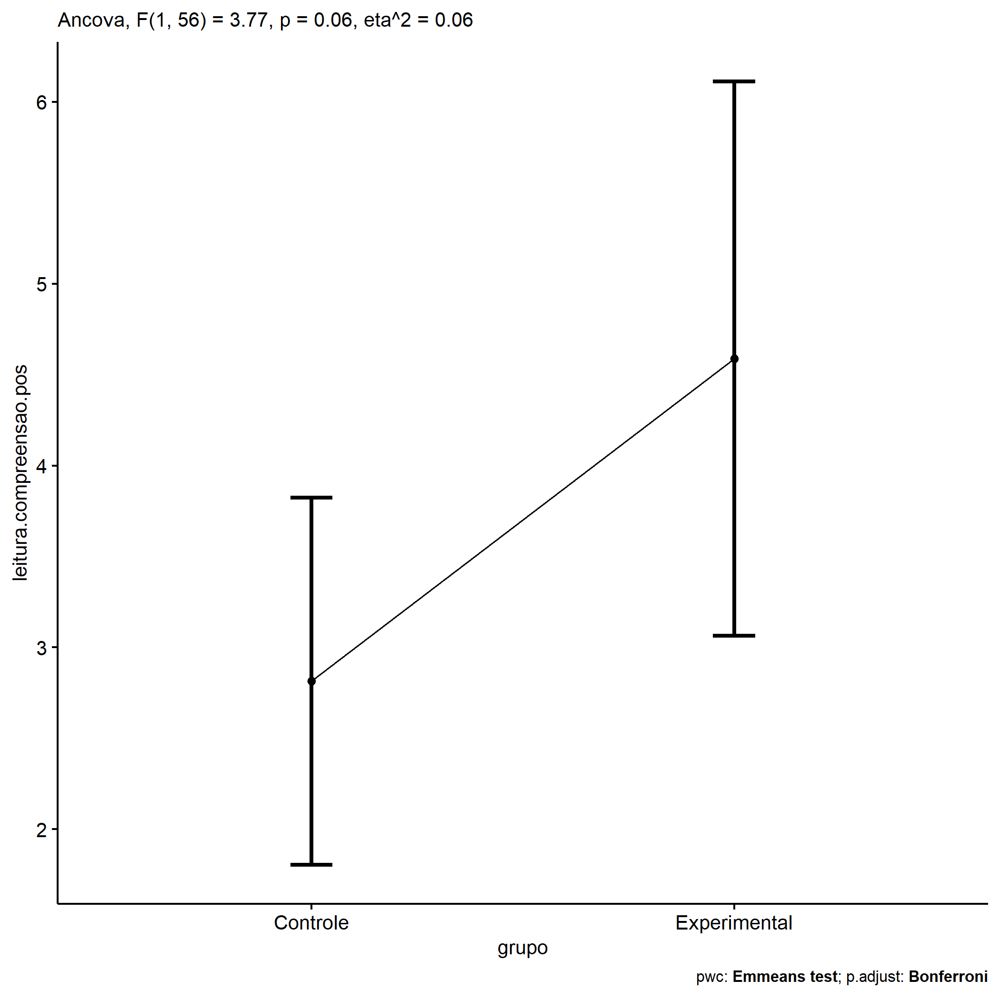<!-- -->

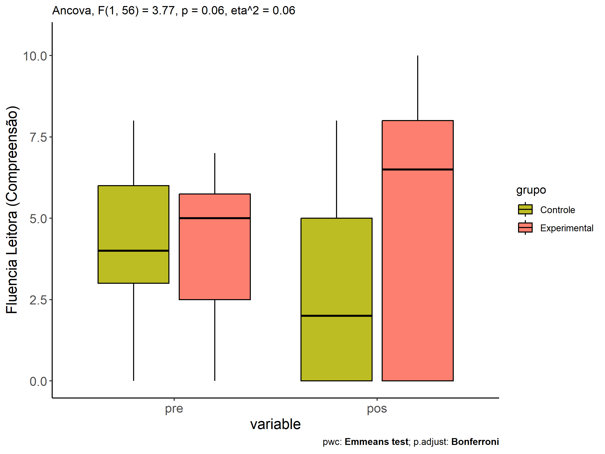<!-- -->

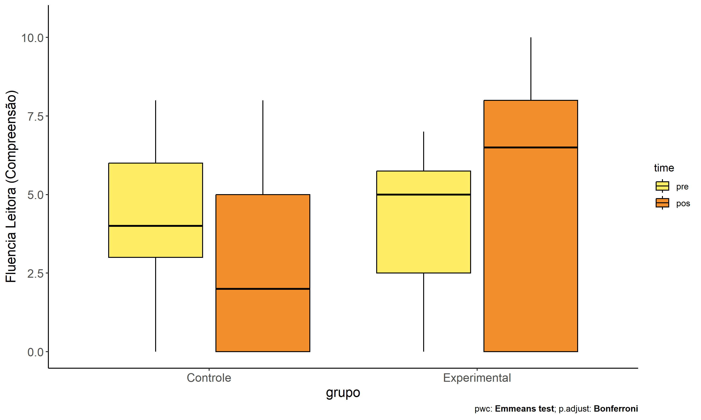<!-- -->

## Pairwise comparisons for two factors

### factores: **grupo:Sexo**

| var                     | grupo        | Sexo |   n | M (pre) | SE (pre) | M (unadj) | SE (unadj) | M (adj) | SE (adj) |
|:------------------------|:-------------|:-----|----:|--------:|---------:|----------:|-----------:|--------:|---------:|
| leitura.compreensao.pos | Controle     | F    |  19 |   3.579 |    0.589 |     2.947 |      0.715 |   3.102 |    0.756 |
| leitura.compreensao.pos | Controle     | M    |  22 |   4.136 |    0.452 |     2.636 |      0.633 |   2.568 |    0.699 |
| leitura.compreensao.pos | Experimental | F    |   6 |   5.500 |    0.224 |     5.167 |      1.641 |   4.552 |    1.373 |
| leitura.compreensao.pos | Experimental | M    |  12 |   3.500 |    0.609 |     4.417 |      1.171 |   4.603 |    0.950 |

| .y.                     | grupo        | Sexo | group1   | group2       | estimate | conf.low | conf.high |    se | statistic |     p | p.adj | p.adj.signif |
|:------------------------|:-------------|:-----|:---------|:-------------|---------:|---------:|----------:|------:|----------:|------:|------:|:-------------|
| leitura.compreensao.pos |              | F    | Controle | Experimental |   -1.450 |   -4.622 |     1.723 | 1.582 |    -0.916 | 0.364 | 0.364 | ns           |
| leitura.compreensao.pos |              | M    | Controle | Experimental |   -2.035 |   -4.406 |     0.336 | 1.183 |    -1.721 | 0.091 | 0.091 | ns           |
| leitura.compreensao.pre |              | F    | Controle | Experimental |   -1.921 |   -3.976 |     0.134 | 1.025 |    -1.873 | 0.066 | 0.066 | ns           |
| leitura.compreensao.pre |              | M    | Controle | Experimental |    0.636 |   -0.938 |     2.211 | 0.786 |     0.810 | 0.422 | 0.422 | ns           |
| leitura.compreensao.pos | Controle     |      | F        | M            |    0.534 |   -1.535 |     2.604 | 1.032 |     0.518 | 0.607 | 0.607 | ns           |
| leitura.compreensao.pos | Experimental |      | F        | M            |   -0.051 |   -3.433 |     3.331 | 1.687 |    -0.030 | 0.976 | 0.976 | ns           |
| leitura.compreensao.pre | Controle     |      | F        | M            |   -0.557 |   -1.932 |     0.817 | 0.686 |    -0.813 | 0.420 | 0.420 | ns           |
| leitura.compreensao.pre | Experimental |      | F        | M            |    2.000 |   -0.194 |     4.194 | 1.095 |     1.827 | 0.073 | 0.073 | ns           |

| .y.                 | grupo        | Sexo | group1 | group2 | estimate | conf.low | conf.high |    se | statistic |     p | p.adj | p.adj.signif |
|:--------------------|:-------------|:-----|:-------|:-------|---------:|---------:|----------:|------:|----------:|------:|------:|:-------------|
| leitura.compreensao | Controle     | F    | pre    | pos    |    0.632 |   -1.193 |     2.456 | 0.921 |     0.686 | 0.494 | 0.494 | ns           |
| leitura.compreensao | Controle     | M    | pre    | pos    |    1.500 |   -0.195 |     3.195 | 0.855 |     1.753 | 0.082 | 0.082 | ns           |
| leitura.compreensao | Experimental | F    | pre    | pos    |    0.333 |   -2.913 |     3.580 | 1.638 |     0.203 | 0.839 | 0.839 | ns           |
| leitura.compreensao | Experimental | M    | pre    | pos    |   -0.917 |   -3.212 |     1.379 | 1.158 |    -0.791 | 0.430 | 0.430 | ns           |

    ## Scale for colour is already present.
    ## Adding another scale for colour, which will replace the existing scale.

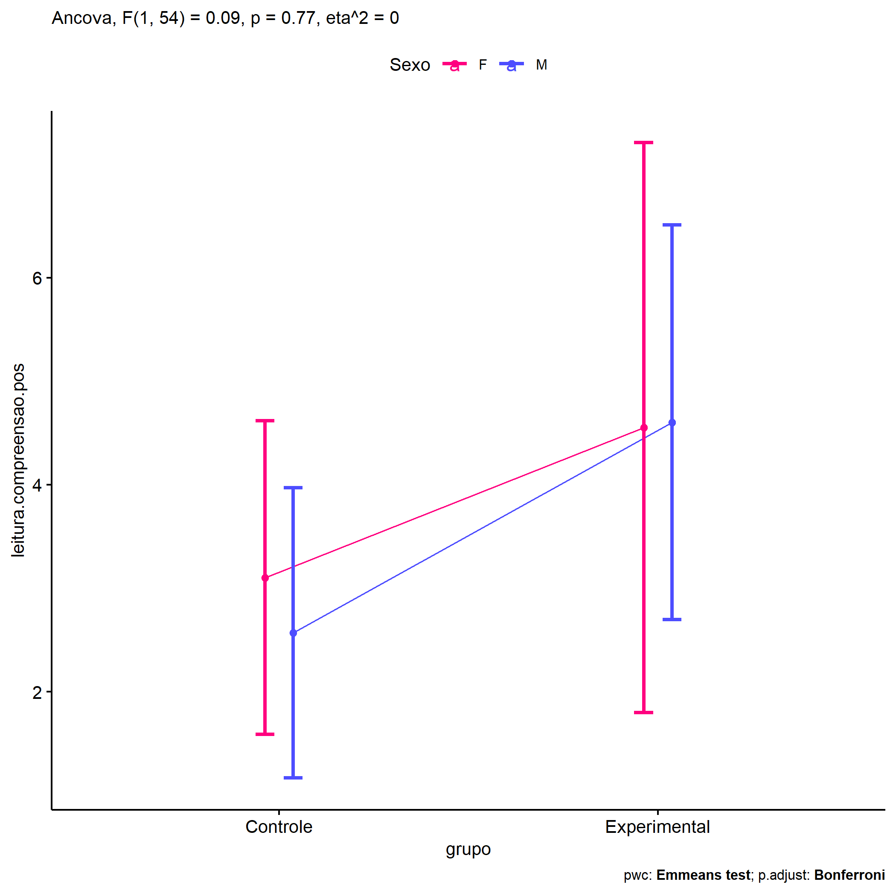<!-- -->

    ## Scale for colour is already present.
    ## Adding another scale for colour, which will replace the existing scale.

<!-- -->

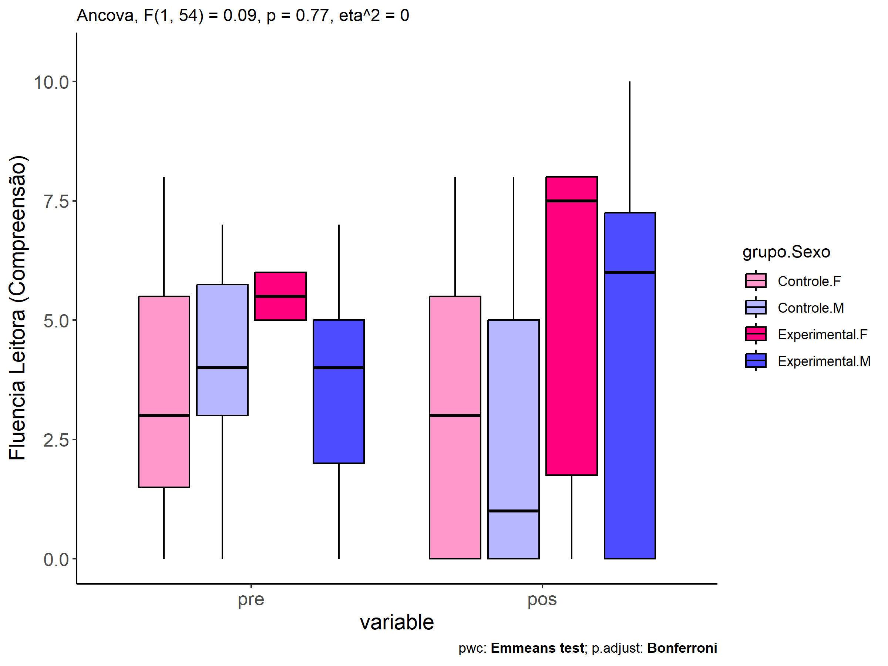<!-- -->

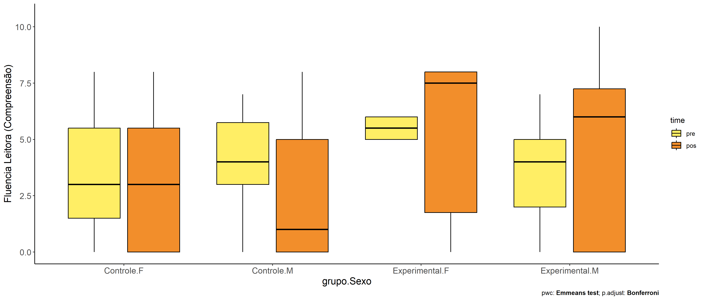<!-- -->

### factores: **grupo:Zona**

| var                     | grupo        | Zona   |   n | M (pre) | SE (pre) | M (unadj) | SE (unadj) | M (adj) | SE (adj) |
|:------------------------|:-------------|:-------|----:|--------:|---------:|----------:|-----------:|--------:|---------:|
| leitura.compreensao.pos | Controle     | Rural  |  26 |   4.385 |    0.454 |     3.808 |      0.587 |   3.727 |    0.586 |
| leitura.compreensao.pos | Controle     | Urbana |   6 |   2.833 |    0.654 |     0.000 |      0.000 |   0.463 |    1.248 |
| leitura.compreensao.pos | Experimental | Rural  |  13 |   4.308 |    0.582 |     5.231 |      1.026 |   5.177 |    0.827 |

|     | .y.                     | grupo    | Zona  | group1   | group2       | estimate | conf.low | conf.high |    se | statistic |     p | p.adj | p.adj.signif |
|:----|:------------------------|:---------|:------|:---------|:-------------|---------:|---------:|----------:|------:|----------:|------:|------:|:-------------|
| 1   | leitura.compreensao.pos |          | Rural | Controle | Experimental |   -1.450 |   -3.494 |     0.594 | 1.012 |    -1.433 | 0.159 | 0.159 | ns           |
| 3   | leitura.compreensao.pre |          | Rural | Controle | Experimental |    0.077 |   -1.418 |     1.572 | 0.741 |     0.104 | 0.918 | 0.918 | ns           |
| 5   | leitura.compreensao.pos | Controle |       | Rural    | Urbana       |    3.264 |    0.461 |     6.068 | 1.388 |     2.351 | 0.024 | 0.024 | \*           |
| 7   | leitura.compreensao.pre | Controle |       | Rural    | Urbana       |    1.551 |   -0.442 |     3.545 | 0.988 |     1.571 | 0.124 | 0.124 | ns           |

| .y.                 | grupo        | Zona   | group1 | group2 | estimate | conf.low | conf.high |    se | statistic |     p | p.adj | p.adj.signif |
|:--------------------|:-------------|:-------|:-------|:-------|---------:|---------:|----------:|------:|----------:|------:|------:|:-------------|
| leitura.compreensao | Controle     | Rural  | pre    | pos    |    0.577 |   -0.882 |     2.036 | 0.734 |     0.786 | 0.434 | 0.434 | ns           |
| leitura.compreensao | Controle     | Urbana | pre    | pos    |    2.833 |   -0.205 |     5.871 | 1.528 |     1.855 | 0.067 | 0.067 | ns           |
| leitura.compreensao | Experimental | Rural  | pre    | pos    |   -0.923 |   -2.987 |     1.141 | 1.038 |    -0.889 | 0.376 | 0.376 | ns           |

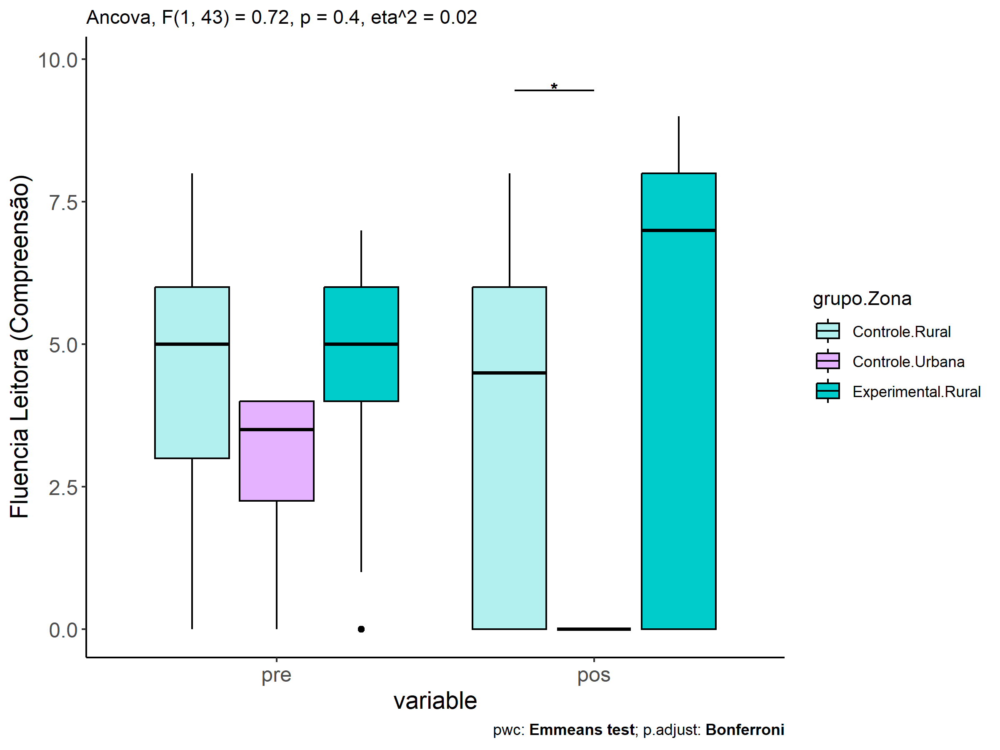<!-- -->

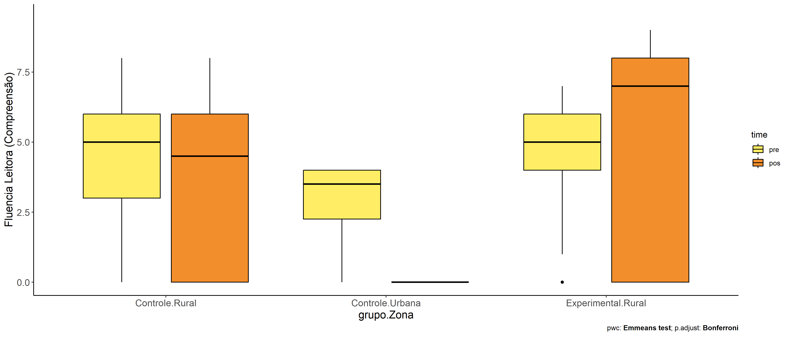<!-- -->

### factores: **grupo:Cor.Raca**

| var                     | grupo        | Cor.Raca |   n | M (pre) | SE (pre) | M (unadj) | SE (unadj) | M (adj) | SE (adj) |
|:------------------------|:-------------|:---------|----:|--------:|---------:|----------:|-----------:|--------:|---------:|
| leitura.compreensao.pos | Controle     | Branca   |   5 |   5.600 |    1.435 |     5.600 |      1.435 |   4.842 |    1.507 |
| leitura.compreensao.pos | Controle     | Parda    |  22 |   3.364 |    0.495 |     2.773 |      0.661 |   2.873 |    0.686 |
| leitura.compreensao.pos | Experimental | Parda    |   5 |   2.800 |    1.241 |     3.000 |      1.897 |   3.317 |    1.447 |

|     | .y.                     | grupo    | Cor.Raca | group1   | group2       | estimate | conf.low | conf.high |    se | statistic |     p | p.adj | p.adj.signif |
|:----|:------------------------|:---------|:---------|:---------|:-------------|---------:|---------:|----------:|------:|----------:|------:|------:|:-------------|
| 2   | leitura.compreensao.pos |          | Parda    | Controle | Experimental |   -0.444 |   -3.709 |     2.822 | 1.594 |    -0.278 | 0.783 | 0.783 | ns           |
| 4   | leitura.compreensao.pre |          | Parda    | Controle | Experimental |    0.564 |   -1.996 |     3.124 | 1.252 |     0.450 | 0.656 | 0.656 | ns           |
| 5   | leitura.compreensao.pos | Controle |          | Branca   | Parda        |    1.969 |   -1.459 |     5.397 | 1.674 |     1.177 | 0.249 | 0.249 | ns           |
| 7   | leitura.compreensao.pre | Controle |          | Branca   | Parda        |    2.236 |   -0.324 |     4.796 | 1.252 |     1.787 | 0.084 | 0.084 | ns           |

| .y.                 | grupo        | Cor.Raca | group1 | group2 | estimate | conf.low | conf.high |    se | statistic |     p | p.adj | p.adj.signif |
|:--------------------|:-------------|:---------|:-------|:-------|---------:|---------:|----------:|------:|----------:|------:|------:|:-------------|
| leitura.compreensao | Controle     | Branca   | pre    | pos    |    0.000 |   -3.718 |     3.718 | 1.857 |     0.000 | 1.000 | 1.000 | ns           |
| leitura.compreensao | Controle     | Parda    | pre    | pos    |    0.591 |   -1.181 |     2.363 | 0.885 |     0.667 | 0.507 | 0.507 | ns           |
| leitura.compreensao | Experimental | Parda    | pre    | pos    |   -0.200 |   -3.918 |     3.518 | 1.857 |    -0.108 | 0.915 | 0.915 | ns           |

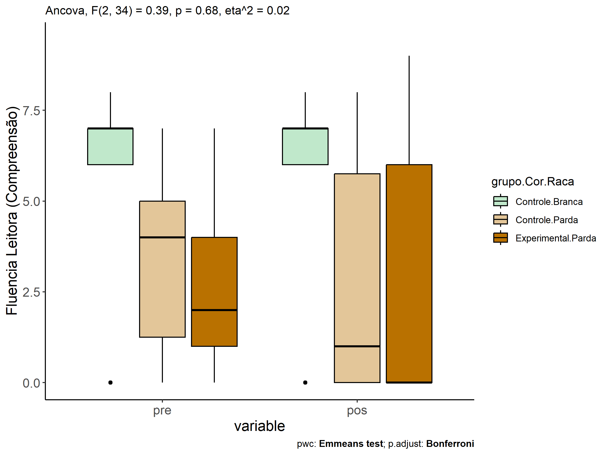<!-- -->

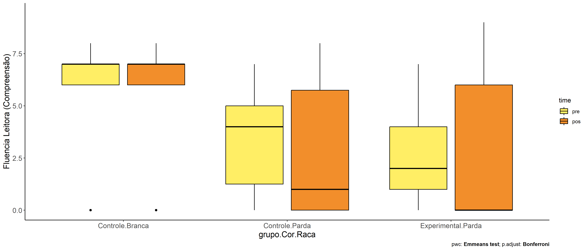<!-- -->

### factores: **grupo:leitura.compreensao.quintile**

| var                     | grupo        | leitura.compreensao.quintile |   n | M (pre) | SE (pre) | M (unadj) | SE (unadj) | M (adj) | SE (adj) |
|:------------------------|:-------------|:-----------------------------|----:|--------:|---------:|----------:|-----------:|--------:|---------:|
| leitura.compreensao.pos | Controle     | 1st quintile                 |  10 |   0.600 |    0.267 |     2.200 |      0.827 |   1.247 |    2.801 |
| leitura.compreensao.pos | Controle     | 2nd quintile                 |   7 |   3.000 |    0.000 |     2.000 |      1.000 |   1.771 |    1.379 |
| leitura.compreensao.pos | Controle     | 3rd quintile                 |  13 |   4.538 |    0.144 |     1.923 |      0.763 |   2.158 |    1.107 |
| leitura.compreensao.pos | Controle     | 4th quintile                 |   5 |   6.000 |    0.000 |     5.200 |      1.393 |   5.876 |    2.351 |
| leitura.compreensao.pos | Controle     | 5th quintile                 |   6 |   7.167 |    0.167 |     4.500 |      1.455 |   5.528 |    3.108 |
| leitura.compreensao.pos | Experimental | 1st quintile                 |   5 |   1.400 |    0.400 |     3.200 |      2.059 |   2.488 |    2.429 |
| leitura.compreensao.pos | Experimental | 3rd quintile                 |   8 |   4.625 |    0.183 |     4.625 |      1.375 |   4.886 |    1.353 |

|     | .y.                     | grupo        | leitura.compreensao.quintile | group1       | group2       | estimate | conf.low | conf.high |    se | statistic | p       | p.adj   | p.adj.signif |
|:----|:------------------------|:-------------|:-----------------------------|:-------------|:-------------|---------:|---------:|----------:|------:|----------:|:--------|:--------|:-------------|
| 1   | leitura.compreensao.pos |              | 1st quintile                 | Controle     | Experimental |   -1.241 |   -5.063 |     2.581 | 1.899 |    -0.654 | 0.517   | 0.517   | ns           |
| 3   | leitura.compreensao.pos |              | 3rd quintile                 | Controle     | Experimental |   -2.728 |   -5.672 |     0.216 | 1.462 |    -1.865 | 0.069   | 0.069   | ns           |
| 6   | leitura.compreensao.pre |              | 1st quintile                 | Controle     | Experimental |   -0.800 |   -1.434 |    -0.166 | 0.315 |    -2.540 | 0.014   | 0.014   | \*           |
| 8   | leitura.compreensao.pre |              | 3rd quintile                 | Controle     | Experimental |   -0.087 |   -0.606 |     0.433 | 0.258 |    -0.335 | 0.739   | 0.739   | ns           |
| 11  | leitura.compreensao.pos | Controle     |                              | 1st quintile | 2nd quintile |   -0.524 |   -5.649 |     4.601 | 2.546 |    -0.206 | 0.838   | 1       | ns           |
| 12  | leitura.compreensao.pos | Controle     |                              | 1st quintile | 3rd quintile |   -0.911 |   -8.004 |     6.182 | 3.524 |    -0.258 | 0.797   | 1       | ns           |
| 13  | leitura.compreensao.pos | Controle     |                              | 1st quintile | 4th quintile |   -4.629 |  -14.282 |     5.025 | 4.796 |    -0.965 | 0.34    | 1       | ns           |
| 14  | leitura.compreensao.pos | Controle     |                              | 1st quintile | 5th quintile |   -4.280 |  -15.692 |     7.131 | 5.669 |    -0.755 | 0.454   | 1       | ns           |
| 15  | leitura.compreensao.pos | Controle     |                              | 2nd quintile | 3rd quintile |   -0.387 |   -4.378 |     3.604 | 1.983 |    -0.195 | 0.846   | 1       | ns           |
| 16  | leitura.compreensao.pos | Controle     |                              | 2nd quintile | 4th quintile |   -4.105 |  -10.388 |     2.178 | 3.121 |    -1.315 | 0.195   | 1       | ns           |
| 17  | leitura.compreensao.pos | Controle     |                              | 2nd quintile | 5th quintile |   -3.757 |  -11.573 |     4.059 | 3.883 |    -0.967 | 0.338   | 1       | ns           |
| 18  | leitura.compreensao.pos | Controle     |                              | 3rd quintile | 4th quintile |   -3.718 |   -7.930 |     0.494 | 2.093 |    -1.777 | 0.082   | 0.822   | ns           |
| 19  | leitura.compreensao.pos | Controle     |                              | 3rd quintile | 5th quintile |   -3.370 |   -8.797 |     2.058 | 2.697 |    -1.250 | 0.218   | 1       | ns           |
| 20  | leitura.compreensao.pos | Controle     |                              | 4th quintile | 5th quintile |    0.348 |   -4.062 |     4.758 | 2.191 |     0.159 | 0.874   | 1       | ns           |
| 22  | leitura.compreensao.pos | Experimental |                              | 1st quintile | 3rd quintile |   -2.398 |   -8.922 |     4.127 | 3.241 |    -0.740 | 0.463   | 0.463   | ns           |
| 31  | leitura.compreensao.pre | Controle     |                              | 1st quintile | 2nd quintile |   -2.400 |   -2.970 |    -1.830 | 0.283 |    -8.470 | \<0.001 | \<0.001 | \*\*\*\*     |
| 32  | leitura.compreensao.pre | Controle     |                              | 1st quintile | 3rd quintile |   -3.938 |   -4.425 |    -3.452 | 0.242 |   -16.284 | \<0.001 | \<0.001 | \*\*\*\*     |
| 33  | leitura.compreensao.pre | Controle     |                              | 1st quintile | 4th quintile |   -5.400 |   -6.034 |    -4.766 | 0.315 |   -17.146 | \<0.001 | \<0.001 | \*\*\*\*     |
| 34  | leitura.compreensao.pre | Controle     |                              | 1st quintile | 5th quintile |   -6.567 |   -7.164 |    -5.969 | 0.297 |   -22.115 | \<0.001 | \<0.001 | \*\*\*\*     |
| 35  | leitura.compreensao.pre | Controle     |                              | 2nd quintile | 3rd quintile |   -1.538 |   -2.081 |    -0.996 | 0.270 |    -5.707 | \<0.001 | \<0.001 | \*\*\*\*     |
| 36  | leitura.compreensao.pre | Controle     |                              | 2nd quintile | 4th quintile |   -3.000 |   -3.677 |    -2.323 | 0.337 |    -8.910 | \<0.001 | \<0.001 | \*\*\*\*     |
| 37  | leitura.compreensao.pre | Controle     |                              | 2nd quintile | 5th quintile |   -4.167 |   -4.810 |    -3.523 | 0.320 |   -13.025 | \<0.001 | \<0.001 | \*\*\*\*     |
| 38  | leitura.compreensao.pre | Controle     |                              | 3rd quintile | 4th quintile |   -1.462 |   -2.070 |    -0.853 | 0.303 |    -4.830 | \<0.001 | \<0.001 | \*\*\*       |
| 39  | leitura.compreensao.pre | Controle     |                              | 3rd quintile | 5th quintile |   -2.628 |   -3.199 |    -2.057 | 0.284 |    -9.261 | \<0.001 | \<0.001 | \*\*\*\*     |
| 40  | leitura.compreensao.pre | Controle     |                              | 4th quintile | 5th quintile |   -1.167 |   -1.867 |    -0.466 | 0.348 |    -3.351 | 0.002   | 0.016   | \*           |
| 42  | leitura.compreensao.pre | Experimental |                              | 1st quintile | 3rd quintile |   -3.225 |   -3.884 |    -2.566 | 0.328 |    -9.838 | \<0.001 | \<0.001 | \*\*\*\*     |

| .y.                 | grupo        | leitura.compreensao.quintile | group1 | group2 | estimate | conf.low | conf.high |    se | statistic |     p | p.adj | p.adj.signif |
|:--------------------|:-------------|:-----------------------------|:-------|:-------|---------:|---------:|----------:|------:|----------:|------:|------:|:-------------|
| leitura.compreensao | Controle     | 1st quintile                 | pre    | pos    |   -1.600 |   -3.654 |     0.454 | 1.035 |    -1.547 | 0.125 | 0.125 | ns           |
| leitura.compreensao | Controle     | 2nd quintile                 | pre    | pos    |    1.000 |   -1.455 |     3.455 | 1.237 |     0.809 | 0.421 | 0.421 | ns           |
| leitura.compreensao | Controle     | 3rd quintile                 | pre    | pos    |    2.615 |    0.814 |     4.417 | 0.907 |     2.882 | 0.005 | 0.005 | \*\*         |
| leitura.compreensao | Controle     | 4th quintile                 | pre    | pos    |    0.800 |   -2.105 |     3.705 | 1.463 |     0.547 | 0.586 | 0.586 | ns           |
| leitura.compreensao | Controle     | 5th quintile                 | pre    | pos    |    2.667 |    0.015 |     5.319 | 1.336 |     1.997 | 0.049 | 0.049 | \*           |
| leitura.compreensao | Experimental | 1st quintile                 | pre    | pos    |   -1.800 |   -4.705 |     1.105 | 1.463 |    -1.230 | 0.222 | 0.222 | ns           |
| leitura.compreensao | Experimental | 3rd quintile                 | pre    | pos    |    0.000 |   -2.297 |     2.297 | 1.157 |     0.000 | 1.000 | 1.000 | ns           |

    ## Scale for colour is already present.
    ## Adding another scale for colour, which will replace the existing scale.

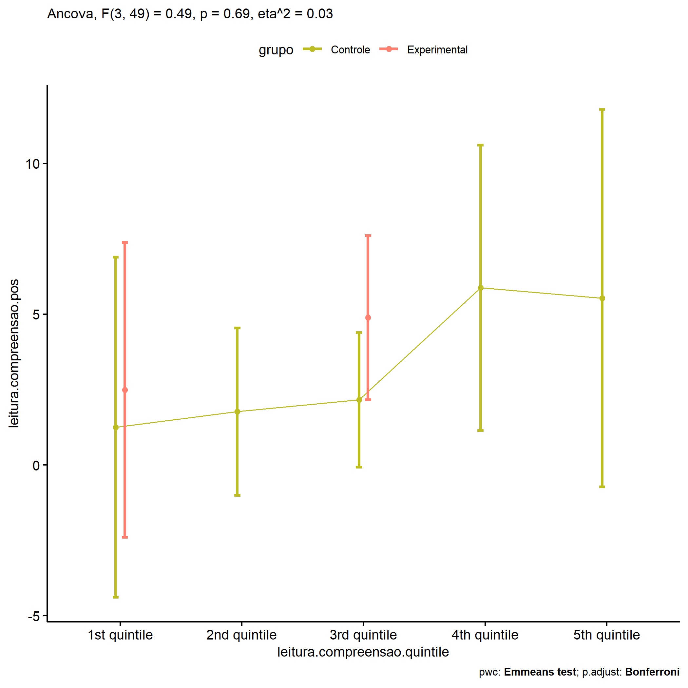<!-- -->

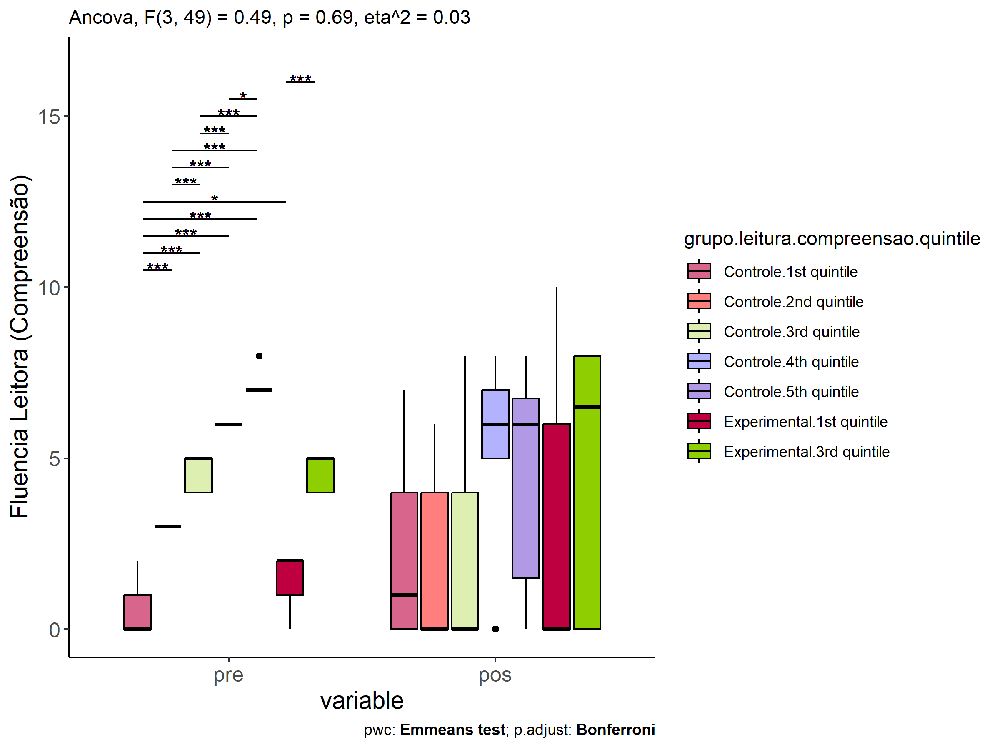<!-- -->

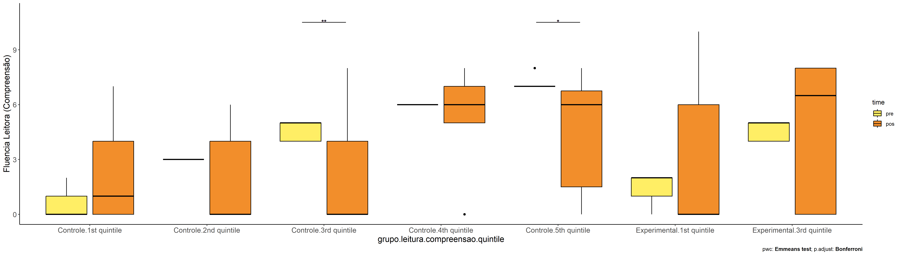<!-- -->
