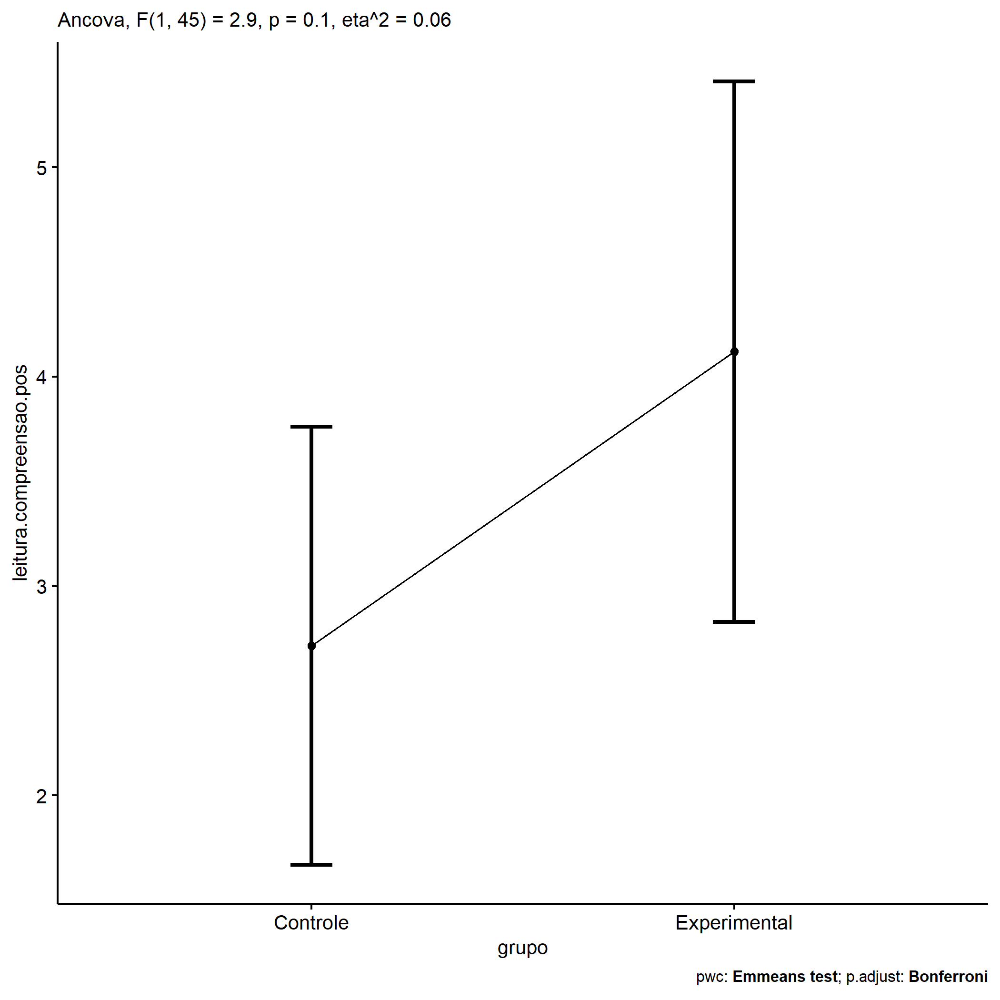
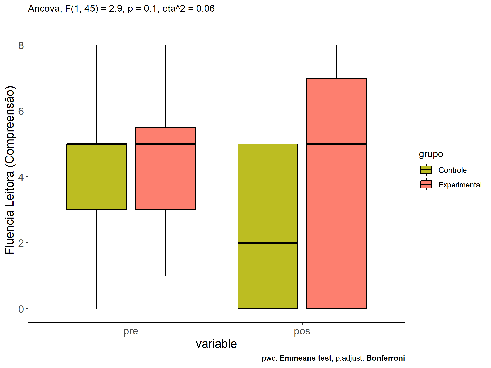
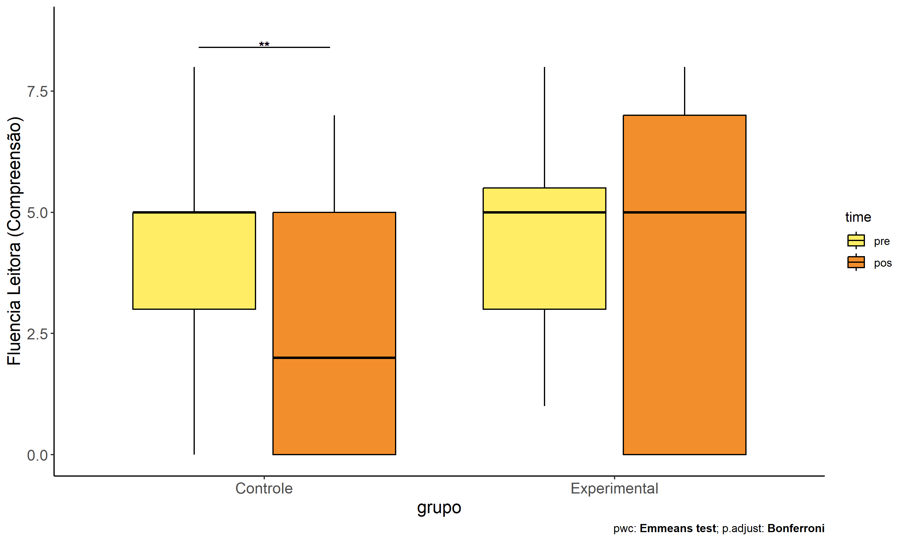
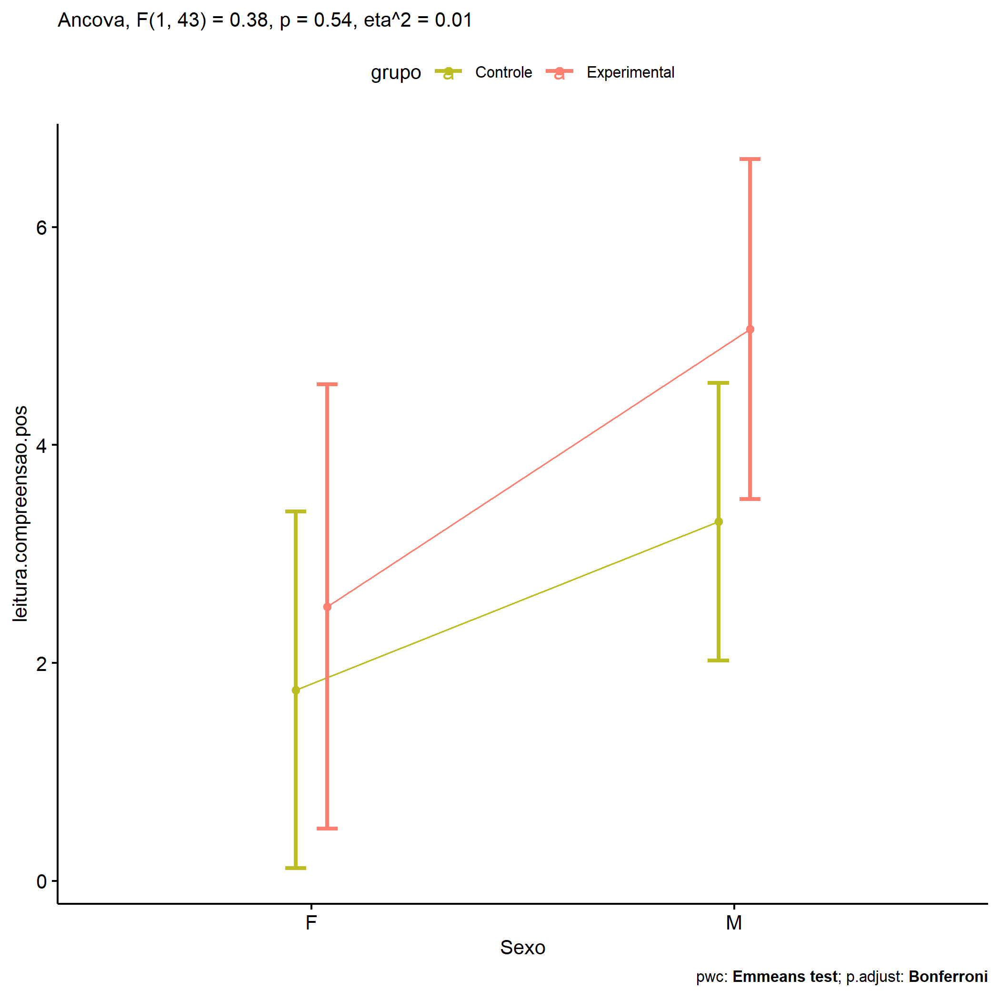
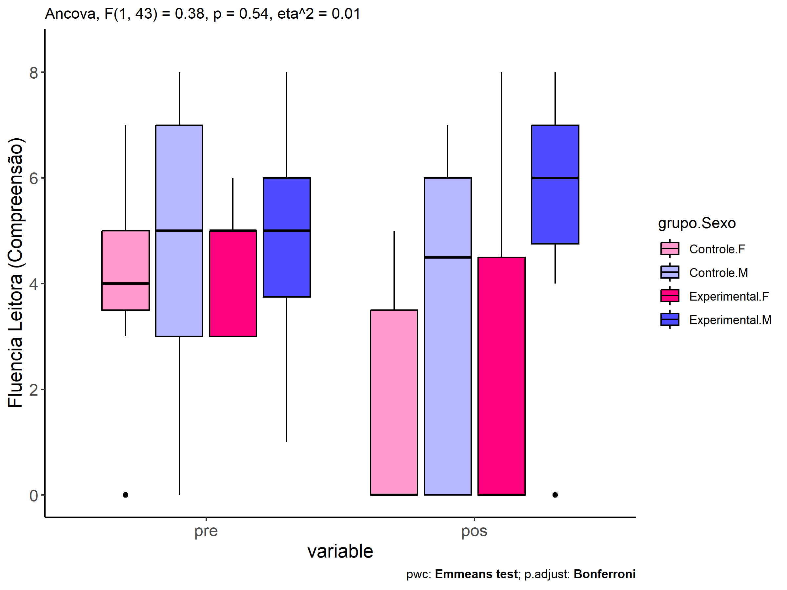
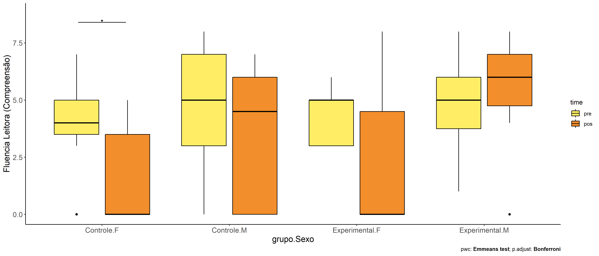
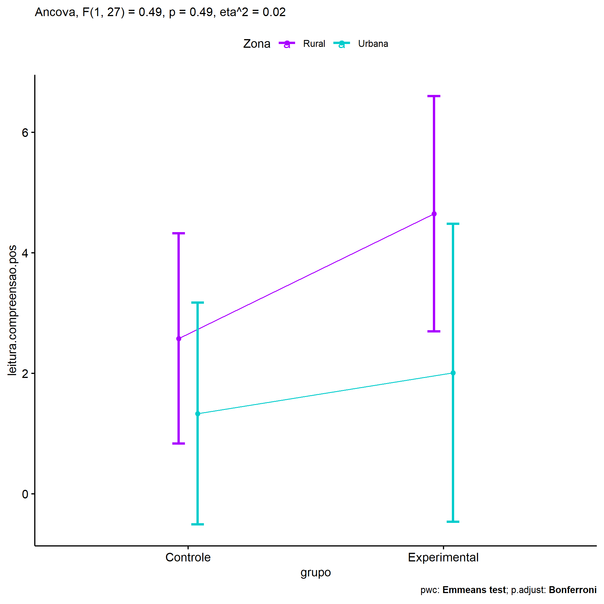
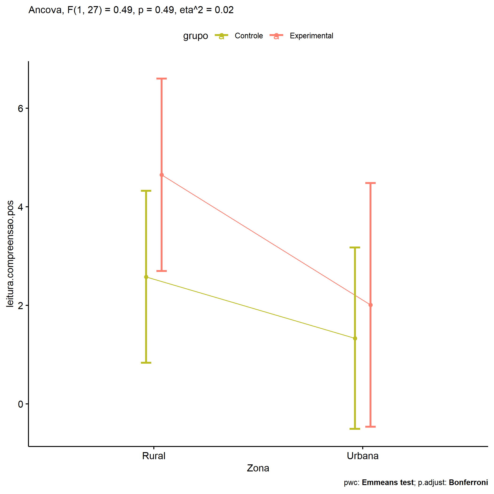
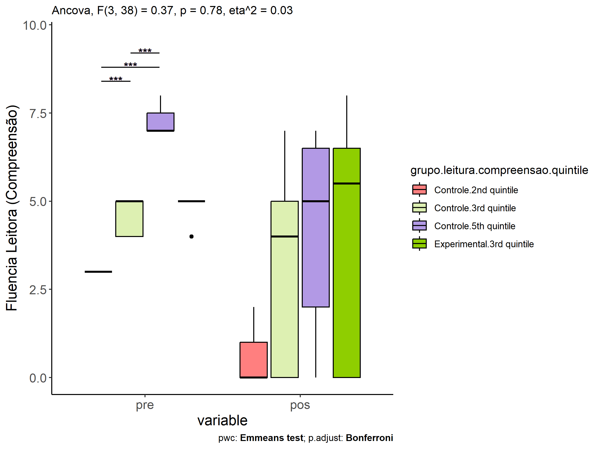
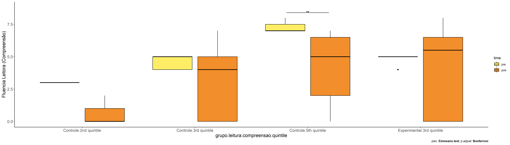

ANCOVA in Fluencia Leitora (Compreensão) (Fluencia Leitora
(Compreensão))
================
Geiser C. Challco <geiser@alumni.usp.br>

- [Descriptive Statistics of Initial
  Data](#descriptive-statistics-of-initial-data)
- [Checking of Assumptions](#checking-of-assumptions)
  - [Assumption: Normality distribution of
    data](#assumption-normality-distribution-of-data)
  - [Assumption: Homogeneity of data
    distribution](#assumption-homogeneity-of-data-distribution)
- [Computation of ANCOVA test and Pairwise
  Comparison](#computation-of-ancova-test-and-pairwise-comparison)
  - [ANCOVA tests for one factor](#ancova-tests-for-one-factor)
  - [ANCOVA tests for two factors](#ancova-tests-for-two-factors)
  - [Pairwise comparisons for one factor:
    **grupo**](#pairwise-comparisons-for-one-factor-grupo)
  - [Pairwise comparisons for two
    factors](#pairwise-comparisons-for-two-factors)
    - [factores: **grupo:Sexo**](#factores-gruposexo)
    - [factores: **grupo:Zona**](#factores-grupozona)
    - [factores: **grupo:Cor.Raca**](#factores-grupocorraca)
    - [factores:
      **grupo:leitura.compreensao.quintile**](#factores-grupoleituracompreensaoquintile)

**NOTE**

- Teste ANCOVA para determinar se houve diferenças significativas no
  Fluencia Leitora (Compreensão) (medido usando pre- e pos-testes).
- ANCOVA test to determine whether there were significant differences in
  Fluencia Leitora (Compreensão) (measured using pre- and post-tests).

# Descriptive Statistics of Initial Data

| grupo        | Sexo | Zona   | Cor.Raca | leitura.compreensao.quintile | variable                |   n |  mean | median | min | max |    sd |    se |     ci |  iqr |
|:-------------|:-----|:-------|:---------|:-----------------------------|:------------------------|----:|------:|-------:|----:|----:|------:|------:|-------:|-----:|
| Controle     | F    |        |          |                              | leitura.compreensao.pre |  11 | 4.000 |    4.0 |   0 |   7 | 1.732 | 0.522 |  1.164 | 1.50 |
| Controle     | M    |        |          |                              | leitura.compreensao.pre |  18 | 4.722 |    5.0 |   0 |   8 | 2.372 | 0.559 |  1.179 | 4.00 |
| Experimental | F    |        |          |                              | leitura.compreensao.pre |   7 | 4.286 |    5.0 |   3 |   6 | 1.254 | 0.474 |  1.159 | 2.00 |
| Experimental | M    |        |          |                              | leitura.compreensao.pre |  12 | 4.750 |    5.0 |   1 |   8 | 2.006 | 0.579 |  1.274 | 2.25 |
| Controle     | F    |        |          |                              | leitura.compreensao.pos |  11 | 1.545 |    0.0 |   0 |   5 | 2.207 | 0.666 |  1.483 | 3.50 |
| Controle     | M    |        |          |                              | leitura.compreensao.pos |  18 | 3.389 |    4.5 |   0 |   7 | 2.913 | 0.687 |  1.449 | 6.00 |
| Experimental | F    |        |          |                              | leitura.compreensao.pos |   7 | 2.429 |    0.0 |   0 |   8 | 3.359 | 1.270 |  3.107 | 4.50 |
| Experimental | M    |        |          |                              | leitura.compreensao.pos |  12 | 5.167 |    6.0 |   0 |   8 | 2.657 | 0.767 |  1.688 | 2.25 |
| Controle     |      | Rural  |          |                              | leitura.compreensao.pre |  10 | 4.600 |    4.5 |   2 |   7 | 1.897 | 0.600 |  1.357 | 3.50 |
| Controle     |      | Urbana |          |                              | leitura.compreensao.pre |   9 | 4.889 |    5.0 |   3 |   7 | 1.453 | 0.484 |  1.117 | 1.00 |
| Controle     |      |        |          |                              | leitura.compreensao.pre |  10 | 3.900 |    4.0 |   0 |   8 | 2.885 | 0.912 |  2.064 | 3.25 |
| Experimental |      | Rural  |          |                              | leitura.compreensao.pre |   8 | 4.875 |    5.0 |   1 |   8 | 2.100 | 0.743 |  1.756 | 1.50 |
| Experimental |      | Urbana |          |                              | leitura.compreensao.pre |   5 | 4.400 |    5.0 |   3 |   6 | 1.342 | 0.600 |  1.666 | 2.00 |
| Experimental |      |        |          |                              | leitura.compreensao.pre |   6 | 4.333 |    4.5 |   2 |   7 | 1.751 | 0.715 |  1.838 | 1.75 |
| Controle     |      | Rural  |          |                              | leitura.compreensao.pos |  10 | 2.500 |    1.0 |   0 |   7 | 2.953 | 0.934 |  2.113 | 5.50 |
| Controle     |      | Urbana |          |                              | leitura.compreensao.pos |   9 | 1.444 |    0.0 |   0 |   7 | 2.651 | 0.884 |  2.038 | 1.00 |
| Controle     |      |        |          |                              | leitura.compreensao.pos |  10 | 4.000 |    5.0 |   0 |   7 | 2.357 | 0.745 |  1.686 | 1.75 |
| Experimental |      | Rural  |          |                              | leitura.compreensao.pos |   8 | 4.750 |    6.0 |   0 |   8 | 3.151 | 1.114 |  2.634 | 4.00 |
| Experimental |      | Urbana |          |                              | leitura.compreensao.pos |   5 | 1.800 |    0.0 |   0 |   6 | 2.683 | 1.200 |  3.332 | 3.00 |
| Experimental |      |        |          |                              | leitura.compreensao.pos |   6 | 5.333 |    6.0 |   0 |   8 | 2.875 | 1.174 |  3.017 | 2.00 |
| Controle     |      |        | Branca   |                              | leitura.compreensao.pre |   1 | 0.000 |    0.0 |   0 |   0 |       |       |        | 0.00 |
| Controle     |      |        | Parda    |                              | leitura.compreensao.pre |  11 | 4.818 |    5.0 |   0 |   8 | 2.272 | 0.685 |  1.527 | 1.50 |
| Controle     |      |        |          |                              | leitura.compreensao.pre |  17 | 4.471 |    4.0 |   1 |   8 | 1.875 | 0.455 |  0.964 | 2.00 |
| Experimental |      |        | Branca   |                              | leitura.compreensao.pre |   1 | 5.000 |    5.0 |   5 |   5 |       |       |        | 0.00 |
| Experimental |      |        | Indígena |                              | leitura.compreensao.pre |   1 | 3.000 |    3.0 |   3 |   3 |       |       |        | 0.00 |
| Experimental |      |        | Parda    |                              | leitura.compreensao.pre |   5 | 5.400 |    5.0 |   3 |   8 | 1.817 | 0.812 |  2.256 | 1.00 |
| Experimental |      |        |          |                              | leitura.compreensao.pre |  12 | 4.333 |    5.0 |   1 |   7 | 1.775 | 0.512 |  1.128 | 2.25 |
| Controle     |      |        | Branca   |                              | leitura.compreensao.pos |   1 | 0.000 |    0.0 |   0 |   0 |       |       |        | 0.00 |
| Controle     |      |        | Parda    |                              | leitura.compreensao.pos |  11 | 3.364 |    4.0 |   0 |   7 | 2.908 | 0.877 |  1.953 | 5.50 |
| Controle     |      |        |          |                              | leitura.compreensao.pos |  17 | 2.412 |    1.0 |   0 |   7 | 2.717 | 0.659 |  1.397 | 5.00 |
| Experimental |      |        | Branca   |                              | leitura.compreensao.pos |   1 | 8.000 |    8.0 |   8 |   8 |       |       |        | 0.00 |
| Experimental |      |        | Indígena |                              | leitura.compreensao.pos |   1 | 7.000 |    7.0 |   7 |   7 |       |       |        | 0.00 |
| Experimental |      |        | Parda    |                              | leitura.compreensao.pos |   5 | 5.000 |    6.0 |   0 |   8 | 3.162 | 1.414 |  3.926 | 3.00 |
| Experimental |      |        |          |                              | leitura.compreensao.pos |  12 | 3.250 |    4.0 |   0 |   7 | 3.049 | 0.880 |  1.937 | 6.00 |
| Controle     |      |        |          | 1st quintile                 | leitura.compreensao.pre |   4 | 0.750 |    0.5 |   0 |   2 | 0.957 | 0.479 |  1.523 | 1.25 |
| Controle     |      |        |          | 2nd quintile                 | leitura.compreensao.pre |   5 | 3.000 |    3.0 |   3 |   3 | 0.000 | 0.000 |  0.000 | 0.00 |
| Controle     |      |        |          | 3rd quintile                 | leitura.compreensao.pre |  13 | 4.615 |    5.0 |   4 |   5 | 0.506 | 0.140 |  0.306 | 1.00 |
| Controle     |      |        |          | 5th quintile                 | leitura.compreensao.pre |   7 | 7.286 |    7.0 |   7 |   8 | 0.488 | 0.184 |  0.451 | 0.50 |
| Experimental |      |        |          | 1st quintile                 | leitura.compreensao.pre |   2 | 1.500 |    1.5 |   1 |   2 | 0.707 | 0.500 |  6.353 | 0.50 |
| Experimental |      |        |          | 2nd quintile                 | leitura.compreensao.pre |   4 | 3.000 |    3.0 |   3 |   3 | 0.000 | 0.000 |  0.000 | 0.00 |
| Experimental |      |        |          | 3rd quintile                 | leitura.compreensao.pre |   8 | 4.875 |    5.0 |   4 |   5 | 0.354 | 0.125 |  0.296 | 0.00 |
| Experimental |      |        |          | 4th quintile                 | leitura.compreensao.pre |   3 | 6.000 |    6.0 |   6 |   6 | 0.000 | 0.000 |  0.000 | 0.00 |
| Experimental |      |        |          | 5th quintile                 | leitura.compreensao.pre |   2 | 7.500 |    7.5 |   7 |   8 | 0.707 | 0.500 |  6.353 | 0.50 |
| Controle     |      |        |          | 1st quintile                 | leitura.compreensao.pos |   4 | 1.250 |    0.0 |   0 |   5 | 2.500 | 1.250 |  3.978 | 1.25 |
| Controle     |      |        |          | 2nd quintile                 | leitura.compreensao.pos |   5 | 0.600 |    0.0 |   0 |   2 | 0.894 | 0.400 |  1.111 | 1.00 |
| Controle     |      |        |          | 3rd quintile                 | leitura.compreensao.pos |  13 | 3.154 |    4.0 |   0 |   7 | 2.764 | 0.767 |  1.670 | 5.00 |
| Controle     |      |        |          | 5th quintile                 | leitura.compreensao.pos |   7 | 4.143 |    5.0 |   0 |   7 | 3.024 | 1.143 |  2.796 | 4.50 |
| Experimental |      |        |          | 1st quintile                 | leitura.compreensao.pos |   2 | 2.500 |    2.5 |   0 |   5 | 3.536 | 2.500 | 31.766 | 2.50 |
| Experimental |      |        |          | 2nd quintile                 | leitura.compreensao.pos |   4 | 4.000 |    4.5 |   0 |   7 | 3.162 | 1.581 |  5.032 | 4.00 |
| Experimental |      |        |          | 3rd quintile                 | leitura.compreensao.pos |   8 | 4.125 |    5.5 |   0 |   8 | 3.563 | 1.260 |  2.979 | 6.50 |
| Experimental |      |        |          | 4th quintile                 | leitura.compreensao.pos |   3 | 4.667 |    7.0 |   0 |   7 | 4.041 | 2.333 | 10.040 | 3.50 |
| Experimental |      |        |          | 5th quintile                 | leitura.compreensao.pos |   2 | 5.500 |    5.5 |   4 |   7 | 2.121 | 1.500 | 19.059 | 1.50 |

# Checking of Assumptions

## Assumption: Normality distribution of data

| var                     |   n |   skewness |   kurtosis | symmetry | statistic | method       |         p | p.signif | normality |
|:------------------------|----:|-----------:|-----------:|:---------|----------:|:-------------|----------:|:---------|:----------|
| leitura.compreensao.pos |  48 |  0.0841832 | -0.9182005 | YES      | 0.9748012 | Shapiro-Wilk | 0.3847522 | ns       | YES       |
| leitura.compreensao.pos |  32 |  0.3554415 | -1.0615250 | YES      | 0.9527423 | Shapiro-Wilk | 0.1723614 | ns       | YES       |
| leitura.compreensao.pos |  19 | -0.2914053 | -1.3727055 | YES      | 0.9248868 | Shapiro-Wilk | 0.1393499 | ns       | YES       |
| leitura.compreensao.pos |  48 | -0.2841984 | -1.3275916 | YES      | 0.9202228 | Shapiro-Wilk | 0.0030270 | \*\*     | NO        |

## Assumption: Homogeneity of data distribution

| var                     | method         | formula                                        |   n | DFn.df1 | DFd.df2 | statistic |         p | p.signif |
|:------------------------|:---------------|:-----------------------------------------------|----:|--------:|--------:|----------:|----------:|:---------|
| leitura.compreensao.pos | Levene’s test  | `.res`~`grupo`\*`Sexo`                         |  48 |       3 |      44 | 0.5305887 | 0.6636601 | ns       |
| leitura.compreensao.pos | Anova’s slopes | `.res`~`grupo`\*`Sexo`                         |  48 |       3 |      40 | 2.7790000 | 0.0530000 | ns       |
| leitura.compreensao.pos | Levene’s test  | `.res`~`grupo`\*`Zona`                         |  32 |       3 |      28 | 0.1465003 | 0.9310635 | ns       |
| leitura.compreensao.pos | Anova’s slopes | `.res`~`grupo`\*`Zona`                         |  32 |       3 |      24 | 2.4880000 | 0.0850000 | ns       |
| leitura.compreensao.pos | Levene’s test  | `.res`~`grupo`\*`Cor.Raca`                     |  19 |       4 |      14 | 1.5045609 | 0.2540395 | ns       |
| leitura.compreensao.pos | Anova’s slopes | `.res`~`grupo`\*`Cor.Raca`                     |  19 |       1 |      12 | 0.3490000 | 0.5660000 | ns       |
| leitura.compreensao.pos | Levene’s test  | `.res`~`grupo`\*`leitura.compreensao.quintile` |  48 |       8 |      39 | 0.6499766 | 0.7310655 | ns       |
| leitura.compreensao.pos | Anova’s slopes | `.res`~`grupo`\*`leitura.compreensao.quintile` |  48 |       5 |      33 | 0.7240000 | 0.6100000 | ns       |

# Computation of ANCOVA test and Pairwise Comparison

## ANCOVA tests for one factor

|     | Effect                       | DFn | DFd |    SSn |     SSd |     F |     p |   ges | p\<.05 |
|:----|:-----------------------------|----:|----:|-------:|--------:|------:|------:|------:|:-------|
| 1   | leitura.compreensao.pre      |   1 |  45 | 43.384 | 351.350 | 5.556 | 0.023 | 0.110 | \*     |
| 2   | grupo                        |   1 |  45 | 22.628 | 351.350 | 2.898 | 0.096 | 0.061 |        |
| 4   | Sexo                         |   1 |  45 | 41.671 | 332.307 | 5.643 | 0.022 | 0.111 | \*     |
| 6   | Zona                         |   1 |  29 | 29.127 | 215.526 | 3.919 | 0.057 | 0.119 |        |
| 8   | Cor.Raca                     |   2 |  15 | 16.256 | 147.355 | 0.827 | 0.456 | 0.099 |        |
| 10  | leitura.compreensao.quintile |   4 |  42 |  3.877 | 370.100 | 0.110 | 0.978 | 0.010 |        |

## ANCOVA tests for two factors

|     | Effect                             | DFn | DFd |    SSn |     SSd |     F |     p |   ges | p\<.05 |
|:----|:-----------------------------------|----:|----:|-------:|--------:|------:|------:|------:|:-------|
| 1   | leitura.compreensao.pre            |   1 |  43 | 31.029 | 307.357 | 4.341 | 0.043 | 0.092 | \*     |
| 4   | grupo:Sexo                         |   1 |  43 |  2.691 | 307.357 | 0.377 | 0.543 | 0.009 |        |
| 8   | grupo:Zona                         |   1 |  27 |  3.564 | 195.053 | 0.493 | 0.488 | 0.018 |        |
| 12  | grupo:Cor.Raca                     |   1 |  13 | 11.084 | 121.200 | 1.189 | 0.295 | 0.084 |        |
| 16  | grupo:leitura.compreensao.quintile |   3 |  38 |  9.753 | 336.663 | 0.367 | 0.777 | 0.028 |        |

## Pairwise comparisons for one factor: **grupo**

| var                     | grupo        |   n | M (pre) | SE (pre) | M (unadj) | SE (unadj) | M (adj) | SE (adj) |
|:------------------------|:-------------|----:|--------:|---------:|----------:|-----------:|--------:|---------:|
| leitura.compreensao.pos | Controle     |  29 |   4.448 |    0.399 |     2.690 |      0.516 |   2.715 |    0.519 |
| leitura.compreensao.pos | Experimental |  19 |   4.579 |    0.400 |     4.158 |      0.723 |   4.120 |    0.641 |

| .y.                     | group1   | group2       | estimate | conf.low | conf.high |    se | statistic |     p | p.adj | p.adj.signif |
|:------------------------|:---------|:-------------|---------:|---------:|----------:|------:|----------:|------:|------:|:-------------|
| leitura.compreensao.pos | Controle | Experimental |   -1.405 |   -3.067 |     0.257 | 0.825 |    -1.702 | 0.096 | 0.096 | ns           |
| leitura.compreensao.pre | Controle | Experimental |   -0.131 |   -1.318 |     1.057 | 0.590 |    -0.221 | 0.826 | 0.826 | ns           |

| .y.                 | grupo        | group1 | group2 | estimate | conf.low | conf.high |    se | statistic |     p | p.adj | p.adj.signif |
|:--------------------|:-------------|:-------|:-------|---------:|---------:|----------:|------:|----------:|------:|------:|:-------------|
| leitura.compreensao | Controle     | pre    | pos    |    1.759 |    0.451 |     3.067 | 0.659 |     2.670 | 0.009 | 0.009 | \*\*         |
| leitura.compreensao | Experimental | pre    | pos    |    0.421 |   -1.195 |     2.037 | 0.814 |     0.518 | 0.606 | 0.606 | ns           |

    ## Scale for colour is already present.
    ## Adding another scale for colour, which will replace the existing scale.

<!-- -->

<!-- -->

<!-- -->

## Pairwise comparisons for two factors

### factores: **grupo:Sexo**

| var                     | grupo        | Sexo |   n | M (pre) | SE (pre) | M (unadj) | SE (unadj) | M (adj) | SE (adj) |
|:------------------------|:-------------|:-----|----:|--------:|---------:|----------:|-----------:|--------:|---------:|
| leitura.compreensao.pos | Controle     | F    |  11 |   4.000 |    0.522 |     1.545 |      0.666 |   1.753 |    0.812 |
| leitura.compreensao.pos | Controle     | M    |  18 |   4.722 |    0.559 |     3.389 |      0.687 |   3.296 |    0.632 |
| leitura.compreensao.pos | Experimental | F    |   7 |   4.286 |    0.474 |     2.429 |      1.270 |   2.518 |    1.011 |
| leitura.compreensao.pos | Experimental | M    |  12 |   4.750 |    0.579 |     5.167 |      0.767 |   5.063 |    0.773 |

| .y.                     | grupo        | Sexo | group1   | group2       | estimate | conf.low | conf.high |    se | statistic |     p | p.adj | p.adj.signif |
|:------------------------|:-------------|:-----|:---------|:-------------|---------:|---------:|----------:|------:|----------:|------:|------:|:-------------|
| leitura.compreensao.pos |              | F    | Controle | Experimental |   -0.764 |   -3.374 |     1.845 | 1.294 |    -0.591 | 0.558 | 0.558 | ns           |
| leitura.compreensao.pos |              | M    | Controle | Experimental |   -1.766 |   -3.776 |     0.243 | 0.996 |    -1.773 | 0.083 | 0.083 | ns           |
| leitura.compreensao.pre |              | F    | Controle | Experimental |   -0.286 |   -2.253 |     1.681 | 0.976 |    -0.293 | 0.771 | 0.771 | ns           |
| leitura.compreensao.pre |              | M    | Controle | Experimental |   -0.028 |   -1.544 |     1.488 | 0.752 |    -0.037 | 0.971 | 0.971 | ns           |
| leitura.compreensao.pos | Controle     |      | F        | M            |   -1.543 |   -3.627 |     0.541 | 1.033 |    -1.493 | 0.143 | 0.143 | ns           |
| leitura.compreensao.pos | Experimental |      | F        | M            |   -2.545 |   -5.116 |     0.026 | 1.275 |    -1.996 | 0.052 | 0.052 | ns           |
| leitura.compreensao.pre | Controle     |      | F        | M            |   -0.722 |   -2.279 |     0.835 | 0.773 |    -0.935 | 0.355 | 0.355 | ns           |
| leitura.compreensao.pre | Experimental |      | F        | M            |   -0.464 |   -2.399 |     1.471 | 0.960 |    -0.484 | 0.631 | 0.631 | ns           |

| .y.                 | grupo        | Sexo | group1 | group2 | estimate | conf.low | conf.high |    se | statistic |     p | p.adj | p.adj.signif |
|:--------------------|:-------------|:-----|:-------|:-------|---------:|---------:|----------:|------:|----------:|------:|------:|:-------------|
| leitura.compreensao | Controle     | F    | pre    | pos    |    2.455 |    0.399 |     4.510 | 1.034 |     2.373 | 0.020 | 0.020 | \*           |
| leitura.compreensao | Controle     | M    | pre    | pos    |    1.333 |   -0.273 |     2.940 | 0.808 |     1.649 | 0.103 | 0.103 | ns           |
| leitura.compreensao | Experimental | F    | pre    | pos    |    1.857 |   -0.719 |     4.434 | 1.296 |     1.432 | 0.156 | 0.156 | ns           |
| leitura.compreensao | Experimental | M    | pre    | pos    |   -0.417 |   -2.384 |     1.551 | 0.990 |    -0.421 | 0.675 | 0.675 | ns           |

    ## Scale for colour is already present.
    ## Adding another scale for colour, which will replace the existing scale.

<!-- -->

    ## Scale for colour is already present.
    ## Adding another scale for colour, which will replace the existing scale.

<!-- -->

<!-- -->

<!-- -->

### factores: **grupo:Zona**

| var                     | grupo        | Zona   |   n | M (pre) | SE (pre) | M (unadj) | SE (unadj) | M (adj) | SE (adj) |
|:------------------------|:-------------|:-------|----:|--------:|---------:|----------:|-----------:|--------:|---------:|
| leitura.compreensao.pos | Controle     | Rural  |  10 |   4.600 |    0.600 |     2.500 |      0.934 |   2.578 |    0.851 |
| leitura.compreensao.pos | Controle     | Urbana |   9 |   4.889 |    0.484 |     1.444 |      0.884 |   1.332 |    0.897 |
| leitura.compreensao.pos | Experimental | Rural  |   8 |   4.875 |    0.743 |     4.750 |      1.114 |   4.647 |    0.951 |
| leitura.compreensao.pos | Experimental | Urbana |   5 |   4.400 |    0.600 |     1.800 |      1.200 |   2.010 |    1.206 |

| .y.                     | grupo        | Zona   | group1   | group2       | estimate | conf.low | conf.high |    se | statistic |     p | p.adj | p.adj.signif |
|:------------------------|:-------------|:-------|:---------|:-------------|---------:|---------:|----------:|------:|----------:|------:|------:|:-------------|
| leitura.compreensao.pos |              | Rural  | Controle | Experimental |   -2.069 |   -4.690 |     0.552 | 1.277 |    -1.619 | 0.117 | 0.117 | ns           |
| leitura.compreensao.pos |              | Urbana | Controle | Experimental |   -0.678 |   -3.767 |     2.412 | 1.506 |    -0.450 | 0.656 | 0.656 | ns           |
| leitura.compreensao.pre |              | Rural  | Controle | Experimental |   -0.275 |   -1.991 |     1.441 | 0.838 |    -0.328 | 0.745 | 0.745 | ns           |
| leitura.compreensao.pre |              | Urbana | Controle | Experimental |    0.489 |   -1.529 |     2.507 | 0.985 |     0.496 | 0.624 | 0.624 | ns           |
| leitura.compreensao.pos | Controle     |        | Rural    | Urbana       |    1.246 |   -1.294 |     3.786 | 1.238 |     1.007 | 0.323 | 0.323 | ns           |
| leitura.compreensao.pos | Experimental |        | Rural    | Urbana       |    2.637 |   -0.520 |     5.793 | 1.538 |     1.714 | 0.098 | 0.098 | ns           |
| leitura.compreensao.pre | Controle     |        | Rural    | Urbana       |   -0.289 |   -1.951 |     1.374 | 0.812 |    -0.356 | 0.725 | 0.725 | ns           |
| leitura.compreensao.pre | Experimental |        | Rural    | Urbana       |    0.475 |   -1.588 |     2.538 | 1.007 |     0.472 | 0.641 | 0.641 | ns           |

| .y.                 | grupo        | Zona   | group1 | group2 | estimate | conf.low | conf.high |    se | statistic |     p | p.adj | p.adj.signif |
|:--------------------|:-------------|:-------|:-------|:-------|---------:|---------:|----------:|------:|----------:|------:|------:|:-------------|
| leitura.compreensao | Controle     | Rural  | pre    | pos    |    2.100 |   -0.043 |     4.243 | 1.070 |     1.963 | 0.055 | 0.055 | ns           |
| leitura.compreensao | Controle     | Urbana | pre    | pos    |    3.444 |    1.186 |     5.703 | 1.128 |     3.055 | 0.003 | 0.003 | \*\*         |
| leitura.compreensao | Experimental | Rural  | pre    | pos    |    0.125 |   -2.271 |     2.521 | 1.196 |     0.105 | 0.917 | 0.917 | ns           |
| leitura.compreensao | Experimental | Urbana | pre    | pos    |    2.600 |   -0.430 |     5.630 | 1.513 |     1.719 | 0.091 | 0.091 | ns           |

    ## Scale for colour is already present.
    ## Adding another scale for colour, which will replace the existing scale.

<!-- -->

    ## Scale for colour is already present.
    ## Adding another scale for colour, which will replace the existing scale.

<!-- -->

<!-- -->

<!-- -->

### factores: **grupo:Cor.Raca**

### factores: **grupo:leitura.compreensao.quintile**

| var                     | grupo        | leitura.compreensao.quintile |   n | M (pre) | SE (pre) | M (unadj) | SE (unadj) | M (adj) | SE (adj) |
|:------------------------|:-------------|:-----------------------------|----:|--------:|---------:|----------:|-----------:|--------:|---------:|
| leitura.compreensao.pos | Controle     | 2nd quintile                 |   5 |   3.000 |    0.000 |     0.600 |      0.400 |   2.313 |    2.812 |
| leitura.compreensao.pos | Controle     | 3rd quintile                 |  13 |   4.615 |    0.140 |     3.154 |      0.767 |   3.483 |    0.935 |
| leitura.compreensao.pos | Controle     | 5th quintile                 |   7 |   7.286 |    0.184 |     4.143 |      1.143 |   2.185 |    3.055 |
| leitura.compreensao.pos | Experimental | 3rd quintile                 |   8 |   4.875 |    0.125 |     4.125 |      1.260 |   4.232 |    1.035 |

|     | .y.                     | grupo    | leitura.compreensao.quintile | group1       | group2       | estimate | conf.low | conf.high |    se | statistic | p       | p.adj   | p.adj.signif |
|:----|:------------------------|:---------|:-----------------------------|:-------------|:-------------|---------:|---------:|----------:|------:|----------:|:--------|:--------|:-------------|
| 2   | leitura.compreensao.pos |          | 3rd quintile                 | Controle     | Experimental |   -0.749 |   -3.495 |     1.997 | 1.341 |    -0.559 | 0.581   | 0.581   | ns           |
| 5   | leitura.compreensao.pre |          | 3rd quintile                 | Controle     | Experimental |   -0.260 |   -0.655 |     0.136 | 0.194 |    -1.341 | 0.19    | 0.19    | ns           |
| 7   | leitura.compreensao.pos | Controle |                              | 2nd quintile | 3rd quintile |   -1.170 |   -6.347 |     4.006 | 2.527 |    -0.463 | 0.647   | 1       | ns           |
| 8   | leitura.compreensao.pos | Controle |                              | 2nd quintile | 5th quintile |    0.128 |  -11.366 |    11.622 | 5.611 |     0.023 | 0.982   | 1       | ns           |
| 9   | leitura.compreensao.pos | Controle |                              | 3rd quintile | 5th quintile |    1.298 |   -6.073 |     8.670 | 3.599 |     0.361 | 0.721   | 1       | ns           |
| 13  | leitura.compreensao.pre | Controle |                              | 2nd quintile | 3rd quintile |   -1.615 |   -2.079 |    -1.152 | 0.227 |    -7.127 | \<0.001 | \<0.001 | \*\*\*\*     |
| 14  | leitura.compreensao.pre | Controle |                              | 2nd quintile | 5th quintile |   -4.286 |   -4.802 |    -3.770 | 0.252 |   -16.992 | \<0.001 | \<0.001 | \*\*\*\*     |
| 15  | leitura.compreensao.pre | Controle |                              | 3rd quintile | 5th quintile |   -2.670 |   -3.083 |    -2.257 | 0.202 |   -13.224 | \<0.001 | \<0.001 | \*\*\*\*     |

| .y.                 | grupo        | leitura.compreensao.quintile | group1 | group2 | estimate | conf.low | conf.high |    se | statistic |     p | p.adj | p.adj.signif |
|:--------------------|:-------------|:-----------------------------|:-------|:-------|---------:|---------:|----------:|------:|----------:|------:|------:|:-------------|
| leitura.compreensao | Controle     | 2nd quintile                 | pre    | pos    |    2.400 |   -0.197 |     4.997 | 1.297 |     1.850 | 0.069 | 0.069 | ns           |
| leitura.compreensao | Controle     | 3rd quintile                 | pre    | pos    |    1.462 |   -0.149 |     3.072 | 0.805 |     1.817 | 0.074 | 0.074 | ns           |
| leitura.compreensao | Controle     | 5th quintile                 | pre    | pos    |    3.143 |    0.948 |     5.337 | 1.096 |     2.867 | 0.006 | 0.006 | \*\*         |
| leitura.compreensao | Experimental | 3rd quintile                 | pre    | pos    |    0.750 |   -1.303 |     2.803 | 1.026 |     0.731 | 0.468 | 0.468 | ns           |

<!-- -->

<!-- -->
