ANCOVA in Fluencia Leitora (Compreensão) (Fluencia Leitora
(Compreensão))
================
Geiser C. Challco <geiser@alumni.usp.br>

- [Descriptive Statistics of Initial
  Data](#descriptive-statistics-of-initial-data)
- [Checking of Assumptions](#checking-of-assumptions)
  - [Assumption: Normality distribution of
    data](#assumption-normality-distribution-of-data)
  - [Assumption: Homogeneity of data
    distribution](#assumption-homogeneity-of-data-distribution)
- [Computation of ANCOVA test and Pairwise
  Comparison](#computation-of-ancova-test-and-pairwise-comparison)
  - [ANCOVA tests for one factor](#ancova-tests-for-one-factor)
  - [ANCOVA tests for two factors](#ancova-tests-for-two-factors)
  - [Pairwise comparisons for one factor:
    **grupo**](#pairwise-comparisons-for-one-factor-grupo)
  - [Pairwise comparisons for two
    factors](#pairwise-comparisons-for-two-factors)
    - [factores: **grupo:Sexo**](#factores-gruposexo)
    - [factores: **grupo:Zona**](#factores-grupozona)
    - [factores: **grupo:Cor.Raca**](#factores-grupocorraca)
    - [factores:
      **grupo:leitura.compreensao.quintile**](#factores-grupoleituracompreensaoquintile)

**NOTE**

- Teste ANCOVA para determinar se houve diferenças significativas no
  Fluencia Leitora (Compreensão) (medido usando pre- e pos-testes).
- ANCOVA test to determine whether there were significant differences in
  Fluencia Leitora (Compreensão) (measured using pre- and post-tests).

# Descriptive Statistics of Initial Data

| grupo        | Sexo | Zona   | Cor.Raca | leitura.compreensao.quintile | variable                |   n |  mean | median | min | max |    sd |    se |    ci |  iqr |
|:-------------|:-----|:-------|:---------|:-----------------------------|:------------------------|----:|------:|-------:|----:|----:|------:|------:|------:|-----:|
| Controle     | F    |        |          |                              | leitura.compreensao.pre |  59 | 4.186 |    4.0 |   0 |   8 | 2.038 | 0.265 | 0.531 | 2.50 |
| Controle     | M    |        |          |                              | leitura.compreensao.pre |  82 | 4.244 |    5.0 |   0 |   9 | 2.323 | 0.257 | 0.510 | 3.00 |
| Experimental | F    |        |          |                              | leitura.compreensao.pre |  29 | 4.828 |    5.0 |   3 |   8 | 1.284 | 0.238 | 0.488 | 2.00 |
| Experimental | M    |        |          |                              | leitura.compreensao.pre |  42 | 4.500 |    5.0 |   0 |   8 | 2.039 | 0.315 | 0.635 | 2.00 |
| Controle     | F    |        |          |                              | leitura.compreensao.pos |  59 | 3.407 |    4.0 |   0 |   8 | 2.743 | 0.357 | 0.715 | 5.50 |
| Controle     | M    |        |          |                              | leitura.compreensao.pos |  82 | 3.537 |    4.0 |   0 |   8 | 2.932 | 0.324 | 0.644 | 6.00 |
| Experimental | F    |        |          |                              | leitura.compreensao.pos |  29 | 4.655 |    5.0 |   0 |   9 | 3.165 | 0.588 | 1.204 | 6.00 |
| Experimental | M    |        |          |                              | leitura.compreensao.pos |  42 | 4.667 |    6.0 |   0 |  10 | 3.259 | 0.503 | 1.015 | 6.50 |
| Controle     |      | Rural  |          |                              | leitura.compreensao.pre |  78 | 4.128 |    5.0 |   0 |   8 | 2.241 | 0.254 | 0.505 | 3.00 |
| Controle     |      | Urbana |          |                              | leitura.compreensao.pre |  25 | 4.160 |    4.0 |   0 |   7 | 1.795 | 0.359 | 0.741 | 2.00 |
| Controle     |      |        |          |                              | leitura.compreensao.pre |  38 | 4.447 |    4.0 |   0 |   9 | 2.390 | 0.388 | 0.786 | 2.50 |
| Experimental |      | Rural  |          |                              | leitura.compreensao.pre |  42 | 4.714 |    5.0 |   0 |   8 | 1.979 | 0.305 | 0.617 | 2.00 |
| Experimental |      | Urbana |          |                              | leitura.compreensao.pre |  15 | 4.933 |    5.0 |   2 |   7 | 1.387 | 0.358 | 0.768 | 1.50 |
| Experimental |      |        |          |                              | leitura.compreensao.pre |  14 | 4.071 |    4.0 |   2 |   7 | 1.385 | 0.370 | 0.800 | 1.50 |
| Controle     |      | Rural  |          |                              | leitura.compreensao.pos |  78 | 4.038 |    5.0 |   0 |   8 | 2.728 | 0.309 | 0.615 | 4.00 |
| Controle     |      | Urbana |          |                              | leitura.compreensao.pos |  25 | 1.200 |    0.0 |   0 |   7 | 2.327 | 0.465 | 0.961 | 1.00 |
| Controle     |      |        |          |                              | leitura.compreensao.pos |  38 | 3.842 |    5.0 |   0 |   8 | 2.707 | 0.439 | 0.890 | 6.00 |
| Experimental |      | Rural  |          |                              | leitura.compreensao.pos |  42 | 5.452 |    6.0 |   0 |   9 | 2.981 | 0.460 | 0.929 | 4.00 |
| Experimental |      | Urbana |          |                              | leitura.compreensao.pos |  15 | 2.133 |    0.0 |   0 |   7 | 2.825 | 0.729 | 1.564 | 5.00 |
| Experimental |      |        |          |                              | leitura.compreensao.pos |  14 | 5.000 |    5.0 |   0 |  10 | 2.987 | 0.798 | 1.725 | 3.75 |
| Controle     |      |        | Branca   |                              | leitura.compreensao.pre |  14 | 4.714 |    6.0 |   0 |   8 | 2.785 | 0.744 | 1.608 | 4.00 |
| Controle     |      |        | Indígena |                              | leitura.compreensao.pre |   3 | 4.333 |    4.0 |   4 |   5 | 0.577 | 0.333 | 1.434 | 0.50 |
| Controle     |      |        | Parda    |                              | leitura.compreensao.pre |  63 | 3.794 |    5.0 |   0 |   8 | 2.308 | 0.291 | 0.581 | 3.00 |
| Controle     |      |        | Preta    |                              | leitura.compreensao.pre |   1 | 6.000 |    6.0 |   6 |   6 |       |       |       | 0.00 |
| Controle     |      |        |          |                              | leitura.compreensao.pre |  60 | 4.517 |    4.0 |   0 |   9 | 1.944 | 0.251 | 0.502 | 3.00 |
| Experimental |      |        | Amarela  |                              | leitura.compreensao.pre |   1 | 6.000 |    6.0 |   6 |   6 |       |       |       | 0.00 |
| Experimental |      |        | Branca   |                              | leitura.compreensao.pre |   8 | 4.625 |    5.0 |   2 |   6 | 1.188 | 0.420 | 0.993 | 0.25 |
| Experimental |      |        | Indígena |                              | leitura.compreensao.pre |   8 | 4.625 |    5.0 |   3 |   6 | 1.408 | 0.498 | 1.177 | 3.00 |
| Experimental |      |        | Parda    |                              | leitura.compreensao.pre |  21 | 4.333 |    4.0 |   0 |   8 | 2.266 | 0.494 | 1.031 | 1.00 |
| Experimental |      |        |          |                              | leitura.compreensao.pre |  33 | 4.788 |    5.0 |   1 |   8 | 1.654 | 0.288 | 0.586 | 2.00 |
| Controle     |      |        | Branca   |                              | leitura.compreensao.pos |  14 | 5.357 |    6.5 |   0 |   8 | 2.735 | 0.731 | 1.579 | 2.00 |
| Controle     |      |        | Indígena |                              | leitura.compreensao.pos |   3 | 5.000 |    5.0 |   5 |   5 | 0.000 | 0.000 | 0.000 | 0.00 |
| Controle     |      |        | Parda    |                              | leitura.compreensao.pos |  63 | 3.635 |    4.0 |   0 |   8 | 2.807 | 0.354 | 0.707 | 6.00 |
| Controle     |      |        | Preta    |                              | leitura.compreensao.pos |   1 | 5.000 |    5.0 |   5 |   5 |       |       |       | 0.00 |
| Controle     |      |        |          |                              | leitura.compreensao.pos |  60 | 2.783 |    3.0 |   0 |   8 | 2.787 | 0.360 | 0.720 | 5.00 |
| Experimental |      |        | Amarela  |                              | leitura.compreensao.pos |   1 | 2.000 |    2.0 |   2 |   2 |       |       |       | 0.00 |
| Experimental |      |        | Branca   |                              | leitura.compreensao.pos |   8 | 4.750 |    6.5 |   0 |   9 | 4.097 | 1.449 | 3.425 | 8.00 |
| Experimental |      |        | Indígena |                              | leitura.compreensao.pos |   8 | 7.250 |    7.5 |   6 |   8 | 0.886 | 0.313 | 0.741 | 1.25 |
| Experimental |      |        | Parda    |                              | leitura.compreensao.pos |  21 | 5.143 |    6.0 |   0 |   9 | 3.229 | 0.705 | 1.470 | 4.00 |
| Experimental |      |        |          |                              | leitura.compreensao.pos |  33 | 3.788 |    4.0 |   0 |  10 | 3.029 | 0.527 | 1.074 | 6.00 |
| Controle     |      |        |          | 1st quintile                 | leitura.compreensao.pre |  27 | 0.704 |    0.0 |   0 |   2 | 0.869 | 0.167 | 0.344 | 1.50 |
| Controle     |      |        |          | 2nd quintile                 | leitura.compreensao.pre |  20 | 3.000 |    3.0 |   3 |   3 | 0.000 | 0.000 | 0.000 | 0.00 |
| Controle     |      |        |          | 3rd quintile                 | leitura.compreensao.pre |  54 | 4.574 |    5.0 |   4 |   5 | 0.499 | 0.068 | 0.136 | 1.00 |
| Controle     |      |        |          | 4th quintile                 | leitura.compreensao.pre |  18 | 6.000 |    6.0 |   6 |   6 | 0.000 | 0.000 | 0.000 | 0.00 |
| Controle     |      |        |          | 5th quintile                 | leitura.compreensao.pre |  22 | 7.318 |    7.0 |   7 |   9 | 0.568 | 0.121 | 0.252 | 0.75 |
| Experimental |      |        |          | 1st quintile                 | leitura.compreensao.pre |   8 | 1.250 |    1.5 |   0 |   2 | 0.886 | 0.313 | 0.741 | 1.25 |
| Experimental |      |        |          | 2nd quintile                 | leitura.compreensao.pre |   8 | 3.000 |    3.0 |   3 |   3 | 0.000 | 0.000 | 0.000 | 0.00 |
| Experimental |      |        |          | 3rd quintile                 | leitura.compreensao.pre |  34 | 4.618 |    5.0 |   4 |   5 | 0.493 | 0.085 | 0.172 | 1.00 |
| Experimental |      |        |          | 4th quintile                 | leitura.compreensao.pre |  13 | 6.000 |    6.0 |   6 |   6 | 0.000 | 0.000 | 0.000 | 0.00 |
| Experimental |      |        |          | 5th quintile                 | leitura.compreensao.pre |   8 | 7.500 |    7.5 |   7 |   8 | 0.535 | 0.189 | 0.447 | 1.00 |
| Controle     |      |        |          | 1st quintile                 | leitura.compreensao.pos |  27 | 2.000 |    0.0 |   0 |   7 | 2.370 | 0.456 | 0.937 | 4.00 |
| Controle     |      |        |          | 2nd quintile                 | leitura.compreensao.pos |  20 | 2.750 |    2.5 |   0 |   7 | 2.613 | 0.584 | 1.223 | 5.00 |
| Controle     |      |        |          | 3rd quintile                 | leitura.compreensao.pos |  54 | 3.407 |    4.0 |   0 |   8 | 2.771 | 0.377 | 0.756 | 6.00 |
| Controle     |      |        |          | 4th quintile                 | leitura.compreensao.pos |  18 | 4.944 |    5.0 |   0 |   8 | 2.555 | 0.602 | 1.270 | 2.75 |
| Controle     |      |        |          | 5th quintile                 | leitura.compreensao.pos |  22 | 4.955 |    6.0 |   0 |   8 | 2.952 | 0.629 | 1.309 | 2.75 |
| Experimental |      |        |          | 1st quintile                 | leitura.compreensao.pos |   8 | 3.375 |    2.5 |   0 |  10 | 3.889 | 1.375 | 3.251 | 6.00 |
| Experimental |      |        |          | 2nd quintile                 | leitura.compreensao.pos |   8 | 4.750 |    5.0 |   0 |   8 | 2.550 | 0.901 | 2.131 | 2.50 |
| Experimental |      |        |          | 3rd quintile                 | leitura.compreensao.pos |  34 | 4.912 |    6.0 |   0 |   9 | 3.297 | 0.565 | 1.150 | 7.25 |
| Experimental |      |        |          | 4th quintile                 | leitura.compreensao.pos |  13 | 3.923 |    5.0 |   0 |   8 | 3.278 | 0.909 | 1.981 | 7.00 |
| Experimental |      |        |          | 5th quintile                 | leitura.compreensao.pos |   8 | 6.000 |    6.5 |   3 |   9 | 2.390 | 0.845 | 1.998 | 4.25 |

# Checking of Assumptions

## Assumption: Normality distribution of data

| var                     |   n |   skewness |   kurtosis | symmetry | statistic | method     |         p | p.signif | normality |
|:------------------------|----:|-----------:|-----------:|:---------|----------:|:-----------|----------:|:---------|:----------|
| leitura.compreensao.pos | 212 | -0.2687779 | -1.1949041 | YES      |  91.10512 | D’Agostino | 0.0000000 | \*\*\*\* | \-        |
| leitura.compreensao.pos | 160 | -0.2814781 | -0.8362150 | YES      |  13.24129 | D’Agostino | 0.0013326 | \*       | QQ        |
| leitura.compreensao.pos | 119 | -0.3967883 | -0.8555029 | YES      |  11.30005 | D’Agostino | 0.0035174 | \*       | QQ        |
| leitura.compreensao.pos | 212 | -0.2580488 | -1.1061025 | YES      |  58.01314 | D’Agostino | 0.0000000 | \*\*\*\* | \-        |

## Assumption: Homogeneity of data distribution

| var                     | method         | formula                                        |   n | DFn.df1 | DFd.df2 | statistic |         p | p.signif |
|:------------------------|:---------------|:-----------------------------------------------|----:|--------:|--------:|----------:|----------:|:---------|
| leitura.compreensao.pos | Levene’s test  | `.res`~`grupo`\*`Sexo`                         | 212 |       3 |     208 | 0.8242277 | 0.4818336 | ns       |
| leitura.compreensao.pos | Anova’s slopes | `.res`~`grupo`\*`Sexo`                         | 212 |       3 |     204 | 1.6100000 | 0.1880000 | ns       |
| leitura.compreensao.pos | Levene’s test  | `.res`~`grupo`\*`Zona`                         | 160 |       3 |     156 | 0.9068323 | 0.4392669 | ns       |
| leitura.compreensao.pos | Anova’s slopes | `.res`~`grupo`\*`Zona`                         | 160 |       3 |     152 | 0.1950000 | 0.9000000 | ns       |
| leitura.compreensao.pos | Levene’s test  | `.res`~`grupo`\*`Cor.Raca`                     | 119 |       7 |     111 | 3.5698631 | 0.0016818 | \*       |
| leitura.compreensao.pos | Anova’s slopes | `.res`~`grupo`\*`Cor.Raca`                     | 119 |       5 |     105 | 0.7650000 | 0.5770000 | ns       |
| leitura.compreensao.pos | Levene’s test  | `.res`~`grupo`\*`leitura.compreensao.quintile` | 212 |       9 |     202 | 0.9057025 | 0.5212465 | ns       |
| leitura.compreensao.pos | Anova’s slopes | `.res`~`grupo`\*`leitura.compreensao.quintile` | 212 |       5 |     196 | 1.5080000 | 0.1890000 | ns       |

# Computation of ANCOVA test and Pairwise Comparison

## ANCOVA tests for one factor

|     | Effect                       | DFn | DFd |     SSn |      SSd |      F | p       |   ges | p\<.05 |
|:----|:-----------------------------|----:|----:|--------:|---------:|-------:|:--------|------:|:-------|
| 1   | leitura.compreensao.pre      |   1 | 209 | 140.756 | 1708.337 | 17.220 | \<0.001 | 0.076 | \*     |
| 2   | grupo                        |   1 | 209 |  48.280 | 1708.337 |  5.907 | 0.016   | 0.027 | \*     |
| 4   | Sexo                         |   1 | 209 |   0.860 | 1755.758 |  0.102 | 0.749   | 0.000 |        |
| 6   | Zona                         |   1 | 157 | 276.122 | 1112.299 | 38.974 | \<0.001 | 0.199 | \*     |
| 8   | Cor.Raca                     |   4 | 113 |  67.444 |  820.646 |  2.322 | 0.061   | 0.076 |        |
| 10  | leitura.compreensao.quintile |   4 | 206 |   5.705 | 1750.913 |  0.168 | 0.955   | 0.003 |        |

## ANCOVA tests for two factors

|     | Effect                             | DFn | DFd |     SSn |      SSd |      F | p       |   ges | p\<.05 |
|:----|:-----------------------------------|----:|----:|--------:|---------:|-------:|:--------|------:|:-------|
| 1   | leitura.compreensao.pre            |   1 | 207 | 140.911 | 1707.602 | 17.082 | \<0.001 | 0.076 | \*     |
| 4   | grupo:Sexo                         |   1 | 207 |   0.014 | 1707.602 |  0.002 | 0.968   | 0.000 |        |
| 8   | grupo:Zona                         |   1 | 155 |   2.161 | 1071.753 |  0.313 | 0.577   | 0.002 |        |
| 12  | grupo:Cor.Raca                     |   2 | 110 |  15.921 |  785.172 |  1.115 | 0.332   | 0.020 |        |
| 16  | grupo:leitura.compreensao.quintile |   4 | 201 |  42.447 | 1655.719 |  1.288 | 0.276   | 0.025 |        |

## Pairwise comparisons for one factor: **grupo**

| var                     | grupo        |   n | M (pre) | SE (pre) | M (unadj) | SE (unadj) | M (adj) | SE (adj) |
|:------------------------|:-------------|----:|--------:|---------:|----------:|-----------:|--------:|---------:|
| leitura.compreensao.pos | Controle     | 141 |   4.220 |    0.185 |     3.482 |       0.24 |   3.537 |    0.241 |
| leitura.compreensao.pos | Experimental |  71 |   4.634 |    0.210 |     4.662 |       0.38 |   4.553 |    0.340 |

| .y.                     | group1   | group2       | estimate | conf.low | conf.high |    se | statistic |     p | p.adj | p.adj.signif |
|:------------------------|:---------|:-------------|---------:|---------:|----------:|------:|----------:|------:|------:|:-------------|
| leitura.compreensao.pos | Controle | Experimental |   -1.016 |   -1.840 |    -0.192 | 0.418 |    -2.430 | 0.016 | 0.016 | \*           |
| leitura.compreensao.pre | Controle | Experimental |   -0.414 |   -1.007 |     0.179 | 0.301 |    -1.377 | 0.170 | 0.170 | ns           |

| .y.                 | grupo        | group1 | group2 | estimate | conf.low | conf.high |    se | statistic |     p | p.adj | p.adj.signif |
|:--------------------|:-------------|:-------|:-------|---------:|---------:|----------:|------:|----------:|------:|------:|:-------------|
| leitura.compreensao | Controle     | pre    | pos    |    0.738 |    0.139 |     1.336 | 0.305 |     2.422 | 0.016 | 0.016 | \*           |
| leitura.compreensao | Experimental | pre    | pos    |   -0.028 |   -0.872 |     0.815 | 0.429 |    -0.066 | 0.948 | 0.948 | ns           |

    ## Scale for colour is already present.
    ## Adding another scale for colour, which will replace the existing scale.

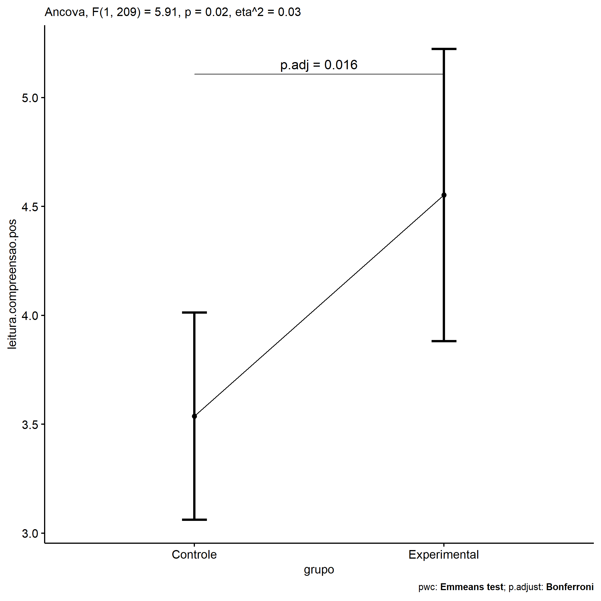<!-- -->

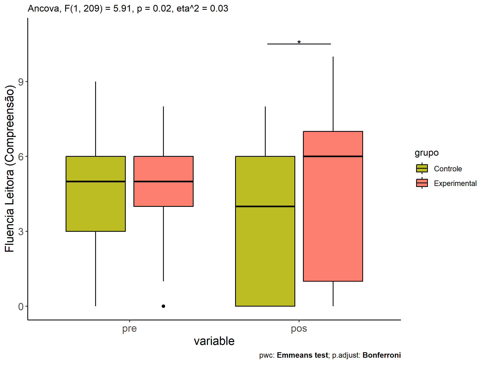<!-- -->

<!-- -->

## Pairwise comparisons for two factors

### factores: **grupo:Sexo**

| var                     | grupo        | Sexo |   n | M (pre) | SE (pre) | M (unadj) | SE (unadj) | M (adj) | SE (adj) |
|:------------------------|:-------------|:-----|----:|--------:|---------:|----------:|-----------:|--------:|---------:|
| leitura.compreensao.pos | Controle     | F    |  59 |   4.186 |    0.265 |     3.407 |      0.357 |   3.475 |    0.374 |
| leitura.compreensao.pos | Controle     | M    |  82 |   4.244 |    0.257 |     3.537 |      0.324 |   3.582 |    0.317 |
| leitura.compreensao.pos | Experimental | F    |  29 |   4.828 |    0.238 |     4.655 |      0.588 |   4.469 |    0.535 |
| leitura.compreensao.pos | Experimental | M    |  42 |   4.500 |    0.315 |     4.667 |      0.503 |   4.611 |    0.443 |

| .y.                     | grupo        | Sexo | group1   | group2       | estimate | conf.low | conf.high |    se | statistic |     p | p.adj | p.adj.signif |
|:------------------------|:-------------|:-----|:---------|:-------------|---------:|---------:|----------:|------:|----------:|------:|------:|:-------------|
| leitura.compreensao.pos |              | F    | Controle | Experimental |   -0.994 |   -2.284 |     0.296 | 0.654 |    -1.519 | 0.130 | 0.130 | ns           |
| leitura.compreensao.pos |              | M    | Controle | Experimental |   -1.028 |   -2.104 |     0.047 | 0.546 |    -1.885 | 0.061 | 0.061 | ns           |
| leitura.compreensao.pre |              | F    | Controle | Experimental |   -0.641 |   -1.568 |     0.286 | 0.470 |    -1.363 | 0.174 | 0.174 | ns           |
| leitura.compreensao.pre |              | M    | Controle | Experimental |   -0.256 |   -1.032 |     0.520 | 0.394 |    -0.651 | 0.516 | 0.516 | ns           |
| leitura.compreensao.pos | Controle     |      | F        | M            |   -0.107 |   -1.074 |     0.860 | 0.490 |    -0.218 | 0.827 | 0.827 | ns           |
| leitura.compreensao.pos | Experimental |      | F        | M            |   -0.141 |   -1.510 |     1.227 | 0.694 |    -0.204 | 0.839 | 0.839 | ns           |
| leitura.compreensao.pre | Controle     |      | F        | M            |   -0.057 |   -0.755 |     0.641 | 0.354 |    -0.162 | 0.871 | 0.871 | ns           |
| leitura.compreensao.pre | Experimental |      | F        | M            |    0.328 |   -0.660 |     1.315 | 0.501 |     0.654 | 0.514 | 0.514 | ns           |

| .y.                 | grupo        | Sexo | group1 | group2 | estimate | conf.low | conf.high |    se | statistic |     p | p.adj | p.adj.signif |
|:--------------------|:-------------|:-----|:-------|:-------|---------:|---------:|----------:|------:|----------:|------:|------:|:-------------|
| leitura.compreensao | Controle     | F    | pre    | pos    |    0.780 |   -0.150 |     1.709 | 0.473 |     1.649 | 0.100 | 0.100 | ns           |
| leitura.compreensao | Controle     | M    | pre    | pos    |    0.707 |   -0.081 |     1.496 | 0.401 |     1.764 | 0.079 | 0.079 | ns           |
| leitura.compreensao | Experimental | F    | pre    | pos    |    0.172 |   -1.153 |     1.498 | 0.674 |     0.256 | 0.798 | 0.798 | ns           |
| leitura.compreensao | Experimental | M    | pre    | pos    |   -0.167 |   -1.268 |     0.935 | 0.560 |    -0.297 | 0.766 | 0.766 | ns           |

    ## Scale for colour is already present.
    ## Adding another scale for colour, which will replace the existing scale.

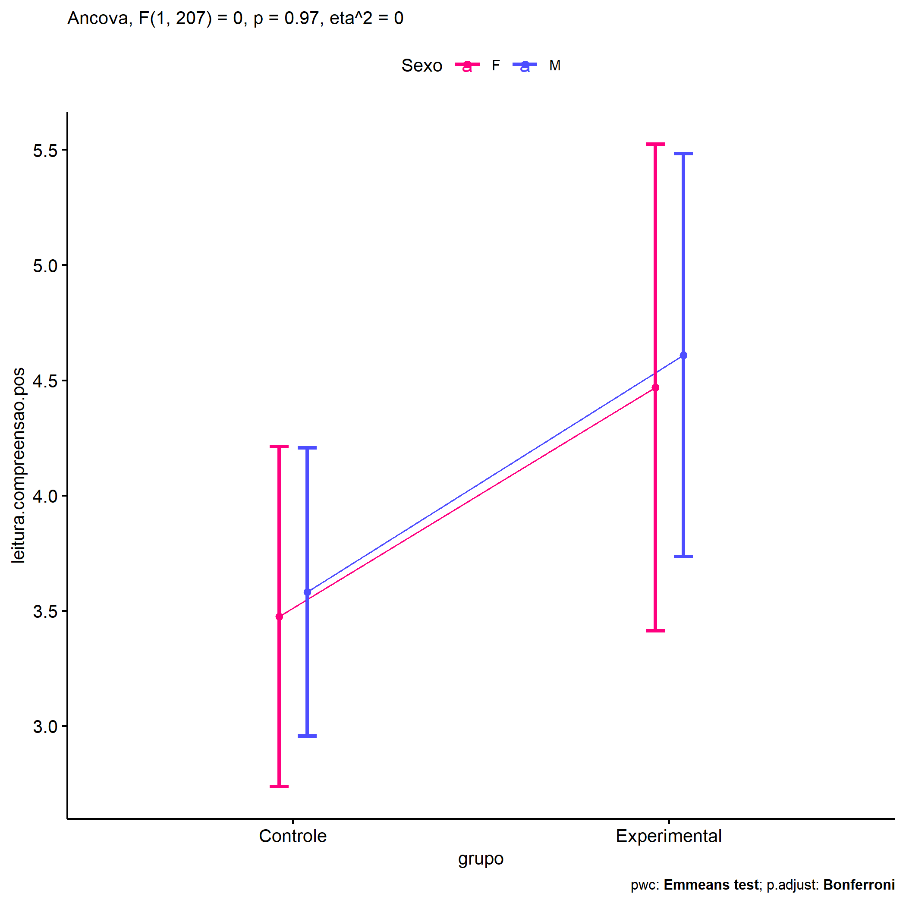<!-- -->

    ## Scale for colour is already present.
    ## Adding another scale for colour, which will replace the existing scale.

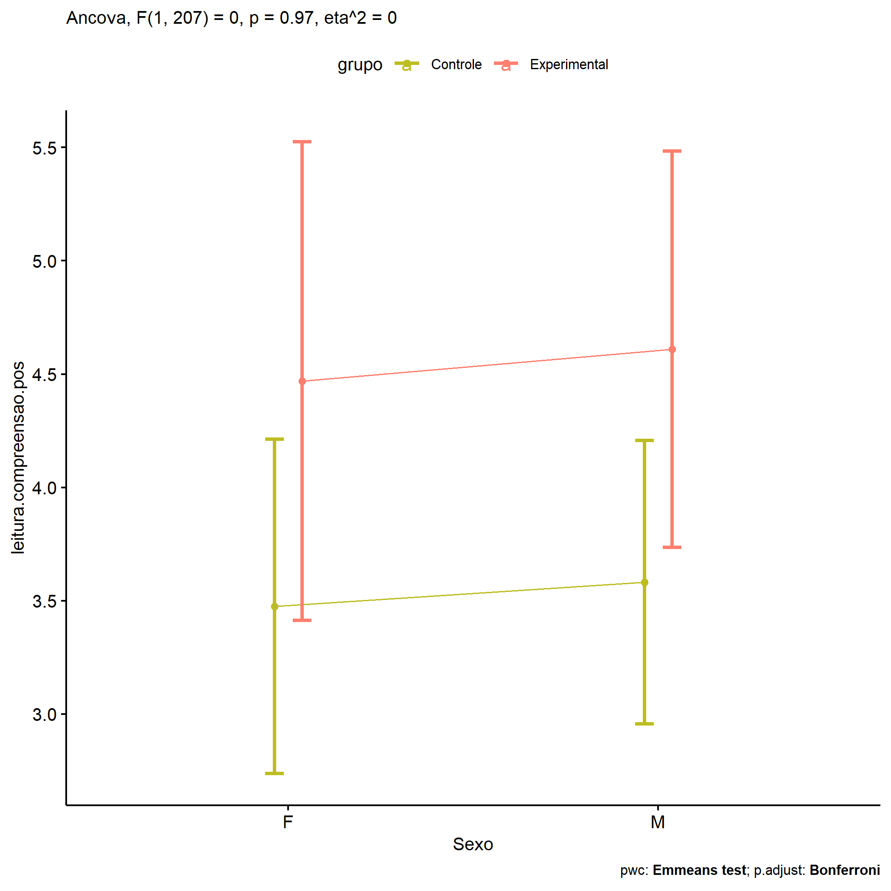<!-- -->

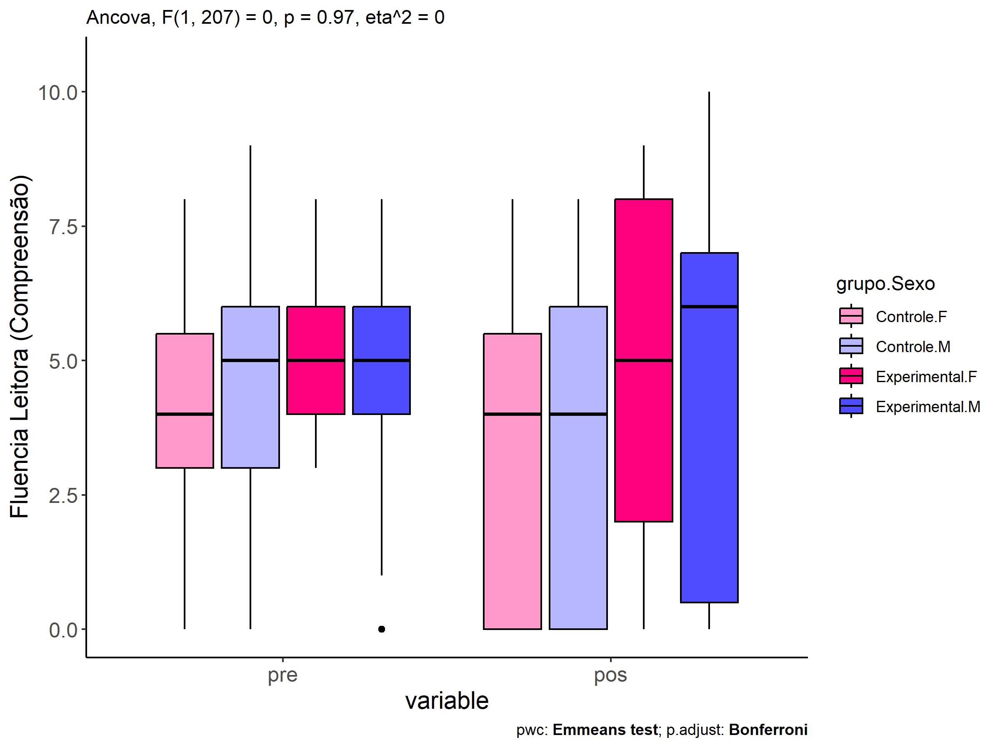<!-- -->

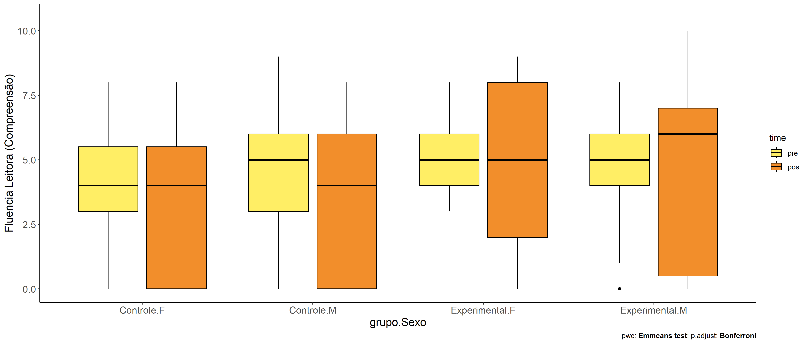<!-- -->

### factores: **grupo:Zona**

| var                     | grupo        | Zona   |   n | M (pre) | SE (pre) | M (unadj) | SE (unadj) | M (adj) | SE (adj) |
|:------------------------|:-------------|:-------|----:|--------:|---------:|----------:|-----------:|--------:|---------:|
| leitura.compreensao.pos | Controle     | Rural  |  78 |   4.128 |    0.254 |     4.038 |      0.309 |   4.134 |    0.299 |
| leitura.compreensao.pos | Controle     | Urbana |  25 |   4.160 |    0.359 |     1.200 |      0.465 |   1.282 |    0.526 |
| leitura.compreensao.pos | Experimental | Rural  |  42 |   4.714 |    0.305 |     5.452 |      0.460 |   5.310 |    0.407 |
| leitura.compreensao.pos | Experimental | Urbana |  15 |   4.933 |    0.358 |     2.133 |      0.729 |   1.902 |    0.681 |

| .y.                     | grupo        | Zona   | group1   | group2       | estimate | conf.low | conf.high |    se | statistic | p       | p.adj   | p.adj.signif |
|:------------------------|:-------------|:-------|:---------|:-------------|---------:|---------:|----------:|------:|----------:|:--------|:--------|:-------------|
| leitura.compreensao.pos |              | Rural  | Controle | Experimental |   -1.176 |   -2.177 |    -0.175 | 0.507 |    -2.320 | 0.022   | 0.022   | \*           |
| leitura.compreensao.pos |              | Urbana | Controle | Experimental |   -0.620 |   -2.323 |     1.084 | 0.862 |    -0.718 | 0.474   | 0.474   | ns           |
| leitura.compreensao.pre |              | Rural  | Controle | Experimental |   -0.586 |   -1.359 |     0.187 | 0.391 |    -1.498 | 0.136   | 0.136   | ns           |
| leitura.compreensao.pre |              | Urbana | Controle | Experimental |   -0.773 |   -2.092 |     0.545 | 0.667 |    -1.159 | 0.248   | 0.248   | ns           |
| leitura.compreensao.pos | Controle     |        | Rural    | Urbana       |    2.851 |    1.658 |     4.045 | 0.604 |     4.718 | \<0.001 | \<0.001 | \*\*\*\*     |
| leitura.compreensao.pos | Experimental |        | Rural    | Urbana       |    3.408 |    1.845 |     4.971 | 0.791 |     4.307 | \<0.001 | \<0.001 | \*\*\*\*     |
| leitura.compreensao.pre | Controle     |        | Rural    | Urbana       |   -0.032 |   -0.960 |     0.896 | 0.470 |    -0.068 | 0.946   | 0.946   | ns           |
| leitura.compreensao.pre | Experimental |        | Rural    | Urbana       |   -0.219 |   -1.433 |     0.995 | 0.615 |    -0.356 | 0.722   | 0.722   | ns           |

| .y.                 | grupo        | Zona   | group1 | group2 | estimate | conf.low | conf.high |    se | statistic | p       | p.adj   | p.adj.signif |
|:--------------------|:-------------|:-------|:-------|:-------|---------:|---------:|----------:|------:|----------:|:--------|:--------|:-------------|
| leitura.compreensao | Controle     | Rural  | pre    | pos    |    0.090 |   -0.673 |     0.853 | 0.388 |     0.231 | 0.817   | 0.817   | ns           |
| leitura.compreensao | Controle     | Urbana | pre    | pos    |    2.960 |    1.612 |     4.308 | 0.685 |     4.320 | \<0.001 | \<0.001 | \*\*\*\*     |
| leitura.compreensao | Experimental | Rural  | pre    | pos    |   -0.738 |   -1.778 |     0.302 | 0.529 |    -1.396 | 0.164   | 0.164   | ns           |
| leitura.compreensao | Experimental | Urbana | pre    | pos    |    2.800 |    1.060 |     4.540 | 0.884 |     3.166 | 0.002   | 0.002   | \*\*         |

    ## Scale for colour is already present.
    ## Adding another scale for colour, which will replace the existing scale.

<!-- -->

    ## Scale for colour is already present.
    ## Adding another scale for colour, which will replace the existing scale.

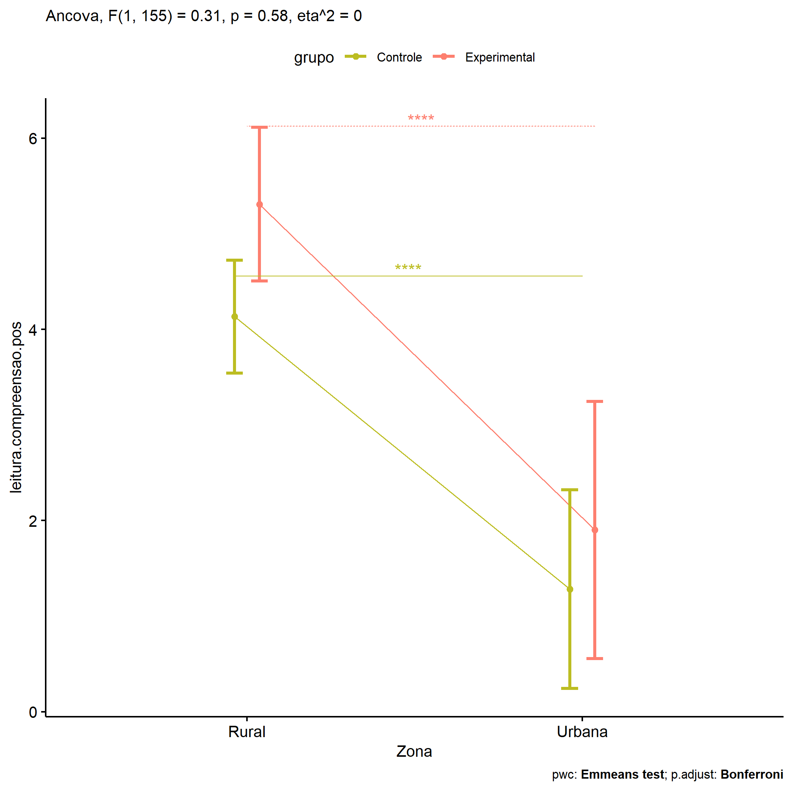<!-- -->

<!-- -->

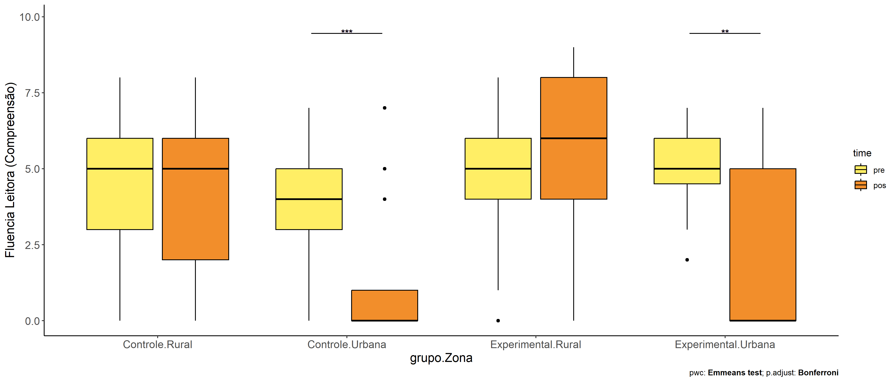<!-- -->

### factores: **grupo:Cor.Raca**

| var                     | grupo        | Cor.Raca |   n | M (pre) | SE (pre) | M (unadj) | SE (unadj) | M (adj) | SE (adj) |
|:------------------------|:-------------|:---------|----:|--------:|---------:|----------:|-----------:|--------:|---------:|
| leitura.compreensao.pos | Controle     | Branca   |  14 |   4.714 |    0.744 |     5.357 |      0.731 |   5.069 |    0.724 |
| leitura.compreensao.pos | Controle     | Parda    |  63 |   3.794 |    0.291 |     3.635 |      0.354 |   3.795 |    0.342 |
| leitura.compreensao.pos | Experimental | Branca   |   8 |   4.625 |    0.420 |     4.750 |      1.449 |   4.505 |    0.955 |
| leitura.compreensao.pos | Experimental | Indígena |   8 |   4.625 |    0.498 |     7.250 |      0.313 |   7.005 |    0.955 |
| leitura.compreensao.pos | Experimental | Parda    |  21 |   4.333 |    0.494 |     5.143 |      0.705 |   5.040 |    0.589 |

|     | .y.                     | grupo        | Cor.Raca | group1   | group2       | estimate | conf.low | conf.high |    se | statistic |     p | p.adj | p.adj.signif |
|:----|:------------------------|:-------------|:---------|:---------|:-------------|---------:|---------:|----------:|------:|----------:|------:|------:|:-------------|
| 1   | leitura.compreensao.pos |              | Branca   | Controle | Experimental |    0.564 |   -1.805 |     2.932 | 1.195 |     0.472 | 0.638 | 0.638 | ns           |
| 3   | leitura.compreensao.pos |              | Parda    | Controle | Experimental |   -1.245 |   -2.597 |     0.107 | 0.682 |    -1.825 | 0.071 | 0.071 | ns           |
| 4   | leitura.compreensao.pre |              | Branca   | Controle | Experimental |    0.089 |   -1.897 |     2.076 | 1.002 |     0.089 | 0.929 | 0.929 | ns           |
| 6   | leitura.compreensao.pre |              | Parda    | Controle | Experimental |   -0.540 |   -1.669 |     0.590 | 0.570 |    -0.947 | 0.346 | 0.346 | ns           |
| 8   | leitura.compreensao.pos | Controle     |          | Branca   | Parda        |    1.274 |   -0.319 |     2.866 | 0.804 |     1.585 | 0.116 | 0.116 | ns           |
| 10  | leitura.compreensao.pos | Experimental |          | Branca   | Indígena     |   -2.500 |   -5.172 |     0.172 | 1.348 |    -1.855 | 0.066 | 0.199 | ns           |
| 11  | leitura.compreensao.pos | Experimental |          | Branca   | Parda        |   -0.535 |   -2.756 |     1.686 | 1.121 |    -0.477 | 0.634 | 1.000 | ns           |
| 12  | leitura.compreensao.pos | Experimental |          | Indígena | Parda        |    1.965 |   -0.256 |     4.186 | 1.121 |     1.754 | 0.082 | 0.247 | ns           |
| 14  | leitura.compreensao.pre | Controle     |          | Branca   | Parda        |    0.921 |   -0.404 |     2.245 | 0.668 |     1.378 | 0.171 | 0.171 | ns           |
| 16  | leitura.compreensao.pre | Experimental |          | Branca   | Indígena     |    0.000 |   -2.241 |     2.241 | 1.131 |     0.000 | 1.000 | 1.000 | ns           |
| 17  | leitura.compreensao.pre | Experimental |          | Branca   | Parda        |    0.292 |   -1.571 |     2.154 | 0.940 |     0.310 | 0.757 | 1.000 | ns           |
| 18  | leitura.compreensao.pre | Experimental |          | Indígena | Parda        |    0.292 |   -1.571 |     2.154 | 0.940 |     0.310 | 0.757 | 1.000 | ns           |

| .y.                 | grupo        | Cor.Raca | group1 | group2 | estimate | conf.low | conf.high |    se | statistic |     p | p.adj | p.adj.signif |
|:--------------------|:-------------|:---------|:-------|:-------|---------:|---------:|----------:|------:|----------:|------:|------:|:-------------|
| leitura.compreensao | Controle     | Branca   | pre    | pos    |   -0.643 |   -2.581 |     1.295 | 0.983 |    -0.654 | 0.514 | 0.514 | ns           |
| leitura.compreensao | Controle     | Parda    | pre    | pos    |    0.159 |   -0.755 |     1.072 | 0.463 |     0.342 | 0.732 | 0.732 | ns           |
| leitura.compreensao | Experimental | Branca   | pre    | pos    |   -0.125 |   -2.688 |     2.438 | 1.301 |    -0.096 | 0.924 | 0.924 | ns           |
| leitura.compreensao | Experimental | Indígena | pre    | pos    |   -2.625 |   -5.188 |    -0.062 | 1.301 |    -2.018 | 0.045 | 0.045 | \*           |
| leitura.compreensao | Experimental | Parda    | pre    | pos    |   -0.810 |   -2.392 |     0.773 | 0.803 |    -1.008 | 0.314 | 0.314 | ns           |

    ## Scale for colour is already present.
    ## Adding another scale for colour, which will replace the existing scale.

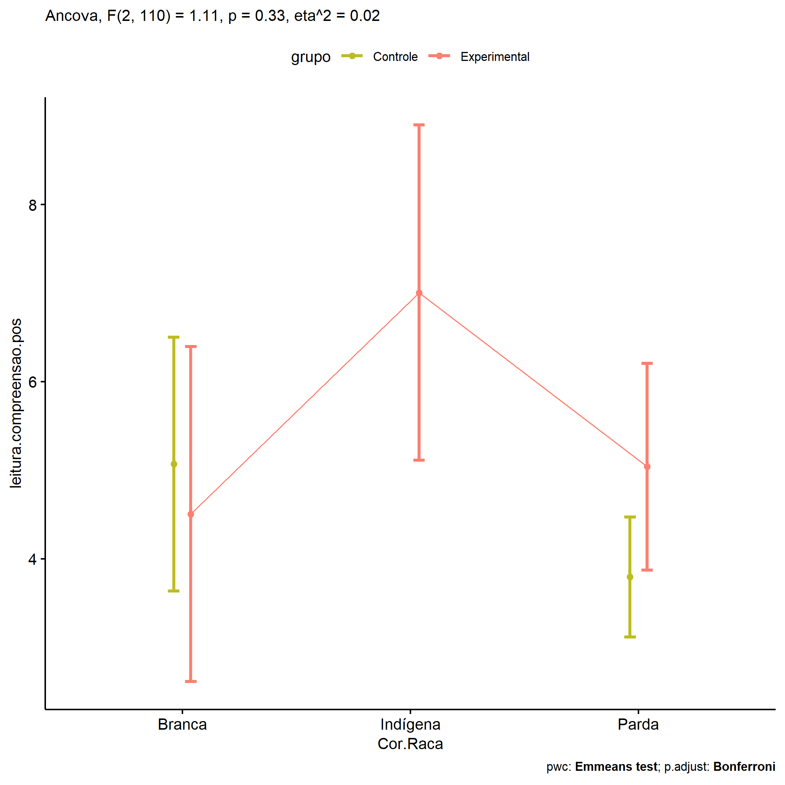<!-- -->

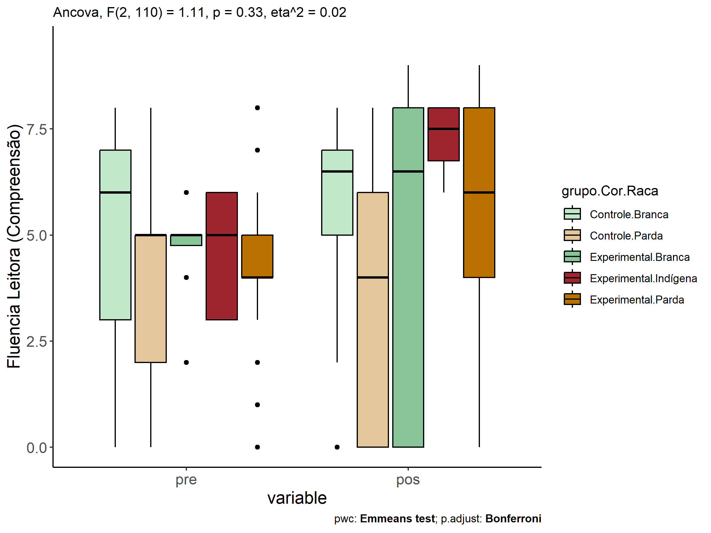<!-- -->

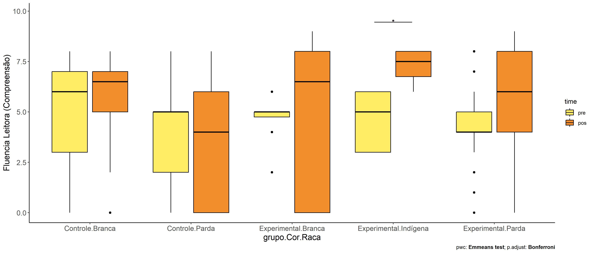<!-- -->

### factores: **grupo:leitura.compreensao.quintile**

| var                     | grupo        | leitura.compreensao.quintile |   n | M (pre) | SE (pre) | M (unadj) | SE (unadj) | M (adj) | SE (adj) |
|:------------------------|:-------------|:-----------------------------|----:|--------:|---------:|----------:|-----------:|--------:|---------:|
| leitura.compreensao.pos | Controle     | 1st quintile                 |  27 |   0.704 |    0.167 |     2.000 |      0.456 |   1.986 |    1.517 |
| leitura.compreensao.pos | Controle     | 2nd quintile                 |  20 |   3.000 |    0.000 |     2.750 |      0.584 |   2.745 |    0.829 |
| leitura.compreensao.pos | Controle     | 3rd quintile                 |  54 |   4.574 |    0.068 |     3.407 |      0.377 |   3.408 |    0.399 |
| leitura.compreensao.pos | Controle     | 4th quintile                 |  18 |   6.000 |    0.000 |     4.944 |      0.602 |   4.951 |    0.927 |
| leitura.compreensao.pos | Controle     | 5th quintile                 |  22 |   7.318 |    0.121 |     4.955 |      0.629 |   4.966 |    1.297 |
| leitura.compreensao.pos | Experimental | 1st quintile                 |   8 |   1.250 |    0.313 |     3.375 |      1.375 |   3.363 |    1.573 |
| leitura.compreensao.pos | Experimental | 2nd quintile                 |   8 |   3.000 |    0.000 |     4.750 |      0.901 |   4.745 |    1.143 |
| leitura.compreensao.pos | Experimental | 3rd quintile                 |  34 |   4.618 |    0.085 |     4.912 |      0.565 |   4.913 |    0.502 |
| leitura.compreensao.pos | Experimental | 4th quintile                 |  13 |   6.000 |    0.000 |     3.923 |      0.909 |   3.929 |    1.018 |
| leitura.compreensao.pos | Experimental | 5th quintile                 |   8 |   7.500 |    0.189 |     6.000 |      0.845 |   6.012 |    1.582 |

| .y.                     | grupo        | leitura.compreensao.quintile | group1       | group2       | estimate | conf.low | conf.high |    se | statistic | p       | p.adj   | p.adj.signif |
|:------------------------|:-------------|:-----------------------------|:-------------|:-------------|---------:|---------:|----------:|------:|----------:|:--------|:--------|:-------------|
| leitura.compreensao.pos |              | 1st quintile                 | Controle     | Experimental |   -1.377 |   -3.693 |     0.939 | 1.174 |    -1.173 | 0.242   | 0.242   | ns           |
| leitura.compreensao.pos |              | 2nd quintile                 | Controle     | Experimental |   -2.000 |   -4.367 |     0.367 | 1.201 |    -1.666 | 0.097   | 0.097   | ns           |
| leitura.compreensao.pos |              | 3rd quintile                 | Controle     | Experimental |   -1.505 |   -2.744 |    -0.265 | 0.629 |    -2.394 | 0.018   | 0.018   | \*           |
| leitura.compreensao.pos |              | 4th quintile                 | Controle     | Experimental |    1.021 |   -1.038 |     3.081 | 1.045 |     0.978 | 0.329   | 0.329   | ns           |
| leitura.compreensao.pos |              | 5th quintile                 | Controle     | Experimental |   -1.046 |   -3.387 |     1.294 | 1.187 |    -0.881 | 0.379   | 0.379   | ns           |
| leitura.compreensao.pre |              | 1st quintile                 | Controle     | Experimental |   -0.546 |   -0.961 |    -0.132 | 0.210 |    -2.598 | 0.01    | 0.01    | \*           |
| leitura.compreensao.pre |              | 2nd quintile                 | Controle     | Experimental |    0.000 |   -0.431 |     0.431 | 0.219 |     0.000 | 1       | 1       | ns           |
| leitura.compreensao.pre |              | 3rd quintile                 | Controle     | Experimental |   -0.044 |   -0.269 |     0.182 | 0.114 |    -0.381 | 0.704   | 0.704   | ns           |
| leitura.compreensao.pre |              | 4th quintile                 | Controle     | Experimental |    0.000 |   -0.375 |     0.375 | 0.190 |     0.000 | 1       | 1       | ns           |
| leitura.compreensao.pre |              | 5th quintile                 | Controle     | Experimental |   -0.182 |   -0.607 |     0.243 | 0.216 |    -0.843 | 0.4     | 0.4     | ns           |
| leitura.compreensao.pos | Controle     |                              | 1st quintile | 2nd quintile |   -0.759 |   -3.178 |     1.660 | 1.227 |    -0.618 | 0.537   | 1       | ns           |
| leitura.compreensao.pos | Controle     |                              | 1st quintile | 3rd quintile |   -1.422 |   -4.659 |     1.815 | 1.642 |    -0.866 | 0.387   | 1       | ns           |
| leitura.compreensao.pos | Controle     |                              | 1st quintile | 4th quintile |   -2.964 |   -7.353 |     1.424 | 2.226 |    -1.332 | 0.184   | 1       | ns           |
| leitura.compreensao.pos | Controle     |                              | 1st quintile | 5th quintile |   -2.980 |   -8.276 |     2.317 | 2.686 |    -1.109 | 0.269   | 1       | ns           |
| leitura.compreensao.pos | Controle     |                              | 2nd quintile | 3rd quintile |   -0.663 |   -2.570 |     1.243 | 0.967 |    -0.686 | 0.493   | 1       | ns           |
| leitura.compreensao.pos | Controle     |                              | 2nd quintile | 4th quintile |   -2.206 |   -5.140 |     0.728 | 1.488 |    -1.482 | 0.14    | 1       | ns           |
| leitura.compreensao.pos | Controle     |                              | 2nd quintile | 5th quintile |   -2.221 |   -5.948 |     1.506 | 1.890 |    -1.175 | 0.241   | 1       | ns           |
| leitura.compreensao.pos | Controle     |                              | 3rd quintile | 4th quintile |   -1.542 |   -3.428 |     0.343 | 0.956 |    -1.613 | 0.108   | 1       | ns           |
| leitura.compreensao.pos | Controle     |                              | 3rd quintile | 5th quintile |   -1.558 |   -4.092 |     0.977 | 1.285 |    -1.212 | 0.227   | 1       | ns           |
| leitura.compreensao.pos | Controle     |                              | 4th quintile | 5th quintile |   -0.015 |   -2.075 |     2.045 | 1.045 |    -0.014 | 0.988   | 1       | ns           |
| leitura.compreensao.pos | Experimental |                              | 1st quintile | 2nd quintile |   -1.382 |   -4.510 |     1.747 | 1.586 |    -0.871 | 0.385   | 1       | ns           |
| leitura.compreensao.pos | Experimental |                              | 1st quintile | 3rd quintile |   -1.550 |   -4.946 |     1.847 | 1.722 |    -0.900 | 0.369   | 1       | ns           |
| leitura.compreensao.pos | Experimental |                              | 1st quintile | 4th quintile |   -0.566 |   -4.990 |     3.858 | 2.244 |    -0.252 | 0.801   | 1       | ns           |
| leitura.compreensao.pos | Experimental |                              | 1st quintile | 5th quintile |   -2.649 |   -8.189 |     2.892 | 2.810 |    -0.943 | 0.347   | 1       | ns           |
| leitura.compreensao.pos | Experimental |                              | 2nd quintile | 3rd quintile |   -0.168 |   -2.711 |     2.375 | 1.290 |    -0.130 | 0.897   | 1       | ns           |
| leitura.compreensao.pos | Experimental |                              | 2nd quintile | 4th quintile |    0.816 |   -2.604 |     4.235 | 1.734 |     0.470 | 0.639   | 1       | ns           |
| leitura.compreensao.pos | Experimental |                              | 2nd quintile | 5th quintile |   -1.267 |   -5.713 |     3.179 | 2.255 |    -0.562 | 0.575   | 1       | ns           |
| leitura.compreensao.pos | Experimental |                              | 3rd quintile | 4th quintile |    0.983 |   -1.142 |     3.108 | 1.078 |     0.913 | 0.363   | 1       | ns           |
| leitura.compreensao.pos | Experimental |                              | 3rd quintile | 5th quintile |   -1.099 |   -4.225 |     2.027 | 1.585 |    -0.693 | 0.489   | 1       | ns           |
| leitura.compreensao.pos | Experimental |                              | 4th quintile | 5th quintile |   -2.083 |   -4.871 |     0.706 | 1.414 |    -1.473 | 0.142   | 1       | ns           |
| leitura.compreensao.pre | Controle     |                              | 1st quintile | 2nd quintile |   -2.296 |   -2.600 |    -1.992 | 0.154 |   -14.898 | \<0.001 | \<0.001 | \*\*\*\*     |
| leitura.compreensao.pre | Controle     |                              | 1st quintile | 3rd quintile |   -3.870 |   -4.113 |    -3.628 | 0.123 |   -31.430 | \<0.001 | \<0.001 | \*\*\*\*     |
| leitura.compreensao.pre | Controle     |                              | 1st quintile | 4th quintile |   -5.296 |   -5.610 |    -4.983 | 0.159 |   -33.315 | \<0.001 | \<0.001 | \*\*\*\*     |
| leitura.compreensao.pre | Controle     |                              | 1st quintile | 5th quintile |   -6.614 |   -6.910 |    -6.319 | 0.150 |   -44.081 | \<0.001 | \<0.001 | \*\*\*\*     |
| leitura.compreensao.pre | Controle     |                              | 2nd quintile | 3rd quintile |   -1.574 |   -1.844 |    -1.304 | 0.137 |   -11.510 | \<0.001 | \<0.001 | \*\*\*\*     |
| leitura.compreensao.pre | Controle     |                              | 2nd quintile | 4th quintile |   -3.000 |   -3.335 |    -2.665 | 0.170 |   -17.674 | \<0.001 | \<0.001 | \*\*\*\*     |
| leitura.compreensao.pre | Controle     |                              | 2nd quintile | 5th quintile |   -4.318 |   -4.636 |    -4.000 | 0.161 |   -26.752 | \<0.001 | \<0.001 | \*\*\*\*     |
| leitura.compreensao.pre | Controle     |                              | 3rd quintile | 4th quintile |   -1.426 |   -1.706 |    -1.146 | 0.142 |   -10.028 | \<0.001 | \<0.001 | \*\*\*\*     |
| leitura.compreensao.pre | Controle     |                              | 3rd quintile | 5th quintile |   -2.744 |   -3.005 |    -2.484 | 0.132 |   -20.766 | \<0.001 | \<0.001 | \*\*\*\*     |
| leitura.compreensao.pre | Controle     |                              | 4th quintile | 5th quintile |   -1.318 |   -1.646 |    -0.991 | 0.166 |    -7.939 | \<0.001 | \<0.001 | \*\*\*\*     |
| leitura.compreensao.pre | Experimental |                              | 1st quintile | 2nd quintile |   -1.750 |   -2.265 |    -1.235 | 0.261 |    -6.699 | \<0.001 | \<0.001 | \*\*\*\*     |
| leitura.compreensao.pre | Experimental |                              | 1st quintile | 3rd quintile |   -3.368 |   -3.772 |    -2.963 | 0.205 |   -16.404 | \<0.001 | \<0.001 | \*\*\*\*     |
| leitura.compreensao.pre | Experimental |                              | 1st quintile | 4th quintile |   -4.750 |   -5.213 |    -4.287 | 0.235 |   -20.233 | \<0.001 | \<0.001 | \*\*\*\*     |
| leitura.compreensao.pre | Experimental |                              | 1st quintile | 5th quintile |   -6.250 |   -6.765 |    -5.735 | 0.261 |   -23.926 | \<0.001 | \<0.001 | \*\*\*\*     |
| leitura.compreensao.pre | Experimental |                              | 2nd quintile | 3rd quintile |   -1.618 |   -2.022 |    -1.213 | 0.205 |    -7.880 | \<0.001 | \<0.001 | \*\*\*\*     |
| leitura.compreensao.pre | Experimental |                              | 2nd quintile | 4th quintile |   -3.000 |   -3.463 |    -2.537 | 0.235 |   -12.779 | \<0.001 | \<0.001 | \*\*\*\*     |
| leitura.compreensao.pre | Experimental |                              | 2nd quintile | 5th quintile |   -4.500 |   -5.015 |    -3.985 | 0.261 |   -17.227 | \<0.001 | \<0.001 | \*\*\*\*     |
| leitura.compreensao.pre | Experimental |                              | 3rd quintile | 4th quintile |   -1.382 |   -1.718 |    -1.046 | 0.170 |    -8.114 | \<0.001 | \<0.001 | \*\*\*\*     |
| leitura.compreensao.pre | Experimental |                              | 3rd quintile | 5th quintile |   -2.882 |   -3.287 |    -2.478 | 0.205 |   -14.040 | \<0.001 | \<0.001 | \*\*\*\*     |
| leitura.compreensao.pre | Experimental |                              | 4th quintile | 5th quintile |   -1.500 |   -1.963 |    -1.037 | 0.235 |    -6.389 | \<0.001 | \<0.001 | \*\*\*\*     |

| .y.                 | grupo        | leitura.compreensao.quintile | group1 | group2 | estimate | conf.low | conf.high |    se | statistic | p       | p.adj   | p.adj.signif |
|:--------------------|:-------------|:-----------------------------|:-------|:-------|---------:|---------:|----------:|------:|----------:|:--------|:--------|:-------------|
| leitura.compreensao | Controle     | 1st quintile                 | pre    | pos    |   -1.296 |   -2.397 |    -0.195 | 0.560 |    -2.314 | 0.021   | 0.021   | \*           |
| leitura.compreensao | Controle     | 2nd quintile                 | pre    | pos    |    0.250 |   -1.029 |     1.529 | 0.651 |     0.384 | 0.701   | 0.701   | ns           |
| leitura.compreensao | Controle     | 3rd quintile                 | pre    | pos    |    1.167 |    0.388 |     1.945 | 0.396 |     2.946 | 0.003   | 0.003   | \*\*         |
| leitura.compreensao | Controle     | 4th quintile                 | pre    | pos    |    1.056 |   -0.293 |     2.404 | 0.686 |     1.539 | 0.125   | 0.125   | ns           |
| leitura.compreensao | Controle     | 5th quintile                 | pre    | pos    |    2.364 |    1.144 |     3.583 | 0.620 |     3.809 | \<0.001 | \<0.001 | \*\*\*       |
| leitura.compreensao | Experimental | 1st quintile                 | pre    | pos    |   -2.125 |   -4.148 |    -0.102 | 1.029 |    -2.065 | 0.04    | 0.04    | \*           |
| leitura.compreensao | Experimental | 2nd quintile                 | pre    | pos    |   -1.750 |   -3.773 |     0.273 | 1.029 |    -1.701 | 0.09    | 0.09    | ns           |
| leitura.compreensao | Experimental | 3rd quintile                 | pre    | pos    |   -0.294 |   -1.275 |     0.687 | 0.499 |    -0.589 | 0.556   | 0.556   | ns           |
| leitura.compreensao | Experimental | 4th quintile                 | pre    | pos    |    2.077 |    0.490 |     3.664 | 0.807 |     2.573 | 0.01    | 0.01    | \*           |
| leitura.compreensao | Experimental | 5th quintile                 | pre    | pos    |    1.500 |   -0.523 |     3.523 | 1.029 |     1.458 | 0.146   | 0.146   | ns           |

    ## Scale for colour is already present.
    ## Adding another scale for colour, which will replace the existing scale.

<!-- -->

    ## Scale for colour is already present.
    ## Adding another scale for colour, which will replace the existing scale.

<!-- -->

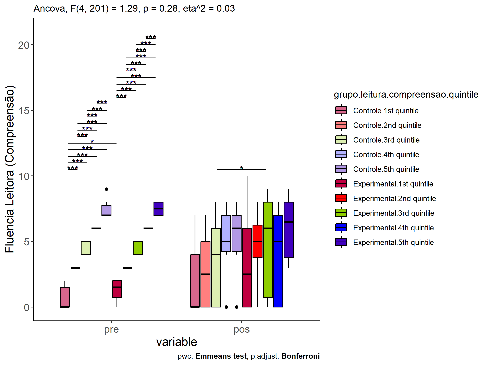<!-- -->

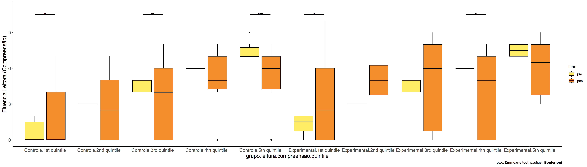<!-- -->
