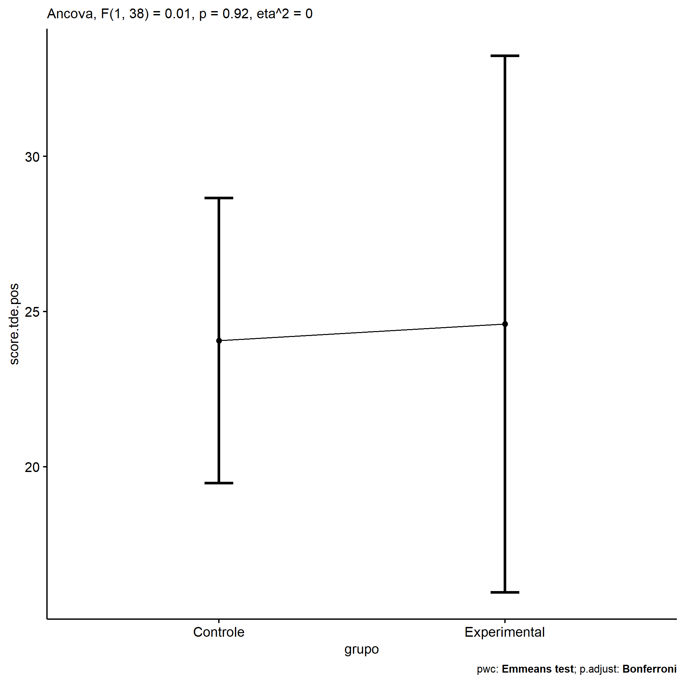
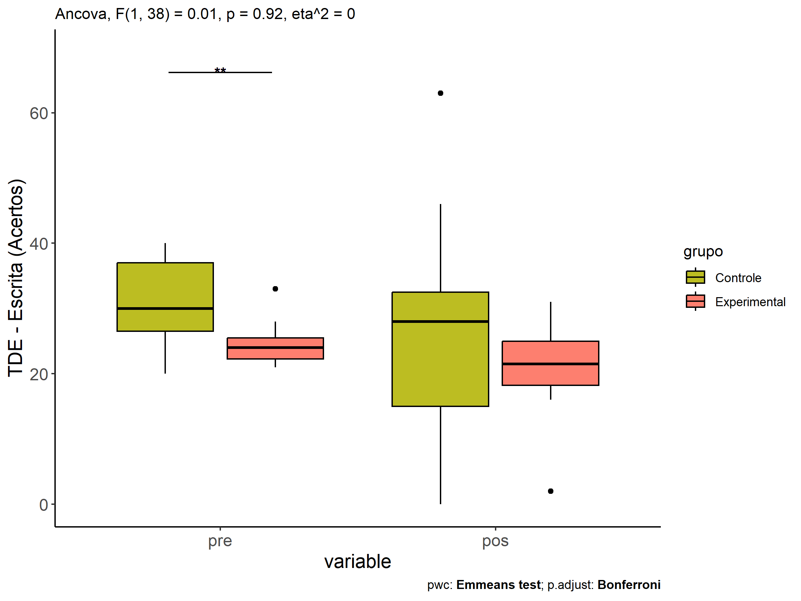
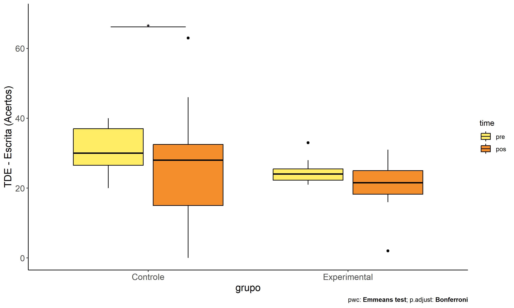
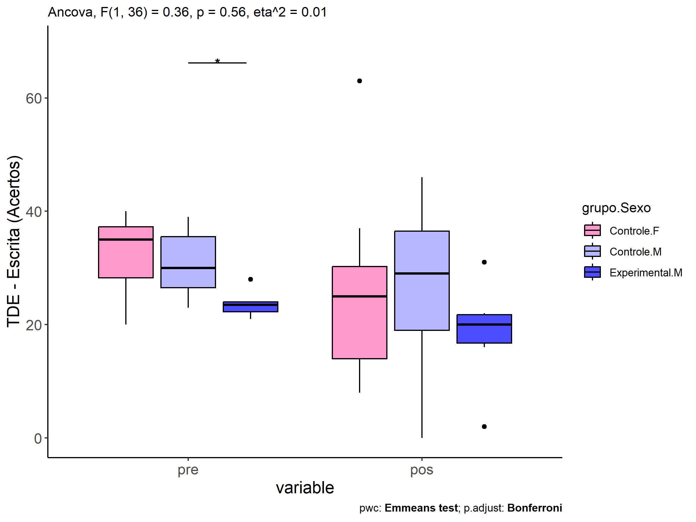
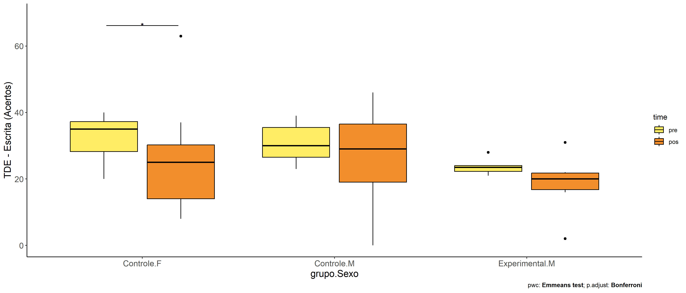
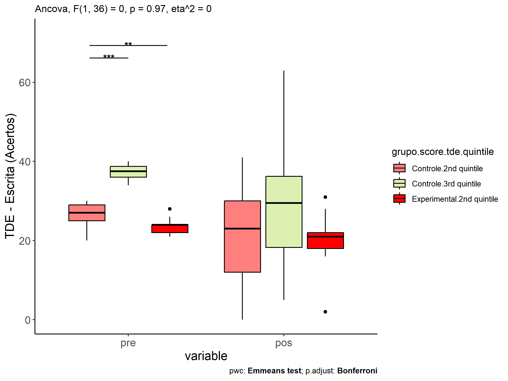
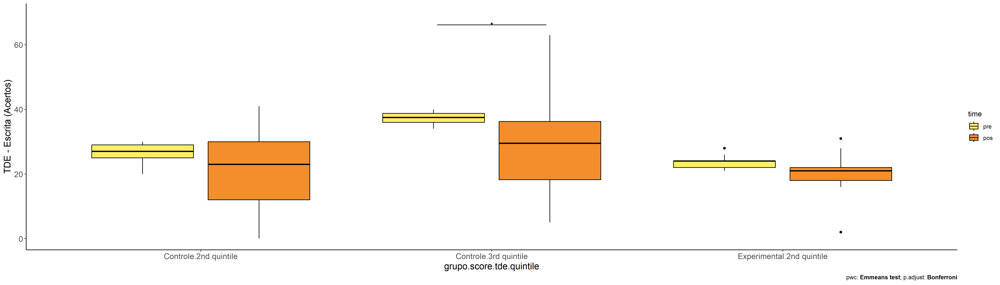

ANCOVA in TDE - Escrita (Acertos) (TDE - Escrita (Acertos))
================
Geiser C. Challco <geiser@alumni.usp.br>

- [Descriptive Statistics of Initial
  Data](#descriptive-statistics-of-initial-data)
- [Checking of Assumptions](#checking-of-assumptions)
  - [Assumption: Normality distribution of
    data](#assumption-normality-distribution-of-data)
  - [Assumption: Homogeneity of data
    distribution](#assumption-homogeneity-of-data-distribution)
- [Computation of ANCOVA test and Pairwise
  Comparison](#computation-of-ancova-test-and-pairwise-comparison)
  - [ANCOVA tests for one factor](#ancova-tests-for-one-factor)
  - [ANCOVA tests for two factors](#ancova-tests-for-two-factors)
  - [Pairwise comparisons for one factor:
    **grupo**](#pairwise-comparisons-for-one-factor-grupo)
  - [Pairwise comparisons for two
    factors](#pairwise-comparisons-for-two-factors)
    - [factores: **grupo:Sexo**](#factores-gruposexo)
    - [factores: **grupo:Zona**](#factores-grupozona)
    - [factores: **grupo:Cor.Raca**](#factores-grupocorraca)
    - [factores:
      **grupo:score.tde.quintile**](#factores-gruposcoretdequintile)

**NOTE**

- Teste ANCOVA para determinar se houve diferenças significativas no
  TDE - Escrita (Acertos) (medido usando pre- e pos-testes).
- ANCOVA test to determine whether there were significant differences in
  TDE - Escrita (Acertos) (measured using pre- and post-tests).

# Descriptive Statistics of Initial Data

| grupo        | Sexo | Zona   | Cor.Raca | score.tde.quintile | variable      |   n |   mean | median | min | max |     sd |    se |      ci |   iqr |
|:-------------|:-----|:-------|:---------|:-------------------|:--------------|----:|-------:|-------:|----:|----:|-------:|------:|--------:|------:|
| Controle     | F    |        |          |                    | score.tde.pre |  16 | 32.312 |   35.0 |  20 |  40 |  6.498 | 1.625 |   3.463 |  9.00 |
| Controle     | M    |        |          |                    | score.tde.pre |  15 | 30.533 |   30.0 |  23 |  39 |  5.383 | 1.390 |   2.981 |  9.00 |
| Experimental | F    |        |          |                    | score.tde.pre |   4 | 26.000 |   25.0 |  21 |  33 |  5.099 | 2.550 |   8.114 |  4.50 |
| Experimental | M    |        |          |                    | score.tde.pre |   6 | 23.667 |   23.5 |  21 |  28 |  2.422 | 0.989 |   2.542 |  1.75 |
| Controle     | F    |        |          |                    | score.tde.pos |  16 | 24.938 |   25.0 |   8 |  63 | 13.537 | 3.384 |   7.214 | 16.25 |
| Controle     | M    |        |          |                    | score.tde.pos |  15 | 25.867 |   29.0 |   0 |  46 | 14.788 | 3.818 |   8.190 | 17.50 |
| Experimental | F    |        |          |                    | score.tde.pos |   4 | 23.500 |   24.0 |  18 |  28 |  4.435 | 2.217 |   7.057 |  5.50 |
| Experimental | M    |        |          |                    | score.tde.pos |   6 | 18.500 |   20.0 |   2 |  31 |  9.524 | 3.888 |   9.994 |  5.00 |
| Controle     |      | Rural  |          |                    | score.tde.pre |  21 | 32.048 |   34.0 |  20 |  40 |  6.029 | 1.316 |   2.744 |  9.00 |
| Controle     |      | Urbana |          |                    | score.tde.pre |   3 | 26.667 |   26.0 |  25 |  29 |  2.082 | 1.202 |   5.171 |  2.00 |
| Controle     |      |        |          |                    | score.tde.pre |   7 | 31.714 |   30.0 |  22 |  39 |  6.473 | 2.447 |   5.987 |  9.50 |
| Experimental |      | Rural  |          |                    | score.tde.pre |   8 | 25.125 |   24.0 |  21 |  33 |  3.871 | 1.368 |   3.236 |  3.75 |
| Experimental |      | Urbana |          |                    | score.tde.pre |   2 | 22.500 |   22.5 |  21 |  24 |  2.121 | 1.500 |  19.059 |  1.50 |
| Controle     |      | Rural  |          |                    | score.tde.pos |  21 | 24.952 |   29.0 |   0 |  46 | 13.223 | 2.885 |   6.019 | 17.00 |
| Controle     |      | Urbana |          |                    | score.tde.pos |   3 | 20.000 |   23.0 |   8 |  29 | 10.817 | 6.245 |  26.870 | 10.50 |
| Controle     |      |        |          |                    | score.tde.pos |   7 | 29.000 |   24.0 |  12 |  63 | 17.814 | 6.733 |  16.475 | 17.00 |
| Experimental |      | Rural  |          |                    | score.tde.pos |   8 | 23.125 |   22.0 |  16 |  31 |  4.912 | 1.737 |   4.106 |  6.00 |
| Experimental |      | Urbana |          |                    | score.tde.pos |   2 | 10.000 |   10.0 |   2 |  18 | 11.314 | 8.000 | 101.650 |  8.00 |
| Controle     |      |        | Branca   |                    | score.tde.pre |   4 | 34.000 |   34.0 |  29 |  39 |  5.228 | 2.614 |   8.319 |  8.50 |
| Controle     |      |        | Indígena |                    | score.tde.pre |   1 | 34.000 |   34.0 |  34 |  34 |        |       |         |  0.00 |
| Controle     |      |        | Parda    |                    | score.tde.pre |  17 | 31.176 |   30.0 |  23 |  40 |  5.897 | 1.430 |   3.032 | 11.00 |
| Controle     |      |        | Preta    |                    | score.tde.pre |   1 | 26.000 |   26.0 |  26 |  26 |        |       |         |  0.00 |
| Controle     |      |        |          |                    | score.tde.pre |   8 | 31.125 |   32.5 |  20 |  39 |  7.180 | 2.539 |   6.003 |  9.25 |
| Experimental |      |        | Branca   |                    | score.tde.pre |   1 | 21.000 |   21.0 |  21 |  21 |        |       |         |  0.00 |
| Experimental |      |        | Indígena |                    | score.tde.pre |   3 | 23.667 |   24.0 |  21 |  26 |  2.517 | 1.453 |   6.252 |  2.50 |
| Experimental |      |        | Parda    |                    | score.tde.pre |   4 | 24.250 |   23.5 |  22 |  28 |  2.630 | 1.315 |   4.185 |  2.25 |
| Experimental |      |        |          |                    | score.tde.pre |   2 | 28.500 |   28.5 |  24 |  33 |  6.364 | 4.500 |  57.178 |  4.50 |
| Controle     |      |        | Branca   |                    | score.tde.pos |   4 | 38.750 |   31.5 |  29 |  63 | 16.215 | 8.107 |  25.801 |  9.25 |
| Controle     |      |        | Indígena |                    | score.tde.pos |   1 | 28.000 |   28.0 |  28 |  28 |        |       |         |  0.00 |
| Controle     |      |        | Parda    |                    | score.tde.pos |  17 | 23.765 |   23.0 |   0 |  46 | 14.118 | 3.424 |   7.259 | 22.00 |
| Controle     |      |        | Preta    |                    | score.tde.pos |   1 | 40.000 |   40.0 |  40 |  40 |        |       |         |  0.00 |
| Controle     |      |        |          |                    | score.tde.pos |   8 | 20.000 |   18.5 |   5 |  33 |  9.472 | 3.349 |   7.919 | 14.25 |
| Experimental |      |        | Branca   |                    | score.tde.pos |   1 |  2.000 |    2.0 |   2 |   2 |        |       |         |  0.00 |
| Experimental |      |        | Indígena |                    | score.tde.pos |   3 | 23.000 |   22.0 |  19 |  28 |  4.583 | 2.646 |  11.384 |  4.50 |
| Experimental |      |        | Parda    |                    | score.tde.pos |   4 | 22.500 |   21.5 |  16 |  31 |  6.245 | 3.122 |   9.937 |  4.50 |
| Experimental |      |        |          |                    | score.tde.pos |   2 | 22.000 |   22.0 |  18 |  26 |  5.657 | 4.000 |  50.825 |  4.00 |
| Controle     |      |        |          | 2nd quintile       | score.tde.pre |  17 | 26.647 |   27.0 |  20 |  30 |  3.121 | 0.757 |   1.605 |  4.00 |
| Controle     |      |        |          | 3rd quintile       | score.tde.pre |  14 | 37.286 |   37.5 |  34 |  40 |  1.729 | 0.462 |   0.998 |  2.75 |
| Experimental |      |        |          | 2nd quintile       | score.tde.pre |   9 | 23.667 |   24.0 |  21 |  28 |  2.291 | 0.764 |   1.761 |  2.00 |
| Experimental |      |        |          | 3rd quintile       | score.tde.pre |   1 | 33.000 |   33.0 |  33 |  33 |        |       |         |  0.00 |
| Controle     |      |        |          | 2nd quintile       | score.tde.pos |  17 | 21.824 |   23.0 |   0 |  41 | 12.345 | 2.994 |   6.347 | 18.00 |
| Controle     |      |        |          | 3rd quintile       | score.tde.pos |  14 | 29.714 |   29.5 |   5 |  63 | 14.938 | 3.992 |   8.625 | 18.00 |
| Experimental |      |        |          | 2nd quintile       | score.tde.pos |   9 | 19.889 |   21.0 |   2 |  31 |  8.207 | 2.736 |   6.309 |  4.00 |
| Experimental |      |        |          | 3rd quintile       | score.tde.pos |   1 | 26.000 |   26.0 |  26 |  26 |        |       |         |  0.00 |

# Checking of Assumptions

## Assumption: Normality distribution of data

| var           |   n |   skewness |   kurtosis | symmetry | statistic | method       |         p | p.signif | normality |
|:--------------|----:|-----------:|-----------:|:---------|----------:|:-------------|----------:|:---------|:----------|
| score.tde.pos |  41 |  0.0764678 |  0.2377791 | YES      | 0.9850082 | Shapiro-Wilk | 0.8560327 | ns       | YES       |
| score.tde.pos |  34 | -0.3873733 | -0.5755328 | YES      | 0.9709067 | Shapiro-Wilk | 0.4869236 | ns       | YES       |
| score.tde.pos |  31 |  0.2308275 | -0.4971558 | YES      | 0.9775743 | Shapiro-Wilk | 0.7423858 | ns       | YES       |
| score.tde.pos |  41 |  0.1128965 | -0.0896371 | YES      | 0.9852200 | Shapiro-Wilk | 0.8627260 | ns       | YES       |

## Assumption: Homogeneity of data distribution

| var           | method         | formula                              |   n | DFn.df1 | DFd.df2 | statistic |         p | p.signif |
|:--------------|:---------------|:-------------------------------------|----:|--------:|--------:|----------:|----------:|:---------|
| score.tde.pos | Levene’s test  | `.res`~`grupo`\*`Sexo`               |  41 |       3 |      37 | 1.2154616 | 0.3176872 | ns       |
| score.tde.pos | Anova’s slopes | `.res`~`grupo`\*`Sexo`               |  41 |       3 |      33 | 0.1700000 | 0.9160000 | ns       |
| score.tde.pos | Levene’s test  | `.res`~`grupo`\*`Zona`               |  34 |       3 |      30 | 1.7465176 | 0.1787002 | ns       |
| score.tde.pos | Anova’s slopes | `.res`~`grupo`\*`Zona`               |  34 |       3 |      26 | 0.4320000 | 0.7320000 | ns       |
| score.tde.pos | Levene’s test  | `.res`~`grupo`\*`Cor.Raca`           |  31 |       6 |      24 | 0.9402334 | 0.4849922 | ns       |
| score.tde.pos | Anova’s slopes | `.res`~`grupo`\*`Cor.Raca`           |  31 |       3 |      20 | 0.4360000 | 0.7300000 | ns       |
| score.tde.pos | Levene’s test  | `.res`~`grupo`\*`score.tde.quintile` |  41 |       3 |      37 | 1.3159022 | 0.2838071 | ns       |
| score.tde.pos | Anova’s slopes | `.res`~`grupo`\*`score.tde.quintile` |  41 |       2 |      34 | 0.6020000 | 0.5540000 | ns       |

# Computation of ANCOVA test and Pairwise Comparison

## ANCOVA tests for one factor

|     | Effect             | DFn | DFd |     SSn |      SSd |     F |     p |   ges | p\<.05 |
|:----|:-------------------|----:|----:|--------:|---------:|------:|------:|------:|:-------|
| 1   | score.tde.pre      |   1 |  38 | 740.816 | 5649.039 | 4.983 | 0.032 | 0.116 | \*     |
| 2   | grupo              |   1 |  38 |   1.649 | 5649.039 | 0.011 | 0.917 | 0.000 |        |
| 4   | Sexo               |   1 |  38 |  11.287 | 5639.401 | 0.076 | 0.784 | 0.002 |        |
| 6   | Zona               |   1 |  31 | 114.003 | 3769.642 | 0.938 | 0.340 | 0.029 |        |
| 8   | Cor.Raca           |   3 |  26 | 580.627 | 3381.163 | 1.488 | 0.241 | 0.147 |        |
| 10  | score.tde.quintile |   1 |  38 |  11.395 | 5639.293 | 0.077 | 0.783 | 0.002 |        |

## ANCOVA tests for two factors

|     | Effect                   | DFn | DFd |     SSn |      SSd |     F |     p |   ges | p\<.05 |
|:----|:-------------------------|----:|----:|--------:|---------:|------:|------:|------:|:-------|
| 1   | score.tde.pre            |   1 |  36 | 740.459 | 5582.712 | 4.775 | 0.035 | 0.117 | \*     |
| 4   | grupo:Sexo               |   1 |  36 |  55.067 | 5582.712 | 0.355 | 0.555 | 0.010 |        |
| 8   | grupo:Zona               |   1 |  29 |  97.927 | 3668.635 | 0.774 | 0.386 | 0.026 |        |
| 12  | grupo:Cor.Raca           |   2 |  23 | 478.832 | 2812.722 | 1.958 | 0.164 | 0.145 |        |
| 16  | grupo:score.tde.quintile |   1 |  36 |   0.164 | 5633.387 | 0.001 | 0.974 | 0.000 |        |

## Pairwise comparisons for one factor: **grupo**

| var           | grupo        |   n | M (pre) | SE (pre) | M (unadj) | SE (unadj) | M (adj) | SE (adj) |
|:--------------|:-------------|----:|--------:|---------:|----------:|-----------:|--------:|---------:|
| score.tde.pos | Controle     |  31 |  31.452 |    1.069 |    25.387 |      2.501 |  24.065 |    2.268 |
| score.tde.pos | Experimental |  10 |  24.600 |    1.157 |    20.500 |      2.522 |  24.598 |    4.270 |

| .y.           | group1   | group2       | estimate | conf.low | conf.high |    se | statistic |     p | p.adj | p.adj.signif |
|:--------------|:---------|:-------------|---------:|---------:|----------:|------:|----------:|------:|------:|:-------------|
| score.tde.pos | Controle | Experimental |   -0.532 |  -10.766 |     9.701 | 5.055 |    -0.105 | 0.917 | 0.917 | ns           |
| score.tde.pre | Controle | Experimental |    6.852 |    2.798 |    10.905 | 2.004 |     3.419 | 0.001 | 0.001 | \*\*         |

| .y.       | grupo        | group1 | group2 | estimate | conf.low | conf.high |    se | statistic |     p | p.adj | p.adj.signif |
|:----------|:-------------|:-------|:-------|---------:|---------:|----------:|------:|----------:|------:|------:|:-------------|
| score.tde | Controle     | pre    | pos    |    6.065 |    1.082 |    11.047 | 2.503 |     2.423 | 0.018 | 0.018 | \*           |
| score.tde | Experimental | pre    | pos    |    4.100 |   -4.673 |    12.873 | 4.407 |     0.930 | 0.355 | 0.355 | ns           |

    ## Scale for colour is already present.
    ## Adding another scale for colour, which will replace the existing scale.

<!-- -->

<!-- -->

<!-- -->

## Pairwise comparisons for two factors

### factores: **grupo:Sexo**

| var           | grupo        | Sexo |   n | M (pre) | SE (pre) | M (unadj) | SE (unadj) | M (adj) | SE (adj) |
|:--------------|:-------------|:-----|----:|--------:|---------:|----------:|-----------:|--------:|---------:|
| score.tde.pos | Controle     | F    |  16 |  32.312 |    1.625 |    24.938 |      3.384 |  23.118 |    3.329 |
| score.tde.pos | Controle     | M    |  15 |  30.533 |    1.390 |    25.867 |      3.818 |  25.572 |    3.330 |
| score.tde.pos | Experimental | M    |   6 |  23.667 |    0.989 |    18.500 |      3.888 |  24.088 |    5.856 |

|     | .y.           | grupo    | Sexo | group1   | group2       | estimate | conf.low | conf.high |    se | statistic |     p | p.adj | p.adj.signif |
|:----|:--------------|:---------|:-----|:---------|:-------------|---------:|---------:|----------:|------:|----------:|------:|------:|:-------------|
| 2   | score.tde.pos |          | M    | Controle | Experimental |    1.484 |  -12.326 |    15.294 | 6.788 |     0.219 | 0.828 | 0.828 | ns           |
| 4   | score.tde.pre |          | M    | Controle | Experimental |    6.867 |    1.363 |    12.370 | 2.708 |     2.536 | 0.016 | 0.016 | \*           |
| 5   | score.tde.pos | Controle |      | F        | M            |   -2.453 |  -11.983 |     7.077 | 4.684 |    -0.524 | 0.604 | 0.604 | ns           |
| 7   | score.tde.pre | Controle |      | F        | M            |    1.779 |   -2.315 |     5.874 | 2.015 |     0.883 | 0.383 | 0.383 | ns           |

| .y.       | grupo        | Sexo | group1 | group2 | estimate | conf.low | conf.high |    se | statistic |     p | p.adj | p.adj.signif |
|:----------|:-------------|:-----|:-------|:-------|---------:|---------:|----------:|------:|----------:|------:|------:|:-------------|
| score.tde | Controle     | F    | pre    | pos    |    7.375 |    0.049 |    14.701 | 3.671 |     2.009 | 0.049 | 0.049 | \*           |
| score.tde | Controle     | M    | pre    | pos    |    4.667 |   -2.900 |    12.233 | 3.792 |     1.231 | 0.223 | 0.223 | ns           |
| score.tde | Experimental | M    | pre    | pos    |    5.167 |   -6.797 |    17.130 | 5.995 |     0.862 | 0.392 | 0.392 | ns           |

<!-- -->

<!-- -->

### factores: **grupo:Zona**

### factores: **grupo:Cor.Raca**

### factores: **grupo:score.tde.quintile**

| var           | grupo        | score.tde.quintile |   n | M (pre) | SE (pre) | M (unadj) | SE (unadj) | M (adj) | SE (adj) |
|:--------------|:-------------|:-------------------|----:|--------:|---------:|----------:|-----------:|--------:|---------:|
| score.tde.pos | Controle     | 2nd quintile       |  17 |  26.647 |    0.757 |    21.824 |      2.994 |  24.928 |    3.920 |
| score.tde.pos | Controle     | 3rd quintile       |  14 |  37.286 |    0.462 |    29.714 |      3.992 |  22.000 |    7.015 |
| score.tde.pos | Experimental | 2nd quintile       |   9 |  23.667 |    0.764 |    19.889 |      2.736 |  26.024 |    6.438 |

|     | .y.           | grupo    | score.tde.quintile | group1       | group2       | estimate | conf.low | conf.high |    se | statistic | p       | p.adj   | p.adj.signif |
|:----|:--------------|:---------|:-------------------|:-------------|:-------------|---------:|---------:|----------:|------:|----------:|:--------|:--------|:-------------|
| 1   | score.tde.pos |          | 2nd quintile       | Controle     | Experimental |   -1.096 |  -12.652 |    10.459 | 5.698 |    -0.192 | 0.849   | 0.849   | ns           |
| 3   | score.tde.pre |          | 2nd quintile       | Controle     | Experimental |    2.980 |    0.868 |     5.093 | 1.043 |     2.858 | 0.007   | 0.007   | \*\*         |
| 5   | score.tde.pos | Controle |                    | 2nd quintile | 3rd quintile |    2.928 |  -16.859 |    22.716 | 9.757 |     0.300 | 0.766   | 0.766   | ns           |
| 7   | score.tde.pre | Controle |                    | 2nd quintile | 3rd quintile |  -10.639 |  -12.488 |    -8.789 | 0.913 |   -11.654 | \<0.001 | \<0.001 | \*\*\*\*     |

| .y.       | grupo        | score.tde.quintile | group1 | group2 | estimate | conf.low | conf.high |    se | statistic |     p | p.adj | p.adj.signif |
|:----------|:-------------|:-------------------|:-------|:-------|---------:|---------:|----------:|------:|----------:|------:|------:|:-------------|
| score.tde | Controle     | 2nd quintile       | pre    | pos    |    4.824 |   -1.389 |    11.036 | 3.118 |     1.547 | 0.126 | 0.126 | ns           |
| score.tde | Controle     | 3rd quintile       | pre    | pos    |    7.571 |    0.725 |    14.417 | 3.436 |     2.204 | 0.031 | 0.031 | \*           |
| score.tde | Experimental | 2nd quintile       | pre    | pos    |    3.778 |   -4.761 |    12.316 | 4.285 |     0.882 | 0.381 | 0.381 | ns           |

<!-- -->

<!-- -->
