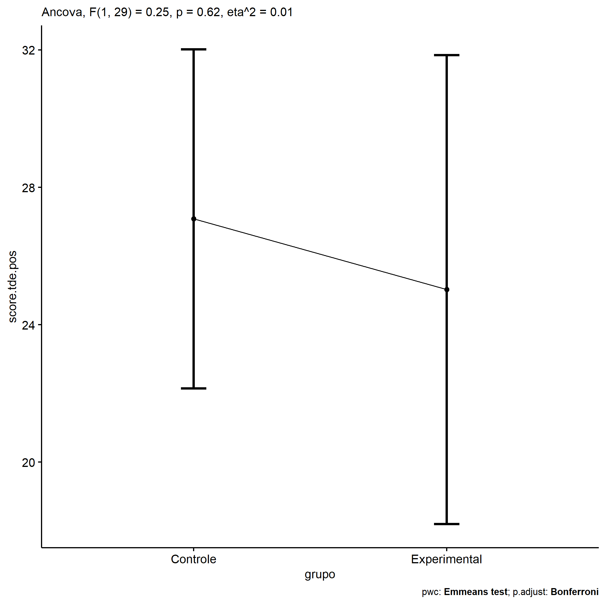
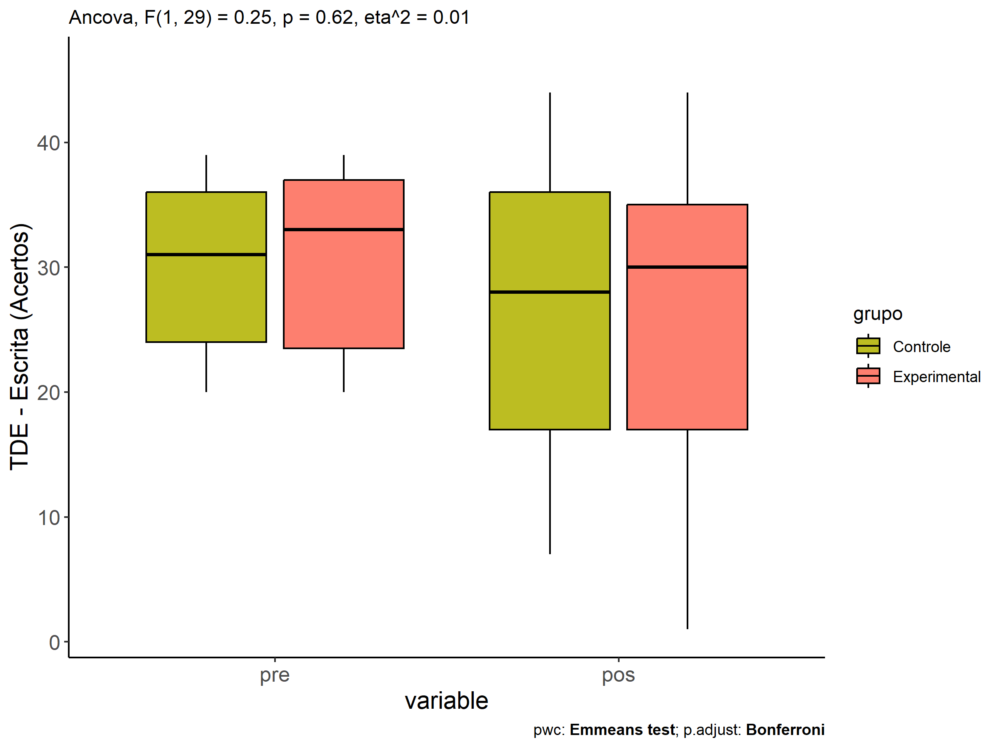
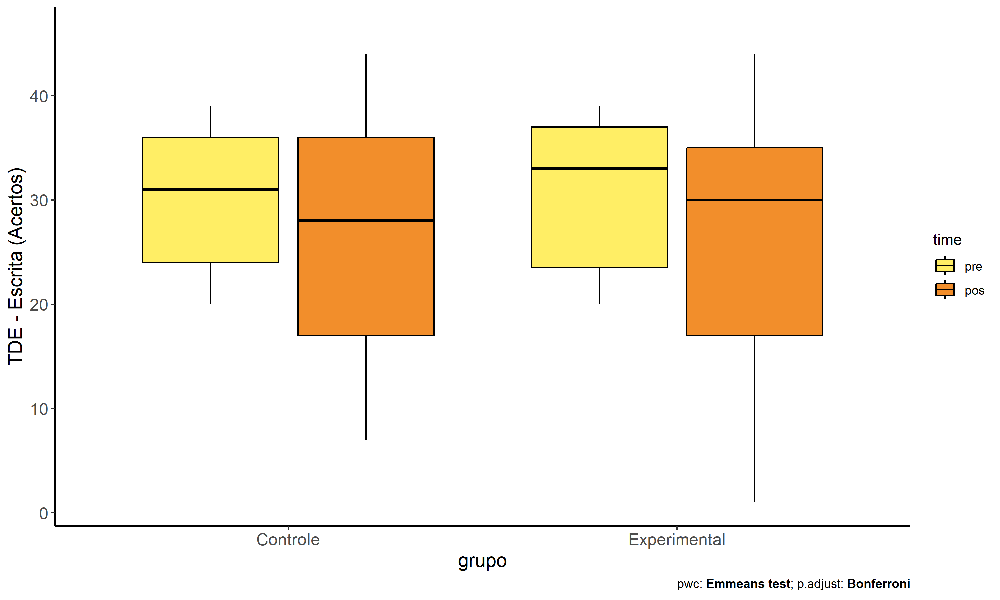
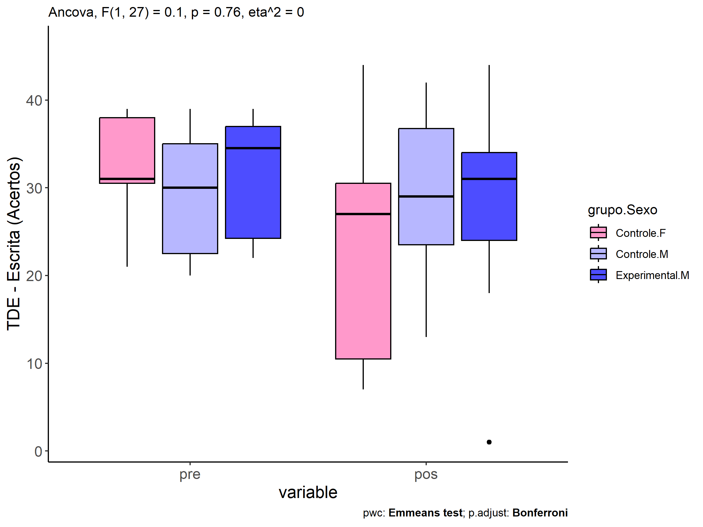
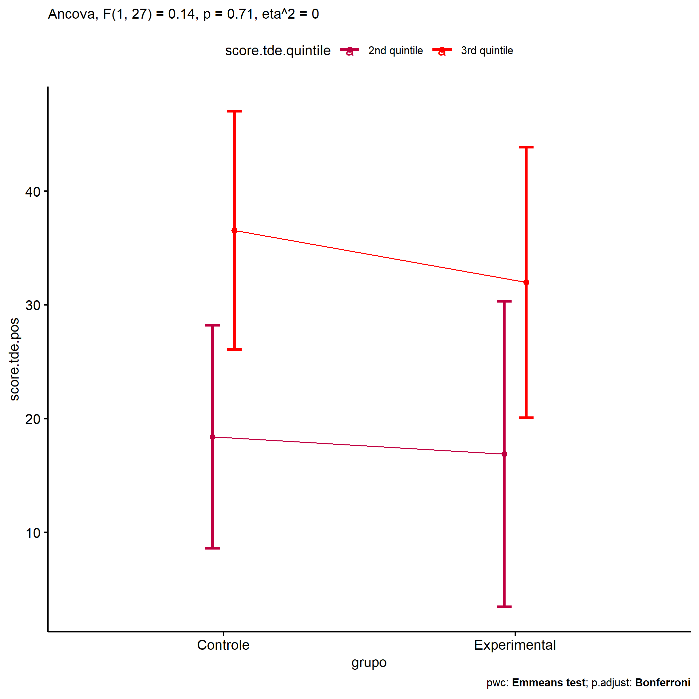
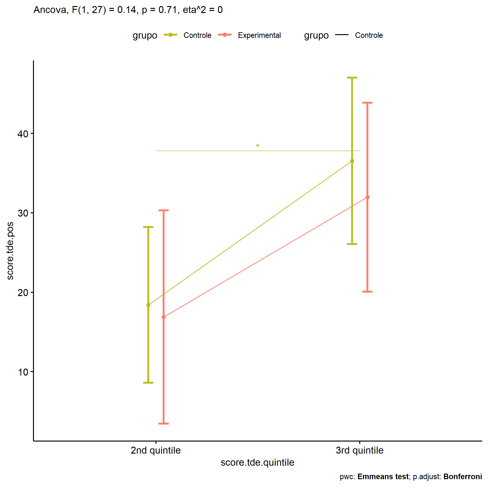
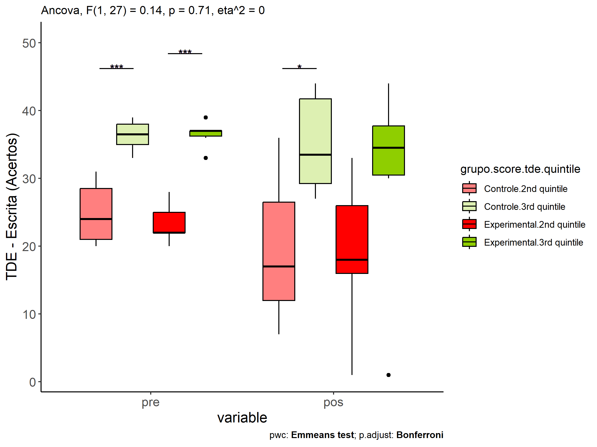
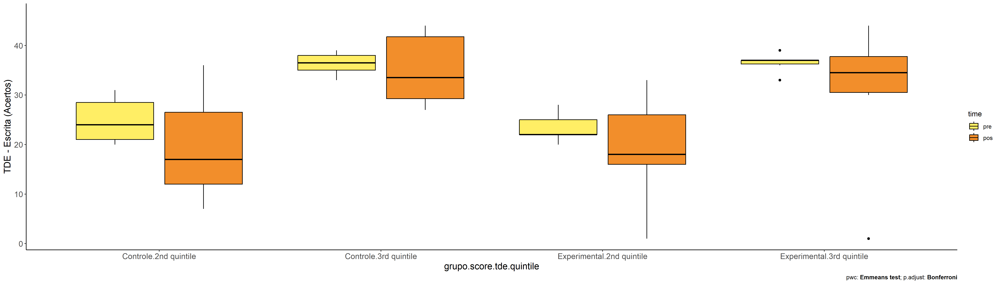

ANCOVA in TDE - Escrita (Acertos) (TDE - Escrita (Acertos))
================
Geiser C. Challco <geiser@alumni.usp.br>

- [Descriptive Statistics of Initial
  Data](#descriptive-statistics-of-initial-data)
- [Checking of Assumptions](#checking-of-assumptions)
  - [Assumption: Normality distribution of
    data](#assumption-normality-distribution-of-data)
  - [Assumption: Homogeneity of data
    distribution](#assumption-homogeneity-of-data-distribution)
- [Computation of ANCOVA test and Pairwise
  Comparison](#computation-of-ancova-test-and-pairwise-comparison)
  - [ANCOVA tests for one factor](#ancova-tests-for-one-factor)
  - [ANCOVA tests for two factors](#ancova-tests-for-two-factors)
  - [Pairwise comparisons for one factor:
    **grupo**](#pairwise-comparisons-for-one-factor-grupo)
  - [Pairwise comparisons for two
    factors](#pairwise-comparisons-for-two-factors)
    - [factores: **grupo:Sexo**](#factores-gruposexo)
    - [factores: **grupo:Zona**](#factores-grupozona)
    - [factores: **grupo:Cor.Raca**](#factores-grupocorraca)
    - [factores:
      **grupo:score.tde.quintile**](#factores-gruposcoretdequintile)

**NOTE**

- Teste ANCOVA para determinar se houve diferenças significativas no
  TDE - Escrita (Acertos) (medido usando pre- e pos-testes).
- ANCOVA test to determine whether there were significant differences in
  TDE - Escrita (Acertos) (measured using pre- and post-tests).

# Descriptive Statistics of Initial Data

| grupo        | Sexo | Zona   | Cor.Raca | score.tde.quintile | variable      |   n |   mean | median | min | max |     sd |     se |     ci |   iqr |
|:-------------|:-----|:-------|:---------|:-------------------|:--------------|----:|-------:|-------:|----:|----:|-------:|-------:|-------:|------:|
| Controle     | F    |        |          |                    | score.tde.pre |   7 | 32.571 |   31.0 |  21 |  39 |  6.399 |  2.419 |  5.918 |  7.50 |
| Controle     | M    |        |          |                    | score.tde.pre |  14 | 29.357 |   30.0 |  20 |  39 |  6.968 |  1.862 |  4.023 | 12.50 |
| Experimental | F    |        |          |                    | score.tde.pre |   3 | 28.333 |   28.0 |  20 |  37 |  8.505 |  4.910 | 21.127 |  8.50 |
| Experimental | M    |        |          |                    | score.tde.pre |   8 | 31.375 |   34.5 |  22 |  39 |  7.190 |  2.542 |  6.011 | 12.75 |
| Controle     | F    |        |          |                    | score.tde.pos |   7 | 22.857 |   27.0 |   7 |  44 | 13.801 |  5.216 | 12.764 | 20.00 |
| Controle     | M    |        |          |                    | score.tde.pos |  14 | 29.143 |   29.0 |  13 |  42 |  9.599 |  2.565 |  5.542 | 13.25 |
| Experimental | F    |        |          |                    | score.tde.pos |   3 | 18.333 |   16.0 |   1 |  38 | 18.610 | 10.745 | 46.230 | 18.50 |
| Experimental | M    |        |          |                    | score.tde.pos |   8 | 27.625 |   31.0 |   1 |  44 | 13.169 |  4.656 | 11.009 | 10.00 |
| Controle     |      | Rural  |          |                    | score.tde.pre |   9 | 30.889 |   35.0 |  21 |  39 |  7.721 |  2.574 |  5.935 | 14.00 |
| Controle     |      | Urbana |          |                    | score.tde.pre |   4 | 28.750 |   29.0 |  22 |  35 |  5.560 |  2.780 |  8.848 |  6.25 |
| Controle     |      |        |          |                    | score.tde.pre |   8 | 30.750 |   32.0 |  20 |  39 |  6.985 |  2.469 |  5.839 |  7.75 |
| Experimental |      | Rural  |          |                    | score.tde.pre |   4 | 28.750 |   29.0 |  20 |  37 |  8.995 |  4.498 | 14.314 | 14.75 |
| Experimental |      | Urbana |          |                    | score.tde.pre |   1 | 33.000 |   33.0 |  33 |  33 |        |        |        |  0.00 |
| Experimental |      |        |          |                    | score.tde.pre |   6 | 31.333 |   32.5 |  22 |  39 |  7.230 |  2.951 |  7.587 | 11.25 |
| Controle     |      | Rural  |          |                    | score.tde.pos |   9 | 30.111 |   27.0 |  17 |  44 |  8.923 |  2.974 |  6.858 | 11.00 |
| Controle     |      | Urbana |          |                    | score.tde.pos |   4 | 29.750 |   30.0 |  17 |  42 | 10.340 |  5.170 | 16.453 |  9.25 |
| Controle     |      |        |          |                    | score.tde.pos |   8 | 22.250 |   21.0 |   7 |  41 | 13.467 |  4.761 | 11.259 | 21.00 |
| Experimental |      | Rural  |          |                    | score.tde.pos |   4 | 27.000 |   24.0 |  16 |  44 | 12.910 |  6.455 | 20.543 | 16.00 |
| Experimental |      | Urbana |          |                    | score.tde.pos |   1 | 32.000 |   32.0 |  32 |  32 |        |        |        |  0.00 |
| Experimental |      |        |          |                    | score.tde.pos |   6 | 22.667 |   29.5 |   1 |  38 | 17.305 |  7.065 | 18.161 | 28.75 |
| Controle     |      |        | Parda    |                    | score.tde.pre |   8 | 33.000 |   35.5 |  21 |  39 |  6.525 |  2.307 |  5.455 |  7.75 |
| Controle     |      |        |          |                    | score.tde.pre |  13 | 28.846 |   30.0 |  20 |  38 |  6.719 |  1.863 |  4.060 | 13.00 |
| Experimental |      |        | Branca   |                    | score.tde.pre |   1 | 37.000 |   37.0 |  37 |  37 |        |        |        |  0.00 |
| Experimental |      |        | Indígena |                    | score.tde.pre |   1 | 22.000 |   22.0 |  22 |  22 |        |        |        |  0.00 |
| Experimental |      |        | Parda    |                    | score.tde.pre |   3 | 23.333 |   22.0 |  20 |  28 |  4.163 |  2.404 | 10.342 |  4.00 |
| Experimental |      |        |          |                    | score.tde.pre |   6 | 34.500 |   36.5 |  25 |  39 |  5.050 |  2.062 |  5.299 |  3.25 |
| Controle     |      |        | Parda    |                    | score.tde.pos |   8 | 27.750 |   29.5 |  10 |  37 |  8.481 |  2.999 |  7.090 |  5.50 |
| Controle     |      |        |          |                    | score.tde.pos |  13 | 26.615 |   27.0 |   7 |  44 | 12.959 |  3.594 |  7.831 | 24.00 |
| Experimental |      |        | Branca   |                    | score.tde.pos |   1 | 44.000 |   44.0 |  44 |  44 |        |        |        |  0.00 |
| Experimental |      |        | Indígena |                    | score.tde.pos |   1 | 33.000 |   33.0 |  33 |  33 |        |        |        |  0.00 |
| Experimental |      |        | Parda    |                    | score.tde.pos |   3 | 11.667 |   16.0 |   1 |  18 |  9.292 |  5.364 | 23.082 |  8.50 |
| Experimental |      |        |          |                    | score.tde.pos |   6 | 27.333 |   31.0 |   1 |  38 | 13.648 |  5.572 | 14.323 |  8.75 |
| Controle     |      |        |          | 2nd quintile       | score.tde.pre |  11 | 24.909 |   24.0 |  20 |  31 |  4.300 |  1.297 |  2.889 |  7.50 |
| Controle     |      |        |          | 3rd quintile       | score.tde.pre |  10 | 36.500 |   36.5 |  33 |  39 |  2.014 |  0.637 |  1.441 |  3.00 |
| Experimental |      |        |          | 2nd quintile       | score.tde.pre |   5 | 23.400 |   22.0 |  20 |  28 |  3.130 |  1.400 |  3.887 |  3.00 |
| Experimental |      |        |          | 3rd quintile       | score.tde.pre |   6 | 36.500 |   37.0 |  33 |  39 |  1.975 |  0.806 |  2.072 |  0.75 |
| Controle     |      |        |          | 2nd quintile       | score.tde.pos |  11 | 19.909 |   17.0 |   7 |  36 |  9.565 |  2.884 |  6.426 | 14.50 |
| Controle     |      |        |          | 3rd quintile       | score.tde.pos |  10 | 34.900 |   33.5 |  27 |  44 |  6.935 |  2.193 |  4.961 | 12.50 |
| Experimental |      |        |          | 2nd quintile       | score.tde.pos |   5 | 18.800 |   18.0 |   1 |  33 | 12.029 |  5.380 | 14.936 | 10.00 |
| Experimental |      |        |          | 3rd quintile       | score.tde.pos |   6 | 30.333 |   34.5 |   1 |  44 | 15.188 |  6.200 | 15.939 |  7.25 |

# Checking of Assumptions

## Assumption: Normality distribution of data

| var           |   n |   skewness |   kurtosis | symmetry | statistic | method       |         p | p.signif | normality |
|:--------------|----:|-----------:|-----------:|:---------|----------:|:-------------|----------:|:---------|:----------|
| score.tde.pos |  32 | -0.8886378 |  1.2473497 | NO       | 0.9438095 | Shapiro-Wilk | 0.0960662 | ns       | YES       |
| score.tde.pos |  18 |  0.1069633 | -1.4203269 | YES      | 0.9497405 | Shapiro-Wilk | 0.4209602 | ns       | YES       |
| score.tde.pos |  13 | -0.9363522 |  0.0626138 | NO       | 0.8991945 | Shapiro-Wilk | 0.1303678 | ns       | YES       |
| score.tde.pos |  32 | -0.6117451 |  0.4370437 | NO       | 0.9573098 | Shapiro-Wilk | 0.2315175 | ns       | YES       |

## Assumption: Homogeneity of data distribution

| var           | method         | formula                              |   n | DFn.df1 | DFd.df2 | statistic |         p | p.signif |
|:--------------|:---------------|:-------------------------------------|----:|--------:|--------:|----------:|----------:|:---------|
| score.tde.pos | Levene’s test  | `.res`~`grupo`\*`Sexo`               |  32 |       3 |      28 | 0.2804931 | 0.8390042 | ns       |
| score.tde.pos | Anova’s slopes | `.res`~`grupo`\*`Sexo`               |  32 |       3 |      24 | 0.9330000 | 0.4400000 | ns       |
| score.tde.pos | Levene’s test  | `.res`~`grupo`\*`Zona`               |  18 |       3 |      14 | 1.4447642 | 0.2720202 | ns       |
| score.tde.pos | Anova’s slopes | `.res`~`grupo`\*`Zona`               |  18 |       2 |      11 | 1.6180000 | 0.2420000 | ns       |
| score.tde.pos | Levene’s test  | `.res`~`grupo`\*`Cor.Raca`           |  13 |       3 |       9 | 0.3735494 | 0.7742471 | ns       |
| score.tde.pos | Anova’s slopes | `.res`~`grupo`\*`Cor.Raca`           |  13 |       1 |       7 | 2.4290000 | 0.1630000 | ns       |
| score.tde.pos | Levene’s test  | `.res`~`grupo`\*`score.tde.quintile` |  32 |       3 |      28 | 0.3875293 | 0.7628357 | ns       |
| score.tde.pos | Anova’s slopes | `.res`~`grupo`\*`score.tde.quintile` |  32 |       3 |      24 | 0.8670000 | 0.4720000 | ns       |

# Computation of ANCOVA test and Pairwise Comparison

## ANCOVA tests for one factor

|     | Effect             | DFn | DFd |      SSn |      SSd |     F |     p |   ges | p\<.05 |
|:----|:-------------------|----:|----:|---------:|---------:|------:|------:|------:|:-------|
| 1   | score.tde.pre      |   1 |  29 | 1069.366 | 3550.495 | 8.734 | 0.006 | 0.231 | \*     |
| 2   | grupo              |   1 |  29 |   30.543 | 3550.495 | 0.249 | 0.621 | 0.009 |        |
| 4   | Sexo               |   1 |  29 |  457.261 | 3123.777 | 4.245 | 0.048 | 0.128 | \*     |
| 6   | Zona               |   1 |  15 |    9.844 |  712.860 | 0.207 | 0.656 | 0.014 |        |
| 8   | Cor.Raca           |   2 |   9 |  417.464 | 1015.424 | 1.850 | 0.212 | 0.291 |        |
| 10  | score.tde.quintile |   1 |  29 |  435.894 | 3145.144 | 4.019 | 0.054 | 0.122 |        |

## ANCOVA tests for two factors

|     | Effect                   | DFn | DFd |      SSn |      SSd |      F |     p |   ges | p\<.05 |
|:----|:-------------------------|----:|----:|---------:|---------:|-------:|------:|------:|:-------|
| 1   | score.tde.pre            |   1 |  27 | 1181.769 | 3065.344 | 10.409 | 0.003 | 0.278 | \*     |
| 4   | grupo:Sexo               |   1 |  27 |   10.995 | 3065.344 |  0.097 | 0.758 | 0.004 |        |
| 8   | grupo:Zona               |   1 |  13 |    0.366 |  707.082 |  0.007 | 0.936 | 0.001 |        |
| 12  | grupo:Cor.Raca           |   0 |   8 |          |  675.958 |        |       |       |        |
| 16  | grupo:score.tde.quintile |   1 |  27 |   16.413 | 3059.218 |  0.145 | 0.706 | 0.005 |        |

## Pairwise comparisons for one factor: **grupo**

| var           | grupo        |   n | M (pre) | SE (pre) | M (unadj) | SE (unadj) | M (adj) | SE (adj) |
|:--------------|:-------------|----:|--------:|---------:|----------:|-----------:|--------:|---------:|
| score.tde.pos | Controle     |  21 |  30.429 |    1.484 |    27.048 |      2.452 |  27.082 |    2.415 |
| score.tde.pos | Experimental |  11 |  30.545 |    2.188 |    25.091 |      4.364 |  25.025 |    3.336 |

| .y.           | group1   | group2       | estimate | conf.low | conf.high |    se | statistic |     p | p.adj | p.adj.signif |
|:--------------|:---------|:-------------|---------:|---------:|----------:|------:|----------:|------:|------:|:-------------|
| score.tde.pos | Controle | Experimental |    2.057 |   -6.366 |    10.480 | 4.118 |     0.499 | 0.621 | 0.621 | ns           |
| score.tde.pre | Controle | Experimental |   -0.117 |   -5.405 |     5.171 | 2.589 |    -0.045 | 0.964 | 0.964 | ns           |

| .y.       | grupo        | group1 | group2 | estimate | conf.low | conf.high |    se | statistic |     p | p.adj | p.adj.signif |
|:----------|:-------------|:-------|:-------|---------:|---------:|----------:|------:|----------:|------:|------:|:-------------|
| score.tde | Controle     | pre    | pos    |    3.381 |   -2.829 |     9.591 | 3.104 |     1.089 | 0.280 | 0.280 | ns           |
| score.tde | Experimental | pre    | pos    |    5.455 |   -3.126 |    14.035 | 4.289 |     1.272 | 0.208 | 0.208 | ns           |

    ## Scale for colour is already present.
    ## Adding another scale for colour, which will replace the existing scale.

<!-- -->

<!-- -->

<!-- -->

## Pairwise comparisons for two factors

### factores: **grupo:Sexo**

| var           | grupo        | Sexo |   n | M (pre) | SE (pre) | M (unadj) | SE (unadj) | M (adj) | SE (adj) |
|:--------------|:-------------|:-----|----:|--------:|---------:|----------:|-----------:|--------:|---------:|
| score.tde.pos | Controle     | F    |   7 |  32.571 |    2.419 |    22.857 |      5.216 |  21.212 |    3.899 |
| score.tde.pos | Controle     | M    |  14 |  29.357 |    1.862 |    29.143 |      2.565 |  30.308 |    2.757 |
| score.tde.pos | Experimental | M    |   8 |  31.375 |    2.542 |    27.625 |      4.656 |  27.026 |    3.616 |

|     | .y.           | grupo    | Sexo | group1   | group2       | estimate | conf.low | conf.high |    se | statistic |     p | p.adj | p.adj.signif |
|:----|:--------------|:---------|:-----|:---------|:-------------|---------:|---------:|----------:|------:|----------:|------:|------:|:-------------|
| 2   | score.tde.pos |          | M    | Controle | Experimental |    3.282 |   -6.118 |    12.682 | 4.564 |     0.719 | 0.479 | 0.479 | ns           |
| 4   | score.tde.pre |          | M    | Controle | Experimental |   -2.018 |   -8.306 |     4.271 | 3.059 |    -0.660 | 0.515 | 0.515 | ns           |
| 5   | score.tde.pos | Controle |      | F        | M            |   -9.096 |  -19.020 |     0.829 | 4.819 |    -1.888 | 0.071 | 0.071 | ns           |
| 7   | score.tde.pre | Controle |      | F        | M            |    3.214 |   -3.354 |     9.782 | 3.195 |     1.006 | 0.324 | 0.324 | ns           |

| .y.       | grupo        | Sexo | group1 | group2 | estimate | conf.low | conf.high |    se | statistic |     p | p.adj | p.adj.signif |
|:----------|:-------------|:-----|:-------|:-------|---------:|---------:|----------:|------:|----------:|------:|------:|:-------------|
| score.tde | Controle     | F    | pre    | pos    |    9.714 |   -0.584 |    20.012 | 5.132 |     1.893 | 0.064 | 0.064 | ns           |
| score.tde | Controle     | M    | pre    | pos    |    0.214 |   -7.067 |     7.496 | 3.629 |     0.059 | 0.953 | 0.953 | ns           |
| score.tde | Experimental | M    | pre    | pos    |    3.750 |   -5.883 |    13.383 | 4.800 |     0.781 | 0.438 | 0.438 | ns           |

<!-- -->

<!-- -->

### factores: **grupo:Zona**

### factores: **grupo:Cor.Raca**

### factores: **grupo:score.tde.quintile**

| var           | grupo        | score.tde.quintile |   n | M (pre) | SE (pre) | M (unadj) | SE (unadj) | M (adj) | SE (adj) |
|:--------------|:-------------|:-------------------|----:|--------:|---------:|----------:|-----------:|--------:|---------:|
| score.tde.pos | Controle     | 2nd quintile       |  11 |  24.909 |    1.297 |    19.909 |      2.884 |  18.397 |    4.775 |
| score.tde.pos | Controle     | 3rd quintile       |  10 |  36.500 |    0.637 |    34.900 |      2.193 |  36.541 |    5.103 |
| score.tde.pos | Experimental | 2nd quintile       |   5 |  23.400 |    1.400 |    18.800 |      5.380 |  16.877 |    6.548 |
| score.tde.pos | Experimental | 3rd quintile       |   6 |  36.500 |    0.806 |    30.333 |      6.200 |  31.974 |    5.796 |

| .y.           | grupo        | score.tde.quintile | group1       | group2       | estimate | conf.low | conf.high |     se | statistic | p       | p.adj   | p.adj.signif |
|:--------------|:-------------|:-------------------|:-------------|:-------------|---------:|---------:|----------:|-------:|----------:|:--------|:--------|:-------------|
| score.tde.pos |              | 2nd quintile       | Controle     | Experimental |    1.520 |  -10.424 |    13.463 |  5.821 |     0.261 | 0.796   | 0.796   | ns           |
| score.tde.pos |              | 3rd quintile       | Controle     | Experimental |    4.567 |   -6.712 |    15.845 |  5.497 |     0.831 | 0.413   | 0.413   | ns           |
| score.tde.pre |              | 2nd quintile       | Controle     | Experimental |    1.509 |   -1.985 |     5.004 |  1.706 |     0.885 | 0.384   | 0.384   | ns           |
| score.tde.pre |              | 3rd quintile       | Controle     | Experimental |    0.000 |   -3.346 |     3.346 |  1.633 |     0.000 | 1       | 1       | ns           |
| score.tde.pos | Controle     |                    | 2nd quintile | 3rd quintile |  -18.144 |  -36.028 |    -0.259 |  8.716 |    -2.082 | 0.047   | 0.047   | \*           |
| score.tde.pos | Experimental |                    | 2nd quintile | 3rd quintile |  -15.097 |  -36.710 |     6.517 | 10.534 |    -1.433 | 0.163   | 0.163   | ns           |
| score.tde.pre | Controle     |                    | 2nd quintile | 3rd quintile |  -11.591 |  -14.422 |    -8.760 |  1.382 |    -8.387 | \<0.001 | \<0.001 | \*\*\*\*     |
| score.tde.pre | Experimental |                    | 2nd quintile | 3rd quintile |  -13.100 |  -17.023 |    -9.177 |  1.915 |    -6.840 | \<0.001 | \<0.001 | \*\*\*\*     |

| .y.       | grupo        | score.tde.quintile | group1 | group2 | estimate | conf.low | conf.high |    se | statistic |     p | p.adj | p.adj.signif |
|:----------|:-------------|:-------------------|:-------|:-------|---------:|---------:|----------:|------:|----------:|------:|------:|:-------------|
| score.tde | Controle     | 2nd quintile       | pre    | pos    |    5.000 |   -1.617 |    11.617 | 3.303 |     1.514 | 0.136 | 0.136 | ns           |
| score.tde | Controle     | 3rd quintile       | pre    | pos    |    1.600 |   -5.339 |     8.539 | 3.464 |     0.462 | 0.646 | 0.646 | ns           |
| score.tde | Experimental | 2nd quintile       | pre    | pos    |    4.600 |   -5.214 |    14.414 | 4.899 |     0.939 | 0.352 | 0.352 | ns           |
| score.tde | Experimental | 3rd quintile       | pre    | pos    |    6.167 |   -2.792 |    15.126 | 4.472 |     1.379 | 0.173 | 0.173 | ns           |

    ## Scale for colour is already present.
    ## Adding another scale for colour, which will replace the existing scale.

<!-- -->

    ## Scale for colour is already present.
    ## Adding another scale for colour, which will replace the existing scale.

<!-- -->

<!-- -->

<!-- -->
