ANCOVA in TDE - Escrita (Acertos) (TDE - Escrita (Acertos))
================
Geiser C. Challco <geiser@alumni.usp.br>

- [Descriptive Statistics of Initial
  Data](#descriptive-statistics-of-initial-data)
- [Checking of Assumptions](#checking-of-assumptions)
  - [Assumption: Normality distribution of
    data](#assumption-normality-distribution-of-data)
  - [Assumption: Homogeneity of data
    distribution](#assumption-homogeneity-of-data-distribution)
- [Computation of ANCOVA test and Pairwise
  Comparison](#computation-of-ancova-test-and-pairwise-comparison)
  - [ANCOVA tests for one factor](#ancova-tests-for-one-factor)
  - [ANCOVA tests for two factors](#ancova-tests-for-two-factors)
  - [Pairwise comparisons for one factor:
    **grupo**](#pairwise-comparisons-for-one-factor-grupo)
  - [Pairwise comparisons for two
    factors](#pairwise-comparisons-for-two-factors)
    - [factores: **grupo:Sexo**](#factores-gruposexo)
    - [factores: **grupo:Zona**](#factores-grupozona)
    - [factores: **grupo:Cor.Raca**](#factores-grupocorraca)
    - [factores:
      **grupo:score.tde.quintile**](#factores-gruposcoretdequintile)

**NOTE**

- Teste ANCOVA para determinar se houve diferenças significativas no
  TDE - Escrita (Acertos) (medido usando pre- e pos-testes).
- ANCOVA test to determine whether there were significant differences in
  TDE - Escrita (Acertos) (measured using pre- and post-tests).

# Descriptive Statistics of Initial Data

| grupo        | Sexo | Zona   | Cor.Raca | score.tde.quintile | variable      |   n |   mean | median | min | max |     sd |    se |     ci |   iqr |
|:-------------|:-----|:-------|:---------|:-------------------|:--------------|----:|-------:|-------:|----:|----:|-------:|------:|-------:|------:|
| Controle     | F    |        |          |                    | score.tde.pre |  48 | 31.729 |   31.5 |  20 |  41 |  6.066 | 0.876 |  1.761 | 11.00 |
| Controle     | M    |        |          |                    | score.tde.pre |  62 | 30.677 |   30.0 |  17 |  46 |  6.796 | 0.863 |  1.726 | 11.00 |
| Experimental | F    |        |          |                    | score.tde.pre |  18 | 31.111 |   32.0 |  20 |  40 |  6.115 | 1.441 |  3.041 |  9.25 |
| Experimental | M    |        |          |                    | score.tde.pre |  28 | 29.321 |   26.5 |  19 |  46 |  7.775 | 1.469 |  3.015 | 14.25 |
| Controle     | F    |        |          |                    | score.tde.pos |  48 | 28.208 |   28.5 |   7 |  63 | 11.567 | 1.669 |  3.359 | 15.00 |
| Controle     | M    |        |          |                    | score.tde.pos |  62 | 29.403 |   29.5 |   0 |  59 | 12.929 | 1.642 |  3.283 | 18.75 |
| Experimental | F    |        |          |                    | score.tde.pos |  18 | 27.111 |   26.5 |   1 |  44 | 10.471 | 2.468 |  5.207 | 11.25 |
| Experimental | M    |        |          |                    | score.tde.pos |  28 | 26.214 |   24.0 |   1 |  50 | 13.014 | 2.459 |  5.046 | 19.25 |
| Controle     |      | Rural  |          |                    | score.tde.pre |  66 | 31.212 |   31.0 |  17 |  46 |  6.880 | 0.847 |  1.691 | 11.75 |
| Controle     |      | Urbana |          |                    | score.tde.pre |  11 | 29.000 |   28.0 |  22 |  39 |  4.940 | 1.489 |  3.318 |  6.00 |
| Controle     |      |        |          |                    | score.tde.pre |  33 | 31.697 |   33.0 |  20 |  39 |  6.111 | 1.064 |  2.167 |  9.00 |
| Experimental |      | Rural  |          |                    | score.tde.pre |  31 | 29.645 |   28.0 |  19 |  46 |  7.579 | 1.361 |  2.780 | 13.50 |
| Experimental |      | Urbana |          |                    | score.tde.pre |   5 | 29.200 |   30.0 |  21 |  38 |  6.834 | 3.056 |  8.485 |  9.00 |
| Experimental |      |        |          |                    | score.tde.pre |  10 | 31.600 |   30.5 |  22 |  40 |  6.328 | 2.001 |  4.527 |  9.75 |
| Controle     |      | Rural  |          |                    | score.tde.pos |  66 | 28.015 |   27.5 |   0 |  50 | 11.830 | 1.456 |  2.908 | 14.00 |
| Controle     |      | Urbana |          |                    | score.tde.pos |  11 | 28.364 |   29.0 |   8 |  42 |  9.973 | 3.007 |  6.700 | 11.50 |
| Controle     |      |        |          |                    | score.tde.pos |  33 | 30.788 |   30.0 |   7 |  63 | 13.986 | 2.435 |  4.959 | 20.00 |
| Experimental |      | Rural  |          |                    | score.tde.pos |  31 | 28.065 |   26.0 |  11 |  50 | 11.144 | 2.002 |  4.088 | 19.50 |
| Experimental |      | Urbana |          |                    | score.tde.pos |   5 | 22.600 |   25.0 |   2 |  36 | 13.409 | 5.997 | 16.649 | 14.00 |
| Experimental |      |        |          |                    | score.tde.pos |  10 | 23.900 |   27.0 |   1 |  38 | 14.067 | 4.448 | 10.063 | 17.75 |
| Controle     |      |        | Branca   |                    | score.tde.pre |  11 | 33.000 |   31.0 |  20 |  46 |  7.861 | 2.370 |  5.281 |  9.50 |
| Controle     |      |        | Indígena |                    | score.tde.pre |   2 | 37.500 |   37.5 |  34 |  41 |  4.950 | 3.500 | 44.472 |  3.50 |
| Controle     |      |        | Parda    |                    | score.tde.pre |  50 | 31.060 |   31.0 |  17 |  42 |  6.412 | 0.907 |  1.822 | 11.00 |
| Controle     |      |        | Preta    |                    | score.tde.pre |   1 | 26.000 |   26.0 |  26 |  26 |        |       |        |  0.00 |
| Controle     |      |        |          |                    | score.tde.pre |  46 | 30.609 |   30.5 |  20 |  39 |  6.256 | 0.922 |  1.858 | 11.00 |
| Experimental |      |        | Branca   |                    | score.tde.pre |   5 | 35.200 |   37.0 |  21 |  46 |  9.094 | 4.067 | 11.292 |  4.00 |
| Experimental |      |        | Indígena |                    | score.tde.pre |   8 | 30.000 |   27.0 |  21 |  42 |  8.401 | 2.970 |  7.023 | 14.25 |
| Experimental |      |        | Parda    |                    | score.tde.pre |  17 | 26.647 |   25.0 |  19 |  40 |  6.103 | 1.480 |  3.138 |  8.00 |
| Experimental |      |        |          |                    | score.tde.pre |  16 | 32.000 |   33.0 |  23 |  40 |  5.727 | 1.432 |  3.052 | 10.50 |
| Controle     |      |        | Branca   |                    | score.tde.pos |  11 | 36.000 |   36.0 |  16 |  63 | 11.533 | 3.477 |  7.748 |  8.50 |
| Controle     |      |        | Indígena |                    | score.tde.pos |   2 | 26.500 |   26.5 |  25 |  28 |  2.121 | 1.500 | 19.059 |  1.50 |
| Controle     |      |        | Parda    |                    | score.tde.pos |  50 | 25.920 |   25.5 |   0 |  50 | 12.128 | 1.715 |  3.447 | 12.75 |
| Controle     |      |        | Preta    |                    | score.tde.pos |   1 | 40.000 |   40.0 |  40 |  40 |        |       |        |  0.00 |
| Controle     |      |        |          |                    | score.tde.pos |  46 | 30.261 |   32.0 |   5 |  59 | 12.259 | 1.808 |  3.641 | 20.00 |
| Experimental |      |        | Branca   |                    | score.tde.pos |   5 | 33.800 |   37.0 |   2 |  50 | 18.660 | 8.345 | 23.170 |  8.00 |
| Experimental |      |        | Indígena |                    | score.tde.pos |   8 | 29.250 |   26.5 |  15 |  50 | 11.877 | 4.199 |  9.930 | 14.00 |
| Experimental |      |        | Parda    |                    | score.tde.pos |  17 | 24.059 |   22.0 |   1 |  43 | 10.503 | 2.547 |  5.400 | 11.00 |
| Experimental |      |        |          |                    | score.tde.pos |  16 | 25.625 |   26.0 |   1 |  44 | 11.135 | 2.784 |  5.933 | 14.50 |
| Controle     |      |        |          | 1st quintile       | score.tde.pre |   1 | 17.000 |   17.0 |  17 |  17 |        |       |        |  0.00 |
| Controle     |      |        |          | 2nd quintile       | score.tde.pre |  58 | 26.121 |   26.0 |  20 |  31 |  3.559 | 0.467 |  0.936 |  6.50 |
| Controle     |      |        |          | 3rd quintile       | score.tde.pre |  49 | 36.796 |   37.0 |  32 |  42 |  2.236 | 0.319 |  0.642 |  4.00 |
| Controle     |      |        |          | 4th quintile       | score.tde.pre |   2 | 45.000 |   45.0 |  44 |  46 |  1.414 | 1.000 | 12.706 |  1.00 |
| Experimental |      |        |          | 2nd quintile       | score.tde.pre |  25 | 24.280 |   24.0 |  19 |  30 |  3.156 | 0.631 |  1.303 |  5.00 |
| Experimental |      |        |          | 3rd quintile       | score.tde.pre |  20 | 36.400 |   37.0 |  32 |  42 |  2.998 | 0.670 |  1.403 |  4.50 |
| Experimental |      |        |          | 4th quintile       | score.tde.pre |   1 | 46.000 |   46.0 |  46 |  46 |        |       |        |  0.00 |
| Controle     |      |        |          | 1st quintile       | score.tde.pos |   1 | 24.000 |   24.0 |  24 |  24 |        |       |        |  0.00 |
| Controle     |      |        |          | 2nd quintile       | score.tde.pos |  58 | 24.310 |   24.0 |   0 |  48 | 11.494 | 1.509 |  3.022 | 15.75 |
| Controle     |      |        |          | 3rd quintile       | score.tde.pos |  49 | 33.939 |   34.0 |   5 |  63 | 11.401 | 1.629 |  3.275 | 15.00 |
| Controle     |      |        |          | 4th quintile       | score.tde.pos |   2 | 40.000 |   40.0 |  37 |  43 |  4.243 | 3.000 | 38.119 |  3.00 |
| Experimental |      |        |          | 2nd quintile       | score.tde.pos |  25 | 21.320 |   19.0 |   1 |  43 |  9.577 | 1.915 |  3.953 |  9.00 |
| Experimental |      |        |          | 3rd quintile       | score.tde.pos |  20 | 31.950 |   34.0 |   1 |  50 | 11.302 | 2.527 |  5.289 | 11.75 |
| Experimental |      |        |          | 4th quintile       | score.tde.pos |   1 | 50.000 |   50.0 |  50 |  50 |        |       |        |  0.00 |

# Checking of Assumptions

## Assumption: Normality distribution of data

| var           |   n |   skewness |   kurtosis | symmetry | statistic | method     |         p | p.signif | normality |
|:--------------|----:|-----------:|-----------:|:---------|----------:|:-----------|----------:|:---------|:----------|
| score.tde.pos | 156 | -0.3189686 |  0.2788173 | YES      | 3.8675375 | D’Agostino | 0.1446022 | ns       | QQ        |
| score.tde.pos | 113 | -0.3144965 | -0.1471563 | YES      | 2.0615889 | D’Agostino | 0.3567235 | ns       | QQ        |
| score.tde.pos |  94 | -0.0166924 | -0.2415826 | YES      | 0.0138569 | D’Agostino | 0.9930955 | ns       | YES       |
| score.tde.pos | 156 | -0.2793099 |  0.1672929 | YES      | 2.7881952 | D’Agostino | 0.2480568 | ns       | QQ        |

## Assumption: Homogeneity of data distribution

| var           | method         | formula                              |   n | DFn.df1 | DFd.df2 | statistic |         p | p.signif |
|:--------------|:---------------|:-------------------------------------|----:|--------:|--------:|----------:|----------:|:---------|
| score.tde.pos | Levene’s test  | `.res`~`grupo`\*`Sexo`               | 156 |       3 |     152 | 1.6462340 | 0.1811004 | ns       |
| score.tde.pos | Anova’s slopes | `.res`~`grupo`\*`Sexo`               | 156 |       3 |     148 | 0.5910000 | 0.6220000 | ns       |
| score.tde.pos | Levene’s test  | `.res`~`grupo`\*`Zona`               | 113 |       3 |     109 | 1.6795712 | 0.1756338 | ns       |
| score.tde.pos | Anova’s slopes | `.res`~`grupo`\*`Zona`               | 113 |       3 |     105 | 0.9970000 | 0.3970000 | ns       |
| score.tde.pos | Levene’s test  | `.res`~`grupo`\*`Cor.Raca`           |  94 |       6 |      87 | 0.6532692 | 0.6873615 | ns       |
| score.tde.pos | Anova’s slopes | `.res`~`grupo`\*`Cor.Raca`           |  94 |       5 |      81 | 1.0040000 | 0.4210000 | ns       |
| score.tde.pos | Levene’s test  | `.res`~`grupo`\*`score.tde.quintile` | 156 |       6 |     149 | 1.0736454 | 0.3808975 | ns       |
| score.tde.pos | Anova’s slopes | `.res`~`grupo`\*`score.tde.quintile` | 156 |       4 |     144 | 0.7520000 | 0.5590000 | ns       |

# Computation of ANCOVA test and Pairwise Comparison

## ANCOVA tests for one factor

|     | Effect             | DFn | DFd |      SSn |       SSd |      F | p       |   ges | p\<.05 |
|:----|:-------------------|----:|----:|---------:|----------:|-------:|:--------|------:|:-------|
| 1   | score.tde.pre      |   1 | 153 | 5245.188 | 17723.580 | 45.279 | \<0.001 | 0.228 | \*     |
| 2   | grupo              |   1 | 153 |   58.194 | 17723.580 |  0.502 | 0.48    | 0.003 |        |
| 4   | Sexo               |   1 | 153 |  104.732 | 17677.042 |  0.906 | 0.343   | 0.006 |        |
| 6   | Zona               |   1 | 110 |    0.150 | 11037.114 |  0.001 | 0.969   | 0.000 |        |
| 8   | Cor.Raca           |   3 |  89 |  860.122 |  9902.185 |  2.577 | 0.059   | 0.080 |        |
| 10  | score.tde.quintile |   3 | 151 |   85.486 | 17696.288 |  0.243 | 0.866   | 0.005 |        |

## ANCOVA tests for two factors

|     | Effect                   | DFn | DFd |      SSn |       SSd |      F | p       |   ges | p\<.05 |
|:----|:-------------------------|----:|----:|---------:|----------:|-------:|:--------|------:|:-------|
| 1   | score.tde.pre            |   1 | 151 | 5324.210 | 17597.118 | 45.687 | \<0.001 | 0.232 | \*     |
| 4   | grupo:Sexo               |   1 | 151 |   16.149 | 17597.118 |  0.139 | 0.71    | 0.001 |        |
| 8   | grupo:Zona               |   1 | 108 |  156.841 | 10877.646 |  1.557 | 0.215   | 0.014 |        |
| 12  | grupo:Cor.Raca           |   2 |  86 |  198.074 |  9676.126 |  0.880 | 0.418   | 0.020 |        |
| 16  | grupo:score.tde.quintile |   2 | 148 |   76.338 | 17561.369 |  0.322 | 0.725   | 0.004 |        |

## Pairwise comparisons for one factor: **grupo**

| var           | grupo        |   n | M (pre) | SE (pre) | M (unadj) | SE (unadj) | M (adj) | SE (adj) |
|:--------------|:-------------|----:|--------:|---------:|----------:|-----------:|--------:|---------:|
| score.tde.pos | Controle     | 110 |  31.136 |    0.618 |    28.882 |      1.174 |  28.595 |    1.027 |
| score.tde.pos | Experimental |  46 |  30.022 |    1.055 |    26.565 |      1.765 |  27.251 |    1.590 |

| .y.           | group1   | group2       | estimate | conf.low | conf.high |    se | statistic |     p | p.adj | p.adj.signif |
|:--------------|:---------|:-------------|---------:|---------:|----------:|------:|----------:|------:|------:|:-------------|
| score.tde.pos | Controle | Experimental |    1.343 |   -2.401 |     5.088 | 1.895 |     0.709 | 0.480 | 0.480 | ns           |
| score.tde.pre | Controle | Experimental |    1.115 |   -1.204 |     3.433 | 1.174 |     0.950 | 0.344 | 0.344 | ns           |

| .y.       | grupo        | group1 | group2 | estimate | conf.low | conf.high |    se | statistic |     p | p.adj | p.adj.signif |
|:----------|:-------------|:-------|:-------|---------:|---------:|----------:|------:|----------:|------:|------:|:-------------|
| score.tde | Controle     | pre    | pos    |    2.255 |   -0.357 |     4.866 | 1.327 |     1.698 | 0.090 | 0.090 | ns           |
| score.tde | Experimental | pre    | pos    |    3.457 |   -0.583 |     7.496 | 2.053 |     1.684 | 0.093 | 0.093 | ns           |

    ## Scale for colour is already present.
    ## Adding another scale for colour, which will replace the existing scale.

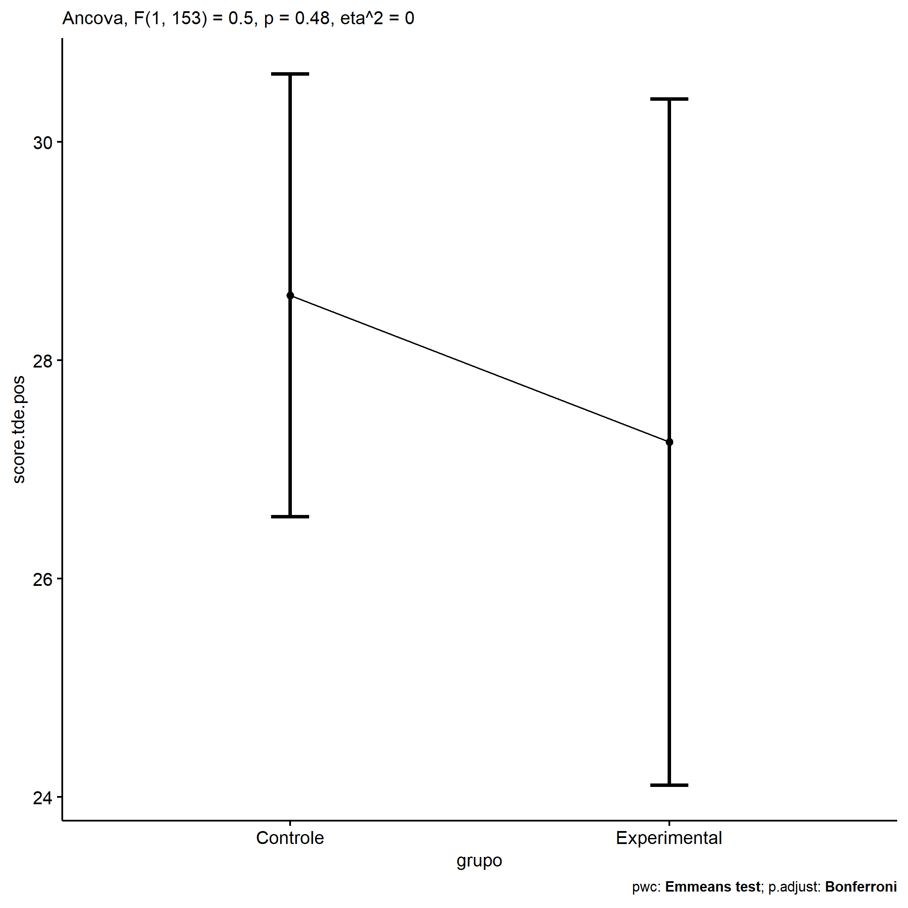<!-- -->

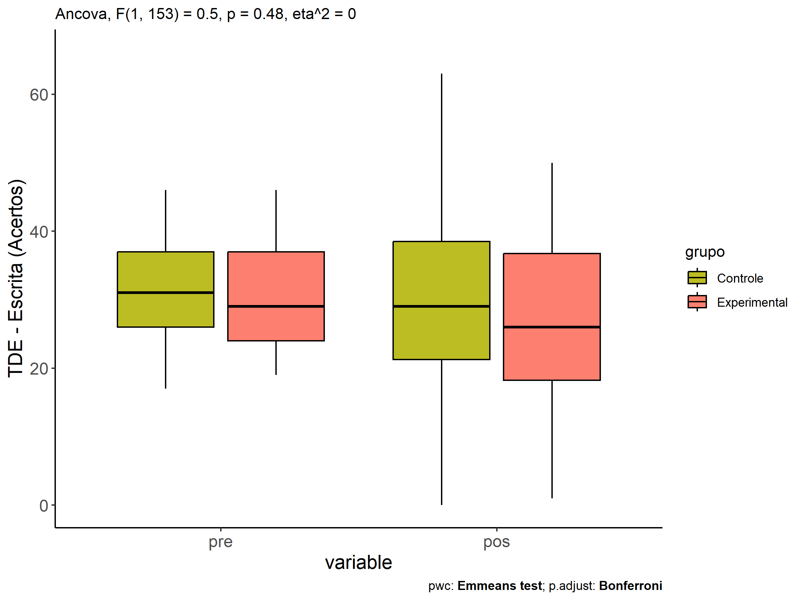<!-- -->

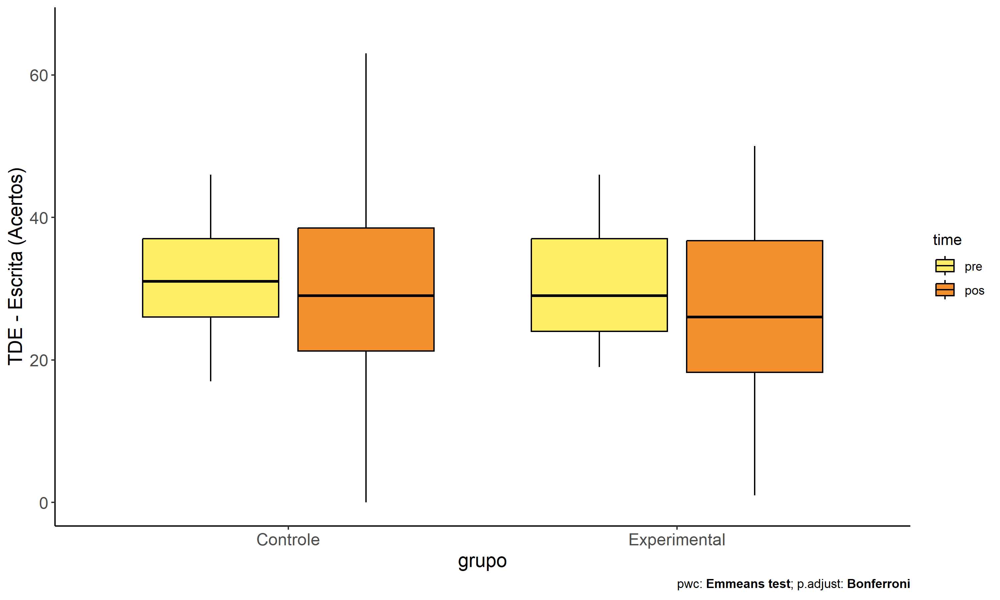<!-- -->

## Pairwise comparisons for two factors

### factores: **grupo:Sexo**

| var           | grupo        | Sexo |   n | M (pre) | SE (pre) | M (unadj) | SE (unadj) | M (adj) | SE (adj) |
|:--------------|:-------------|:-----|----:|--------:|---------:|----------:|-----------:|--------:|---------:|
| score.tde.pos | Controle     | F    |  48 |  31.729 |    0.876 |    28.208 |      1.669 |  27.394 |    1.563 |
| score.tde.pos | Controle     | M    |  62 |  30.677 |    0.863 |    29.403 |      1.642 |  29.518 |    1.371 |
| score.tde.pos | Experimental | F    |  18 |  31.111 |    1.441 |    27.111 |      2.468 |  26.843 |    2.545 |
| score.tde.pos | Experimental | M    |  28 |  29.321 |    1.469 |    26.214 |      2.459 |  27.528 |    2.049 |

| .y.           | grupo        | Sexo | group1   | group2       | estimate | conf.low | conf.high |    se | statistic |     p | p.adj | p.adj.signif |
|:--------------|:-------------|:-----|:---------|:-------------|---------:|---------:|----------:|------:|----------:|------:|------:|:-------------|
| score.tde.pos |              | F    | Controle | Experimental |    0.551 |   -5.346 |     6.448 | 2.985 |     0.185 | 0.854 | 0.854 | ns           |
| score.tde.pos |              | M    | Controle | Experimental |    1.990 |   -2.879 |     6.859 | 2.464 |     0.808 | 0.421 | 0.421 | ns           |
| score.tde.pre |              | F    | Controle | Experimental |    0.618 |   -3.038 |     4.274 | 1.851 |     0.334 | 0.739 | 0.739 | ns           |
| score.tde.pre |              | M    | Controle | Experimental |    1.356 |   -1.656 |     4.368 | 1.525 |     0.889 | 0.375 | 0.375 | ns           |
| score.tde.pos | Controle     |      | F        | M            |   -2.125 |   -6.234 |     1.985 | 2.080 |    -1.021 | 0.309 | 0.309 | ns           |
| score.tde.pos | Experimental |      | F        | M            |   -0.685 |   -7.145 |     5.775 | 3.270 |    -0.210 | 0.834 | 0.834 | ns           |
| score.tde.pre | Controle     |      | F        | M            |    1.052 |   -1.492 |     3.595 | 1.287 |     0.817 | 0.415 | 0.415 | ns           |
| score.tde.pre | Experimental |      | F        | M            |    1.790 |   -2.207 |     5.786 | 2.023 |     0.885 | 0.378 | 0.378 | ns           |

| .y.       | grupo        | Sexo | group1 | group2 | estimate | conf.low | conf.high |    se | statistic |     p | p.adj | p.adj.signif |
|:----------|:-------------|:-----|:-------|:-------|---------:|---------:|----------:|------:|----------:|------:|------:|:-------------|
| score.tde | Controle     | F    | pre    | pos    |    3.521 |   -0.452 |     7.493 | 2.019 |     1.744 | 0.082 | 0.082 | ns           |
| score.tde | Controle     | M    | pre    | pos    |    1.274 |   -2.221 |     4.770 | 1.776 |     0.717 | 0.474 | 0.474 | ns           |
| score.tde | Experimental | F    | pre    | pos    |    4.000 |   -2.487 |    10.487 | 3.297 |     1.213 | 0.226 | 0.226 | ns           |
| score.tde | Experimental | M    | pre    | pos    |    3.107 |   -2.094 |     8.309 | 2.643 |     1.175 | 0.241 | 0.241 | ns           |

    ## Scale for colour is already present.
    ## Adding another scale for colour, which will replace the existing scale.

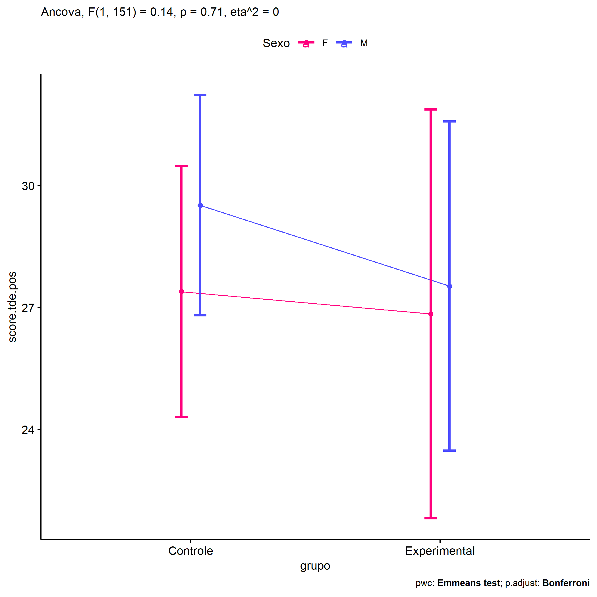<!-- -->

    ## Scale for colour is already present.
    ## Adding another scale for colour, which will replace the existing scale.

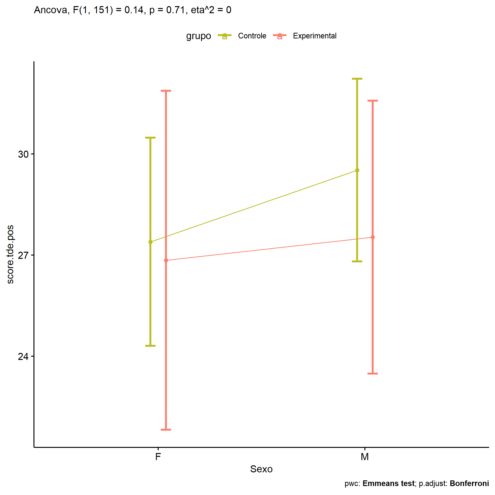<!-- -->

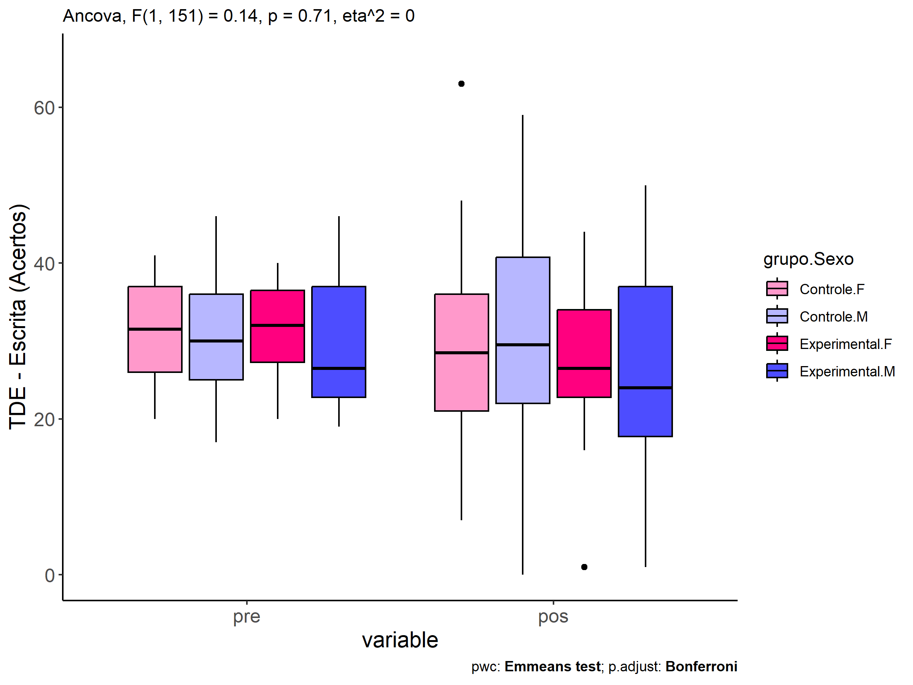<!-- -->

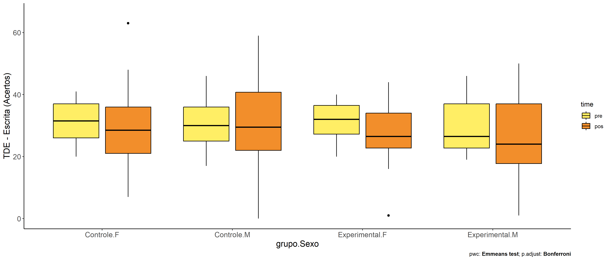<!-- -->

### factores: **grupo:Zona**

| var           | grupo        | Zona   |   n | M (pre) | SE (pre) | M (unadj) | SE (unadj) | M (adj) | SE (adj) |
|:--------------|:-------------|:-------|----:|--------:|---------:|----------:|-----------:|--------:|---------:|
| score.tde.pos | Controle     | Rural  |  66 |  31.212 |    0.847 |    28.015 |      1.456 |  27.401 |    1.240 |
| score.tde.pos | Controle     | Urbana |  11 |  29.000 |    1.489 |    28.364 |      3.007 |  29.600 |    3.033 |
| score.tde.pos | Experimental | Rural  |  31 |  29.645 |    1.361 |    28.065 |      2.002 |  28.761 |    1.806 |
| score.tde.pos | Experimental | Urbana |   5 |  29.200 |    3.056 |    22.600 |      5.997 |  23.669 |    4.492 |

| .y.           | grupo        | Zona   | group1   | group2       | estimate | conf.low | conf.high |    se | statistic |     p | p.adj | p.adj.signif |
|:--------------|:-------------|:-------|:---------|:-------------|---------:|---------:|----------:|------:|----------:|------:|------:|:-------------|
| score.tde.pos |              | Rural  | Controle | Experimental |   -1.360 |   -5.713 |     2.993 | 2.196 |    -0.619 | 0.537 | 0.537 | ns           |
| score.tde.pos |              | Urbana | Controle | Experimental |    5.931 |   -4.799 |    16.660 | 5.413 |     1.096 | 0.276 | 0.276 | ns           |
| score.tde.pre |              | Rural  | Controle | Experimental |    1.567 |   -1.423 |     4.557 | 1.508 |     1.039 | 0.301 | 0.301 | ns           |
| score.tde.pre |              | Urbana | Controle | Experimental |   -0.200 |   -7.605 |     7.205 | 3.736 |    -0.054 | 0.957 | 0.957 | ns           |
| score.tde.pos | Controle     |        | Rural    | Urbana       |   -2.199 |   -8.706 |     4.308 | 3.283 |    -0.670 | 0.504 | 0.504 | ns           |
| score.tde.pos | Experimental |        | Rural    | Urbana       |    5.092 |   -4.496 |    14.680 | 4.837 |     1.053 | 0.295 | 0.295 | ns           |
| score.tde.pre | Controle     |        | Rural    | Urbana       |    2.212 |   -2.259 |     6.684 | 2.256 |     0.981 | 0.329 | 0.329 | ns           |
| score.tde.pre | Experimental |        | Rural    | Urbana       |    0.445 |   -6.172 |     7.062 | 3.339 |     0.133 | 0.894 | 0.894 | ns           |

| .y.       | grupo        | Zona   | group1 | group2 | estimate | conf.low | conf.high |    se | statistic |     p | p.adj | p.adj.signif |
|:----------|:-------------|:-------|:-------|:-------|---------:|---------:|----------:|------:|----------:|------:|------:|:-------------|
| score.tde | Controle     | Rural  | pre    | pos    |    3.197 |   -0.070 |     6.464 | 1.658 |     1.929 | 0.055 | 0.055 | ns           |
| score.tde | Controle     | Urbana | pre    | pos    |    0.636 |   -7.366 |     8.639 | 4.060 |     0.157 | 0.876 | 0.876 | ns           |
| score.tde | Experimental | Rural  | pre    | pos    |    1.581 |   -3.186 |     6.348 | 2.419 |     0.654 | 0.514 | 0.514 | ns           |
| score.tde | Experimental | Urbana | pre    | pos    |    6.600 |   -5.270 |    18.470 | 6.023 |     1.096 | 0.274 | 0.274 | ns           |

    ## Scale for colour is already present.
    ## Adding another scale for colour, which will replace the existing scale.

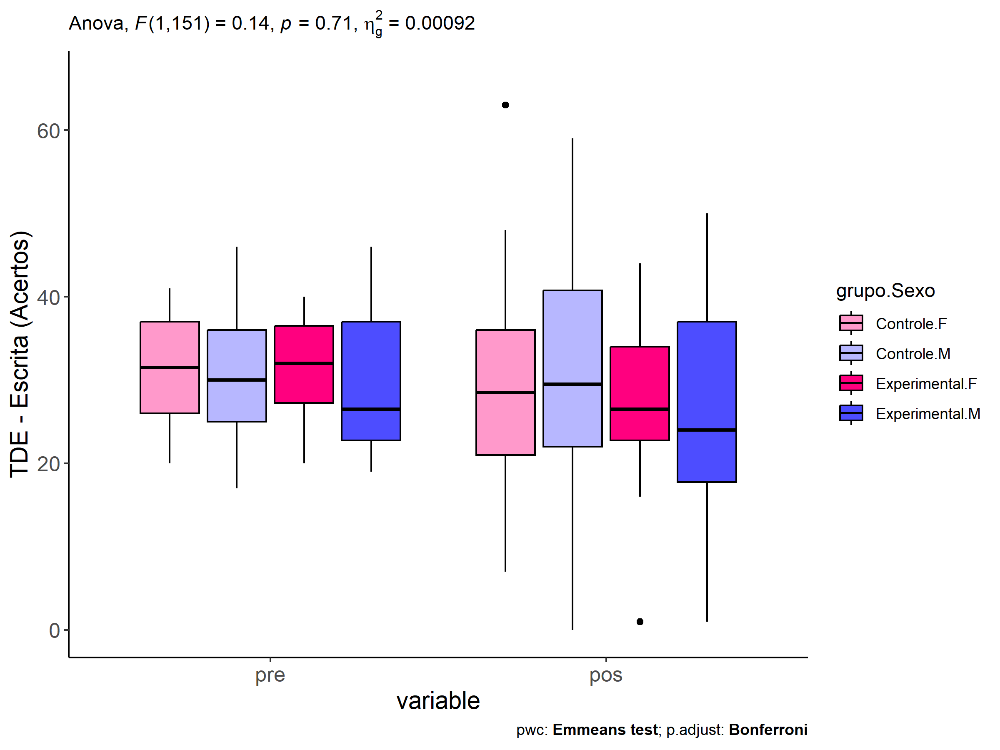<!-- -->

    ## Scale for colour is already present.
    ## Adding another scale for colour, which will replace the existing scale.

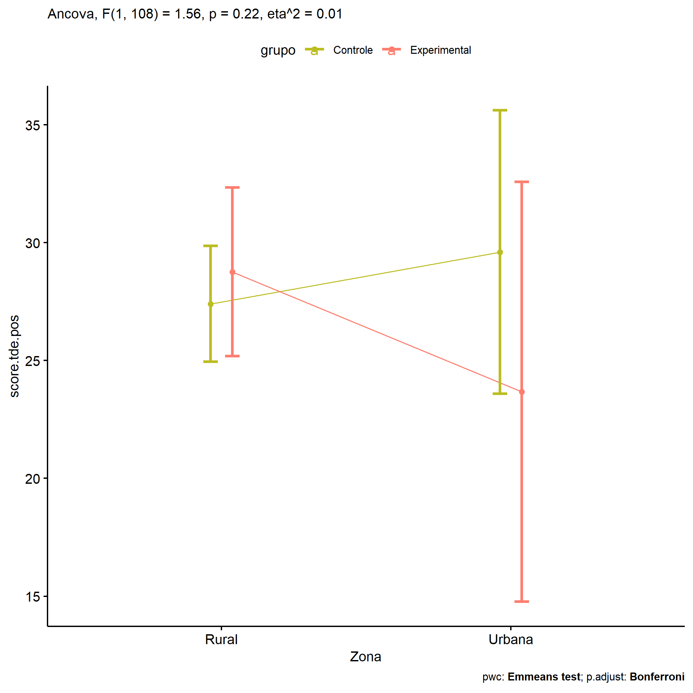<!-- -->

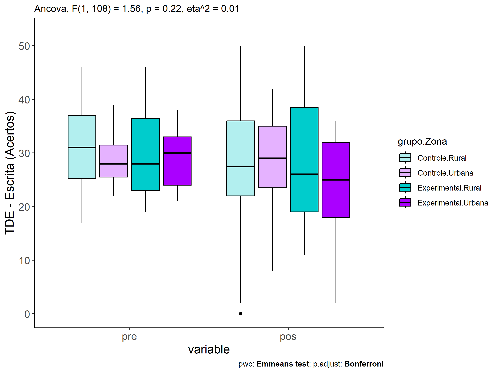<!-- -->

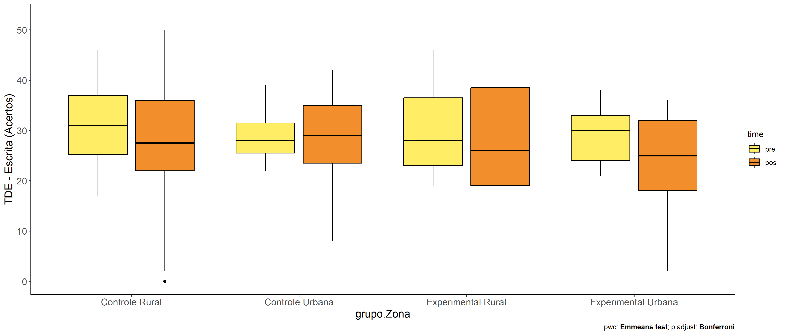<!-- -->

### factores: **grupo:Cor.Raca**

| var           | grupo        | Cor.Raca |   n | M (pre) | SE (pre) | M (unadj) | SE (unadj) | M (adj) | SE (adj) |
|:--------------|:-------------|:---------|----:|--------:|---------:|----------:|-----------:|--------:|---------:|
| score.tde.pos | Controle     | Branca   |  11 |  33.000 |    2.370 |    36.000 |      3.477 |  33.923 |    3.235 |
| score.tde.pos | Controle     | Parda    |  50 |  31.060 |    0.907 |    25.920 |      1.715 |  25.525 |    1.508 |
| score.tde.pos | Experimental | Branca   |   5 |  35.200 |    4.067 |    33.800 |      8.345 |  29.815 |    4.823 |
| score.tde.pos | Experimental | Indígena |   8 |  30.000 |    2.970 |    29.250 |      4.199 |  29.774 |    3.766 |
| score.tde.pos | Experimental | Parda    |  17 |  26.647 |    1.480 |    24.059 |      2.547 |  27.490 |    2.666 |

|     | .y.           | grupo        | Cor.Raca | group1   | group2       | estimate | conf.low | conf.high |    se | statistic |     p | p.adj | p.adj.signif |
|:----|:--------------|:-------------|:---------|:---------|:-------------|---------:|---------:|----------:|------:|----------:|------:|------:|:-------------|
| 1   | score.tde.pos |              | Branca   | Controle | Experimental |    4.108 |   -7.333 |    15.549 | 5.754 |     0.714 | 0.477 | 0.477 | ns           |
| 3   | score.tde.pos |              | Parda    | Controle | Experimental |   -1.965 |   -8.087 |     4.156 | 3.079 |    -0.638 | 0.525 | 0.525 | ns           |
| 4   | score.tde.pre |              | Branca   | Controle | Experimental |   -2.200 |   -9.561 |     5.161 | 3.703 |    -0.594 | 0.554 | 0.554 | ns           |
| 6   | score.tde.pre |              | Parda    | Controle | Experimental |    4.413 |    0.581 |     8.245 | 1.927 |     2.289 | 0.025 | 0.025 | \*           |
| 8   | score.tde.pos | Controle     |          | Branca   | Parda        |    8.398 |    1.319 |    15.477 | 3.561 |     2.359 | 0.021 | 0.021 | \*           |
| 10  | score.tde.pos | Experimental |          | Branca   | Indígena     |    0.041 |  -12.150 |    12.232 | 6.132 |     0.007 | 0.995 | 1.000 | ns           |
| 11  | score.tde.pos | Experimental |          | Branca   | Parda        |    2.325 |   -8.814 |    13.464 | 5.602 |     0.415 | 0.679 | 1.000 | ns           |
| 12  | score.tde.pos | Experimental |          | Indígena | Parda        |    2.284 |   -6.860 |    11.428 | 4.599 |     0.497 | 0.621 | 1.000 | ns           |
| 14  | score.tde.pre | Controle     |          | Branca   | Parda        |    1.940 |   -2.605 |     6.485 | 2.286 |     0.849 | 0.399 | 0.399 | ns           |
| 16  | score.tde.pre | Experimental |          | Branca   | Indígena     |    5.200 |   -2.581 |    12.981 | 3.914 |     1.329 | 0.187 | 0.562 | ns           |
| 17  | score.tde.pre | Experimental |          | Branca   | Parda        |    8.553 |    1.610 |    15.496 | 3.493 |     2.449 | 0.016 | 0.049 | \*           |
| 18  | score.tde.pre | Experimental |          | Indígena | Parda        |    3.353 |   -2.499 |     9.204 | 2.944 |     1.139 | 0.258 | 0.773 | ns           |

| .y.       | grupo        | Cor.Raca | group1 | group2 | estimate | conf.low | conf.high |    se | statistic |     p | p.adj | p.adj.signif |
|:----------|:-------------|:---------|:-------|:-------|---------:|---------:|----------:|------:|----------:|------:|------:|:-------------|
| score.tde | Controle     | Branca   | pre    | pos    |   -3.000 |  -11.302 |     5.302 | 4.206 |    -0.713 | 0.477 | 0.477 | ns           |
| score.tde | Controle     | Parda    | pre    | pos    |    5.140 |    1.246 |     9.034 | 1.973 |     2.605 | 0.010 | 0.010 | \*\*         |
| score.tde | Experimental | Branca   | pre    | pos    |    1.400 |  -10.914 |    13.714 | 6.239 |     0.224 | 0.823 | 0.823 | ns           |
| score.tde | Experimental | Indígena | pre    | pos    |    0.750 |   -8.985 |    10.485 | 4.932 |     0.152 | 0.879 | 0.879 | ns           |
| score.tde | Experimental | Parda    | pre    | pos    |    2.588 |   -4.090 |     9.267 | 3.383 |     0.765 | 0.445 | 0.445 | ns           |

    ## Scale for colour is already present.
    ## Adding another scale for colour, which will replace the existing scale.

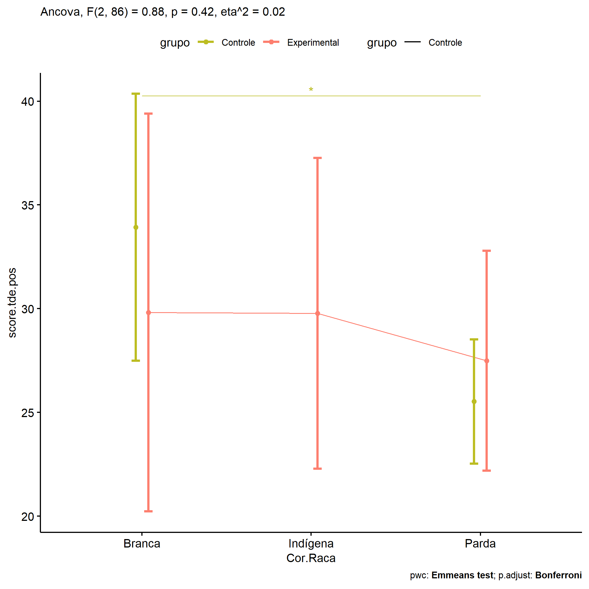<!-- -->

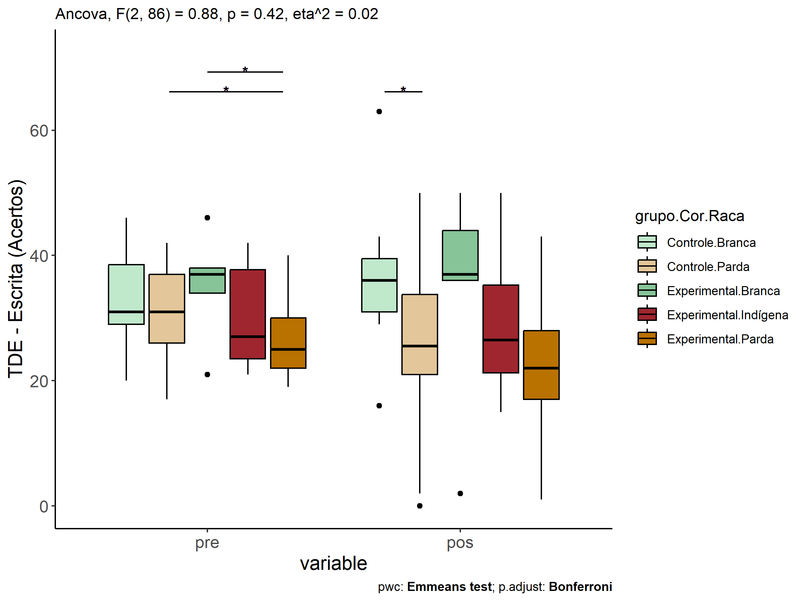<!-- -->

<!-- -->

### factores: **grupo:score.tde.quintile**

| var           | grupo        | score.tde.quintile |   n | M (pre) | SE (pre) | M (unadj) | SE (unadj) | M (adj) | SE (adj) |
|:--------------|:-------------|:-------------------|----:|--------:|---------:|----------:|-----------:|--------:|---------:|
| score.tde.pos | Controle     | 2nd quintile       |  58 |  26.121 |    0.467 |    24.310 |      1.509 |  27.876 |    1.952 |
| score.tde.pos | Controle     | 3rd quintile       |  49 |  36.796 |    0.319 |    33.939 |      1.629 |  29.028 |    2.400 |
| score.tde.pos | Experimental | 2nd quintile       |  25 |  24.280 |    0.631 |    21.320 |      1.915 |  26.348 |    2.873 |
| score.tde.pos | Experimental | 3rd quintile       |  20 |  36.400 |    0.670 |    31.950 |      2.527 |  27.354 |    2.979 |

| .y.           | grupo        | score.tde.quintile | group1       | group2       | estimate | conf.low | conf.high |    se | statistic | p       | p.adj   | p.adj.signif |
|:--------------|:-------------|:-------------------|:-------------|:-------------|---------:|---------:|----------:|------:|----------:|:--------|:--------|:-------------|
| score.tde.pos |              | 2nd quintile       | Controle     | Experimental |    1.529 |   -3.745 |     6.803 | 2.669 |     0.573 | 0.568   | 0.568   | ns           |
| score.tde.pos |              | 3rd quintile       | Controle     | Experimental |    1.674 |   -4.057 |     7.406 | 2.900 |     0.577 | 0.565   | 0.565   | ns           |
| score.tde.pre |              | 2nd quintile       | Controle     | Experimental |    1.841 |    0.401 |     3.280 | 0.728 |     2.527 | 0.013   | 0.013   | \*           |
| score.tde.pre |              | 3rd quintile       | Controle     | Experimental |    0.396 |   -1.201 |     1.992 | 0.808 |     0.490 | 0.625   | 0.625   | ns           |
| score.tde.pos | Controle     |                    | 2nd quintile | 3rd quintile |   -1.152 |   -8.651 |     6.347 | 3.794 |    -0.304 | 0.762   | 0.762   | ns           |
| score.tde.pos | Experimental |                    | 2nd quintile | 3rd quintile |   -1.006 |  -10.587 |     8.575 | 4.848 |    -0.208 | 0.836   | 0.836   | ns           |
| score.tde.pre | Controle     |                    | 2nd quintile | 3rd quintile |  -10.675 |  -11.843 |    -9.508 | 0.591 |   -18.070 | \<0.001 | \<0.001 | \*\*\*\*     |
| score.tde.pre | Experimental |                    | 2nd quintile | 3rd quintile |  -12.120 |  -13.925 |   -10.315 | 0.913 |   -13.269 | \<0.001 | \<0.001 | \*\*\*\*     |

| .y.       | grupo        | score.tde.quintile | group1 | group2 | estimate | conf.low | conf.high |    se | statistic |     p | p.adj | p.adj.signif |
|:----------|:-------------|:-------------------|:-------|:-------|---------:|---------:|----------:|------:|----------:|------:|------:|:-------------|
| score.tde | Controle     | 2nd quintile       | pre    | pos    |    1.810 |   -1.176 |     4.797 | 1.518 |     1.193 | 0.234 | 0.234 | ns           |
| score.tde | Controle     | 3rd quintile       | pre    | pos    |    2.857 |   -0.392 |     6.106 | 1.651 |     1.730 | 0.085 | 0.085 | ns           |
| score.tde | Experimental | 2nd quintile       | pre    | pos    |    2.960 |   -1.589 |     7.509 | 2.312 |     1.281 | 0.201 | 0.201 | ns           |
| score.tde | Experimental | 3rd quintile       | pre    | pos    |    4.450 |   -0.636 |     9.536 | 2.584 |     1.722 | 0.086 | 0.086 | ns           |

    ## Scale for colour is already present.
    ## Adding another scale for colour, which will replace the existing scale.

<!-- -->

    ## Scale for colour is already present.
    ## Adding another scale for colour, which will replace the existing scale.

<!-- -->

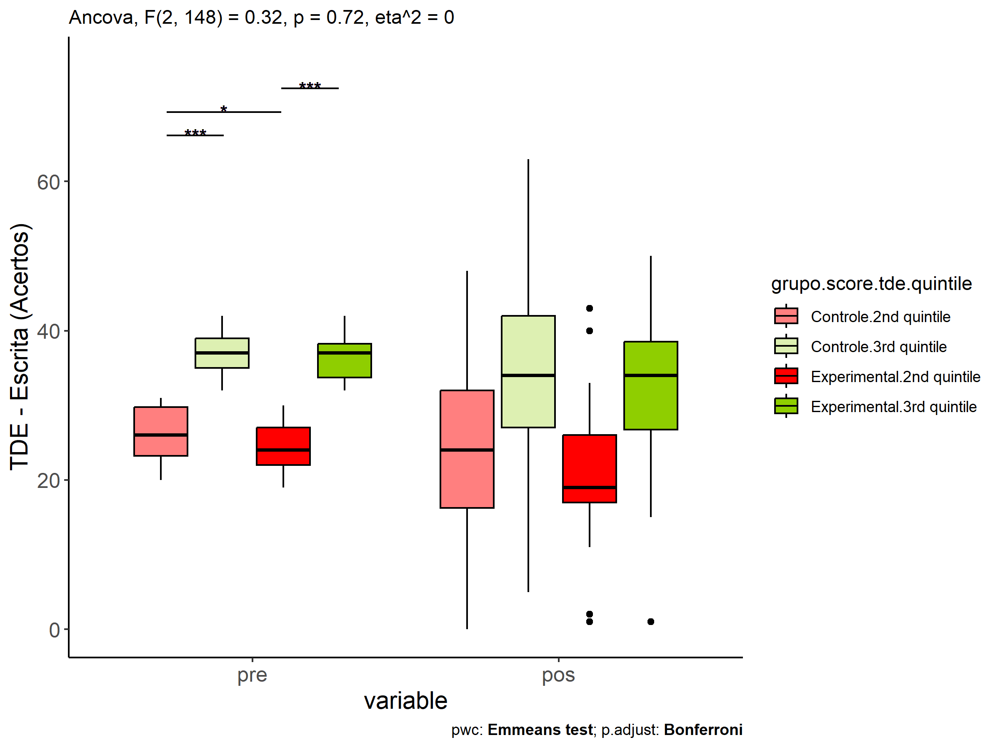<!-- -->

<!-- -->
