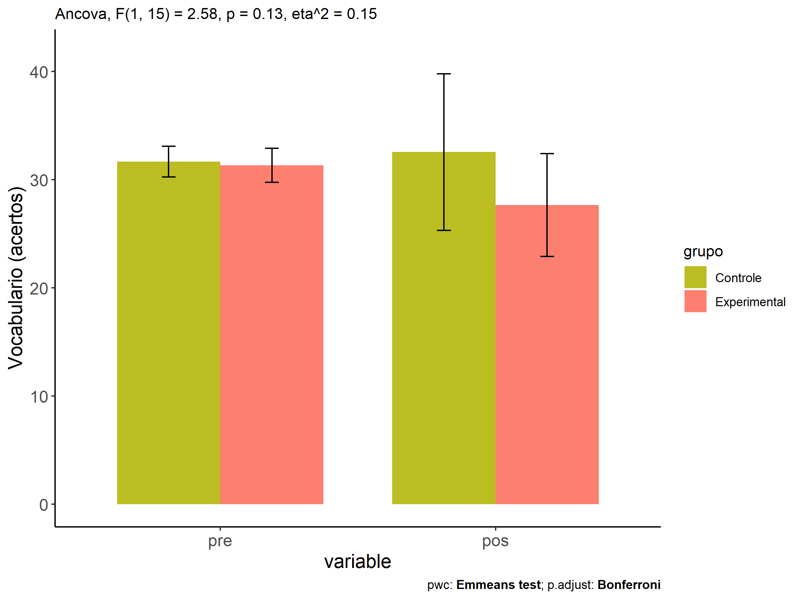
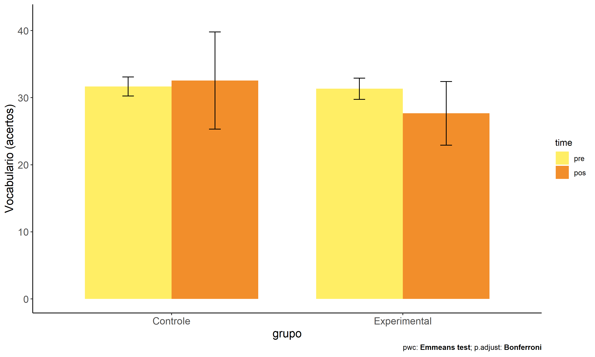
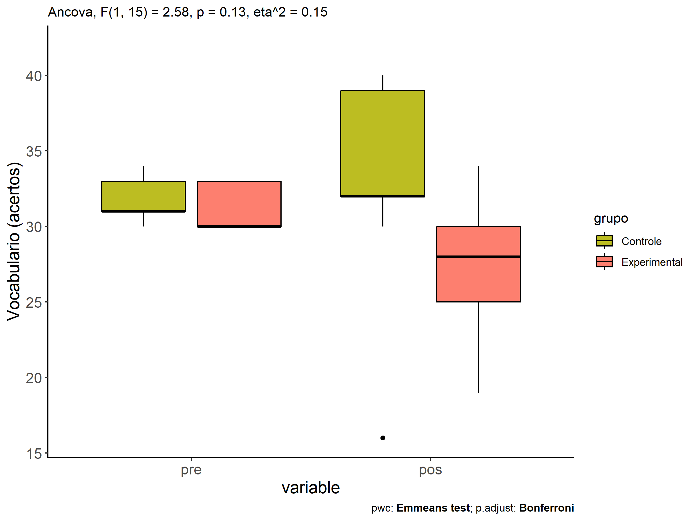
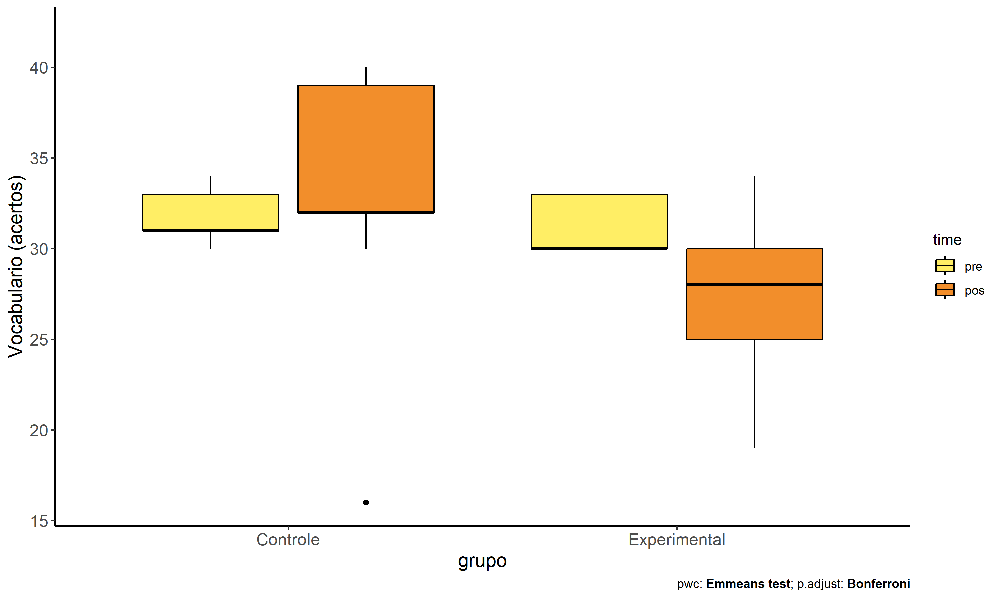

ANCOVA in Vocabulario (acertos) (Vocabulario (acertos))
================
Geiser C. Challco <geiser@alumni.usp.br>

- [Descriptive Statistics of Initial
  Data](#descriptive-statistics-of-initial-data)
- [Checking of Assumptions](#checking-of-assumptions)
  - [Assumption: Normality distribution of
    data](#assumption-normality-distribution-of-data)
  - [Assumption: Homogeneity of data
    distribution](#assumption-homogeneity-of-data-distribution)
- [Computation of ANCOVA test and Pairwise
  Comparison](#computation-of-ancova-test-and-pairwise-comparison)
  - [ANCOVA tests for one factor](#ancova-tests-for-one-factor)
  - [ANCOVA tests for two factors](#ancova-tests-for-two-factors)
  - [Pairwise comparisons for one factor:
    **grupo**](#pairwise-comparisons-for-one-factor-grupo)
  - [Pairwise comparisons for two
    factors](#pairwise-comparisons-for-two-factors)
    - [factores: **grupo:Sexo**](#factores-gruposexo)
    - [factores: **grupo:Zona**](#factores-grupozona)
    - [factores: **grupo:Cor.Raca**](#factores-grupocorraca)
    - [factores: **grupo:Serie**](#factores-gruposerie)

**NOTE**

- Teste ANCOVA para determinar se houve diferenças significativas no
  Vocabulario (acertos) (medido usando pre- e pos-testes).
- ANCOVA test to determine whether there were significant differences in
  Vocabulario (acertos) (measured using pre- and post-tests).

# Descriptive Statistics of Initial Data

| grupo        | Sexo | Zona   | Cor.Raca | Serie | variable  |   n |   mean | median | min | max |     sd |    se |     ci |   iqr |
|:-------------|:-----|:-------|:---------|:------|:----------|----:|-------:|-------:|----:|----:|-------:|------:|-------:|------:|
| Controle     | F    |        |          |       | vocab.pre |   3 | 32.667 |   33.0 |  31 |  34 |  1.528 | 0.882 |  3.795 |  1.50 |
| Controle     | M    |        |          |       | vocab.pre |   6 | 31.167 |   31.0 |  30 |  33 |  1.169 | 0.477 |  1.227 |  1.50 |
| Experimental | F    |        |          |       | vocab.pre |   4 | 31.500 |   31.5 |  30 |  33 |  1.732 | 0.866 |  2.756 |  3.00 |
| Experimental | M    |        |          |       | vocab.pre |   5 | 31.200 |   30.0 |  30 |  33 |  1.643 | 0.735 |  2.040 |  3.00 |
| Controle     | F    |        |          |       | vocab.pos |   3 | 37.000 |   39.0 |  32 |  40 |  4.359 | 2.517 | 10.828 |  4.00 |
| Controle     | M    |        |          |       | vocab.pos |   6 | 30.333 |   32.0 |  16 |  39 |  7.659 | 3.127 |  8.038 |  2.25 |
| Experimental | F    |        |          |       | vocab.pos |   4 | 24.500 |   25.5 |  19 |  28 |  4.359 | 2.179 |  6.936 |  6.00 |
| Experimental | M    |        |          |       | vocab.pos |   5 | 30.200 |   30.0 |  25 |  34 |  3.564 | 1.594 |  4.425 |  4.00 |
| Controle     |      | Rural  |          |       | vocab.pre |   7 | 31.714 |   31.0 |  30 |  34 |  1.380 | 0.522 |  1.276 |  1.50 |
| Controle     |      |        |          |       | vocab.pre |   2 | 31.500 |   31.5 |  30 |  33 |  2.121 | 1.500 | 19.059 |  1.50 |
| Experimental |      | Rural  |          |       | vocab.pre |   5 | 31.200 |   30.0 |  30 |  33 |  1.643 | 0.735 |  2.040 |  3.00 |
| Experimental |      | Urbana |          |       | vocab.pre |   2 | 33.000 |   33.0 |  33 |  33 |  0.000 | 0.000 |  0.000 |  0.00 |
| Experimental |      |        |          |       | vocab.pre |   2 | 30.000 |   30.0 |  30 |  30 |  0.000 | 0.000 |  0.000 |  0.00 |
| Controle     |      | Rural  |          |       | vocab.pos |   7 | 30.714 |   32.0 |  16 |  40 |  7.228 | 2.732 |  6.684 |  1.50 |
| Controle     |      |        |          |       | vocab.pos |   2 | 39.000 |   39.0 |  39 |  39 |  0.000 | 0.000 |  0.000 |  0.00 |
| Experimental |      | Rural  |          |       | vocab.pos |   5 | 28.000 |   28.0 |  25 |  30 |  1.871 | 0.837 |  2.323 |  1.00 |
| Experimental |      | Urbana |          |       | vocab.pos |   2 | 28.500 |   28.5 |  23 |  34 |  7.778 | 5.500 | 69.884 |  5.50 |
| Experimental |      |        |          |       | vocab.pos |   2 | 26.000 |   26.0 |  19 |  33 |  9.899 | 7.000 | 88.943 |  7.00 |
| Controle     |      |        | Branca   |       | vocab.pre |   2 | 30.500 |   30.5 |  30 |  31 |  0.707 | 0.500 |  6.353 |  0.50 |
| Controle     |      |        | Indígena |       | vocab.pre |   1 | 31.000 |   31.0 |  31 |  31 |        |       |        |  0.00 |
| Controle     |      |        | Parda    |       | vocab.pre |   3 | 31.000 |   31.0 |  30 |  32 |  1.000 | 0.577 |  2.484 |  1.00 |
| Controle     |      |        |          |       | vocab.pre |   3 | 33.333 |   33.0 |  33 |  34 |  0.577 | 0.333 |  1.434 |  0.50 |
| Experimental |      |        | Indígena |       | vocab.pre |   1 | 33.000 |   33.0 |  33 |  33 |        |       |        |  0.00 |
| Experimental |      |        | Parda    |       | vocab.pre |   3 | 31.000 |   30.0 |  30 |  33 |  1.732 | 1.000 |  4.303 |  1.50 |
| Experimental |      |        |          |       | vocab.pre |   5 | 31.200 |   30.0 |  30 |  33 |  1.643 | 0.735 |  2.040 |  3.00 |
| Controle     |      |        | Branca   |       | vocab.pos |   2 | 31.500 |   31.5 |  30 |  33 |  2.121 | 1.500 | 19.059 |  1.50 |
| Controle     |      |        | Indígena |       | vocab.pos |   1 | 32.000 |   32.0 |  32 |  32 |        |       |        |  0.00 |
| Controle     |      |        | Parda    |       | vocab.pos |   3 | 34.333 |   32.0 |  32 |  39 |  4.041 | 2.333 | 10.040 |  3.50 |
| Controle     |      |        |          |       | vocab.pos |   3 | 31.667 |   39.0 |  16 |  40 | 13.577 | 7.839 | 33.727 | 12.00 |
| Experimental |      |        | Indígena |       | vocab.pos |   1 | 28.000 |   28.0 |  28 |  28 |        |       |        |  0.00 |
| Experimental |      |        | Parda    |       | vocab.pos |   3 | 26.000 |   29.0 |  19 |  30 |  6.083 | 3.512 | 15.110 |  5.50 |
| Experimental |      |        |          |       | vocab.pos |   5 | 28.600 |   28.0 |  23 |  34 |  4.827 | 2.159 |  5.994 |  8.00 |
| Controle     |      |        |          | 7 ano | vocab.pre |   3 | 32.333 |   32.0 |  31 |  34 |  1.528 | 0.882 |  3.795 |  1.50 |
| Controle     |      |        |          | 8 ano | vocab.pre |   1 | 33.000 |   33.0 |  33 |  33 |        |       |        |  0.00 |
| Controle     |      |        |          | 9 ano | vocab.pre |   5 | 31.000 |   31.0 |  30 |  33 |  1.225 | 0.548 |  1.521 |  1.00 |
| Experimental |      |        |          | 6 ano | vocab.pre |   3 | 30.000 |   30.0 |  30 |  30 |  0.000 | 0.000 |  0.000 |  0.00 |
| Experimental |      |        |          | 7 ano | vocab.pre |   2 | 33.000 |   33.0 |  33 |  33 |  0.000 | 0.000 |  0.000 |  0.00 |
| Experimental |      |        |          | 8 ano | vocab.pre |   4 | 31.500 |   31.5 |  30 |  33 |  1.732 | 0.866 |  2.756 |  3.00 |
| Controle     |      |        |          | 7 ano | vocab.pos |   3 | 34.000 |   32.0 |  30 |  40 |  5.292 | 3.055 | 13.145 |  5.00 |
| Controle     |      |        |          | 8 ano | vocab.pos |   1 | 16.000 |   16.0 |  16 |  16 |        |       |        |  0.00 |
| Controle     |      |        |          | 9 ano | vocab.pos |   5 | 35.000 |   33.0 |  32 |  39 |  3.674 | 1.643 |  4.562 |  7.00 |
| Experimental |      |        |          | 6 ano | vocab.pos |   3 | 27.333 |   28.0 |  25 |  29 |  2.082 | 1.202 |  5.171 |  2.00 |
| Experimental |      |        |          | 7 ano | vocab.pos |   2 | 25.500 |   25.5 |  23 |  28 |  3.536 | 2.500 | 31.766 |  2.50 |
| Experimental |      |        |          | 8 ano | vocab.pos |   4 | 29.000 |   31.5 |  19 |  34 |  6.880 | 3.440 | 10.947 |  6.00 |

# Checking of Assumptions

## Assumption: Normality distribution of data

| var       |   n |   skewness |   kurtosis | symmetry | statistic | method       |         p | p.signif | normality |
|:----------|----:|-----------:|-----------:|:---------|----------:|:-------------|----------:|:---------|:----------|
| vocab.pos |  18 | -1.0037164 |  0.8221639 | NO       | 0.9003267 | Shapiro-Wilk | 0.0582154 | ns       | YES       |
| vocab.pos |  14 | -1.1395537 |  1.6474537 | NO       | 0.8555900 | Shapiro-Wilk | 0.0264749 | \*       | NO        |
| vocab.pos |  10 | -0.2739336 | -1.0558196 | YES      | 0.9703843 | Shapiro-Wilk | 0.8943850 | ns       | YES       |
| vocab.pos |  18 |  0.2711359 | -0.1673237 | YES      | 0.9618759 | Shapiro-Wilk | 0.6382228 | ns       | YES       |

## Assumption: Homogeneity of data distribution

| var       | method         | formula                    |   n | DFn.df1 | DFd.df2 | statistic |         p | p.signif |
|:----------|:---------------|:---------------------------|----:|--------:|--------:|----------:|----------:|:---------|
| vocab.pos | Levene’s test  | `.res`~`grupo`\*`Sexo`     |  18 |       3 |      14 | 0.1192386 | 0.9472838 | ns       |
| vocab.pos | Anova’s slopes | `.res`~`grupo`\*`Sexo`     |  18 |       3 |      10 | 5.0790000 | 0.0220000 | \*       |
| vocab.pos | Levene’s test  | `.res`~`grupo`\*`Zona`     |  14 |       2 |      11 | 0.8142260 | 0.4679874 | ns       |
| vocab.pos | Anova’s slopes | `.res`~`grupo`\*`Zona`     |  14 |       1 |       9 | 0.0790000 | 0.7850000 | ns       |
| vocab.pos | Levene’s test  | `.res`~`grupo`\*`Cor.Raca` |  10 |       4 |       5 | 0.1868057 | 0.9354224 | ns       |
| vocab.pos | Anova’s slopes | `.res`~`grupo`\*`Cor.Raca` |  10 |       2 |       2 | 0.8860000 | 0.5300000 | ns       |
| vocab.pos | Levene’s test  | `.res`~`grupo`\*`Serie`    |  18 |       5 |      12 | 1.1214324 | 0.3999074 | ns       |
| vocab.pos | Anova’s slopes | `.res`~`grupo`\*`Serie`    |  18 |       2 |       9 | 0.3960000 | 0.6840000 | ns       |

# Computation of ANCOVA test and Pairwise Comparison

## ANCOVA tests for one factor

|     | Effect    | DFn | DFd |     SSn |     SSd |     F |     p |   ges | p\<.05 |
|:----|:----------|----:|----:|--------:|--------:|------:|------:|------:|:-------|
| 1   | vocab.pre |   1 |  15 |   1.633 | 598.590 | 0.041 | 0.842 | 0.003 |        |
| 2   | grupo     |   1 |  15 | 103.024 | 598.590 | 2.582 | 0.129 | 0.147 |        |
| 4   | Sexo      |   1 |  15 |   2.624 | 698.990 | 0.056 | 0.816 | 0.004 |        |
| 6   | Zona      |   1 |  11 |   3.630 | 406.971 | 0.098 | 0.760 | 0.009 |        |
| 8   | Cor.Raca  |   2 |   6 |   2.644 | 223.310 | 0.036 | 0.965 | 0.012 |        |
| 10  | Serie     |   3 |  13 | 220.627 | 480.987 | 1.988 | 0.166 | 0.314 |        |

## ANCOVA tests for two factors

|     | Effect         | DFn | DFd |     SSn |     SSd |      F |     p |   ges | p\<.05 |
|:----|:---------------|----:|----:|--------:|--------:|-------:|------:|------:|:-------|
| 1   | vocab.pre      |   1 |  13 |   2.326 | 436.807 |  0.069 | 0.797 | 0.005 |        |
| 4   | grupo:Sexo     |   1 |  13 | 161.779 | 436.807 |  4.815 | 0.047 | 0.270 | \*     |
| 8   | grupo:Zona     |   0 |  10 |         | 387.400 |        |       |       |        |
| 12  | grupo:Cor.Raca |   1 |   4 |   3.927 | 109.725 |  0.143 | 0.724 | 0.035 |        |
| 16  | grupo:Serie    |   1 |  11 | 289.040 | 191.811 | 16.576 | 0.002 | 0.601 | \*     |

## Pairwise comparisons for one factor: **grupo**

| var       | grupo        |   n | M (pre) | SE (pre) | M (unadj) | SE (unadj) | M (adj) | SE (adj) |
|:----------|:-------------|----:|--------:|---------:|----------:|-----------:|--------:|---------:|
| vocab.pos | Controle     |   9 |  31.667 |    0.471 |    32.556 |      2.416 |  32.520 |    2.113 |
| vocab.pos | Experimental |   9 |  31.333 |    0.527 |    27.667 |      1.581 |  27.702 |    2.113 |

| .y.       | group1   | group2       | estimate | conf.low | conf.high |    se | statistic |     p | p.adj | p.adj.signif |
|:----------|:---------|:-------------|---------:|---------:|----------:|------:|----------:|------:|------:|:-------------|
| vocab.pos | Controle | Experimental |    4.818 |   -1.573 |    11.209 | 2.999 |     1.607 | 0.129 | 0.129 | ns           |
| vocab.pre | Controle | Experimental |    0.333 |   -1.166 |     1.832 | 0.707 |     0.471 | 0.644 | 0.644 | ns           |

| .y.   | grupo        | group1 | group2 | estimate | conf.low | conf.high |    se | statistic |     p | p.adj | p.adj.signif |
|:------|:-------------|:-------|:-------|---------:|---------:|----------:|------:|----------:|------:|------:|:-------------|
| vocab | Controle     | pre    | pos    |   -0.889 |   -5.170 |     3.393 | 2.102 |    -0.423 | 0.675 | 0.675 | ns           |
| vocab | Experimental | pre    | pos    |    3.667 |   -0.615 |     7.948 | 2.102 |     1.744 | 0.091 | 0.091 | ns           |

<!-- -->

<!-- -->

<!-- -->

<!-- -->

## Pairwise comparisons for two factors

### factores: **grupo:Sexo**

### factores: **grupo:Zona**

### factores: **grupo:Cor.Raca**

### factores: **grupo:Serie**
