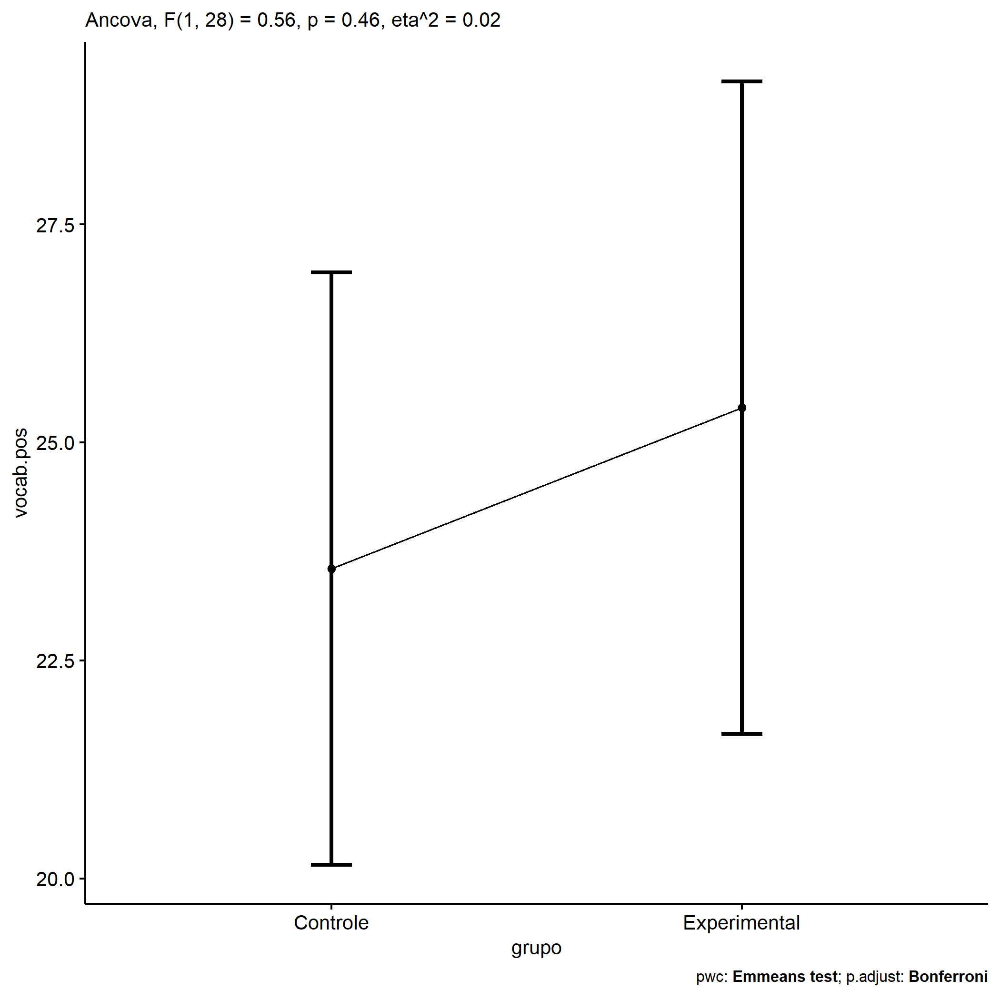
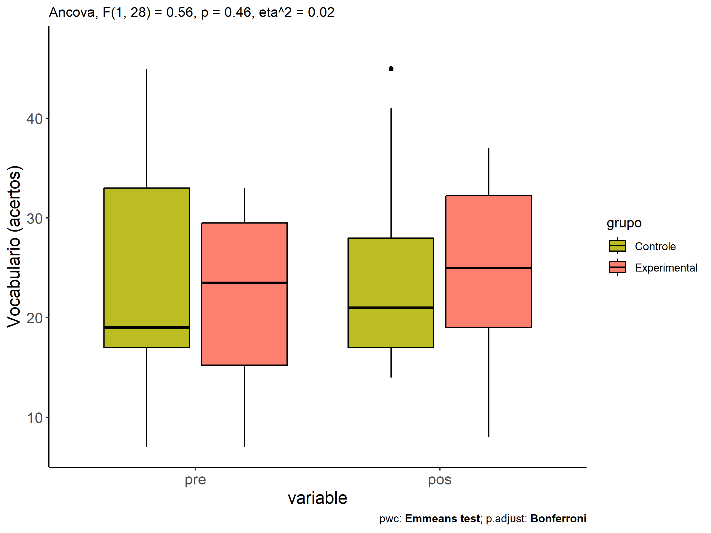
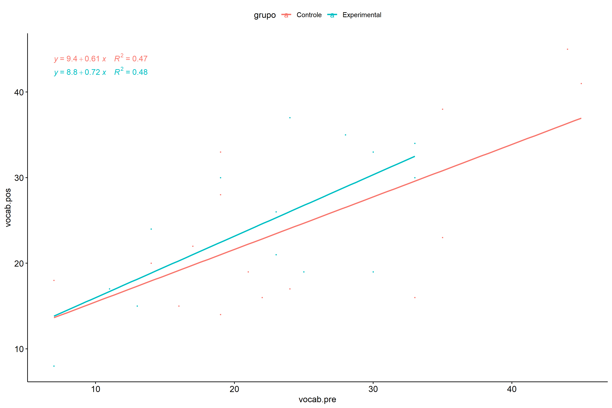
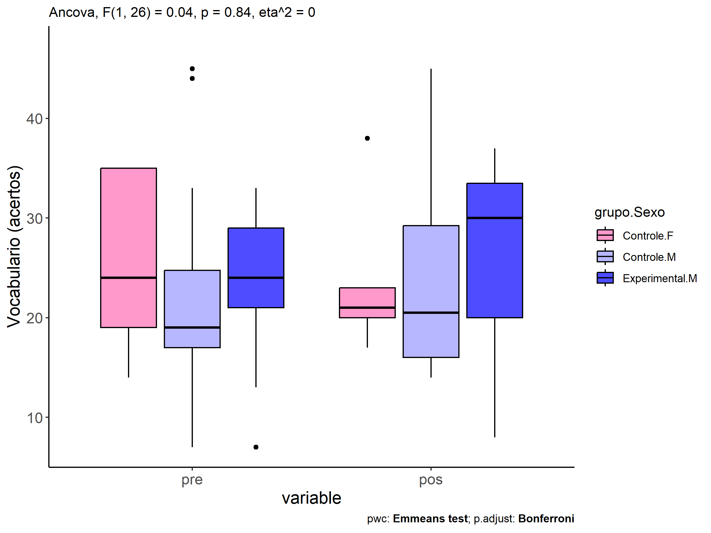
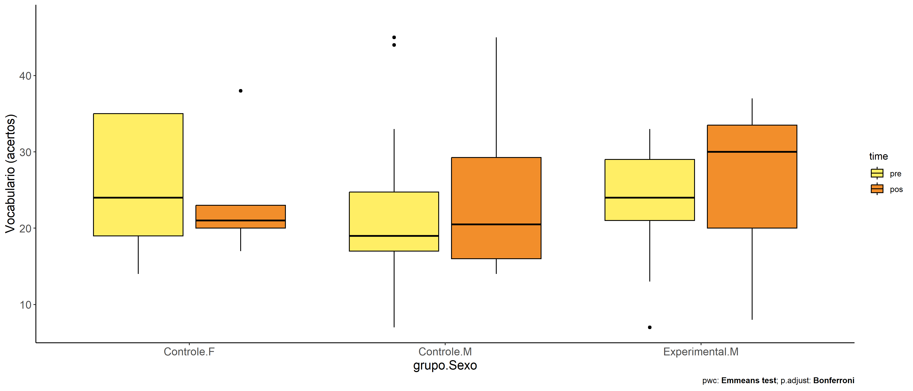

ANCOVA in Vocabulario (acertos) (Vocabulario (acertos))
================
Geiser C. Challco <geiser@alumni.usp.br>

- [Descriptive Statistics of Initial
  Data](#descriptive-statistics-of-initial-data)
- [Checking of Assumptions](#checking-of-assumptions)
  - [Assumption: Normality distribution of
    data](#assumption-normality-distribution-of-data)
  - [Assumption: Homogeneity of data
    distribution](#assumption-homogeneity-of-data-distribution)
- [Computation of ANCOVA test and Pairwise
  Comparison](#computation-of-ancova-test-and-pairwise-comparison)
  - [ANCOVA tests for one factor](#ancova-tests-for-one-factor)
  - [ANCOVA tests for two factors](#ancova-tests-for-two-factors)
  - [Pairwise comparisons for one factor:
    **grupo**](#pairwise-comparisons-for-one-factor-grupo)
  - [Pairwise comparisons for two
    factors](#pairwise-comparisons-for-two-factors)
    - [factores: **grupo:Sexo**](#factores-gruposexo)
    - [factores: **grupo:Zona**](#factores-grupozona)
    - [factores: **grupo:Cor.Raca**](#factores-grupocorraca)
    - [factores: **grupo:vocab.quintile**](#factores-grupovocabquintile)

**NOTE**

- Teste ANCOVA para determinar se houve diferenças significativas no
  Vocabulario (acertos) (medido usando pre- e pos-testes).
- ANCOVA test to determine whether there were significant differences in
  Vocabulario (acertos) (measured using pre- and post-tests).

# Descriptive Statistics of Initial Data

| grupo        | Sexo | Zona   | Cor.Raca | vocab.quintile | variable  |   n |   mean | median | min | max |     sd |    se |     ci |   iqr |
|:-------------|:-----|:-------|:---------|:---------------|:----------|----:|-------:|-------:|----:|----:|-------:|------:|-------:|------:|
| Controle     | F    |        |          |                | vocab.pre |   5 | 25.400 |   24.0 |  14 |  35 |  9.450 | 4.226 | 11.734 | 16.00 |
| Controle     | M    |        |          |                | vocab.pre |  12 | 23.250 |   19.0 |   7 |  45 | 11.498 | 3.319 |  7.305 |  7.75 |
| Experimental | F    |        |          |                | vocab.pre |   3 | 18.333 |   14.0 |  11 |  30 | 10.214 | 5.897 | 25.374 |  9.50 |
| Experimental | M    |        |          |                | vocab.pre |  11 | 23.455 |   24.0 |   7 |  33 |  8.054 | 2.428 |  5.411 |  8.00 |
| Controle     | F    |        |          |                | vocab.pos |   5 | 23.800 |   21.0 |  17 |  38 |  8.228 | 3.680 | 10.216 |  3.00 |
| Controle     | M    |        |          |                | vocab.pos |  12 | 24.083 |   20.5 |  14 |  45 | 10.466 | 3.021 |  6.650 | 13.25 |
| Experimental | F    |        |          |                | vocab.pos |   3 | 20.000 |   19.0 |  17 |  24 |  3.606 | 2.082 |  8.957 |  3.50 |
| Experimental | M    |        |          |                | vocab.pos |  11 | 26.182 |   30.0 |   8 |  37 |  9.304 | 2.805 |  6.250 | 13.50 |
| Controle     |      | Rural  |          |                | vocab.pre |   7 | 26.429 |   21.0 |  16 |  44 | 10.861 | 4.105 | 10.044 | 16.00 |
| Controle     |      | Urbana |          |                | vocab.pre |   4 | 22.000 |   18.0 |   7 |  45 | 16.513 | 8.256 | 26.275 | 15.50 |
| Controle     |      |        |          |                | vocab.pre |   6 | 22.167 |   19.0 |  17 |  35 |  6.706 | 2.738 |  7.037 |  3.75 |
| Experimental |      | Rural  |          |                | vocab.pre |   7 | 21.000 |   24.0 |   7 |  33 |  9.292 | 3.512 |  8.593 | 11.50 |
| Experimental |      | Urbana |          |                | vocab.pre |   1 | 33.000 |   33.0 |  33 |  33 |        |       |        |  0.00 |
| Experimental |      |        |          |                | vocab.pre |   6 | 22.167 |   23.0 |  13 |  30 |  7.414 | 3.027 |  7.780 | 12.00 |
| Controle     |      | Rural  |          |                | vocab.pos |   7 | 26.143 |   22.0 |  15 |  45 | 11.510 | 4.350 | 10.645 | 15.50 |
| Controle     |      | Urbana |          |                | vocab.pos |   4 | 23.750 |   19.0 |  16 |  41 | 11.615 | 5.808 | 18.483 |  7.75 |
| Controle     |      |        |          |                | vocab.pos |   6 | 21.667 |   21.5 |  14 |  33 |  6.501 | 2.654 |  6.823 |  4.75 |
| Experimental |      | Rural  |          |                | vocab.pos |   7 | 25.143 |   30.0 |   8 |  37 | 10.668 | 4.032 |  9.866 | 14.50 |
| Experimental |      | Urbana |          |                | vocab.pos |   1 | 34.000 |   34.0 |  34 |  34 |        |       |        |  0.00 |
| Experimental |      |        |          |                | vocab.pos |   6 | 23.000 |   22.5 |  15 |  33 |  6.229 | 2.543 |  6.537 |  6.00 |
| Controle     |      |        | Parda    |                | vocab.pre |   7 | 24.429 |   19.0 |  16 |  44 | 10.737 | 4.058 |  9.930 | 10.00 |
| Controle     |      |        |          |                | vocab.pre |  10 | 23.500 |   20.5 |   7 |  45 | 11.218 | 3.547 |  8.025 | 13.25 |
| Experimental |      |        | Branca   |                | vocab.pre |   1 | 28.000 |   28.0 |  28 |  28 |        |       |        |  0.00 |
| Experimental |      |        | Indígena |                | vocab.pre |   1 | 23.000 |   23.0 |  23 |  23 |        |       |        |  0.00 |
| Experimental |      |        | Parda    |                | vocab.pre |   5 | 20.000 |   19.0 |   7 |  33 | 11.402 | 5.099 | 14.157 | 19.00 |
| Experimental |      |        |          |                | vocab.pre |   7 | 23.143 |   24.0 |  13 |  33 |  7.471 | 2.824 |  6.909 |  9.00 |
| Controle     |      |        | Parda    |                | vocab.pos |   7 | 25.429 |   22.0 |  15 |  45 | 10.228 | 3.866 |  9.460 |  8.00 |
| Controle     |      |        |          |                | vocab.pos |  10 | 23.000 |   19.0 |  14 |  41 |  9.568 | 3.026 |  6.845 | 10.25 |
| Experimental |      |        | Branca   |                | vocab.pos |   1 | 35.000 |   35.0 |  35 |  35 |        |       |        |  0.00 |
| Experimental |      |        | Indígena |                | vocab.pos |   1 | 26.000 |   26.0 |  26 |  26 |        |       |        |  0.00 |
| Experimental |      |        | Parda    |                | vocab.pos |   5 | 20.800 |   19.0 |   8 |  30 |  9.365 | 4.188 | 11.628 | 13.00 |
| Experimental |      |        |          |                | vocab.pos |   7 | 26.143 |   24.0 |  15 |  37 |  8.494 | 3.210 |  7.855 | 13.50 |
| Controle     |      |        |          | 1st quintile   | vocab.pre |   3 | 12.333 |   14.0 |   7 |  16 |  4.726 | 2.728 | 11.740 |  4.50 |
| Controle     |      |        |          | 2nd quintile   | vocab.pre |   8 | 19.125 |   19.0 |  17 |  22 |  1.727 | 0.611 |  1.444 |  1.00 |
| Controle     |      |        |          | 3rd quintile   | vocab.pre |   1 | 24.000 |   24.0 |  24 |  24 |        |       |        |  0.00 |
| Controle     |      |        |          | 4th quintile   | vocab.pre |   1 | 33.000 |   33.0 |  33 |  33 |        |       |        |  0.00 |
| Controle     |      |        |          | 5th quintile   | vocab.pre |   4 | 39.750 |   39.5 |  35 |  45 |  5.500 | 2.750 |  8.752 |  9.25 |
| Experimental |      |        |          | 1st quintile   | vocab.pre |   4 | 11.250 |   12.0 |   7 |  14 |  3.096 | 1.548 |  4.926 |  3.25 |
| Experimental |      |        |          | 2nd quintile   | vocab.pre |   1 | 19.000 |   19.0 |  19 |  19 |        |       |        |  0.00 |
| Experimental |      |        |          | 3rd quintile   | vocab.pre |   5 | 24.600 |   24.0 |  23 |  28 |  2.074 | 0.927 |  2.575 |  2.00 |
| Experimental |      |        |          | 4th quintile   | vocab.pre |   4 | 31.500 |   31.5 |  30 |  33 |  1.732 | 0.866 |  2.756 |  3.00 |
| Controle     |      |        |          | 1st quintile   | vocab.pos |   3 | 17.667 |   18.0 |  15 |  20 |  2.517 | 1.453 |  6.252 |  2.50 |
| Controle     |      |        |          | 2nd quintile   | vocab.pos |   8 | 21.875 |   21.5 |  14 |  33 |  6.175 | 2.183 |  5.162 |  5.25 |
| Controle     |      |        |          | 3rd quintile   | vocab.pos |   1 | 17.000 |   17.0 |  17 |  17 |        |       |        |  0.00 |
| Controle     |      |        |          | 4th quintile   | vocab.pos |   1 | 16.000 |   16.0 |  16 |  16 |        |       |        |  0.00 |
| Controle     |      |        |          | 5th quintile   | vocab.pos |   4 | 36.750 |   39.5 |  23 |  45 |  9.605 | 4.802 | 15.283 |  7.75 |
| Experimental |      |        |          | 1st quintile   | vocab.pos |   4 | 16.000 |   16.0 |   8 |  24 |  6.583 | 3.291 | 10.475 |  5.50 |
| Experimental |      |        |          | 2nd quintile   | vocab.pos |   1 | 30.000 |   30.0 |  30 |  30 |        |       |        |  0.00 |
| Experimental |      |        |          | 3rd quintile   | vocab.pos |   5 | 27.600 |   26.0 |  19 |  37 |  8.112 | 3.628 | 10.072 | 14.00 |
| Experimental |      |        |          | 4th quintile   | vocab.pos |   4 | 29.000 |   31.5 |  19 |  34 |  6.880 | 3.440 | 10.947 |  6.00 |

# Checking of Assumptions

## Assumption: Normality distribution of data

| var       |   n |   skewness |   kurtosis | symmetry | statistic | method       |         p | p.signif | normality |
|:----------|----:|-----------:|-----------:|:---------|----------:|:-------------|----------:|:---------|:----------|
| vocab.pos |  31 | -0.1433229 | -0.9990081 | YES      | 0.9634406 | Shapiro-Wilk | 0.3587166 | ns       | YES       |
| vocab.pos |  19 | -0.5363479 | -0.6739986 | NO       | 0.9547471 | Shapiro-Wilk | 0.4739276 | ns       | YES       |
| vocab.pos |  14 |  0.3257407 | -1.0207485 | YES      | 0.9459073 | Shapiro-Wilk | 0.4991487 | ns       | YES       |
| vocab.pos |  31 | -0.0642649 | -0.8625000 | YES      | 0.9624941 | Shapiro-Wilk | 0.3391250 | ns       | YES       |

## Assumption: Homogeneity of data distribution

| var       | method         | formula                          |   n | DFn.df1 | DFd.df2 | statistic |         p | p.signif |
|:----------|:---------------|:---------------------------------|----:|--------:|--------:|----------:|----------:|:---------|
| vocab.pos | Levene’s test  | `.res`~`grupo`\*`Sexo`           |  31 |       3 |      27 | 0.1151406 | 0.9504683 | ns       |
| vocab.pos | Anova’s slopes | `.res`~`grupo`\*`Sexo`           |  31 |       3 |      23 | 0.9870000 | 0.4160000 | ns       |
| vocab.pos | Levene’s test  | `.res`~`grupo`\*`Zona`           |  19 |       3 |      15 | 0.6417223 | 0.5999462 | ns       |
| vocab.pos | Anova’s slopes | `.res`~`grupo`\*`Zona`           |  19 |       2 |      12 | 0.1580000 | 0.8550000 | ns       |
| vocab.pos | Levene’s test  | `.res`~`grupo`\*`Cor.Raca`       |  14 |       3 |      10 | 0.8862799 | 0.4809897 | ns       |
| vocab.pos | Anova’s slopes | `.res`~`grupo`\*`Cor.Raca`       |  14 |       1 |       8 | 0.0750000 | 0.7910000 | ns       |
| vocab.pos | Levene’s test  | `.res`~`grupo`\*`vocab.quintile` |  31 |       8 |      22 | 0.7311538 | 0.6633016 | ns       |
| vocab.pos | Anova’s slopes | `.res`~`grupo`\*`vocab.quintile` |  31 |       5 |      16 | 0.8880000 | 0.5120000 | ns       |

# Computation of ANCOVA test and Pairwise Comparison

## ANCOVA tests for one factor

|     | Effect         | DFn | DFd |      SSn |      SSd |      F | p       |   ges | p\<.05 |
|:----|:---------------|----:|----:|---------:|---------:|-------:|:--------|------:|:-------|
| 1   | vocab.pre      |   1 |  28 | 1154.338 | 1303.376 | 24.798 | \<0.001 | 0.470 | \*     |
| 2   | grupo          |   1 |  28 |   25.989 | 1303.376 |  0.558 | 0.461   | 0.020 |        |
| 4   | Sexo           |   1 |  28 |   32.223 | 1297.142 |  0.696 | 0.411   | 0.024 |        |
| 6   | Zona           |   1 |  16 |    0.138 |  802.090 |  0.003 | 0.959   | 0.000 |        |
| 8   | Cor.Raca       |   2 |  10 |   59.737 |  500.056 |  0.597 | 0.569   | 0.107 |        |
| 10  | vocab.quintile |   4 |  25 |   93.211 | 1236.154 |  0.471 | 0.756   | 0.070 |        |

## ANCOVA tests for two factors

|     | Effect               | DFn | DFd |      SSn |      SSd |      F | p       |   ges | p\<.05 |
|:----|:---------------------|----:|----:|---------:|---------:|-------:|:--------|------:|:-------|
| 1   | vocab.pre            |   1 |  26 | 1093.390 | 1273.963 | 22.315 | \<0.001 | 0.462 | \*     |
| 4   | grupo:Sexo           |   1 |  26 |    2.129 | 1273.963 |  0.043 | 0.837   | 0.002 |        |
| 8   | grupo:Zona           |   1 |  14 |    0.469 |  767.433 |  0.009 | 0.928   | 0.001 |        |
| 12  | grupo:Cor.Raca       |   0 |   9 |          |  490.840 |        |         |       |        |
| 16  | grupo:vocab.quintile |   3 |  21 |  150.710 |  926.997 |  1.138 | 0.357   | 0.140 |        |

## Pairwise comparisons for one factor: **grupo**

| var       | grupo        |   n | M (pre) | SE (pre) | M (unadj) | SE (unadj) | M (adj) | SE (adj) |
|:----------|:-------------|----:|--------:|---------:|----------:|-----------:|--------:|---------:|
| vocab.pos | Controle     |  17 |  23.882 |    2.592 |    24.000 |      2.329 |  23.553 |    1.657 |
| vocab.pos | Experimental |  14 |  22.357 |    2.247 |    24.857 |      2.323 |  25.399 |    1.827 |

| .y.       | group1   | group2       | estimate | conf.low | conf.high |    se | statistic |     p | p.adj | p.adj.signif |
|:----------|:---------|:-------------|---------:|---------:|----------:|------:|----------:|------:|------:|:-------------|
| vocab.pos | Controle | Experimental |   -1.846 |   -6.906 |     3.214 | 2.470 |    -0.747 | 0.461 | 0.461 | ns           |
| vocab.pre | Controle | Experimental |    1.525 |   -5.659 |     8.709 | 3.513 |     0.434 | 0.667 | 0.667 | ns           |

| .y.   | grupo        | group1 | group2 | estimate | conf.low | conf.high |    se | statistic |     p | p.adj | p.adj.signif |
|:------|:-------------|:-------|:-------|---------:|---------:|----------:|------:|----------:|------:|------:|:-------------|
| vocab | Controle     | pre    | pos    |   -0.118 |   -6.622 |     6.386 | 3.249 |    -0.036 | 0.971 | 0.971 | ns           |
| vocab | Experimental | pre    | pos    |   -2.500 |   -9.667 |     4.667 | 3.580 |    -0.698 | 0.488 | 0.488 | ns           |

    ## Scale for colour is already present.
    ## Adding another scale for colour, which will replace the existing scale.

<!-- -->

<!-- -->

<!-- -->

## Pairwise comparisons for two factors

### factores: **grupo:Sexo**

| var       | grupo        | Sexo |   n | M (pre) | SE (pre) | M (unadj) | SE (unadj) | M (adj) | SE (adj) |
|:----------|:-------------|:-----|----:|--------:|---------:|----------:|-----------:|--------:|---------:|
| vocab.pos | Controle     | F    |   5 |  25.400 |    4.226 |    23.800 |      3.680 |  22.625 |    3.099 |
| vocab.pos | Controle     | M    |  12 |  23.250 |    3.319 |    24.083 |      3.021 |  24.407 |    1.995 |
| vocab.pos | Experimental | M    |  11 |  23.455 |    2.428 |    26.182 |      2.805 |  26.363 |    2.083 |

|     | .y.       | grupo    | Sexo | group1   | group2       | estimate | conf.low | conf.high |    se | statistic |     p | p.adj | p.adj.signif |
|:----|:----------|:---------|:-----|:---------|:-------------|---------:|---------:|----------:|------:|----------:|------:|------:|:-------------|
| 2   | vocab.pos |          | M    | Controle | Experimental |   -1.956 |   -7.908 |     3.996 | 2.884 |    -0.678 | 0.504 | 0.504 | ns           |
| 4   | vocab.pre |          | M    | Controle | Experimental |   -0.205 |   -8.733 |     8.324 | 4.141 |    -0.049 | 0.961 | 0.961 | ns           |
| 5   | vocab.pos | Controle |      | F        | M            |   -1.782 |   -9.397 |     5.833 | 3.690 |    -0.483 | 0.633 | 0.633 | ns           |
| 7   | vocab.pre | Controle |      | F        | M            |    2.150 |   -8.725 |    13.025 | 5.280 |     0.407 | 0.687 | 0.687 | ns           |

| .y.   | grupo        | Sexo | group1 | group2 | estimate | conf.low | conf.high |    se | statistic |     p | p.adj | p.adj.signif |
|:------|:-------------|:-----|:-------|:-------|---------:|---------:|----------:|------:|----------:|------:|------:|:-------------|
| vocab | Controle     | F    | pre    | pos    |    1.600 |  -10.849 |    14.049 | 6.198 |     0.258 | 0.797 | 0.797 | ns           |
| vocab | Controle     | M    | pre    | pos    |   -0.833 |   -8.869 |     7.202 | 4.001 |    -0.208 | 0.836 | 0.836 | ns           |
| vocab | Experimental | M    | pre    | pos    |   -2.727 |  -11.120 |     5.666 | 4.179 |    -0.653 | 0.517 | 0.517 | ns           |

<!-- -->

<!-- -->

### factores: **grupo:Zona**

### factores: **grupo:Cor.Raca**

### factores: **grupo:vocab.quintile**

| var       | grupo        | Sexo |   n | M (pre) | SE (pre) | M (unadj) | SE (unadj) | M (adj) | SE (adj) |
|:----------|:-------------|:-----|----:|--------:|---------:|----------:|-----------:|--------:|---------:|
| vocab.pos | Controle     | F    |   5 |  25.400 |    4.226 |    23.800 |      3.680 |  22.625 |    3.099 |
| vocab.pos | Controle     | M    |  12 |  23.250 |    3.319 |    24.083 |      3.021 |  24.407 |    1.995 |
| vocab.pos | Experimental | M    |  11 |  23.455 |    2.428 |    26.182 |      2.805 |  26.363 |    2.083 |
