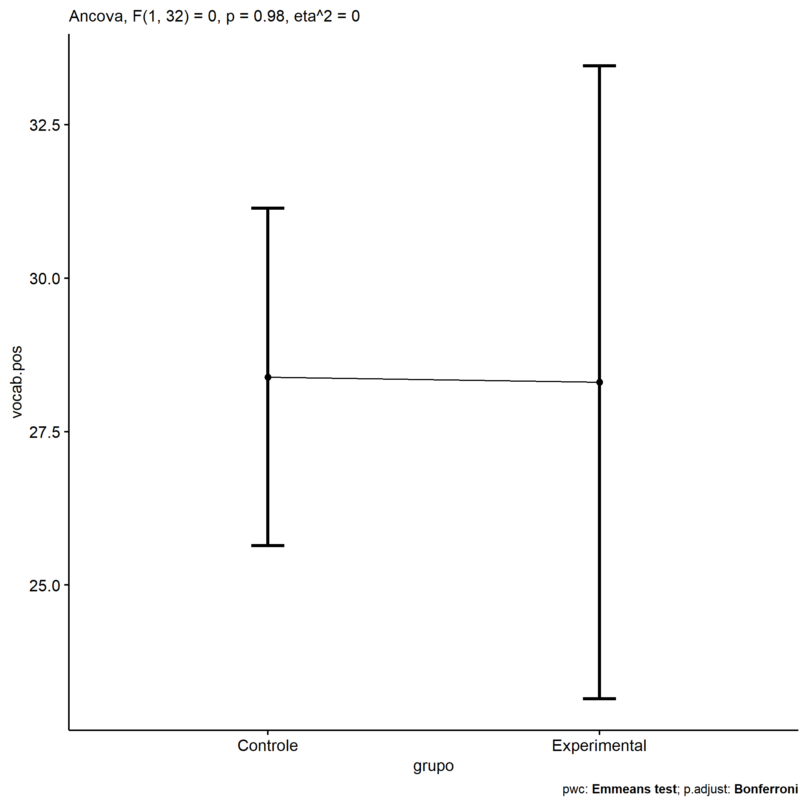
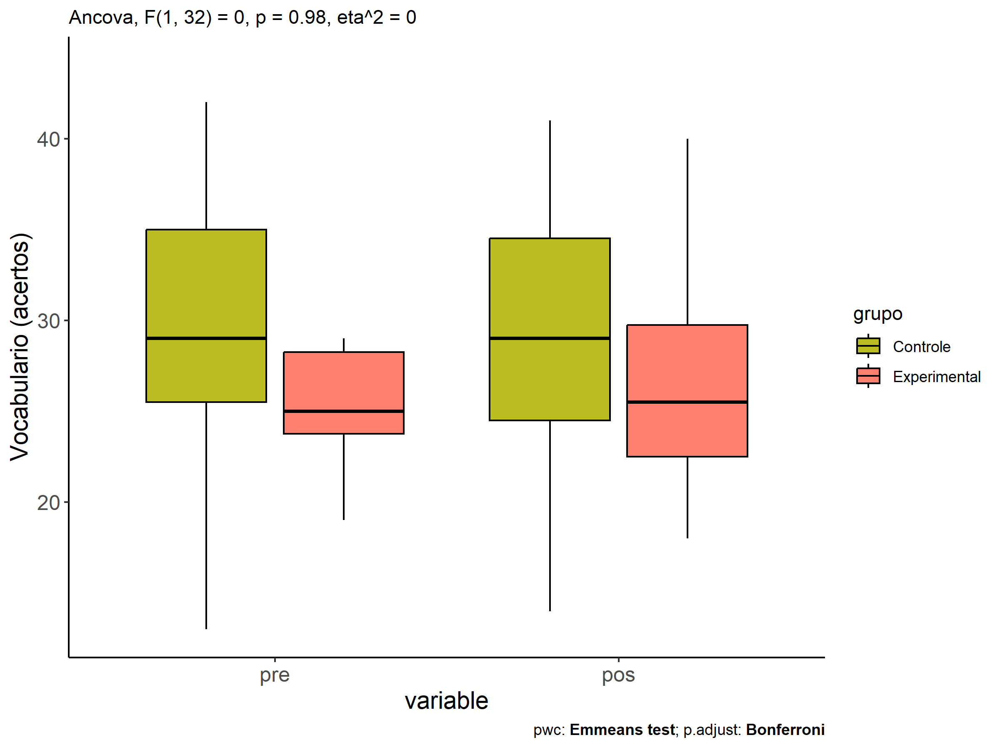
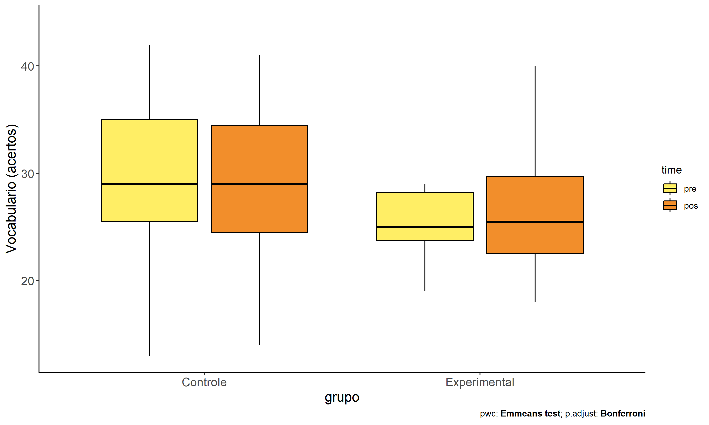
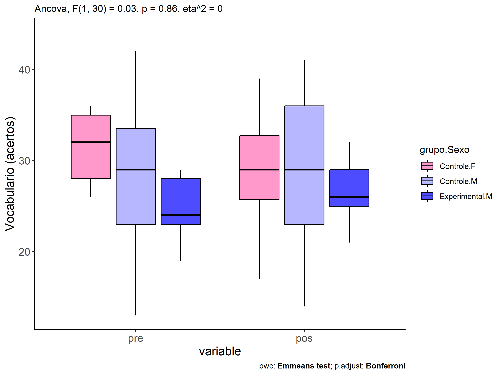
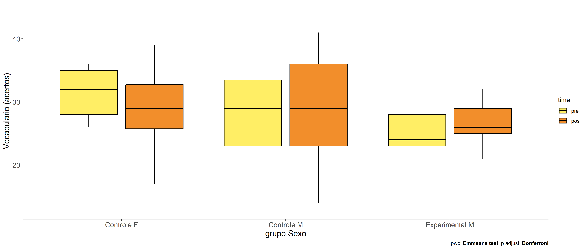
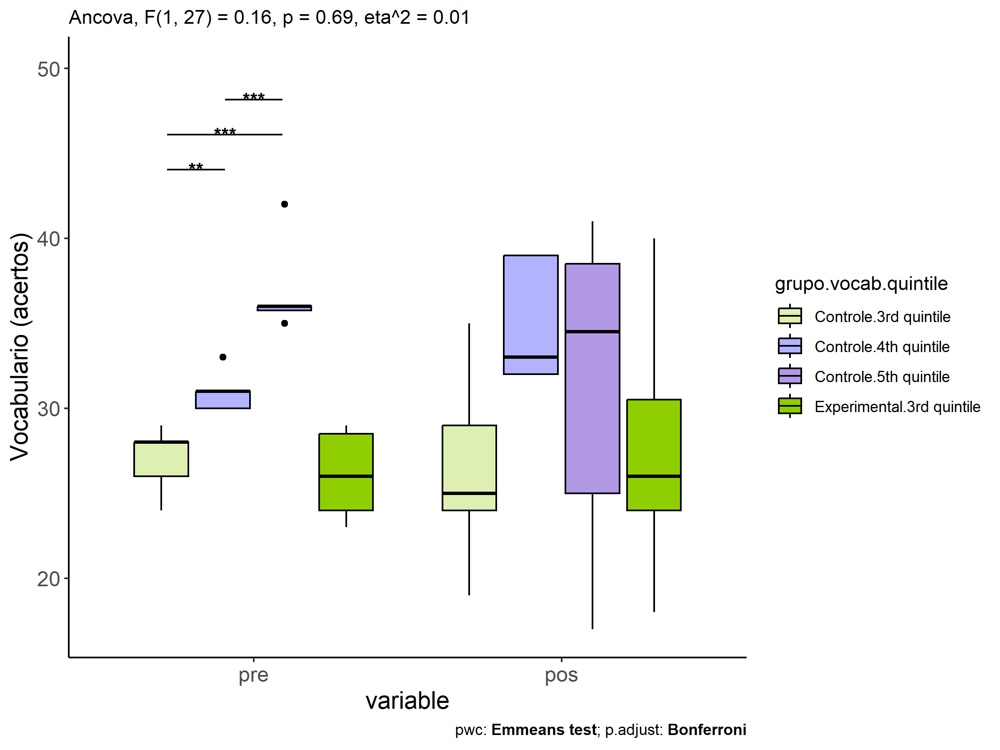
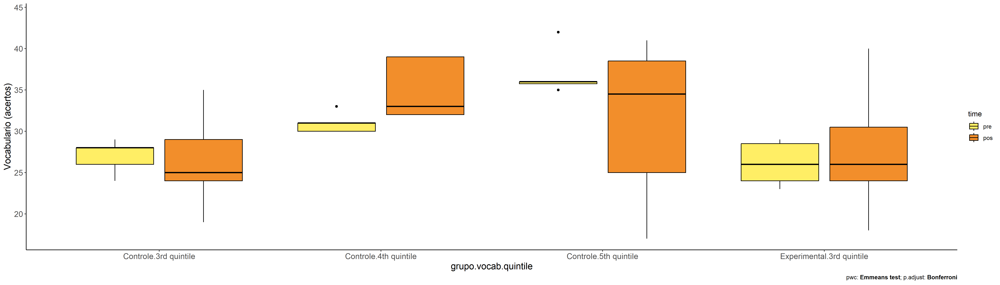

ANCOVA in Vocabulario (acertos) (Vocabulario (acertos))
================
Geiser C. Challco <geiser@alumni.usp.br>

- [Descriptive Statistics of Initial
  Data](#descriptive-statistics-of-initial-data)
- [Checking of Assumptions](#checking-of-assumptions)
  - [Assumption: Normality distribution of
    data](#assumption-normality-distribution-of-data)
  - [Assumption: Homogeneity of data
    distribution](#assumption-homogeneity-of-data-distribution)
- [Computation of ANCOVA test and Pairwise
  Comparison](#computation-of-ancova-test-and-pairwise-comparison)
  - [ANCOVA tests for one factor](#ancova-tests-for-one-factor)
  - [ANCOVA tests for two factors](#ancova-tests-for-two-factors)
  - [Pairwise comparisons for one factor:
    **grupo**](#pairwise-comparisons-for-one-factor-grupo)
  - [Pairwise comparisons for two
    factors](#pairwise-comparisons-for-two-factors)
    - [factores: **grupo:Sexo**](#factores-gruposexo)
    - [factores: **grupo:Zona**](#factores-grupozona)
    - [factores: **grupo:Cor.Raca**](#factores-grupocorraca)
    - [factores: **grupo:vocab.quintile**](#factores-grupovocabquintile)

**NOTE**

- Teste ANCOVA para determinar se houve diferenças significativas no
  Vocabulario (acertos) (medido usando pre- e pos-testes).
- ANCOVA test to determine whether there were significant differences in
  Vocabulario (acertos) (measured using pre- and post-tests).

# Descriptive Statistics of Initial Data

| grupo        | Sexo | Zona   | Cor.Raca | vocab.quintile | variable  |   n |   mean | median | min | max |     sd |    se |     ci |   iqr |
|:-------------|:-----|:-------|:---------|:---------------|:----------|----:|-------:|-------:|----:|----:|-------:|------:|-------:|------:|
| Controle     | F    |        |          |                | vocab.pre |   8 | 31.500 |   32.0 |  26 |  36 |  3.817 | 1.350 |  3.191 |  7.00 |
| Controle     | M    |        |          |                | vocab.pre |  19 | 28.158 |   29.0 |  13 |  42 |  7.213 | 1.655 |  3.477 | 10.50 |
| Experimental | F    |        |          |                | vocab.pre |   3 | 26.333 |   26.0 |  24 |  29 |  2.517 | 1.453 |  6.252 |  2.50 |
| Experimental | M    |        |          |                | vocab.pre |   5 | 24.600 |   24.0 |  19 |  29 |  4.037 | 1.806 |  5.013 |  5.00 |
| Controle     | F    |        |          |                | vocab.pos |   8 | 29.000 |   29.0 |  17 |  39 |  6.782 | 2.398 |  5.670 |  7.00 |
| Controle     | M    |        |          |                | vocab.pos |  19 | 28.789 |   29.0 |  14 |  41 |  8.182 | 1.877 |  3.944 | 13.00 |
| Experimental | F    |        |          |                | vocab.pos |   3 | 27.000 |   23.0 |  18 |  40 | 11.533 | 6.658 | 28.648 | 11.00 |
| Experimental | M    |        |          |                | vocab.pos |   5 | 26.600 |   26.0 |  21 |  32 |  4.159 | 1.860 |  5.164 |  4.00 |
| Controle     |      | Rural  |          |                | vocab.pre |  10 | 27.400 |   28.5 |  19 |  36 |  5.147 | 1.628 |  3.682 |  6.50 |
| Controle     |      | Urbana |          |                | vocab.pre |   1 | 35.000 |   35.0 |  35 |  35 |        |       |        |  0.00 |
| Controle     |      |        |          |                | vocab.pre |  16 | 29.875 |   29.5 |  13 |  42 |  7.256 | 1.814 |  3.866 |  9.25 |
| Experimental |      | Rural  |          |                | vocab.pre |   4 | 23.750 |   23.5 |  19 |  29 |  4.113 | 2.056 |  6.545 |  3.25 |
| Experimental |      | Urbana |          |                | vocab.pre |   1 | 26.000 |   26.0 |  26 |  26 |        |       |        |  0.00 |
| Experimental |      |        |          |                | vocab.pre |   3 | 27.000 |   28.0 |  24 |  29 |  2.646 | 1.528 |  6.572 |  2.50 |
| Controle     |      | Rural  |          |                | vocab.pos |  10 | 30.100 |   31.0 |  20 |  40 |  5.705 | 1.804 |  4.081 |  6.75 |
| Controle     |      | Urbana |          |                | vocab.pos |   1 | 31.000 |   31.0 |  31 |  31 |        |       |        |  0.00 |
| Controle     |      |        |          |                | vocab.pos |  16 | 27.938 |   25.5 |  14 |  41 |  8.948 | 2.237 |  4.768 | 16.75 |
| Experimental |      | Rural  |          |                | vocab.pos |   4 | 25.250 |   24.0 |  21 |  32 |  4.787 | 2.394 |  7.617 |  4.25 |
| Experimental |      | Urbana |          |                | vocab.pos |   1 | 18.000 |   18.0 |  18 |  18 |        |       |        |  0.00 |
| Experimental |      |        |          |                | vocab.pos |   3 | 31.667 |   29.0 |  26 |  40 |  7.371 | 4.256 | 18.311 |  7.00 |
| Controle     |      |        | Branca   |                | vocab.pre |   2 | 27.500 |   27.5 |  25 |  30 |  3.536 | 2.500 | 31.766 |  2.50 |
| Controle     |      |        | Indígena |                | vocab.pre |   1 | 31.000 |   31.0 |  31 |  31 |        |       |        |  0.00 |
| Controle     |      |        | Parda    |                | vocab.pre |  11 | 27.455 |   29.0 |  13 |  36 |  6.684 | 2.015 |  4.490 |  4.50 |
| Controle     |      |        |          |                | vocab.pre |  13 | 30.692 |   33.0 |  21 |  42 |  6.897 | 1.913 |  4.168 | 10.00 |
| Experimental |      |        | Branca   |                | vocab.pre |   1 | 23.000 |   23.0 |  23 |  23 |        |       |        |  0.00 |
| Experimental |      |        | Indígena |                | vocab.pre |   2 | 26.500 |   26.5 |  24 |  29 |  3.536 | 2.500 | 31.766 |  2.50 |
| Experimental |      |        | Parda    |                | vocab.pre |   2 | 22.500 |   22.5 |  19 |  26 |  4.950 | 3.500 | 44.472 |  3.50 |
| Experimental |      |        |          |                | vocab.pre |   3 | 27.000 |   28.0 |  24 |  29 |  2.646 | 1.528 |  6.572 |  2.50 |
| Controle     |      |        | Branca   |                | vocab.pos |   2 | 31.000 |   31.0 |  29 |  33 |  2.828 | 2.000 | 25.412 |  2.00 |
| Controle     |      |        | Indígena |                | vocab.pos |   1 | 32.000 |   32.0 |  32 |  32 |        |       |        |  0.00 |
| Controle     |      |        | Parda    |                | vocab.pos |  11 | 28.455 |   25.0 |  17 |  40 |  7.866 | 2.372 |  5.284 | 11.50 |
| Controle     |      |        |          |                | vocab.pos |  13 | 28.615 |   27.0 |  14 |  41 |  8.559 | 2.374 |  5.172 | 13.00 |
| Experimental |      |        | Branca   |                | vocab.pos |   1 | 32.000 |   32.0 |  32 |  32 |        |       |        |  0.00 |
| Experimental |      |        | Indígena |                | vocab.pos |   2 | 24.000 |   24.0 |  23 |  25 |  1.414 | 1.000 | 12.706 |  1.00 |
| Experimental |      |        | Parda    |                | vocab.pos |   2 | 19.500 |   19.5 |  18 |  21 |  2.121 | 1.500 | 19.059 |  1.50 |
| Experimental |      |        |          |                | vocab.pos |   3 | 31.667 |   29.0 |  26 |  40 |  7.371 | 4.256 | 18.311 |  7.00 |
| Controle     |      |        |          | 1st quintile   | vocab.pre |   1 | 13.000 |   13.0 |  13 |  13 |        |       |        |  0.00 |
| Controle     |      |        |          | 2nd quintile   | vocab.pre |   4 | 20.750 |   21.0 |  19 |  22 |  1.258 | 0.629 |  2.002 |  0.75 |
| Controle     |      |        |          | 3rd quintile   | vocab.pre |   9 | 27.111 |   28.0 |  24 |  29 |  1.764 | 0.588 |  1.356 |  2.00 |
| Controle     |      |        |          | 4th quintile   | vocab.pre |   5 | 31.000 |   31.0 |  30 |  33 |  1.225 | 0.548 |  1.521 |  1.00 |
| Controle     |      |        |          | 5th quintile   | vocab.pre |   8 | 36.500 |   36.0 |  35 |  42 |  2.268 | 0.802 |  1.896 |  0.25 |
| Experimental |      |        |          | 2nd quintile   | vocab.pre |   1 | 19.000 |   19.0 |  19 |  19 |        |       |        |  0.00 |
| Experimental |      |        |          | 3rd quintile   | vocab.pre |   7 | 26.143 |   26.0 |  23 |  29 |  2.545 | 0.962 |  2.354 |  4.50 |
| Controle     |      |        |          | 1st quintile   | vocab.pos |   1 | 22.000 |   22.0 |  22 |  22 |        |       |        |  0.00 |
| Controle     |      |        |          | 2nd quintile   | vocab.pos |   4 | 23.500 |   25.0 |  14 |  30 |  6.758 | 3.379 | 10.753 |  4.00 |
| Controle     |      |        |          | 3rd quintile   | vocab.pos |   9 | 26.333 |   25.0 |  19 |  35 |  5.523 | 1.841 |  4.245 |  5.00 |
| Controle     |      |        |          | 4th quintile   | vocab.pos |   5 | 35.000 |   33.0 |  32 |  39 |  3.674 | 1.643 |  4.562 |  7.00 |
| Controle     |      |        |          | 5th quintile   | vocab.pos |   8 | 31.375 |   34.5 |  17 |  41 |  9.516 | 3.364 |  7.956 | 13.50 |
| Experimental |      |        |          | 2nd quintile   | vocab.pos |   1 | 21.000 |   21.0 |  21 |  21 |        |       |        |  0.00 |
| Experimental |      |        |          | 3rd quintile   | vocab.pos |   7 | 27.571 |   26.0 |  18 |  40 |  7.044 | 2.662 |  6.515 |  6.50 |

# Checking of Assumptions

## Assumption: Normality distribution of data

| var       |   n |   skewness |   kurtosis | symmetry | statistic | method       |         p | p.signif | normality |
|:----------|----:|-----------:|-----------:|:---------|----------:|:-------------|----------:|:---------|:----------|
| vocab.pos |  35 | -0.3018036 | -0.4651845 | YES      | 0.9753857 | Shapiro-Wilk | 0.6065353 | ns       | YES       |
| vocab.pos |  16 | -0.6886781 |  0.6330079 | NO       | 0.9199206 | Shapiro-Wilk | 0.1681869 | ns       | YES       |
| vocab.pos |  19 | -0.4700450 |  0.2075126 | YES      | 0.9554245 | Shapiro-Wilk | 0.4859968 | ns       | YES       |
| vocab.pos |  35 | -0.1952467 | -0.5324866 | YES      | 0.9823789 | Shapiro-Wilk | 0.8334762 | ns       | YES       |

## Assumption: Homogeneity of data distribution

| var       | method         | formula                          |   n | DFn.df1 | DFd.df2 | statistic |         p | p.signif |
|:----------|:---------------|:---------------------------------|----:|--------:|--------:|----------:|----------:|:---------|
| vocab.pos | Levene’s test  | `.res`~`grupo`\*`Sexo`           |  35 |       3 |      31 | 0.7547983 | 0.5280022 | ns       |
| vocab.pos | Anova’s slopes | `.res`~`grupo`\*`Sexo`           |  35 |       3 |      27 | 1.5890000 | 0.2150000 | ns       |
| vocab.pos | Levene’s test  | `.res`~`grupo`\*`Zona`           |  16 |       3 |      12 | 0.4797905 | 0.7023489 | ns       |
| vocab.pos | Anova’s slopes | `.res`~`grupo`\*`Zona`           |  16 |       1 |      10 | 0.5690000 | 0.4680000 | ns       |
| vocab.pos | Levene’s test  | `.res`~`grupo`\*`Cor.Raca`       |  19 |       5 |      13 | 1.4046791 | 0.2859549 | ns       |
| vocab.pos | Anova’s slopes | `.res`~`grupo`\*`Cor.Raca`       |  19 |       3 |       9 | 0.1360000 | 0.9360000 | ns       |
| vocab.pos | Levene’s test  | `.res`~`grupo`\*`vocab.quintile` |  35 |       6 |      28 | 1.0581845 | 0.4104215 | ns       |
| vocab.pos | Anova’s slopes | `.res`~`grupo`\*`vocab.quintile` |  35 |       4 |      23 | 0.9800000 | 0.4380000 | ns       |

# Computation of ANCOVA test and Pairwise Comparison

## ANCOVA tests for one factor

|     | Effect         | DFn | DFd |     SSn |      SSd |     F |     p |   ges | p\<.05 |
|:----|:---------------|----:|----:|--------:|---------:|------:|------:|------:|:-------|
| 1   | vocab.pre      |   1 |  32 | 317.225 | 1545.682 | 6.567 | 0.015 | 0.170 | \*     |
| 2   | grupo          |   1 |  32 |   0.041 | 1545.682 | 0.001 | 0.977 | 0.000 |        |
| 4   | Sexo           |   1 |  32 |  12.637 | 1533.086 | 0.264 | 0.611 | 0.008 |        |
| 6   | Zona           |   1 |  13 |  84.902 |  316.676 | 3.485 | 0.085 | 0.211 |        |
| 8   | Cor.Raca       |   2 |  15 |  59.656 |  689.497 | 0.649 | 0.537 | 0.080 |        |
| 10  | vocab.quintile |   4 |  29 | 175.247 | 1370.477 | 0.927 | 0.462 | 0.113 |        |

## ANCOVA tests for two factors

|     | Effect               | DFn | DFd |     SSn |      SSd |     F |     p |   ges | p\<.05 |
|:----|:---------------------|----:|----:|--------:|---------:|------:|------:|------:|:-------|
| 1   | vocab.pre            |   1 |  30 | 330.940 | 1531.418 | 6.483 | 0.016 | 0.178 | \*     |
| 4   | grupo:Sexo           |   1 |  30 |   1.591 | 1531.418 | 0.031 | 0.861 | 0.001 |        |
| 8   | grupo:Zona           |   1 |  11 |  11.009 |  273.281 | 0.443 | 0.519 | 0.039 |        |
| 12  | grupo:Cor.Raca       |   2 |  12 |  47.953 |  576.872 | 0.499 | 0.619 | 0.077 |        |
| 16  | grupo:vocab.quintile |   1 |  27 |   8.232 | 1358.392 | 0.164 | 0.689 | 0.006 |        |

## Pairwise comparisons for one factor: **grupo**

| var       | grupo        |   n | M (pre) | SE (pre) | M (unadj) | SE (unadj) | M (adj) | SE (adj) |
|:----------|:-------------|----:|--------:|---------:|----------:|-----------:|--------:|---------:|
| vocab.pos | Controle     |  27 |  29.148 |    1.253 |    28.852 |      1.475 |  28.391 |    1.350 |
| vocab.pos | Experimental |   8 |  25.250 |    1.221 |    26.750 |      2.448 |  28.306 |    2.531 |

| .y.       | group1   | group2       | estimate | conf.low | conf.high |    se | statistic |     p | p.adj | p.adj.signif |
|:----------|:---------|:-------------|---------:|---------:|----------:|------:|----------:|------:|------:|:-------------|
| vocab.pos | Controle | Experimental |    0.085 |   -5.835 |     6.005 | 2.906 |     0.029 | 0.977 | 0.977 | ns           |
| vocab.pre | Controle | Experimental |    3.898 |   -1.009 |     8.806 | 2.412 |     1.616 | 0.116 | 0.116 | ns           |

| .y.   | grupo        | group1 | group2 | estimate | conf.low | conf.high |    se | statistic |     p | p.adj | p.adj.signif |
|:------|:-------------|:-------|:-------|---------:|---------:|----------:|------:|----------:|------:|------:|:-------------|
| vocab | Controle     | pre    | pos    |    0.296 |   -3.396 |     3.989 | 1.850 |     0.160 | 0.873 | 0.873 | ns           |
| vocab | Experimental | pre    | pos    |   -1.500 |   -8.284 |     5.284 | 3.398 |    -0.441 | 0.660 | 0.660 | ns           |

    ## Scale for colour is already present.
    ## Adding another scale for colour, which will replace the existing scale.

<!-- -->

<!-- -->

<!-- -->

## Pairwise comparisons for two factors

### factores: **grupo:Sexo**

| var       | grupo        | Sexo |   n | M (pre) | SE (pre) | M (unadj) | SE (unadj) | M (adj) | SE (adj) |
|:----------|:-------------|:-----|----:|--------:|---------:|----------:|-----------:|--------:|---------:|
| vocab.pos | Controle     | F    |   8 |  31.500 |    1.350 |    29.000 |      2.398 |  27.208 |    2.410 |
| vocab.pos | Controle     | M    |  19 |  28.158 |    1.655 |    28.789 |      1.877 |  28.953 |    1.514 |
| vocab.pos | Experimental | M    |   5 |  24.600 |    1.806 |    26.600 |      1.860 |  28.845 |    3.047 |

|     | .y.       | grupo    | Sexo | group1   | group2       | estimate | conf.low | conf.high |    se | statistic |     p | p.adj | p.adj.signif |
|:----|:----------|:---------|:-----|:---------|:-------------|---------:|---------:|----------:|------:|----------:|------:|------:|:-------------|
| 2   | vocab.pos |          | M    | Controle | Experimental |    0.108 |   -6.837 |     7.052 | 3.390 |     0.032 | 0.975 | 0.975 | ns           |
| 4   | vocab.pre |          | M    | Controle | Experimental |    3.558 |   -2.784 |     9.900 | 3.101 |     1.147 | 0.261 | 0.261 | ns           |
| 5   | vocab.pos | Controle |      | F        | M            |   -1.745 |   -7.600 |     4.110 | 2.858 |    -0.611 | 0.546 | 0.546 | ns           |
| 7   | vocab.pre | Controle |      | F        | M            |    3.342 |   -1.976 |     8.660 | 2.600 |     1.285 | 0.209 | 0.209 | ns           |

| .y.   | grupo        | Sexo | group1 | group2 | estimate | conf.low | conf.high |    se | statistic |     p | p.adj | p.adj.signif |
|:------|:-------------|:-----|:-------|:-------|---------:|---------:|----------:|------:|----------:|------:|------:|:-------------|
| vocab | Controle     | F    | pre    | pos    |    2.500 |   -4.329 |     9.329 | 3.411 |     0.733 | 0.467 | 0.467 | ns           |
| vocab | Controle     | M    | pre    | pos    |   -0.632 |   -5.063 |     3.800 | 2.214 |    -0.285 | 0.776 | 0.776 | ns           |
| vocab | Experimental | M    | pre    | pos    |   -2.000 |  -10.638 |     6.638 | 4.315 |    -0.463 | 0.645 | 0.645 | ns           |

<!-- -->

<!-- -->

### factores: **grupo:Zona**

### factores: **grupo:Cor.Raca**

### factores: **grupo:vocab.quintile**

| var       | grupo        | vocab.quintile |   n | M (pre) | SE (pre) | M (unadj) | SE (unadj) | M (adj) | SE (adj) |
|:----------|:-------------|:---------------|----:|--------:|---------:|----------:|-----------:|--------:|---------:|
| vocab.pos | Controle     | 3rd quintile   |   9 |  27.111 |    0.588 |    26.333 |      1.841 |  27.238 |    3.171 |
| vocab.pos | Controle     | 4th quintile   |   5 |  31.000 |    0.548 |    35.000 |      1.643 |  34.742 |    3.244 |
| vocab.pos | Controle     | 5th quintile   |   8 |  36.500 |    0.802 |    31.375 |      3.364 |  29.474 |    5.081 |
| vocab.pos | Experimental | 3rd quintile   |   7 |  26.143 |    0.962 |    27.571 |      2.662 |  28.765 |    3.865 |

|     | .y.       | grupo    | vocab.quintile | group1       | group2       | estimate | conf.low | conf.high |    se | statistic | p       | p.adj   | p.adj.signif |
|:----|:----------|:---------|:---------------|:-------------|:-------------|---------:|---------:|----------:|------:|----------:|:--------|:--------|:-------------|
| 1   | vocab.pos |          | 3rd quintile   | Controle     | Experimental |   -1.527 |   -9.072 |     6.017 | 3.655 |    -0.418 | 0.68    | 0.68    | ns           |
| 4   | vocab.pre |          | 3rd quintile   | Controle     | Experimental |    0.968 |   -1.166 |     3.103 | 1.036 |     0.934 | 0.359   | 0.359   | ns           |
| 7   | vocab.pos | Controle |                | 3rd quintile | 4th quintile |   -7.505 |  -17.422 |     2.412 | 4.805 |    -1.562 | 0.131   | 0.394   | ns           |
| 8   | vocab.pos | Controle |                | 3rd quintile | 5th quintile |   -2.236 |  -17.457 |    12.984 | 7.375 |    -0.303 | 0.764   | 1       | ns           |
| 9   | vocab.pos | Controle |                | 4th quintile | 5th quintile |    5.268 |   -6.235 |    16.772 | 5.574 |     0.945 | 0.354   | 1       | ns           |
| 13  | vocab.pre | Controle |                | 3rd quintile | 4th quintile |   -3.889 |   -6.251 |    -1.526 | 1.147 |    -3.390 | 0.002   | 0.007   | \*\*         |
| 14  | vocab.pre | Controle |                | 3rd quintile | 5th quintile |   -9.389 |  -11.447 |    -7.331 | 0.999 |    -9.395 | \<0.001 | \<0.001 | \*\*\*\*     |
| 15  | vocab.pre | Controle |                | 4th quintile | 5th quintile |   -5.500 |   -7.915 |    -3.085 | 1.172 |    -4.691 | \<0.001 | \<0.001 | \*\*\*       |

| .y.   | grupo        | vocab.quintile | group1 | group2 | estimate | conf.low | conf.high |    se | statistic |     p | p.adj | p.adj.signif |
|:------|:-------------|:---------------|:-------|:-------|---------:|---------:|----------:|------:|----------:|------:|------:|:-------------|
| vocab | Controle     | 3rd quintile   | pre    | pos    |    0.778 |   -4.115 |     5.671 | 2.436 |     0.319 | 0.751 | 0.751 | ns           |
| vocab | Controle     | 4th quintile   | pre    | pos    |   -4.000 |  -10.565 |     2.565 | 3.268 |    -1.224 | 0.227 | 0.227 | ns           |
| vocab | Controle     | 5th quintile   | pre    | pos    |    5.125 |   -0.065 |    10.315 | 2.584 |     1.983 | 0.053 | 0.053 | ns           |
| vocab | Experimental | 3rd quintile   | pre    | pos    |   -1.429 |   -6.977 |     4.120 | 2.762 |    -0.517 | 0.607 | 0.607 | ns           |

<!-- -->

<!-- -->
