ANCOVA in Vocabulario (acertos) (Vocabulario (acertos))
================
Geiser C. Challco <geiser@alumni.usp.br>

- [Descriptive Statistics of Initial
  Data](#descriptive-statistics-of-initial-data)
- [Checking of Assumptions](#checking-of-assumptions)
  - [Assumption: Normality distribution of
    data](#assumption-normality-distribution-of-data)
  - [Assumption: Homogeneity of data
    distribution](#assumption-homogeneity-of-data-distribution)
- [Computation of ANCOVA test and Pairwise
  Comparison](#computation-of-ancova-test-and-pairwise-comparison)
  - [ANCOVA tests for one factor](#ancova-tests-for-one-factor)
  - [ANCOVA tests for two factors](#ancova-tests-for-two-factors)
  - [Pairwise comparisons for one factor:
    **grupo**](#pairwise-comparisons-for-one-factor-grupo)
  - [Pairwise comparisons for two
    factors](#pairwise-comparisons-for-two-factors)
    - [factores: **grupo:Sexo**](#factores-gruposexo)
    - [factores: **grupo:Zona**](#factores-grupozona)
    - [factores: **grupo:Cor.Raca**](#factores-grupocorraca)
    - [factores: **grupo:vocab.quintile**](#factores-grupovocabquintile)

**NOTE**

- Teste ANCOVA para determinar se houve diferenças significativas no
  Vocabulario (acertos) (medido usando pre- e pos-testes).
- ANCOVA test to determine whether there were significant differences in
  Vocabulario (acertos) (measured using pre- and post-tests).

# Descriptive Statistics of Initial Data

| grupo        | Sexo | Zona   | Cor.Raca | vocab.quintile | variable  |   n |   mean | median | min | max |     sd |    se |    ci |   iqr |
|:-------------|:-----|:-------|:---------|:---------------|:----------|----:|-------:|-------:|----:|----:|-------:|------:|------:|------:|
| Controle     | F    |        |          |                | vocab.pre |  43 | 24.535 |   25.0 |  12 |  36 |  6.874 | 1.048 | 2.116 |  9.00 |
| Controle     | M    |        |          |                | vocab.pre |  55 | 23.545 |   22.0 |   7 |  45 |  8.531 | 1.150 | 2.306 | 12.00 |
| Experimental | F    |        |          |                | vocab.pre |  16 | 24.000 |   25.5 |  11 |  33 |  6.976 | 1.744 | 3.717 |  7.75 |
| Experimental | M    |        |          |                | vocab.pre |  32 | 22.812 |   23.5 |   7 |  39 |  7.226 | 1.277 | 2.605 | 10.25 |
| Controle     | F    |        |          |                | vocab.pos |  43 | 24.907 |   23.0 |  14 |  40 |  6.938 | 1.058 | 2.135 |  7.50 |
| Controle     | M    |        |          |                | vocab.pos |  55 | 24.418 |   23.0 |  11 |  47 |  9.537 | 1.286 | 2.578 | 13.50 |
| Experimental | F    |        |          |                | vocab.pos |  16 | 24.062 |   23.0 |  17 |  40 |  5.767 | 1.442 | 3.073 |  9.00 |
| Experimental | M    |        |          |                | vocab.pos |  32 | 24.469 |   25.5 |   8 |  39 |  8.455 | 1.495 | 3.048 | 13.00 |
| Controle     |      | Rural  |          |                | vocab.pre |  56 | 23.607 |   23.0 |  12 |  44 |  7.065 | 0.944 | 1.892 |  9.50 |
| Controle     |      | Urbana |          |                | vocab.pre |  11 | 22.455 |   20.0 |   7 |  45 | 10.539 | 3.178 | 7.080 |  9.50 |
| Controle     |      |        |          |                | vocab.pre |  31 | 25.194 |   24.0 |  12 |  42 |  8.171 | 1.468 | 2.997 | 12.50 |
| Experimental |      | Rural  |          |                | vocab.pre |  34 | 22.618 |   24.0 |   7 |  39 |  7.274 | 1.247 | 2.538 |  8.50 |
| Experimental |      | Urbana |          |                | vocab.pre |   5 | 26.200 |   26.0 |  15 |  33 |  7.463 | 3.338 | 9.267 |  9.00 |
| Experimental |      |        |          |                | vocab.pre |   9 | 23.778 |   24.0 |  13 |  30 |  6.476 | 2.159 | 4.978 |  6.00 |
| Controle     |      | Rural  |          |                | vocab.pos |  56 | 24.821 |   23.0 |  11 |  47 |  8.651 | 1.156 | 2.317 | 11.25 |
| Controle     |      | Urbana |          |                | vocab.pos |  11 | 22.091 |   20.0 |  12 |  41 |  8.166 | 2.462 | 5.486 |  7.50 |
| Controle     |      |        |          |                | vocab.pos |  31 | 25.194 |   23.0 |  14 |  41 |  8.312 | 1.493 | 3.049 | 10.50 |
| Experimental |      | Rural  |          |                | vocab.pos |  34 | 24.059 |   24.0 |   8 |  39 |  7.847 | 1.346 | 2.738 | 10.75 |
| Experimental |      | Urbana |          |                | vocab.pos |   5 | 23.400 |   23.0 |  16 |  34 |  7.127 | 3.187 | 8.850 |  8.00 |
| Experimental |      |        |          |                | vocab.pos |   9 | 25.889 |   26.0 |  15 |  40 |  7.524 | 2.508 | 5.783 |  8.00 |
| Controle     |      |        | Branca   |                | vocab.pre |  11 | 23.909 |   27.0 |  14 |  31 |  6.363 | 1.919 | 4.275 | 11.00 |
| Controle     |      |        | Indígena |                | vocab.pre |   3 | 27.000 |   26.0 |  24 |  31 |  3.606 | 2.082 | 8.957 |  3.50 |
| Controle     |      |        | Parda    |                | vocab.pre |  45 | 23.156 |   23.0 |  12 |  44 |  7.517 | 1.120 | 2.258 | 10.00 |
| Controle     |      |        | Preta    |                | vocab.pre |   1 | 19.000 |   19.0 |  19 |  19 |        |       |       |  0.00 |
| Controle     |      |        |          |                | vocab.pre |  38 | 24.868 |   23.0 |   7 |  45 |  8.866 | 1.438 | 2.914 | 14.00 |
| Experimental |      |        | Branca   |                | vocab.pre |   5 | 21.200 |   23.0 |  15 |  28 |  5.541 | 2.478 | 6.880 |  8.00 |
| Experimental |      |        | Indígena |                | vocab.pre |   6 | 24.833 |   23.5 |  18 |  33 |  5.345 | 2.182 | 5.609 |  5.50 |
| Experimental |      |        | Parda    |                | vocab.pre |  18 | 21.389 |   22.0 |   7 |  39 |  8.925 | 2.104 | 4.439 | 12.75 |
| Experimental |      |        |          |                | vocab.pre |  19 | 24.947 |   25.0 |  13 |  33 |  5.730 | 1.315 | 2.762 |  6.00 |
| Controle     |      |        | Branca   |                | vocab.pos |  11 | 25.727 |   27.0 |  14 |  40 |  8.296 | 2.501 | 5.573 | 13.00 |
| Controle     |      |        | Indígena |                | vocab.pos |   3 | 28.000 |   27.0 |  25 |  32 |  3.606 | 2.082 | 8.957 |  3.50 |
| Controle     |      |        | Parda    |                | vocab.pos |  45 | 23.622 |   23.0 |  11 |  45 |  7.904 | 1.178 | 2.375 |  7.00 |
| Controle     |      |        | Preta    |                | vocab.pos |   1 | 23.000 |   23.0 |  23 |  23 |        |       |       |  0.00 |
| Controle     |      |        |          |                | vocab.pos |  38 | 25.289 |   23.0 |  12 |  47 |  9.535 | 1.547 | 3.134 | 12.75 |
| Experimental |      |        | Branca   |                | vocab.pos |   5 | 28.000 |   31.0 |  16 |  35 |  7.450 | 3.332 | 9.250 |  6.00 |
| Experimental |      |        | Indígena |                | vocab.pos |   6 | 21.667 |   24.0 |  10 |  28 |  6.653 | 2.716 | 6.982 |  6.50 |
| Experimental |      |        | Parda    |                | vocab.pos |  18 | 22.111 |   21.0 |   8 |  39 |  8.217 | 1.937 | 4.086 | 11.50 |
| Experimental |      |        |          |                | vocab.pos |  19 | 26.316 |   26.0 |  14 |  40 |  6.880 | 1.578 | 3.316 |  7.50 |
| Controle     |      |        |          | 1st quintile   | vocab.pre |  17 | 13.529 |   14.0 |   7 |  16 |  2.267 | 0.550 | 1.166 |  3.00 |
| Controle     |      |        |          | 2nd quintile   | vocab.pre |  28 | 19.286 |   19.0 |  17 |  22 |  1.462 | 0.276 | 0.567 |  1.00 |
| Controle     |      |        |          | 3rd quintile   | vocab.pre |  31 | 26.097 |   27.0 |  23 |  29 |  2.166 | 0.389 | 0.794 |  4.00 |
| Controle     |      |        |          | 4th quintile   | vocab.pre |   9 | 31.667 |   31.0 |  30 |  34 |  1.414 | 0.471 | 1.087 |  2.00 |
| Controle     |      |        |          | 5th quintile   | vocab.pre |  13 | 37.385 |   36.0 |  35 |  45 |  3.664 | 1.016 | 2.214 |  1.00 |
| Experimental |      |        |          | 1st quintile   | vocab.pre |   9 | 12.111 |   13.0 |   7 |  16 |  2.892 | 0.964 | 2.223 |  3.00 |
| Experimental |      |        |          | 2nd quintile   | vocab.pre |   8 | 19.125 |   19.0 |  17 |  22 |  1.808 | 0.639 | 1.511 |  2.50 |
| Experimental |      |        |          | 3rd quintile   | vocab.pre |  21 | 25.286 |   25.0 |  23 |  29 |  1.978 | 0.432 | 0.901 |  2.00 |
| Experimental |      |        |          | 4th quintile   | vocab.pre |   9 | 31.333 |   30.0 |  30 |  33 |  1.581 | 0.527 | 1.215 |  3.00 |
| Experimental |      |        |          | 5th quintile   | vocab.pre |   1 | 39.000 |   39.0 |  39 |  39 |        |       |       |  0.00 |
| Controle     |      |        |          | 1st quintile   | vocab.pos |  17 | 17.294 |   18.0 |  11 |  23 |  3.771 | 0.915 | 1.939 |  5.00 |
| Controle     |      |        |          | 2nd quintile   | vocab.pos |  28 | 21.393 |   21.5 |  12 |  47 |  7.233 | 1.367 | 2.805 |  6.75 |
| Controle     |      |        |          | 3rd quintile   | vocab.pos |  31 | 25.613 |   25.0 |  14 |  40 |  6.009 | 1.079 | 2.204 |  4.50 |
| Controle     |      |        |          | 4th quintile   | vocab.pos |   9 | 32.556 |   32.0 |  16 |  40 |  7.248 | 2.416 | 5.571 |  7.00 |
| Controle     |      |        |          | 5th quintile   | vocab.pos |  13 | 33.385 |   38.0 |  17 |  45 |  9.106 | 2.526 | 5.503 | 13.00 |
| Experimental |      |        |          | 1st quintile   | vocab.pos |   9 | 17.333 |   16.0 |   8 |  31 |  6.837 | 2.279 | 5.256 |  4.00 |
| Experimental |      |        |          | 2nd quintile   | vocab.pos |   8 | 19.000 |   19.5 |  10 |  30 |  6.188 | 2.188 | 5.173 |  6.75 |
| Experimental |      |        |          | 3rd quintile   | vocab.pos |  21 | 27.238 |   26.0 |  18 |  40 |  6.057 | 1.322 | 2.757 |  9.00 |
| Experimental |      |        |          | 4th quintile   | vocab.pos |   9 | 27.667 |   28.0 |  19 |  34 |  4.743 | 1.581 | 3.646 |  5.00 |
| Experimental |      |        |          | 5th quintile   | vocab.pos |   1 | 39.000 |   39.0 |  39 |  39 |        |       |       |  0.00 |

# Checking of Assumptions

## Assumption: Normality distribution of data

| var       |   n |   skewness |  kurtosis | symmetry |  statistic | method     |         p | p.signif | normality |
|:----------|----:|-----------:|----------:|:---------|-----------:|:-----------|----------:|:---------|:----------|
| vocab.pos | 146 |  0.4114772 | 1.3855418 | YES      | 11.3868939 | D’Agostino | 0.0033680 | \*       | QQ        |
| vocab.pos | 106 |  0.7517294 | 3.0051755 | NO       | 22.5455393 | D’Agostino | 0.0000127 | \*\*\*   | QQ        |
| vocab.pos |  89 | -0.1255253 | 0.1372705 | YES      |  0.8250804 | D’Agostino | 0.6619666 | ns       | YES       |
| vocab.pos | 146 |  0.3948700 | 1.6209818 | YES      | 12.4296306 | D’Agostino | 0.0019996 | \*       | QQ        |

## Assumption: Homogeneity of data distribution

| var       | method         | formula                          |   n | DFn.df1 | DFd.df2 | statistic |         p | p.signif |
|:----------|:---------------|:---------------------------------|----:|--------:|--------:|----------:|----------:|:---------|
| vocab.pos | Levene’s test  | `.res`~`grupo`\*`Sexo`           | 146 |       3 |     142 | 0.9988182 | 0.3953917 | ns       |
| vocab.pos | Anova’s slopes | `.res`~`grupo`\*`Sexo`           | 146 |       3 |     138 | 1.9660000 | 0.1220000 | ns       |
| vocab.pos | Levene’s test  | `.res`~`grupo`\*`Zona`           | 106 |       3 |     102 | 0.0936353 | 0.9633979 | ns       |
| vocab.pos | Anova’s slopes | `.res`~`grupo`\*`Zona`           | 106 |       3 |      98 | 0.4160000 | 0.7420000 | ns       |
| vocab.pos | Levene’s test  | `.res`~`grupo`\*`Cor.Raca`       |  89 |       6 |      82 | 0.9059841 | 0.4948523 | ns       |
| vocab.pos | Anova’s slopes | `.res`~`grupo`\*`Cor.Raca`       |  89 |       5 |      76 | 0.2480000 | 0.9390000 | ns       |
| vocab.pos | Levene’s test  | `.res`~`grupo`\*`vocab.quintile` | 146 |       9 |     136 | 0.5083414 | 0.8665343 | ns       |
| vocab.pos | Anova’s slopes | `.res`~`grupo`\*`vocab.quintile` | 146 |       8 |     127 | 0.9950000 | 0.4440000 | ns       |

# Computation of ANCOVA test and Pairwise Comparison

## ANCOVA tests for one factor

|     | Effect         | DFn | DFd |      SSn |      SSd |       F | p       |   ges | p\<.05 |
|:----|:---------------|----:|----:|---------:|---------:|--------:|:--------|------:|:-------|
| 1   | vocab.pre      |   1 | 143 | 4132.036 | 5523.406 | 106.978 | \<0.001 | 0.428 | \*     |
| 2   | grupo          |   1 | 143 |    1.926 | 5523.406 |   0.050 | 0.824   | 0.000 |        |
| 4   | Sexo           |   1 | 143 |   10.455 | 5514.877 |   0.271 | 0.603   | 0.002 |        |
| 6   | Zona           |   1 | 103 |   74.423 | 3399.550 |   2.255 | 0.136   | 0.021 |        |
| 8   | Cor.Raca       |   3 |  84 |  154.505 | 2470.073 |   1.751 | 0.163   | 0.059 |        |
| 10  | vocab.quintile |   4 | 140 |   22.644 | 5502.689 |   0.144 | 0.965   | 0.004 |        |

## ANCOVA tests for two factors

|     | Effect               | DFn | DFd |      SSn |      SSd |       F | p       |   ges | p\<.05 |
|:----|:---------------------|----:|----:|---------:|---------:|--------:|:--------|------:|:-------|
| 1   | vocab.pre            |   1 | 141 | 4142.127 | 5505.789 | 106.077 | \<0.001 | 0.429 | \*     |
| 4   | grupo:Sexo           |   1 | 141 |    7.928 | 5505.789 |   0.203 | 0.653   | 0.001 |        |
| 8   | grupo:Zona           |   1 | 101 |    8.106 | 3390.300 |   0.241 | 0.624   | 0.002 |        |
| 12  | grupo:Cor.Raca       |   2 |  81 |  108.358 | 2360.997 |   1.859 | 0.162   | 0.044 |        |
| 16  | grupo:vocab.quintile |   4 | 135 |  217.162 | 5285.001 |   1.387 | 0.242   | 0.039 |        |

## Pairwise comparisons for one factor: **grupo**

| var       | grupo        |   n | M (pre) | SE (pre) | M (unadj) | SE (unadj) | M (adj) | SE (adj) |
|:----------|:-------------|----:|--------:|---------:|----------:|-----------:|--------:|---------:|
| vocab.pos | Controle     |  98 |  23.980 |    0.790 |    24.633 |      0.854 |  24.454 |    0.628 |
| vocab.pos | Experimental |  48 |  23.208 |    1.024 |    24.333 |      1.097 |  24.699 |    0.898 |

| .y.       | group1   | group2       | estimate | conf.low | conf.high |    se | statistic |     p | p.adj | p.adj.signif |
|:----------|:---------|:-------------|---------:|---------:|----------:|------:|----------:|------:|------:|:-------------|
| vocab.pos | Controle | Experimental |   -0.245 |   -2.412 |     1.922 | 1.096 |    -0.223 | 0.824 | 0.824 | ns           |
| vocab.pre | Controle | Experimental |    0.771 |   -1.873 |     3.415 | 1.338 |     0.577 | 0.565 | 0.565 | ns           |

| .y.   | grupo        | group1 | group2 | estimate | conf.low | conf.high |    se | statistic |     p | p.adj | p.adj.signif |
|:------|:-------------|:-------|:-------|---------:|---------:|----------:|------:|----------:|------:|------:|:-------------|
| vocab | Controle     | pre    | pos    |   -0.653 |   -2.873 |     1.567 | 1.128 |    -0.579 | 0.563 | 0.563 | ns           |
| vocab | Experimental | pre    | pos    |   -1.125 |   -4.297 |     2.047 | 1.612 |    -0.698 | 0.486 | 0.486 | ns           |

    ## Scale for colour is already present.
    ## Adding another scale for colour, which will replace the existing scale.

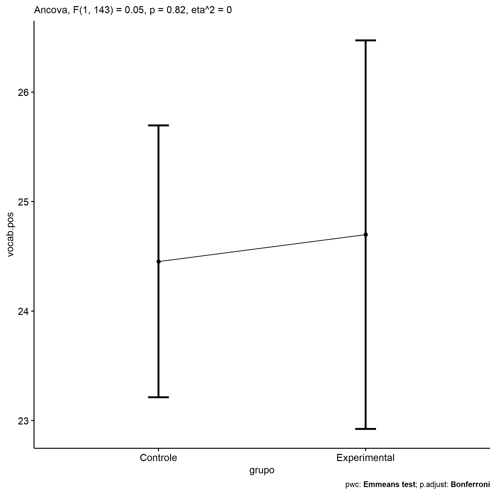<!-- -->

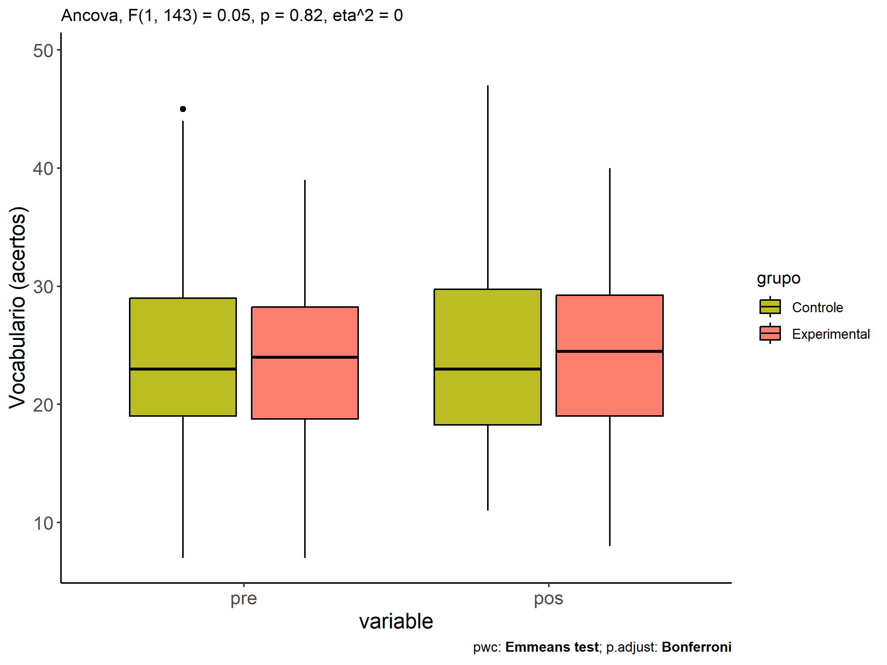<!-- -->

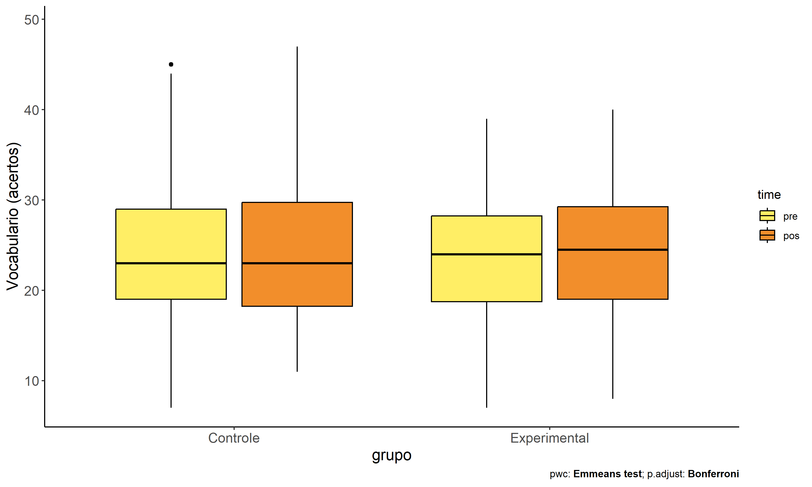<!-- -->

## Pairwise comparisons for two factors

### factores: **grupo:Sexo**

| var       | grupo        | Sexo |   n | M (pre) | SE (pre) | M (unadj) | SE (unadj) | M (adj) | SE (adj) |
|:----------|:-------------|:-----|----:|--------:|---------:|----------:|-----------:|--------:|---------:|
| vocab.pos | Controle     | F    |  43 |  24.535 |    1.048 |    24.907 |      1.058 |  24.334 |    0.955 |
| vocab.pos | Controle     | M    |  55 |  23.545 |    1.150 |    24.418 |      1.286 |  24.546 |    0.843 |
| vocab.pos | Experimental | F    |  16 |  24.000 |    1.744 |    24.062 |      1.442 |  23.869 |    1.562 |
| vocab.pos | Experimental | M    |  32 |  22.812 |    1.277 |    24.469 |      1.495 |  25.116 |    1.106 |

| .y.       | grupo        | Sexo | group1   | group2       | estimate | conf.low | conf.high |    se | statistic |     p | p.adj | p.adj.signif |
|:----------|:-------------|:-----|:---------|:-------------|---------:|---------:|----------:|------:|----------:|------:|------:|:-------------|
| vocab.pos |              | F    | Controle | Experimental |    0.466 |   -3.153 |     4.084 | 1.830 |     0.254 | 0.799 | 0.799 | ns           |
| vocab.pos |              | M    | Controle | Experimental |   -0.570 |   -3.318 |     2.179 | 1.390 |    -0.410 | 0.683 | 0.683 | ns           |
| vocab.pre |              | F    | Controle | Experimental |    0.535 |   -3.881 |     4.951 | 2.234 |     0.239 | 0.811 | 0.811 | ns           |
| vocab.pre |              | M    | Controle | Experimental |    0.733 |   -2.620 |     4.086 | 1.696 |     0.432 | 0.666 | 0.666 | ns           |
| vocab.pos | Controle     |      | F        | M            |   -0.212 |   -2.730 |     2.307 | 1.274 |    -0.166 | 0.868 | 0.868 | ns           |
| vocab.pos | Experimental |      | F        | M            |   -1.247 |   -5.033 |     2.539 | 1.915 |    -0.651 | 0.516 | 0.516 | ns           |
| vocab.pre | Controle     |      | F        | M            |    0.989 |   -2.080 |     4.059 | 1.553 |     0.637 | 0.525 | 0.525 | ns           |
| vocab.pre | Experimental |      | F        | M            |    1.188 |   -3.430 |     5.805 | 2.336 |     0.508 | 0.612 | 0.612 | ns           |

| .y.   | grupo        | Sexo | group1 | group2 | estimate | conf.low | conf.high |    se | statistic |     p | p.adj | p.adj.signif |
|:------|:-------------|:-----|:-------|:-------|---------:|---------:|----------:|------:|----------:|------:|------:|:-------------|
| vocab | Controle     | F    | pre    | pos    |   -0.372 |   -3.743 |     2.999 | 1.713 |    -0.217 | 0.828 | 0.828 | ns           |
| vocab | Controle     | M    | pre    | pos    |   -0.873 |   -3.854 |     2.108 | 1.514 |    -0.576 | 0.565 | 0.565 | ns           |
| vocab | Experimental | F    | pre    | pos    |   -0.062 |   -5.589 |     5.464 | 2.808 |    -0.022 | 0.982 | 0.982 | ns           |
| vocab | Experimental | M    | pre    | pos    |   -1.656 |   -5.564 |     2.252 | 1.985 |    -0.834 | 0.405 | 0.405 | ns           |

    ## Scale for colour is already present.
    ## Adding another scale for colour, which will replace the existing scale.

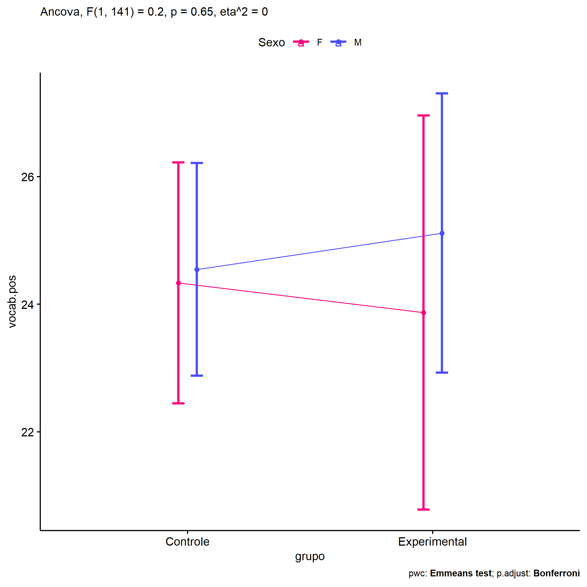<!-- -->

    ## Scale for colour is already present.
    ## Adding another scale for colour, which will replace the existing scale.

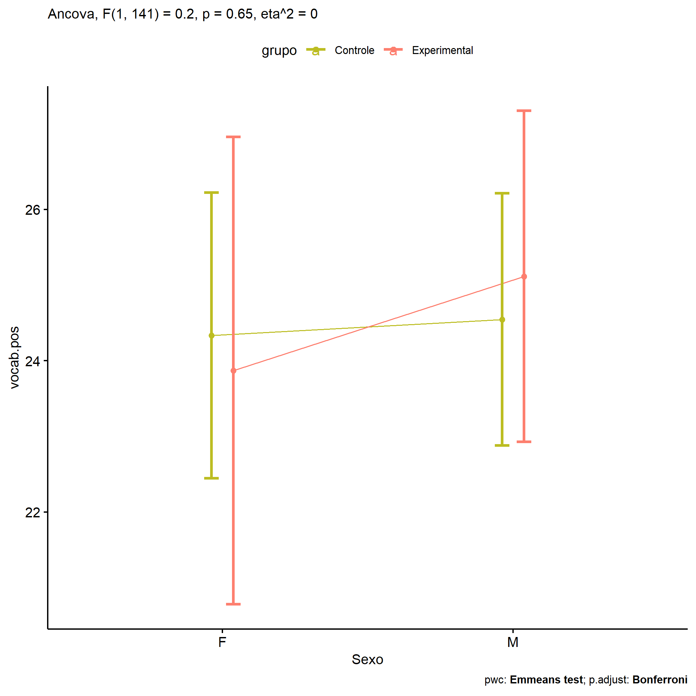<!-- -->

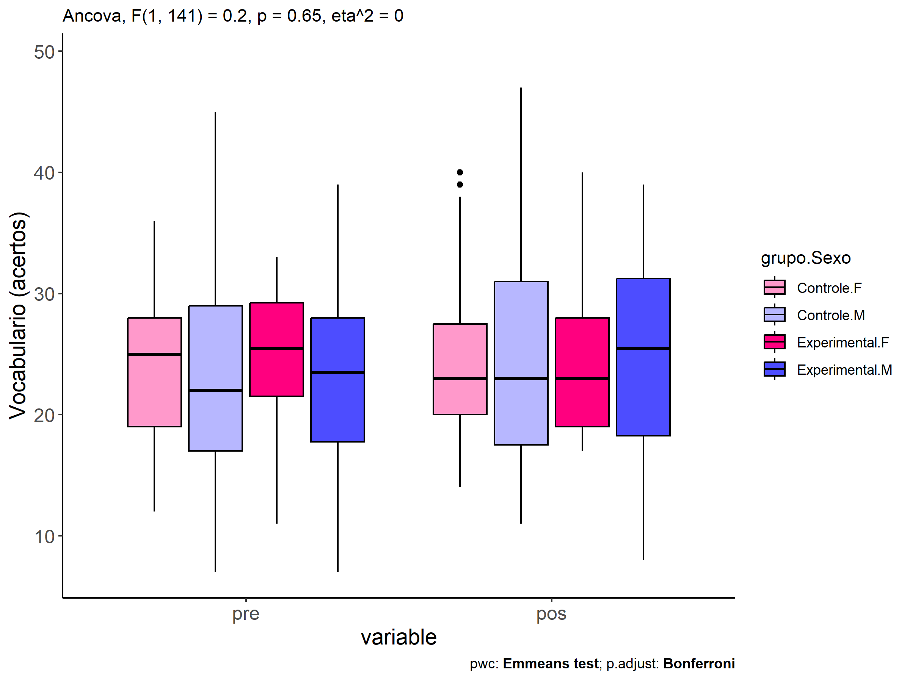<!-- -->

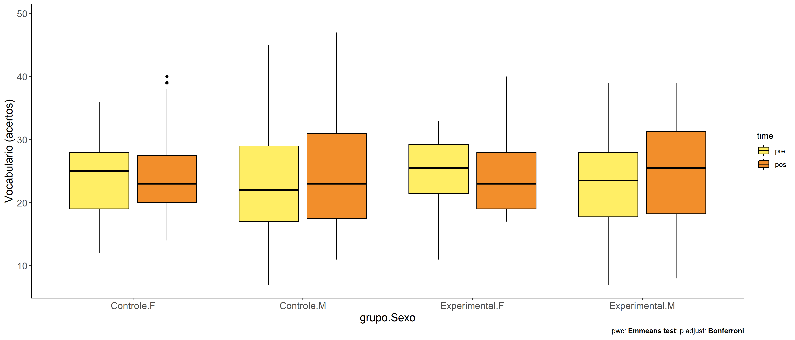<!-- -->

### factores: **grupo:Zona**

| var       | grupo        | Zona   |   n | M (pre) | SE (pre) | M (unadj) | SE (unadj) | M (adj) | SE (adj) |
|:----------|:-------------|:-------|----:|--------:|---------:|----------:|-----------:|--------:|---------:|
| vocab.pos | Controle     | Rural  |  56 |  23.607 |    0.944 |    24.821 |      1.156 |  24.573 |    0.775 |
| vocab.pos | Controle     | Urbana |  11 |  22.455 |    3.178 |    22.091 |      2.462 |  22.752 |    1.748 |
| vocab.pos | Experimental | Rural  |  34 |  22.618 |    1.247 |    24.059 |      1.346 |  24.591 |    0.995 |
| vocab.pos | Experimental | Urbana |   5 |  26.200 |    3.338 |    23.400 |      3.187 |  21.105 |    2.600 |

| .y.       | grupo        | Zona   | group1   | group2       | estimate | conf.low | conf.high |    se | statistic |     p | p.adj | p.adj.signif |
|:----------|:-------------|:-------|:---------|:-------------|---------:|---------:|----------:|------:|----------:|------:|------:|:-------------|
| vocab.pos |              | Rural  | Controle | Experimental |   -0.018 |   -2.522 |     2.485 | 1.262 |    -0.015 | 0.988 | 0.988 | ns           |
| vocab.pos |              | Urbana | Controle | Experimental |    1.647 |   -4.578 |     7.871 | 3.138 |     0.525 | 0.601 | 0.601 | ns           |
| vocab.pre |              | Rural  | Controle | Experimental |    0.989 |   -2.269 |     4.248 | 1.643 |     0.602 | 0.548 | 0.548 | ns           |
| vocab.pre |              | Urbana | Controle | Experimental |   -3.745 |  -11.830 |     4.339 | 4.076 |    -0.919 | 0.360 | 0.360 | ns           |
| vocab.pos | Controle     |        | Rural    | Urbana       |    1.821 |   -1.974 |     5.615 | 1.913 |     0.952 | 0.343 | 0.343 | ns           |
| vocab.pos | Experimental |        | Rural    | Urbana       |    3.486 |   -2.045 |     9.017 | 2.788 |     1.250 | 0.214 | 0.214 | ns           |
| vocab.pre | Controle     |        | Rural    | Urbana       |    1.153 |   -3.791 |     6.096 | 2.492 |     0.462 | 0.645 | 0.645 | ns           |
| vocab.pre | Experimental |        | Rural    | Urbana       |   -3.582 |  -10.762 |     3.597 | 3.620 |    -0.990 | 0.325 | 0.325 | ns           |

| .y.   | grupo        | Zona   | group1 | group2 | estimate | conf.low | conf.high |    se | statistic |     p | p.adj | p.adj.signif |
|:------|:-------------|:-------|:-------|:-------|---------:|---------:|----------:|------:|----------:|------:|------:|:-------------|
| vocab | Controle     | Rural  | pre    | pos    |   -1.214 |   -4.171 |     1.742 | 1.499 |    -0.810 | 0.419 | 0.419 | ns           |
| vocab | Controle     | Urbana | pre    | pos    |    0.364 |   -6.307 |     7.034 | 3.383 |     0.107 | 0.915 | 0.915 | ns           |
| vocab | Experimental | Rural  | pre    | pos    |   -1.441 |   -5.235 |     2.353 | 1.924 |    -0.749 | 0.455 | 0.455 | ns           |
| vocab | Experimental | Urbana | pre    | pos    |    2.800 |   -7.094 |    12.694 | 5.018 |     0.558 | 0.577 | 0.577 | ns           |

    ## Scale for colour is already present.
    ## Adding another scale for colour, which will replace the existing scale.

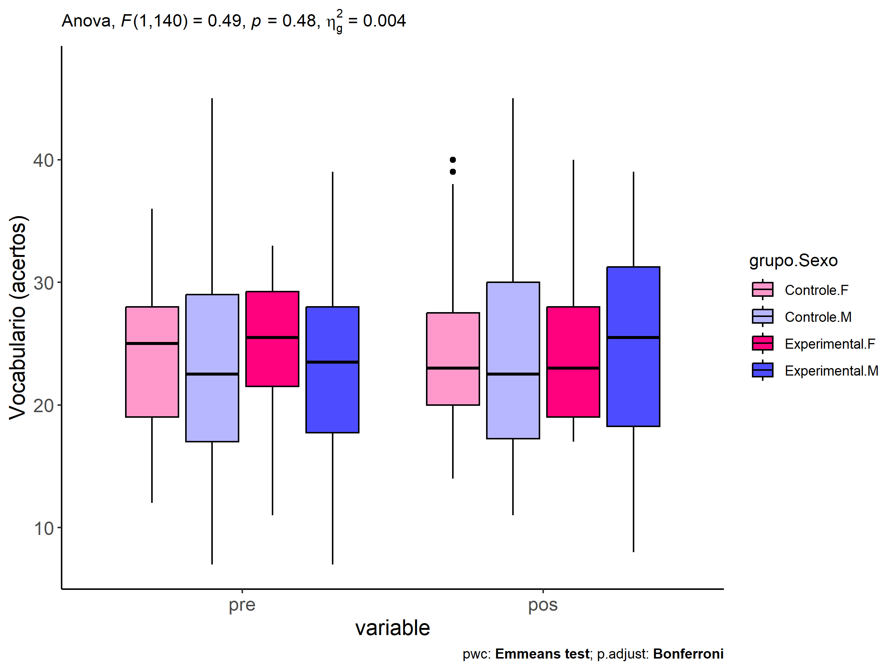<!-- -->

    ## Scale for colour is already present.
    ## Adding another scale for colour, which will replace the existing scale.

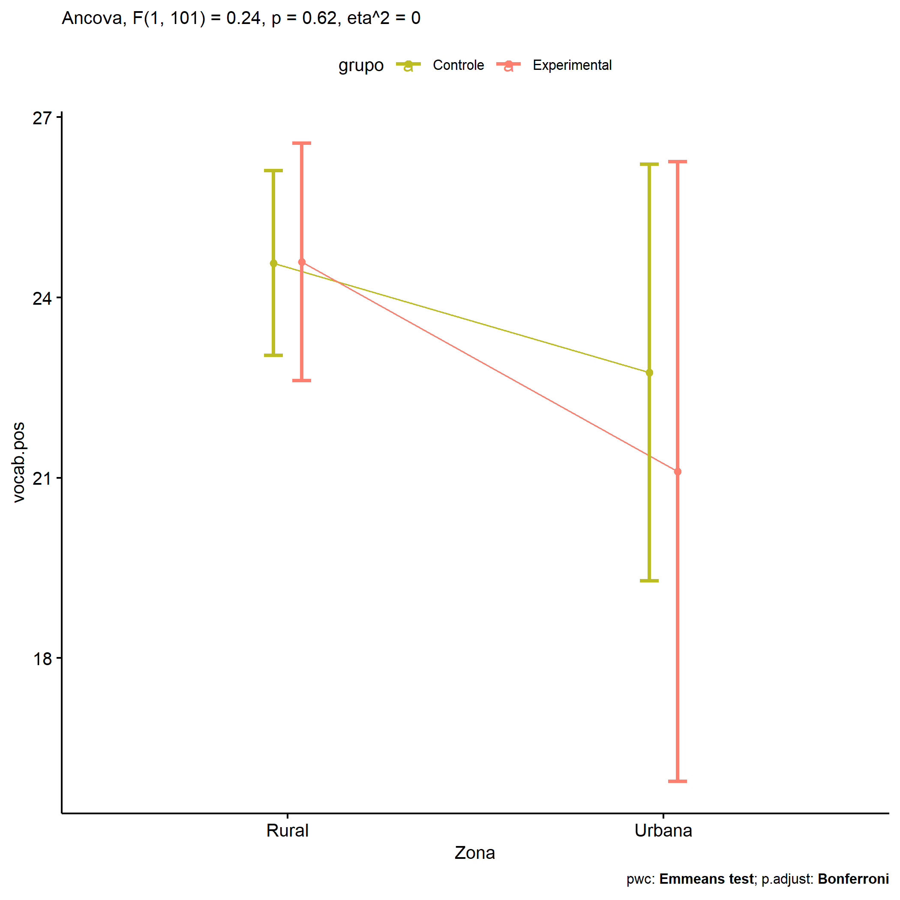<!-- -->

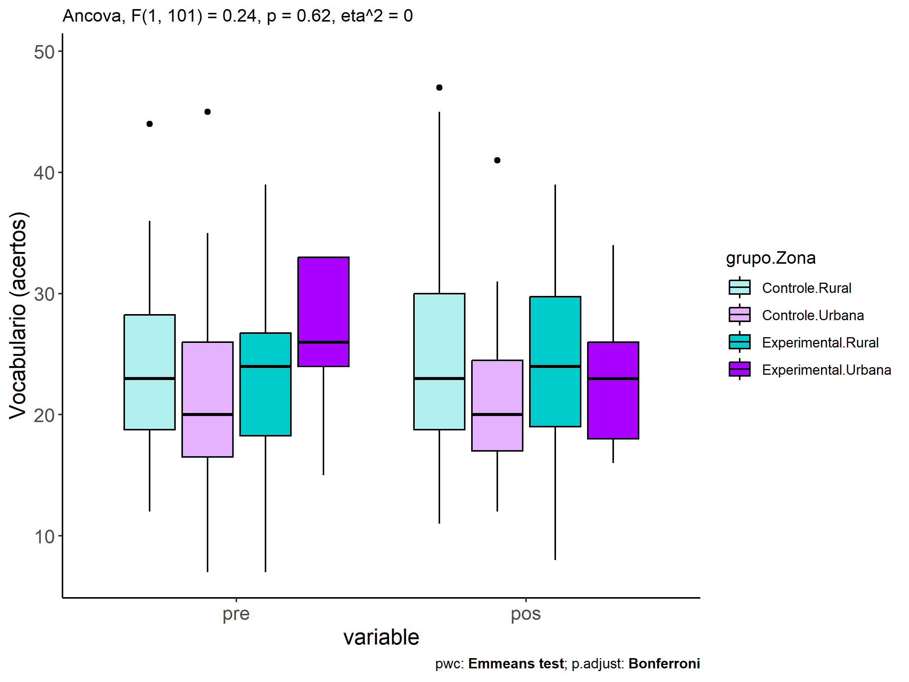<!-- -->

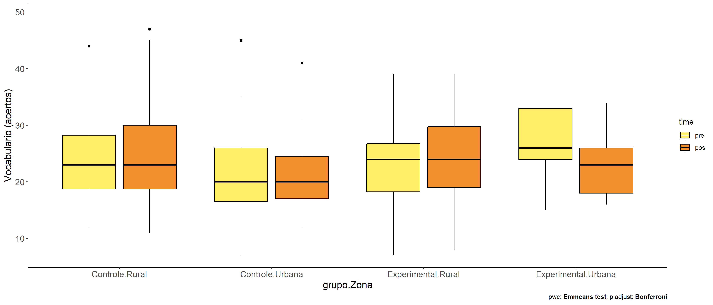<!-- -->

### factores: **grupo:Cor.Raca**

| var       | grupo        | Cor.Raca |   n | M (pre) | SE (pre) | M (unadj) | SE (unadj) | M (adj) | SE (adj) |
|:----------|:-------------|:---------|----:|--------:|---------:|----------:|-----------:|--------:|---------:|
| vocab.pos | Controle     | Branca   |  11 |  23.909 |    1.919 |    25.727 |      2.501 |  24.938 |    1.650 |
| vocab.pos | Controle     | Parda    |  45 |  23.156 |    1.120 |    23.622 |      1.178 |  23.412 |    0.815 |
| vocab.pos | Experimental | Branca   |   5 |  21.200 |    2.478 |    28.000 |      3.332 |  29.294 |    2.448 |
| vocab.pos | Experimental | Indígena |   6 |  24.833 |    2.182 |    21.667 |      2.716 |  20.166 |    2.237 |
| vocab.pos | Experimental | Parda    |  18 |  21.389 |    2.104 |    22.111 |      1.937 |  23.260 |    1.294 |

|     | .y.       | grupo        | Cor.Raca | group1   | group2       | estimate | conf.low | conf.high |    se | statistic |     p | p.adj | p.adj.signif |
|:----|:----------|:-------------|:---------|:---------|:-------------|---------:|---------:|----------:|------:|----------:|------:|------:|:-------------|
| 1   | vocab.pos |              | Branca   | Controle | Experimental |   -4.356 |  -10.240 |     1.527 | 2.956 |    -1.474 | 0.145 | 0.145 | ns           |
| 3   | vocab.pos |              | Parda    | Controle | Experimental |    0.152 |   -2.895 |     3.200 | 1.531 |     0.100 | 0.921 | 0.921 | ns           |
| 4   | vocab.pre |              | Branca   | Controle | Experimental |    2.709 |   -5.351 |    10.769 | 4.050 |     0.669 | 0.505 | 0.505 | ns           |
| 6   | vocab.pre |              | Parda    | Controle | Experimental |    1.767 |   -2.401 |     5.934 | 2.094 |     0.844 | 0.401 | 0.401 | ns           |
| 8   | vocab.pos | Controle     |          | Branca   | Parda        |    1.525 |   -2.135 |     5.186 | 1.839 |     0.829 | 0.409 | 0.409 | ns           |
| 10  | vocab.pos | Experimental |          | Branca   | Indígena     |    9.128 |    2.514 |    15.741 | 3.323 |     2.747 | 0.007 | 0.022 | \*           |
| 11  | vocab.pos | Experimental |          | Branca   | Parda        |    6.034 |    0.535 |    11.533 | 2.763 |     2.184 | 0.032 | 0.096 | ns           |
| 12  | vocab.pos | Experimental |          | Indígena | Parda        |   -3.094 |   -8.252 |     2.065 | 2.592 |    -1.194 | 0.236 | 0.708 | ns           |
| 14  | vocab.pre | Controle     |          | Branca   | Parda        |    0.754 |   -4.273 |     5.780 | 2.526 |     0.298 | 0.766 | 0.766 | ns           |
| 16  | vocab.pre | Experimental |          | Branca   | Indígena     |   -3.633 |  -12.682 |     5.415 | 4.547 |    -0.799 | 0.427 | 1.000 | ns           |
| 17  | vocab.pre | Experimental |          | Branca   | Parda        |   -0.189 |   -7.743 |     7.365 | 3.796 |    -0.050 | 0.960 | 1.000 | ns           |
| 18  | vocab.pre | Experimental |          | Indígena | Parda        |    3.444 |   -3.600 |    10.489 | 3.540 |     0.973 | 0.333 | 1.000 | ns           |

| .y.   | grupo        | Cor.Raca | group1 | group2 | estimate | conf.low | conf.high |    se | statistic |     p | p.adj | p.adj.signif |
|:------|:-------------|:---------|:-------|:-------|---------:|---------:|----------:|------:|----------:|------:|------:|:-------------|
| vocab | Controle     | Branca   | pre    | pos    |   -1.818 |   -8.320 |     4.684 | 3.292 |    -0.552 | 0.582 | 0.582 | ns           |
| vocab | Controle     | Parda    | pre    | pos    |   -0.467 |   -3.681 |     2.748 | 1.628 |    -0.287 | 0.775 | 0.775 | ns           |
| vocab | Experimental | Branca   | pre    | pos    |   -6.800 |  -16.444 |     2.844 | 4.883 |    -1.393 | 0.166 | 0.166 | ns           |
| vocab | Experimental | Indígena | pre    | pos    |    3.167 |   -5.637 |    11.970 | 4.458 |     0.710 | 0.479 | 0.479 | ns           |
| vocab | Experimental | Parda    | pre    | pos    |   -0.722 |   -5.805 |     4.361 | 2.574 |    -0.281 | 0.779 | 0.779 | ns           |

    ## Scale for colour is already present.
    ## Adding another scale for colour, which will replace the existing scale.

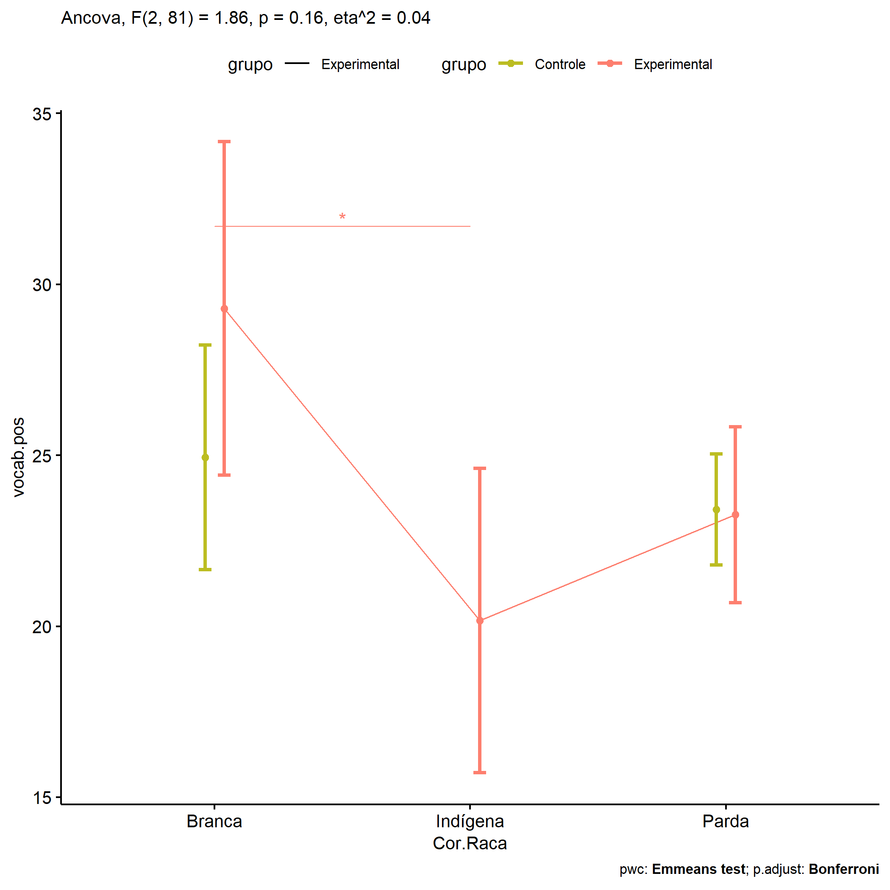<!-- -->

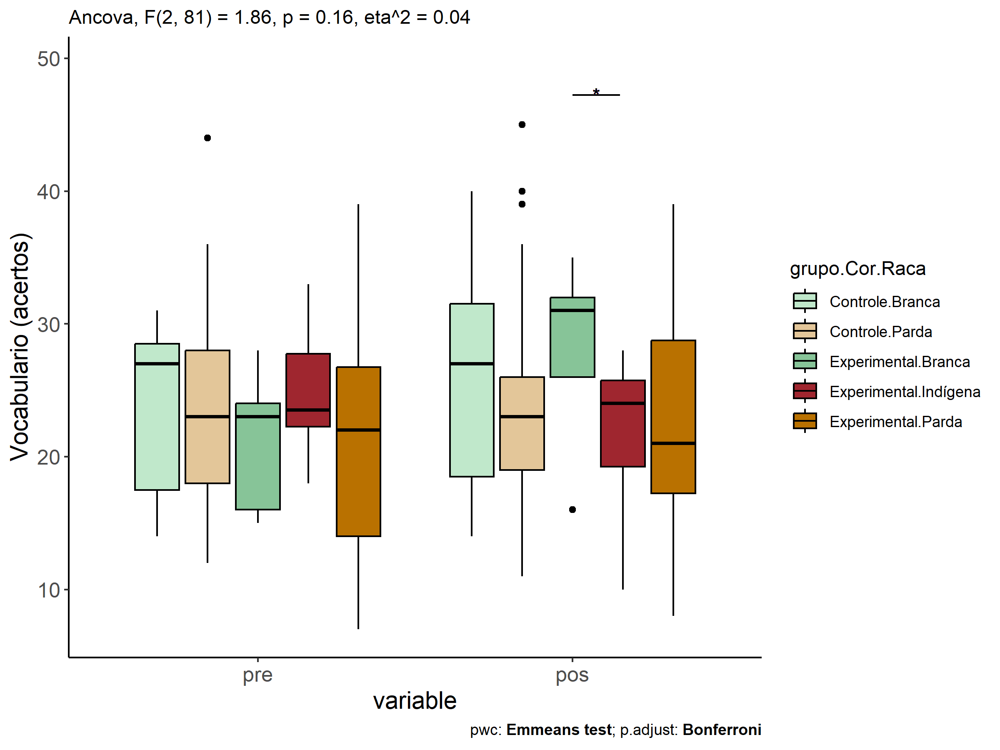<!-- -->

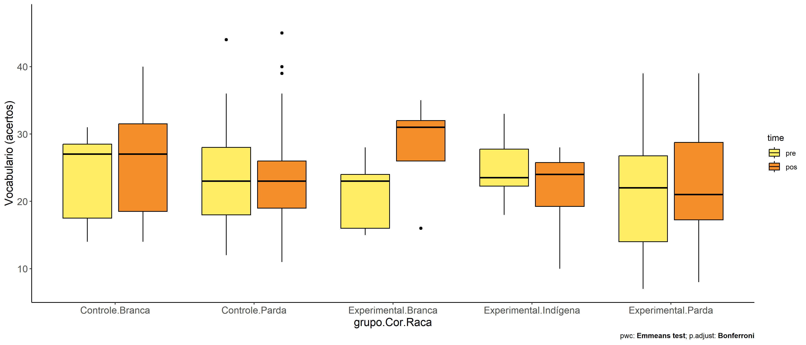<!-- -->

### factores: **grupo:vocab.quintile**

| var       | grupo        | vocab.quintile |   n | M (pre) | SE (pre) | M (unadj) | SE (unadj) | M (adj) | SE (adj) |
|:----------|:-------------|:---------------|----:|--------:|---------:|----------:|-----------:|--------:|---------:|
| vocab.pos | Controle     | 1st quintile   |  17 |  13.529 |    0.550 |    17.294 |      0.915 |  25.332 |    2.911 |
| vocab.pos | Controle     | 2nd quintile   |  28 |  19.286 |    0.276 |    21.393 |      1.367 |  24.846 |    1.593 |
| vocab.pos | Controle     | 3rd quintile   |  31 |  26.097 |    0.389 |    25.613 |      1.079 |  23.641 |    1.278 |
| vocab.pos | Controle     | 4th quintile   |   9 |  31.667 |    0.471 |    32.556 |      2.416 |  26.147 |    2.877 |
| vocab.pos | Controle     | 5th quintile   |  13 |  37.385 |    1.016 |    33.385 |      2.526 |  22.422 |    3.807 |
| vocab.pos | Experimental | 1st quintile   |   9 |  12.111 |    0.964 |    17.333 |      2.279 |  26.500 |    3.519 |
| vocab.pos | Experimental | 2nd quintile   |   8 |  19.125 |    0.639 |    19.000 |      2.188 |  22.581 |    2.474 |
| vocab.pos | Experimental | 3rd quintile   |  21 |  25.286 |    0.432 |    27.238 |      1.322 |  25.912 |    1.426 |
| vocab.pos | Experimental | 4th quintile   |   9 |  31.333 |    0.527 |    27.667 |      1.581 |  21.524 |    2.821 |

|     | .y.       | grupo        | vocab.quintile | group1       | group2       | estimate | conf.low | conf.high |    se | statistic | p       | p.adj   | p.adj.signif |
|:----|:----------|:-------------|:---------------|:-------------|:-------------|---------:|---------:|----------:|------:|----------:|:--------|:--------|:-------------|
| 1   | vocab.pos |              | 1st quintile   | Controle     | Experimental |   -1.169 |   -6.316 |     3.979 | 2.603 |    -0.449 | 0.654   | 0.654   | ns           |
| 2   | vocab.pos |              | 2nd quintile   | Controle     | Experimental |    2.265 |   -2.696 |     7.226 | 2.509 |     0.903 | 0.368   | 0.368   | ns           |
| 3   | vocab.pos |              | 3rd quintile   | Controle     | Experimental |   -2.271 |   -5.791 |     1.248 | 1.780 |    -1.276 | 0.204   | 0.204   | ns           |
| 4   | vocab.pos |              | 4th quintile   | Controle     | Experimental |    4.623 |   -1.212 |    10.459 | 2.951 |     1.567 | 0.119   | 0.119   | ns           |
| 6   | vocab.pre |              | 1st quintile   | Controle     | Experimental |    1.418 |   -0.358 |     3.195 | 0.898 |     1.579 | 0.117   | 0.117   | ns           |
| 7   | vocab.pre |              | 2nd quintile   | Controle     | Experimental |    0.161 |   -1.567 |     1.888 | 0.874 |     0.184 | 0.854   | 0.854   | ns           |
| 8   | vocab.pre |              | 3rd quintile   | Controle     | Experimental |    0.811 |   -0.407 |     2.029 | 0.616 |     1.317 | 0.19    | 0.19    | ns           |
| 9   | vocab.pre |              | 4th quintile   | Controle     | Experimental |    0.333 |   -1.698 |     2.365 | 1.027 |     0.324 | 0.746   | 0.746   | ns           |
| 11  | vocab.pos | Controle     |                | 1st quintile | 2nd quintile |    0.486 |   -4.240 |     5.212 | 2.389 |     0.203 | 0.839   | 1       | ns           |
| 12  | vocab.pos | Controle     |                | 1st quintile | 3rd quintile |    1.691 |   -5.478 |     8.860 | 3.625 |     0.466 | 0.642   | 1       | ns           |
| 13  | vocab.pos | Controle     |                | 1st quintile | 4th quintile |   -0.816 |  -11.014 |     9.383 | 5.157 |    -0.158 | 0.875   | 1       | ns           |
| 14  | vocab.pos | Controle     |                | 1st quintile | 5th quintile |    2.910 |   -9.569 |    15.388 | 6.310 |     0.461 | 0.645   | 1       | ns           |
| 15  | vocab.pos | Controle     |                | 2nd quintile | 3rd quintile |    1.205 |   -3.422 |     5.832 | 2.339 |     0.515 | 0.607   | 1       | ns           |
| 16  | vocab.pos | Controle     |                | 2nd quintile | 4th quintile |   -1.302 |   -8.971 |     6.368 | 3.878 |    -0.336 | 0.738   | 1       | ns           |
| 17  | vocab.pos | Controle     |                | 2nd quintile | 5th quintile |    2.424 |   -7.319 |    12.166 | 4.926 |     0.492 | 0.624   | 1       | ns           |
| 18  | vocab.pos | Controle     |                | 3rd quintile | 4th quintile |   -2.506 |   -7.920 |     2.907 | 2.737 |    -0.916 | 0.362   | 1       | ns           |
| 19  | vocab.pos | Controle     |                | 3rd quintile | 5th quintile |    1.219 |   -5.632 |     8.069 | 3.464 |     0.352 | 0.725   | 1       | ns           |
| 20  | vocab.pos | Controle     |                | 4th quintile | 5th quintile |    3.725 |   -2.320 |     9.770 | 3.057 |     1.219 | 0.225   | 1       | ns           |
| 21  | vocab.pos | Experimental |                | 1st quintile | 2nd quintile |    3.920 |   -2.995 |    10.835 | 3.497 |     1.121 | 0.264   | 1       | ns           |
| 22  | vocab.pos | Experimental |                | 1st quintile | 3rd quintile |    0.588 |   -7.502 |     8.679 | 4.091 |     0.144 | 0.886   | 1       | ns           |
| 23  | vocab.pos | Experimental |                | 1st quintile | 4th quintile |    4.977 |   -6.052 |    16.006 | 5.577 |     0.892 | 0.374   | 1       | ns           |
| 25  | vocab.pos | Experimental |                | 2nd quintile | 3rd quintile |   -3.331 |   -9.284 |     2.621 | 3.010 |    -1.107 | 0.27    | 1       | ns           |
| 26  | vocab.pos | Experimental |                | 2nd quintile | 4th quintile |    1.057 |   -7.398 |     9.512 | 4.275 |     0.247 | 0.805   | 1       | ns           |
| 28  | vocab.pos | Experimental |                | 3rd quintile | 4th quintile |    4.388 |   -1.354 |    10.131 | 2.904 |     1.511 | 0.133   | 0.798   | ns           |
| 31  | vocab.pre | Controle     |                | 1st quintile | 2nd quintile |   -5.756 |   -7.081 |    -4.431 | 0.670 |    -8.591 | \<0.001 | \<0.001 | \*\*\*\*     |
| 32  | vocab.pre | Controle     |                | 1st quintile | 3rd quintile |  -12.567 |  -13.868 |   -11.267 | 0.658 |   -19.110 | \<0.001 | \<0.001 | \*\*\*\*     |
| 33  | vocab.pre | Controle     |                | 1st quintile | 4th quintile |  -18.137 |  -19.914 |   -16.361 | 0.898 |   -20.191 | \<0.001 | \<0.001 | \*\*\*\*     |
| 34  | vocab.pre | Controle     |                | 1st quintile | 5th quintile |  -23.855 |  -25.443 |   -22.268 | 0.803 |   -29.713 | \<0.001 | \<0.001 | \*\*\*\*     |
| 35  | vocab.pre | Controle     |                | 2nd quintile | 3rd quintile |   -6.811 |   -7.935 |    -5.688 | 0.568 |   -11.989 | \<0.001 | \<0.001 | \*\*\*\*     |
| 36  | vocab.pre | Controle     |                | 2nd quintile | 4th quintile |  -12.381 |  -14.032 |   -10.730 | 0.835 |   -14.828 | \<0.001 | \<0.001 | \*\*\*\*     |
| 37  | vocab.pre | Controle     |                | 2nd quintile | 5th quintile |  -18.099 |  -19.545 |   -16.653 | 0.731 |   -24.748 | \<0.001 | \<0.001 | \*\*\*\*     |
| 38  | vocab.pre | Controle     |                | 3rd quintile | 4th quintile |   -5.570 |   -7.202 |    -3.938 | 0.825 |    -6.751 | \<0.001 | \<0.001 | \*\*\*\*     |
| 39  | vocab.pre | Controle     |                | 3rd quintile | 5th quintile |  -11.288 |  -12.712 |    -9.864 | 0.720 |   -15.677 | \<0.001 | \<0.001 | \*\*\*\*     |
| 40  | vocab.pre | Controle     |                | 4th quintile | 5th quintile |   -5.718 |   -7.587 |    -3.849 | 0.945 |    -6.051 | \<0.001 | \<0.001 | \*\*\*\*     |
| 41  | vocab.pre | Experimental |                | 1st quintile | 2nd quintile |   -7.014 |   -9.108 |    -4.920 | 1.059 |    -6.624 | \<0.001 | \<0.001 | \*\*\*\*     |
| 42  | vocab.pre | Experimental |                | 1st quintile | 3rd quintile |  -13.175 |  -14.891 |   -11.458 | 0.868 |   -15.175 | \<0.001 | \<0.001 | \*\*\*\*     |
| 43  | vocab.pre | Experimental |                | 1st quintile | 4th quintile |  -19.222 |  -21.254 |   -17.191 | 1.027 |   -18.713 | \<0.001 | \<0.001 | \*\*\*\*     |
| 45  | vocab.pre | Experimental |                | 2nd quintile | 3rd quintile |   -6.161 |   -7.951 |    -4.370 | 0.905 |    -6.805 | \<0.001 | \<0.001 | \*\*\*\*     |
| 46  | vocab.pre | Experimental |                | 2nd quintile | 4th quintile |  -12.208 |  -14.302 |   -10.114 | 1.059 |   -11.530 | \<0.001 | \<0.001 | \*\*\*\*     |
| 48  | vocab.pre | Experimental |                | 3rd quintile | 4th quintile |   -6.048 |   -7.764 |    -4.331 | 0.868 |    -6.966 | \<0.001 | \<0.001 | \*\*\*\*     |

| .y.   | grupo        | vocab.quintile | group1 | group2 | estimate | conf.low | conf.high |    se | statistic |     p | p.adj | p.adj.signif |
|:------|:-------------|:---------------|:-------|:-------|---------:|---------:|----------:|------:|----------:|------:|------:|:-------------|
| vocab | Controle     | 1st quintile   | pre    | pos    |   -3.765 |   -7.025 |    -0.504 | 1.656 |    -2.273 | 0.024 | 0.024 | \*           |
| vocab | Controle     | 2nd quintile   | pre    | pos    |   -2.107 |   -4.648 |     0.433 | 1.290 |    -1.633 | 0.104 | 0.104 | ns           |
| vocab | Controle     | 3rd quintile   | pre    | pos    |    0.484 |   -1.930 |     2.898 | 1.226 |     0.395 | 0.693 | 0.693 | ns           |
| vocab | Controle     | 4th quintile   | pre    | pos    |   -0.889 |   -5.370 |     3.592 | 2.276 |    -0.391 | 0.696 | 0.696 | ns           |
| vocab | Controle     | 5th quintile   | pre    | pos    |    4.000 |    0.272 |     7.728 | 1.894 |     2.112 | 0.036 | 0.036 | \*           |
| vocab | Experimental | 1st quintile   | pre    | pos    |   -5.222 |   -9.703 |    -0.741 | 2.276 |    -2.294 | 0.023 | 0.023 | \*           |
| vocab | Experimental | 2nd quintile   | pre    | pos    |    0.125 |   -4.628 |     4.878 | 2.414 |     0.052 | 0.959 | 0.959 | ns           |
| vocab | Experimental | 3rd quintile   | pre    | pos    |   -1.952 |   -4.886 |     0.981 | 1.490 |    -1.310 | 0.191 | 0.191 | ns           |
| vocab | Experimental | 4th quintile   | pre    | pos    |    3.667 |   -0.814 |     8.147 | 2.276 |     1.611 | 0.108 | 0.108 | ns           |

    ## Scale for colour is already present.
    ## Adding another scale for colour, which will replace the existing scale.

<!-- -->

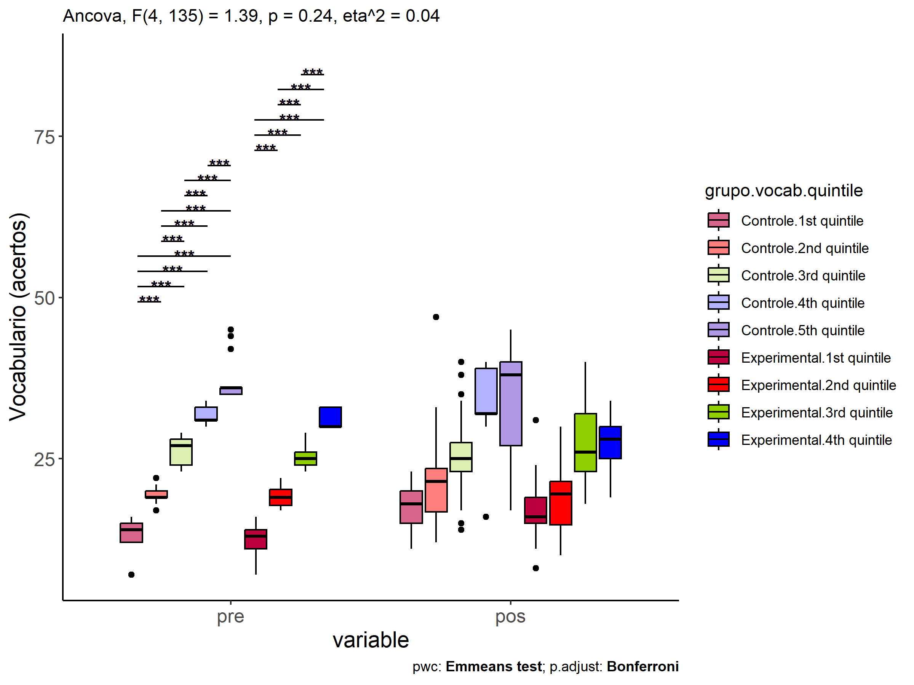<!-- -->

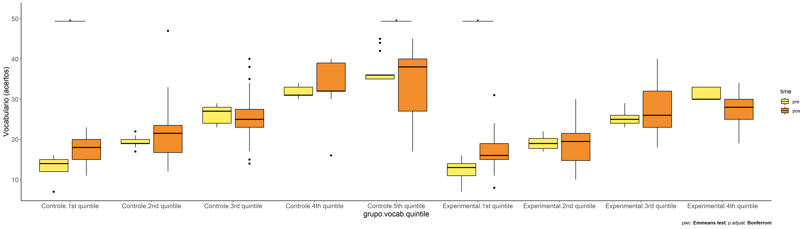<!-- -->
