ANCOVA in flow (debate) (flow (debate))
================
Geiser C. Challco <geiser@alumni.usp.br>

- [Descriptive Statistics of Initial
  Data](#descriptive-statistics-of-initial-data)
- [Checking of Assumptions](#checking-of-assumptions)
  - [Assumption: Normality distribution of
    data](#assumption-normality-distribution-of-data)
  - [Assumption: Homogeneity of data
    distribution](#assumption-homogeneity-of-data-distribution)
- [Computation of ANCOVA test and Pairwise
  Comparison](#computation-of-ancova-test-and-pairwise-comparison)
  - [ANCOVA tests for one factor](#ancova-tests-for-one-factor)
  - [ANCOVA tests for two factors](#ancova-tests-for-two-factors)
  - [Pairwise comparisons for one factor:
    **grupo**](#pairwise-comparisons-for-one-factor-grupo)
  - [Pairwise comparisons for two
    factors](#pairwise-comparisons-for-two-factors)
    - [factores: **grupo:Sexo**](#factores-gruposexo)
    - [factores: **grupo:Zona**](#factores-grupozona)
    - [factores: **grupo:Cor.Raca**](#factores-grupocorraca)

**NOTE**

- Teste ANCOVA para determinar se houve diferenças significativas no
  flow (debate) (medido usando pre- e pos-testes).
- ANCOVA test to determine whether there were significant differences in
  flow (debate) (measured using pre- and post-tests).

# Descriptive Statistics of Initial Data

| grupo        | Sexo | Zona   | Cor.Raca | variable        |   n |  mean | median |   min |   max |    sd |    se |    ci |   iqr |
|:-------------|:-----|:-------|:---------|:----------------|----:|------:|-------:|------:|------:|------:|------:|------:|------:|
| Controle     | F    |        |          | dfs.media.debat |  69 | 3.535 |  3.667 | 1.444 | 4.667 | 0.626 | 0.075 | 0.150 | 0.889 |
| Controle     | M    |        |          | dfs.media.debat |  79 | 3.441 |  3.333 | 2.111 | 4.889 | 0.621 | 0.070 | 0.139 | 0.889 |
| Experimental | F    |        |          | dfs.media.debat |  86 | 3.442 |  3.389 | 1.667 | 4.667 | 0.589 | 0.063 | 0.126 | 0.889 |
| Experimental | M    |        |          | dfs.media.debat |  80 | 3.374 |  3.410 | 1.875 | 5.000 | 0.614 | 0.069 | 0.137 | 0.778 |
| Controle     | F    |        |          | fss.media.debat |  69 | 3.498 |  3.556 | 1.444 | 4.667 | 0.615 | 0.074 | 0.148 | 0.778 |
| Controle     | M    |        |          | fss.media.debat |  79 | 3.423 |  3.444 | 2.000 | 5.000 | 0.610 | 0.069 | 0.137 | 0.611 |
| Experimental | F    |        |          | fss.media.debat |  86 | 3.433 |  3.444 | 1.333 | 5.000 | 0.635 | 0.068 | 0.136 | 0.778 |
| Experimental | M    |        |          | fss.media.debat |  80 | 3.394 |  3.444 | 2.000 | 4.556 | 0.572 | 0.064 | 0.127 | 0.778 |
| Controle     |      | Rural  |          | dfs.media.debat | 102 | 3.551 |  3.444 | 2.333 | 4.889 | 0.565 | 0.056 | 0.111 | 0.778 |
| Controle     |      | Urbana |          | dfs.media.debat |  24 | 3.494 |  3.556 | 2.111 | 4.778 | 0.732 | 0.149 | 0.309 | 0.917 |
| Controle     |      |        |          | dfs.media.debat |  22 | 3.167 |  3.056 | 1.444 | 4.333 | 0.680 | 0.145 | 0.302 | 0.889 |
| Experimental |      | Rural  |          | dfs.media.debat |  79 | 3.366 |  3.444 | 1.667 | 4.556 | 0.570 | 0.064 | 0.128 | 0.778 |
| Experimental |      | Urbana |          | dfs.media.debat |  42 | 3.365 |  3.222 | 2.000 | 5.000 | 0.607 | 0.094 | 0.189 | 0.778 |
| Experimental |      |        |          | dfs.media.debat |  45 | 3.526 |  3.444 | 2.111 | 5.000 | 0.643 | 0.096 | 0.193 | 0.889 |
| Controle     |      | Rural  |          | fss.media.debat | 102 | 3.502 |  3.528 | 2.000 | 5.000 | 0.602 | 0.060 | 0.118 | 0.778 |
| Controle     |      | Urbana |          | fss.media.debat |  24 | 3.503 |  3.500 | 1.444 | 4.889 | 0.689 | 0.141 | 0.291 | 0.806 |
| Controle     |      |        |          | fss.media.debat |  22 | 3.203 |  3.156 | 2.222 | 4.444 | 0.521 | 0.111 | 0.231 | 0.722 |
| Experimental |      | Rural  |          | fss.media.debat |  79 | 3.431 |  3.444 | 2.000 | 4.556 | 0.558 | 0.063 | 0.125 | 0.722 |
| Experimental |      | Urbana |          | fss.media.debat |  42 | 3.330 |  3.333 | 2.000 | 4.556 | 0.562 | 0.087 | 0.175 | 0.639 |
| Experimental |      |        |          | fss.media.debat |  45 | 3.462 |  3.556 | 1.333 | 5.000 | 0.715 | 0.107 | 0.215 | 0.889 |
| Controle     |      |        | Branca   | dfs.media.debat |  20 | 3.561 |  3.444 | 2.556 | 4.778 | 0.584 | 0.131 | 0.273 | 0.889 |
| Controle     |      |        | Indígena | dfs.media.debat |   3 | 3.806 |  3.750 | 3.444 | 4.222 | 0.392 | 0.226 | 0.973 | 0.389 |
| Controle     |      |        | Parda    | dfs.media.debat |  44 | 3.433 |  3.500 | 2.222 | 4.778 | 0.616 | 0.093 | 0.187 | 0.806 |
| Controle     |      |        | Preta    | dfs.media.debat |   1 | 3.556 |  3.556 | 3.556 | 3.556 |       |       |       | 0.000 |
| Controle     |      |        |          | dfs.media.debat |  80 | 3.481 |  3.444 | 1.444 | 4.889 | 0.650 | 0.073 | 0.145 | 0.806 |
| Experimental |      |        | Branca   | dfs.media.debat |  17 | 3.373 |  3.444 | 2.556 | 4.111 | 0.478 | 0.116 | 0.246 | 0.667 |
| Experimental |      |        | Indígena | dfs.media.debat |  12 | 3.351 |  3.222 | 2.667 | 4.333 | 0.549 | 0.159 | 0.349 | 0.726 |
| Experimental |      |        | Parda    | dfs.media.debat |  46 | 3.214 |  3.222 | 2.222 | 4.556 | 0.467 | 0.069 | 0.139 | 0.639 |
| Experimental |      |        | Preta    | dfs.media.debat |   1 | 3.222 |  3.222 | 3.222 | 3.222 |       |       |       | 0.000 |
| Experimental |      |        |          | dfs.media.debat |  90 | 3.526 |  3.556 | 1.667 | 5.000 | 0.667 | 0.070 | 0.140 | 0.889 |
| Controle     |      |        | Branca   | fss.media.debat |  20 | 3.578 |  3.444 | 2.889 | 4.444 | 0.484 | 0.108 | 0.227 | 0.778 |
| Controle     |      |        | Indígena | fss.media.debat |   3 | 3.519 |  3.667 | 2.556 | 4.333 | 0.898 | 0.519 | 2.231 | 0.889 |
| Controle     |      |        | Parda    | fss.media.debat |  44 | 3.438 |  3.500 | 1.444 | 5.000 | 0.645 | 0.097 | 0.196 | 0.694 |
| Controle     |      |        | Preta    | fss.media.debat |   1 | 3.333 |  3.333 | 3.333 | 3.333 |       |       |       | 0.000 |
| Controle     |      |        |          | fss.media.debat |  80 | 3.438 |  3.444 | 2.000 | 4.889 | 0.622 | 0.070 | 0.139 | 0.722 |
| Experimental |      |        | Branca   | fss.media.debat |  17 | 3.556 |  3.556 | 2.333 | 4.556 | 0.670 | 0.163 | 0.345 | 0.778 |
| Experimental |      |        | Indígena | fss.media.debat |  12 | 3.237 |  3.250 | 2.222 | 4.222 | 0.604 | 0.174 | 0.384 | 0.694 |
| Experimental |      |        | Parda    | fss.media.debat |  46 | 3.331 |  3.333 | 2.000 | 4.250 | 0.540 | 0.080 | 0.160 | 0.750 |
| Experimental |      |        | Preta    | fss.media.debat |   1 | 4.444 |  4.444 | 4.444 | 4.444 |       |       |       | 0.000 |
| Experimental |      |        |          | fss.media.debat |  90 | 3.442 |  3.500 | 1.333 | 5.000 | 0.615 | 0.065 | 0.129 | 0.667 |

# Checking of Assumptions

## Assumption: Normality distribution of data

| var             |   n |   skewness |  kurtosis | symmetry | statistic | method     |         p | p.signif | normality |
|:----------------|----:|-----------:|----------:|:---------|----------:|:-----------|----------:|:---------|:----------|
| fss.media.debat | 314 | -0.2104321 | 0.4512786 | YES      |  5.121097 | D’Agostino | 0.0772624 | ns       | \-        |
| fss.media.debat | 247 | -0.2112510 | 0.3875118 | YES      |  3.846110 | D’Agostino | 0.1461598 | ns       | \-        |
| fss.media.debat | 144 | -0.1849804 | 0.3588302 | YES      |  2.288337 | D’Agostino | 0.3184887 | ns       | QQ        |

## Assumption: Homogeneity of data distribution

| var             | method         | formula                    |   n | DFn.df1 | DFd.df2 | statistic |         p | p.signif |
|:----------------|:---------------|:---------------------------|----:|--------:|--------:|----------:|----------:|:---------|
| fss.media.debat | Levene’s test  | `.res`~`grupo`\*`Sexo`     | 314 |       3 |     310 | 0.3326218 | 0.8017680 | ns       |
| fss.media.debat | Anova’s slopes | `.res`~`grupo`\*`Sexo`     | 314 |       3 |     306 | 1.8510000 | 0.1380000 | ns       |
| fss.media.debat | Levene’s test  | `.res`~`grupo`\*`Zona`     | 247 |       3 |     243 | 0.3865726 | 0.7627731 | ns       |
| fss.media.debat | Anova’s slopes | `.res`~`grupo`\*`Zona`     | 247 |       3 |     239 | 2.6790000 | 0.0480000 | ns       |
| fss.media.debat | Levene’s test  | `.res`~`grupo`\*`Cor.Raca` | 144 |       7 |     136 | 0.6055855 | 0.7505152 | ns       |
| fss.media.debat | Anova’s slopes | `.res`~`grupo`\*`Cor.Raca` | 144 |       5 |     130 | 1.1200000 | 0.3530000 | ns       |

# Computation of ANCOVA test and Pairwise Comparison

## ANCOVA tests for one factor

|     | Effect          | DFn | DFd |    SSn |    SSd |      F | p       |   ges | p\<.05 |
|:----|:----------------|----:|----:|-------:|-------:|-------:|:--------|------:|:-------|
| 1   | dfs.media.debat |   1 | 311 | 21.554 | 93.550 | 71.653 | \<0.001 | 0.187 | \*     |
| 2   | grupo           |   1 | 311 |  0.010 | 93.550 |  0.034 | 0.854   | 0.000 |        |
| 4   | Sexo            |   1 | 311 |  0.034 | 93.526 |  0.113 | 0.737   | 0.000 |        |
| 6   | Zona            |   1 | 244 |  0.138 | 69.332 |  0.484 | 0.487   | 0.002 |        |
| 8   | Cor.Raca        |   3 | 139 |  1.235 | 43.493 |  1.316 | 0.272   | 0.028 |        |

## ANCOVA tests for two factors

|     | Effect          | DFn | DFd |    SSn |    SSd |      F | p       |   ges | p\<.05 |
|:----|:----------------|----:|----:|-------:|-------:|-------:|:--------|------:|:-------|
| 1   | dfs.media.debat |   1 | 309 | 21.332 | 93.503 | 70.496 | \<0.001 | 0.186 | \*     |
| 4   | grupo:Sexo      |   1 | 309 |  0.011 | 93.503 |  0.036 | 0.85    | 0.000 |        |
| 8   | grupo:Zona      |   1 | 242 |  0.180 | 69.119 |  0.629 | 0.429   | 0.003 |        |
| 12  | grupo:Cor.Raca  |   3 | 135 |  0.826 | 42.665 |  0.872 | 0.458   | 0.019 |        |

## Pairwise comparisons for one factor: **grupo**

| var             | grupo        |   n | M (pre) | SE (pre) | M (unadj) | SE (unadj) | M (adj) | SE (adj) |
|:----------------|:-------------|----:|--------:|---------:|----------:|-----------:|--------:|---------:|
| fss.media.debat | Controle     | 148 |   3.485 |    0.051 |     3.458 |      0.050 |   3.441 |    0.045 |
| fss.media.debat | Experimental | 166 |   3.409 |    0.047 |     3.414 |      0.047 |   3.429 |    0.043 |

| .y.             | group1   | group2       | estimate | conf.low | conf.high |    se | statistic |     p | p.adj | p.adj.signif |
|:----------------|:---------|:-------------|---------:|---------:|----------:|------:|----------:|------:|------:|:-------------|
| fss.media.debat | Controle | Experimental |    0.011 |   -0.111 |     0.134 | 0.062 |     0.184 | 0.854 | 0.854 | ns           |
| dfs.media.debat | Controle | Experimental |    0.076 |   -0.060 |     0.212 | 0.069 |     1.095 | 0.274 | 0.274 | ns           |

| .y.        | grupo        | group1 | group2 | estimate | conf.low | conf.high |    se | statistic |     p | p.adj | p.adj.signif |
|:-----------|:-------------|:-------|:-------|---------:|---------:|----------:|------:|----------:|------:|------:|:-------------|
| flow.debat | Controle     | pre    | pos    |    0.027 |   -0.112 |     0.166 | 0.071 |     0.381 | 0.703 | 0.703 | ns           |
| flow.debat | Experimental | pre    | pos    |   -0.005 |   -0.136 |     0.127 | 0.067 |    -0.070 | 0.944 | 0.944 | ns           |

    ## Scale for colour is already present.
    ## Adding another scale for colour, which will replace the existing scale.

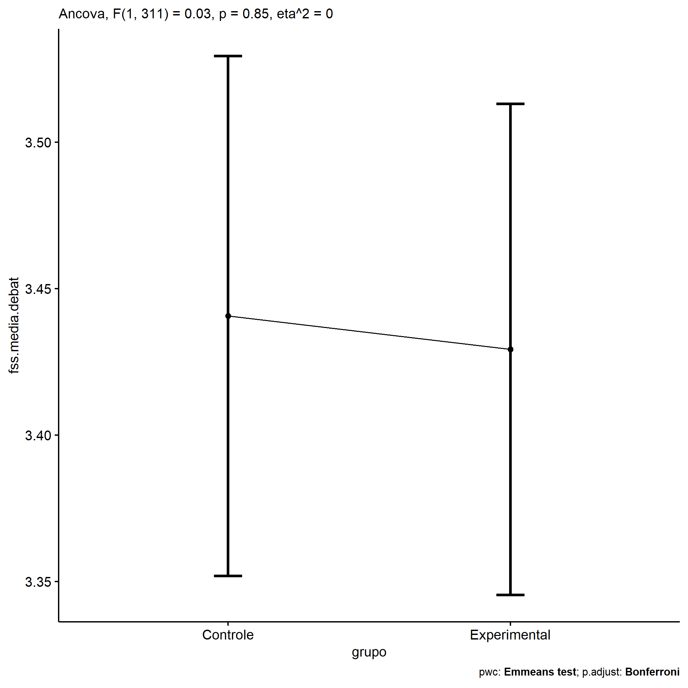<!-- -->

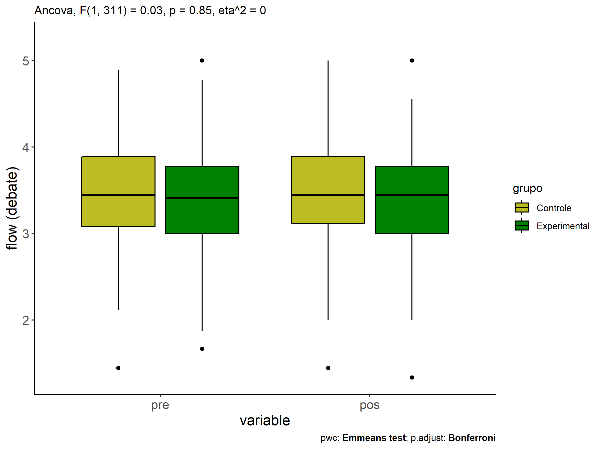<!-- -->

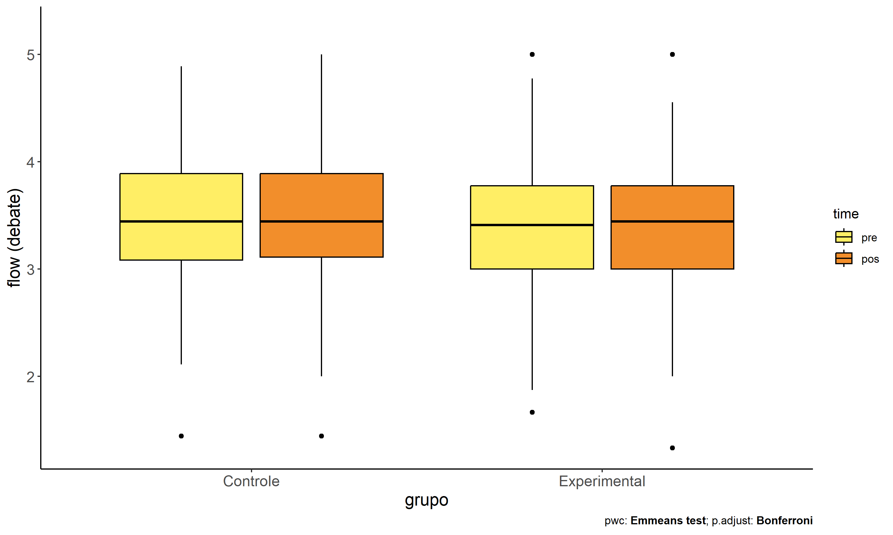<!-- -->

## Pairwise comparisons for two factors

### factores: **grupo:Sexo**

| var             | grupo        | Sexo |   n | M (pre) | SE (pre) | M (unadj) | SE (unadj) | M (adj) | SE (adj) |
|:----------------|:-------------|:-----|----:|--------:|---------:|----------:|-----------:|--------:|---------:|
| fss.media.debat | Controle     | F    |  69 |   3.535 |    0.075 |     3.498 |      0.074 |   3.459 |    0.066 |
| fss.media.debat | Controle     | M    |  79 |   3.441 |    0.070 |     3.423 |      0.069 |   3.425 |    0.062 |
| fss.media.debat | Experimental | F    |  86 |   3.442 |    0.063 |     3.433 |      0.068 |   3.434 |    0.059 |
| fss.media.debat | Experimental | M    |  80 |   3.374 |    0.069 |     3.394 |      0.064 |   3.424 |    0.062 |

| .y.             | grupo        | Sexo | group1   | group2       | estimate | conf.low | conf.high |    se | statistic |     p | p.adj | p.adj.signif |
|:----------------|:-------------|:-----|:---------|:-------------|---------:|---------:|----------:|------:|----------:|------:|------:|:-------------|
| fss.media.debat |              | F    | Controle | Experimental |    0.025 |   -0.151 |     0.200 | 0.089 |     0.276 | 0.782 | 0.782 | ns           |
| fss.media.debat |              | M    | Controle | Experimental |    0.001 |   -0.171 |     0.173 | 0.087 |     0.013 | 0.990 | 0.990 | ns           |
| dfs.media.debat |              | F    | Controle | Experimental |    0.094 |   -0.101 |     0.288 | 0.099 |     0.949 | 0.343 | 0.343 | ns           |
| dfs.media.debat |              | M    | Controle | Experimental |    0.066 |   -0.125 |     0.257 | 0.097 |     0.683 | 0.495 | 0.495 | ns           |
| fss.media.debat | Controle     |      | F        | M            |    0.034 |   -0.145 |     0.213 | 0.091 |     0.374 | 0.708 | 0.708 | ns           |
| fss.media.debat | Experimental |      | F        | M            |    0.010 |   -0.158 |     0.179 | 0.086 |     0.123 | 0.903 | 0.903 | ns           |
| dfs.media.debat | Controle     |      | F        | M            |    0.095 |   -0.104 |     0.293 | 0.101 |     0.939 | 0.349 | 0.349 | ns           |
| dfs.media.debat | Experimental |      | F        | M            |    0.067 |   -0.120 |     0.254 | 0.095 |     0.706 | 0.481 | 0.481 | ns           |

| .y.        | grupo        | Sexo | group1 | group2 | estimate | conf.low | conf.high |    se | statistic |     p | p.adj | p.adj.signif |
|:-----------|:-------------|:-----|:-------|:-------|---------:|---------:|----------:|------:|----------:|------:|------:|:-------------|
| flow.debat | Controle     | F    | pre    | pos    |    0.038 |   -0.166 |     0.242 | 0.104 |     0.363 | 0.717 | 0.717 | ns           |
| flow.debat | Controle     | M    | pre    | pos    |    0.018 |   -0.173 |     0.208 | 0.097 |     0.182 | 0.856 | 0.856 | ns           |
| flow.debat | Experimental | F    | pre    | pos    |    0.009 |   -0.174 |     0.191 | 0.093 |     0.094 | 0.925 | 0.925 | ns           |
| flow.debat | Experimental | M    | pre    | pos    |   -0.019 |   -0.209 |     0.170 | 0.096 |    -0.198 | 0.843 | 0.843 | ns           |

    ## Scale for colour is already present.
    ## Adding another scale for colour, which will replace the existing scale.

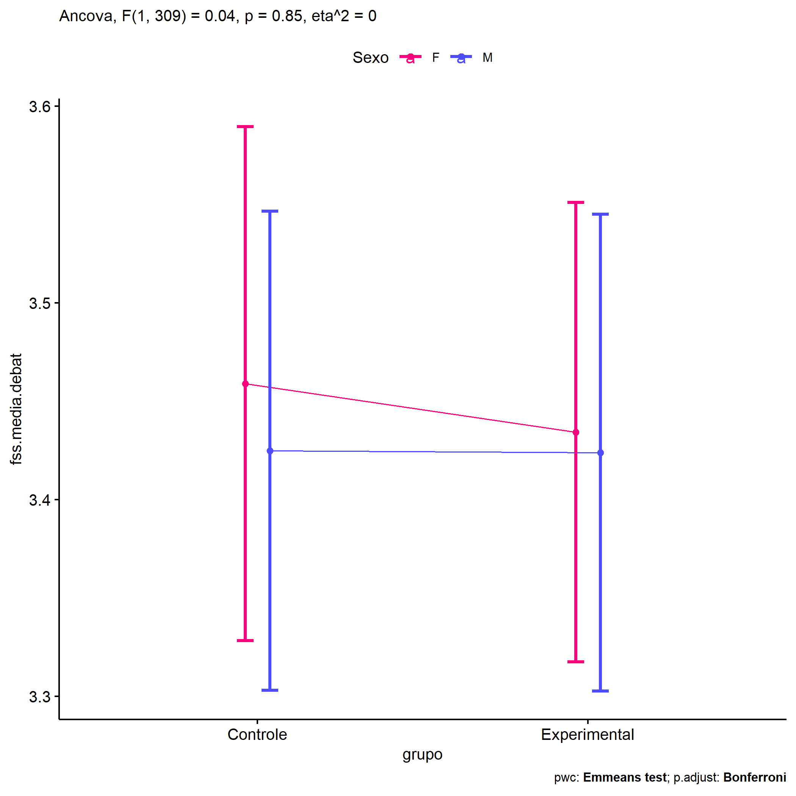<!-- -->

    ## Scale for colour is already present.
    ## Adding another scale for colour, which will replace the existing scale.

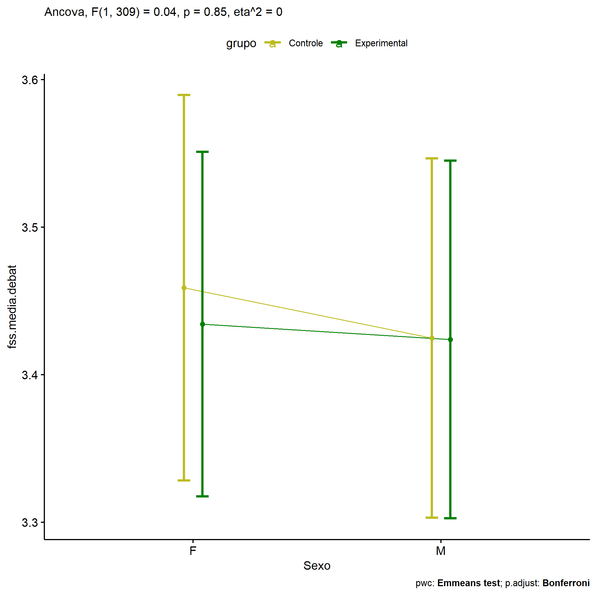<!-- -->

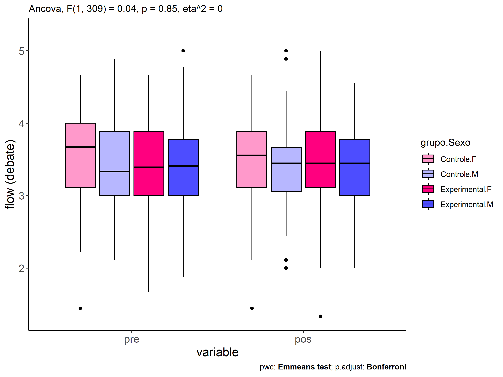<!-- -->

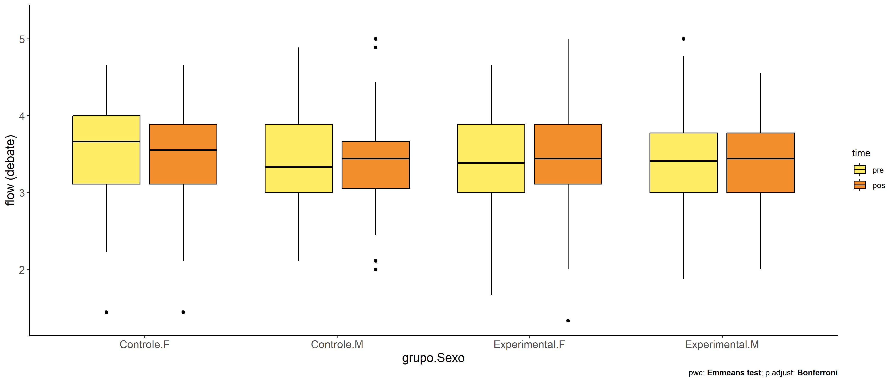<!-- -->

### factores: **grupo:Zona**

| var             | grupo        | Zona   |   n | M (pre) | SE (pre) | M (unadj) | SE (unadj) | M (adj) | SE (adj) |
|:----------------|:-------------|:-------|----:|--------:|---------:|----------:|-----------:|--------:|---------:|
| fss.media.debat | Controle     | Rural  | 102 |   3.551 |    0.056 |     3.502 |      0.060 |   3.461 |    0.053 |
| fss.media.debat | Controle     | Urbana |  24 |   3.494 |    0.149 |     3.503 |      0.141 |   3.486 |    0.109 |
| fss.media.debat | Experimental | Rural  |  79 |   3.366 |    0.064 |     3.431 |      0.063 |   3.469 |    0.060 |
| fss.media.debat | Experimental | Urbana |  42 |   3.365 |    0.094 |     3.330 |      0.087 |   3.368 |    0.083 |

| .y.             | grupo        | Zona   | group1   | group2       | estimate | conf.low | conf.high |    se | statistic |     p | p.adj | p.adj.signif |
|:----------------|:-------------|:-------|:---------|:-------------|---------:|---------:|----------:|------:|----------:|------:|------:|:-------------|
| fss.media.debat |              | Rural  | Controle | Experimental |   -0.008 |   -0.168 |     0.151 | 0.081 |    -0.103 | 0.918 | 0.918 | ns           |
| fss.media.debat |              | Urbana | Controle | Experimental |    0.117 |   -0.152 |     0.387 | 0.137 |     0.857 | 0.392 | 0.392 | ns           |
| dfs.media.debat |              | Rural  | Controle | Experimental |    0.185 |    0.010 |     0.360 | 0.089 |     2.085 | 0.038 | 0.038 | \*           |
| dfs.media.debat |              | Urbana | Controle | Experimental |    0.129 |   -0.169 |     0.428 | 0.151 |     0.855 | 0.393 | 0.393 | ns           |
| fss.media.debat | Controle     |        | Rural    | Urbana       |   -0.025 |   -0.264 |     0.214 | 0.121 |    -0.205 | 0.838 | 0.838 | ns           |
| fss.media.debat | Experimental |        | Rural    | Urbana       |    0.101 |   -0.100 |     0.302 | 0.102 |     0.988 | 0.324 | 0.324 | ns           |
| dfs.media.debat | Controle     |        | Rural    | Urbana       |    0.057 |   -0.207 |     0.321 | 0.134 |     0.425 | 0.671 | 0.671 | ns           |
| dfs.media.debat | Experimental |        | Rural    | Urbana       |    0.002 |   -0.221 |     0.224 | 0.113 |     0.014 | 0.988 | 0.988 | ns           |

| .y.        | grupo        | Zona   | group1 | group2 | estimate | conf.low | conf.high |    se | statistic |     p | p.adj | p.adj.signif |
|:-----------|:-------------|:-------|:-------|:-------|---------:|---------:|----------:|------:|----------:|------:|------:|:-------------|
| flow.debat | Controle     | Rural  | pre    | pos    |    0.049 |   -0.114 |     0.212 | 0.083 |     0.592 | 0.554 | 0.554 | ns           |
| flow.debat | Controle     | Urbana | pre    | pos    |   -0.008 |   -0.344 |     0.327 | 0.171 |    -0.049 | 0.961 | 0.961 | ns           |
| flow.debat | Experimental | Rural  | pre    | pos    |   -0.065 |   -0.250 |     0.120 | 0.094 |    -0.690 | 0.491 | 0.491 | ns           |
| flow.debat | Experimental | Urbana | pre    | pos    |    0.035 |   -0.218 |     0.289 | 0.129 |     0.272 | 0.786 | 0.786 | ns           |

    ## Scale for colour is already present.
    ## Adding another scale for colour, which will replace the existing scale.

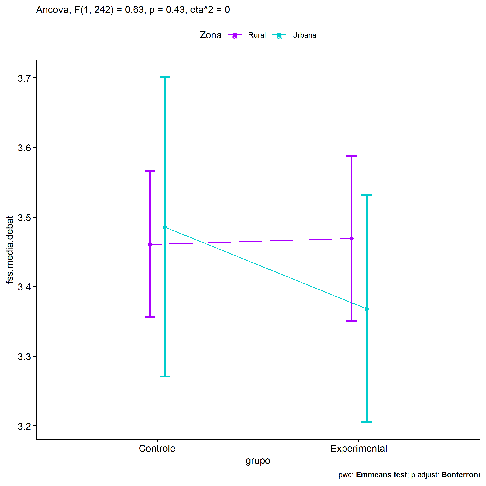<!-- -->

    ## Scale for colour is already present.
    ## Adding another scale for colour, which will replace the existing scale.

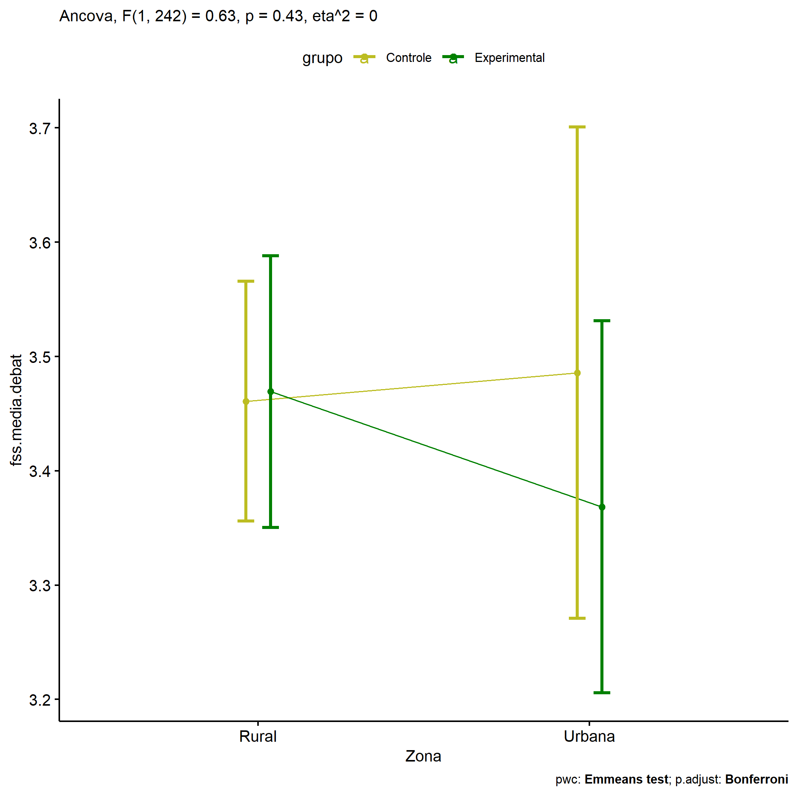<!-- -->

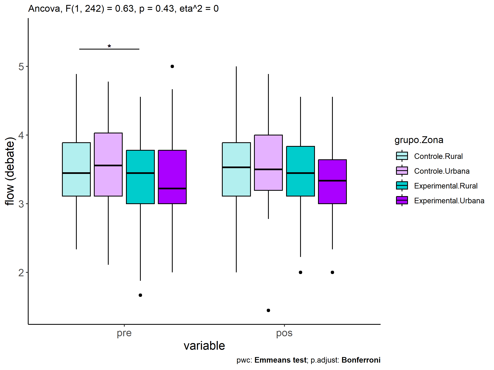<!-- -->

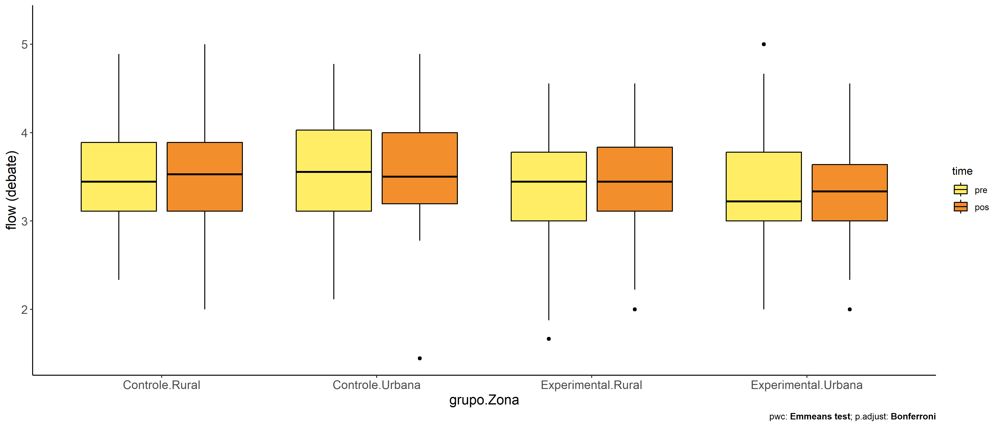<!-- -->

### factores: **grupo:Cor.Raca**

| var             | grupo        | Cor.Raca |   n | M (pre) | SE (pre) | M (unadj) | SE (unadj) | M (adj) | SE (adj) |
|:----------------|:-------------|:---------|----:|--------:|---------:|----------:|-----------:|--------:|---------:|
| fss.media.debat | Controle     | Branca   |  20 |   3.561 |    0.131 |     3.578 |      0.108 |   3.505 |    0.126 |
| fss.media.debat | Controle     | Parda    |  44 |   3.433 |    0.093 |     3.438 |      0.097 |   3.412 |    0.084 |
| fss.media.debat | Experimental | Branca   |  17 |   3.373 |    0.116 |     3.556 |      0.163 |   3.553 |    0.135 |
| fss.media.debat | Experimental | Indígena |  12 |   3.351 |    0.159 |     3.237 |      0.174 |   3.242 |    0.161 |
| fss.media.debat | Experimental | Parda    |  46 |   3.214 |    0.069 |     3.331 |      0.080 |   3.387 |    0.083 |

|     | .y.             | grupo        | Cor.Raca | group1   | group2       | estimate | conf.low | conf.high |    se | statistic |     p | p.adj | p.adj.signif |
|:----|:----------------|:-------------|:---------|:---------|:-------------|---------:|---------:|----------:|------:|----------:|------:|------:|:-------------|
| 1   | fss.media.debat |              | Branca   | Controle | Experimental |   -0.047 |   -0.412 |     0.318 | 0.185 |    -0.257 | 0.798 | 0.798 | ns           |
| 3   | fss.media.debat |              | Parda    | Controle | Experimental |    0.026 |   -0.210 |     0.261 | 0.119 |     0.214 | 0.831 | 0.831 | ns           |
| 4   | dfs.media.debat |              | Branca   | Controle | Experimental |    0.189 |   -0.166 |     0.543 | 0.179 |     1.052 | 0.295 | 0.295 | ns           |
| 6   | dfs.media.debat |              | Parda    | Controle | Experimental |    0.219 |   -0.007 |     0.446 | 0.115 |     1.914 | 0.058 | 0.058 | ns           |
| 8   | fss.media.debat | Controle     |          | Branca   | Parda        |    0.093 |   -0.205 |     0.391 | 0.151 |     0.616 | 0.539 | 0.539 | ns           |
| 10  | fss.media.debat | Experimental |          | Branca   | Indígena     |    0.310 |   -0.105 |     0.726 | 0.210 |     1.477 | 0.142 | 0.426 | ns           |
| 11  | fss.media.debat | Experimental |          | Branca   | Parda        |    0.166 |   -0.148 |     0.480 | 0.159 |     1.044 | 0.298 | 0.895 | ns           |
| 12  | fss.media.debat | Experimental |          | Indígena | Parda        |   -0.145 |   -0.503 |     0.213 | 0.181 |    -0.798 | 0.426 | 1.000 | ns           |
| 14  | dfs.media.debat | Controle     |          | Branca   | Parda        |    0.128 |   -0.162 |     0.418 | 0.147 |     0.874 | 0.383 | 0.383 | ns           |
| 16  | dfs.media.debat | Experimental |          | Branca   | Indígena     |    0.022 |   -0.383 |     0.427 | 0.205 |     0.107 | 0.915 | 1.000 | ns           |
| 17  | dfs.media.debat | Experimental |          | Branca   | Parda        |    0.159 |   -0.146 |     0.464 | 0.154 |     1.030 | 0.305 | 0.915 | ns           |
| 18  | dfs.media.debat | Experimental |          | Indígena | Parda        |    0.137 |   -0.211 |     0.485 | 0.176 |     0.778 | 0.438 | 1.000 | ns           |

| .y.        | grupo        | Cor.Raca | group1 | group2 | estimate | conf.low | conf.high |    se | statistic |     p | p.adj | p.adj.signif |
|:-----------|:-------------|:---------|:-------|:-------|---------:|---------:|----------:|------:|----------:|------:|------:|:-------------|
| flow.debat | Controle     | Branca   | pre    | pos    |   -0.017 |   -0.370 |     0.336 | 0.179 |    -0.093 | 0.926 | 0.926 | ns           |
| flow.debat | Controle     | Parda    | pre    | pos    |   -0.005 |   -0.243 |     0.233 | 0.121 |    -0.039 | 0.969 | 0.969 | ns           |
| flow.debat | Experimental | Branca   | pre    | pos    |   -0.183 |   -0.566 |     0.200 | 0.195 |    -0.941 | 0.348 | 0.348 | ns           |
| flow.debat | Experimental | Indígena | pre    | pos    |    0.113 |   -0.342 |     0.569 | 0.232 |     0.490 | 0.625 | 0.625 | ns           |
| flow.debat | Experimental | Parda    | pre    | pos    |   -0.117 |   -0.350 |     0.115 | 0.118 |    -0.993 | 0.322 | 0.322 | ns           |

    ## Scale for colour is already present.
    ## Adding another scale for colour, which will replace the existing scale.

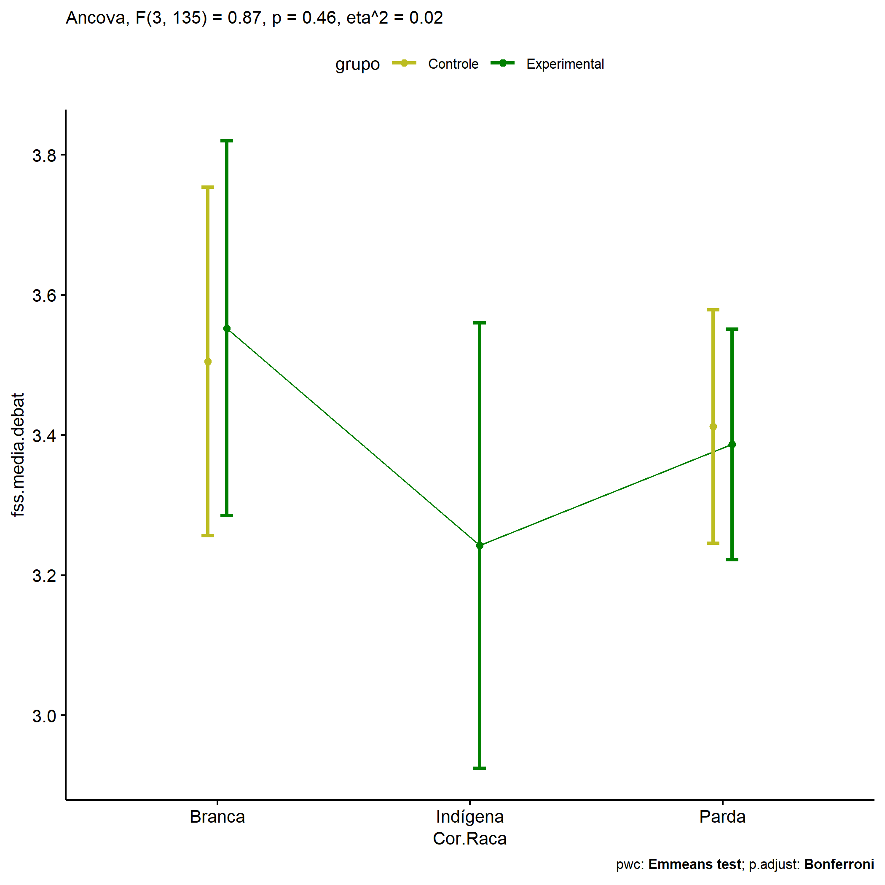<!-- -->

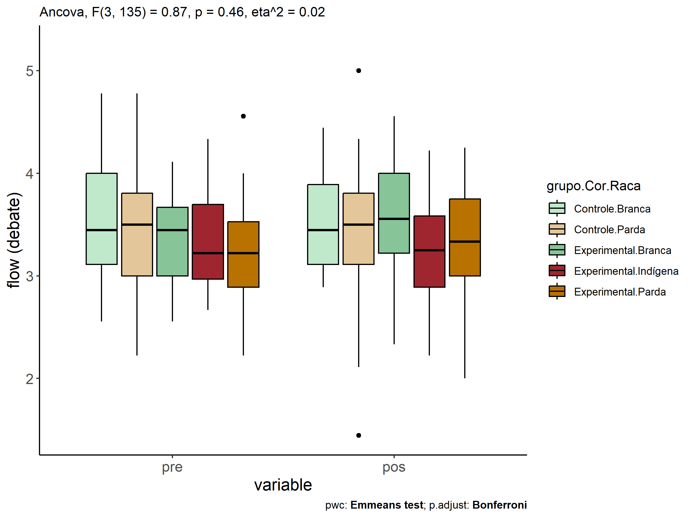<!-- -->

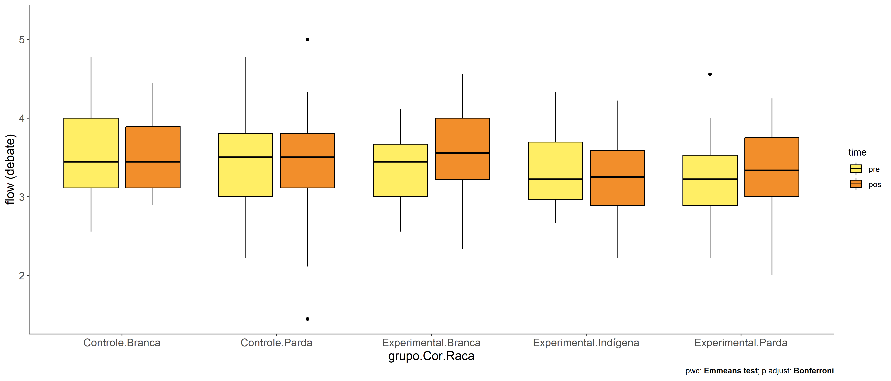<!-- -->
