ANCOVA in flow (debate) (flow (debate))
================
Geiser C. Challco <geiser@alumni.usp.br>

- [Descriptive Statistics of Initial
  Data](#descriptive-statistics-of-initial-data)
- [Checking of Assumptions](#checking-of-assumptions)
  - [Assumption: Normality distribution of
    data](#assumption-normality-distribution-of-data)
  - [Assumption: Homogeneity of data
    distribution](#assumption-homogeneity-of-data-distribution)
- [Computation of ANCOVA test and Pairwise
  Comparison](#computation-of-ancova-test-and-pairwise-comparison)
  - [ANCOVA tests for one factor](#ancova-tests-for-one-factor)
  - [ANCOVA tests for two factors](#ancova-tests-for-two-factors)
  - [Pairwise comparisons for one factor:
    **grupo**](#pairwise-comparisons-for-one-factor-grupo)
  - [Pairwise comparisons for two
    factors](#pairwise-comparisons-for-two-factors)
    - [factores: **grupo:Sexo**](#factores-gruposexo)
    - [factores: **grupo:Zona**](#factores-grupozona)
    - [factores: **grupo:Cor.Raca**](#factores-grupocorraca)

**NOTE**

- Teste ANCOVA para determinar se houve diferenças significativas no
  flow (debate) (medido usando pre- e pos-testes).
- ANCOVA test to determine whether there were significant differences in
  flow (debate) (measured using pre- and post-tests).

# Descriptive Statistics of Initial Data

| grupo        | Sexo | Zona   | Cor.Raca | variable        |   n |  mean | median |   min |   max |    sd |    se |    ci |   iqr |
|:-------------|:-----|:-------|:---------|:----------------|----:|------:|-------:|------:|------:|------:|------:|------:|------:|
| Controle     | F    |        |          | dfs.media.debat | 227 | 3.524 |  3.556 | 1.444 | 4.889 | 0.534 | 0.035 | 0.070 | 0.722 |
| Controle     | M    |        |          | dfs.media.debat | 228 | 3.357 |  3.333 | 1.000 | 5.000 | 0.623 | 0.041 | 0.081 | 0.778 |
| Experimental | F    |        |          | dfs.media.debat | 326 | 3.501 |  3.444 | 1.667 | 5.000 | 0.547 | 0.030 | 0.060 | 0.778 |
| Experimental | M    |        |          | dfs.media.debat | 312 | 3.416 |  3.444 | 1.000 | 5.000 | 0.611 | 0.035 | 0.068 | 0.778 |
| Controle     | F    |        |          | fss.media.debat | 227 | 3.481 |  3.556 | 1.444 | 5.000 | 0.598 | 0.040 | 0.078 | 0.778 |
| Controle     | M    |        |          | fss.media.debat | 228 | 3.384 |  3.444 | 1.000 | 5.000 | 0.640 | 0.042 | 0.084 | 0.778 |
| Experimental | F    |        |          | fss.media.debat | 326 | 3.484 |  3.556 | 1.000 | 5.000 | 0.630 | 0.035 | 0.069 | 0.778 |
| Experimental | M    |        |          | fss.media.debat | 312 | 3.465 |  3.444 | 2.000 | 5.000 | 0.568 | 0.032 | 0.063 | 0.889 |
| Controle     |      | Rural  |          | dfs.media.debat | 225 | 3.516 |  3.556 | 2.333 | 4.889 | 0.521 | 0.035 | 0.068 | 0.764 |
| Controle     |      | Urbana |          | dfs.media.debat | 110 | 3.402 |  3.389 | 1.889 | 4.778 | 0.627 | 0.060 | 0.119 | 0.833 |
| Controle     |      |        |          | dfs.media.debat | 120 | 3.333 |  3.333 | 1.000 | 5.000 | 0.644 | 0.059 | 0.116 | 0.806 |
| Experimental |      | Rural  |          | dfs.media.debat | 249 | 3.430 |  3.444 | 1.333 | 4.778 | 0.568 | 0.036 | 0.071 | 0.778 |
| Experimental |      | Urbana |          | dfs.media.debat | 173 | 3.487 |  3.444 | 1.889 | 5.000 | 0.578 | 0.044 | 0.087 | 0.764 |
| Experimental |      |        |          | dfs.media.debat | 216 | 3.472 |  3.444 | 1.000 | 5.000 | 0.597 | 0.041 | 0.080 | 0.778 |
| Controle     |      | Rural  |          | fss.media.debat | 225 | 3.475 |  3.556 | 2.000 | 5.000 | 0.574 | 0.038 | 0.075 | 0.778 |
| Controle     |      | Urbana |          | fss.media.debat | 110 | 3.455 |  3.528 | 1.444 | 4.889 | 0.624 | 0.060 | 0.118 | 0.889 |
| Controle     |      |        |          | fss.media.debat | 120 | 3.333 |  3.333 | 1.000 | 5.000 | 0.692 | 0.063 | 0.125 | 1.000 |
| Experimental |      | Rural  |          | fss.media.debat | 249 | 3.481 |  3.444 | 1.000 | 5.000 | 0.583 | 0.037 | 0.073 | 0.778 |
| Experimental |      | Urbana |          | fss.media.debat | 173 | 3.473 |  3.444 | 2.000 | 5.000 | 0.599 | 0.046 | 0.090 | 0.889 |
| Experimental |      |        |          | fss.media.debat | 216 | 3.468 |  3.556 | 1.333 | 5.000 | 0.622 | 0.042 | 0.083 | 0.889 |
| Controle     |      |        | Branca   | dfs.media.debat |  47 | 3.504 |  3.444 | 2.111 | 4.889 | 0.628 | 0.092 | 0.184 | 0.833 |
| Controle     |      |        | Indígena | dfs.media.debat |  10 | 3.708 |  3.708 | 3.333 | 4.222 | 0.273 | 0.086 | 0.195 | 0.417 |
| Controle     |      |        | Parda    | dfs.media.debat | 159 | 3.371 |  3.444 | 1.000 | 4.778 | 0.592 | 0.047 | 0.093 | 0.778 |
| Controle     |      |        | Preta    | dfs.media.debat |   1 | 3.556 |  3.556 | 3.556 | 3.556 |       |       |       | 0.000 |
| Controle     |      |        |          | dfs.media.debat | 238 | 3.462 |  3.444 | 1.444 | 5.000 | 0.581 | 0.038 | 0.074 | 0.750 |
| Experimental |      |        | Amarela  | dfs.media.debat |   1 | 3.444 |  3.444 | 3.444 | 3.444 |       |       |       | 0.000 |
| Experimental |      |        | Branca   | dfs.media.debat |  57 | 3.439 |  3.444 | 2.111 | 4.333 | 0.508 | 0.067 | 0.135 | 0.667 |
| Experimental |      |        | Indígena | dfs.media.debat |  15 | 3.310 |  3.222 | 2.667 | 4.333 | 0.503 | 0.130 | 0.279 | 0.556 |
| Experimental |      |        | Parda    | dfs.media.debat | 172 | 3.367 |  3.333 | 1.333 | 4.778 | 0.554 | 0.042 | 0.083 | 0.667 |
| Experimental |      |        | Preta    | dfs.media.debat |   1 | 3.222 |  3.222 | 3.222 | 3.222 |       |       |       | 0.000 |
| Experimental |      |        |          | dfs.media.debat | 392 | 3.510 |  3.556 | 1.000 | 5.000 | 0.601 | 0.030 | 0.060 | 0.778 |
| Controle     |      |        | Branca   | fss.media.debat |  47 | 3.556 |  3.333 | 2.556 | 5.000 | 0.581 | 0.085 | 0.170 | 0.778 |
| Controle     |      |        | Indígena | fss.media.debat |  10 | 3.700 |  3.778 | 2.556 | 4.333 | 0.516 | 0.163 | 0.369 | 0.389 |
| Controle     |      |        | Parda    | fss.media.debat | 159 | 3.412 |  3.444 | 1.000 | 5.000 | 0.640 | 0.051 | 0.100 | 0.889 |
| Controle     |      |        | Preta    | fss.media.debat |   1 | 3.333 |  3.333 | 3.333 | 3.333 |       |       |       | 0.000 |
| Controle     |      |        |          | fss.media.debat | 238 | 3.411 |  3.444 | 1.333 | 4.889 | 0.619 | 0.040 | 0.079 | 0.885 |
| Experimental |      |        | Amarela  | fss.media.debat |   1 | 3.556 |  3.556 | 3.556 | 3.556 |       |       |       | 0.000 |
| Experimental |      |        | Branca   | fss.media.debat |  57 | 3.548 |  3.556 | 2.222 | 4.556 | 0.579 | 0.077 | 0.154 | 0.667 |
| Experimental |      |        | Indígena | fss.media.debat |  15 | 3.227 |  3.125 | 2.222 | 4.222 | 0.584 | 0.151 | 0.323 | 0.722 |
| Experimental |      |        | Parda    | fss.media.debat | 172 | 3.469 |  3.444 | 1.778 | 5.000 | 0.560 | 0.043 | 0.084 | 0.806 |
| Experimental |      |        | Preta    | fss.media.debat |   1 | 4.444 |  4.444 | 4.444 | 4.444 |       |       |       | 0.000 |
| Experimental |      |        |          | fss.media.debat | 392 | 3.473 |  3.528 | 1.000 | 5.000 | 0.619 | 0.031 | 0.061 | 0.778 |

# Checking of Assumptions

## Assumption: Normality distribution of data

| var             |    n |   skewness |  kurtosis | symmetry | statistic | method     |         p | p.signif | normality |
|:----------------|-----:|-----------:|----------:|:---------|----------:|:-----------|----------:|:---------|:----------|
| fss.media.debat | 1093 | -0.2697819 | 0.5046545 | YES      | 21.510943 | D’Agostino | 0.0000213 | \*\*\*   | \-        |
| fss.media.debat |  757 | -0.2093943 | 0.6607849 | YES      | 14.797132 | D’Agostino | 0.0006121 | \*\*     | \-        |
| fss.media.debat |  463 | -0.1082271 | 0.2506657 | YES      |  2.424758 | D’Agostino | 0.2974887 | ns       | \-        |

## Assumption: Homogeneity of data distribution

| var             | method         | formula                    |    n | DFn.df1 | DFd.df2 | statistic |         p | p.signif |
|:----------------|:---------------|:---------------------------|-----:|--------:|--------:|----------:|----------:|:---------|
| fss.media.debat | Levene’s test  | `.res`~`grupo`\*`Sexo`     | 1093 |       3 |    1089 | 0.8799752 | 0.4508768 | ns       |
| fss.media.debat | Anova’s slopes | `.res`~`grupo`\*`Sexo`     | 1093 |       3 |    1085 | 6.5210000 | 0.0002260 | \*\*     |
| fss.media.debat | Levene’s test  | `.res`~`grupo`\*`Zona`     |  757 |       3 |     753 | 1.5154370 | 0.2091325 | ns       |
| fss.media.debat | Anova’s slopes | `.res`~`grupo`\*`Zona`     |  757 |       3 |     749 | 3.4420000 | 0.0160000 | ns       |
| fss.media.debat | Levene’s test  | `.res`~`grupo`\*`Cor.Raca` |  463 |       8 |     454 | 0.6463541 | 0.7386655 | ns       |
| fss.media.debat | Anova’s slopes | `.res`~`grupo`\*`Cor.Raca` |  463 |       5 |     448 | 3.0350000 | 0.0100000 | \*       |

# Computation of ANCOVA test and Pairwise Comparison

## ANCOVA tests for one factor

|     | Effect          | DFn |  DFd |    SSn |     SSd |       F | p       |   ges | p\<.05 |
|:----|:----------------|----:|-----:|-------:|--------:|--------:|:--------|------:|:-------|
| 1   | dfs.media.debat |   1 | 1090 | 58.885 | 345.333 | 185.864 | \<0.001 | 0.146 | \*     |
| 2   | grupo           |   1 | 1090 |  0.317 | 345.333 |   1.000 | 0.317   | 0.001 |        |
| 4   | Sexo            |   1 | 1090 |  0.007 | 345.642 |   0.023 | 0.88    | 0.000 |        |
| 6   | Zona            |   1 |  754 |  0.004 | 219.465 |   0.013 | 0.909   | 0.000 |        |
| 8   | Cor.Raca        |   4 |  457 |  0.882 | 132.962 |   0.758 | 0.553   | 0.007 |        |

## ANCOVA tests for two factors

|     | Effect          | DFn |  DFd |    SSn |     SSd |       F | p       |   ges | p\<.05 |
|:----|:----------------|----:|-----:|-------:|--------:|--------:|:--------|------:|:-------|
| 1   | dfs.media.debat |   1 | 1088 | 57.885 | 345.192 | 182.446 | \<0.001 | 0.144 | \*     |
| 4   | grupo:Sexo      |   1 | 1088 |  0.135 | 345.192 |   0.424 | 0.515   | 0.000 |        |
| 8   | grupo:Zona      |   1 |  752 |  0.156 | 219.229 |   0.536 | 0.464   | 0.001 |        |
| 12  | grupo:Cor.Raca  |   3 |  453 |  1.457 | 131.344 |   1.676 | 0.171   | 0.011 |        |

## Pairwise comparisons for one factor: **grupo**

| var             | grupo        |   n | M (pre) | SE (pre) | M (unadj) | SE (unadj) | M (adj) | SE (adj) |
|:----------------|:-------------|----:|--------:|---------:|----------:|-----------:|--------:|---------:|
| fss.media.debat | Controle     | 455 |    3.44 |    0.027 |     3.433 |      0.029 |   3.437 |    0.026 |
| fss.media.debat | Experimental | 638 |    3.46 |    0.023 |     3.475 |      0.024 |   3.472 |    0.022 |

| .y.             | group1   | group2       | estimate | conf.low | conf.high |    se | statistic |     p | p.adj | p.adj.signif |
|:----------------|:---------|:-------------|---------:|---------:|----------:|------:|----------:|------:|------:|:-------------|
| fss.media.debat | Controle | Experimental |   -0.035 |   -0.102 |     0.033 | 0.035 |    -1.000 | 0.317 | 0.317 | ns           |
| dfs.media.debat | Controle | Experimental |   -0.019 |   -0.089 |     0.051 | 0.036 |    -0.536 | 0.592 | 0.592 | ns           |

| .y.        | grupo        | group1 | group2 | estimate | conf.low | conf.high |    se | statistic |     p | p.adj | p.adj.signif |
|:-----------|:-------------|:-------|:-------|---------:|---------:|----------:|------:|----------:|------:|------:|:-------------|
| flow.debat | Controle     | pre    | pos    |    0.008 |   -0.070 |     0.085 | 0.040 |     0.196 | 0.844 | 0.844 | ns           |
| flow.debat | Experimental | pre    | pos    |   -0.015 |   -0.081 |     0.050 | 0.033 |    -0.458 | 0.647 | 0.647 | ns           |

    ## Scale for colour is already present.
    ## Adding another scale for colour, which will replace the existing scale.

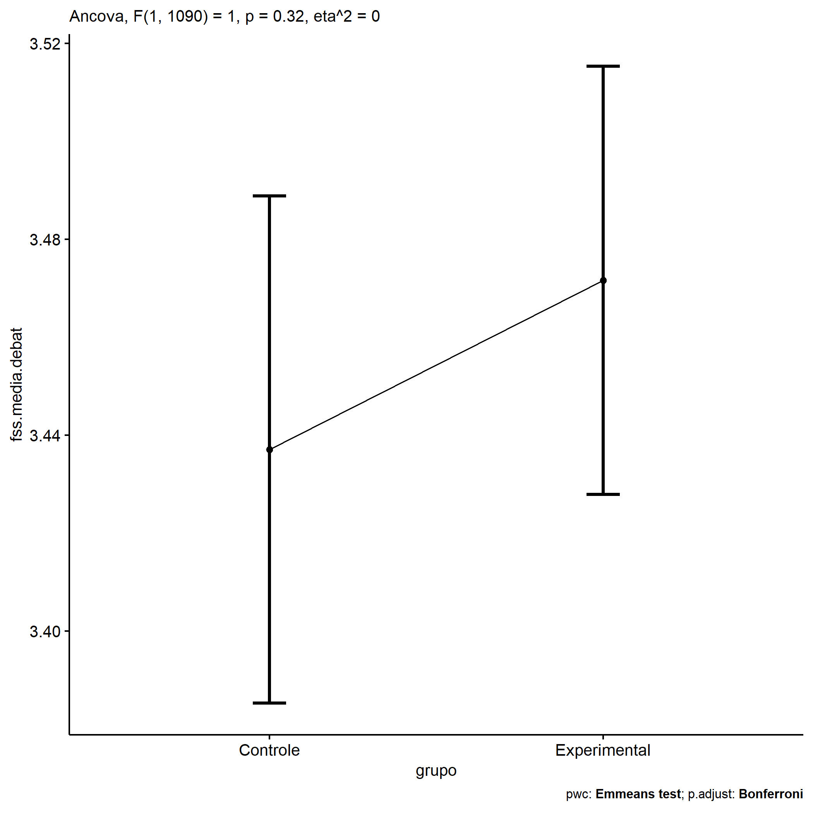<!-- -->

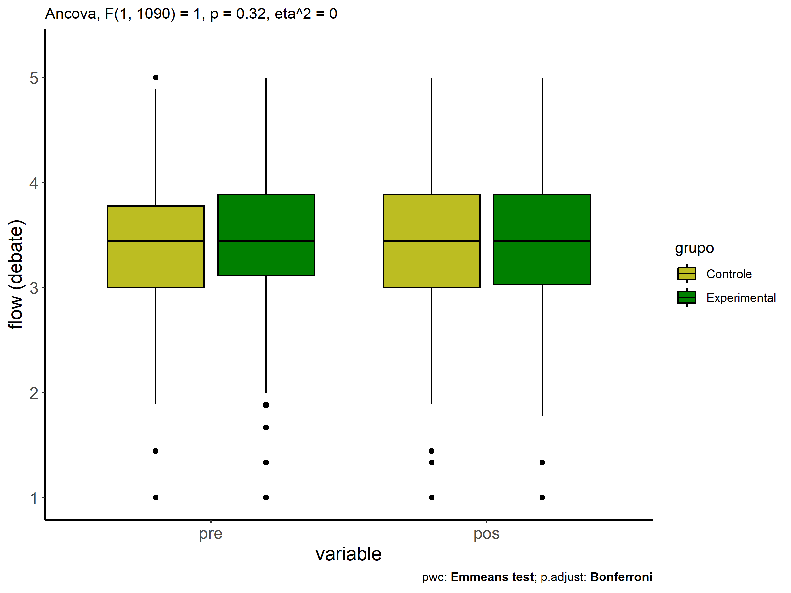<!-- -->

<!-- -->

## Pairwise comparisons for two factors

### factores: **grupo:Sexo**

| var             | grupo        | Sexo |   n | M (pre) | SE (pre) | M (unadj) | SE (unadj) | M (adj) | SE (adj) |
|:----------------|:-------------|:-----|----:|--------:|---------:|----------:|-----------:|--------:|---------:|
| fss.media.debat | Controle     | F    | 227 |   3.524 |    0.035 |     3.481 |      0.040 |   3.453 |    0.037 |
| fss.media.debat | Controle     | M    | 228 |   3.357 |    0.041 |     3.384 |      0.042 |   3.421 |    0.037 |
| fss.media.debat | Experimental | F    | 326 |   3.501 |    0.030 |     3.484 |      0.035 |   3.465 |    0.031 |
| fss.media.debat | Experimental | M    | 312 |   3.416 |    0.035 |     3.465 |      0.032 |   3.479 |    0.032 |

| .y.             | grupo        | Sexo | group1   | group2       | estimate | conf.low | conf.high |    se | statistic |     p | p.adj | p.adj.signif |
|:----------------|:-------------|:-----|:---------|:-------------|---------:|---------:|----------:|------:|----------:|------:|------:|:-------------|
| fss.media.debat |              | F    | Controle | Experimental |   -0.012 |   -0.108 |     0.083 | 0.049 |    -0.250 | 0.803 | 0.803 | ns           |
| fss.media.debat |              | M    | Controle | Experimental |   -0.057 |   -0.154 |     0.039 | 0.049 |    -1.165 | 0.244 | 0.244 | ns           |
| dfs.media.debat |              | F    | Controle | Experimental |    0.023 |   -0.075 |     0.121 | 0.050 |     0.458 | 0.647 | 0.647 | ns           |
| dfs.media.debat |              | M    | Controle | Experimental |   -0.059 |   -0.158 |     0.040 | 0.051 |    -1.169 | 0.243 | 0.243 | ns           |
| fss.media.debat | Controle     |      | F        | M            |    0.031 |   -0.073 |     0.135 | 0.053 |     0.588 | 0.556 | 0.556 | ns           |
| fss.media.debat | Experimental |      | F        | M            |   -0.014 |   -0.102 |     0.074 | 0.045 |    -0.310 | 0.757 | 0.757 | ns           |
| dfs.media.debat | Controle     |      | F        | M            |    0.167 |    0.060 |     0.273 | 0.054 |     3.062 | 0.002 | 0.002 | \*\*         |
| dfs.media.debat | Experimental |      | F        | M            |    0.084 |   -0.006 |     0.175 | 0.046 |     1.840 | 0.066 | 0.066 | ns           |

| .y.        | grupo        | Sexo | group1 | group2 | estimate | conf.low | conf.high |    se | statistic |     p | p.adj | p.adj.signif |
|:-----------|:-------------|:-----|:-------|:-------|---------:|---------:|----------:|------:|----------:|------:|------:|:-------------|
| flow.debat | Controle     | F    | pre    | pos    |    0.042 |   -0.067 |     0.152 | 0.056 |     0.760 | 0.448 | 0.448 | ns           |
| flow.debat | Controle     | M    | pre    | pos    |   -0.027 |   -0.136 |     0.082 | 0.056 |    -0.480 | 0.631 | 0.631 | ns           |
| flow.debat | Experimental | F    | pre    | pos    |    0.016 |   -0.075 |     0.108 | 0.047 |     0.352 | 0.725 | 0.725 | ns           |
| flow.debat | Experimental | M    | pre    | pos    |   -0.048 |   -0.142 |     0.045 | 0.048 |    -1.016 | 0.310 | 0.310 | ns           |

    ## Scale for colour is already present.
    ## Adding another scale for colour, which will replace the existing scale.

<!-- -->

    ## Scale for colour is already present.
    ## Adding another scale for colour, which will replace the existing scale.

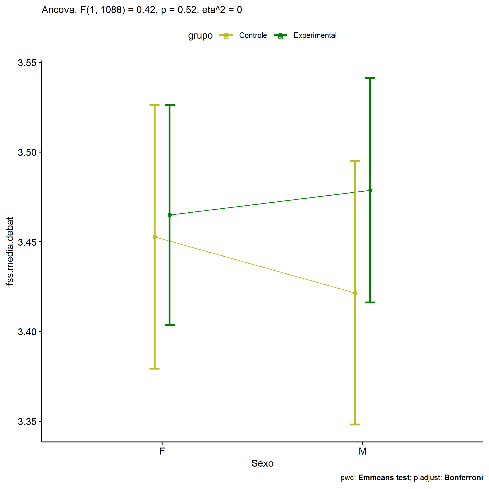<!-- -->

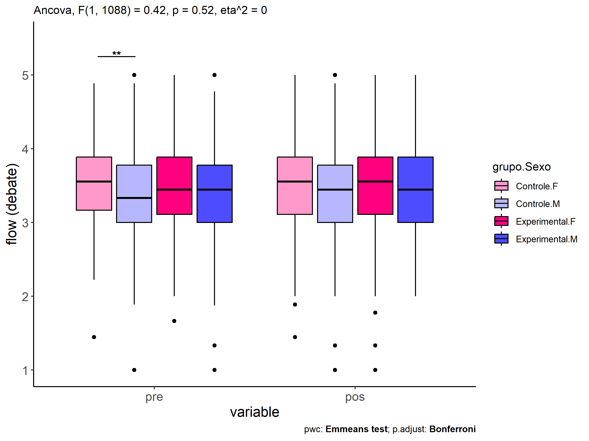<!-- -->

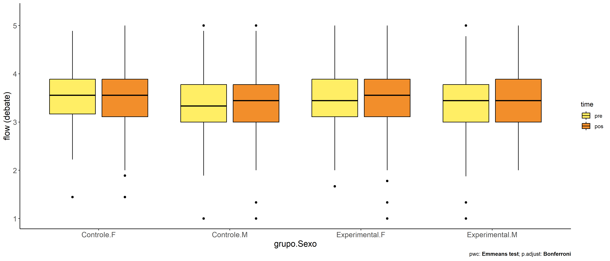<!-- -->

### factores: **grupo:Zona**

| var             | grupo        | Zona   |   n | M (pre) | SE (pre) | M (unadj) | SE (unadj) | M (adj) | SE (adj) |
|:----------------|:-------------|:-------|----:|--------:|---------:|----------:|-----------:|--------:|---------:|
| fss.media.debat | Controle     | Rural  | 225 |   3.516 |    0.035 |     3.475 |      0.038 |   3.453 |    0.036 |
| fss.media.debat | Controle     | Urbana | 110 |   3.402 |    0.060 |     3.455 |      0.060 |   3.482 |    0.052 |
| fss.media.debat | Experimental | Rural  | 249 |   3.430 |    0.036 |     3.481 |      0.037 |   3.496 |    0.034 |
| fss.media.debat | Experimental | Urbana | 173 |   3.487 |    0.044 |     3.473 |      0.046 |   3.464 |    0.041 |

| .y.             | grupo        | Zona   | group1   | group2       | estimate | conf.low | conf.high |    se | statistic |     p | p.adj | p.adj.signif |
|:----------------|:-------------|:-------|:---------|:-------------|---------:|---------:|----------:|------:|----------:|------:|------:|:-------------|
| fss.media.debat |              | Rural  | Controle | Experimental |   -0.043 |   -0.140 |     0.055 | 0.050 |    -0.860 | 0.390 | 0.390 | ns           |
| fss.media.debat |              | Urbana | Controle | Experimental |    0.018 |   -0.112 |     0.147 | 0.066 |     0.269 | 0.788 | 0.788 | ns           |
| dfs.media.debat |              | Rural  | Controle | Experimental |    0.086 |   -0.016 |     0.188 | 0.052 |     1.649 | 0.100 | 0.100 | ns           |
| dfs.media.debat |              | Urbana | Controle | Experimental |   -0.085 |   -0.220 |     0.051 | 0.069 |    -1.225 | 0.221 | 0.221 | ns           |
| fss.media.debat | Controle     |        | Rural    | Urbana       |   -0.029 |   -0.152 |     0.095 | 0.063 |    -0.457 | 0.648 | 0.648 | ns           |
| fss.media.debat | Experimental |        | Rural    | Urbana       |    0.032 |   -0.073 |     0.137 | 0.053 |     0.595 | 0.552 | 0.552 | ns           |
| dfs.media.debat | Controle     |        | Rural    | Urbana       |    0.114 |   -0.015 |     0.243 | 0.066 |     1.733 | 0.083 | 0.083 | ns           |
| dfs.media.debat | Experimental |        | Rural    | Urbana       |   -0.056 |   -0.166 |     0.054 | 0.056 |    -1.004 | 0.316 | 0.316 | ns           |

| .y.        | grupo        | Zona   | group1 | group2 | estimate | conf.low | conf.high |    se | statistic |     p | p.adj | p.adj.signif |
|:-----------|:-------------|:-------|:-------|:-------|---------:|---------:|----------:|------:|----------:|------:|------:|:-------------|
| flow.debat | Controle     | Rural  | pre    | pos    |    0.041 |   -0.066 |     0.148 | 0.055 |     0.758 | 0.449 | 0.449 | ns           |
| flow.debat | Controle     | Urbana | pre    | pos    |   -0.053 |   -0.206 |     0.100 | 0.078 |    -0.684 | 0.494 | 0.494 | ns           |
| flow.debat | Experimental | Rural  | pre    | pos    |   -0.051 |   -0.153 |     0.051 | 0.052 |    -0.985 | 0.325 | 0.325 | ns           |
| flow.debat | Experimental | Urbana | pre    | pos    |    0.013 |   -0.109 |     0.135 | 0.062 |     0.213 | 0.831 | 0.831 | ns           |

    ## Scale for colour is already present.
    ## Adding another scale for colour, which will replace the existing scale.

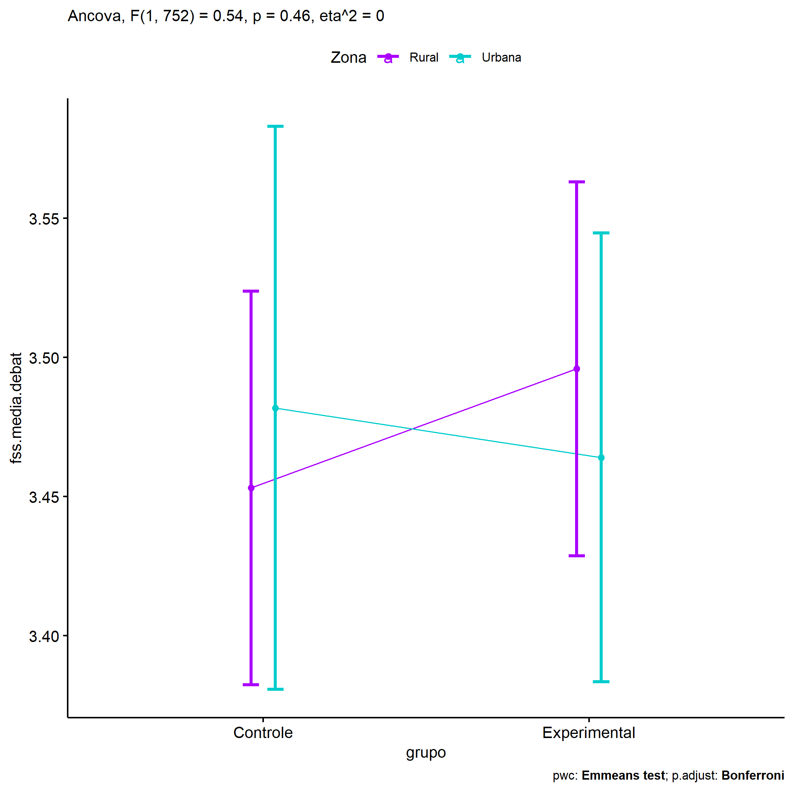<!-- -->

    ## Scale for colour is already present.
    ## Adding another scale for colour, which will replace the existing scale.

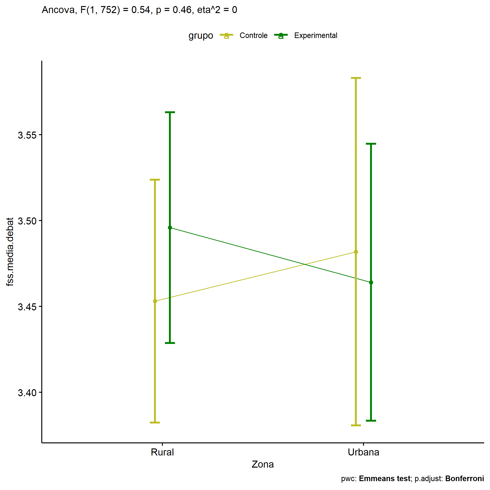<!-- -->

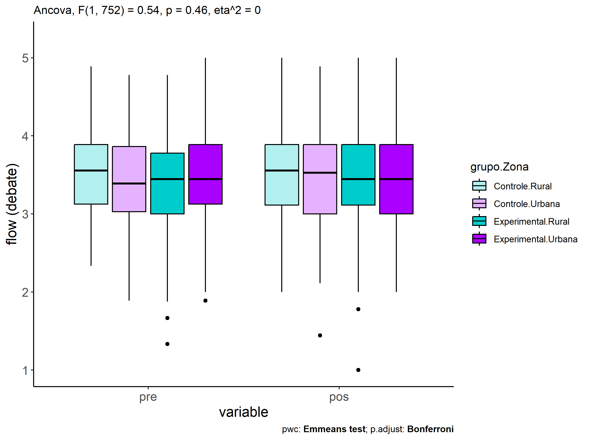<!-- -->

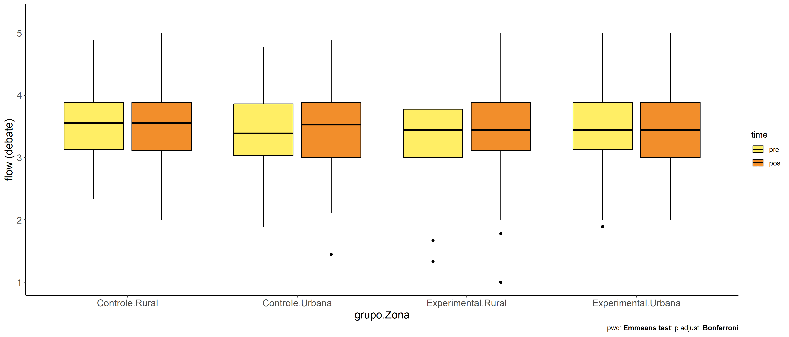<!-- -->

### factores: **grupo:Cor.Raca**

| var             | grupo        | Cor.Raca |   n | M (pre) | SE (pre) | M (unadj) | SE (unadj) | M (adj) | SE (adj) |
|:----------------|:-------------|:---------|----:|--------:|---------:|----------:|-----------:|--------:|---------:|
| fss.media.debat | Controle     | Branca   |  47 |   3.504 |    0.092 |     3.556 |      0.085 |   3.508 |    0.079 |
| fss.media.debat | Controle     | Indígena |  10 |   3.708 |    0.086 |     3.700 |      0.163 |   3.562 |    0.171 |
| fss.media.debat | Controle     | Parda    | 159 |   3.371 |    0.047 |     3.412 |      0.051 |   3.424 |    0.043 |
| fss.media.debat | Experimental | Branca   |  57 |   3.439 |    0.067 |     3.548 |      0.077 |   3.530 |    0.071 |
| fss.media.debat | Experimental | Indígena |  15 |   3.310 |    0.130 |     3.227 |      0.151 |   3.265 |    0.139 |
| fss.media.debat | Experimental | Parda    | 172 |   3.367 |    0.042 |     3.469 |      0.043 |   3.483 |    0.041 |

| .y.             | grupo        | Cor.Raca | group1   | group2       | estimate | conf.low | conf.high |    se | statistic |     p | p.adj | p.adj.signif |
|:----------------|:-------------|:---------|:---------|:-------------|---------:|---------:|----------:|------:|----------:|------:|------:|:-------------|
| fss.media.debat |              | Branca   | Controle | Experimental |   -0.022 |   -0.230 |     0.187 | 0.106 |    -0.203 | 0.839 | 0.839 | ns           |
| fss.media.debat |              | Indígena | Controle | Experimental |    0.297 |   -0.137 |     0.730 | 0.221 |     1.345 | 0.179 | 0.179 | ns           |
| fss.media.debat |              | Parda    | Controle | Experimental |   -0.059 |   -0.175 |     0.057 | 0.059 |    -0.995 | 0.320 | 0.320 | ns           |
| dfs.media.debat |              | Branca   | Controle | Experimental |    0.065 |   -0.154 |     0.284 | 0.111 |     0.584 | 0.560 | 0.560 | ns           |
| dfs.media.debat |              | Indígena | Controle | Experimental |    0.398 |   -0.055 |     0.851 | 0.230 |     1.727 | 0.085 | 0.085 | ns           |
| dfs.media.debat |              | Parda    | Controle | Experimental |    0.004 |   -0.118 |     0.126 | 0.062 |     0.071 | 0.943 | 0.943 | ns           |
| fss.media.debat | Controle     |          | Branca   | Indígena     |   -0.054 |   -0.423 |     0.315 | 0.188 |    -0.286 | 0.775 | 1.000 | ns           |
| fss.media.debat | Controle     |          | Branca   | Parda        |    0.085 |   -0.091 |     0.261 | 0.090 |     0.944 | 0.345 | 1.000 | ns           |
| fss.media.debat | Controle     |          | Indígena | Parda        |    0.138 |   -0.208 |     0.484 | 0.176 |     0.784 | 0.433 | 1.000 | ns           |
| fss.media.debat | Experimental |          | Branca   | Indígena     |    0.264 |   -0.043 |     0.572 | 0.156 |     1.691 | 0.091 | 0.274 | ns           |
| fss.media.debat | Experimental |          | Branca   | Parda        |    0.047 |   -0.115 |     0.209 | 0.082 |     0.573 | 0.567 | 1.000 | ns           |
| fss.media.debat | Experimental |          | Indígena | Parda        |   -0.217 |   -0.502 |     0.068 | 0.145 |    -1.499 | 0.135 | 0.404 | ns           |
| dfs.media.debat | Controle     |          | Branca   | Indígena     |   -0.205 |   -0.591 |     0.182 | 0.197 |    -1.042 | 0.298 | 0.895 | ns           |
| dfs.media.debat | Controle     |          | Branca   | Parda        |    0.132 |   -0.052 |     0.317 | 0.094 |     1.411 | 0.159 | 0.477 | ns           |
| dfs.media.debat | Controle     |          | Indígena | Parda        |    0.337 |   -0.025 |     0.699 | 0.184 |     1.831 | 0.068 | 0.203 | ns           |
| dfs.media.debat | Experimental |          | Branca   | Indígena     |    0.128 |   -0.194 |     0.450 | 0.164 |     0.784 | 0.434 | 1.000 | ns           |
| dfs.media.debat | Experimental |          | Branca   | Parda        |    0.072 |   -0.098 |     0.241 | 0.086 |     0.832 | 0.406 | 1.000 | ns           |
| dfs.media.debat | Experimental |          | Indígena | Parda        |   -0.057 |   -0.355 |     0.242 | 0.152 |    -0.373 | 0.710 | 1.000 | ns           |

| .y.        | grupo        | Cor.Raca | group1 | group2 | estimate | conf.low | conf.high |    se | statistic |     p | p.adj | p.adj.signif |
|:-----------|:-------------|:---------|:-------|:-------|---------:|---------:|----------:|------:|----------:|------:|------:|:-------------|
| flow.debat | Controle     | Branca   | pre    | pos    |   -0.052 |   -0.286 |     0.182 | 0.119 |    -0.435 | 0.663 | 0.663 | ns           |
| flow.debat | Controle     | Indígena | pre    | pos    |    0.008 |   -0.500 |     0.517 | 0.259 |     0.032 | 0.974 | 0.974 | ns           |
| flow.debat | Controle     | Parda    | pre    | pos    |   -0.041 |   -0.168 |     0.086 | 0.065 |    -0.631 | 0.528 | 0.528 | ns           |
| flow.debat | Experimental | Branca   | pre    | pos    |   -0.110 |   -0.323 |     0.103 | 0.108 |    -1.011 | 0.312 | 0.312 | ns           |
| flow.debat | Experimental | Indígena | pre    | pos    |    0.083 |   -0.332 |     0.498 | 0.211 |     0.394 | 0.694 | 0.694 | ns           |
| flow.debat | Experimental | Parda    | pre    | pos    |   -0.102 |   -0.225 |     0.020 | 0.062 |    -1.640 | 0.101 | 0.101 | ns           |

    ## Scale for colour is already present.
    ## Adding another scale for colour, which will replace the existing scale.

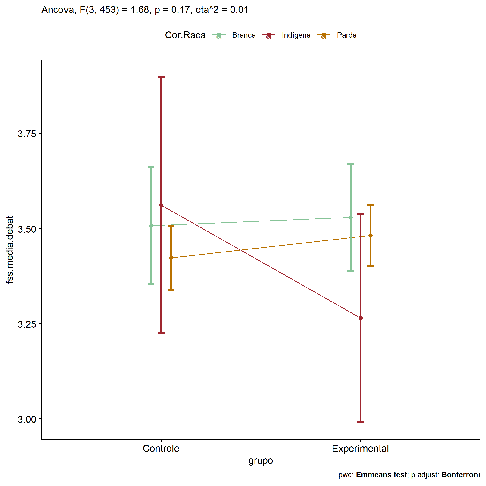<!-- -->

    ## Scale for colour is already present.
    ## Adding another scale for colour, which will replace the existing scale.

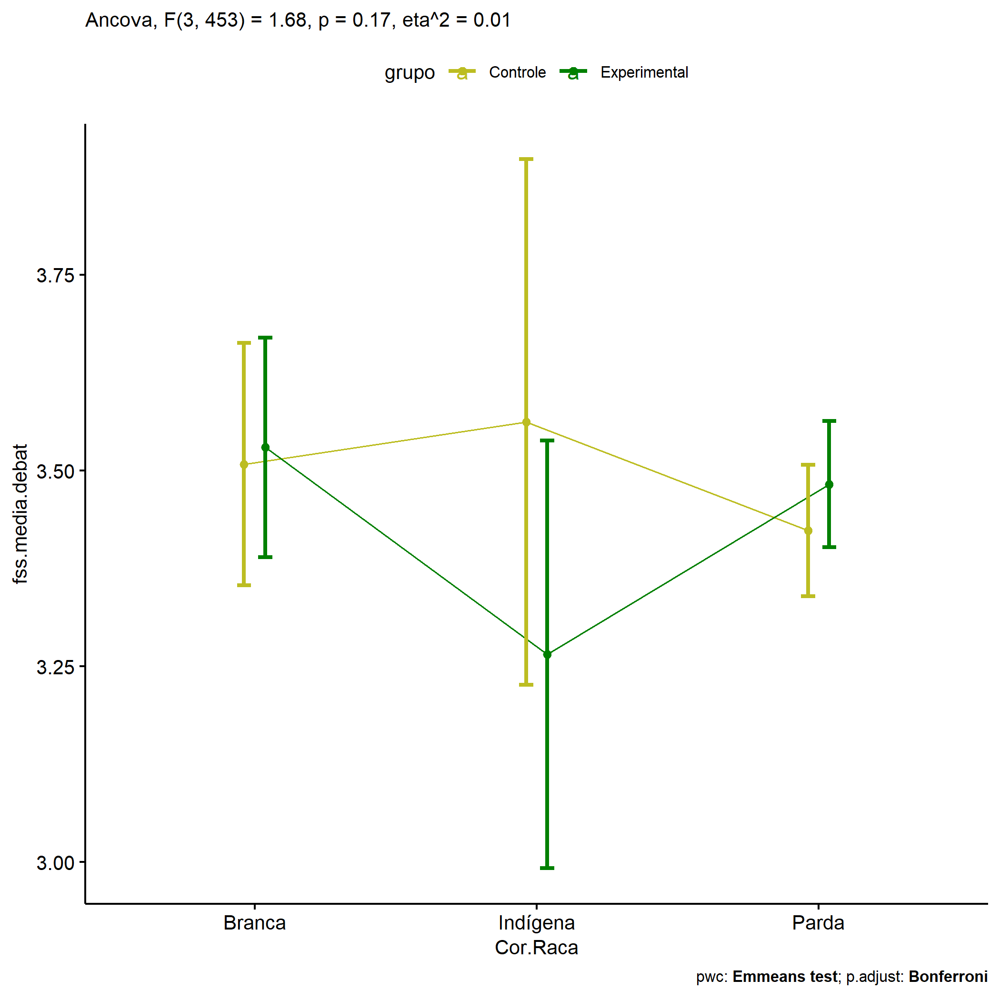<!-- -->

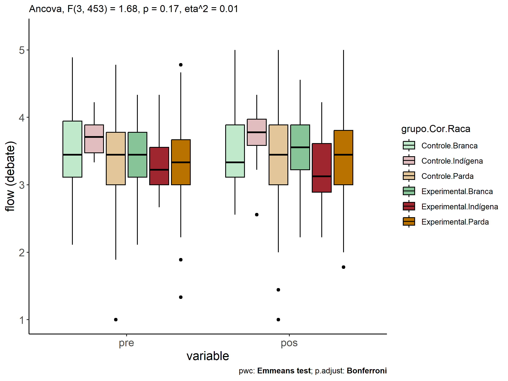<!-- -->

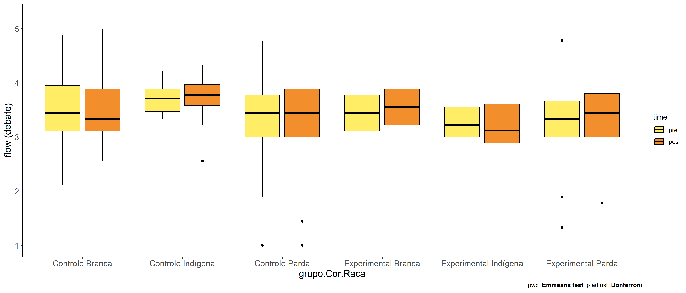<!-- -->
