ANCOVA in flow (ativ. leitura) (flow (ativ. leitura))
================
Geiser C. Challco <geiser@alumni.usp.br>

- [Descriptive Statistics of Initial
  Data](#descriptive-statistics-of-initial-data)
- [Checking of Assumptions](#checking-of-assumptions)
  - [Assumption: Normality distribution of
    data](#assumption-normality-distribution-of-data)
  - [Assumption: Homogeneity of data
    distribution](#assumption-homogeneity-of-data-distribution)
- [Computation of ANCOVA test and Pairwise
  Comparison](#computation-of-ancova-test-and-pairwise-comparison)
  - [ANCOVA tests for one factor](#ancova-tests-for-one-factor)
  - [ANCOVA tests for two factors](#ancova-tests-for-two-factors)
  - [Pairwise comparisons for one factor:
    **grupo**](#pairwise-comparisons-for-one-factor-grupo)
  - [Pairwise comparisons for two
    factors](#pairwise-comparisons-for-two-factors)
    - [factores: **grupo:Sexo**](#factores-gruposexo)
    - [factores: **grupo:Zona**](#factores-grupozona)
    - [factores: **grupo:Cor.Raca**](#factores-grupocorraca)

**NOTE**

- Teste ANCOVA para determinar se houve diferenças significativas no
  flow (ativ. leitura) (medido usando pre- e pos-testes).
- ANCOVA test to determine whether there were significant differences in
  flow (ativ. leitura) (measured using pre- and post-tests).

# Descriptive Statistics of Initial Data

| grupo        | Sexo | Zona   | Cor.Raca | variable       |   n |  mean | median |   min |   max |    sd |    se |    ci |   iqr |
|:-------------|:-----|:-------|:---------|:---------------|----:|------:|-------:|------:|------:|------:|------:|------:|------:|
| Controle     | F    |        |          | dfs.media.read |  73 | 3.568 |  3.556 | 1.667 | 4.778 | 0.641 | 0.075 | 0.150 | 0.889 |
| Controle     | M    |        |          | dfs.media.read |  85 | 3.434 |  3.444 | 2.000 | 4.778 | 0.623 | 0.068 | 0.134 | 0.667 |
| Experimental | F    |        |          | dfs.media.read |  93 | 3.454 |  3.444 | 2.444 | 4.444 | 0.439 | 0.046 | 0.090 | 0.556 |
| Experimental | M    |        |          | dfs.media.read |  85 | 3.367 |  3.444 | 1.889 | 4.778 | 0.584 | 0.063 | 0.126 | 0.667 |
| Controle     | F    |        |          | fss.media.read |  73 | 3.592 |  3.667 | 2.222 | 4.556 | 0.539 | 0.063 | 0.126 | 0.667 |
| Controle     | M    |        |          | fss.media.read |  85 | 3.410 |  3.333 | 2.111 | 4.889 | 0.600 | 0.065 | 0.129 | 0.889 |
| Experimental | F    |        |          | fss.media.read |  93 | 3.439 |  3.444 | 2.222 | 4.556 | 0.497 | 0.052 | 0.102 | 0.667 |
| Experimental | M    |        |          | fss.media.read |  85 | 3.387 |  3.444 | 2.222 | 4.444 | 0.476 | 0.052 | 0.103 | 0.667 |
| Controle     |      | Rural  |          | dfs.media.read | 107 | 3.561 |  3.556 | 2.111 | 4.778 | 0.611 | 0.059 | 0.117 | 0.889 |
| Controle     |      | Urbana |          | dfs.media.read |  29 | 3.513 |  3.556 | 2.000 | 4.778 | 0.700 | 0.130 | 0.266 | 0.889 |
| Controle     |      |        |          | dfs.media.read |  22 | 3.157 |  3.222 | 1.667 | 4.000 | 0.559 | 0.119 | 0.248 | 0.750 |
| Experimental |      | Rural  |          | dfs.media.read |  89 | 3.388 |  3.444 | 2.222 | 4.444 | 0.481 | 0.051 | 0.101 | 0.556 |
| Experimental |      | Urbana |          | dfs.media.read |  44 | 3.476 |  3.444 | 2.333 | 4.778 | 0.500 | 0.075 | 0.152 | 0.556 |
| Experimental |      |        |          | dfs.media.read |  45 | 3.398 |  3.444 | 1.889 | 4.556 | 0.592 | 0.088 | 0.178 | 0.889 |
| Controle     |      | Rural  |          | fss.media.read | 107 | 3.534 |  3.556 | 2.111 | 4.889 | 0.574 | 0.055 | 0.110 | 0.778 |
| Controle     |      | Urbana |          | fss.media.read |  29 | 3.529 |  3.444 | 2.444 | 4.889 | 0.564 | 0.105 | 0.214 | 0.889 |
| Controle     |      |        |          | fss.media.read |  22 | 3.253 |  3.056 | 2.222 | 4.333 | 0.585 | 0.125 | 0.259 | 0.889 |
| Experimental |      | Rural  |          | fss.media.read |  89 | 3.427 |  3.444 | 2.222 | 4.556 | 0.461 | 0.049 | 0.097 | 0.667 |
| Experimental |      | Urbana |          | fss.media.read |  44 | 3.382 |  3.444 | 2.500 | 4.444 | 0.474 | 0.071 | 0.144 | 0.667 |
| Experimental |      |        |          | fss.media.read |  45 | 3.420 |  3.444 | 2.222 | 4.556 | 0.553 | 0.082 | 0.166 | 0.653 |
| Controle     |      |        | Branca   | dfs.media.read |  20 | 3.556 |  3.556 | 2.444 | 4.667 | 0.633 | 0.141 | 0.296 | 0.806 |
| Controle     |      |        | Indígena | dfs.media.read |   3 | 3.074 |  2.889 | 2.556 | 3.778 | 0.632 | 0.365 | 1.569 | 0.611 |
| Controle     |      |        | Parda    | dfs.media.read |  46 | 3.514 |  3.556 | 2.222 | 4.778 | 0.627 | 0.092 | 0.186 | 0.778 |
| Controle     |      |        | Preta    | dfs.media.read |   1 | 3.667 |  3.667 | 3.667 | 3.667 |       |       |       | 0.000 |
| Controle     |      |        |          | dfs.media.read |  88 | 3.485 |  3.444 | 1.667 | 4.778 | 0.644 | 0.069 | 0.137 | 0.806 |
| Experimental |      |        | Branca   | dfs.media.read |  17 | 3.458 |  3.444 | 2.778 | 4.000 | 0.316 | 0.077 | 0.163 | 0.444 |
| Experimental |      |        | Indígena | dfs.media.read |  13 | 3.374 |  3.333 | 2.667 | 3.889 | 0.401 | 0.111 | 0.243 | 0.653 |
| Experimental |      |        | Parda    | dfs.media.read |  49 | 3.316 |  3.375 | 2.222 | 4.222 | 0.458 | 0.065 | 0.132 | 0.778 |
| Experimental |      |        | Preta    | dfs.media.read |   1 | 3.222 |  3.222 | 3.222 | 3.222 |       |       |       | 0.000 |
| Experimental |      |        |          | dfs.media.read |  98 | 3.459 |  3.556 | 1.889 | 4.778 | 0.578 | 0.058 | 0.116 | 0.861 |
| Controle     |      |        | Branca   | fss.media.read |  20 | 3.533 |  3.722 | 2.222 | 4.444 | 0.559 | 0.125 | 0.262 | 0.694 |
| Controle     |      |        | Indígena | fss.media.read |   3 | 4.000 |  4.000 | 3.556 | 4.444 | 0.444 | 0.257 | 1.104 | 0.444 |
| Controle     |      |        | Parda    | fss.media.read |  46 | 3.504 |  3.667 | 2.111 | 4.333 | 0.591 | 0.087 | 0.176 | 0.889 |
| Controle     |      |        | Preta    | fss.media.read |   1 | 3.667 |  3.667 | 3.667 | 3.667 |       |       |       | 0.000 |
| Controle     |      |        |          | fss.media.read |  88 | 3.460 |  3.444 | 2.375 | 4.889 | 0.582 | 0.062 | 0.123 | 0.917 |
| Experimental |      |        | Branca   | fss.media.read |  17 | 3.425 |  3.625 | 2.500 | 3.889 | 0.415 | 0.101 | 0.213 | 0.444 |
| Experimental |      |        | Indígena | fss.media.read |  13 | 3.256 |  3.222 | 2.667 | 4.556 | 0.483 | 0.134 | 0.292 | 0.333 |
| Experimental |      |        | Parda    | fss.media.read |  49 | 3.361 |  3.333 | 2.375 | 4.444 | 0.483 | 0.069 | 0.139 | 0.778 |
| Experimental |      |        | Preta    | fss.media.read |   1 | 3.222 |  3.222 | 3.222 | 3.222 |       |       |       | 0.000 |
| Experimental |      |        |          | fss.media.read |  98 | 3.462 |  3.444 | 2.222 | 4.556 | 0.501 | 0.051 | 0.101 | 0.663 |

# Checking of Assumptions

## Assumption: Normality distribution of data

| var            |   n |   skewness |   kurtosis | symmetry | statistic | method     |         p | p.signif | normality |
|:---------------|----:|-----------:|-----------:|:---------|----------:|:-----------|----------:|:---------|:----------|
| fss.media.read | 336 | -0.1257962 | -0.1793476 | YES      |  1.162386 | D’Agostino | 0.5592308 | ns       | \-        |
| fss.media.read | 269 | -0.1765725 | -0.2845223 | YES      |  2.163426 | D’Agostino | 0.3390142 | ns       | \-        |
| fss.media.read | 150 | -0.2174490 | -0.3099427 | YES      |  1.595401 | D’Agostino | 0.4503633 | ns       | QQ        |

## Assumption: Homogeneity of data distribution

| var            | method         | formula                    |   n | DFn.df1 | DFd.df2 | statistic |         p | p.signif |
|:---------------|:---------------|:---------------------------|----:|--------:|--------:|----------:|----------:|:---------|
| fss.media.read | Levene’s test  | `.res`~`grupo`\*`Sexo`     | 336 |       3 |     332 | 1.0079512 | 0.3893658 | ns       |
| fss.media.read | Anova’s slopes | `.res`~`grupo`\*`Sexo`     | 336 |       3 |     328 | 1.3780000 | 0.2490000 | ns       |
| fss.media.read | Levene’s test  | `.res`~`grupo`\*`Zona`     | 269 |       3 |     265 | 0.3488006 | 0.7900487 | ns       |
| fss.media.read | Anova’s slopes | `.res`~`grupo`\*`Zona`     | 269 |       3 |     261 | 0.7520000 | 0.5220000 | ns       |
| fss.media.read | Levene’s test  | `.res`~`grupo`\*`Cor.Raca` | 150 |       7 |     142 | 0.8736792 | 0.5290237 | ns       |
| fss.media.read | Anova’s slopes | `.res`~`grupo`\*`Cor.Raca` | 150 |       5 |     136 | 0.5080000 | 0.7690000 | ns       |

# Computation of ANCOVA test and Pairwise Comparison

## ANCOVA tests for one factor

|     | Effect         | DFn | DFd |    SSn |    SSd |      F | p       |   ges | p\<.05 |
|:----|:---------------|----:|----:|-------:|-------:|-------:|:--------|------:|:-------|
| 1   | dfs.media.read |   1 | 333 | 17.553 | 76.795 | 76.113 | \<0.001 | 0.186 | \*     |
| 2   | grupo          |   1 | 333 |  0.176 | 76.795 |  0.764 | 0.383   | 0.002 |        |
| 4   | Sexo           |   1 | 333 |  0.366 | 76.605 |  1.590 | 0.208   | 0.005 |        |
| 6   | Zona           |   1 | 266 |  0.122 | 60.202 |  0.540 | 0.463   | 0.002 |        |
| 8   | Cor.Raca       |   3 | 145 |  0.003 | 32.925 |  0.004 | 1       | 0.000 |        |

## ANCOVA tests for two factors

|     | Effect         | DFn | DFd |    SSn |    SSd |      F | p       |   ges | p\<.05 |
|:----|:---------------|----:|----:|-------:|-------:|-------:|:--------|------:|:-------|
| 1   | dfs.media.read |   1 | 331 | 16.803 | 76.130 | 73.057 | \<0.001 | 0.181 | \*     |
| 4   | grupo:Sexo     |   1 | 331 |  0.263 | 76.130 |  1.144 | 0.286   | 0.003 |        |
| 8   | grupo:Zona     |   1 | 264 |  0.109 | 59.817 |  0.482 | 0.488   | 0.002 |        |
| 12  | grupo:Cor.Raca |   3 | 141 |  1.519 | 30.913 |  2.310 | 0.079   | 0.047 |        |

## Pairwise comparisons for one factor: **grupo**

| var            | grupo        |   n | M (pre) | SE (pre) | M (unadj) | SE (unadj) | M (adj) | SE (adj) |
|:---------------|:-------------|----:|--------:|---------:|----------:|-----------:|--------:|---------:|
| fss.media.read | Controle     | 158 |   3.496 |    0.050 |     3.494 |      0.046 |   3.476 |    0.038 |
| fss.media.read | Experimental | 178 |   3.412 |    0.039 |     3.414 |      0.036 |   3.430 |    0.036 |

| .y.            | group1   | group2       | estimate | conf.low | conf.high |    se | statistic |     p | p.adj | p.adj.signif |
|:---------------|:---------|:-------------|---------:|---------:|----------:|------:|----------:|------:|------:|:-------------|
| fss.media.read | Controle | Experimental |    0.046 |   -0.058 |     0.150 | 0.053 |     0.874 | 0.383 | 0.383 | ns           |
| dfs.media.read | Controle | Experimental |    0.084 |   -0.039 |     0.207 | 0.063 |     1.339 | 0.182 | 0.182 | ns           |

| .y.       | grupo        | group1 | group2 | estimate | conf.low | conf.high |    se | statistic |     p | p.adj | p.adj.signif |
|:----------|:-------------|:-------|:-------|---------:|---------:|----------:|------:|----------:|------:|------:|:-------------|
| flow.read | Controle     | pre    | pos    |    0.002 |   -0.120 |     0.124 | 0.062 |     0.036 | 0.971 | 0.971 | ns           |
| flow.read | Experimental | pre    | pos    |   -0.002 |   -0.117 |     0.113 | 0.059 |    -0.035 | 0.972 | 0.972 | ns           |

    ## Scale for colour is already present.
    ## Adding another scale for colour, which will replace the existing scale.

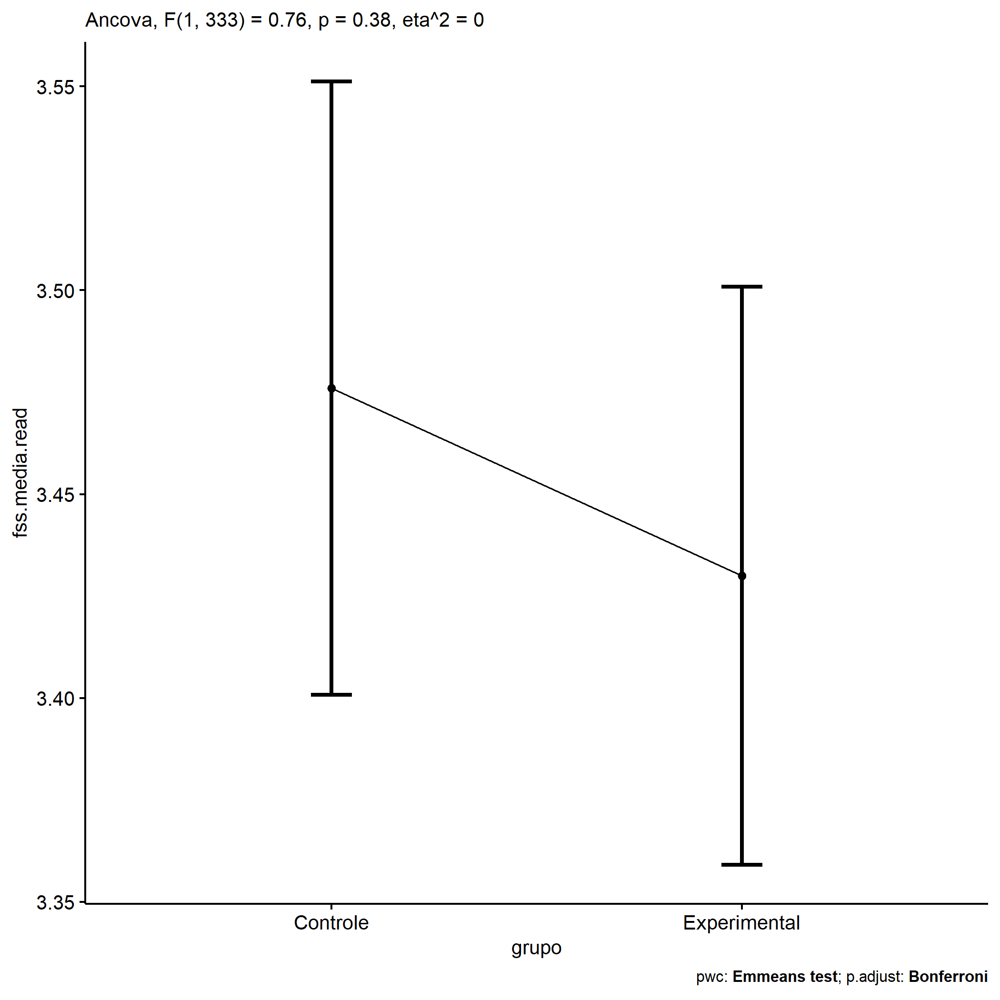<!-- -->

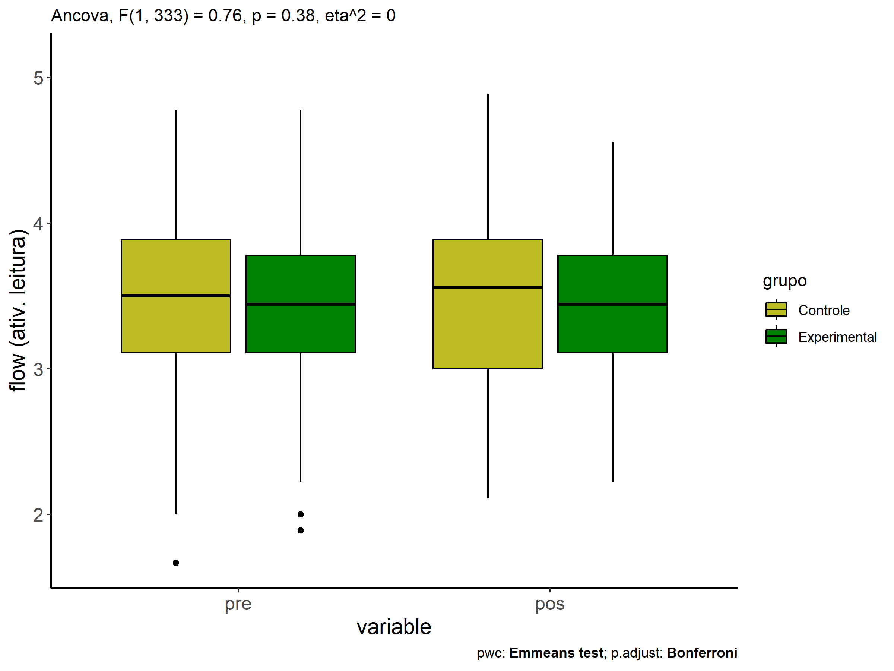<!-- -->

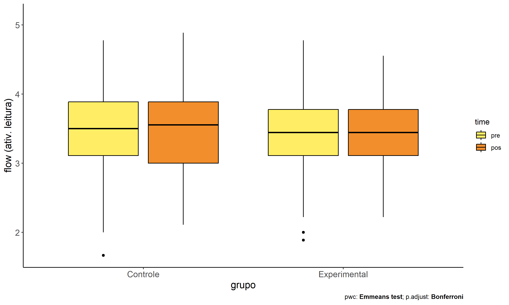<!-- -->

## Pairwise comparisons for two factors

### factores: **grupo:Sexo**

| var            | grupo        | Sexo |   n | M (pre) | SE (pre) | M (unadj) | SE (unadj) | M (adj) | SE (adj) |
|:---------------|:-------------|:-----|----:|--------:|---------:|----------:|-----------:|--------:|---------:|
| fss.media.read | Controle     | F    |  73 |   3.568 |    0.075 |     3.592 |      0.063 |   3.546 |    0.056 |
| fss.media.read | Controle     | M    |  85 |   3.434 |    0.068 |     3.410 |      0.065 |   3.417 |    0.052 |
| fss.media.read | Experimental | F    |  93 |   3.454 |    0.046 |     3.439 |      0.052 |   3.438 |    0.050 |
| fss.media.read | Experimental | M    |  85 |   3.367 |    0.063 |     3.387 |      0.052 |   3.421 |    0.052 |

| .y.            | grupo        | Sexo | group1   | group2       | estimate | conf.low | conf.high |    se | statistic |     p | p.adj | p.adj.signif |
|:---------------|:-------------|:-----|:---------|:-------------|---------:|---------:|----------:|------:|----------:|------:|------:|:-------------|
| fss.media.read |              | F    | Controle | Experimental |    0.108 |   -0.040 |     0.256 | 0.075 |     1.437 | 0.152 | 0.152 | ns           |
| fss.media.read |              | M    | Controle | Experimental |   -0.004 |   -0.149 |     0.141 | 0.074 |    -0.059 | 0.953 | 0.953 | ns           |
| dfs.media.read |              | F    | Controle | Experimental |    0.114 |   -0.062 |     0.290 | 0.089 |     1.273 | 0.204 | 0.204 | ns           |
| dfs.media.read |              | M    | Controle | Experimental |    0.068 |   -0.105 |     0.240 | 0.088 |     0.773 | 0.440 | 0.440 | ns           |
| fss.media.read | Controle     |      | F        | M            |    0.129 |   -0.022 |     0.280 | 0.077 |     1.686 | 0.093 | 0.093 | ns           |
| fss.media.read | Experimental |      | F        | M            |    0.017 |   -0.125 |     0.159 | 0.072 |     0.237 | 0.813 | 0.813 | ns           |
| dfs.media.read | Controle     |      | F        | M            |    0.133 |   -0.046 |     0.313 | 0.091 |     1.460 | 0.145 | 0.145 | ns           |
| dfs.media.read | Experimental |      | F        | M            |    0.087 |   -0.082 |     0.256 | 0.086 |     1.016 | 0.310 | 0.310 | ns           |

| .y.       | grupo        | Sexo | group1 | group2 | estimate | conf.low | conf.high |    se | statistic |     p | p.adj | p.adj.signif |
|:----------|:-------------|:-----|:-------|:-------|---------:|---------:|----------:|------:|----------:|------:|------:|:-------------|
| flow.read | Controle     | F    | pre    | pos    |   -0.024 |   -0.203 |     0.155 | 0.091 |    -0.262 | 0.794 | 0.794 | ns           |
| flow.read | Controle     | M    | pre    | pos    |    0.025 |   -0.141 |     0.191 | 0.085 |     0.292 | 0.770 | 0.770 | ns           |
| flow.read | Experimental | F    | pre    | pos    |    0.015 |   -0.144 |     0.174 | 0.081 |     0.187 | 0.852 | 0.852 | ns           |
| flow.read | Experimental | M    | pre    | pos    |   -0.021 |   -0.187 |     0.145 | 0.085 |    -0.246 | 0.806 | 0.806 | ns           |

    ## Scale for colour is already present.
    ## Adding another scale for colour, which will replace the existing scale.

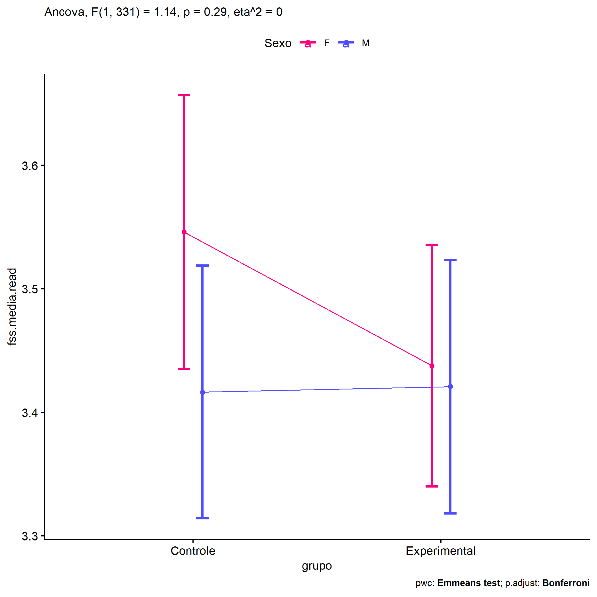<!-- -->

    ## Scale for colour is already present.
    ## Adding another scale for colour, which will replace the existing scale.

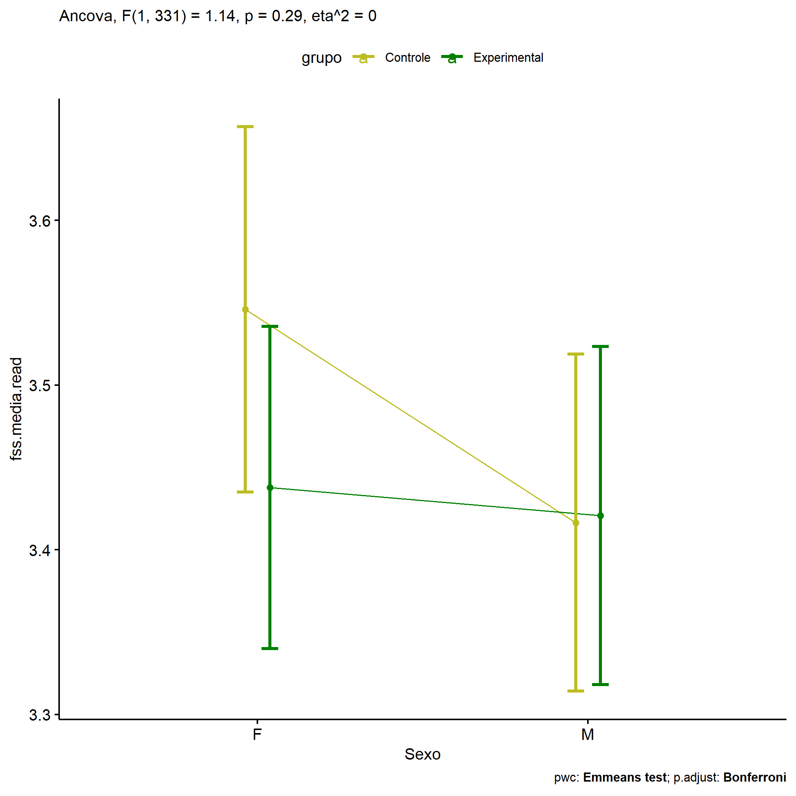<!-- -->

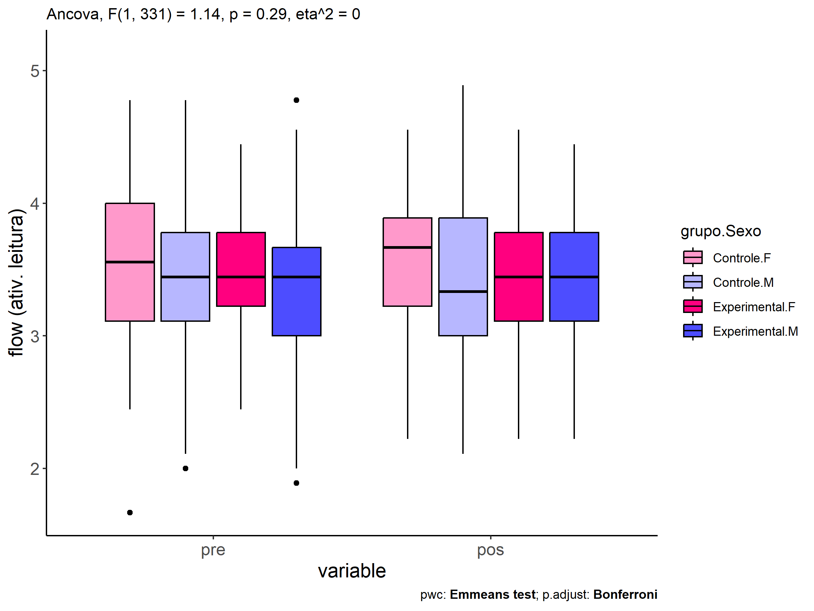<!-- -->

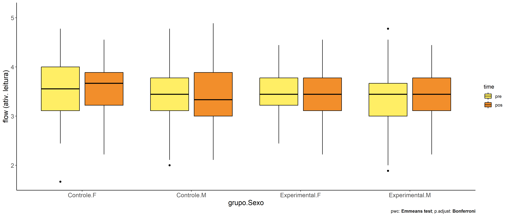<!-- -->

### factores: **grupo:Zona**

| var            | grupo        | Zona   |   n | M (pre) | SE (pre) | M (unadj) | SE (unadj) | M (adj) | SE (adj) |
|:---------------|:-------------|:-------|----:|--------:|---------:|----------:|-----------:|--------:|---------:|
| fss.media.read | Controle     | Rural  | 107 |   3.561 |    0.059 |     3.534 |      0.055 |   3.505 |    0.046 |
| fss.media.read | Controle     | Urbana |  29 |   3.513 |    0.130 |     3.529 |      0.105 |   3.518 |    0.088 |
| fss.media.read | Experimental | Rural  |  89 |   3.388 |    0.051 |     3.427 |      0.049 |   3.464 |    0.051 |
| fss.media.read | Experimental | Urbana |  44 |   3.476 |    0.075 |     3.382 |      0.071 |   3.386 |    0.072 |

| .y.            | grupo        | Zona   | group1   | group2       | estimate | conf.low | conf.high |    se | statistic |     p | p.adj | p.adj.signif |
|:---------------|:-------------|:-------|:---------|:-------------|---------:|---------:|----------:|------:|----------:|------:|------:|:-------------|
| fss.media.read |              | Rural  | Controle | Experimental |    0.040 |   -0.095 |     0.176 | 0.069 |     0.588 | 0.557 | 0.557 | ns           |
| fss.media.read |              | Urbana | Controle | Experimental |    0.133 |   -0.091 |     0.357 | 0.114 |     1.166 | 0.245 | 0.245 | ns           |
| dfs.media.read |              | Rural  | Controle | Experimental |    0.173 |    0.014 |     0.333 | 0.081 |     2.139 | 0.033 | 0.033 | \*           |
| dfs.media.read |              | Urbana | Controle | Experimental |    0.037 |   -0.229 |     0.303 | 0.135 |     0.275 | 0.784 | 0.784 | ns           |
| fss.media.read | Controle     |        | Rural    | Urbana       |   -0.014 |   -0.210 |     0.183 | 0.100 |    -0.138 | 0.890 | 0.890 | ns           |
| fss.media.read | Experimental |        | Rural    | Urbana       |    0.079 |   -0.094 |     0.251 | 0.088 |     0.894 | 0.372 | 0.372 | ns           |
| dfs.media.read | Controle     |        | Rural    | Urbana       |    0.048 |   -0.185 |     0.280 | 0.118 |     0.404 | 0.687 | 0.687 | ns           |
| dfs.media.read | Experimental |        | Rural    | Urbana       |   -0.088 |   -0.293 |     0.116 | 0.104 |    -0.850 | 0.396 | 0.396 | ns           |

| .y.       | grupo        | Zona   | group1 | group2 | estimate | conf.low | conf.high |    se | statistic |     p | p.adj | p.adj.signif |
|:----------|:-------------|:-------|:-------|:-------|---------:|---------:|----------:|------:|----------:|------:|------:|:-------------|
| flow.read | Controle     | Rural  | pre    | pos    |    0.027 |   -0.119 |     0.173 | 0.074 |     0.369 | 0.712 | 0.712 | ns           |
| flow.read | Controle     | Urbana | pre    | pos    |   -0.016 |   -0.296 |     0.265 | 0.143 |    -0.111 | 0.912 | 0.912 | ns           |
| flow.read | Experimental | Rural  | pre    | pos    |   -0.039 |   -0.199 |     0.121 | 0.081 |    -0.479 | 0.632 | 0.632 | ns           |
| flow.read | Experimental | Urbana | pre    | pos    |    0.094 |   -0.134 |     0.322 | 0.116 |     0.812 | 0.417 | 0.417 | ns           |

    ## Scale for colour is already present.
    ## Adding another scale for colour, which will replace the existing scale.

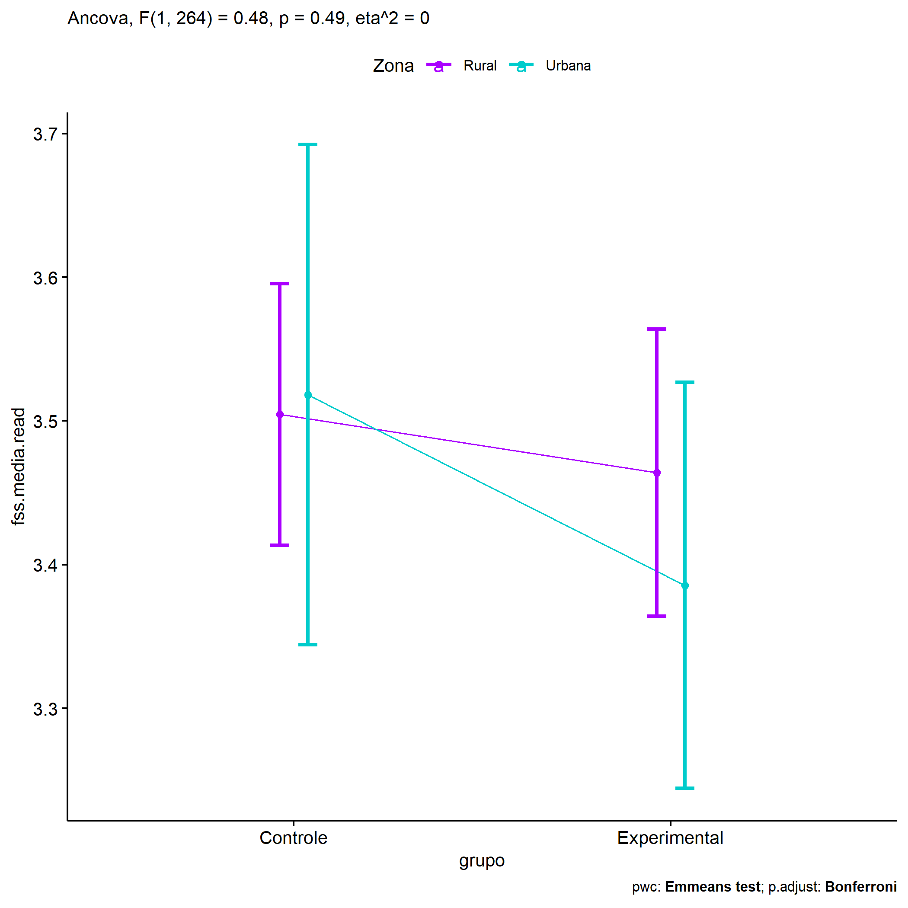<!-- -->

    ## Scale for colour is already present.
    ## Adding another scale for colour, which will replace the existing scale.

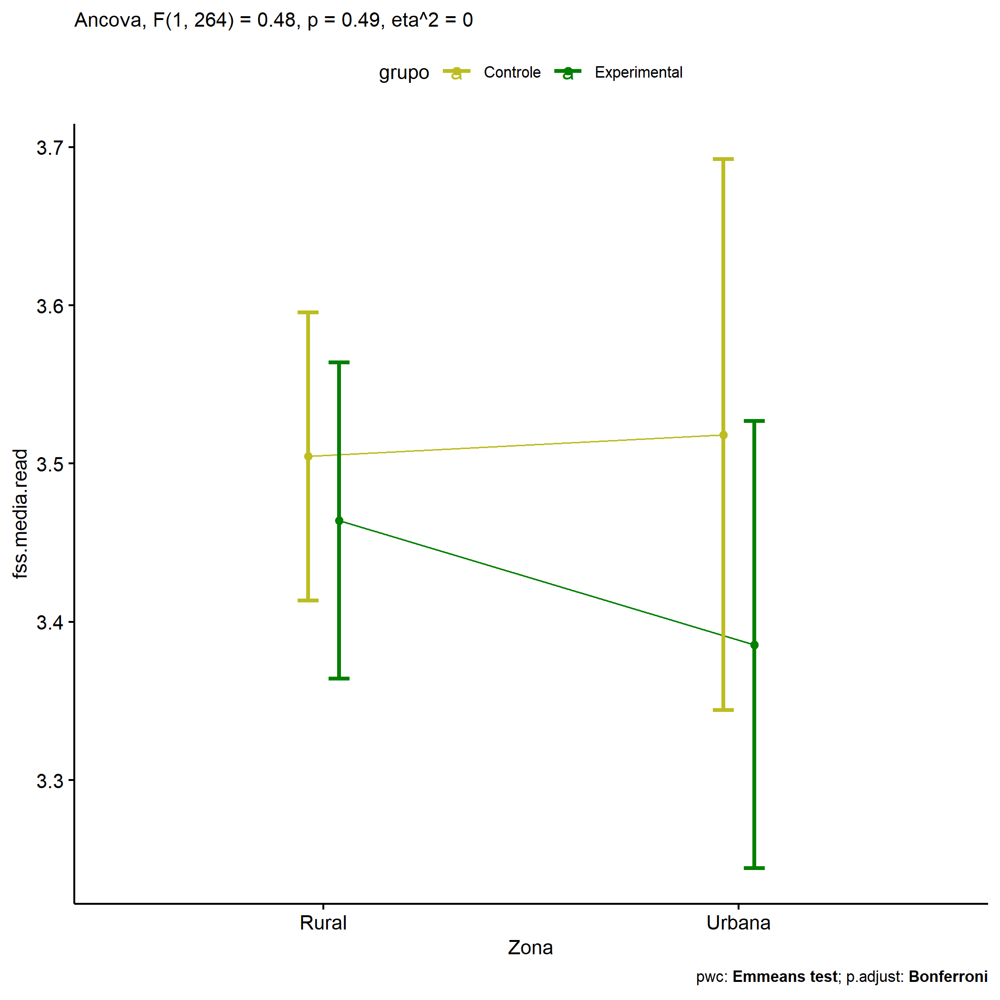<!-- -->

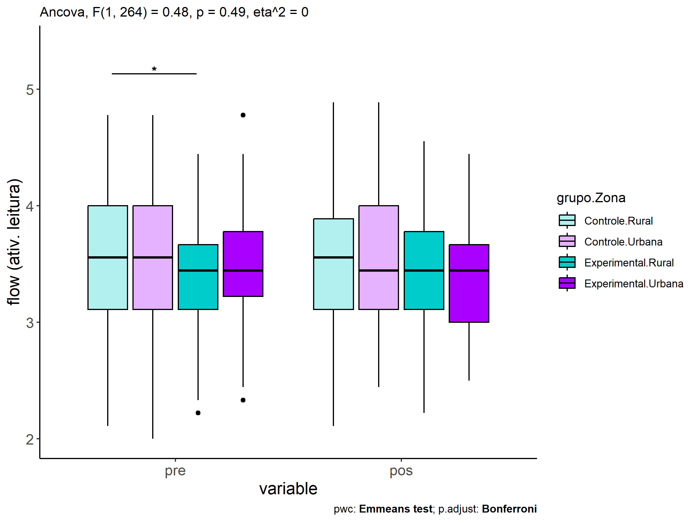<!-- -->

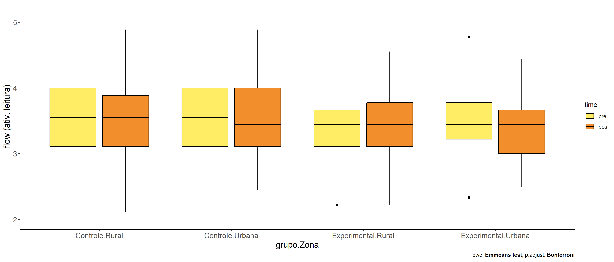<!-- -->

### factores: **grupo:Cor.Raca**

| var            | grupo        | Cor.Raca |   n | M (pre) | SE (pre) | M (unadj) | SE (unadj) | M (adj) | SE (adj) |
|:---------------|:-------------|:---------|----:|--------:|---------:|----------:|-----------:|--------:|---------:|
| fss.media.read | Controle     | Branca   |  20 |   3.556 |    0.141 |     3.533 |      0.125 |   3.479 |    0.106 |
| fss.media.read | Controle     | Parda    |  46 |   3.514 |    0.092 |     3.504 |      0.087 |   3.468 |    0.070 |
| fss.media.read | Experimental | Branca   |  17 |   3.458 |    0.077 |     3.425 |      0.101 |   3.414 |    0.114 |
| fss.media.read | Experimental | Indígena |  13 |   3.374 |    0.111 |     3.256 |      0.134 |   3.283 |    0.130 |
| fss.media.read | Experimental | Parda    |  49 |   3.316 |    0.065 |     3.361 |      0.069 |   3.414 |    0.068 |

|     | .y.            | grupo        | Cor.Raca | group1   | group2       | estimate | conf.low | conf.high |    se | statistic |     p | p.adj | p.adj.signif |
|:----|:---------------|:-------------|:---------|:---------|:-------------|---------:|---------:|----------:|------:|----------:|------:|------:|:-------------|
| 1   | fss.media.read |              | Branca   | Controle | Experimental |    0.065 |   -0.242 |     0.372 | 0.155 |     0.417 | 0.677 | 0.677 | ns           |
| 3   | fss.media.read |              | Parda    | Controle | Experimental |    0.054 |   -0.139 |     0.247 | 0.098 |     0.553 | 0.581 | 0.581 | ns           |
| 4   | dfs.media.read |              | Branca   | Controle | Experimental |    0.098 |   -0.246 |     0.442 | 0.174 |     0.564 | 0.574 | 0.574 | ns           |
| 6   | dfs.media.read |              | Parda    | Controle | Experimental |    0.198 |   -0.016 |     0.412 | 0.108 |     1.833 | 0.069 | 0.069 | ns           |
| 8   | fss.media.read | Controle     |          | Branca   | Parda        |    0.011 |   -0.238 |     0.260 | 0.126 |     0.089 | 0.929 | 0.929 | ns           |
| 10  | fss.media.read | Experimental |          | Branca   | Indígena     |    0.131 |   -0.211 |     0.474 | 0.173 |     0.757 | 0.450 | 1.000 | ns           |
| 11  | fss.media.read | Experimental |          | Branca   | Parda        |    0.000 |   -0.262 |     0.263 | 0.133 |     0.003 | 0.998 | 1.000 | ns           |
| 12  | fss.media.read | Experimental |          | Indígena | Parda        |   -0.131 |   -0.421 |     0.159 | 0.147 |    -0.891 | 0.374 | 1.000 | ns           |
| 14  | dfs.media.read | Controle     |          | Branca   | Parda        |    0.041 |   -0.238 |     0.320 | 0.141 |     0.291 | 0.772 | 0.772 | ns           |
| 16  | dfs.media.read | Experimental |          | Branca   | Indígena     |    0.084 |   -0.300 |     0.468 | 0.194 |     0.430 | 0.668 | 1.000 | ns           |
| 17  | dfs.media.read | Experimental |          | Branca   | Parda        |    0.141 |   -0.152 |     0.435 | 0.148 |     0.953 | 0.342 | 1.000 | ns           |
| 18  | dfs.media.read | Experimental |          | Indígena | Parda        |    0.058 |   -0.267 |     0.383 | 0.164 |     0.352 | 0.725 | 1.000 | ns           |

| .y.       | grupo        | Cor.Raca | group1 | group2 | estimate | conf.low | conf.high |    se | statistic |     p | p.adj | p.adj.signif |
|:----------|:-------------|:---------|:-------|:-------|---------:|---------:|----------:|------:|----------:|------:|------:|:-------------|
| flow.read | Controle     | Branca   | pre    | pos    |    0.022 |   -0.305 |     0.349 | 0.166 |     0.134 | 0.894 | 0.894 | ns           |
| flow.read | Controle     | Parda    | pre    | pos    |    0.011 |   -0.205 |     0.226 | 0.110 |     0.097 | 0.923 | 0.923 | ns           |
| flow.read | Experimental | Branca   | pre    | pos    |    0.033 |   -0.322 |     0.388 | 0.180 |     0.181 | 0.856 | 0.856 | ns           |
| flow.read | Experimental | Indígena | pre    | pos    |    0.118 |   -0.288 |     0.523 | 0.206 |     0.570 | 0.569 | 0.569 | ns           |
| flow.read | Experimental | Parda    | pre    | pos    |   -0.045 |   -0.254 |     0.164 | 0.106 |    -0.427 | 0.670 | 0.670 | ns           |

    ## Scale for colour is already present.
    ## Adding another scale for colour, which will replace the existing scale.

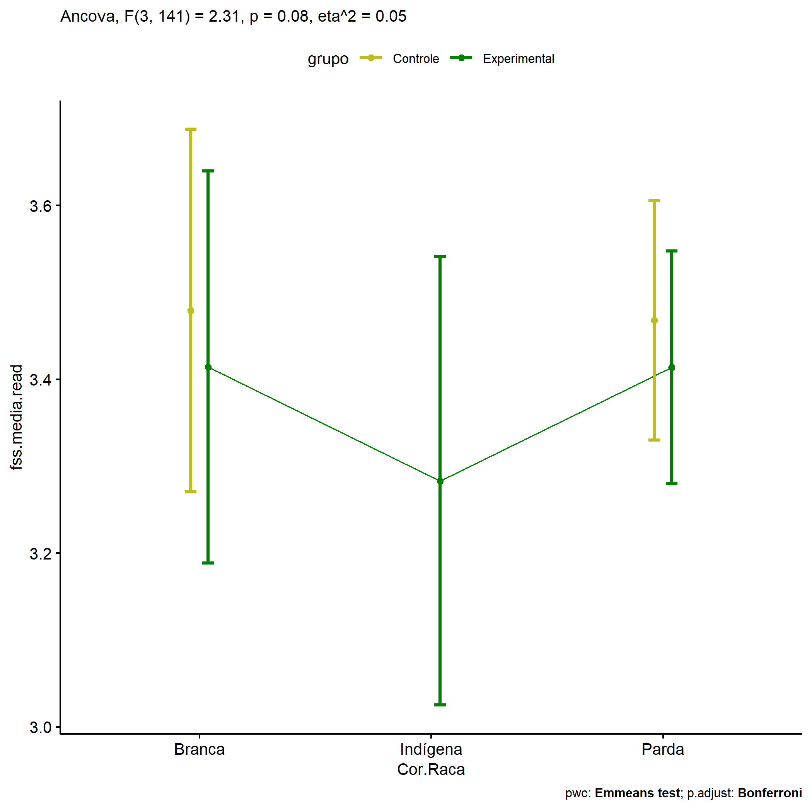<!-- -->

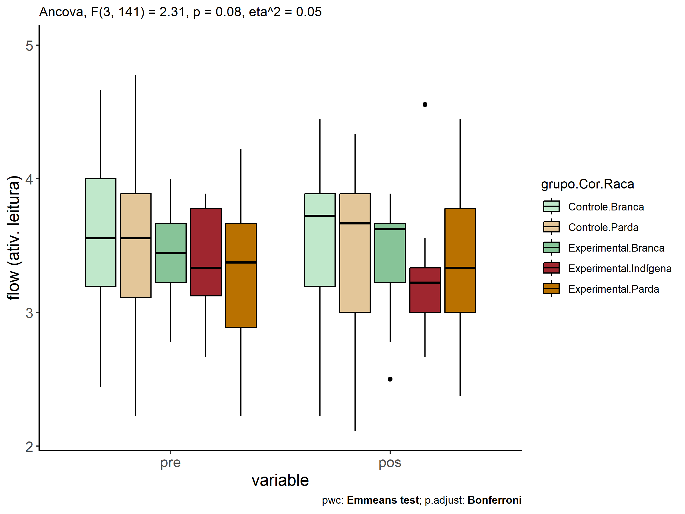<!-- -->

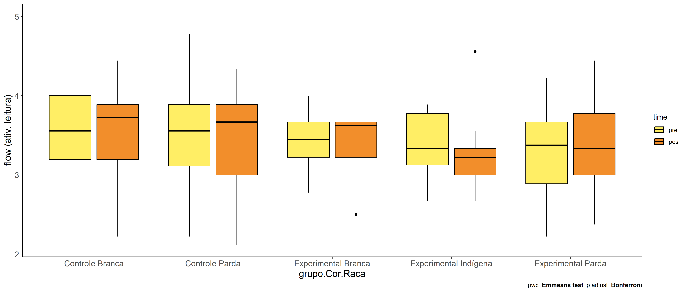<!-- -->
