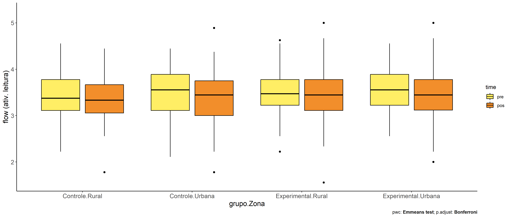

ANCOVA in flow (ativ. leitura) (flow (ativ. leitura))
================
Geiser C. Challco <geiser@alumni.usp.br>

- [Descriptive Statistics of Initial
  Data](#descriptive-statistics-of-initial-data)
- [Checking of Assumptions](#checking-of-assumptions)
  - [Assumption: Normality distribution of
    data](#assumption-normality-distribution-of-data)
  - [Assumption: Homogeneity of data
    distribution](#assumption-homogeneity-of-data-distribution)
- [Computation of ANCOVA test and Pairwise
  Comparison](#computation-of-ancova-test-and-pairwise-comparison)
  - [ANCOVA tests for one factor](#ancova-tests-for-one-factor)
  - [ANCOVA tests for two factors](#ancova-tests-for-two-factors)
  - [Pairwise comparisons for one factor:
    **grupo**](#pairwise-comparisons-for-one-factor-grupo)
  - [Pairwise comparisons for two
    factors](#pairwise-comparisons-for-two-factors)
    - [factores: **grupo:Sexo**](#factores-gruposexo)
    - [factores: **grupo:Zona**](#factores-grupozona)
    - [factores: **grupo:Cor.Raca**](#factores-grupocorraca)

**NOTE**

- Teste ANCOVA para determinar se houve diferenças significativas no
  flow (ativ. leitura) (medido usando pre- e pos-testes).
- ANCOVA test to determine whether there were significant differences in
  flow (ativ. leitura) (measured using pre- and post-tests).

# Descriptive Statistics of Initial Data

| grupo        | Sexo | Zona   | Cor.Raca | variable       |   n |  mean | median |   min |   max |    sd |    se |    ci |   iqr |
|:-------------|:-----|:-------|:---------|:---------------|----:|------:|-------:|------:|------:|------:|------:|------:|------:|
| Controle     | F    |        |          | dfs.media.read |  74 | 3.542 |  3.556 | 2.333 | 4.556 | 0.472 | 0.055 | 0.109 | 0.667 |
| Controle     | M    |        |          | dfs.media.read |  62 | 3.299 |  3.222 | 2.111 | 4.444 | 0.584 | 0.074 | 0.148 | 0.778 |
| Experimental | F    |        |          | dfs.media.read |  97 | 3.502 |  3.444 | 2.556 | 4.444 | 0.411 | 0.042 | 0.083 | 0.444 |
| Experimental | M    |        |          | dfs.media.read | 110 | 3.508 |  3.528 | 2.222 | 4.625 | 0.474 | 0.045 | 0.090 | 0.750 |
| Controle     | F    |        |          | fss.media.read |  74 | 3.400 |  3.333 | 2.222 | 4.889 | 0.529 | 0.061 | 0.123 | 0.743 |
| Controle     | M    |        |          | fss.media.read |  62 | 3.280 |  3.222 | 1.778 | 4.444 | 0.563 | 0.071 | 0.143 | 0.750 |
| Experimental | F    |        |          | fss.media.read |  97 | 3.434 |  3.444 | 1.556 | 4.667 | 0.568 | 0.058 | 0.115 | 0.667 |
| Experimental | M    |        |          | fss.media.read | 110 | 3.525 |  3.444 | 2.000 | 5.000 | 0.558 | 0.053 | 0.105 | 0.736 |
| Controle     |      | Rural  |          | dfs.media.read |  55 | 3.443 |  3.375 | 2.222 | 4.556 | 0.496 | 0.067 | 0.134 | 0.667 |
| Controle     |      | Urbana |          | dfs.media.read |  61 | 3.480 |  3.556 | 2.111 | 4.444 | 0.539 | 0.069 | 0.138 | 0.778 |
| Controle     |      |        |          | dfs.media.read |  20 | 3.251 |  3.222 | 2.333 | 4.444 | 0.630 | 0.141 | 0.295 | 1.056 |
| Experimental |      | Rural  |          | dfs.media.read |  92 | 3.488 |  3.472 | 2.222 | 4.625 | 0.468 | 0.049 | 0.097 | 0.556 |
| Experimental |      | Urbana |          | dfs.media.read |  83 | 3.554 |  3.556 | 2.556 | 4.556 | 0.414 | 0.045 | 0.090 | 0.667 |
| Experimental |      |        |          | dfs.media.read |  32 | 3.429 |  3.444 | 2.667 | 4.333 | 0.452 | 0.080 | 0.163 | 0.556 |
| Controle     |      | Rural  |          | fss.media.read |  55 | 3.370 |  3.333 | 1.778 | 4.444 | 0.508 | 0.069 | 0.137 | 0.611 |
| Controle     |      | Urbana |          | fss.media.read |  61 | 3.373 |  3.444 | 1.778 | 4.889 | 0.572 | 0.073 | 0.147 | 0.750 |
| Controle     |      |        |          | fss.media.read |  20 | 3.193 |  3.056 | 2.333 | 4.222 | 0.565 | 0.126 | 0.264 | 0.743 |
| Experimental |      | Rural  |          | fss.media.read |  92 | 3.471 |  3.444 | 1.556 | 5.000 | 0.565 | 0.059 | 0.117 | 0.667 |
| Experimental |      | Urbana |          | fss.media.read |  83 | 3.486 |  3.444 | 2.000 | 5.000 | 0.577 | 0.063 | 0.126 | 0.660 |
| Experimental |      |        |          | fss.media.read |  32 | 3.507 |  3.528 | 2.111 | 5.000 | 0.537 | 0.095 | 0.194 | 0.667 |
| Controle     |      |        | Branca   | dfs.media.read |  18 | 3.486 |  3.333 | 2.556 | 4.444 | 0.600 | 0.141 | 0.298 | 1.028 |
| Controle     |      |        | Indígena | dfs.media.read |   4 | 3.528 |  3.722 | 2.889 | 3.778 | 0.429 | 0.215 | 0.683 | 0.306 |
| Controle     |      |        | Parda    | dfs.media.read |  42 | 3.424 |  3.333 | 2.333 | 4.556 | 0.545 | 0.084 | 0.170 | 0.750 |
| Controle     |      |        |          | dfs.media.read |  72 | 3.416 |  3.444 | 2.111 | 4.444 | 0.533 | 0.063 | 0.125 | 0.667 |
| Experimental |      |        | Branca   | dfs.media.read |  15 | 3.511 |  3.444 | 2.556 | 4.333 | 0.531 | 0.137 | 0.294 | 0.722 |
| Experimental |      |        | Parda    | dfs.media.read |  49 | 3.478 |  3.444 | 2.556 | 4.556 | 0.439 | 0.063 | 0.126 | 0.444 |
| Experimental |      |        |          | dfs.media.read | 143 | 3.514 |  3.556 | 2.222 | 4.625 | 0.440 | 0.037 | 0.073 | 0.556 |
| Controle     |      |        | Branca   | fss.media.read |  18 | 3.647 |  3.667 | 2.667 | 4.889 | 0.580 | 0.137 | 0.288 | 0.694 |
| Controle     |      |        | Indígena | fss.media.read |   4 | 3.722 |  3.722 | 3.556 | 3.889 | 0.143 | 0.072 | 0.228 | 0.167 |
| Controle     |      |        | Parda    | fss.media.read |  42 | 3.206 |  3.111 | 1.778 | 4.000 | 0.448 | 0.069 | 0.139 | 0.556 |
| Controle     |      |        |          | fss.media.read |  72 | 3.330 |  3.236 | 1.778 | 4.444 | 0.572 | 0.067 | 0.134 | 0.757 |
| Experimental |      |        | Branca   | fss.media.read |  15 | 3.270 |  3.333 | 2.000 | 3.889 | 0.496 | 0.128 | 0.275 | 0.444 |
| Experimental |      |        | Parda    | fss.media.read |  49 | 3.454 |  3.444 | 2.556 | 5.000 | 0.520 | 0.074 | 0.149 | 0.778 |
| Experimental |      |        |          | fss.media.read | 143 | 3.515 |  3.444 | 1.556 | 5.000 | 0.582 | 0.049 | 0.096 | 0.757 |

# Checking of Assumptions

## Assumption: Normality distribution of data

| var            |   n |   skewness |  kurtosis | symmetry | statistic | method     |         p | p.signif | normality |
|:---------------|----:|-----------:|----------:|:---------|----------:|:-----------|----------:|:---------|:----------|
| fss.media.read | 343 | -0.1035997 | 0.4455731 | YES      | 3.4747326 | D’Agostino | 0.1759833 | ns       | \-        |
| fss.media.read | 291 | -0.1814789 | 0.4197004 | YES      | 4.0161423 | D’Agostino | 0.1342474 | ns       | \-        |
| fss.media.read | 128 | -0.1415859 | 0.0897969 | YES      | 0.8557159 | D’Agostino | 0.6519040 | ns       | QQ        |

## Assumption: Homogeneity of data distribution

| var            | method         | formula                    |   n | DFn.df1 | DFd.df2 | statistic |         p | p.signif |
|:---------------|:---------------|:---------------------------|----:|--------:|--------:|----------:|----------:|:---------|
| fss.media.read | Levene’s test  | `.res`~`grupo`\*`Sexo`     | 343 |       3 |     339 | 0.3813498 | 0.7665112 | ns       |
| fss.media.read | Anova’s slopes | `.res`~`grupo`\*`Sexo`     | 343 |       3 |     335 | 0.7710000 | 0.5110000 | ns       |
| fss.media.read | Levene’s test  | `.res`~`grupo`\*`Zona`     | 291 |       3 |     287 | 0.1994003 | 0.8967487 | ns       |
| fss.media.read | Anova’s slopes | `.res`~`grupo`\*`Zona`     | 291 |       3 |     283 | 0.1980000 | 0.8970000 | ns       |
| fss.media.read | Levene’s test  | `.res`~`grupo`\*`Cor.Raca` | 128 |       4 |     123 | 0.4073738 | 0.8030495 | ns       |
| fss.media.read | Anova’s slopes | `.res`~`grupo`\*`Cor.Raca` | 128 |       4 |     118 | 0.8720000 | 0.4830000 | ns       |

# Computation of ANCOVA test and Pairwise Comparison

## ANCOVA tests for one factor

|     | Effect         | DFn | DFd |    SSn |    SSd |      F | p       |   ges | p\<.05 |
|:----|:---------------|----:|----:|-------:|-------:|-------:|:--------|------:|:-------|
| 1   | dfs.media.read |   1 | 340 | 17.538 | 88.021 | 67.743 | \<0.001 | 0.166 | \*     |
| 2   | grupo          |   1 | 340 |  0.853 | 88.021 |  3.293 | 0.07    | 0.010 |        |
| 4   | Sexo           |   1 | 340 |  0.299 | 88.575 |  1.148 | 0.285   | 0.003 |        |
| 6   | Zona           |   1 | 288 |  0.032 | 73.770 |  0.125 | 0.724   | 0.000 |        |
| 8   | Cor.Raca       |   2 | 124 |  0.731 | 27.402 |  1.653 | 0.196   | 0.026 |        |

## ANCOVA tests for two factors

|     | Effect         | DFn | DFd |    SSn |    SSd |      F | p       |   ges | p\<.05 |
|:----|:---------------|----:|----:|-------:|-------:|-------:|:--------|------:|:-------|
| 1   | dfs.media.read |   1 | 338 | 17.033 | 87.620 | 65.706 | \<0.001 | 0.163 | \*     |
| 4   | grupo:Sexo     |   1 | 338 |  0.177 | 87.620 |  0.684 | 0.409   | 0.002 |        |
| 8   | grupo:Zona     |   1 | 286 |  0.000 | 73.364 |  0.001 | 0.979   | 0.000 |        |
| 12  | grupo:Cor.Raca |   1 | 122 |  2.251 | 25.032 | 10.969 | 0.001   | 0.082 | \*     |

## Pairwise comparisons for one factor: **grupo**

| var            | grupo        |   n | M (pre) | SE (pre) | M (unadj) | SE (unadj) | M (adj) | SE (adj) |
|:---------------|:-------------|----:|--------:|---------:|----------:|-----------:|--------:|---------:|
| fss.media.read | Controle     | 136 |   3.431 |    0.046 |     3.345 |      0.047 |   3.366 |    0.044 |
| fss.media.read | Experimental | 207 |   3.505 |    0.031 |     3.482 |      0.039 |   3.469 |    0.035 |

| .y.            | group1   | group2       | estimate | conf.low | conf.high |    se | statistic |     p | p.adj | p.adj.signif |
|:---------------|:---------|:-------------|---------:|---------:|----------:|------:|----------:|------:|------:|:-------------|
| fss.media.read | Controle | Experimental |   -0.102 |   -0.213 |     0.009 | 0.056 |    -1.815 | 0.070 | 0.070 | ns           |
| dfs.media.read | Controle | Experimental |   -0.074 |   -0.179 |     0.031 | 0.053 |    -1.392 | 0.165 | 0.165 | ns           |

| .y.       | grupo        | group1 | group2 | estimate | conf.low | conf.high |    se | statistic |     p | p.adj | p.adj.signif |
|:----------|:-------------|:-------|:-------|---------:|---------:|----------:|------:|----------:|------:|------:|:-------------|
| flow.read | Controle     | pre    | pos    |    0.086 |   -0.038 |     0.210 | 0.063 |     1.356 | 0.176 | 0.176 | ns           |
| flow.read | Experimental | pre    | pos    |    0.023 |   -0.078 |     0.124 | 0.051 |     0.449 | 0.653 | 0.653 | ns           |

    ## Scale for colour is already present.
    ## Adding another scale for colour, which will replace the existing scale.

<!-- -->

<!-- -->

<!-- -->

## Pairwise comparisons for two factors

### factores: **grupo:Sexo**

| var            | grupo        | Sexo |   n | M (pre) | SE (pre) | M (unadj) | SE (unadj) | M (adj) | SE (adj) |
|:---------------|:-------------|:-----|----:|--------:|---------:|----------:|-----------:|--------:|---------:|
| fss.media.read | Controle     | F    |  74 |   3.542 |    0.055 |     3.400 |      0.061 |   3.369 |    0.059 |
| fss.media.read | Controle     | M    |  62 |   3.299 |    0.074 |     3.280 |      0.071 |   3.363 |    0.065 |
| fss.media.read | Experimental | F    |  97 |   3.502 |    0.042 |     3.434 |      0.058 |   3.422 |    0.052 |
| fss.media.read | Experimental | M    | 110 |   3.508 |    0.045 |     3.525 |      0.053 |   3.510 |    0.049 |

| .y.            | grupo        | Sexo | group1   | group2       | estimate | conf.low | conf.high |    se | statistic |     p | p.adj | p.adj.signif |
|:---------------|:-------------|:-----|:---------|:-------------|---------:|---------:|----------:|------:|----------:|------:|------:|:-------------|
| fss.media.read |              | F    | Controle | Experimental |   -0.053 |   -0.207 |     0.102 | 0.079 |    -0.671 | 0.503 | 0.503 | ns           |
| fss.media.read |              | M    | Controle | Experimental |   -0.147 |   -0.308 |     0.014 | 0.082 |    -1.796 | 0.073 | 0.073 | ns           |
| dfs.media.read |              | F    | Controle | Experimental |    0.039 |   -0.106 |     0.185 | 0.074 |     0.532 | 0.595 | 0.595 | ns           |
| dfs.media.read |              | M    | Controle | Experimental |   -0.209 |   -0.359 |    -0.059 | 0.076 |    -2.747 | 0.006 | 0.006 | \*\*         |
| fss.media.read | Controle     |      | F        | M            |    0.006 |   -0.169 |     0.180 | 0.089 |     0.066 | 0.947 | 0.947 | ns           |
| fss.media.read | Experimental |      | F        | M            |   -0.088 |   -0.228 |     0.051 | 0.071 |    -1.243 | 0.215 | 0.215 | ns           |
| dfs.media.read | Controle     |      | F        | M            |    0.243 |    0.080 |     0.405 | 0.083 |     2.939 | 0.004 | 0.004 | \*\*         |
| dfs.media.read | Experimental |      | F        | M            |   -0.006 |   -0.137 |     0.125 | 0.067 |    -0.089 | 0.929 | 0.929 | ns           |

| .y.       | grupo        | Sexo | group1 | group2 | estimate | conf.low | conf.high |    se | statistic |     p | p.adj | p.adj.signif |
|:----------|:-------------|:-----|:-------|:-------|---------:|---------:|----------:|------:|----------:|------:|------:|:-------------|
| flow.read | Controle     | F    | pre    | pos    |    0.142 |   -0.026 |     0.309 | 0.085 |     1.663 | 0.097 | 0.097 | ns           |
| flow.read | Controle     | M    | pre    | pos    |    0.019 |   -0.164 |     0.202 | 0.093 |     0.200 | 0.841 | 0.841 | ns           |
| flow.read | Experimental | F    | pre    | pos    |    0.068 |   -0.078 |     0.214 | 0.075 |     0.915 | 0.360 | 0.360 | ns           |
| flow.read | Experimental | M    | pre    | pos    |   -0.017 |   -0.154 |     0.121 | 0.070 |    -0.240 | 0.810 | 0.810 | ns           |

    ## Scale for colour is already present.
    ## Adding another scale for colour, which will replace the existing scale.

<!-- -->

    ## Scale for colour is already present.
    ## Adding another scale for colour, which will replace the existing scale.

<!-- -->

<!-- -->

<!-- -->

### factores: **grupo:Zona**

| var            | grupo        | Zona   |   n | M (pre) | SE (pre) | M (unadj) | SE (unadj) | M (adj) | SE (adj) |
|:---------------|:-------------|:-------|----:|--------:|---------:|----------:|-----------:|--------:|---------:|
| fss.media.read | Controle     | Rural  |  55 |   3.443 |    0.067 |     3.370 |      0.069 |   3.397 |    0.068 |
| fss.media.read | Controle     | Urbana |  61 |   3.480 |    0.069 |     3.373 |      0.073 |   3.382 |    0.065 |
| fss.media.read | Experimental | Rural  |  92 |   3.488 |    0.049 |     3.471 |      0.059 |   3.475 |    0.053 |
| fss.media.read | Experimental | Urbana |  83 |   3.554 |    0.045 |     3.486 |      0.063 |   3.457 |    0.056 |

| .y.            | grupo        | Zona   | group1   | group2       | estimate | conf.low | conf.high |    se | statistic |     p | p.adj | p.adj.signif |
|:---------------|:-------------|:-------|:---------|:-------------|---------:|---------:|----------:|------:|----------:|------:|------:|:-------------|
| fss.media.read |              | Rural  | Controle | Experimental |   -0.078 |   -0.248 |     0.092 | 0.086 |    -0.904 | 0.367 | 0.367 | ns           |
| fss.media.read |              | Urbana | Controle | Experimental |   -0.075 |   -0.243 |     0.094 | 0.086 |    -0.875 | 0.382 | 0.382 | ns           |
| dfs.media.read |              | Rural  | Controle | Experimental |   -0.046 |   -0.205 |     0.114 | 0.081 |    -0.562 | 0.574 | 0.574 | ns           |
| dfs.media.read |              | Urbana | Controle | Experimental |   -0.074 |   -0.232 |     0.083 | 0.080 |    -0.928 | 0.354 | 0.354 | ns           |
| fss.media.read | Controle     |        | Rural    | Urbana       |    0.015 |   -0.170 |     0.200 | 0.094 |     0.159 | 0.873 | 0.873 | ns           |
| fss.media.read | Experimental |        | Rural    | Urbana       |    0.018 |   -0.133 |     0.169 | 0.077 |     0.238 | 0.812 | 0.812 | ns           |
| dfs.media.read | Controle     |        | Rural    | Urbana       |   -0.037 |   -0.211 |     0.137 | 0.088 |    -0.418 | 0.676 | 0.676 | ns           |
| dfs.media.read | Experimental |        | Rural    | Urbana       |   -0.066 |   -0.207 |     0.076 | 0.072 |    -0.915 | 0.361 | 0.361 | ns           |

| .y.       | grupo        | Zona   | group1 | group2 | estimate | conf.low | conf.high |    se | statistic |     p | p.adj | p.adj.signif |
|:----------|:-------------|:-------|:-------|:-------|---------:|---------:|----------:|------:|----------:|------:|------:|:-------------|
| flow.read | Controle     | Rural  | pre    | pos    |    0.073 |   -0.121 |     0.268 | 0.099 |     0.738 | 0.461 | 0.461 | ns           |
| flow.read | Controle     | Urbana | pre    | pos    |    0.106 |   -0.078 |     0.291 | 0.094 |     1.131 | 0.259 | 0.259 | ns           |
| flow.read | Experimental | Rural  | pre    | pos    |    0.017 |   -0.133 |     0.168 | 0.077 |     0.228 | 0.820 | 0.820 | ns           |
| flow.read | Experimental | Urbana | pre    | pos    |    0.068 |   -0.090 |     0.226 | 0.081 |     0.845 | 0.398 | 0.398 | ns           |

    ## Scale for colour is already present.
    ## Adding another scale for colour, which will replace the existing scale.

<!-- -->

    ## Scale for colour is already present.
    ## Adding another scale for colour, which will replace the existing scale.

<!-- -->

<!-- -->

<!-- -->

### factores: **grupo:Cor.Raca**

| var            | grupo        | Cor.Raca |   n | M (pre) | SE (pre) | M (unadj) | SE (unadj) | M (adj) | SE (adj) |
|:---------------|:-------------|:---------|----:|--------:|---------:|----------:|-----------:|--------:|---------:|
| fss.media.read | Controle     | Branca   |  18 |   3.486 |    0.141 |     3.647 |      0.137 |   3.638 |    0.107 |
| fss.media.read | Controle     | Parda    |  42 |   3.424 |    0.084 |     3.206 |      0.069 |   3.224 |    0.070 |
| fss.media.read | Experimental | Branca   |  15 |   3.511 |    0.137 |     3.270 |      0.128 |   3.250 |    0.118 |
| fss.media.read | Experimental | Parda    |  49 |   3.478 |    0.063 |     3.454 |      0.074 |   3.448 |    0.065 |

| .y.            | grupo        | Cor.Raca | group1   | group2       | estimate | conf.low | conf.high |    se | statistic |     p | p.adj | p.adj.signif |
|:---------------|:-------------|:---------|:---------|:-------------|---------:|---------:|----------:|------:|----------:|------:|------:|:-------------|
| fss.media.read |              | Branca   | Controle | Experimental |    0.387 |    0.071 |     0.703 | 0.159 |     2.428 | 0.017 | 0.017 | \*           |
| fss.media.read |              | Parda    | Controle | Experimental |   -0.225 |   -0.415 |    -0.034 | 0.096 |    -2.339 | 0.021 | 0.021 | \*           |
| dfs.media.read |              | Branca   | Controle | Experimental |   -0.025 |   -0.379 |     0.330 | 0.179 |    -0.138 | 0.891 | 0.891 | ns           |
| dfs.media.read |              | Parda    | Controle | Experimental |   -0.054 |   -0.267 |     0.160 | 0.108 |    -0.498 | 0.619 | 0.619 | ns           |
| fss.media.read | Controle     |          | Branca   | Parda        |    0.414 |    0.159 |     0.669 | 0.129 |     3.220 | 0.002 | 0.002 | \*\*         |
| fss.media.read | Experimental |          | Branca   | Parda        |   -0.198 |   -0.464 |     0.069 | 0.135 |    -1.469 | 0.145 | 0.145 | ns           |
| dfs.media.read | Controle     |          | Branca   | Parda        |    0.062 |   -0.224 |     0.348 | 0.144 |     0.431 | 0.667 | 0.667 | ns           |
| dfs.media.read | Experimental |          | Branca   | Parda        |    0.033 |   -0.266 |     0.332 | 0.151 |     0.220 | 0.826 | 0.826 | ns           |

| .y.       | grupo        | Cor.Raca | group1 | group2 | estimate | conf.low | conf.high |    se | statistic |     p | p.adj | p.adj.signif |
|:----------|:-------------|:---------|:-------|:-------|---------:|---------:|----------:|------:|----------:|------:|------:|:-------------|
| flow.read | Controle     | Branca   | pre    | pos    |   -0.160 |   -0.493 |     0.173 | 0.169 |    -0.947 | 0.345 | 0.345 | ns           |
| flow.read | Controle     | Parda    | pre    | pos    |    0.218 |    0.000 |     0.436 | 0.111 |     1.968 | 0.050 | 0.050 | ns           |
| flow.read | Experimental | Branca   | pre    | pos    |    0.241 |   -0.124 |     0.606 | 0.185 |     1.302 | 0.194 | 0.194 | ns           |
| flow.read | Experimental | Parda    | pre    | pos    |    0.024 |   -0.178 |     0.226 | 0.103 |     0.238 | 0.812 | 0.812 | ns           |

    ## Scale for colour is already present.
    ## Adding another scale for colour, which will replace the existing scale.

<!-- -->

    ## Scale for colour is already present.
    ## Adding another scale for colour, which will replace the existing scale.

<!-- -->

<!-- -->

<!-- -->
