ANCOVA in flow (ativ. leitura) (flow (ativ. leitura))
================
Geiser C. Challco <geiser@alumni.usp.br>

- [Descriptive Statistics of Initial
  Data](#descriptive-statistics-of-initial-data)
- [Checking of Assumptions](#checking-of-assumptions)
  - [Assumption: Normality distribution of
    data](#assumption-normality-distribution-of-data)
  - [Assumption: Homogeneity of data
    distribution](#assumption-homogeneity-of-data-distribution)
- [Computation of ANCOVA test and Pairwise
  Comparison](#computation-of-ancova-test-and-pairwise-comparison)
  - [ANCOVA tests for one factor](#ancova-tests-for-one-factor)
  - [ANCOVA tests for two factors](#ancova-tests-for-two-factors)
  - [Pairwise comparisons for one factor:
    **grupo**](#pairwise-comparisons-for-one-factor-grupo)
  - [Pairwise comparisons for two
    factors](#pairwise-comparisons-for-two-factors)
    - [factores: **grupo:Sexo**](#factores-gruposexo)
    - [factores: **grupo:Zona**](#factores-grupozona)
    - [factores: **grupo:Cor.Raca**](#factores-grupocorraca)

**NOTE**

- Teste ANCOVA para determinar se houve diferenças significativas no
  flow (ativ. leitura) (medido usando pre- e pos-testes).
- ANCOVA test to determine whether there were significant differences in
  flow (ativ. leitura) (measured using pre- and post-tests).

# Descriptive Statistics of Initial Data

| grupo        | Sexo | Zona   | Cor.Raca | variable       |   n |  mean | median |   min |   max |    sd |    se |    ci |   iqr |
|:-------------|:-----|:-------|:---------|:---------------|----:|------:|-------:|------:|------:|------:|------:|------:|------:|
| Controle     | F    |        |          | dfs.media.read |  54 | 3.588 |  3.556 | 2.444 | 4.444 | 0.391 | 0.053 | 0.107 | 0.500 |
| Controle     | M    |        |          | dfs.media.read |  68 | 3.479 |  3.528 | 2.333 | 4.778 | 0.521 | 0.063 | 0.126 | 0.556 |
| Experimental | F    |        |          | dfs.media.read |  74 | 3.605 |  3.646 | 2.778 | 4.333 | 0.387 | 0.045 | 0.090 | 0.639 |
| Experimental | M    |        |          | dfs.media.read |  75 | 3.561 |  3.556 | 2.222 | 5.000 | 0.498 | 0.057 | 0.114 | 0.667 |
| Controle     | F    |        |          | fss.media.read |  54 | 3.541 |  3.667 | 1.667 | 4.556 | 0.574 | 0.078 | 0.157 | 0.778 |
| Controle     | M    |        |          | fss.media.read |  68 | 3.563 |  3.611 | 1.556 | 4.889 | 0.588 | 0.071 | 0.142 | 0.778 |
| Experimental | F    |        |          | fss.media.read |  74 | 3.552 |  3.590 | 2.444 | 5.000 | 0.483 | 0.056 | 0.112 | 0.667 |
| Experimental | M    |        |          | fss.media.read |  75 | 3.521 |  3.556 | 2.333 | 4.889 | 0.477 | 0.055 | 0.110 | 0.500 |
| Controle     |      | Rural  |          | dfs.media.read |  42 | 3.696 |  3.667 | 2.500 | 4.444 | 0.424 | 0.065 | 0.132 | 0.556 |
| Controle     |      | Urbana |          | dfs.media.read |  24 | 3.338 |  3.333 | 2.333 | 4.333 | 0.528 | 0.108 | 0.223 | 0.667 |
| Controle     |      |        |          | dfs.media.read |  56 | 3.482 |  3.556 | 2.556 | 4.778 | 0.442 | 0.059 | 0.118 | 0.444 |
| Experimental |      | Rural  |          | dfs.media.read |  34 | 3.625 |  3.646 | 2.889 | 4.444 | 0.419 | 0.072 | 0.146 | 0.722 |
| Experimental |      | Urbana |          | dfs.media.read |  42 | 3.571 |  3.667 | 2.222 | 5.000 | 0.520 | 0.080 | 0.162 | 0.639 |
| Experimental |      |        |          | dfs.media.read |  73 | 3.570 |  3.556 | 2.778 | 4.444 | 0.415 | 0.049 | 0.097 | 0.667 |
| Controle     |      | Rural  |          | fss.media.read |  42 | 3.632 |  3.722 | 2.750 | 4.889 | 0.552 | 0.085 | 0.172 | 0.861 |
| Controle     |      | Urbana |          | fss.media.read |  24 | 3.477 |  3.500 | 2.111 | 4.556 | 0.637 | 0.130 | 0.269 | 0.778 |
| Controle     |      |        |          | fss.media.read |  56 | 3.528 |  3.667 | 1.556 | 4.444 | 0.579 | 0.077 | 0.155 | 0.778 |
| Experimental |      | Rural  |          | fss.media.read |  34 | 3.476 |  3.500 | 2.778 | 4.222 | 0.425 | 0.073 | 0.148 | 0.556 |
| Experimental |      | Urbana |          | fss.media.read |  42 | 3.451 |  3.500 | 2.333 | 4.889 | 0.534 | 0.082 | 0.166 | 0.750 |
| Experimental |      |        |          | fss.media.read |  73 | 3.614 |  3.667 | 2.667 | 5.000 | 0.462 | 0.054 | 0.108 | 0.556 |
| Controle     |      |        | Branca   | dfs.media.read |   7 | 4.071 |  4.111 | 3.444 | 4.778 | 0.477 | 0.180 | 0.441 | 0.583 |
| Controle     |      |        | Indígena | dfs.media.read |   3 | 3.852 |  3.667 | 3.556 | 4.333 | 0.421 | 0.243 | 1.045 | 0.389 |
| Controle     |      |        | Parda    | dfs.media.read |  47 | 3.487 |  3.444 | 2.333 | 4.333 | 0.465 | 0.068 | 0.137 | 0.556 |
| Controle     |      |        |          | dfs.media.read |  65 | 3.483 |  3.556 | 2.444 | 4.444 | 0.440 | 0.055 | 0.109 | 0.333 |
| Experimental |      |        | Branca   | dfs.media.read |  10 | 3.808 |  3.778 | 3.222 | 4.222 | 0.314 | 0.099 | 0.225 | 0.448 |
| Experimental |      |        | Indígena | dfs.media.read |   1 | 3.889 |  3.889 | 3.889 | 3.889 |       |       |       | 0.000 |
| Experimental |      |        | Parda    | dfs.media.read |  40 | 3.531 |  3.556 | 2.222 | 4.222 | 0.458 | 0.072 | 0.147 | 0.691 |
| Experimental |      |        |          | dfs.media.read |  98 | 3.578 |  3.556 | 2.222 | 5.000 | 0.449 | 0.045 | 0.090 | 0.667 |
| Controle     |      |        | Branca   | fss.media.read |   7 | 3.762 |  4.111 | 2.778 | 4.556 | 0.735 | 0.278 | 0.680 | 1.222 |
| Controle     |      |        | Indígena | fss.media.read |   3 | 3.815 |  3.889 | 3.222 | 4.333 | 0.559 | 0.323 | 1.389 | 0.556 |
| Controle     |      |        | Parda    | fss.media.read |  47 | 3.461 |  3.444 | 2.222 | 4.444 | 0.485 | 0.071 | 0.142 | 0.778 |
| Controle     |      |        |          | fss.media.read |  65 | 3.586 |  3.667 | 1.556 | 4.889 | 0.625 | 0.078 | 0.155 | 0.667 |
| Experimental |      |        | Branca   | fss.media.read |  10 | 3.807 |  3.944 | 2.889 | 4.444 | 0.496 | 0.157 | 0.355 | 0.788 |
| Experimental |      |        | Indígena | fss.media.read |   1 | 3.222 |  3.222 | 3.222 | 3.222 |       |       |       | 0.000 |
| Experimental |      |        | Parda    | fss.media.read |  40 | 3.526 |  3.556 | 2.778 | 4.111 | 0.344 | 0.054 | 0.110 | 0.351 |
| Experimental |      |        |          | fss.media.read |  98 | 3.517 |  3.556 | 2.333 | 5.000 | 0.519 | 0.052 | 0.104 | 0.722 |

# Checking of Assumptions

## Assumption: Normality distribution of data

| var            |   n |   skewness |   kurtosis | symmetry |  statistic | method     |         p | p.signif | normality |
|:---------------|----:|-----------:|-----------:|:---------|-----------:|:-----------|----------:|:---------|:----------|
| fss.media.read | 271 | -0.5283746 |  1.4119605 | NO       | 22.9929490 | D’Agostino | 0.0000102 | \*\*\*   | \-        |
| fss.media.read | 142 | -0.0041281 | -0.3211063 | YES      |  0.3099628 | D’Agostino | 0.8564311 | ns       | QQ        |
| fss.media.read | 108 |  0.0551105 |  0.4870626 | YES      |  1.8662794 | D’Agostino | 0.3933169 | ns       | QQ        |

## Assumption: Homogeneity of data distribution

| var            | method         | formula                    |   n | DFn.df1 | DFd.df2 | statistic |         p | p.signif |
|:---------------|:---------------|:---------------------------|----:|--------:|--------:|----------:|----------:|:---------|
| fss.media.read | Levene’s test  | `.res`~`grupo`\*`Sexo`     | 271 |       3 |     267 |  1.129053 | 0.3377276 | ns       |
| fss.media.read | Anova’s slopes | `.res`~`grupo`\*`Sexo`     | 271 |       3 |     263 |  0.834000 | 0.4760000 | ns       |
| fss.media.read | Levene’s test  | `.res`~`grupo`\*`Zona`     | 142 |       3 |     138 |  1.002987 | 0.3935782 | ns       |
| fss.media.read | Anova’s slopes | `.res`~`grupo`\*`Zona`     | 142 |       3 |     134 |  0.475000 | 0.7000000 | ns       |
| fss.media.read | Levene’s test  | `.res`~`grupo`\*`Cor.Raca` | 108 |       5 |     102 |  1.277290 | 0.2795020 | ns       |
| fss.media.read | Anova’s slopes | `.res`~`grupo`\*`Cor.Raca` | 108 |       4 |      97 |  2.578000 | 0.0420000 | ns       |

# Computation of ANCOVA test and Pairwise Comparison

## ANCOVA tests for one factor

|     | Effect         | DFn | DFd |   SSn |    SSd |      F | p       |   ges | p\<.05 |
|:----|:---------------|----:|----:|------:|-------:|-------:|:--------|------:|:-------|
| 1   | dfs.media.read |   1 | 268 | 8.456 | 66.097 | 34.287 | \<0.001 | 0.113 | \*     |
| 2   | grupo          |   1 | 268 | 0.099 | 66.097 |  0.400 | 0.528   | 0.001 |        |
| 4   | Sexo           |   1 | 268 | 0.035 | 66.160 |  0.143 | 0.706   | 0.001 |        |
| 6   | Zona           |   1 | 139 | 0.014 | 33.393 |  0.059 | 0.809   | 0.000 |        |
| 8   | Cor.Raca       |   2 | 104 | 0.185 | 17.938 |  0.536 | 0.587   | 0.010 |        |

## ANCOVA tests for two factors

|     | Effect         | DFn | DFd |   SSn |    SSd |      F | p       |   ges | p\<.05 |
|:----|:---------------|----:|----:|------:|-------:|-------:|:--------|------:|:-------|
| 1   | dfs.media.read |   1 | 266 | 8.540 | 65.962 | 34.437 | \<0.001 | 0.115 | \*     |
| 4   | grupo:Sexo     |   1 | 266 | 0.105 | 65.962 |  0.423 | 0.516   | 0.002 |        |
| 8   | grupo:Zona     |   1 | 137 | 0.001 | 32.839 |  0.004 | 0.947   | 0.000 |        |
| 12  | grupo:Cor.Raca |   2 | 101 | 0.375 | 17.509 |  1.081 | 0.343   | 0.021 |        |

## Pairwise comparisons for one factor: **grupo**

| var            | grupo        |   n | M (pre) | SE (pre) | M (unadj) | SE (unadj) | M (adj) | SE (adj) |
|:---------------|:-------------|----:|--------:|---------:|----------:|-----------:|--------:|---------:|
| fss.media.read | Controle     | 122 |   3.527 |    0.043 |     3.554 |      0.052 |   3.565 |    0.045 |
| fss.media.read | Experimental | 149 |   3.583 |    0.036 |     3.537 |      0.039 |   3.527 |    0.041 |

| .y.            | group1   | group2       | estimate | conf.low | conf.high |    se | statistic |     p | p.adj | p.adj.signif |
|:---------------|:---------|:-------------|---------:|---------:|----------:|------:|----------:|------:|------:|:-------------|
| fss.media.read | Controle | Experimental |    0.038 |   -0.081 |     0.158 | 0.061 |     0.633 | 0.528 | 0.528 | ns           |
| dfs.media.read | Controle | Experimental |   -0.056 |   -0.165 |     0.054 | 0.056 |    -0.997 | 0.320 | 0.320 | ns           |

| .y.       | grupo        | group1 | group2 | estimate | conf.low | conf.high |    se | statistic |     p | p.adj | p.adj.signif |
|:----------|:-------------|:-------|:-------|---------:|---------:|----------:|------:|----------:|------:|------:|:-------------|
| flow.read | Controle     | pre    | pos    |   -0.026 |   -0.150 |     0.098 | 0.063 |    -0.415 | 0.678 | 0.678 | ns           |
| flow.read | Experimental | pre    | pos    |    0.046 |   -0.066 |     0.158 | 0.057 |     0.810 | 0.419 | 0.419 | ns           |

    ## Scale for colour is already present.
    ## Adding another scale for colour, which will replace the existing scale.

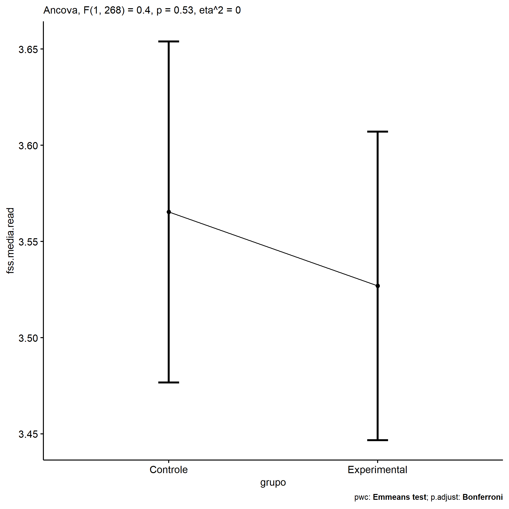<!-- -->

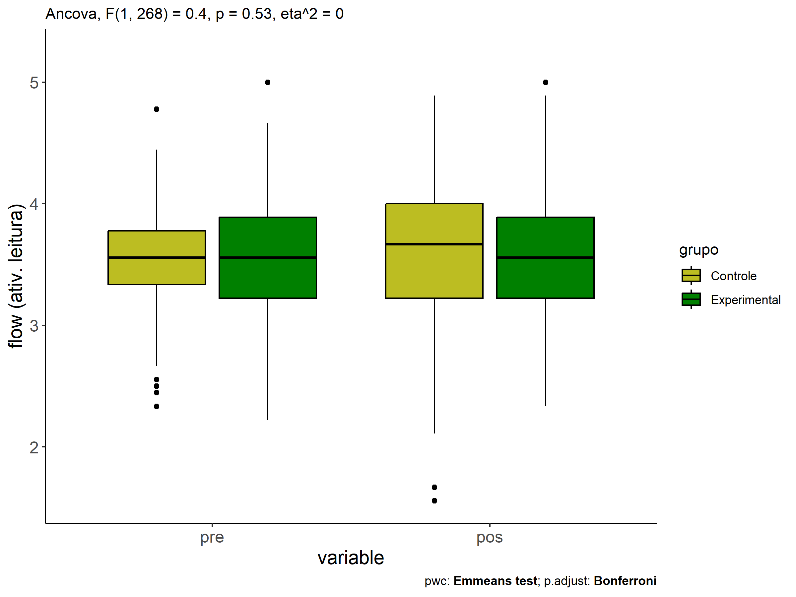<!-- -->

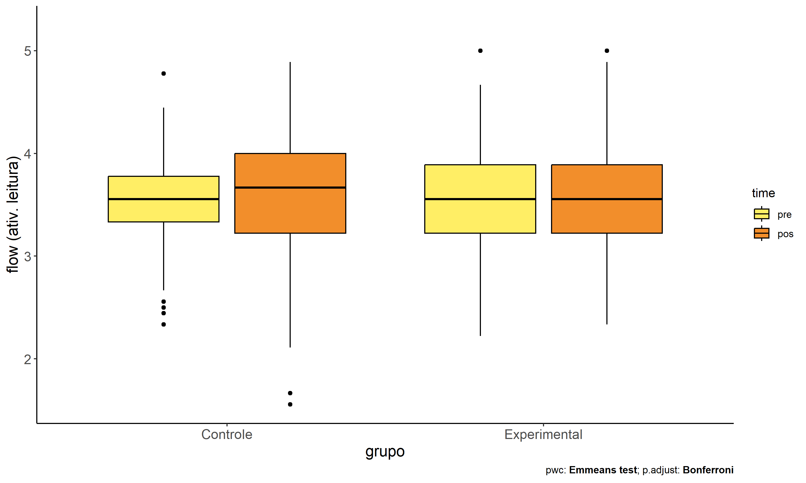<!-- -->

## Pairwise comparisons for two factors

### factores: **grupo:Sexo**

| var            | grupo        | Sexo |   n | M (pre) | SE (pre) | M (unadj) | SE (unadj) | M (adj) | SE (adj) |
|:---------------|:-------------|:-----|----:|--------:|---------:|----------:|-----------:|--------:|---------:|
| fss.media.read | Controle     | F    |  54 |   3.588 |    0.053 |     3.541 |      0.078 |   3.529 |    0.068 |
| fss.media.read | Controle     | M    |  68 |   3.479 |    0.063 |     3.563 |      0.071 |   3.594 |    0.061 |
| fss.media.read | Experimental | F    |  74 |   3.605 |    0.045 |     3.552 |      0.056 |   3.534 |    0.058 |
| fss.media.read | Experimental | M    |  75 |   3.561 |    0.057 |     3.521 |      0.055 |   3.520 |    0.058 |

| .y.            | grupo        | Sexo | group1   | group2       | estimate | conf.low | conf.high |    se | statistic |     p | p.adj | p.adj.signif |
|:---------------|:-------------|:-----|:---------|:-------------|---------:|---------:|----------:|------:|----------:|------:|------:|:-------------|
| fss.media.read |              | F    | Controle | Experimental |   -0.005 |   -0.180 |     0.171 | 0.089 |    -0.055 | 0.956 | 0.956 | ns           |
| fss.media.read |              | M    | Controle | Experimental |    0.075 |   -0.090 |     0.239 | 0.084 |     0.892 | 0.373 | 0.373 | ns           |
| dfs.media.read |              | F    | Controle | Experimental |   -0.016 |   -0.177 |     0.145 | 0.082 |    -0.199 | 0.842 | 0.842 | ns           |
| dfs.media.read |              | M    | Controle | Experimental |   -0.083 |   -0.233 |     0.068 | 0.076 |    -1.080 | 0.281 | 0.281 | ns           |
| fss.media.read | Controle     |      | F        | M            |   -0.065 |   -0.244 |     0.114 | 0.091 |    -0.716 | 0.475 | 0.475 | ns           |
| fss.media.read | Experimental |      | F        | M            |    0.014 |   -0.146 |     0.175 | 0.082 |     0.175 | 0.861 | 0.861 | ns           |
| dfs.media.read | Controle     |      | F        | M            |    0.110 |   -0.054 |     0.273 | 0.083 |     1.319 | 0.188 | 0.188 | ns           |
| dfs.media.read | Experimental |      | F        | M            |    0.043 |   -0.104 |     0.191 | 0.075 |     0.581 | 0.562 | 0.562 | ns           |

| .y.       | grupo        | Sexo | group1 | group2 | estimate | conf.low | conf.high |    se | statistic |     p | p.adj | p.adj.signif |
|:----------|:-------------|:-----|:-------|:-------|---------:|---------:|----------:|------:|----------:|------:|------:|:-------------|
| flow.read | Controle     | F    | pre    | pos    |    0.047 |   -0.139 |     0.234 | 0.095 |     0.498 | 0.619 | 0.619 | ns           |
| flow.read | Controle     | M    | pre    | pos    |   -0.085 |   -0.251 |     0.082 | 0.085 |    -0.999 | 0.318 | 0.318 | ns           |
| flow.read | Experimental | F    | pre    | pos    |    0.052 |   -0.107 |     0.212 | 0.081 |     0.645 | 0.519 | 0.519 | ns           |
| flow.read | Experimental | M    | pre    | pos    |    0.040 |   -0.118 |     0.199 | 0.081 |     0.499 | 0.618 | 0.618 | ns           |

    ## Scale for colour is already present.
    ## Adding another scale for colour, which will replace the existing scale.

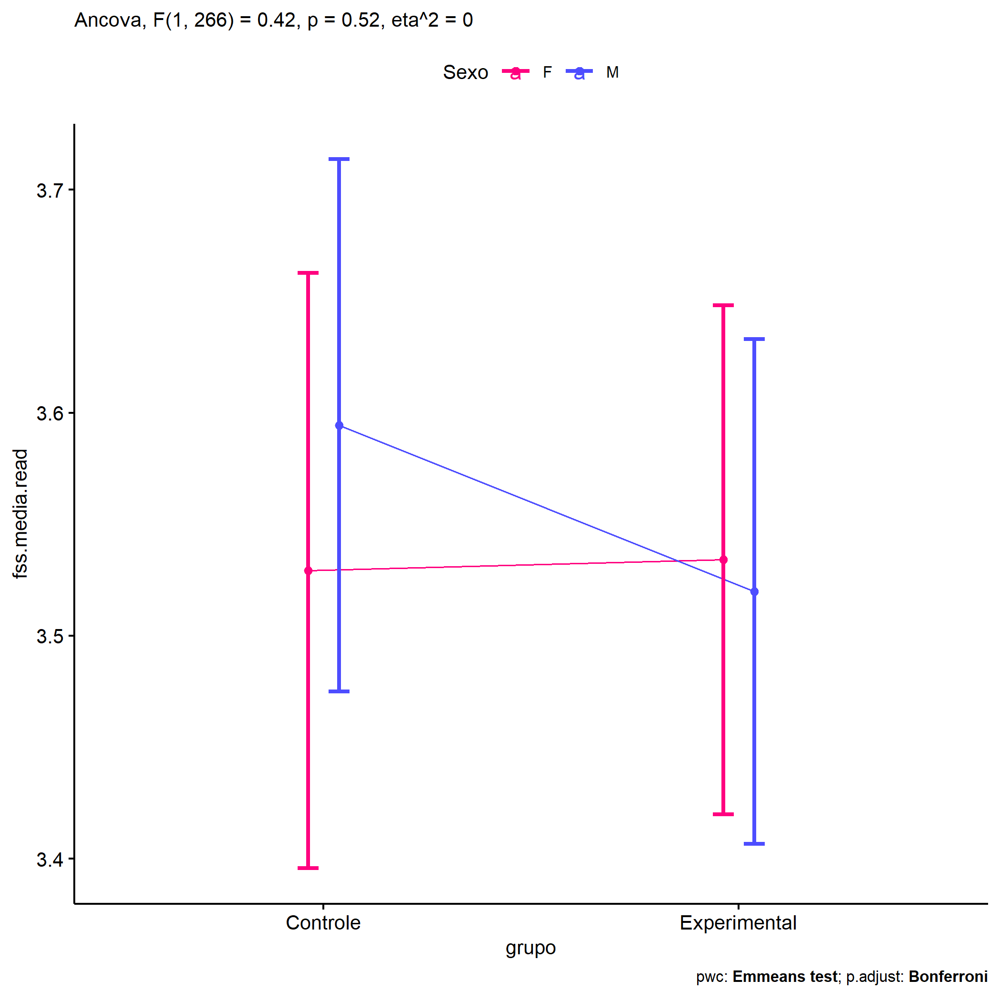<!-- -->

    ## Scale for colour is already present.
    ## Adding another scale for colour, which will replace the existing scale.

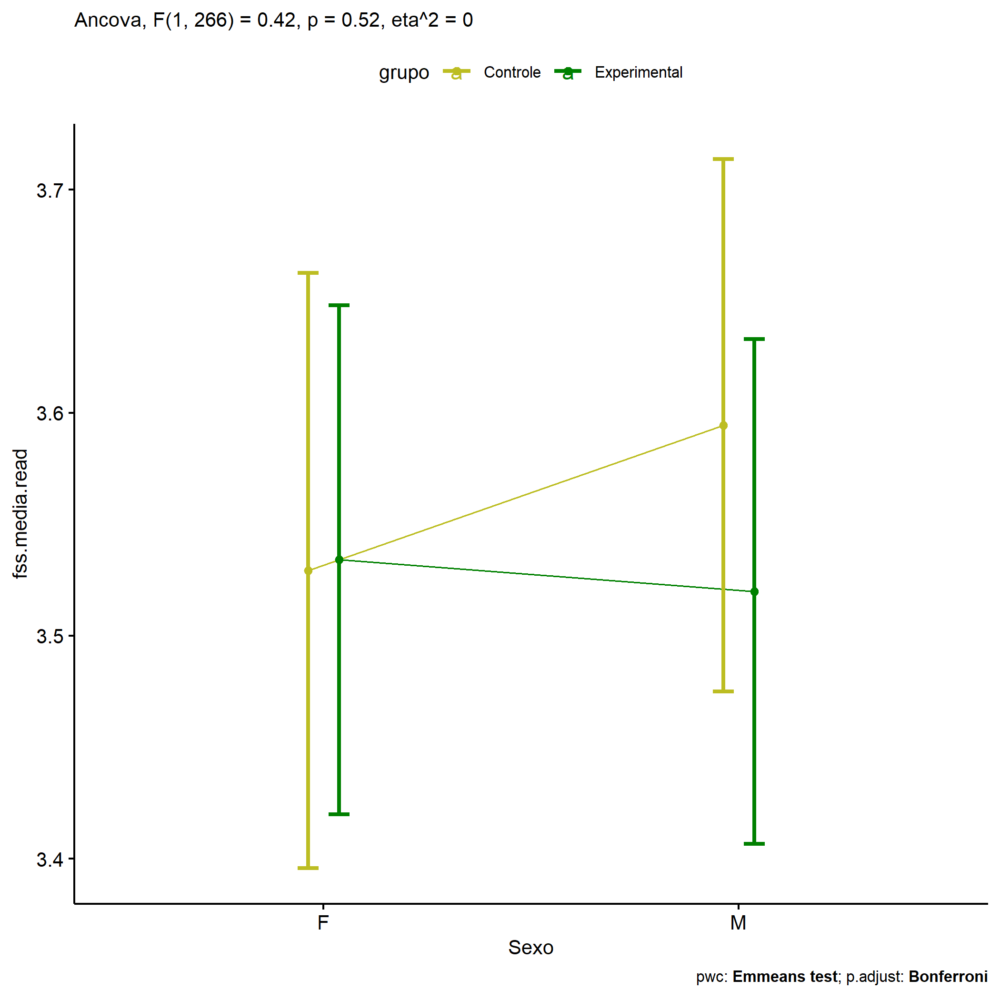<!-- -->

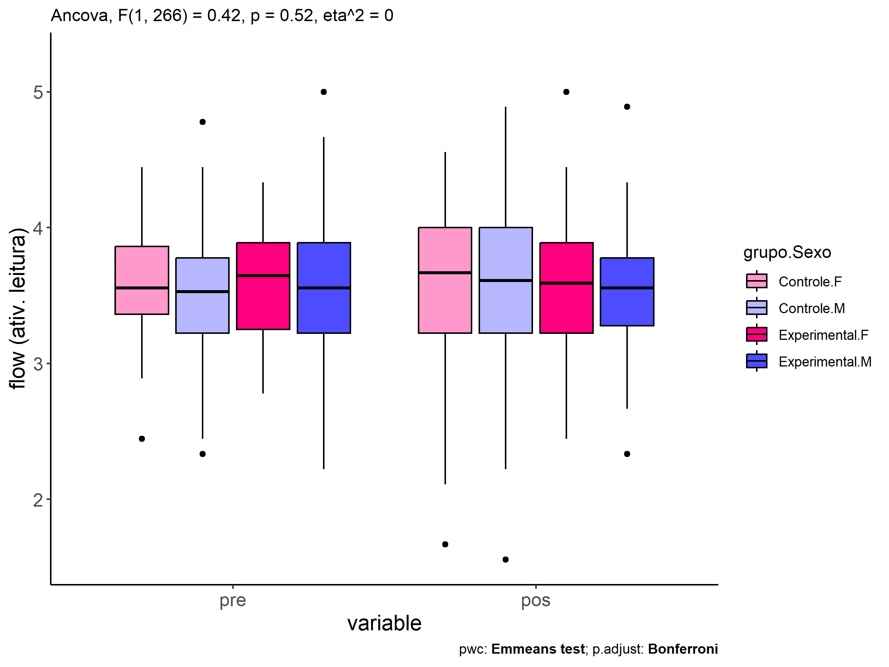<!-- -->

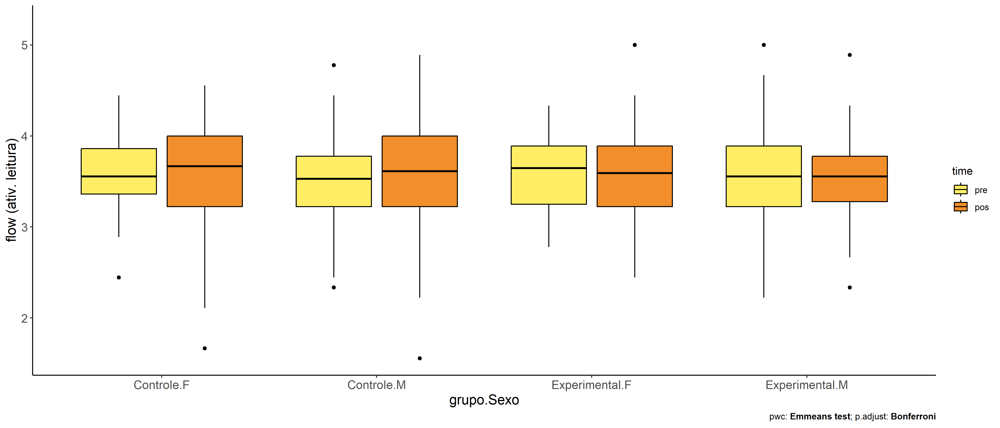<!-- -->

### factores: **grupo:Zona**

| var            | grupo        | Zona   |   n | M (pre) | SE (pre) | M (unadj) | SE (unadj) | M (adj) | SE (adj) |
|:---------------|:-------------|:-------|----:|--------:|---------:|----------:|-----------:|--------:|---------:|
| fss.media.read | Controle     | Rural  |  42 |   3.696 |    0.065 |     3.632 |      0.085 |   3.578 |    0.076 |
| fss.media.read | Controle     | Urbana |  24 |   3.338 |    0.108 |     3.477 |      0.130 |   3.590 |    0.102 |
| fss.media.read | Experimental | Rural  |  34 |   3.625 |    0.072 |     3.476 |      0.073 |   3.456 |    0.084 |
| fss.media.read | Experimental | Urbana |  42 |   3.571 |    0.080 |     3.451 |      0.082 |   3.456 |    0.076 |

| .y.            | grupo        | Zona   | group1   | group2       | estimate | conf.low | conf.high |    se | statistic |     p | p.adj | p.adj.signif |
|:---------------|:-------------|:-------|:---------|:-------------|---------:|---------:|----------:|------:|----------:|------:|------:|:-------------|
| fss.media.read |              | Rural  | Controle | Experimental |    0.123 |   -0.101 |     0.346 | 0.113 |     1.085 | 0.280 | 0.280 | ns           |
| fss.media.read |              | Urbana | Controle | Experimental |    0.134 |   -0.117 |     0.385 | 0.127 |     1.056 | 0.293 | 0.293 | ns           |
| dfs.media.read |              | Rural  | Controle | Experimental |    0.071 |   -0.144 |     0.286 | 0.109 |     0.651 | 0.516 | 0.516 | ns           |
| dfs.media.read |              | Urbana | Controle | Experimental |   -0.233 |   -0.472 |     0.005 | 0.121 |    -1.935 | 0.055 | 0.055 | ns           |
| fss.media.read | Controle     |        | Rural    | Urbana       |   -0.012 |   -0.267 |     0.244 | 0.129 |    -0.092 | 0.927 | 0.927 | ns           |
| fss.media.read | Experimental |        | Rural    | Urbana       |   -0.001 |   -0.224 |     0.223 | 0.113 |    -0.005 | 0.996 | 0.996 | ns           |
| dfs.media.read | Controle     |        | Rural    | Urbana       |    0.358 |    0.119 |     0.596 | 0.121 |     2.966 | 0.004 | 0.004 | \*\*         |
| dfs.media.read | Experimental |        | Rural    | Urbana       |    0.054 |   -0.161 |     0.269 | 0.109 |     0.493 | 0.623 | 0.623 | ns           |

| .y.       | grupo        | Zona   | group1 | group2 | estimate | conf.low | conf.high |    se | statistic |     p | p.adj | p.adj.signif |
|:----------|:-------------|:-------|:-------|:-------|---------:|---------:|----------:|------:|----------:|------:|------:|:-------------|
| flow.read | Controle     | Rural  | pre    | pos    |    0.064 |   -0.152 |     0.281 | 0.110 |     0.583 | 0.560 | 0.560 | ns           |
| flow.read | Controle     | Urbana | pre    | pos    |   -0.139 |   -0.425 |     0.148 | 0.146 |    -0.954 | 0.341 | 0.341 | ns           |
| flow.read | Experimental | Rural  | pre    | pos    |    0.149 |   -0.092 |     0.390 | 0.122 |     1.219 | 0.224 | 0.224 | ns           |
| flow.read | Experimental | Urbana | pre    | pos    |    0.120 |   -0.097 |     0.337 | 0.110 |     1.090 | 0.277 | 0.277 | ns           |

    ## Scale for colour is already present.
    ## Adding another scale for colour, which will replace the existing scale.

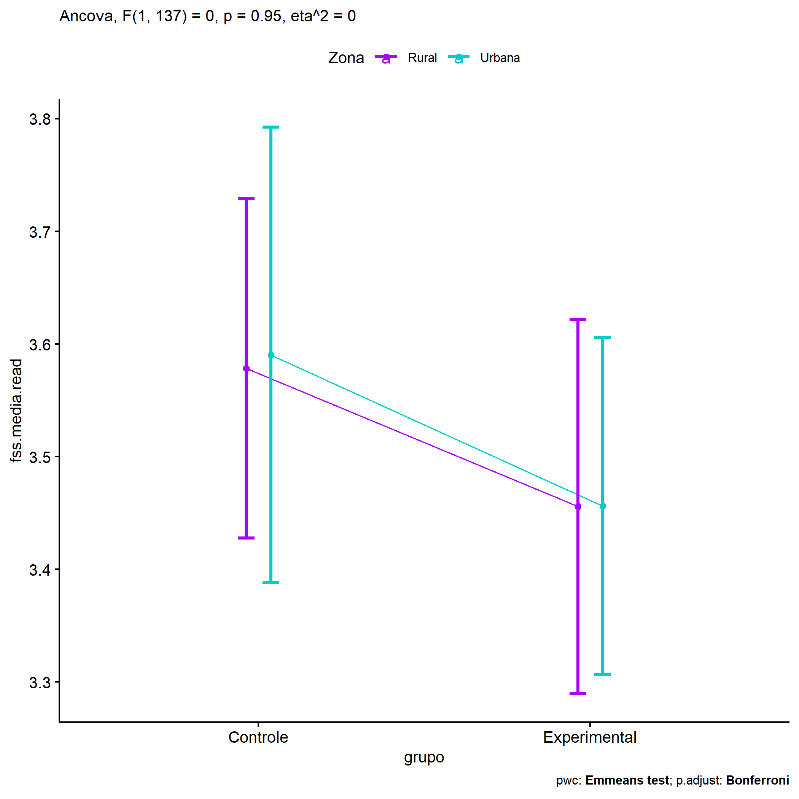<!-- -->

    ## Scale for colour is already present.
    ## Adding another scale for colour, which will replace the existing scale.

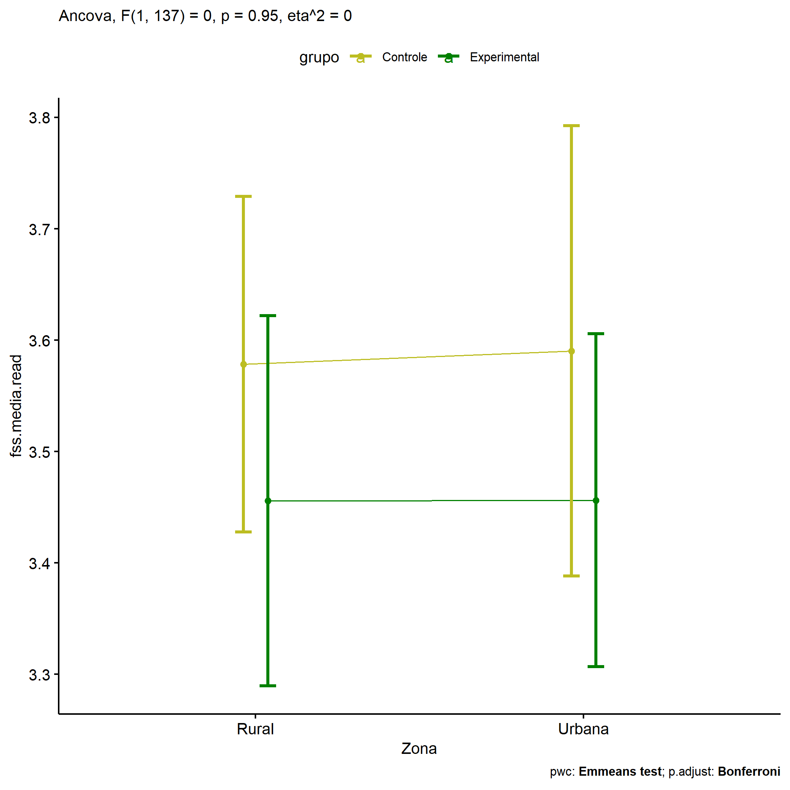<!-- -->

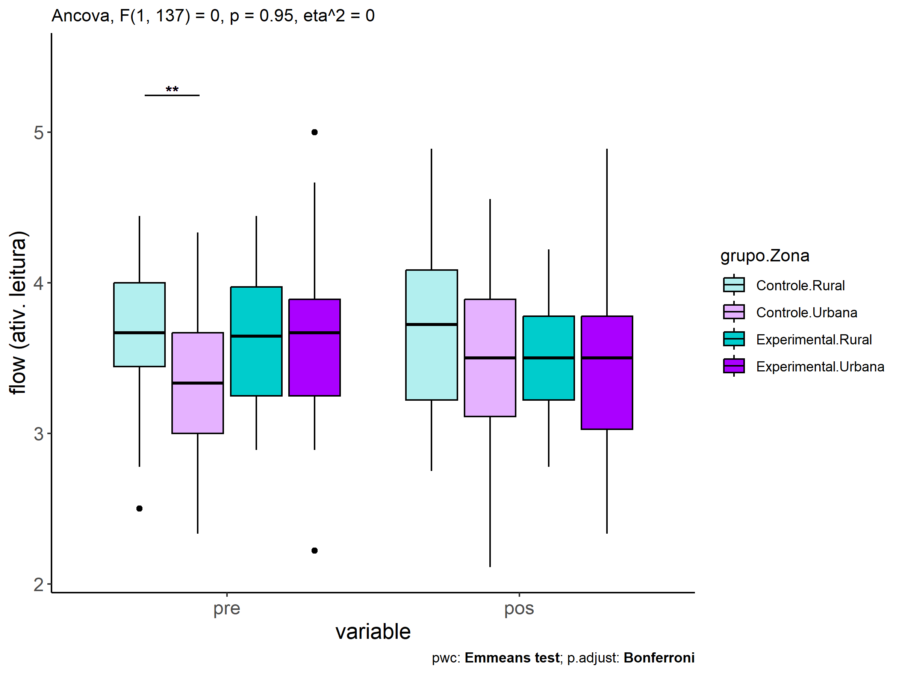<!-- -->

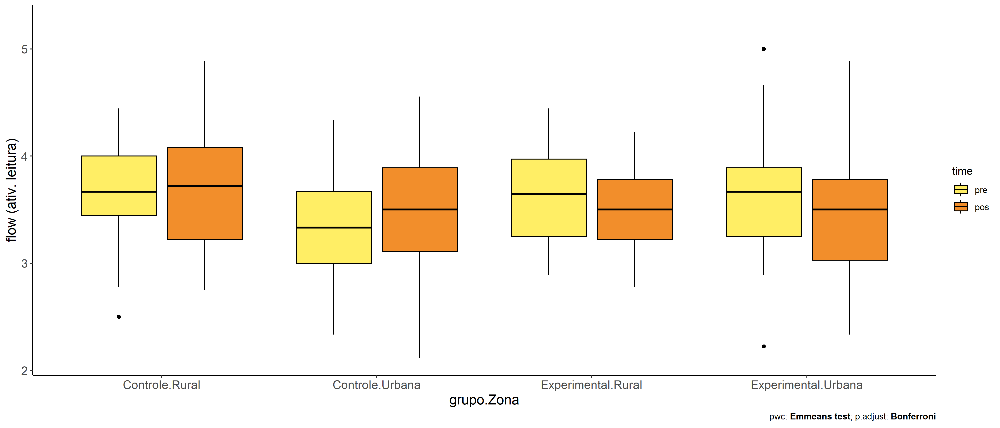<!-- -->

### factores: **grupo:Cor.Raca**

| var            | grupo        | Cor.Raca |   n | M (pre) | SE (pre) | M (unadj) | SE (unadj) | M (adj) | SE (adj) |
|:---------------|:-------------|:---------|----:|--------:|---------:|----------:|-----------:|--------:|---------:|
| fss.media.read | Controle     | Branca   |   7 |   4.071 |    0.180 |     3.762 |      0.278 |   3.549 |    0.164 |
| fss.media.read | Controle     | Parda    |  47 |   3.487 |    0.068 |     3.461 |      0.071 |   3.498 |    0.061 |
| fss.media.read | Experimental | Branca   |  10 |   3.808 |    0.099 |     3.807 |      0.157 |   3.707 |    0.133 |
| fss.media.read | Experimental | Parda    |  40 |   3.531 |    0.072 |     3.526 |      0.054 |   3.544 |    0.066 |

| .y.            | grupo        | Cor.Raca | group1   | group2       | estimate | conf.low | conf.high |    se | statistic |     p | p.adj | p.adj.signif |
|:---------------|:-------------|:---------|:---------|:-------------|---------:|---------:|----------:|------:|----------:|------:|------:|:-------------|
| fss.media.read |              | Branca   | Controle | Experimental |   -0.157 |   -0.568 |     0.253 | 0.207 |    -0.762 | 0.448 | 0.448 | ns           |
| fss.media.read |              | Parda    | Controle | Experimental |   -0.046 |   -0.224 |     0.132 | 0.090 |    -0.515 | 0.608 | 0.608 | ns           |
| dfs.media.read |              | Branca   | Controle | Experimental |    0.263 |   -0.179 |     0.705 | 0.223 |     1.182 | 0.240 | 0.240 | ns           |
| dfs.media.read |              | Parda    | Controle | Experimental |   -0.044 |   -0.237 |     0.149 | 0.097 |    -0.455 | 0.650 | 0.650 | ns           |
| fss.media.read | Controle     |          | Branca   | Parda        |    0.051 |   -0.300 |     0.403 | 0.177 |     0.288 | 0.774 | 0.774 | ns           |
| fss.media.read | Experimental |          | Branca   | Parda        |    0.162 |   -0.134 |     0.459 | 0.149 |     1.086 | 0.280 | 0.280 | ns           |
| dfs.media.read | Controle     |          | Branca   | Parda        |    0.585 |    0.222 |     0.948 | 0.183 |     3.195 | 0.002 | 0.002 | \*\*         |
| dfs.media.read | Experimental |          | Branca   | Parda        |    0.277 |   -0.039 |     0.594 | 0.160 |     1.737 | 0.085 | 0.085 | ns           |

| .y.       | grupo        | Cor.Raca | group1 | group2 | estimate | conf.low | conf.high |    se | statistic |     p | p.adj | p.adj.signif |
|:----------|:-------------|:---------|:-------|:-------|---------:|---------:|----------:|------:|----------:|------:|------:|:-------------|
| flow.read | Controle     | Branca   | pre    | pos    |    0.310 |   -0.169 |     0.789 | 0.243 |     1.274 | 0.204 | 0.204 | ns           |
| flow.read | Controle     | Parda    | pre    | pos    |    0.026 |   -0.159 |     0.211 | 0.094 |     0.274 | 0.784 | 0.784 | ns           |
| flow.read | Experimental | Branca   | pre    | pos    |    0.001 |   -0.399 |     0.402 | 0.203 |     0.007 | 0.995 | 0.995 | ns           |
| flow.read | Experimental | Parda    | pre    | pos    |    0.005 |   -0.196 |     0.205 | 0.102 |     0.048 | 0.962 | 0.962 | ns           |

    ## Scale for colour is already present.
    ## Adding another scale for colour, which will replace the existing scale.

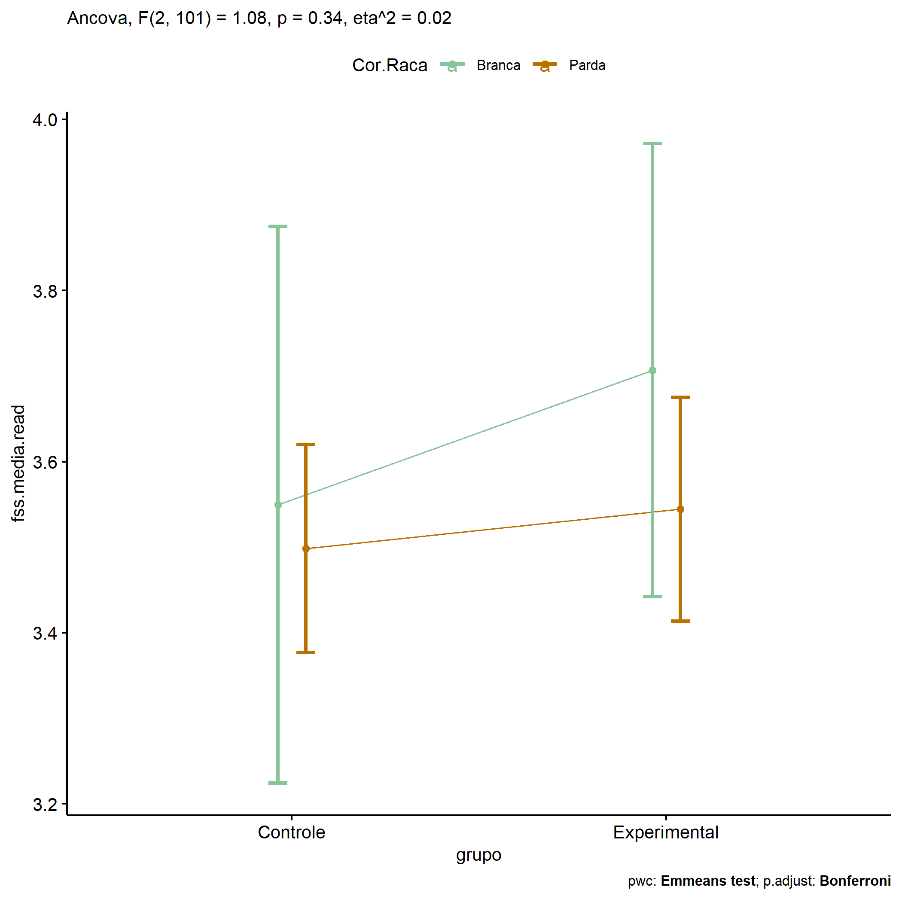<!-- -->

    ## Scale for colour is already present.
    ## Adding another scale for colour, which will replace the existing scale.

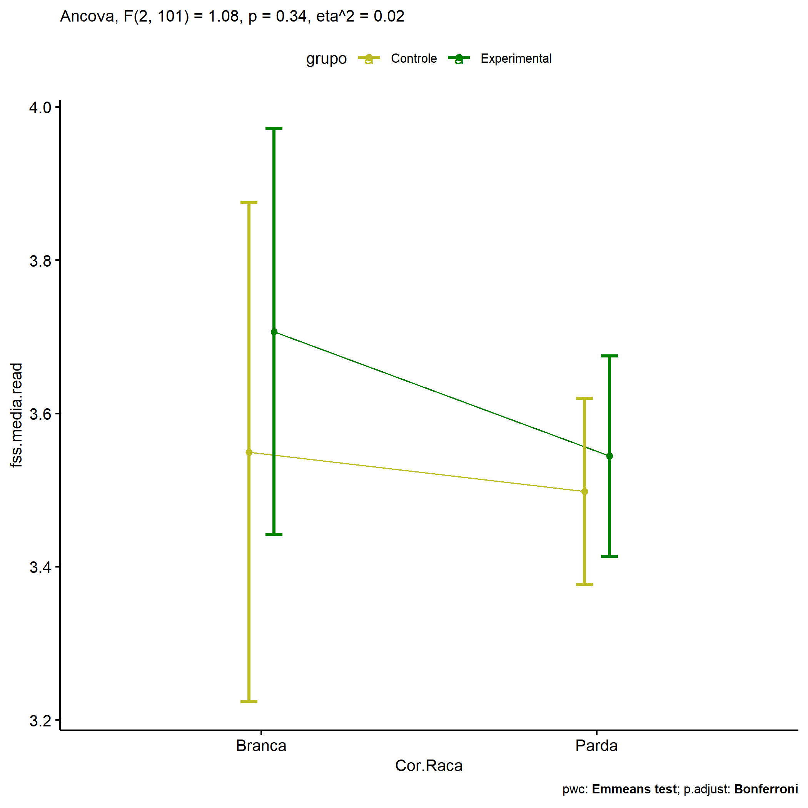<!-- -->

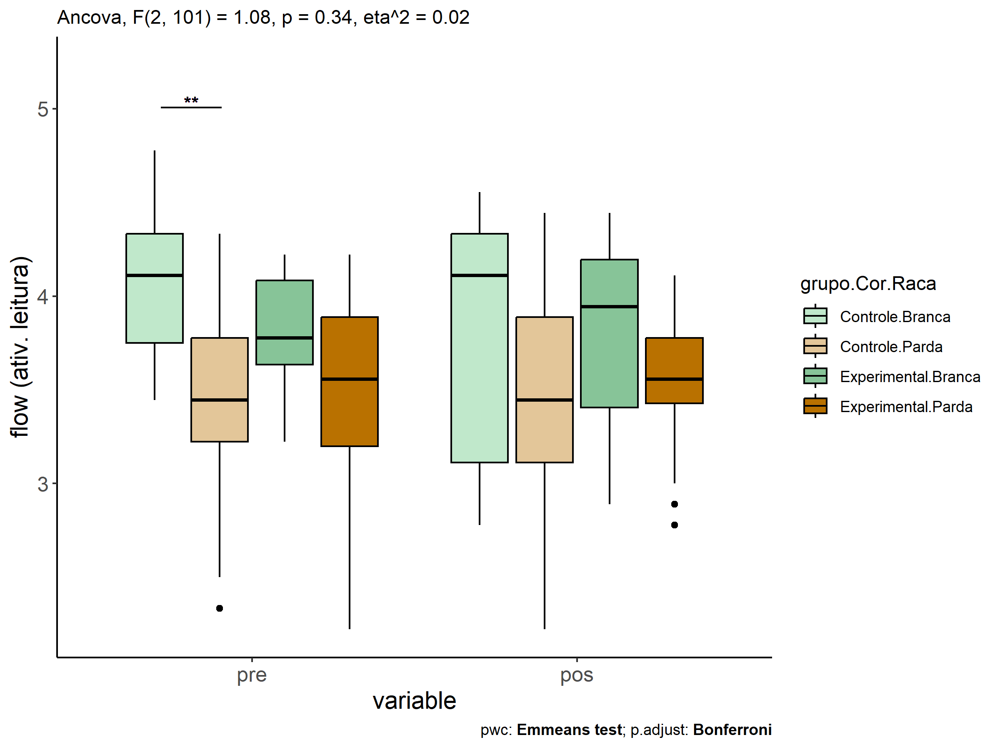<!-- -->

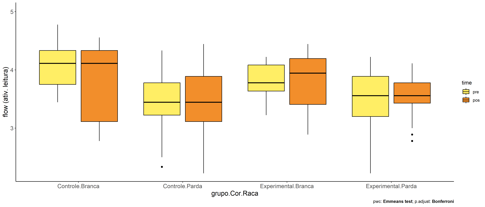<!-- -->
