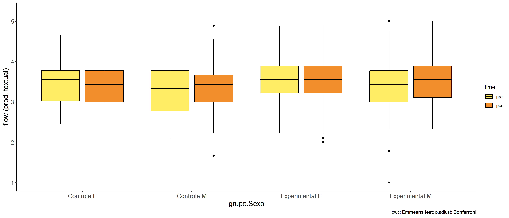

ANCOVA in flow (prod. textual) (flow (prod. textual))
================
Geiser C. Challco <geiser@alumni.usp.br>

- [Descriptive Statistics of Initial
  Data](#descriptive-statistics-of-initial-data)
- [Checking of Assumptions](#checking-of-assumptions)
  - [Assumption: Normality distribution of
    data](#assumption-normality-distribution-of-data)
  - [Assumption: Homogeneity of data
    distribution](#assumption-homogeneity-of-data-distribution)
- [Computation of ANCOVA test and Pairwise
  Comparison](#computation-of-ancova-test-and-pairwise-comparison)
  - [ANCOVA tests for one factor](#ancova-tests-for-one-factor)
  - [ANCOVA tests for two factors](#ancova-tests-for-two-factors)
  - [Pairwise comparisons for one factor:
    **grupo**](#pairwise-comparisons-for-one-factor-grupo)
  - [Pairwise comparisons for two
    factors](#pairwise-comparisons-for-two-factors)
    - [factores: **grupo:Sexo**](#factores-gruposexo)
    - [factores: **grupo:Zona**](#factores-grupozona)
    - [factores: **grupo:Cor.Raca**](#factores-grupocorraca)

**NOTE**

- Teste ANCOVA para determinar se houve diferenças significativas no
  flow (prod. textual) (medido usando pre- e pos-testes).
- ANCOVA test to determine whether there were significant differences in
  flow (prod. textual) (measured using pre- and post-tests).

# Descriptive Statistics of Initial Data

| grupo        | Sexo | Zona   | Cor.Raca | variable       |   n |  mean | median |   min |   max |    sd |    se |    ci |   iqr |
|:-------------|:-----|:-------|:---------|:---------------|----:|------:|-------:|------:|------:|------:|------:|------:|------:|
| Controle     | F    |        |          | dfs.media.text |  70 | 3.481 |  3.556 | 2.444 | 4.667 | 0.549 | 0.066 | 0.131 | 0.750 |
| Controle     | M    |        |          | dfs.media.text |  60 | 3.358 |  3.333 | 2.111 | 4.889 | 0.671 | 0.087 | 0.173 | 1.000 |
| Experimental | F    |        |          | dfs.media.text |  82 | 3.548 |  3.556 | 2.222 | 4.889 | 0.527 | 0.058 | 0.116 | 0.667 |
| Experimental | M    |        |          | dfs.media.text |  93 | 3.440 |  3.444 | 1.000 | 5.000 | 0.662 | 0.069 | 0.136 | 0.778 |
| Controle     | F    |        |          | fss.media.text |  70 | 3.419 |  3.444 | 2.444 | 4.556 | 0.520 | 0.062 | 0.124 | 0.778 |
| Controle     | M    |        |          | fss.media.text |  60 | 3.395 |  3.444 | 1.667 | 4.889 | 0.552 | 0.071 | 0.143 | 0.667 |
| Experimental | F    |        |          | fss.media.text |  82 | 3.517 |  3.556 | 2.000 | 4.889 | 0.591 | 0.065 | 0.130 | 0.667 |
| Experimental | M    |        |          | fss.media.text |  93 | 3.509 |  3.556 | 2.333 | 5.000 | 0.577 | 0.060 | 0.119 | 0.778 |
| Controle     |      | Rural  |          | dfs.media.text |  53 | 3.481 |  3.556 | 2.111 | 4.889 | 0.562 | 0.077 | 0.155 | 0.667 |
| Controle     |      | Urbana |          | dfs.media.text |  58 | 3.365 |  3.333 | 2.111 | 4.778 | 0.636 | 0.084 | 0.167 | 0.972 |
| Controle     |      |        |          | dfs.media.text |  19 | 3.444 |  3.444 | 2.556 | 4.778 | 0.665 | 0.152 | 0.320 | 1.056 |
| Experimental |      | Rural  |          | dfs.media.text |  73 | 3.527 |  3.444 | 1.778 | 5.000 | 0.618 | 0.072 | 0.144 | 0.889 |
| Experimental |      | Urbana |          | dfs.media.text |  76 | 3.464 |  3.556 | 1.000 | 4.889 | 0.601 | 0.069 | 0.137 | 0.667 |
| Experimental |      |        |          | dfs.media.text |  26 | 3.468 |  3.444 | 2.429 | 4.778 | 0.584 | 0.114 | 0.236 | 0.854 |
| Controle     |      | Rural  |          | fss.media.text |  53 | 3.407 |  3.444 | 2.333 | 4.222 | 0.474 | 0.065 | 0.131 | 0.556 |
| Controle     |      | Urbana |          | fss.media.text |  58 | 3.435 |  3.444 | 2.222 | 4.556 | 0.522 | 0.069 | 0.137 | 0.778 |
| Controle     |      |        |          | fss.media.text |  19 | 3.326 |  3.125 | 1.667 | 4.889 | 0.716 | 0.164 | 0.345 | 0.590 |
| Experimental |      | Rural  |          | fss.media.text |  73 | 3.497 |  3.556 | 2.000 | 5.000 | 0.538 | 0.063 | 0.126 | 0.778 |
| Experimental |      | Urbana |          | fss.media.text |  76 | 3.544 |  3.556 | 2.222 | 5.000 | 0.610 | 0.070 | 0.139 | 0.583 |
| Experimental |      |        |          | fss.media.text |  26 | 3.464 |  3.556 | 2.111 | 4.556 | 0.630 | 0.124 | 0.254 | 0.743 |
| Controle     |      |        | Branca   | dfs.media.text |  17 | 3.582 |  3.778 | 2.111 | 4.444 | 0.727 | 0.176 | 0.374 | 1.000 |
| Controle     |      |        | Indígena | dfs.media.text |   4 | 3.833 |  3.722 | 3.556 | 4.333 | 0.345 | 0.173 | 0.550 | 0.278 |
| Controle     |      |        | Parda    | dfs.media.text |  39 | 3.346 |  3.333 | 2.333 | 4.667 | 0.590 | 0.094 | 0.191 | 0.667 |
| Controle     |      |        |          | dfs.media.text |  70 | 3.406 |  3.389 | 2.111 | 4.889 | 0.596 | 0.071 | 0.142 | 0.861 |
| Experimental |      |        | Branca   | dfs.media.text |  11 | 3.263 |  3.444 | 1.000 | 4.222 | 0.878 | 0.265 | 0.590 | 0.889 |
| Experimental |      |        | Parda    | dfs.media.text |  45 | 3.501 |  3.333 | 1.778 | 5.000 | 0.668 | 0.100 | 0.201 | 0.889 |
| Experimental |      |        |          | dfs.media.text | 119 | 3.508 |  3.556 | 2.222 | 4.889 | 0.547 | 0.050 | 0.099 | 0.667 |
| Controle     |      |        | Branca   | fss.media.text |  17 | 3.379 |  3.333 | 2.778 | 4.222 | 0.425 | 0.103 | 0.219 | 0.556 |
| Controle     |      |        | Indígena | fss.media.text |   4 | 3.500 |  3.556 | 2.889 | 4.000 | 0.493 | 0.246 | 0.784 | 0.611 |
| Controle     |      |        | Parda    | fss.media.text |  39 | 3.389 |  3.444 | 2.333 | 4.556 | 0.545 | 0.087 | 0.177 | 0.778 |
| Controle     |      |        |          | fss.media.text |  70 | 3.420 |  3.444 | 1.667 | 4.889 | 0.560 | 0.067 | 0.134 | 0.778 |
| Experimental |      |        | Branca   | fss.media.text |  11 | 3.619 |  3.667 | 2.333 | 4.667 | 0.653 | 0.197 | 0.438 | 0.708 |
| Experimental |      |        | Parda    | fss.media.text |  45 | 3.412 |  3.333 | 2.333 | 5.000 | 0.526 | 0.078 | 0.158 | 0.556 |
| Experimental |      |        |          | fss.media.text | 119 | 3.541 |  3.556 | 2.000 | 5.000 | 0.595 | 0.055 | 0.108 | 0.715 |

# Checking of Assumptions

## Assumption: Normality distribution of data

| var            |   n |   skewness |   kurtosis | symmetry | statistic | method     |         p | p.signif | normality |
|:---------------|----:|-----------:|-----------:|:---------|----------:|:-----------|----------:|:---------|:----------|
| fss.media.text | 305 | -0.0697035 |  0.7333913 | YES      |  5.482941 | D’Agostino | 0.0644755 | ns       | \-        |
| fss.media.text | 260 |  0.1835010 |  0.3988485 | YES      |  3.584712 | D’Agostino | 0.1665673 | ns       | \-        |
| fss.media.text | 116 |  0.2560761 | -0.0795281 | YES      |  1.468351 | D’Agostino | 0.4799009 | ns       | QQ        |

## Assumption: Homogeneity of data distribution

| var            | method         | formula                    |   n | DFn.df1 | DFd.df2 | statistic |         p | p.signif |
|:---------------|:---------------|:---------------------------|----:|--------:|--------:|----------:|----------:|:---------|
| fss.media.text | Levene’s test  | `.res`~`grupo`\*`Sexo`     | 305 |       3 |     301 | 0.9830560 | 0.4010194 | ns       |
| fss.media.text | Anova’s slopes | `.res`~`grupo`\*`Sexo`     | 305 |       3 |     297 | 0.4040000 | 0.7500000 | ns       |
| fss.media.text | Levene’s test  | `.res`~`grupo`\*`Zona`     | 260 |       3 |     256 | 0.9929829 | 0.3966602 | ns       |
| fss.media.text | Anova’s slopes | `.res`~`grupo`\*`Zona`     | 260 |       3 |     252 | 0.3760000 | 0.7710000 | ns       |
| fss.media.text | Levene’s test  | `.res`~`grupo`\*`Cor.Raca` | 116 |       4 |     111 | 0.9925759 | 0.4147599 | ns       |
| fss.media.text | Anova’s slopes | `.res`~`grupo`\*`Cor.Raca` | 116 |       4 |     106 | 1.2990000 | 0.2750000 | ns       |

# Computation of ANCOVA test and Pairwise Comparison

## ANCOVA tests for one factor

|     | Effect         | DFn | DFd |    SSn |    SSd |      F | p       |   ges | p\<.05 |
|:----|:---------------|----:|----:|-------:|-------:|-------:|:--------|------:|:-------|
| 1   | dfs.media.text |   1 | 302 | 17.004 | 78.469 | 65.441 | \<0.001 | 0.178 | \*     |
| 2   | grupo          |   1 | 302 |  0.462 | 78.469 |  1.778 | 0.183   | 0.006 |        |
| 4   | Sexo           |   1 | 302 |  0.099 | 78.832 |  0.378 | 0.539   | 0.001 |        |
| 6   | Zona           |   1 | 257 |  0.355 | 59.550 |  1.533 | 0.217   | 0.006 |        |
| 8   | Cor.Raca       |   2 | 112 |  0.112 | 21.434 |  0.292 | 0.748   | 0.005 |        |

## ANCOVA tests for two factors

|     | Effect         | DFn | DFd |    SSn |    SSd |      F | p       |   ges | p\<.05 |
|:----|:---------------|----:|----:|-------:|-------:|-------:|:--------|------:|:-------|
| 1   | dfs.media.text |   1 | 300 | 17.055 | 78.397 | 65.263 | \<0.001 | 0.179 | \*     |
| 4   | grupo:Sexo     |   1 | 300 |  0.002 | 78.397 |  0.008 | 0.929   | 0.000 |        |
| 8   | grupo:Zona     |   1 | 255 |  0.000 | 59.247 |  0.001 | 0.982   | 0.000 |        |
| 12  | grupo:Cor.Raca |   1 | 110 |  0.960 | 20.384 |  5.182 | 0.025   | 0.045 | \*     |

## Pairwise comparisons for one factor: **grupo**

| var            | grupo        |   n | M (pre) | SE (pre) | M (unadj) | SE (unadj) | M (adj) | SE (adj) |
|:---------------|:-------------|----:|--------:|---------:|----------:|-----------:|--------:|---------:|
| fss.media.text | Controle     | 130 |   3.424 |    0.053 |     3.408 |      0.047 |   3.423 |    0.045 |
| fss.media.text | Experimental | 175 |   3.491 |    0.046 |     3.513 |      0.044 |   3.502 |    0.039 |

| .y.            | group1   | group2       | estimate | conf.low | conf.high |    se | statistic |     p | p.adj | p.adj.signif |
|:---------------|:---------|:-------------|---------:|---------:|----------:|------:|----------:|------:|------:|:-------------|
| fss.media.text | Controle | Experimental |   -0.079 |   -0.195 |     0.038 | 0.059 |    -1.333 | 0.183 | 0.183 | ns           |
| dfs.media.text | Controle | Experimental |   -0.067 |   -0.205 |     0.071 | 0.070 |    -0.950 | 0.343 | 0.343 | ns           |

| .y.       | grupo        | group1 | group2 | estimate | conf.low | conf.high |    se | statistic |     p | p.adj | p.adj.signif |
|:----------|:-------------|:-------|:-------|---------:|---------:|----------:|------:|----------:|------:|------:|:-------------|
| flow.text | Controle     | pre    | pos    |    0.016 |   -0.126 |     0.159 | 0.072 |     0.226 | 0.821 | 0.821 | ns           |
| flow.text | Experimental | pre    | pos    |   -0.022 |   -0.144 |     0.101 | 0.062 |    -0.350 | 0.726 | 0.726 | ns           |

    ## Scale for colour is already present.
    ## Adding another scale for colour, which will replace the existing scale.

<!-- -->

<!-- -->

<!-- -->

## Pairwise comparisons for two factors

### factores: **grupo:Sexo**

| var            | grupo        | Sexo |   n | M (pre) | SE (pre) | M (unadj) | SE (unadj) | M (adj) | SE (adj) |
|:---------------|:-------------|:-----|----:|--------:|---------:|----------:|-----------:|--------:|---------:|
| fss.media.text | Controle     | F    |  70 |   3.481 |    0.066 |     3.419 |      0.062 |   3.412 |    0.061 |
| fss.media.text | Controle     | M    |  60 |   3.358 |    0.087 |     3.395 |      0.071 |   3.436 |    0.066 |
| fss.media.text | Experimental | F    |  82 |   3.548 |    0.058 |     3.517 |      0.065 |   3.483 |    0.057 |
| fss.media.text | Experimental | M    |  93 |   3.440 |    0.069 |     3.509 |      0.060 |   3.518 |    0.053 |

| .y.            | grupo        | Sexo | group1   | group2       | estimate | conf.low | conf.high |    se | statistic |     p | p.adj | p.adj.signif |
|:---------------|:-------------|:-----|:---------|:-------------|---------:|---------:|----------:|------:|----------:|------:|------:|:-------------|
| fss.media.text |              | F    | Controle | Experimental |   -0.071 |   -0.235 |     0.093 | 0.083 |    -0.856 | 0.392 | 0.392 | ns           |
| fss.media.text |              | M    | Controle | Experimental |   -0.082 |   -0.249 |     0.085 | 0.085 |    -0.967 | 0.334 | 0.334 | ns           |
| dfs.media.text |              | F    | Controle | Experimental |   -0.067 |   -0.261 |     0.126 | 0.098 |    -0.684 | 0.494 | 0.494 | ns           |
| dfs.media.text |              | M    | Controle | Experimental |   -0.082 |   -0.279 |     0.115 | 0.100 |    -0.820 | 0.413 | 0.413 | ns           |
| fss.media.text | Controle     |      | F        | M            |   -0.024 |   -0.202 |     0.153 | 0.090 |    -0.271 | 0.787 | 0.787 | ns           |
| fss.media.text | Experimental |      | F        | M            |   -0.035 |   -0.188 |     0.118 | 0.078 |    -0.451 | 0.652 | 0.652 | ns           |
| dfs.media.text | Controle     |      | F        | M            |    0.123 |   -0.087 |     0.332 | 0.106 |     1.153 | 0.250 | 0.250 | ns           |
| dfs.media.text | Experimental |      | F        | M            |    0.108 |   -0.072 |     0.288 | 0.092 |     1.177 | 0.240 | 0.240 | ns           |

| .y.       | grupo        | Sexo | group1 | group2 | estimate | conf.low | conf.high |    se | statistic |     p | p.adj | p.adj.signif |
|:----------|:-------------|:-----|:-------|:-------|---------:|---------:|----------:|------:|----------:|------:|------:|:-------------|
| flow.text | Controle     | F    | pre    | pos    |    0.062 |   -0.132 |     0.256 | 0.099 |     0.627 | 0.531 | 0.531 | ns           |
| flow.text | Controle     | M    | pre    | pos    |   -0.037 |   -0.246 |     0.173 | 0.107 |    -0.345 | 0.730 | 0.730 | ns           |
| flow.text | Experimental | F    | pre    | pos    |    0.032 |   -0.148 |     0.211 | 0.091 |     0.345 | 0.730 | 0.730 | ns           |
| flow.text | Experimental | M    | pre    | pos    |   -0.069 |   -0.237 |     0.099 | 0.086 |    -0.804 | 0.422 | 0.422 | ns           |

    ## Scale for colour is already present.
    ## Adding another scale for colour, which will replace the existing scale.

<!-- -->

    ## Scale for colour is already present.
    ## Adding another scale for colour, which will replace the existing scale.

<!-- -->

<!-- -->

<!-- -->

### factores: **grupo:Zona**

| var            | grupo        | Zona   |   n | M (pre) | SE (pre) | M (unadj) | SE (unadj) | M (adj) | SE (adj) |
|:---------------|:-------------|:-------|----:|--------:|---------:|----------:|-----------:|--------:|---------:|
| fss.media.text | Controle     | Rural  |  53 |   3.481 |    0.077 |     3.407 |      0.065 |   3.400 |    0.066 |
| fss.media.text | Controle     | Urbana |  58 |   3.365 |    0.084 |     3.435 |      0.069 |   3.476 |    0.063 |
| fss.media.text | Experimental | Rural  |  73 |   3.527 |    0.072 |     3.497 |      0.063 |   3.470 |    0.057 |
| fss.media.text | Experimental | Urbana |  76 |   3.464 |    0.069 |     3.544 |      0.070 |   3.544 |    0.055 |

| .y.            | grupo        | Zona   | group1   | group2       | estimate | conf.low | conf.high |    se | statistic |     p | p.adj | p.adj.signif |
|:---------------|:-------------|:-------|:---------|:-------------|---------:|---------:|----------:|------:|----------:|------:|------:|:-------------|
| fss.media.text |              | Rural  | Controle | Experimental |   -0.070 |   -0.242 |     0.101 | 0.087 |    -0.810 | 0.419 | 0.419 | ns           |
| fss.media.text |              | Urbana | Controle | Experimental |   -0.068 |   -0.234 |     0.098 | 0.084 |    -0.805 | 0.422 | 0.422 | ns           |
| dfs.media.text |              | Rural  | Controle | Experimental |   -0.046 |   -0.261 |     0.170 | 0.109 |    -0.418 | 0.677 | 0.677 | ns           |
| dfs.media.text |              | Urbana | Controle | Experimental |   -0.098 |   -0.307 |     0.110 | 0.106 |    -0.931 | 0.353 | 0.353 | ns           |
| fss.media.text | Controle     |        | Rural    | Urbana       |   -0.076 |   -0.257 |     0.104 | 0.092 |    -0.831 | 0.407 | 0.407 | ns           |
| fss.media.text | Experimental |        | Rural    | Urbana       |   -0.074 |   -0.229 |     0.082 | 0.079 |    -0.930 | 0.353 | 0.353 | ns           |
| dfs.media.text | Controle     |        | Rural    | Urbana       |    0.116 |   -0.111 |     0.343 | 0.115 |     1.004 | 0.316 | 0.316 | ns           |
| dfs.media.text | Experimental |        | Rural    | Urbana       |    0.063 |   -0.133 |     0.259 | 0.099 |     0.634 | 0.527 | 0.527 | ns           |

| .y.       | grupo        | Zona   | group1 | group2 | estimate | conf.low | conf.high |    se | statistic |     p | p.adj | p.adj.signif |
|:----------|:-------------|:-------|:-------|:-------|---------:|---------:|----------:|------:|----------:|------:|------:|:-------------|
| flow.text | Controle     | Rural  | pre    | pos    |    0.074 |   -0.146 |     0.294 | 0.112 |     0.658 | 0.511 | 0.511 | ns           |
| flow.text | Controle     | Urbana | pre    | pos    |   -0.069 |   -0.280 |     0.141 | 0.107 |    -0.649 | 0.517 | 0.517 | ns           |
| flow.text | Experimental | Rural  | pre    | pos    |    0.030 |   -0.158 |     0.217 | 0.095 |     0.311 | 0.756 | 0.756 | ns           |
| flow.text | Experimental | Urbana | pre    | pos    |   -0.080 |   -0.264 |     0.103 | 0.094 |    -0.859 | 0.391 | 0.391 | ns           |

    ## Scale for colour is already present.
    ## Adding another scale for colour, which will replace the existing scale.

<!-- -->

    ## Scale for colour is already present.
    ## Adding another scale for colour, which will replace the existing scale.

<!-- -->

<!-- -->

<!-- -->

### factores: **grupo:Cor.Raca**

| var            | grupo        | Cor.Raca |   n | M (pre) | SE (pre) | M (unadj) | SE (unadj) | M (adj) | SE (adj) |
|:---------------|:-------------|:---------|----:|--------:|---------:|----------:|-----------:|--------:|---------:|
| fss.media.text | Controle     | Branca   |  17 |   3.582 |    0.176 |     3.379 |      0.103 |   3.309 |    0.103 |
| fss.media.text | Controle     | Parda    |  39 |   3.346 |    0.094 |     3.389 |      0.087 |   3.433 |    0.068 |
| fss.media.text | Experimental | Branca   |  11 |   3.263 |    0.265 |     3.619 |      0.197 |   3.702 |    0.128 |
| fss.media.text | Experimental | Parda    |  45 |   3.501 |    0.100 |     3.412 |      0.078 |   3.381 |    0.063 |

| .y.            | grupo        | Cor.Raca | group1   | group2       | estimate | conf.low | conf.high |    se | statistic |     p | p.adj | p.adj.signif |
|:---------------|:-------------|:---------|:---------|:-------------|---------:|---------:|----------:|------:|----------:|------:|------:|:-------------|
| fss.media.text |              | Branca   | Controle | Experimental |   -0.393 |   -0.721 |    -0.066 | 0.165 |    -2.382 | 0.019 | 0.019 | \*           |
| fss.media.text |              | Parda    | Controle | Experimental |    0.052 |   -0.133 |     0.237 | 0.093 |     0.560 | 0.576 | 0.576 | ns           |
| dfs.media.text |              | Branca   | Controle | Experimental |    0.319 |   -0.198 |     0.836 | 0.261 |     1.224 | 0.224 | 0.224 | ns           |
| dfs.media.text |              | Parda    | Controle | Experimental |   -0.155 |   -0.447 |     0.137 | 0.147 |    -1.052 | 0.295 | 0.295 | ns           |
| fss.media.text | Controle     |          | Branca   | Parda        |   -0.124 |   -0.370 |     0.122 | 0.124 |    -0.999 | 0.320 | 0.320 | ns           |
| fss.media.text | Experimental |          | Branca   | Parda        |    0.322 |    0.038 |     0.606 | 0.143 |     2.244 | 0.027 | 0.027 | \*           |
| dfs.media.text | Controle     |          | Branca   | Parda        |    0.236 |   -0.153 |     0.624 | 0.196 |     1.203 | 0.232 | 0.232 | ns           |
| dfs.media.text | Experimental |          | Branca   | Parda        |   -0.239 |   -0.688 |     0.211 | 0.227 |    -1.053 | 0.295 | 0.295 | ns           |

| .y.       | grupo        | Cor.Raca | group1 | group2 | estimate | conf.low | conf.high |    se | statistic |     p | p.adj | p.adj.signif |
|:----------|:-------------|:---------|:-------|:-------|---------:|---------:|----------:|------:|----------:|------:|------:|:-------------|
| flow.text | Controle     | Branca   | pre    | pos    |    0.203 |   -0.208 |     0.613 | 0.208 |     0.973 | 0.332 | 0.332 | ns           |
| flow.text | Controle     | Parda    | pre    | pos    |   -0.043 |   -0.314 |     0.228 | 0.138 |    -0.315 | 0.753 | 0.753 | ns           |
| flow.text | Experimental | Branca   | pre    | pos    |   -0.356 |   -0.866 |     0.154 | 0.259 |    -1.375 | 0.171 | 0.171 | ns           |
| flow.text | Experimental | Parda    | pre    | pos    |    0.089 |   -0.163 |     0.342 | 0.128 |     0.697 | 0.487 | 0.487 | ns           |

    ## Scale for colour is already present.
    ## Adding another scale for colour, which will replace the existing scale.

<!-- -->

    ## Scale for colour is already present.
    ## Adding another scale for colour, which will replace the existing scale.

<!-- -->

<!-- -->

<!-- -->
