ANCOVA in flow (prod. textual) (flow (prod. textual))
================
Geiser C. Challco <geiser@alumni.usp.br>

- [Descriptive Statistics of Initial
  Data](#descriptive-statistics-of-initial-data)
- [Checking of Assumptions](#checking-of-assumptions)
  - [Assumption: Normality distribution of
    data](#assumption-normality-distribution-of-data)
  - [Assumption: Homogeneity of data
    distribution](#assumption-homogeneity-of-data-distribution)
- [Computation of ANCOVA test and Pairwise
  Comparison](#computation-of-ancova-test-and-pairwise-comparison)
  - [ANCOVA tests for one factor](#ancova-tests-for-one-factor)
  - [ANCOVA tests for two factors](#ancova-tests-for-two-factors)
  - [Pairwise comparisons for one factor:
    **grupo**](#pairwise-comparisons-for-one-factor-grupo)
  - [Pairwise comparisons for two
    factors](#pairwise-comparisons-for-two-factors)
    - [factores: **grupo:Sexo**](#factores-gruposexo)
    - [factores: **grupo:Zona**](#factores-grupozona)
    - [factores: **grupo:Cor.Raca**](#factores-grupocorraca)

**NOTE**

- Teste ANCOVA para determinar se houve diferenças significativas no
  flow (prod. textual) (medido usando pre- e pos-testes).
- ANCOVA test to determine whether there were significant differences in
  flow (prod. textual) (measured using pre- and post-tests).

# Descriptive Statistics of Initial Data

| grupo        | Sexo | Zona   | Cor.Raca | variable       |   n |  mean | median |   min |   max |    sd |    se |    ci |   iqr |
|:-------------|:-----|:-------|:---------|:---------------|----:|------:|-------:|------:|------:|------:|------:|------:|------:|
| Controle     | F    |        |          | dfs.media.text | 226 | 3.563 |  3.556 | 1.889 | 4.778 | 0.548 | 0.036 | 0.072 | 0.667 |
| Controle     | M    |        |          | dfs.media.text | 229 | 3.418 |  3.444 | 1.111 | 5.000 | 0.631 | 0.042 | 0.082 | 0.778 |
| Experimental | F    |        |          | dfs.media.text | 335 | 3.505 |  3.444 | 2.222 | 5.000 | 0.520 | 0.028 | 0.056 | 0.771 |
| Experimental | M    |        |          | dfs.media.text | 314 | 3.434 |  3.444 | 1.000 | 5.000 | 0.606 | 0.034 | 0.067 | 0.667 |
| Controle     | F    |        |          | fss.media.text | 226 | 3.519 |  3.556 | 2.111 | 5.000 | 0.579 | 0.039 | 0.076 | 0.778 |
| Controle     | M    |        |          | fss.media.text | 229 | 3.416 |  3.444 | 1.000 | 5.000 | 0.608 | 0.040 | 0.079 | 0.889 |
| Experimental | F    |        |          | fss.media.text | 335 | 3.488 |  3.444 | 1.778 | 5.000 | 0.575 | 0.031 | 0.062 | 0.726 |
| Experimental | M    |        |          | fss.media.text | 314 | 3.481 |  3.472 | 1.667 | 5.000 | 0.562 | 0.032 | 0.062 | 0.740 |
| Controle     |      | Rural  |          | dfs.media.text | 217 | 3.557 |  3.556 | 2.111 | 4.889 | 0.568 | 0.039 | 0.076 | 0.778 |
| Controle     |      | Urbana |          | dfs.media.text | 116 | 3.376 |  3.444 | 1.111 | 5.000 | 0.660 | 0.061 | 0.121 | 0.757 |
| Controle     |      |        |          | dfs.media.text | 122 | 3.479 |  3.444 | 1.889 | 5.000 | 0.564 | 0.051 | 0.101 | 0.750 |
| Experimental |      | Rural  |          | dfs.media.text | 255 | 3.464 |  3.444 | 1.778 | 5.000 | 0.571 | 0.036 | 0.070 | 0.778 |
| Experimental |      | Urbana |          | dfs.media.text | 174 | 3.464 |  3.500 | 1.000 | 4.889 | 0.585 | 0.044 | 0.088 | 0.639 |
| Experimental |      |        |          | dfs.media.text | 220 | 3.483 |  3.444 | 2.222 | 5.000 | 0.542 | 0.037 | 0.072 | 0.694 |
| Controle     |      | Rural  |          | fss.media.text | 217 | 3.494 |  3.444 | 1.000 | 4.889 | 0.582 | 0.039 | 0.078 | 0.778 |
| Controle     |      | Urbana |          | fss.media.text | 116 | 3.452 |  3.500 | 2.111 | 5.000 | 0.573 | 0.053 | 0.105 | 0.889 |
| Controle     |      |        |          | fss.media.text | 122 | 3.433 |  3.444 | 1.333 | 5.000 | 0.641 | 0.058 | 0.115 | 0.667 |
| Experimental |      | Rural  |          | fss.media.text | 255 | 3.481 |  3.556 | 2.000 | 5.000 | 0.515 | 0.032 | 0.063 | 0.667 |
| Experimental |      | Urbana |          | fss.media.text | 174 | 3.451 |  3.444 | 2.222 | 5.000 | 0.600 | 0.045 | 0.090 | 0.750 |
| Experimental |      |        |          | fss.media.text | 220 | 3.515 |  3.556 | 1.667 | 5.000 | 0.602 | 0.041 | 0.080 | 0.778 |
| Controle     |      |        | Branca   | dfs.media.text |  46 | 3.630 |  3.667 | 2.111 | 4.556 | 0.619 | 0.091 | 0.184 | 1.000 |
| Controle     |      |        | Indígena | dfs.media.text |   9 | 3.654 |  3.667 | 2.667 | 4.333 | 0.557 | 0.186 | 0.428 | 1.000 |
| Controle     |      |        | Parda    | dfs.media.text | 152 | 3.465 |  3.444 | 1.111 | 5.000 | 0.590 | 0.048 | 0.095 | 0.667 |
| Controle     |      |        | Preta    | dfs.media.text |   1 | 3.333 |  3.333 | 3.333 | 3.333 |       |       |       | 0.000 |
| Controle     |      |        |          | dfs.media.text | 247 | 3.474 |  3.444 | 1.444 | 5.000 | 0.595 | 0.038 | 0.075 | 0.778 |
| Experimental |      |        | Branca   | dfs.media.text |  57 | 3.471 |  3.444 | 1.000 | 4.667 | 0.643 | 0.085 | 0.171 | 0.778 |
| Experimental |      |        | Indígena | dfs.media.text |  15 | 3.306 |  3.333 | 2.667 | 4.222 | 0.438 | 0.113 | 0.242 | 0.611 |
| Experimental |      |        | Parda    | dfs.media.text | 176 | 3.417 |  3.389 | 1.778 | 5.000 | 0.585 | 0.044 | 0.087 | 0.778 |
| Experimental |      |        | Preta    | dfs.media.text |   1 | 3.333 |  3.333 | 3.333 | 3.333 |       |       |       | 0.000 |
| Experimental |      |        |          | dfs.media.text | 400 | 3.501 |  3.556 | 1.889 | 5.000 | 0.547 | 0.027 | 0.054 | 0.694 |
| Controle     |      |        | Branca   | fss.media.text |  46 | 3.539 |  3.444 | 2.667 | 4.778 | 0.501 | 0.074 | 0.149 | 0.667 |
| Controle     |      |        | Indígena | fss.media.text |   9 | 3.728 |  3.778 | 2.889 | 4.444 | 0.575 | 0.192 | 0.442 | 0.889 |
| Controle     |      |        | Parda    | fss.media.text | 152 | 3.488 |  3.444 | 2.111 | 5.000 | 0.586 | 0.048 | 0.094 | 0.778 |
| Controle     |      |        | Preta    | fss.media.text |   1 | 3.000 |  3.000 | 3.000 | 3.000 |       |       |       | 0.000 |
| Controle     |      |        |          | fss.media.text | 247 | 3.433 |  3.444 | 1.000 | 5.000 | 0.617 | 0.039 | 0.077 | 0.889 |
| Experimental |      |        | Branca   | fss.media.text |  57 | 3.491 |  3.444 | 2.222 | 4.667 | 0.568 | 0.075 | 0.151 | 0.556 |
| Experimental |      |        | Indígena | fss.media.text |  15 | 3.444 |  3.444 | 2.778 | 4.667 | 0.549 | 0.142 | 0.304 | 0.840 |
| Experimental |      |        | Parda    | fss.media.text | 176 | 3.475 |  3.444 | 2.333 | 5.000 | 0.512 | 0.039 | 0.076 | 0.667 |
| Experimental |      |        | Preta    | fss.media.text |   1 | 4.333 |  4.333 | 4.333 | 4.333 |       |       |       | 0.000 |
| Experimental |      |        |          | fss.media.text | 400 | 3.487 |  3.556 | 1.667 | 5.000 | 0.593 | 0.030 | 0.058 | 0.778 |

# Checking of Assumptions

## Assumption: Normality distribution of data

| var            |    n |   skewness |   kurtosis | symmetry | statistic | method     |         p | p.signif | normality |
|:---------------|-----:|-----------:|-----------:|:---------|----------:|:-----------|----------:|:---------|:----------|
| fss.media.text | 1104 | -0.1707564 |  0.6131305 | YES      | 16.904873 | D’Agostino | 0.0002134 | \*\*     | \-        |
| fss.media.text |  762 | -0.0850338 |  0.5997827 | YES      |  9.004767 | D’Agostino | 0.0110825 | ns       | \-        |
| fss.media.text |  457 |  0.1239023 | -0.0035844 | YES      |  1.248889 | D’Agostino | 0.5355589 | ns       | \-        |

## Assumption: Homogeneity of data distribution

| var            | method         | formula                    |    n | DFn.df1 | DFd.df2 | statistic |         p | p.signif |
|:---------------|:---------------|:---------------------------|-----:|--------:|--------:|----------:|----------:|:---------|
| fss.media.text | Levene’s test  | `.res`~`grupo`\*`Sexo`     | 1104 |       3 |    1100 | 0.3805673 | 0.7670355 | ns       |
| fss.media.text | Anova’s slopes | `.res`~`grupo`\*`Sexo`     | 1104 |       3 |    1096 | 0.9730000 | 0.4050000 | ns       |
| fss.media.text | Levene’s test  | `.res`~`grupo`\*`Zona`     |  762 |       3 |     758 | 1.0237844 | 0.3813847 | ns       |
| fss.media.text | Anova’s slopes | `.res`~`grupo`\*`Zona`     |  762 |       3 |     754 | 0.1350000 | 0.9390000 | ns       |
| fss.media.text | Levene’s test  | `.res`~`grupo`\*`Cor.Raca` |  457 |       7 |     449 | 0.9927194 | 0.4357743 | ns       |
| fss.media.text | Anova’s slopes | `.res`~`grupo`\*`Cor.Raca` |  457 |       5 |     443 | 0.9470000 | 0.4500000 | ns       |

# Computation of ANCOVA test and Pairwise Comparison

## ANCOVA tests for one factor

|     | Effect         | DFn |  DFd |    SSn |     SSd |       F | p       |   ges | p\<.05 |
|:----|:---------------|----:|-----:|-------:|--------:|--------:|:--------|------:|:-------|
| 1   | dfs.media.text |   1 | 1101 | 55.424 | 314.871 | 193.801 | \<0.001 | 0.150 | \*     |
| 2   | grupo          |   1 | 1101 |  0.166 | 314.871 |   0.581 | 0.446   | 0.001 |        |
| 4   | Sexo           |   1 | 1101 |  0.016 | 315.021 |   0.056 | 0.812   | 0.000 |        |
| 6   | Zona           |   1 |  759 |  0.003 | 197.277 |   0.011 | 0.917   | 0.000 |        |
| 8   | Cor.Raca       |   3 |  452 |  0.225 | 110.961 |   0.306 | 0.821   | 0.002 |        |

## ANCOVA tests for two factors

|     | Effect         | DFn |  DFd |    SSn |     SSd |       F | p       |   ges | p\<.05 |
|:----|:---------------|----:|-----:|-------:|--------:|--------:|:--------|------:|:-------|
| 1   | dfs.media.text |   1 | 1099 | 54.521 | 314.555 | 190.488 | \<0.001 | 0.148 | \*     |
| 4   | grupo:Sexo     |   1 | 1099 |  0.302 | 314.555 |   1.055 | 0.304   | 0.001 |        |
| 8   | grupo:Zona     |   1 |  757 |  0.161 | 197.116 |   0.617 | 0.432   | 0.001 |        |
| 12  | grupo:Cor.Raca |   3 |  448 |  1.018 | 109.939 |   1.382 | 0.247   | 0.009 |        |

## Pairwise comparisons for one factor: **grupo**

| var            | grupo        |   n | M (pre) | SE (pre) | M (unadj) | SE (unadj) | M (adj) | SE (adj) |
|:---------------|:-------------|----:|--------:|---------:|----------:|-----------:|--------:|---------:|
| fss.media.text | Controle     | 455 |   3.490 |    0.028 |     3.467 |      0.028 |   3.463 |    0.025 |
| fss.media.text | Experimental | 649 |   3.471 |    0.022 |     3.484 |      0.022 |   3.487 |    0.021 |

| .y.            | group1   | group2       | estimate | conf.low | conf.high |    se | statistic |     p | p.adj | p.adj.signif |
|:---------------|:---------|:-------------|---------:|---------:|----------:|------:|----------:|------:|------:|:-------------|
| fss.media.text | Controle | Experimental |   -0.025 |   -0.089 |     0.039 | 0.033 |    -0.762 | 0.446 | 0.446 | ns           |
| dfs.media.text | Controle | Experimental |    0.019 |   -0.050 |     0.089 | 0.035 |     0.549 | 0.583 | 0.583 | ns           |

| .y.       | grupo        | group1 | group2 | estimate | conf.low | conf.high |    se | statistic |     p | p.adj | p.adj.signif |
|:----------|:-------------|:-------|:-------|---------:|---------:|----------:|------:|----------:|------:|------:|:-------------|
| flow.text | Controle     | pre    | pos    |    0.023 |   -0.052 |     0.098 | 0.038 |     0.602 | 0.547 | 0.547 | ns           |
| flow.text | Experimental | pre    | pos    |   -0.014 |   -0.077 |     0.049 | 0.032 |    -0.426 | 0.670 | 0.670 | ns           |

    ## Scale for colour is already present.
    ## Adding another scale for colour, which will replace the existing scale.

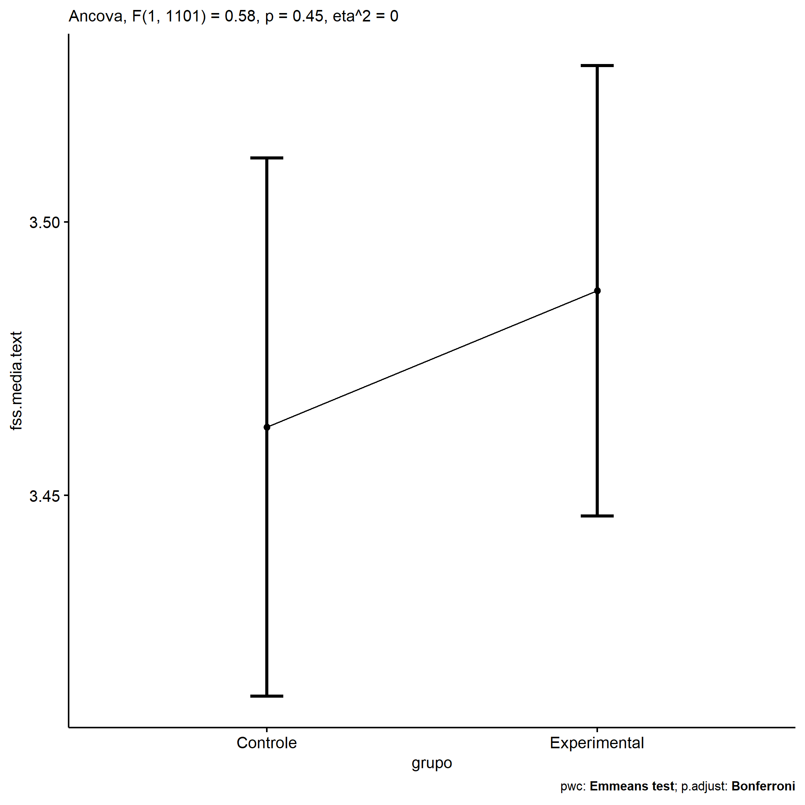<!-- -->

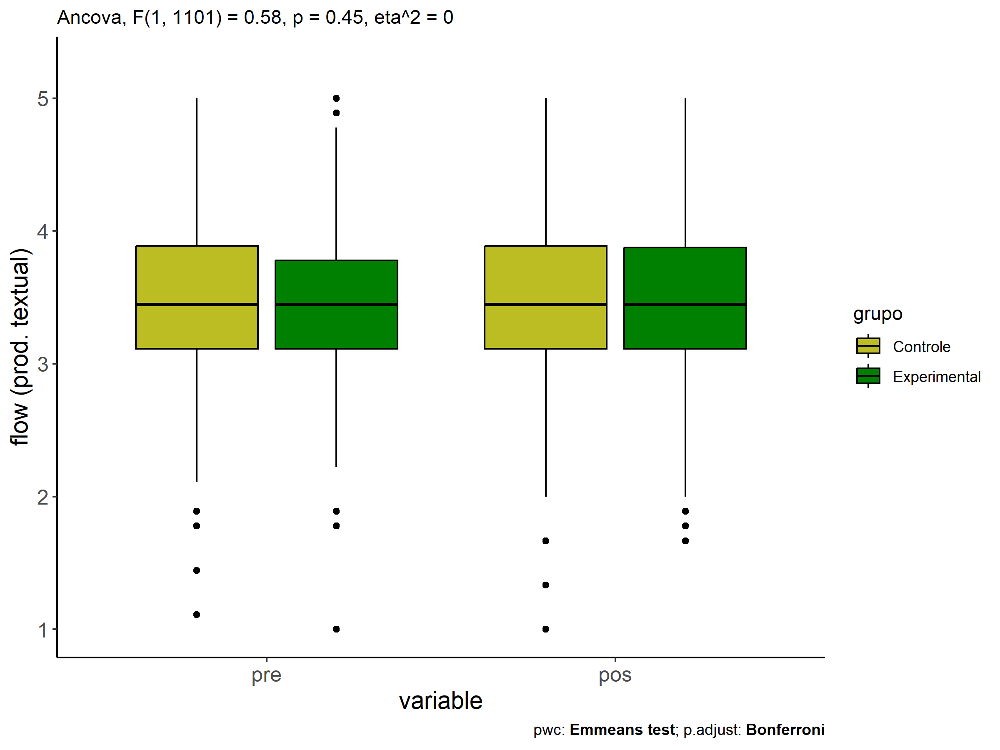<!-- -->

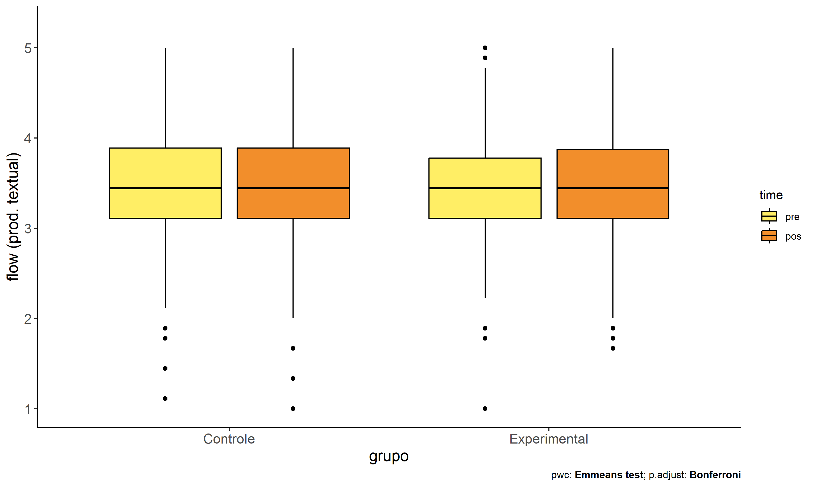<!-- -->

## Pairwise comparisons for two factors

### factores: **grupo:Sexo**

| var            | grupo        | Sexo |   n | M (pre) | SE (pre) | M (unadj) | SE (unadj) | M (adj) | SE (adj) |
|:---------------|:-------------|:-----|----:|--------:|---------:|----------:|-----------:|--------:|---------:|
| fss.media.text | Controle     | F    | 226 |   3.563 |    0.036 |     3.519 |      0.039 |   3.486 |    0.036 |
| fss.media.text | Controle     | M    | 229 |   3.418 |    0.042 |     3.416 |      0.040 |   3.439 |    0.035 |
| fss.media.text | Experimental | F    | 335 |   3.505 |    0.028 |     3.488 |      0.031 |   3.478 |    0.029 |
| fss.media.text | Experimental | M    | 314 |   3.434 |    0.034 |     3.481 |      0.032 |   3.498 |    0.030 |

| .y.            | grupo        | Sexo | group1   | group2       | estimate | conf.low | conf.high |    se | statistic |     p | p.adj | p.adj.signif |
|:---------------|:-------------|:-----|:---------|:-------------|---------:|---------:|----------:|------:|----------:|------:|------:|:-------------|
| fss.media.text |              | F    | Controle | Experimental |    0.009 |   -0.082 |     0.099 | 0.046 |     0.186 | 0.853 | 0.853 | ns           |
| fss.media.text |              | M    | Controle | Experimental |   -0.059 |   -0.150 |     0.033 | 0.046 |    -1.263 | 0.207 | 0.207 | ns           |
| dfs.media.text |              | F    | Controle | Experimental |    0.058 |   -0.039 |     0.155 | 0.049 |     1.170 | 0.242 | 0.242 | ns           |
| dfs.media.text |              | M    | Controle | Experimental |   -0.016 |   -0.114 |     0.082 | 0.050 |    -0.318 | 0.750 | 0.750 | ns           |
| fss.media.text | Controle     |      | F        | M            |    0.047 |   -0.052 |     0.146 | 0.050 |     0.929 | 0.353 | 0.353 | ns           |
| fss.media.text | Experimental |      | F        | M            |   -0.020 |   -0.103 |     0.062 | 0.042 |    -0.487 | 0.627 | 0.627 | ns           |
| dfs.media.text | Controle     |      | F        | M            |    0.146 |    0.040 |     0.251 | 0.054 |     2.701 | 0.007 | 0.007 | \*\*         |
| dfs.media.text | Experimental |      | F        | M            |    0.072 |   -0.017 |     0.160 | 0.045 |     1.589 | 0.112 | 0.112 | ns           |

| .y.       | grupo        | Sexo | group1 | group2 | estimate | conf.low | conf.high |    se | statistic |     p | p.adj | p.adj.signif |
|:----------|:-------------|:-----|:-------|:-------|---------:|---------:|----------:|------:|----------:|------:|------:|:-------------|
| flow.text | Controle     | F    | pre    | pos    |    0.044 |   -0.062 |     0.151 | 0.054 |     0.819 | 0.413 | 0.413 | ns           |
| flow.text | Controle     | M    | pre    | pos    |    0.002 |   -0.104 |     0.108 | 0.054 |     0.037 | 0.970 | 0.970 | ns           |
| flow.text | Experimental | F    | pre    | pos    |    0.018 |   -0.070 |     0.105 | 0.045 |     0.393 | 0.694 | 0.694 | ns           |
| flow.text | Experimental | M    | pre    | pos    |   -0.047 |   -0.137 |     0.043 | 0.046 |    -1.019 | 0.308 | 0.308 | ns           |

    ## Scale for colour is already present.
    ## Adding another scale for colour, which will replace the existing scale.

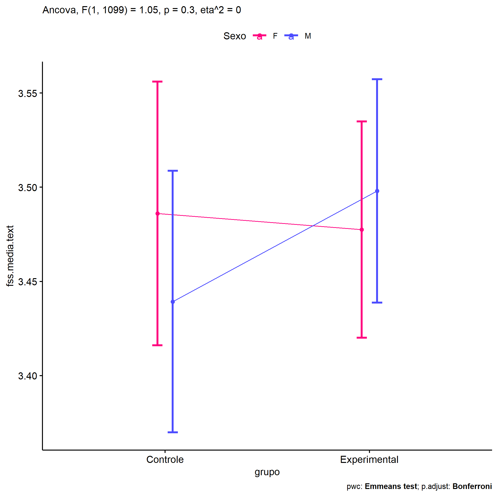<!-- -->

    ## Scale for colour is already present.
    ## Adding another scale for colour, which will replace the existing scale.

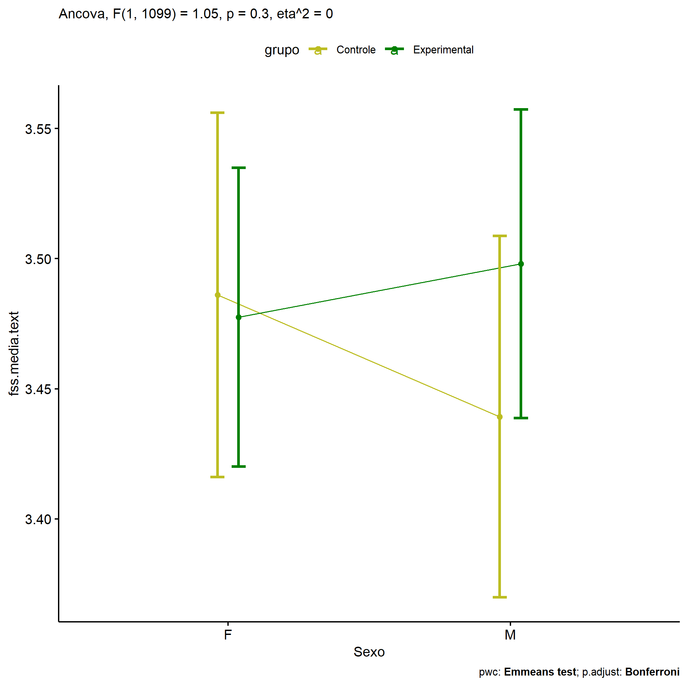<!-- -->

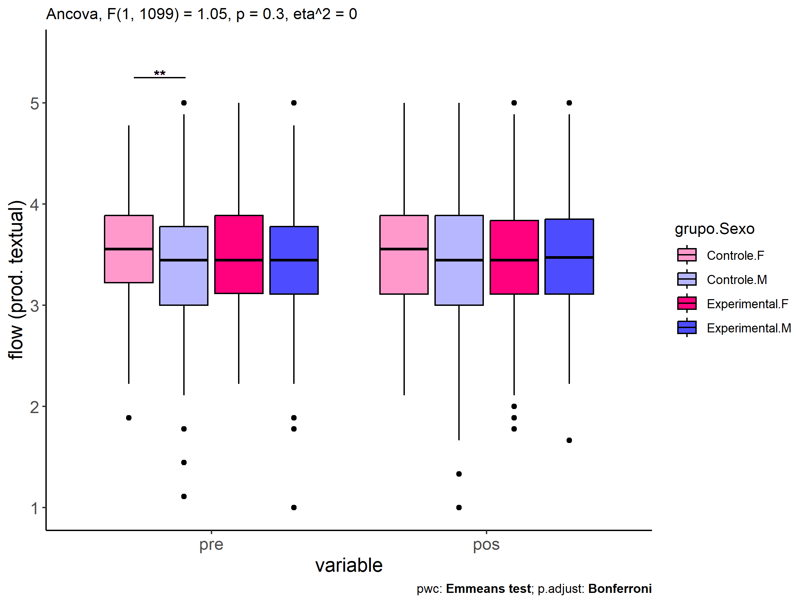<!-- -->

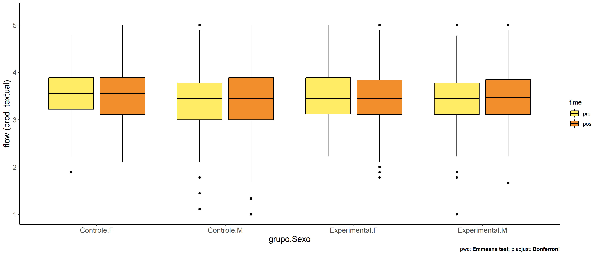<!-- -->

### factores: **grupo:Zona**

| var            | grupo        | Zona   |   n | M (pre) | SE (pre) | M (unadj) | SE (unadj) | M (adj) | SE (adj) |
|:---------------|:-------------|:-------|----:|--------:|---------:|----------:|-----------:|--------:|---------:|
| fss.media.text | Controle     | Rural  | 217 |   3.557 |    0.039 |     3.494 |      0.039 |   3.462 |    0.035 |
| fss.media.text | Controle     | Urbana | 116 |   3.376 |    0.061 |     3.452 |      0.053 |   3.493 |    0.047 |
| fss.media.text | Experimental | Rural  | 255 |   3.464 |    0.036 |     3.481 |      0.032 |   3.486 |    0.032 |
| fss.media.text | Experimental | Urbana | 174 |   3.464 |    0.044 |     3.451 |      0.045 |   3.456 |    0.039 |

| .y.            | grupo        | Zona   | group1   | group2       | estimate | conf.low | conf.high |    se | statistic |     p | p.adj | p.adj.signif |
|:---------------|:-------------|:-------|:---------|:-------------|---------:|---------:|----------:|------:|----------:|------:|------:|:-------------|
| fss.media.text |              | Rural  | Controle | Experimental |   -0.024 |   -0.117 |     0.069 | 0.047 |    -0.511 | 0.610 | 0.610 | ns           |
| fss.media.text |              | Urbana | Controle | Experimental |    0.037 |   -0.084 |     0.157 | 0.061 |     0.599 | 0.549 | 0.549 | ns           |
| dfs.media.text |              | Rural  | Controle | Experimental |    0.093 |   -0.014 |     0.199 | 0.054 |     1.708 | 0.088 | 0.088 | ns           |
| dfs.media.text |              | Urbana | Controle | Experimental |   -0.088 |   -0.226 |     0.051 | 0.070 |    -1.246 | 0.213 | 0.213 | ns           |
| fss.media.text | Controle     |        | Rural    | Urbana       |   -0.031 |   -0.147 |     0.085 | 0.059 |    -0.529 | 0.597 | 0.597 | ns           |
| fss.media.text | Experimental |        | Rural    | Urbana       |    0.030 |   -0.069 |     0.128 | 0.050 |     0.590 | 0.555 | 0.555 | ns           |
| dfs.media.text | Controle     |        | Rural    | Urbana       |    0.181 |    0.048 |     0.314 | 0.068 |     2.677 | 0.008 | 0.008 | \*\*         |
| dfs.media.text | Experimental |        | Rural    | Urbana       |    0.001 |   -0.113 |     0.114 | 0.058 |     0.009 | 0.993 | 0.993 | ns           |

| .y.       | grupo        | Zona   | group1 | group2 | estimate | conf.low | conf.high |    se | statistic |     p | p.adj | p.adj.signif |
|:----------|:-------------|:-------|:-------|:-------|---------:|---------:|----------:|------:|----------:|------:|------:|:-------------|
| flow.text | Controle     | Rural  | pre    | pos    |    0.063 |   -0.045 |     0.171 | 0.055 |     1.138 | 0.255 | 0.255 | ns           |
| flow.text | Controle     | Urbana | pre    | pos    |   -0.076 |   -0.224 |     0.073 | 0.076 |    -1.001 | 0.317 | 0.317 | ns           |
| flow.text | Experimental | Rural  | pre    | pos    |   -0.016 |   -0.116 |     0.084 | 0.051 |    -0.318 | 0.750 | 0.750 | ns           |
| flow.text | Experimental | Urbana | pre    | pos    |    0.013 |   -0.108 |     0.134 | 0.062 |     0.212 | 0.832 | 0.832 | ns           |

    ## Scale for colour is already present.
    ## Adding another scale for colour, which will replace the existing scale.

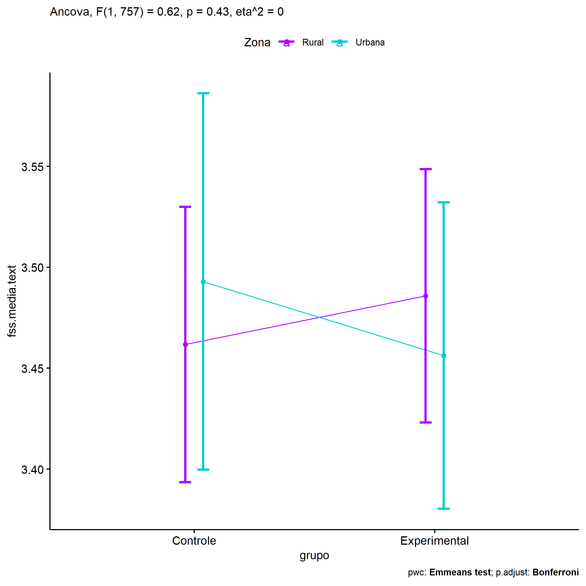<!-- -->

    ## Scale for colour is already present.
    ## Adding another scale for colour, which will replace the existing scale.

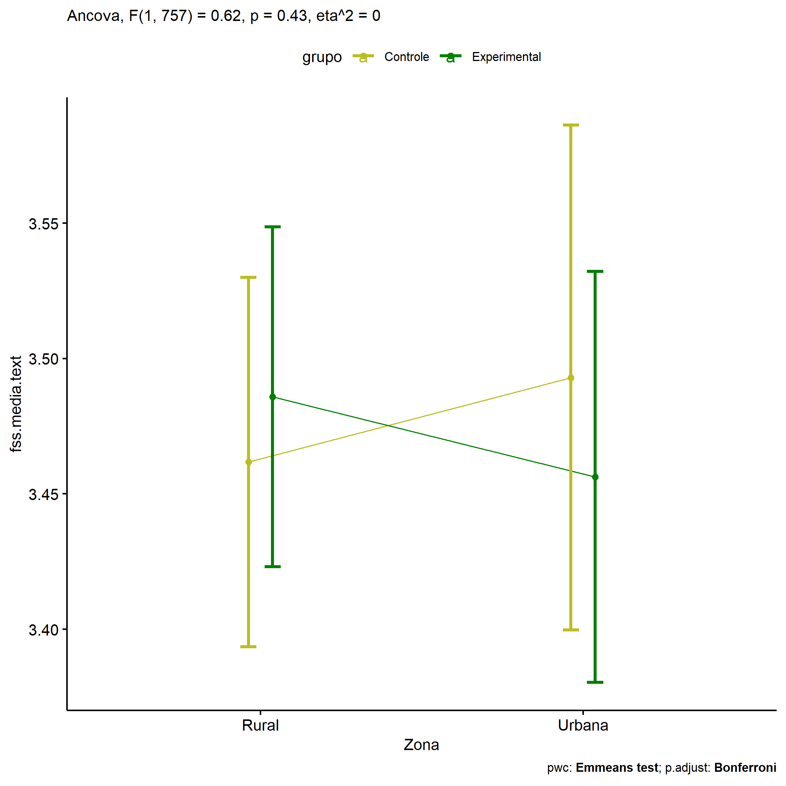<!-- -->

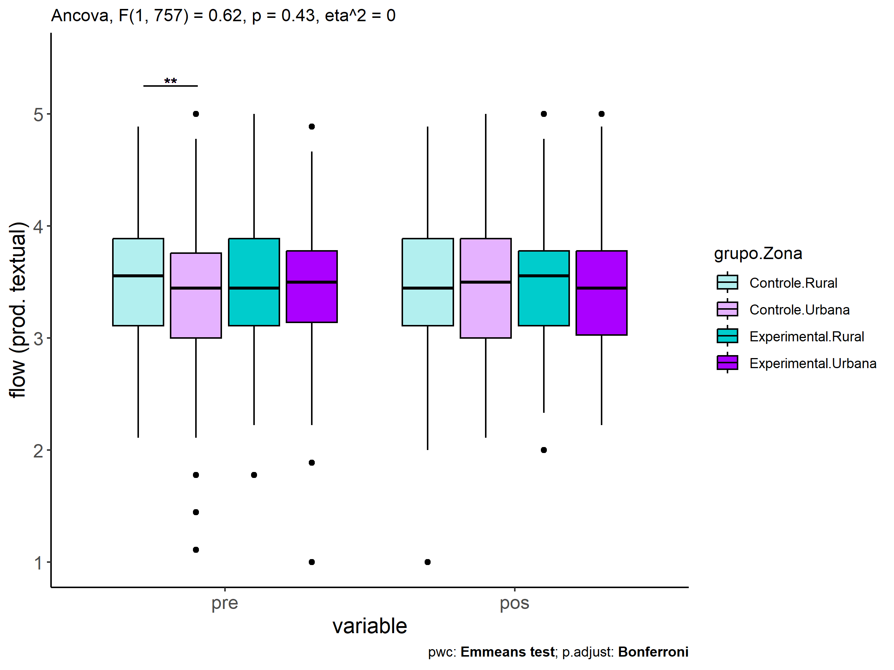<!-- -->

<!-- -->

### factores: **grupo:Cor.Raca**

| var            | grupo        | Cor.Raca |   n | M (pre) | SE (pre) | M (unadj) | SE (unadj) | M (adj) | SE (adj) |
|:---------------|:-------------|:---------|----:|--------:|---------:|----------:|-----------:|--------:|---------:|
| fss.media.text | Controle     | Branca   |  46 |   3.630 |    0.091 |     3.539 |      0.074 |   3.474 |    0.073 |
| fss.media.text | Controle     | Indígena |   9 |   3.654 |    0.186 |     3.728 |      0.192 |   3.653 |    0.165 |
| fss.media.text | Controle     | Parda    | 152 |   3.465 |    0.048 |     3.488 |      0.048 |   3.487 |    0.040 |
| fss.media.text | Experimental | Branca   |  57 |   3.471 |    0.085 |     3.491 |      0.075 |   3.488 |    0.066 |
| fss.media.text | Experimental | Indígena |  15 |   3.306 |    0.113 |     3.444 |      0.142 |   3.504 |    0.128 |
| fss.media.text | Experimental | Parda    | 176 |   3.417 |    0.044 |     3.475 |      0.039 |   3.493 |    0.037 |

| .y.            | grupo        | Cor.Raca | group1   | group2       | estimate | conf.low | conf.high |    se | statistic |     p | p.adj | p.adj.signif |
|:---------------|:-------------|:---------|:---------|:-------------|---------:|---------:|----------:|------:|----------:|------:|------:|:-------------|
| fss.media.text |              | Branca   | Controle | Experimental |   -0.014 |   -0.207 |     0.179 | 0.098 |    -0.144 | 0.886 | 0.886 | ns           |
| fss.media.text |              | Indígena | Controle | Experimental |    0.149 |   -0.262 |     0.561 | 0.209 |     0.713 | 0.476 | 0.476 | ns           |
| fss.media.text |              | Parda    | Controle | Experimental |   -0.006 |   -0.113 |     0.102 | 0.055 |    -0.101 | 0.920 | 0.920 | ns           |
| dfs.media.text |              | Branca   | Controle | Experimental |    0.159 |   -0.072 |     0.391 | 0.118 |     1.355 | 0.176 | 0.176 | ns           |
| dfs.media.text |              | Indígena | Controle | Experimental |    0.348 |   -0.144 |     0.840 | 0.250 |     1.390 | 0.165 | 0.165 | ns           |
| dfs.media.text |              | Parda    | Controle | Experimental |    0.048 |   -0.081 |     0.177 | 0.066 |     0.729 | 0.467 | 0.467 | ns           |
| fss.media.text | Controle     |          | Branca   | Indígena     |   -0.180 |   -0.535 |     0.175 | 0.181 |    -0.996 | 0.320 | 0.959 | ns           |
| fss.media.text | Controle     |          | Branca   | Parda        |   -0.013 |   -0.178 |     0.151 | 0.084 |    -0.160 | 0.873 | 1.000 | ns           |
| fss.media.text | Controle     |          | Indígena | Parda        |    0.166 |   -0.168 |     0.501 | 0.170 |     0.978 | 0.328 | 0.985 | ns           |
| fss.media.text | Experimental |          | Branca   | Indígena     |   -0.016 |   -0.299 |     0.266 | 0.144 |    -0.114 | 0.909 | 1.000 | ns           |
| fss.media.text | Experimental |          | Branca   | Parda        |   -0.005 |   -0.153 |     0.144 | 0.076 |    -0.064 | 0.949 | 1.000 | ns           |
| fss.media.text | Experimental |          | Indígena | Parda        |    0.012 |   -0.250 |     0.274 | 0.133 |     0.087 | 0.930 | 1.000 | ns           |
| dfs.media.text | Controle     |          | Branca   | Indígena     |   -0.024 |   -0.449 |     0.401 | 0.216 |    -0.110 | 0.912 | 1.000 | ns           |
| dfs.media.text | Controle     |          | Branca   | Parda        |    0.166 |   -0.030 |     0.362 | 0.100 |     1.660 | 0.098 | 0.293 | ns           |
| dfs.media.text | Controle     |          | Indígena | Parda        |    0.190 |   -0.210 |     0.590 | 0.204 |     0.932 | 0.352 | 1.000 | ns           |
| dfs.media.text | Experimental |          | Branca   | Indígena     |    0.165 |   -0.174 |     0.503 | 0.172 |     0.955 | 0.340 | 1.000 | ns           |
| dfs.media.text | Experimental |          | Branca   | Parda        |    0.054 |   -0.123 |     0.232 | 0.090 |     0.600 | 0.549 | 1.000 | ns           |
| dfs.media.text | Experimental |          | Indígena | Parda        |   -0.110 |   -0.424 |     0.203 | 0.160 |    -0.691 | 0.490 | 1.000 | ns           |

| .y.       | grupo        | Cor.Raca | group1 | group2 | estimate | conf.low | conf.high |    se | statistic |     p | p.adj | p.adj.signif |
|:----------|:-------------|:---------|:-------|:-------|---------:|---------:|----------:|------:|----------:|------:|------:|:-------------|
| flow.text | Controle     | Branca   | pre    | pos    |    0.091 |   -0.142 |     0.325 | 0.119 |     0.767 | 0.443 | 0.443 | ns           |
| flow.text | Controle     | Indígena | pre    | pos    |   -0.074 |   -0.602 |     0.454 | 0.269 |    -0.275 | 0.783 | 0.783 | ns           |
| flow.text | Controle     | Parda    | pre    | pos    |   -0.023 |   -0.152 |     0.105 | 0.065 |    -0.357 | 0.721 | 0.721 | ns           |
| flow.text | Experimental | Branca   | pre    | pos    |   -0.020 |   -0.230 |     0.189 | 0.107 |    -0.189 | 0.850 | 0.850 | ns           |
| flow.text | Experimental | Indígena | pre    | pos    |   -0.137 |   -0.546 |     0.272 | 0.208 |    -0.658 | 0.511 | 0.511 | ns           |
| flow.text | Experimental | Parda    | pre    | pos    |   -0.058 |   -0.177 |     0.061 | 0.061 |    -0.956 | 0.339 | 0.339 | ns           |

    ## Scale for colour is already present.
    ## Adding another scale for colour, which will replace the existing scale.

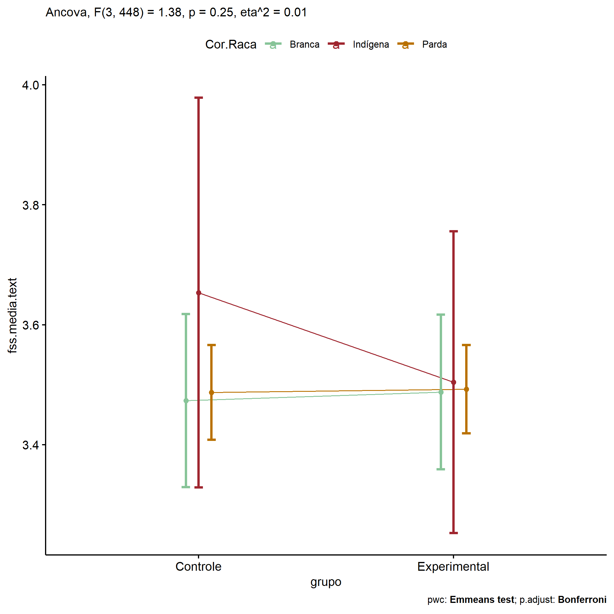<!-- -->

    ## Scale for colour is already present.
    ## Adding another scale for colour, which will replace the existing scale.

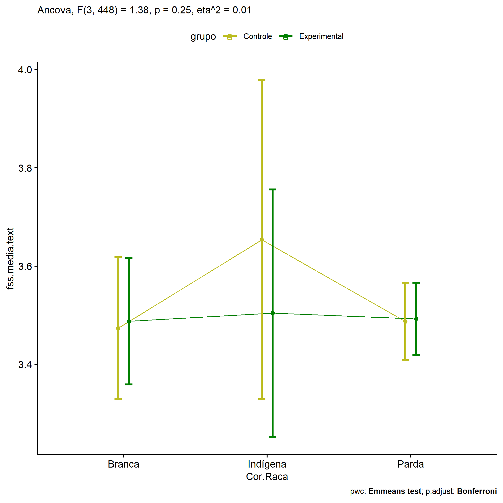<!-- -->

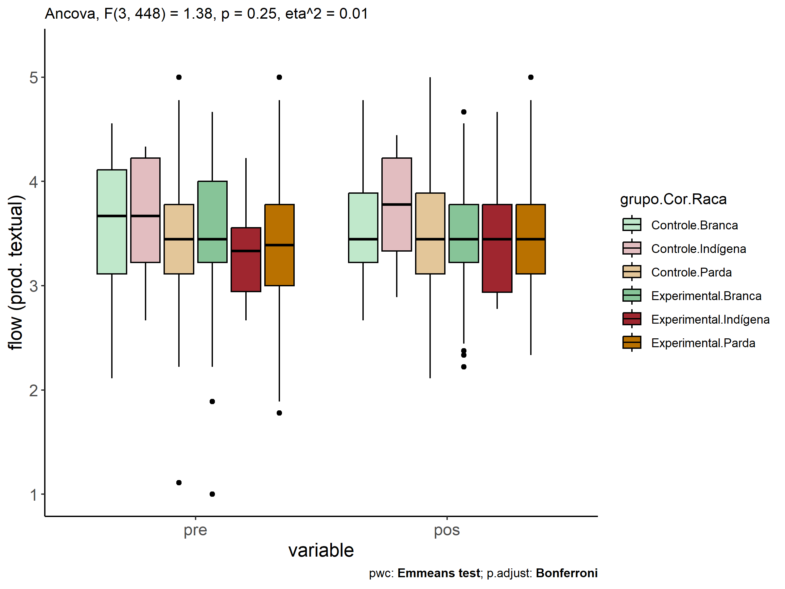<!-- -->

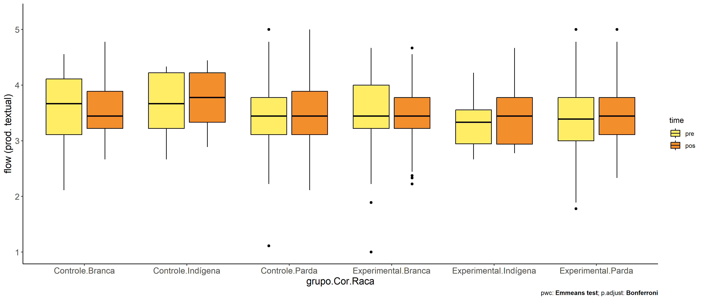<!-- -->
