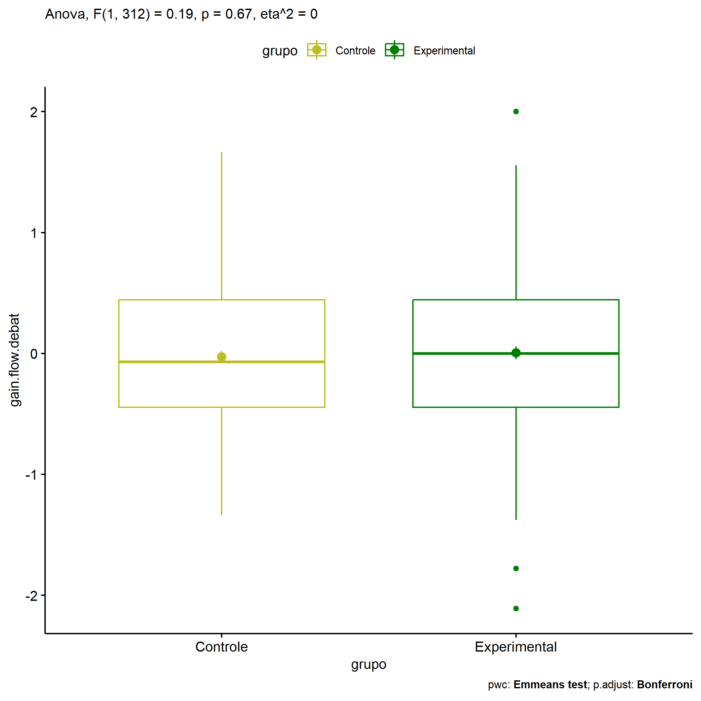
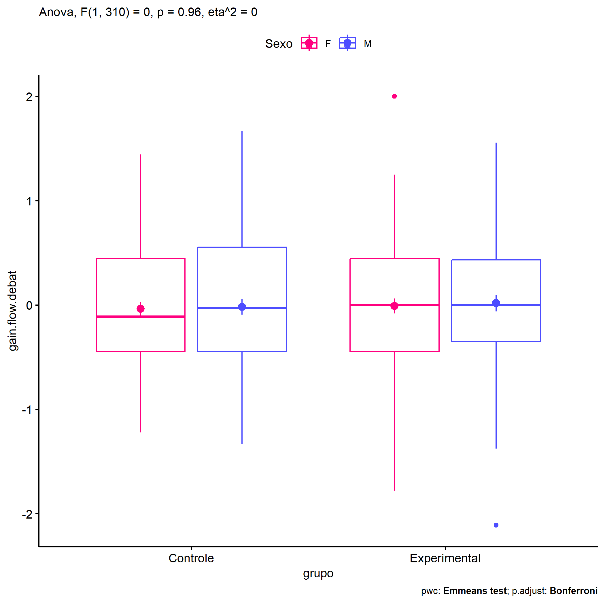
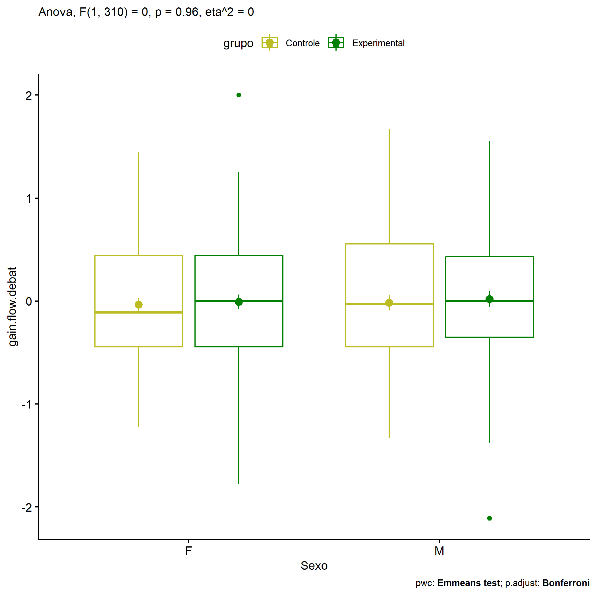
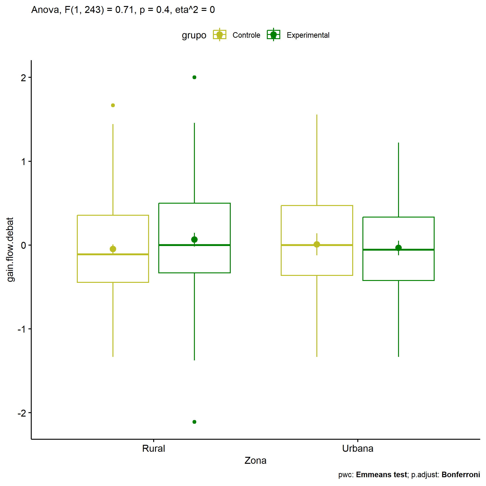

ANOVA in Gains for gain flow (debate) (gain flow (debate))
================
Geiser C. Challco <geiser@alumni.usp.br>

- [Descriptive Statistics of Initial
  Data](#descriptive-statistics-of-initial-data)
- [Checking of Assumptions](#checking-of-assumptions)
  - [Assumption: Normality distribution of
    data](#assumption-normality-distribution-of-data)
  - [Assumption: Homogeneity of data
    distribution](#assumption-homogeneity-of-data-distribution)
- [Computation of ANCOVA test and Pairwise
  Comparison](#computation-of-ancova-test-and-pairwise-comparison)
  - [ANCOVA tests for one factor](#ancova-tests-for-one-factor)
  - [ANCOVA tests for two factors](#ancova-tests-for-two-factors)
  - [Pairwise comparisons for one factor:
    **grupo**](#pairwise-comparisons-for-one-factor-grupo)
  - [Pairwise comparisons for two
    factors](#pairwise-comparisons-for-two-factors)
    - [factores: **grupo:Sexo**](#factores-gruposexo)
    - [factores: **grupo:Zona**](#factores-grupozona)
    - [factores: **grupo:Cor.Raca**](#factores-grupocorraca)

**NOTE**

- Teste ANOVA para determinar se houve diferenças significativas no gain
  flow (debate) (medido usando a diferença entre post-test e
  pre-testes).
- ANOVA test to determine whether there were significant differences in
  gain flow (debate) (measured using the difference between post-test
  and pre-tests).

# Descriptive Statistics of Initial Data

| grupo        | Sexo | Zona   | Cor.Raca | variable        |   n |   mean | median |    min |    max |    sd |    se |    ci |   iqr |
|:-------------|:-----|:-------|:---------|:----------------|----:|-------:|-------:|-------:|-------:|------:|------:|------:|------:|
| Controle     | F    |        |          | gain.flow.debat |  69 | -0.038 | -0.111 | -1.222 |  1.444 | 0.547 | 0.066 | 0.131 | 0.889 |
| Controle     | M    |        |          | gain.flow.debat |  79 | -0.018 | -0.028 | -1.333 |  1.667 | 0.654 | 0.074 | 0.147 | 1.000 |
| Experimental | F    |        |          | gain.flow.debat |  86 | -0.009 |  0.000 | -1.778 |  2.000 | 0.663 | 0.072 | 0.142 | 0.889 |
| Experimental | M    |        |          | gain.flow.debat |  80 |  0.019 |  0.000 | -2.111 |  1.556 | 0.714 | 0.080 | 0.159 | 0.785 |
| Controle     |      | Rural  |          | gain.flow.debat | 102 | -0.049 | -0.111 | -1.333 |  1.667 | 0.581 | 0.058 | 0.114 | 0.799 |
| Controle     |      | Urbana |          | gain.flow.debat |  24 |  0.008 |  0.000 | -1.333 |  1.556 | 0.644 | 0.131 | 0.272 | 0.833 |
| Controle     |      |        |          | gain.flow.debat |  22 |  0.036 |  0.000 | -1.222 |  1.333 | 0.688 | 0.147 | 0.305 | 1.003 |
| Experimental |      | Rural  |          | gain.flow.debat |  79 |  0.065 |  0.000 | -2.111 |  2.000 | 0.720 | 0.081 | 0.161 | 0.833 |
| Experimental |      | Urbana |          | gain.flow.debat |  42 | -0.035 | -0.056 | -1.333 |  1.222 | 0.558 | 0.086 | 0.174 | 0.757 |
| Experimental |      |        |          | gain.flow.debat |  45 | -0.064 | -0.111 | -1.778 |  1.556 | 0.737 | 0.110 | 0.221 | 1.111 |
| Controle     |      |        | Branca   | gain.flow.debat |  20 |  0.017 |  0.000 | -1.222 |  1.333 | 0.643 | 0.144 | 0.301 | 0.889 |
| Controle     |      |        | Indígena | gain.flow.debat |   3 | -0.287 | -0.556 | -0.889 |  0.583 | 0.772 | 0.446 | 1.918 | 0.736 |
| Controle     |      |        | Parda    | gain.flow.debat |  44 |  0.005 |  0.000 | -1.333 |  1.667 | 0.585 | 0.088 | 0.178 | 0.837 |
| Controle     |      |        | Preta    | gain.flow.debat |   1 | -0.222 | -0.222 | -0.222 | -0.222 |       |       |       | 0.000 |
| Controle     |      |        |          | gain.flow.debat |  80 | -0.043 | -0.069 | -1.333 |  1.556 | 0.612 | 0.068 | 0.136 | 0.917 |
| Experimental |      |        | Branca   | gain.flow.debat |  17 |  0.183 |  0.111 | -0.778 |  2.000 | 0.729 | 0.177 | 0.375 | 0.778 |
| Experimental |      |        | Indígena | gain.flow.debat |  12 | -0.113 |  0.111 | -2.111 |  0.681 | 0.787 | 0.227 | 0.500 | 0.410 |
| Experimental |      |        | Parda    | gain.flow.debat |  46 |  0.117 |  0.111 | -1.375 |  1.250 | 0.652 | 0.096 | 0.194 | 0.778 |
| Experimental |      |        | Preta    | gain.flow.debat |   1 |  1.222 |  1.222 |  1.222 |  1.222 |       |       |       | 0.000 |
| Experimental |      |        |          | gain.flow.debat |  90 | -0.084 | -0.153 | -1.778 |  1.556 | 0.668 | 0.070 | 0.140 | 0.889 |

# Checking of Assumptions

## Assumption: Normality distribution of data

| var             |   n |   skewness |  kurtosis | symmetry | statistic | method     |         p | p.signif | normality |
|:----------------|----:|-----------:|----------:|:---------|----------:|:-----------|----------:|:---------|:----------|
| gain.flow.debat | 314 |  0.0695391 | 0.0331940 | YES      |  0.417073 | D’Agostino | 0.8117714 | ns       | \-        |
| gain.flow.debat | 247 |  0.1104369 | 0.3052738 | YES      |  1.930644 | D’Agostino | 0.3808606 | ns       | \-        |
| gain.flow.debat | 144 | -0.0771258 | 0.2950973 | YES      |  1.262941 | D’Agostino | 0.5318091 | ns       | QQ        |

## Assumption: Homogeneity of data distribution

| var             | method        | formula                               |   n | df1 | df2 | statistic |         p | p.signif |
|:----------------|:--------------|:--------------------------------------|----:|----:|----:|----------:|----------:|:---------|
| gain.flow.debat | Levene’s test | `gain.flow.debat`~`grupo`\*`Sexo`     | 314 |   3 | 310 | 1.1743592 | 0.3196167 | ns       |
| gain.flow.debat | Levene’s test | `gain.flow.debat`~`grupo`\*`Zona`     | 247 |   3 | 243 | 0.9842130 | 0.4008325 | ns       |
| gain.flow.debat | Levene’s test | `gain.flow.debat`~`grupo`\*`Cor.Raca` | 144 |   7 | 136 | 0.4970096 | 0.8354387 | ns       |

# Computation of ANCOVA test and Pairwise Comparison

## ANCOVA tests for one factor

| Effect   | DFn | DFd |   SSn |     SSd |     F |     p |   ges | p\<.05 |
|:---------|----:|----:|------:|--------:|------:|------:|------:|:-------|
| grupo    |   1 | 312 | 0.079 | 131.373 | 0.187 | 0.666 | 0.001 |        |
| Sexo     |   1 | 312 | 0.040 | 131.412 | 0.094 | 0.759 | 0.000 |        |
| Zona     |   1 | 245 | 0.019 |  97.423 | 0.048 | 0.826 | 0.000 |        |
| Cor.Raca |   3 | 140 | 1.074 |  59.863 | 0.837 | 0.476 | 0.018 |        |

## ANCOVA tests for two factors

|     | Effect         | DFn | DFd |   SSn |     SSd |     F |     p |   ges | p\<.05 |
|:----|:---------------|----:|----:|------:|--------:|------:|------:|------:|:-------|
| 3   | grupo:Sexo     |   1 | 310 | 0.001 | 131.327 | 0.003 | 0.958 | 0.000 |        |
| 6   | grupo:Zona     |   1 | 243 | 0.282 |  96.817 | 0.707 | 0.401 | 0.003 |        |
| 9   | grupo:Cor.Raca |   3 | 136 | 0.873 |  58.207 | 0.680 | 0.566 | 0.015 |        |

## Pairwise comparisons for one factor: **grupo**

| var             | grupo        |   n |      M |    SE |
|:----------------|:-------------|----:|-------:|------:|
| gain.flow.debat | Controle     | 148 | -0.027 | 0.050 |
| gain.flow.debat | Experimental | 166 |  0.005 | 0.053 |

| .y.             | group1   | group2       | estimate | conf.low | conf.high |    se | statistic |     p | p.adj | p.adj.signif |
|:----------------|:---------|:-------------|---------:|---------:|----------:|------:|----------:|------:|------:|:-------------|
| gain.flow.debat | Controle | Experimental |   -0.032 |   -0.176 |     0.113 | 0.073 |    -0.432 | 0.666 | 0.666 | ns           |

    ## Scale for colour is already present.
    ## Adding another scale for colour, which will replace the existing scale.

<!-- -->

## Pairwise comparisons for two factors

### factores: **grupo:Sexo**

| var             | grupo        | Sexo |   n |      M |    SE |
|:----------------|:-------------|:-----|----:|-------:|------:|
| gain.flow.debat | Controle     | F    |  69 | -0.038 | 0.066 |
| gain.flow.debat | Controle     | M    |  79 | -0.018 | 0.074 |
| gain.flow.debat | Experimental | F    |  86 | -0.009 | 0.072 |
| gain.flow.debat | Experimental | M    |  80 |  0.019 | 0.080 |

| .y.             | grupo        | Sexo | group1   | group2       | estimate | conf.low | conf.high |    se | statistic |     p | p.adj | p.adj.signif |
|:----------------|:-------------|:-----|:---------|:-------------|---------:|---------:|----------:|------:|----------:|------:|------:|:-------------|
| gain.flow.debat |              | F    | Controle | Experimental |   -0.029 |   -0.236 |     0.178 | 0.105 |    -0.276 | 0.783 | 0.783 | ns           |
| gain.flow.debat |              | M    | Controle | Experimental |   -0.037 |   -0.240 |     0.166 | 0.103 |    -0.356 | 0.722 | 0.722 | ns           |
| gain.flow.debat | Controle     |      | F        | M            |   -0.020 |   -0.231 |     0.191 | 0.107 |    -0.187 | 0.852 | 0.852 | ns           |
| gain.flow.debat | Experimental |      | F        | M            |   -0.028 |   -0.227 |     0.171 | 0.101 |    -0.275 | 0.783 | 0.783 | ns           |

    ## Scale for colour is already present.
    ## Adding another scale for colour, which will replace the existing scale.

<!-- -->

    ## Scale for colour is already present.
    ## Adding another scale for colour, which will replace the existing scale.

<!-- -->

### factores: **grupo:Zona**

| var             | grupo        | Zona   |   n |      M |    SE |
|:----------------|:-------------|:-------|----:|-------:|------:|
| gain.flow.debat | Controle     | Rural  | 102 | -0.049 | 0.058 |
| gain.flow.debat | Controle     | Urbana |  24 |  0.008 | 0.131 |
| gain.flow.debat | Experimental | Rural  |  79 |  0.065 | 0.081 |
| gain.flow.debat | Experimental | Urbana |  42 | -0.035 | 0.086 |

| .y.             | grupo        | Zona   | group1   | group2       | estimate | conf.low | conf.high |    se | statistic |     p | p.adj | p.adj.signif |
|:----------------|:-------------|:-------|:---------|:-------------|---------:|---------:|----------:|------:|----------:|------:|------:|:-------------|
| gain.flow.debat |              | Rural  | Controle | Experimental |   -0.114 |   -0.300 |     0.072 | 0.095 |    -1.204 | 0.230 | 0.230 | ns           |
| gain.flow.debat |              | Urbana | Controle | Experimental |    0.043 |   -0.275 |     0.362 | 0.162 |     0.269 | 0.788 | 0.788 | ns           |
| gain.flow.debat | Controle     |        | Rural    | Urbana       |   -0.057 |   -0.339 |     0.225 | 0.143 |    -0.401 | 0.689 | 0.689 | ns           |
| gain.flow.debat | Experimental |        | Rural    | Urbana       |    0.100 |   -0.138 |     0.337 | 0.121 |     0.829 | 0.408 | 0.408 | ns           |

    ## Scale for colour is already present.
    ## Adding another scale for colour, which will replace the existing scale.

<!-- -->

    ## Scale for colour is already present.
    ## Adding another scale for colour, which will replace the existing scale.

<!-- -->

### factores: **grupo:Cor.Raca**

| var             | grupo        | Cor.Raca |   n |      M |    SE |
|:----------------|:-------------|:---------|----:|-------:|------:|
| gain.flow.debat | Controle     | Branca   |  20 |  0.017 | 0.144 |
| gain.flow.debat | Controle     | Parda    |  44 |  0.005 | 0.088 |
| gain.flow.debat | Experimental | Branca   |  17 |  0.183 | 0.177 |
| gain.flow.debat | Experimental | Indígena |  12 | -0.113 | 0.227 |
| gain.flow.debat | Experimental | Parda    |  46 |  0.117 | 0.096 |

|     | .y.             | grupo        | Cor.Raca | group1   | group2       | estimate | conf.low | conf.high |    se | statistic |     p | p.adj | p.adj.signif |
|:----|:----------------|:-------------|:---------|:---------|:-------------|---------:|---------:|----------:|------:|----------:|------:|------:|:-------------|
| 1   | gain.flow.debat |              | Branca   | Controle | Experimental |   -0.166 |   -0.592 |     0.259 | 0.215 |    -0.773 | 0.441 | 0.441 | ns           |
| 3   | gain.flow.debat |              | Parda    | Controle | Experimental |   -0.113 |   -0.385 |     0.159 | 0.138 |    -0.820 | 0.414 | 0.414 | ns           |
| 5   | gain.flow.debat | Controle     |          | Branca   | Parda        |    0.012 |   -0.336 |     0.360 | 0.176 |     0.068 | 0.946 | 0.946 | ns           |
| 7   | gain.flow.debat | Experimental |          | Branca   | Indígena     |    0.296 |   -0.190 |     0.783 | 0.246 |     1.205 | 0.230 | 0.691 | ns           |
| 8   | gain.flow.debat | Experimental |          | Branca   | Parda        |    0.066 |   -0.301 |     0.432 | 0.185 |     0.354 | 0.724 | 1.000 | ns           |
| 9   | gain.flow.debat | Experimental |          | Indígena | Parda        |   -0.231 |   -0.649 |     0.187 | 0.211 |    -1.092 | 0.277 | 0.830 | ns           |

    ## Scale for colour is already present.
    ## Adding another scale for colour, which will replace the existing scale.

<!-- -->
