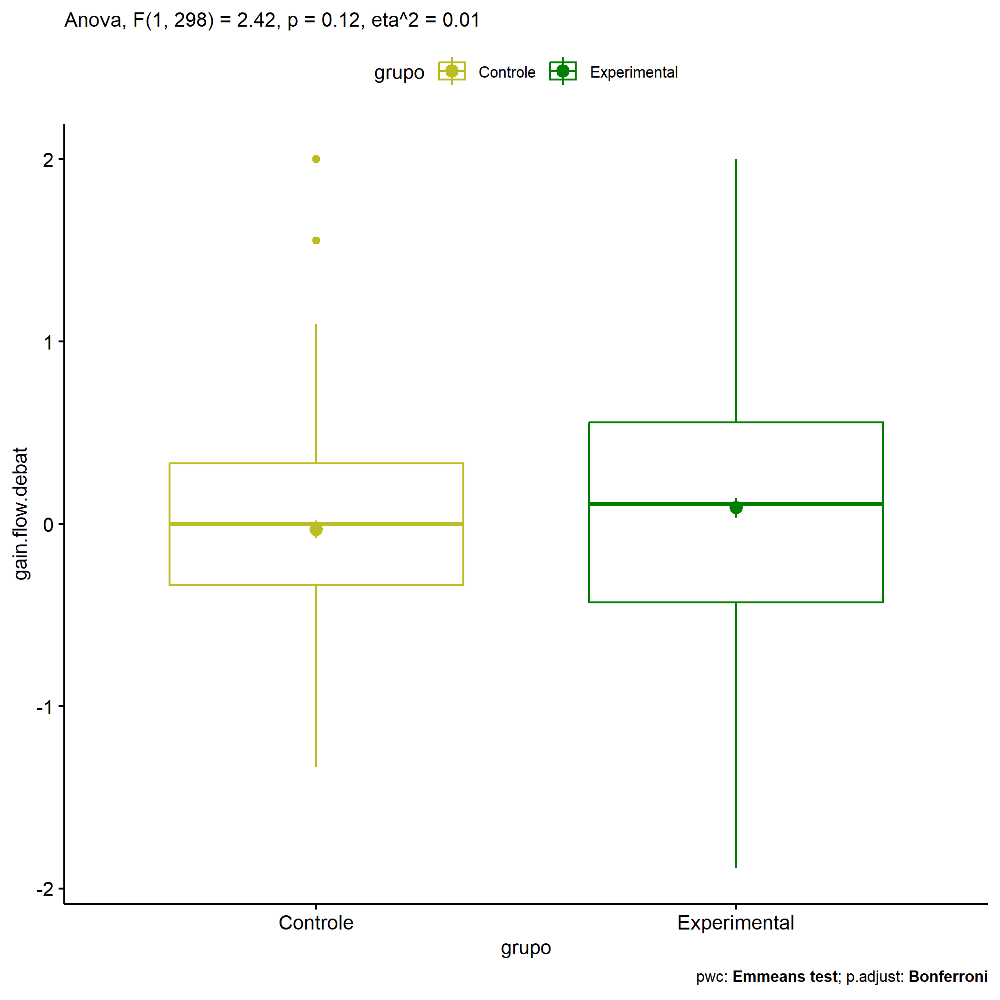
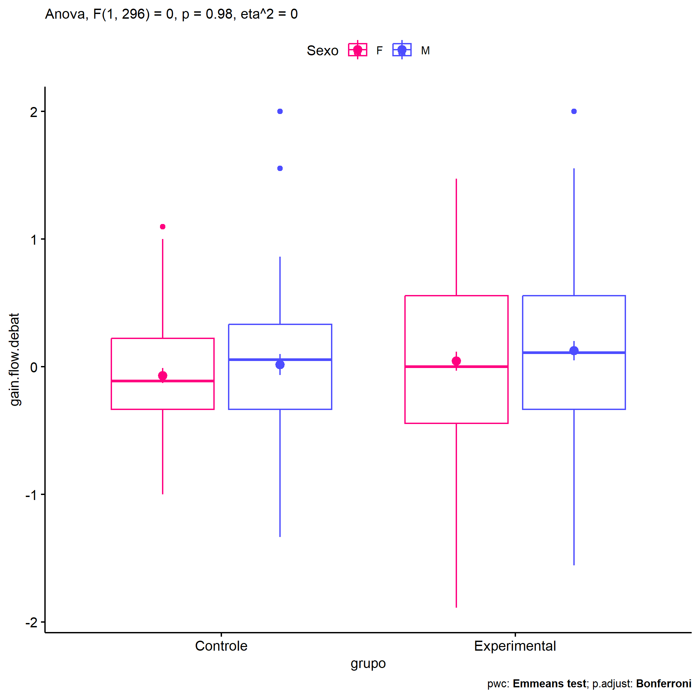
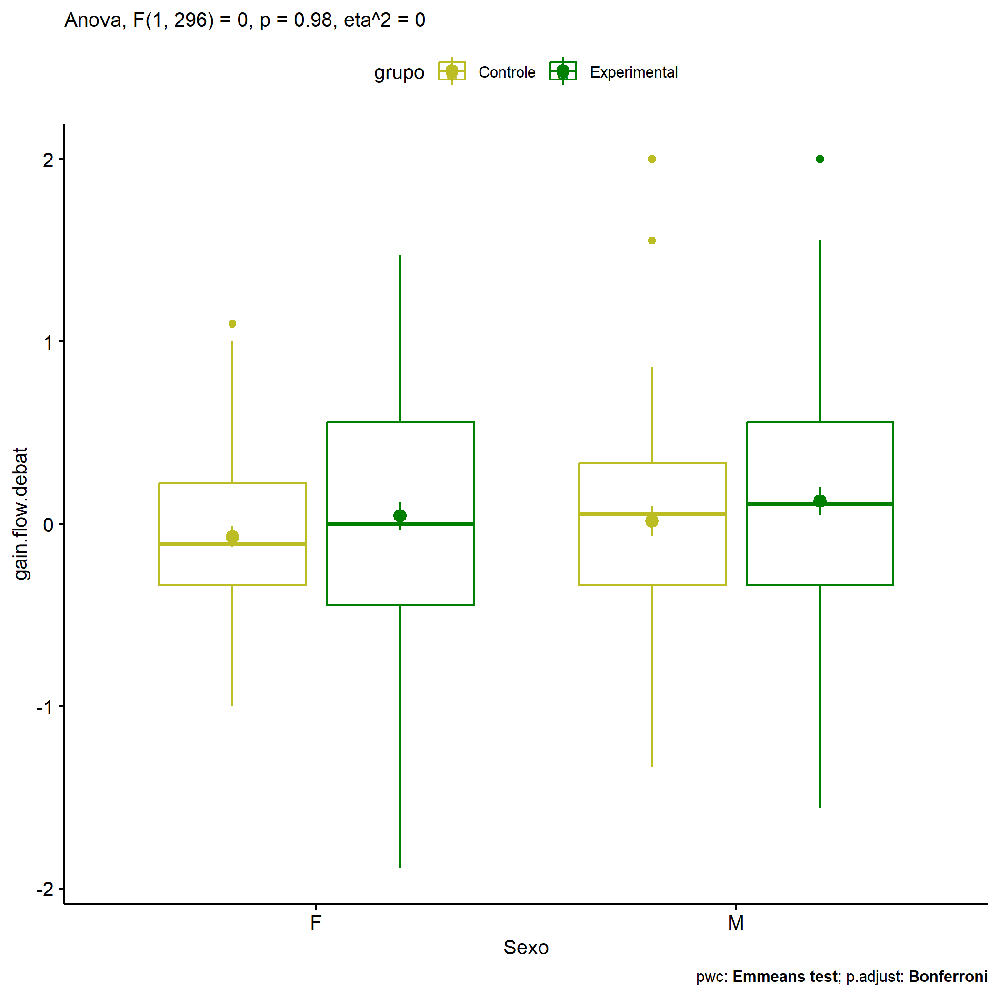
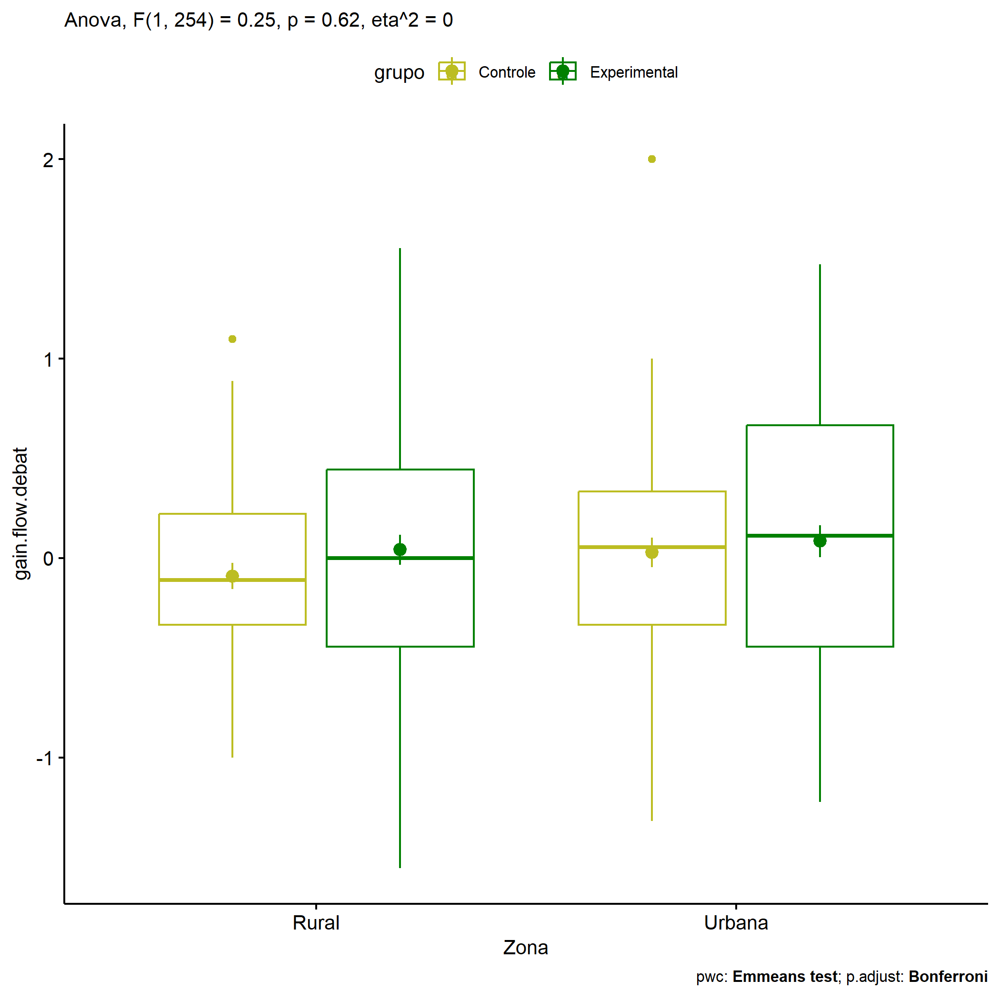
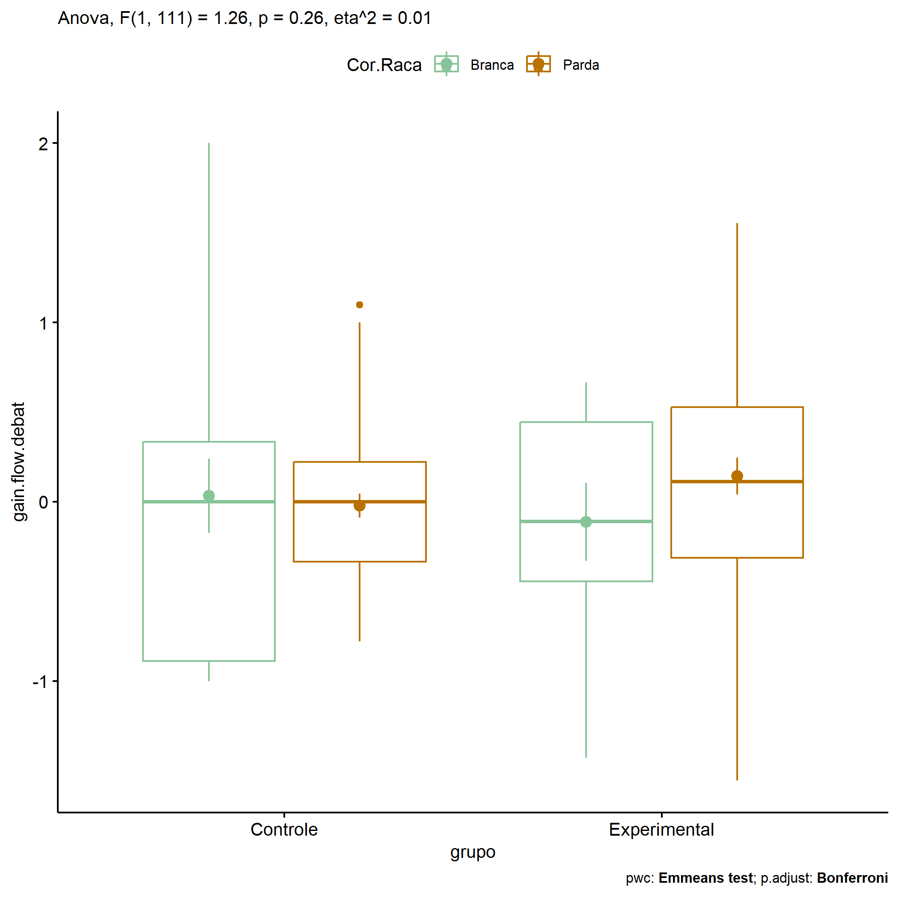
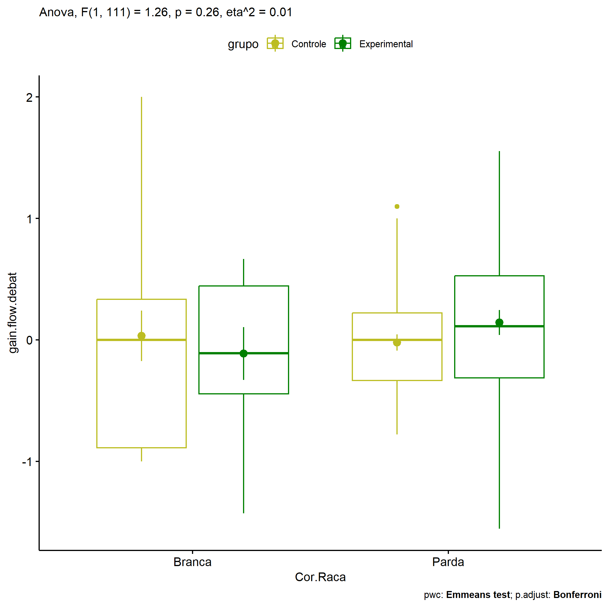

ANOVA in Gains for gain flow (debate) (gain flow (debate))
================
Geiser C. Challco <geiser@alumni.usp.br>

- [Descriptive Statistics of Initial
  Data](#descriptive-statistics-of-initial-data)
- [Checking of Assumptions](#checking-of-assumptions)
  - [Assumption: Normality distribution of
    data](#assumption-normality-distribution-of-data)
  - [Assumption: Homogeneity of data
    distribution](#assumption-homogeneity-of-data-distribution)
- [Computation of ANCOVA test and Pairwise
  Comparison](#computation-of-ancova-test-and-pairwise-comparison)
  - [ANCOVA tests for one factor](#ancova-tests-for-one-factor)
  - [ANCOVA tests for two factors](#ancova-tests-for-two-factors)
  - [Pairwise comparisons for one factor:
    **grupo**](#pairwise-comparisons-for-one-factor-grupo)
  - [Pairwise comparisons for two
    factors](#pairwise-comparisons-for-two-factors)
    - [factores: **grupo:Sexo**](#factores-gruposexo)
    - [factores: **grupo:Zona**](#factores-grupozona)
    - [factores: **grupo:Cor.Raca**](#factores-grupocorraca)

**NOTE**

- Teste ANOVA para determinar se houve diferenças significativas no gain
  flow (debate) (medido usando a diferença entre post-test e
  pre-testes).
- ANOVA test to determine whether there were significant differences in
  gain flow (debate) (measured using the difference between post-test
  and pre-tests).

# Descriptive Statistics of Initial Data

| grupo        | Sexo | Zona   | Cor.Raca | variable        |   n |   mean | median |    min |   max |    sd |    se |    ci |   iqr |
|:-------------|:-----|:-------|:---------|:----------------|----:|-------:|-------:|-------:|------:|------:|------:|------:|------:|
| Controle     | F    |        |          | gain.flow.debat |  67 | -0.069 | -0.111 | -1.000 | 1.097 | 0.477 | 0.058 | 0.116 | 0.556 |
| Controle     | M    |        |          | gain.flow.debat |  56 |  0.017 |  0.056 | -1.333 | 2.000 | 0.616 | 0.082 | 0.165 | 0.667 |
| Experimental | F    |        |          | gain.flow.debat |  83 |  0.044 |  0.000 | -1.889 | 1.472 | 0.680 | 0.075 | 0.149 | 1.000 |
| Experimental | M    |        |          | gain.flow.debat |  94 |  0.126 |  0.111 | -1.556 | 2.000 | 0.734 | 0.076 | 0.150 | 0.889 |
| Controle     |      | Rural  |          | gain.flow.debat |  53 | -0.090 | -0.111 | -1.000 | 1.097 | 0.478 | 0.066 | 0.132 | 0.556 |
| Controle     |      | Urbana |          | gain.flow.debat |  54 |  0.030 |  0.056 | -1.319 | 2.000 | 0.544 | 0.074 | 0.149 | 0.667 |
| Controle     |      |        |          | gain.flow.debat |  16 | -0.032 | -0.111 | -1.333 | 1.556 | 0.736 | 0.184 | 0.392 | 1.072 |
| Experimental |      | Rural  |          | gain.flow.debat |  75 |  0.042 |  0.000 | -1.556 | 1.556 | 0.654 | 0.076 | 0.151 | 0.889 |
| Experimental |      | Urbana |          | gain.flow.debat |  76 |  0.085 |  0.111 | -1.222 | 1.472 | 0.698 | 0.080 | 0.159 | 1.111 |
| Experimental |      |        |          | gain.flow.debat |  26 |  0.227 |  0.444 | -1.889 | 2.000 | 0.883 | 0.173 | 0.357 | 1.056 |
| Controle     |      |        | Branca   | gain.flow.debat |  17 |  0.033 |  0.000 | -1.000 | 2.000 | 0.855 | 0.207 | 0.440 | 1.222 |
| Controle     |      |        | Indígena | gain.flow.debat |   4 |  0.000 |  0.000 | -0.333 | 0.333 | 0.272 | 0.136 | 0.433 | 0.167 |
| Controle     |      |        | Parda    | gain.flow.debat |  41 | -0.023 |  0.000 | -0.778 | 1.097 | 0.428 | 0.067 | 0.135 | 0.556 |
| Controle     |      |        |          | gain.flow.debat |  61 | -0.055 | -0.111 | -1.333 | 1.000 | 0.528 | 0.068 | 0.135 | 0.778 |
| Experimental |      |        | Branca   | gain.flow.debat |  11 | -0.112 | -0.111 | -1.429 | 0.667 | 0.721 | 0.217 | 0.484 | 0.889 |
| Experimental |      |        | Parda    | gain.flow.debat |  43 |  0.144 |  0.111 | -1.556 | 1.556 | 0.671 | 0.102 | 0.207 | 0.840 |
| Experimental |      |        |          | gain.flow.debat | 123 |  0.086 |  0.111 | -1.889 | 2.000 | 0.722 | 0.065 | 0.129 | 1.111 |

# Checking of Assumptions

## Assumption: Normality distribution of data

| var             |   n |   skewness |  kurtosis | symmetry | statistic | method     |         p | p.signif | normality |
|:----------------|----:|-----------:|----------:|:---------|----------:|:-----------|----------:|:---------|:----------|
| gain.flow.debat | 300 | -0.0176959 | 0.1924621 | YES      | 0.8466823 | D’Agostino | 0.6548552 | ns       | \-        |
| gain.flow.debat | 258 |  0.0915581 | 0.0712716 | YES      | 0.6586286 | D’Agostino | 0.7194169 | ns       | \-        |
| gain.flow.debat | 116 |  0.3044733 | 0.5478446 | YES      | 4.0908451 | D’Agostino | 0.1293255 | ns       | QQ        |

## Assumption: Homogeneity of data distribution

| var             | method        | formula                               |   n | df1 | df2 | statistic |         p | p.signif |
|:----------------|:--------------|:--------------------------------------|----:|----:|----:|----------:|----------:|:---------|
| gain.flow.debat | Levene’s test | `gain.flow.debat`~`grupo`\*`Sexo`     | 300 |   3 | 296 |  4.352086 | 0.0050945 | \*       |
| gain.flow.debat | Levene’s test | `gain.flow.debat`~`grupo`\*`Zona`     | 258 |   3 | 254 |  4.320387 | 0.0054174 | \*       |
| gain.flow.debat | Levene’s test | `gain.flow.debat`~`grupo`\*`Cor.Raca` | 116 |   4 | 111 |  3.078818 | 0.0190434 | ns       |

# Computation of ANCOVA test and Pairwise Comparison

## ANCOVA tests for one factor

| Effect   | DFn | DFd |   SSn |     SSd |     F |     p |   ges | p\<.05 |
|:---------|----:|----:|------:|--------:|------:|------:|------:|:-------|
| grupo    |   1 | 298 | 1.012 | 124.409 | 2.425 | 0.120 | 0.008 |        |
| Sexo     |   1 | 298 | 0.633 | 124.788 | 1.512 | 0.220 | 0.005 |        |
| Zona     |   1 | 256 | 0.362 |  96.403 | 0.960 | 0.328 | 0.004 |        |
| Cor.Raca |   2 | 113 | 0.164 |  44.089 | 0.211 | 0.810 | 0.004 |        |

## ANCOVA tests for two factors

|     | Effect         | DFn | DFd |   SSn |     SSd |     F |     p |   ges | p\<.05 |
|:----|:---------------|----:|----:|------:|--------:|------:|------:|------:|:-------|
| 3   | grupo:Sexo     |   1 | 296 | 0.000 | 123.887 | 0.001 | 0.978 | 0.000 |        |
| 6   | grupo:Zona     |   1 | 254 | 0.093 |  95.758 | 0.246 | 0.620 | 0.001 |        |
| 9   | grupo:Cor.Raca |   1 | 111 | 0.492 |  43.366 | 1.258 | 0.264 | 0.011 |        |

## Pairwise comparisons for one factor: **grupo**

| var             | grupo        |   n |      M |    SE |
|:----------------|:-------------|----:|-------:|------:|
| gain.flow.debat | Controle     | 123 | -0.030 | 0.049 |
| gain.flow.debat | Experimental | 177 |  0.088 | 0.053 |

| .y.             | group1   | group2       | estimate | conf.low | conf.high |    se | statistic |    p | p.adj | p.adj.signif |
|:----------------|:---------|:-------------|---------:|---------:|----------:|------:|----------:|-----:|------:|:-------------|
| gain.flow.debat | Controle | Experimental |   -0.118 |   -0.267 |     0.031 | 0.076 |    -1.557 | 0.12 |  0.12 | ns           |

    ## Scale for colour is already present.
    ## Adding another scale for colour, which will replace the existing scale.

<!-- -->

## Pairwise comparisons for two factors

### factores: **grupo:Sexo**

| var             | grupo        | Sexo |   n |      M |    SE |
|:----------------|:-------------|:-----|----:|-------:|------:|
| gain.flow.debat | Controle     | F    |  67 | -0.069 | 0.058 |
| gain.flow.debat | Controle     | M    |  56 |  0.017 | 0.082 |
| gain.flow.debat | Experimental | F    |  83 |  0.044 | 0.075 |
| gain.flow.debat | Experimental | M    |  94 |  0.126 | 0.076 |

| .y.             | grupo        | Sexo | group1   | group2       | estimate | conf.low | conf.high |    se | statistic |     p | p.adj | p.adj.signif |
|:----------------|:-------------|:-----|:---------|:-------------|---------:|---------:|----------:|------:|----------:|------:|------:|:-------------|
| gain.flow.debat |              | F    | Controle | Experimental |   -0.114 |   -0.323 |     0.095 | 0.106 |    -1.071 | 0.285 | 0.285 | ns           |
| gain.flow.debat |              | M    | Controle | Experimental |   -0.110 |   -0.325 |     0.105 | 0.109 |    -1.004 | 0.316 | 0.316 | ns           |
| gain.flow.debat | Controle     |      | F        | M            |   -0.086 |   -0.317 |     0.144 | 0.117 |    -0.736 | 0.462 | 0.462 | ns           |
| gain.flow.debat | Experimental |      | F        | M            |   -0.082 |   -0.274 |     0.110 | 0.097 |    -0.841 | 0.401 | 0.401 | ns           |

    ## Scale for colour is already present.
    ## Adding another scale for colour, which will replace the existing scale.

<!-- -->

    ## Scale for colour is already present.
    ## Adding another scale for colour, which will replace the existing scale.

<!-- -->

### factores: **grupo:Zona**

| var             | grupo        | Zona   |   n |      M |    SE |
|:----------------|:-------------|:-------|----:|-------:|------:|
| gain.flow.debat | Controle     | Rural  |  53 | -0.090 | 0.066 |
| gain.flow.debat | Controle     | Urbana |  54 |  0.030 | 0.074 |
| gain.flow.debat | Experimental | Rural  |  75 |  0.042 | 0.076 |
| gain.flow.debat | Experimental | Urbana |  76 |  0.085 | 0.080 |

| .y.             | grupo        | Zona   | group1   | group2       | estimate | conf.low | conf.high |    se | statistic |     p | p.adj | p.adj.signif |
|:----------------|:-------------|:-------|:---------|:-------------|---------:|---------:|----------:|------:|----------:|------:|------:|:-------------|
| gain.flow.debat |              | Rural  | Controle | Experimental |   -0.133 |   -0.350 |     0.084 | 0.110 |    -1.205 | 0.229 | 0.229 | ns           |
| gain.flow.debat |              | Urbana | Controle | Experimental |   -0.056 |   -0.271 |     0.159 | 0.109 |    -0.510 | 0.610 | 0.610 | ns           |
| gain.flow.debat | Controle     |        | Rural    | Urbana       |   -0.120 |   -0.354 |     0.114 | 0.119 |    -1.011 | 0.313 | 0.313 | ns           |
| gain.flow.debat | Experimental |        | Rural    | Urbana       |   -0.043 |   -0.240 |     0.154 | 0.100 |    -0.431 | 0.667 | 0.667 | ns           |

    ## Scale for colour is already present.
    ## Adding another scale for colour, which will replace the existing scale.

<!-- -->

    ## Scale for colour is already present.
    ## Adding another scale for colour, which will replace the existing scale.

<!-- -->

### factores: **grupo:Cor.Raca**

| var             | grupo        | Cor.Raca |   n |      M |    SE |
|:----------------|:-------------|:---------|----:|-------:|------:|
| gain.flow.debat | Controle     | Branca   |  17 |  0.033 | 0.207 |
| gain.flow.debat | Controle     | Parda    |  41 | -0.023 | 0.067 |
| gain.flow.debat | Experimental | Branca   |  11 | -0.112 | 0.217 |
| gain.flow.debat | Experimental | Parda    |  43 |  0.144 | 0.102 |

| .y.             | grupo        | Cor.Raca | group1   | group2       | estimate | conf.low | conf.high |    se | statistic |     p | p.adj | p.adj.signif |
|:----------------|:-------------|:---------|:---------|:-------------|---------:|---------:|----------:|------:|----------:|------:|------:|:-------------|
| gain.flow.debat |              | Branca   | Controle | Experimental |    0.145 |   -0.340 |     0.630 | 0.245 |     0.592 | 0.555 | 0.555 | ns           |
| gain.flow.debat |              | Parda    | Controle | Experimental |   -0.167 |   -0.440 |     0.107 | 0.138 |    -1.208 | 0.230 | 0.230 | ns           |
| gain.flow.debat | Controle     |          | Branca   | Parda        |    0.055 |   -0.306 |     0.417 | 0.182 |     0.304 | 0.762 | 0.762 | ns           |
| gain.flow.debat | Experimental |          | Branca   | Parda        |   -0.256 |   -0.679 |     0.167 | 0.214 |    -1.199 | 0.233 | 0.233 | ns           |

    ## Scale for colour is already present.
    ## Adding another scale for colour, which will replace the existing scale.

<!-- -->

    ## Scale for colour is already present.
    ## Adding another scale for colour, which will replace the existing scale.

<!-- -->
