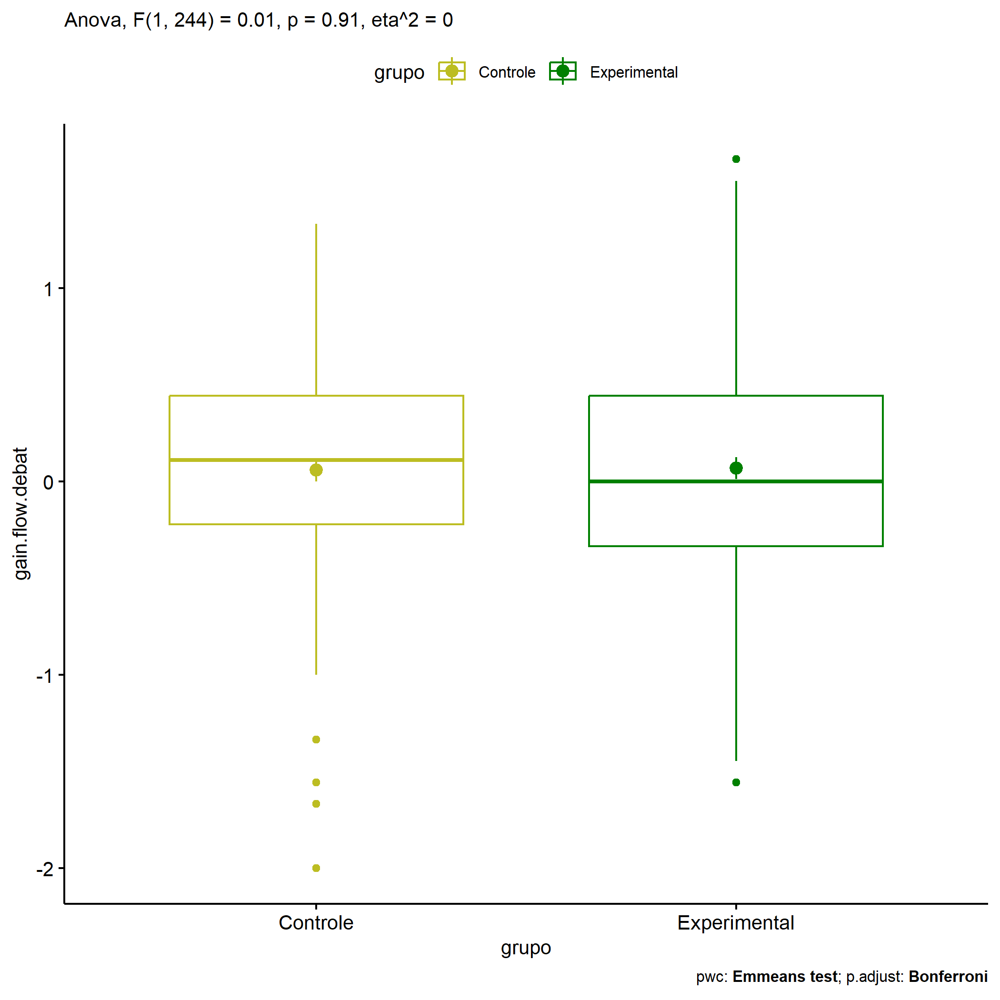
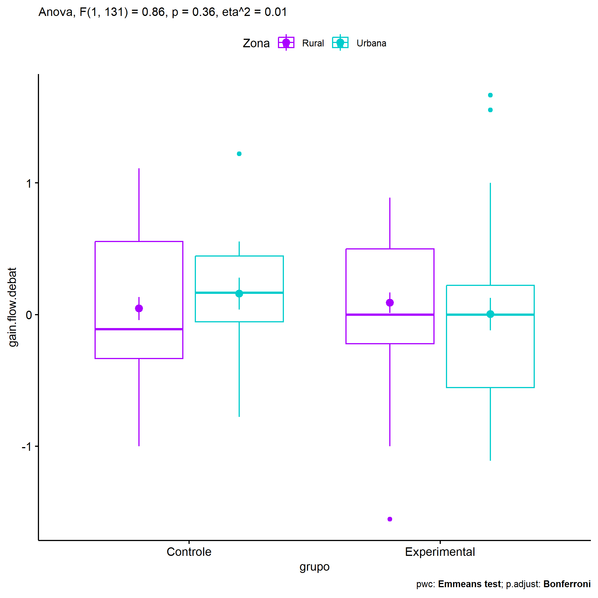
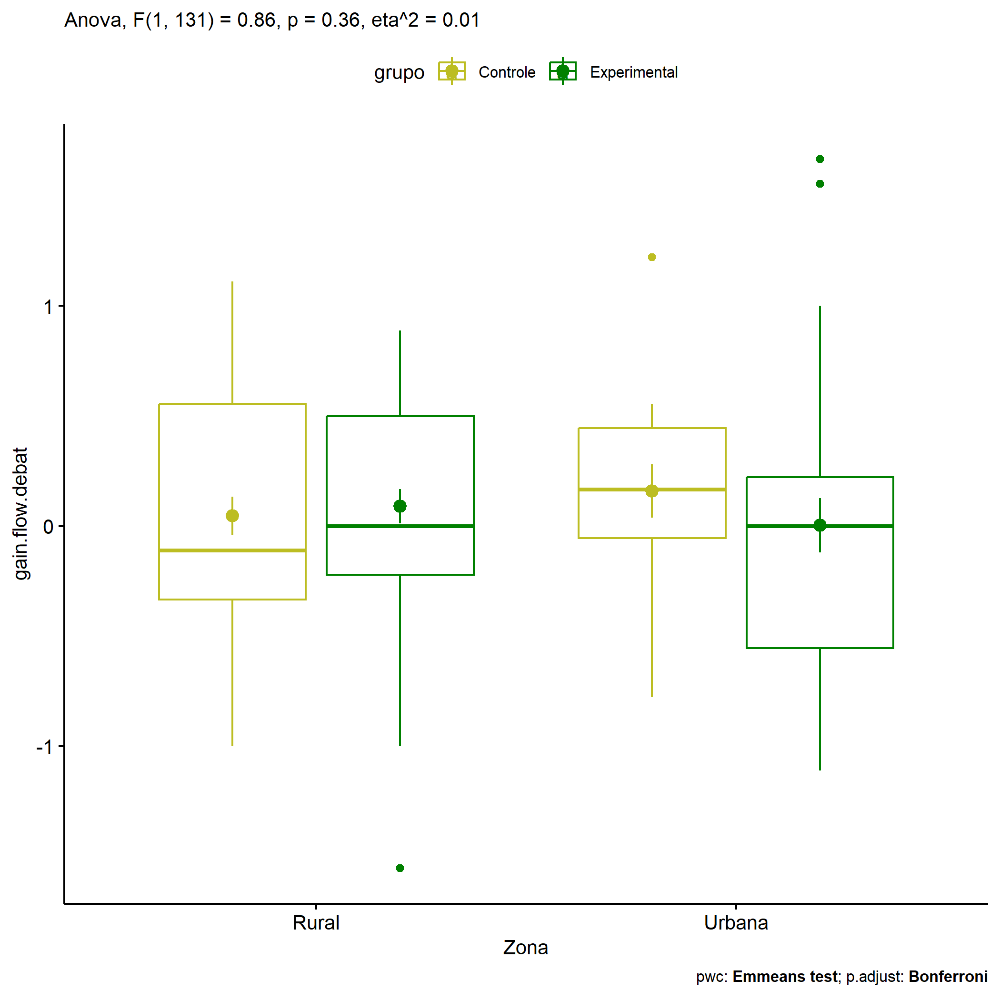
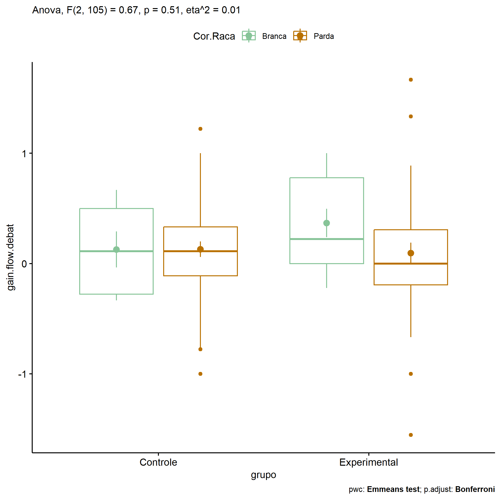
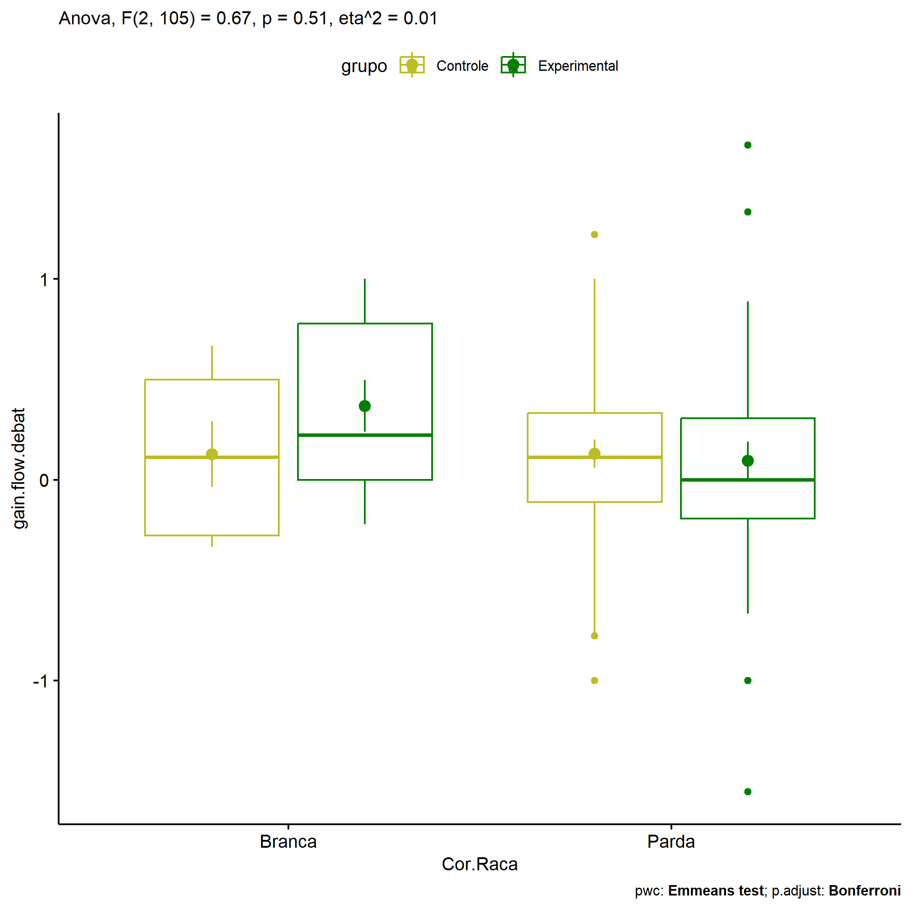

ANOVA in Gains for gain flow (debate) (gain flow (debate))
================
Geiser C. Challco <geiser@alumni.usp.br>

- [Descriptive Statistics of Initial
  Data](#descriptive-statistics-of-initial-data)
- [Checking of Assumptions](#checking-of-assumptions)
  - [Assumption: Normality distribution of
    data](#assumption-normality-distribution-of-data)
  - [Assumption: Homogeneity of data
    distribution](#assumption-homogeneity-of-data-distribution)
- [Computation of ANCOVA test and Pairwise
  Comparison](#computation-of-ancova-test-and-pairwise-comparison)
  - [ANCOVA tests for one factor](#ancova-tests-for-one-factor)
  - [ANCOVA tests for two factors](#ancova-tests-for-two-factors)
  - [Pairwise comparisons for one factor:
    **grupo**](#pairwise-comparisons-for-one-factor-grupo)
  - [Pairwise comparisons for two
    factors](#pairwise-comparisons-for-two-factors)
    - [factores: **grupo:Sexo**](#factores-gruposexo)
    - [factores: **grupo:Zona**](#factores-grupozona)
    - [factores: **grupo:Cor.Raca**](#factores-grupocorraca)

**NOTE**

- Teste ANOVA para determinar se houve diferenças significativas no gain
  flow (debate) (medido usando a diferença entre post-test e
  pre-testes).
- ANOVA test to determine whether there were significant differences in
  gain flow (debate) (measured using the difference between post-test
  and pre-tests).

# Descriptive Statistics of Initial Data

| grupo        | Sexo | Zona   | Cor.Raca | variable        |   n |   mean | median |    min |   max |    sd |    se |    ci |   iqr |
|:-------------|:-----|:-------|:---------|:----------------|----:|-------:|-------:|-------:|------:|------:|------:|------:|------:|
| Controle     | F    |        |          | gain.flow.debat |  47 | -0.043 |  0.000 | -2.000 | 1.333 | 0.688 | 0.100 | 0.202 | 0.722 |
| Controle     | M    |        |          | gain.flow.debat |  57 |  0.145 |  0.111 | -1.667 | 1.111 | 0.508 | 0.067 | 0.135 | 0.667 |
| Experimental | F    |        |          | gain.flow.debat |  69 |  0.080 |  0.000 | -1.556 | 1.667 | 0.632 | 0.076 | 0.152 | 0.889 |
| Experimental | M    |        |          | gain.flow.debat |  73 |  0.059 |  0.000 | -1.556 | 1.667 | 0.712 | 0.083 | 0.166 | 0.778 |
| Controle     |      | Rural  |          | gain.flow.debat |  39 |  0.046 | -0.111 | -1.000 | 1.111 | 0.543 | 0.087 | 0.176 | 0.889 |
| Controle     |      | Urbana |          | gain.flow.debat |  16 |  0.160 |  0.167 | -0.778 | 1.222 | 0.487 | 0.122 | 0.259 | 0.500 |
| Controle     |      |        |          | gain.flow.debat |  49 |  0.039 |  0.111 | -2.000 | 1.333 | 0.679 | 0.097 | 0.195 | 0.444 |
| Experimental |      | Rural  |          | gain.flow.debat |  51 |  0.090 |  0.000 | -1.556 | 0.889 | 0.561 | 0.079 | 0.158 | 0.722 |
| Experimental |      | Urbana |          | gain.flow.debat |  29 |  0.004 |  0.000 | -1.111 | 1.667 | 0.664 | 0.123 | 0.252 | 0.778 |
| Experimental |      |        |          | gain.flow.debat |  62 |  0.083 |  0.000 | -1.556 | 1.667 | 0.762 | 0.097 | 0.193 | 0.861 |
| Controle     |      |        | Branca   | gain.flow.debat |   7 |  0.127 |  0.111 | -0.333 | 0.667 | 0.432 | 0.163 | 0.400 | 0.778 |
| Controle     |      |        | Indígena | gain.flow.debat |   3 |  0.259 |  0.333 | -0.222 | 0.667 | 0.449 | 0.259 | 1.116 | 0.444 |
| Controle     |      |        | Parda    | gain.flow.debat |  43 |  0.130 |  0.111 | -1.000 | 1.222 | 0.457 | 0.070 | 0.141 | 0.444 |
| Controle     |      |        |          | gain.flow.debat |  51 | -0.020 |  0.000 | -2.000 | 1.333 | 0.723 | 0.101 | 0.203 | 0.889 |
| Experimental |      |        | Branca   | gain.flow.debat |  13 |  0.368 |  0.222 | -0.222 | 1.000 | 0.463 | 0.129 | 0.280 | 0.778 |
| Experimental |      |        | Indígena | gain.flow.debat |   3 |  0.037 | -0.111 | -0.222 | 0.444 | 0.357 | 0.206 | 0.887 | 0.333 |
| Experimental |      |        | Parda    | gain.flow.debat |  42 |  0.095 |  0.000 | -1.556 | 1.667 | 0.608 | 0.094 | 0.189 | 0.500 |
| Experimental |      |        |          | gain.flow.debat |  84 |  0.011 | -0.056 | -1.556 | 1.667 | 0.729 | 0.080 | 0.158 | 0.990 |

# Checking of Assumptions

## Assumption: Normality distribution of data

| var             |   n |   skewness |  kurtosis | symmetry | statistic | method     |         p | p.signif | normality |
|:----------------|----:|-----------:|----------:|:---------|----------:|:-----------|----------:|:---------|:----------|
| gain.flow.debat | 246 | -0.0959532 | 0.4688592 | YES      | 2.8777736 | D’Agostino | 0.2371917 | ns       | \-        |
| gain.flow.debat | 135 |  0.1531247 | 0.0985411 | YES      | 0.9827844 | D’Agostino | 0.6117741 | ns       | QQ        |
| gain.flow.debat | 111 |  0.2451092 | 1.4352235 | YES      | 7.5685831 | D’Agostino | 0.0227250 | ns       | QQ        |

## Assumption: Homogeneity of data distribution

| var             | method        | formula                               |   n | df1 | df2 | statistic |         p | p.signif |
|:----------------|:--------------|:--------------------------------------|----:|----:|----:|----------:|----------:|:---------|
| gain.flow.debat | Levene’s test | `gain.flow.debat`~`grupo`\*`Sexo`     | 246 |   3 | 242 | 1.5580791 | 0.2002048 | ns       |
| gain.flow.debat | Levene’s test | `gain.flow.debat`~`grupo`\*`Zona`     | 135 |   3 | 131 | 0.4679396 | 0.7051461 | ns       |
| gain.flow.debat | Levene’s test | `gain.flow.debat`~`grupo`\*`Cor.Raca` | 111 |   5 | 105 | 0.3597699 | 0.8749021 | ns       |

# Computation of ANCOVA test and Pairwise Comparison

## ANCOVA tests for one factor

| Effect   | DFn | DFd |   SSn |     SSd |     F |     p |   ges | p\<.05 |
|:---------|----:|----:|------:|--------:|------:|------:|------:|:-------|
| grupo    |   1 | 244 | 0.005 | 100.741 | 0.012 | 0.912 | 0.000 |        |
| Sexo     |   1 | 244 | 0.270 | 100.475 | 0.657 | 0.418 | 0.003 |        |
| Zona     |   1 | 133 | 0.004 |  43.152 | 0.012 | 0.913 | 0.000 |        |
| Cor.Raca |   2 | 108 | 0.471 |  28.642 | 0.889 | 0.414 | 0.016 |        |

## ANCOVA tests for two factors

|     | Effect         | DFn | DFd |   SSn |    SSd |     F |     p |   ges | p\<.05 |
|:----|:---------------|----:|----:|------:|-------:|------:|------:|------:|:-------|
| 3   | grupo:Sexo     |   1 | 242 | 0.661 | 99.807 | 1.602 | 0.207 | 0.007 |        |
| 6   | grupo:Zona     |   1 | 131 | 0.280 | 42.859 | 0.856 | 0.357 | 0.006 |        |
| 9   | grupo:Cor.Raca |   2 | 105 | 0.363 | 28.279 | 0.673 | 0.512 | 0.013 |        |

## Pairwise comparisons for one factor: **grupo**

| var             | grupo        |   n |     M |    SE |
|:----------------|:-------------|----:|------:|------:|
| gain.flow.debat | Controle     | 104 | 0.060 | 0.059 |
| gain.flow.debat | Experimental | 142 | 0.069 | 0.056 |

| .y.             | group1   | group2       | estimate | conf.low | conf.high |    se | statistic |     p | p.adj | p.adj.signif |
|:----------------|:---------|:-------------|---------:|---------:|----------:|------:|----------:|------:|------:|:-------------|
| gain.flow.debat | Controle | Experimental |   -0.009 |   -0.173 |     0.154 | 0.083 |    -0.111 | 0.912 | 0.912 | ns           |

    ## Scale for colour is already present.
    ## Adding another scale for colour, which will replace the existing scale.

<!-- -->

## Pairwise comparisons for two factors

### factores: **grupo:Sexo**

| var             | grupo        | Sexo |   n |      M |    SE |
|:----------------|:-------------|:-----|----:|-------:|------:|
| gain.flow.debat | Controle     | F    |  47 | -0.043 | 0.100 |
| gain.flow.debat | Controle     | M    |  57 |  0.145 | 0.067 |
| gain.flow.debat | Experimental | F    |  69 |  0.080 | 0.076 |
| gain.flow.debat | Experimental | M    |  73 |  0.059 | 0.083 |

| .y.             | grupo        | Sexo | group1   | group2       | estimate | conf.low | conf.high |    se | statistic |     p | p.adj | p.adj.signif |
|:----------------|:-------------|:-----|:---------|:-------------|---------:|---------:|----------:|------:|----------:|------:|------:|:-------------|
| gain.flow.debat |              | F    | Controle | Experimental |   -0.124 |   -0.363 |     0.115 | 0.121 |    -1.019 | 0.309 | 0.309 | ns           |
| gain.flow.debat |              | M    | Controle | Experimental |    0.087 |   -0.137 |     0.310 | 0.114 |     0.763 | 0.446 | 0.446 | ns           |
| gain.flow.debat | Controle     |      | F        | M            |   -0.189 |   -0.438 |     0.061 | 0.127 |    -1.491 | 0.137 | 0.137 | ns           |
| gain.flow.debat | Experimental |      | F        | M            |    0.022 |   -0.191 |     0.234 | 0.108 |     0.201 | 0.841 | 0.841 | ns           |

    ## Scale for colour is already present.
    ## Adding another scale for colour, which will replace the existing scale.

<!-- -->

    ## Scale for colour is already present.
    ## Adding another scale for colour, which will replace the existing scale.

<!-- -->

### factores: **grupo:Zona**

| var             | grupo        | Zona   |   n |     M |    SE |
|:----------------|:-------------|:-------|----:|------:|------:|
| gain.flow.debat | Controle     | Rural  |  39 | 0.046 | 0.087 |
| gain.flow.debat | Controle     | Urbana |  16 | 0.160 | 0.122 |
| gain.flow.debat | Experimental | Rural  |  51 | 0.090 | 0.079 |
| gain.flow.debat | Experimental | Urbana |  29 | 0.004 | 0.123 |

| .y.             | grupo        | Zona   | group1   | group2       | estimate | conf.low | conf.high |    se | statistic |     p | p.adj | p.adj.signif |
|:----------------|:-------------|:-------|:---------|:-------------|---------:|---------:|----------:|------:|----------:|------:|------:|:-------------|
| gain.flow.debat |              | Rural  | Controle | Experimental |   -0.044 |   -0.284 |     0.197 | 0.122 |    -0.359 | 0.720 | 0.720 | ns           |
| gain.flow.debat |              | Urbana | Controle | Experimental |    0.156 |   -0.196 |     0.508 | 0.178 |     0.875 | 0.383 | 0.383 | ns           |
| gain.flow.debat | Controle     |        | Rural    | Urbana       |   -0.114 |   -0.450 |     0.222 | 0.170 |    -0.670 | 0.504 | 0.504 | ns           |
| gain.flow.debat | Experimental |        | Rural    | Urbana       |    0.086 |   -0.177 |     0.349 | 0.133 |     0.645 | 0.520 | 0.520 | ns           |

    ## Scale for colour is already present.
    ## Adding another scale for colour, which will replace the existing scale.

<!-- -->

    ## Scale for colour is already present.
    ## Adding another scale for colour, which will replace the existing scale.

<!-- -->

### factores: **grupo:Cor.Raca**

| var             | grupo        | Cor.Raca |   n |     M |    SE |
|:----------------|:-------------|:---------|----:|------:|------:|
| gain.flow.debat | Controle     | Branca   |   7 | 0.127 | 0.163 |
| gain.flow.debat | Controle     | Parda    |  43 | 0.130 | 0.070 |
| gain.flow.debat | Experimental | Branca   |  13 | 0.368 | 0.129 |
| gain.flow.debat | Experimental | Parda    |  42 | 0.095 | 0.094 |

| .y.             | grupo        | Cor.Raca | group1   | group2       | estimate | conf.low | conf.high |    se | statistic |     p | p.adj | p.adj.signif |
|:----------------|:-------------|:---------|:---------|:-------------|---------:|---------:|----------:|------:|----------:|------:|------:|:-------------|
| gain.flow.debat |              | Branca   | Controle | Experimental |   -0.241 |   -0.727 |     0.246 | 0.245 |    -0.981 | 0.329 | 0.329 | ns           |
| gain.flow.debat |              | Parda    | Controle | Experimental |    0.035 |   -0.190 |     0.260 | 0.113 |     0.305 | 0.761 | 0.761 | ns           |
| gain.flow.debat | Controle     |          | Branca   | Parda        |   -0.003 |   -0.426 |     0.420 | 0.213 |    -0.013 | 0.989 | 0.989 | ns           |
| gain.flow.debat | Experimental |          | Branca   | Parda        |    0.272 |   -0.057 |     0.602 | 0.166 |     1.641 | 0.104 | 0.104 | ns           |

    ## Scale for colour is already present.
    ## Adding another scale for colour, which will replace the existing scale.

<!-- -->

    ## Scale for colour is already present.
    ## Adding another scale for colour, which will replace the existing scale.

<!-- -->
