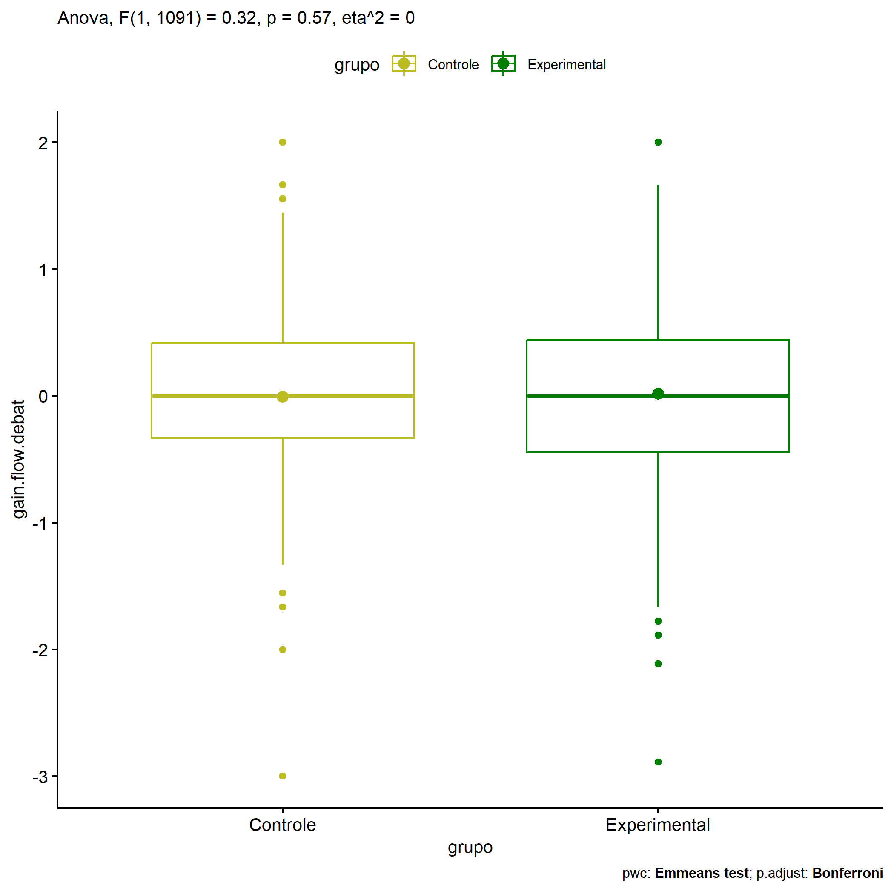
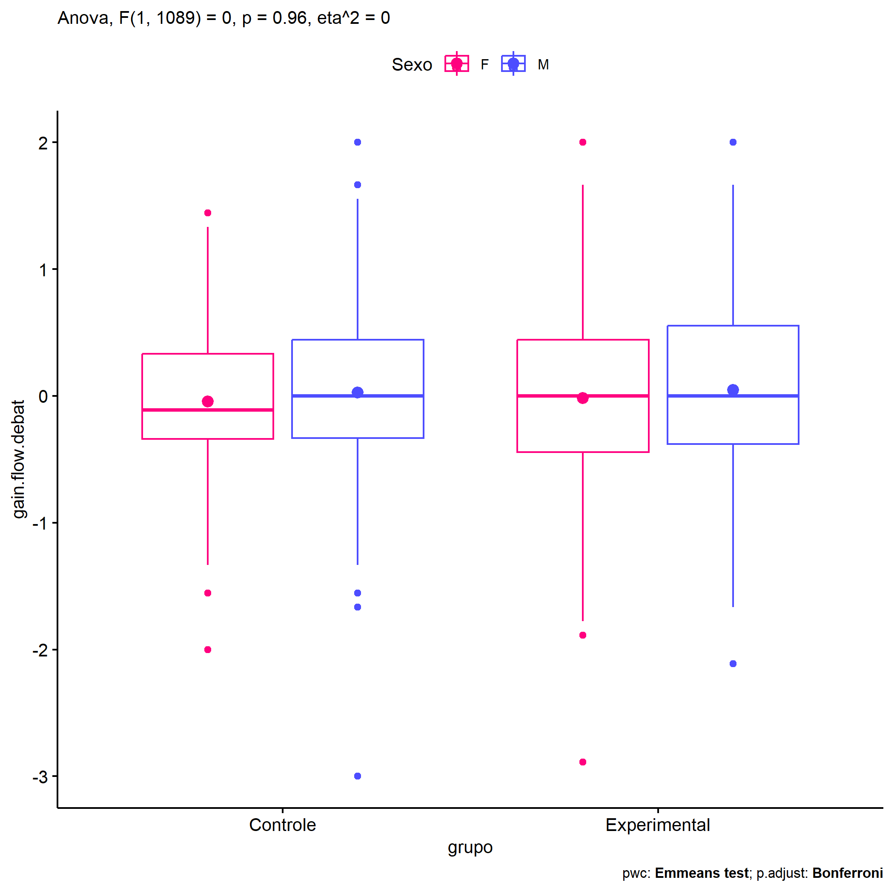
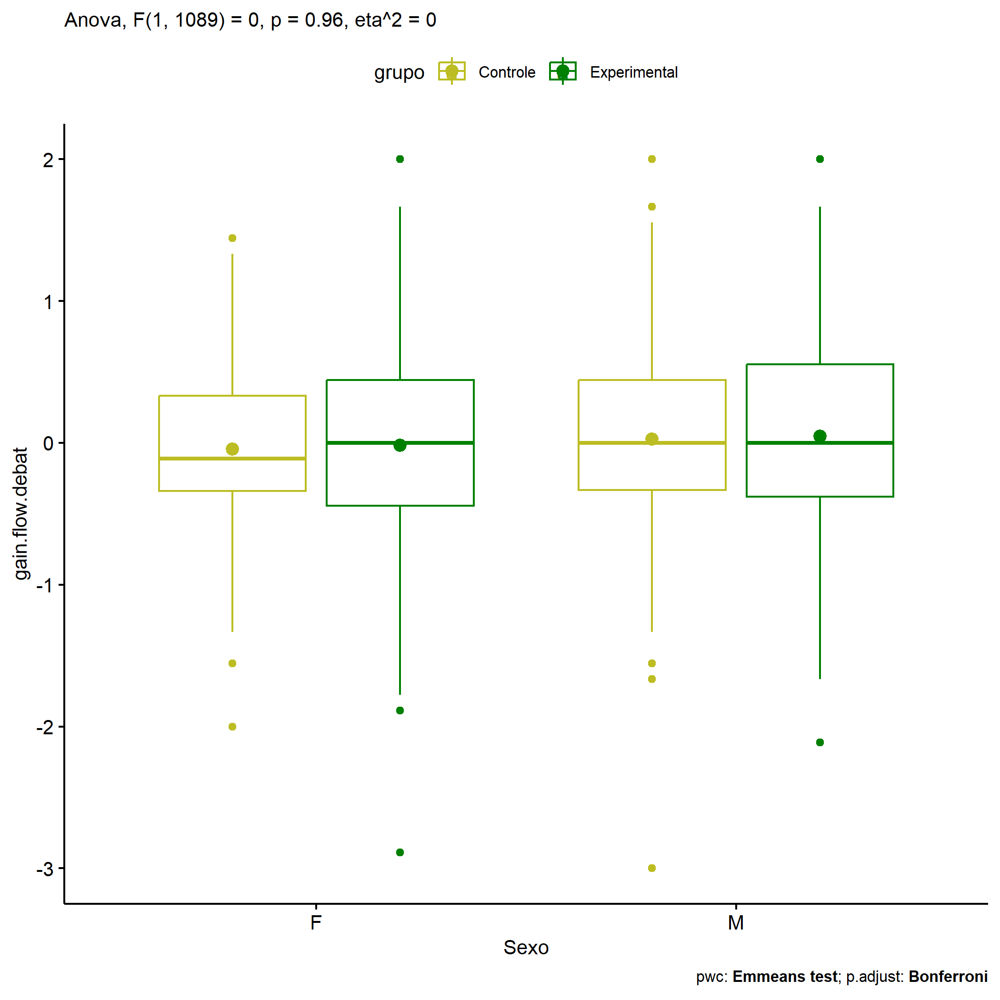
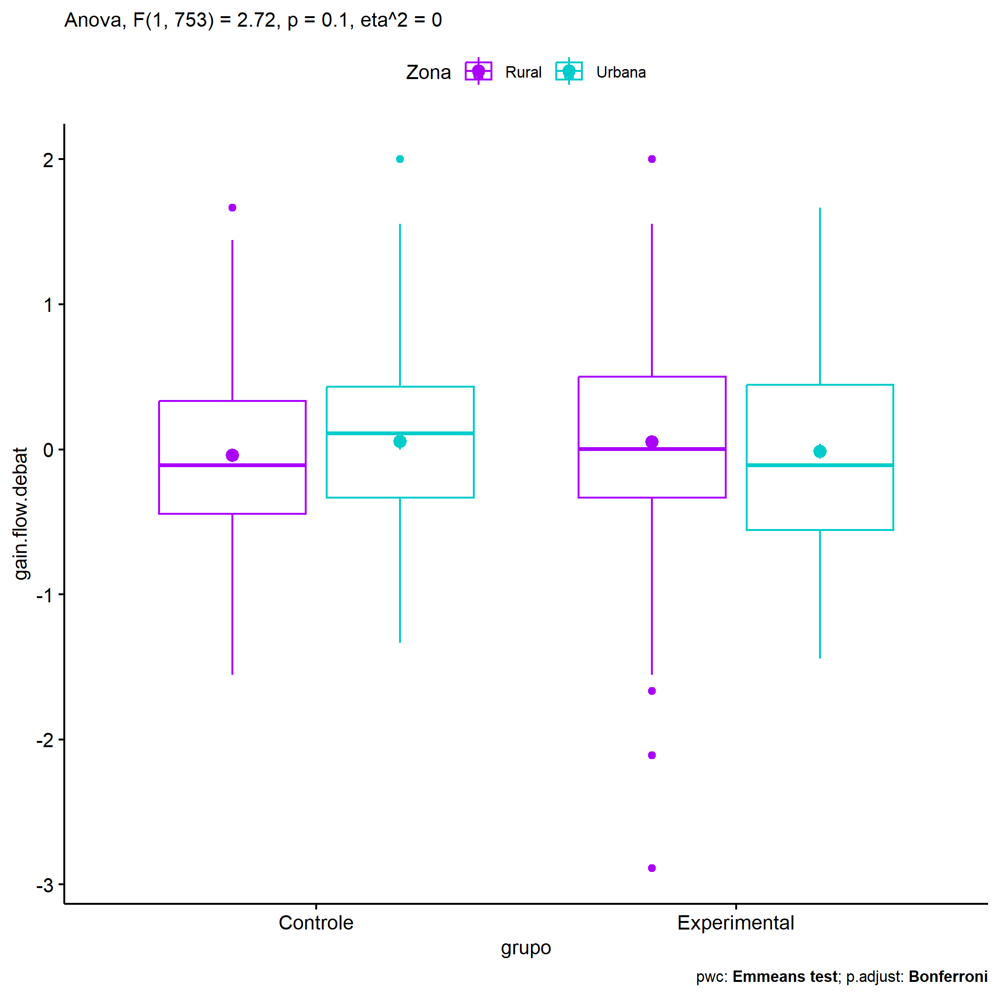
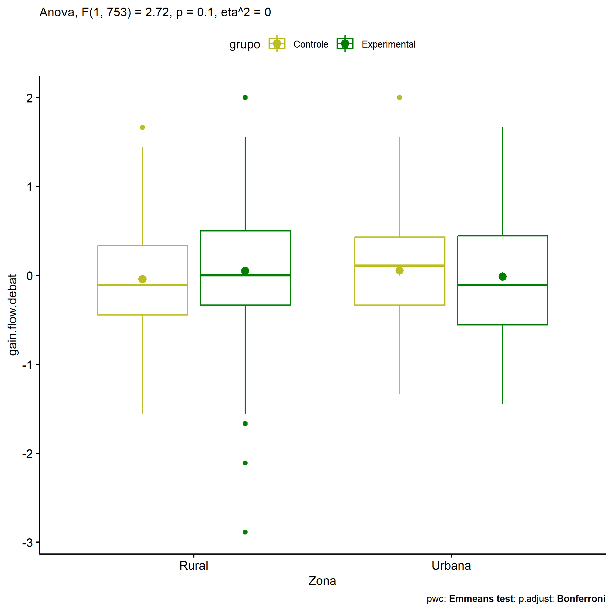
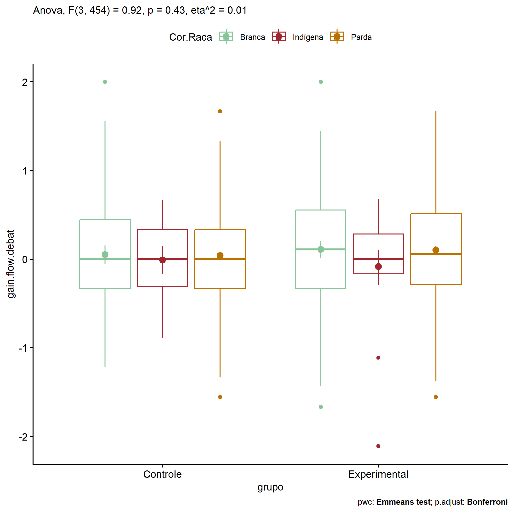
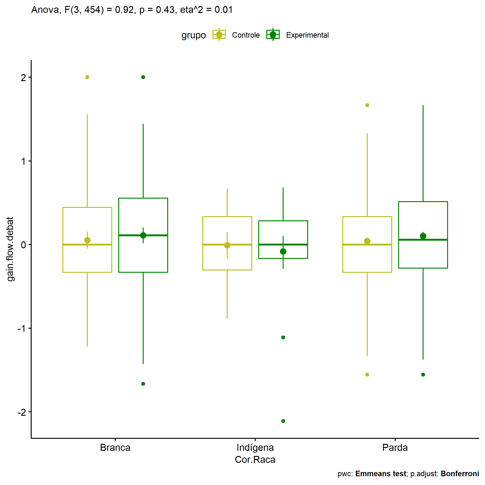

ANOVA in Gains for gain flow (debate) (gain flow (debate))
================
Geiser C. Challco <geiser@alumni.usp.br>

- [Descriptive Statistics of Initial
  Data](#descriptive-statistics-of-initial-data)
- [Checking of Assumptions](#checking-of-assumptions)
  - [Assumption: Normality distribution of
    data](#assumption-normality-distribution-of-data)
  - [Assumption: Homogeneity of data
    distribution](#assumption-homogeneity-of-data-distribution)
- [Computation of ANCOVA test and Pairwise
  Comparison](#computation-of-ancova-test-and-pairwise-comparison)
  - [ANCOVA tests for one factor](#ancova-tests-for-one-factor)
  - [ANCOVA tests for two factors](#ancova-tests-for-two-factors)
  - [Pairwise comparisons for one factor:
    **grupo**](#pairwise-comparisons-for-one-factor-grupo)
  - [Pairwise comparisons for two
    factors](#pairwise-comparisons-for-two-factors)
    - [factores: **grupo:Sexo**](#factores-gruposexo)
    - [factores: **grupo:Zona**](#factores-grupozona)
    - [factores: **grupo:Cor.Raca**](#factores-grupocorraca)

**NOTE**

- Teste ANOVA para determinar se houve diferenças significativas no gain
  flow (debate) (medido usando a diferença entre post-test e
  pre-testes).
- ANOVA test to determine whether there were significant differences in
  gain flow (debate) (measured using the difference between post-test
  and pre-tests).

# Descriptive Statistics of Initial Data

| grupo        | Sexo | Zona   | Cor.Raca | variable        |   n |   mean | median |    min |    max |    sd |    se |    ci |   iqr |
|:-------------|:-----|:-------|:---------|:----------------|----:|-------:|-------:|-------:|-------:|------:|------:|------:|------:|
| Controle     | F    |        |          | gain.flow.debat | 227 | -0.042 | -0.111 | -2.000 |  1.444 | 0.570 | 0.038 | 0.075 | 0.674 |
| Controle     | M    |        |          | gain.flow.debat | 228 |  0.027 |  0.000 | -3.000 |  2.000 | 0.640 | 0.042 | 0.084 | 0.778 |
| Experimental | F    |        |          | gain.flow.debat | 326 | -0.016 |  0.000 | -2.889 |  2.000 | 0.672 | 0.037 | 0.073 | 0.889 |
| Experimental | M    |        |          | gain.flow.debat | 312 |  0.048 |  0.000 | -2.111 |  2.000 | 0.728 | 0.041 | 0.081 | 0.934 |
| Controle     |      | Rural  |          | gain.flow.debat | 225 | -0.041 | -0.111 | -1.556 |  1.667 | 0.567 | 0.038 | 0.075 | 0.778 |
| Controle     |      | Urbana |          | gain.flow.debat | 110 |  0.053 |  0.111 | -1.333 |  2.000 | 0.562 | 0.054 | 0.106 | 0.764 |
| Controle     |      |        |          | gain.flow.debat | 120 | -0.001 |  0.000 | -3.000 |  1.556 | 0.709 | 0.065 | 0.128 | 0.814 |
| Experimental |      | Rural  |          | gain.flow.debat | 249 |  0.051 |  0.003 | -2.889 |  2.000 | 0.672 | 0.043 | 0.084 | 0.833 |
| Experimental |      | Urbana |          | gain.flow.debat | 173 | -0.013 | -0.111 | -1.444 |  1.667 | 0.688 | 0.052 | 0.103 | 1.000 |
| Experimental |      |        |          | gain.flow.debat | 216 | -0.003 |  0.000 | -1.889 |  2.000 | 0.743 | 0.051 | 0.100 | 1.000 |
| Controle     |      |        | Branca   | gain.flow.debat |  47 |  0.052 |  0.000 | -1.222 |  2.000 | 0.697 | 0.102 | 0.205 | 0.778 |
| Controle     |      |        | Indígena | gain.flow.debat |  10 | -0.008 |  0.000 | -0.889 |  0.667 | 0.502 | 0.159 | 0.359 | 0.639 |
| Controle     |      |        | Parda    | gain.flow.debat | 159 |  0.041 |  0.000 | -1.556 |  1.667 | 0.552 | 0.044 | 0.086 | 0.667 |
| Controle     |      |        | Preta    | gain.flow.debat |   1 | -0.222 | -0.222 | -0.222 | -0.222 |       |       |       | 0.000 |
| Controle     |      |        |          | gain.flow.debat | 238 | -0.051 | -0.069 | -3.000 |  1.556 | 0.627 | 0.041 | 0.080 | 0.889 |
| Experimental |      |        | Amarela  | gain.flow.debat |   1 |  0.111 |  0.111 |  0.111 |  0.111 |       |       |       | 0.000 |
| Experimental |      |        | Branca   | gain.flow.debat |  57 |  0.110 |  0.111 | -1.667 |  2.000 | 0.707 | 0.094 | 0.188 | 0.889 |
| Experimental |      |        | Indígena | gain.flow.debat |  15 | -0.083 |  0.000 | -2.111 |  0.681 | 0.714 | 0.184 | 0.395 | 0.451 |
| Experimental |      |        | Parda    | gain.flow.debat | 172 |  0.102 |  0.057 | -1.556 |  1.667 | 0.632 | 0.048 | 0.095 | 0.795 |
| Experimental |      |        | Preta    | gain.flow.debat |   1 |  1.222 |  1.222 |  1.222 |  1.222 |       |       |       | 0.000 |
| Experimental |      |        |          | gain.flow.debat | 392 | -0.036 | -0.111 | -2.889 |  2.000 | 0.723 | 0.037 | 0.072 | 1.000 |

# Checking of Assumptions

## Assumption: Normality distribution of data

| var             |    n |   skewness |  kurtosis | symmetry | statistic | method     |         p | p.signif | normality |
|:----------------|-----:|-----------:|----------:|:---------|----------:|:-----------|----------:|:---------|:----------|
| gain.flow.debat | 1093 | -0.1601775 | 0.5484892 | YES      | 14.343209 | D’Agostino | 0.0007681 | \*\*     | \-        |
| gain.flow.debat |  757 | -0.0432806 | 0.5208914 | YES      |  6.738355 | D’Agostino | 0.0344179 | ns       | \-        |
| gain.flow.debat |  463 | -0.0251645 | 0.3962785 | YES      |  2.987143 | D’Agostino | 0.2245692 | ns       | \-        |

## Assumption: Homogeneity of data distribution

| var             | method        | formula                               |    n | df1 |  df2 | statistic |         p | p.signif |
|:----------------|:--------------|:--------------------------------------|-----:|----:|-----:|----------:|----------:|:---------|
| gain.flow.debat | Levene’s test | `gain.flow.debat`~`grupo`\*`Sexo`     | 1093 |   3 | 1089 |  4.647664 | 0.0031008 | \*       |
| gain.flow.debat | Levene’s test | `gain.flow.debat`~`grupo`\*`Zona`     |  757 |   3 |  753 |  3.426358 | 0.0168141 | ns       |
| gain.flow.debat | Levene’s test | `gain.flow.debat`~`grupo`\*`Cor.Raca` |  463 |   8 |  454 |  1.329058 | 0.2267094 | ns       |

# Computation of ANCOVA test and Pairwise Comparison

## ANCOVA tests for one factor

| Effect   | DFn |  DFd |   SSn |     SSd |     F |     p |   ges | p\<.05 |
|:---------|----:|-----:|------:|--------:|------:|------:|------:|:-------|
| grupo    |   1 | 1091 | 0.141 | 479.332 | 0.320 | 0.572 | 0.000 |        |
| Sexo     |   1 | 1091 | 1.200 | 478.273 | 2.738 | 0.098 | 0.003 |        |
| Zona     |   1 |  755 | 0.005 | 301.013 | 0.013 | 0.909 | 0.000 |        |
| Cor.Raca |   4 |  458 | 0.774 | 177.619 | 0.499 | 0.737 | 0.004 |        |

## ANCOVA tests for two factors

|     | Effect         | DFn |  DFd |   SSn |     SSd |     F |     p |   ges | p\<.05 |
|:----|:---------------|----:|-----:|------:|--------:|------:|------:|------:|:-------|
| 3   | grupo:Sexo     |   1 | 1089 | 0.001 | 478.121 | 0.003 | 0.957 | 0.000 |        |
| 6   | grupo:Zona     |   1 |  753 | 1.083 | 299.706 | 2.721 | 0.099 | 0.004 |        |
| 9   | grupo:Cor.Raca |   3 |  454 | 1.068 | 176.145 | 0.918 | 0.432 | 0.006 |        |

## Pairwise comparisons for one factor: **grupo**

| var             | grupo        |   n |      M |    SE |
|:----------------|:-------------|----:|-------:|------:|
| gain.flow.debat | Controle     | 455 | -0.008 | 0.028 |
| gain.flow.debat | Experimental | 638 |  0.015 | 0.028 |

| .y.             | group1   | group2       | estimate | conf.low | conf.high |    se | statistic |     p | p.adj | p.adj.signif |
|:----------------|:---------|:-------------|---------:|---------:|----------:|------:|----------:|------:|------:|:-------------|
| gain.flow.debat | Controle | Experimental |   -0.023 |   -0.103 |     0.057 | 0.041 |    -0.566 | 0.572 | 0.572 | ns           |

    ## Scale for colour is already present.
    ## Adding another scale for colour, which will replace the existing scale.

<!-- -->

## Pairwise comparisons for two factors

### factores: **grupo:Sexo**

| var             | grupo        | Sexo |   n |      M |    SE |
|:----------------|:-------------|:-----|----:|-------:|------:|
| gain.flow.debat | Controle     | F    | 227 | -0.042 | 0.038 |
| gain.flow.debat | Controle     | M    | 228 |  0.027 | 0.042 |
| gain.flow.debat | Experimental | F    | 326 | -0.016 | 0.037 |
| gain.flow.debat | Experimental | M    | 312 |  0.048 | 0.041 |

| .y.             | grupo        | Sexo | group1   | group2       | estimate | conf.low | conf.high |    se | statistic |     p | p.adj | p.adj.signif |
|:----------------|:-------------|:-----|:---------|:-------------|---------:|---------:|----------:|------:|----------:|------:|------:|:-------------|
| gain.flow.debat |              | F    | Controle | Experimental |   -0.026 |   -0.138 |     0.086 | 0.057 |    -0.454 | 0.650 | 0.650 | ns           |
| gain.flow.debat |              | M    | Controle | Experimental |   -0.022 |   -0.135 |     0.092 | 0.058 |    -0.375 | 0.708 | 0.708 | ns           |
| gain.flow.debat | Controle     |      | F        | M            |   -0.069 |   -0.191 |     0.053 | 0.062 |    -1.112 | 0.266 | 0.266 | ns           |
| gain.flow.debat | Experimental |      | F        | M            |   -0.065 |   -0.168 |     0.038 | 0.052 |    -1.234 | 0.218 | 0.218 | ns           |

    ## Scale for colour is already present.
    ## Adding another scale for colour, which will replace the existing scale.

<!-- -->

    ## Scale for colour is already present.
    ## Adding another scale for colour, which will replace the existing scale.

<!-- -->

### factores: **grupo:Zona**

| var             | grupo        | Zona   |   n |      M |    SE |
|:----------------|:-------------|:-------|----:|-------:|------:|
| gain.flow.debat | Controle     | Rural  | 225 | -0.041 | 0.038 |
| gain.flow.debat | Controle     | Urbana | 110 |  0.053 | 0.054 |
| gain.flow.debat | Experimental | Rural  | 249 |  0.051 | 0.043 |
| gain.flow.debat | Experimental | Urbana | 173 | -0.013 | 0.052 |

| .y.             | grupo        | Zona   | group1   | group2       | estimate | conf.low | conf.high |    se | statistic |     p | p.adj | p.adj.signif |
|:----------------|:-------------|:-------|:---------|:-------------|---------:|---------:|----------:|------:|----------:|------:|------:|:-------------|
| gain.flow.debat |              | Rural  | Controle | Experimental |   -0.092 |   -0.206 |     0.022 | 0.058 |    -1.592 | 0.112 | 0.112 | ns           |
| gain.flow.debat |              | Urbana | Controle | Experimental |    0.067 |   -0.084 |     0.218 | 0.077 |     0.866 | 0.387 | 0.387 | ns           |
| gain.flow.debat | Controle     |        | Rural    | Urbana       |   -0.095 |   -0.239 |     0.049 | 0.073 |    -1.290 | 0.198 | 0.198 | ns           |
| gain.flow.debat | Experimental |        | Rural    | Urbana       |    0.064 |   -0.058 |     0.187 | 0.062 |     1.030 | 0.303 | 0.303 | ns           |

    ## Scale for colour is already present.
    ## Adding another scale for colour, which will replace the existing scale.

<!-- -->

    ## Scale for colour is already present.
    ## Adding another scale for colour, which will replace the existing scale.

<!-- -->

### factores: **grupo:Cor.Raca**

| var             | grupo        | Cor.Raca |   n |      M |    SE |
|:----------------|:-------------|:---------|----:|-------:|------:|
| gain.flow.debat | Controle     | Branca   |  47 |  0.052 | 0.102 |
| gain.flow.debat | Controle     | Indígena |  10 | -0.008 | 0.159 |
| gain.flow.debat | Controle     | Parda    | 159 |  0.041 | 0.044 |
| gain.flow.debat | Experimental | Branca   |  57 |  0.110 | 0.094 |
| gain.flow.debat | Experimental | Indígena |  15 | -0.083 | 0.184 |
| gain.flow.debat | Experimental | Parda    | 172 |  0.102 | 0.048 |

| .y.             | grupo        | Cor.Raca | group1   | group2       | estimate | conf.low | conf.high |    se | statistic |     p | p.adj | p.adj.signif |
|:----------------|:-------------|:---------|:---------|:-------------|---------:|---------:|----------:|------:|----------:|------:|------:|:-------------|
| gain.flow.debat |              | Branca   | Controle | Experimental |   -0.058 |   -0.299 |     0.184 | 0.123 |    -0.470 | 0.639 | 0.639 | ns           |
| gain.flow.debat |              | Indígena | Controle | Experimental |    0.075 |   -0.425 |     0.575 | 0.254 |     0.295 | 0.768 | 0.768 | ns           |
| gain.flow.debat |              | Parda    | Controle | Experimental |   -0.061 |   -0.196 |     0.073 | 0.069 |    -0.896 | 0.371 | 0.371 | ns           |
| gain.flow.debat | Controle     |          | Branca   | Indígena     |    0.060 |   -0.366 |     0.487 | 0.217 |     0.278 | 0.781 | 1.000 | ns           |
| gain.flow.debat | Controle     |          | Branca   | Parda        |    0.011 |   -0.192 |     0.214 | 0.103 |     0.106 | 0.915 | 1.000 | ns           |
| gain.flow.debat | Controle     |          | Indígena | Parda        |   -0.049 |   -0.448 |     0.350 | 0.203 |    -0.243 | 0.808 | 1.000 | ns           |
| gain.flow.debat | Experimental |          | Branca   | Indígena     |    0.193 |   -0.162 |     0.548 | 0.181 |     1.068 | 0.286 | 0.858 | ns           |
| gain.flow.debat | Experimental |          | Branca   | Parda        |    0.007 |   -0.180 |     0.194 | 0.095 |     0.076 | 0.939 | 1.000 | ns           |
| gain.flow.debat | Experimental |          | Indígena | Parda        |   -0.186 |   -0.515 |     0.144 | 0.168 |    -1.108 | 0.269 | 0.806 | ns           |

    ## Scale for colour is already present.
    ## Adding another scale for colour, which will replace the existing scale.

<!-- -->

    ## Scale for colour is already present.
    ## Adding another scale for colour, which will replace the existing scale.

<!-- -->
