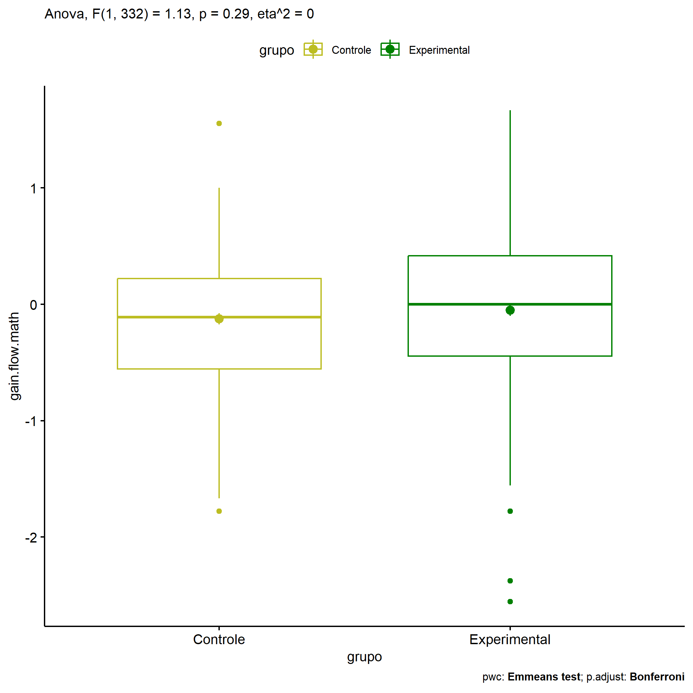
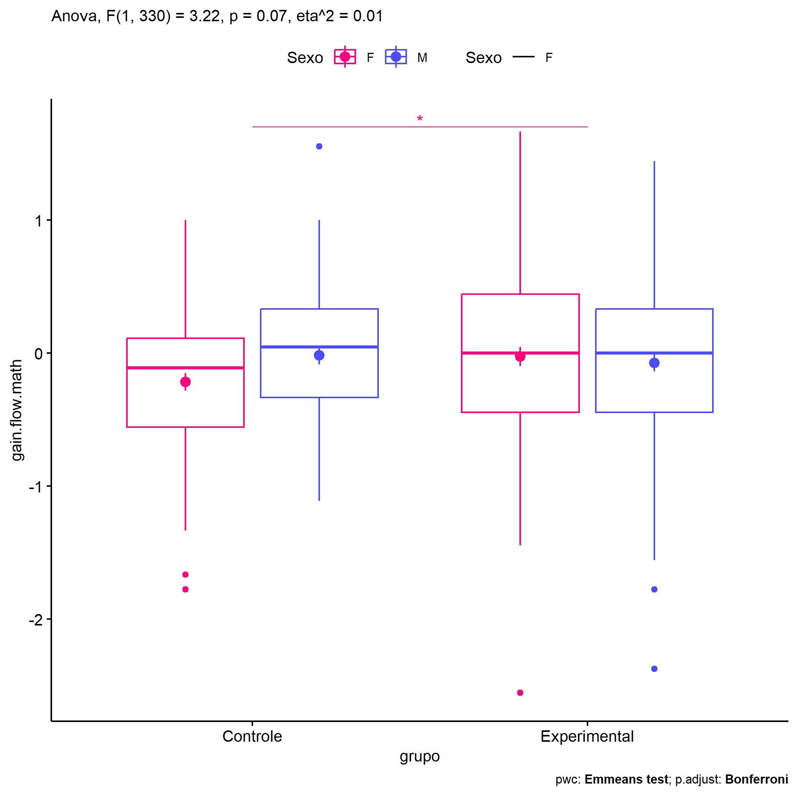
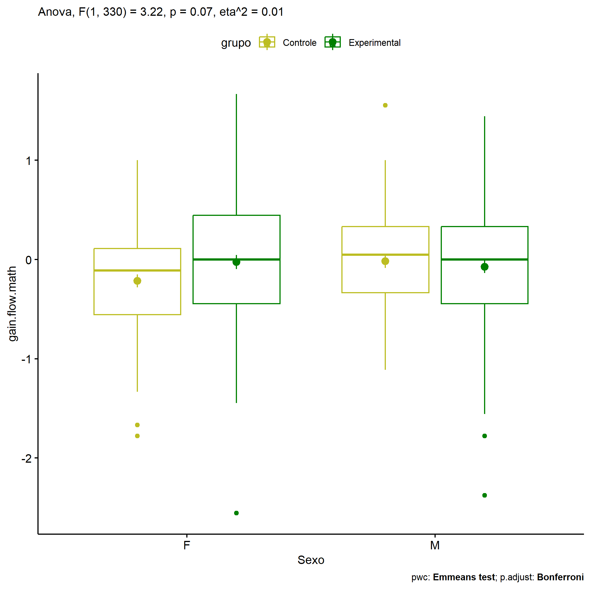
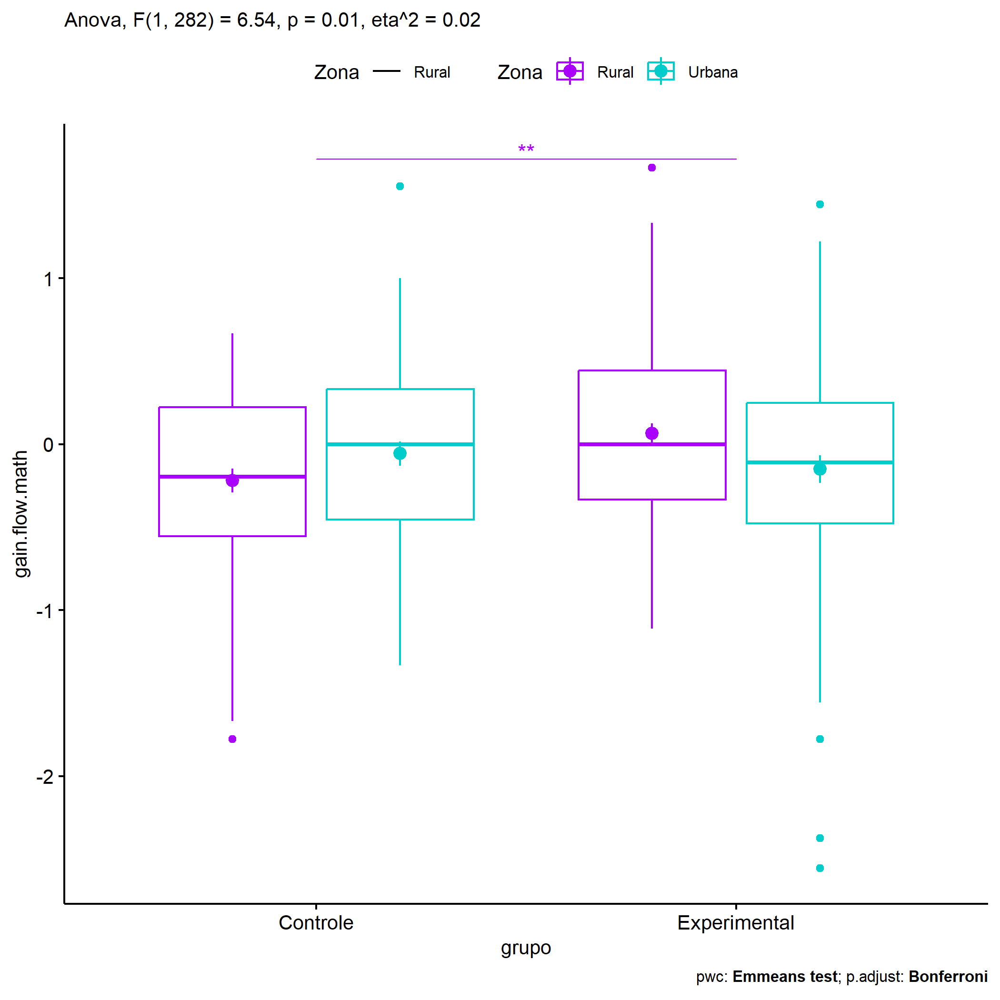
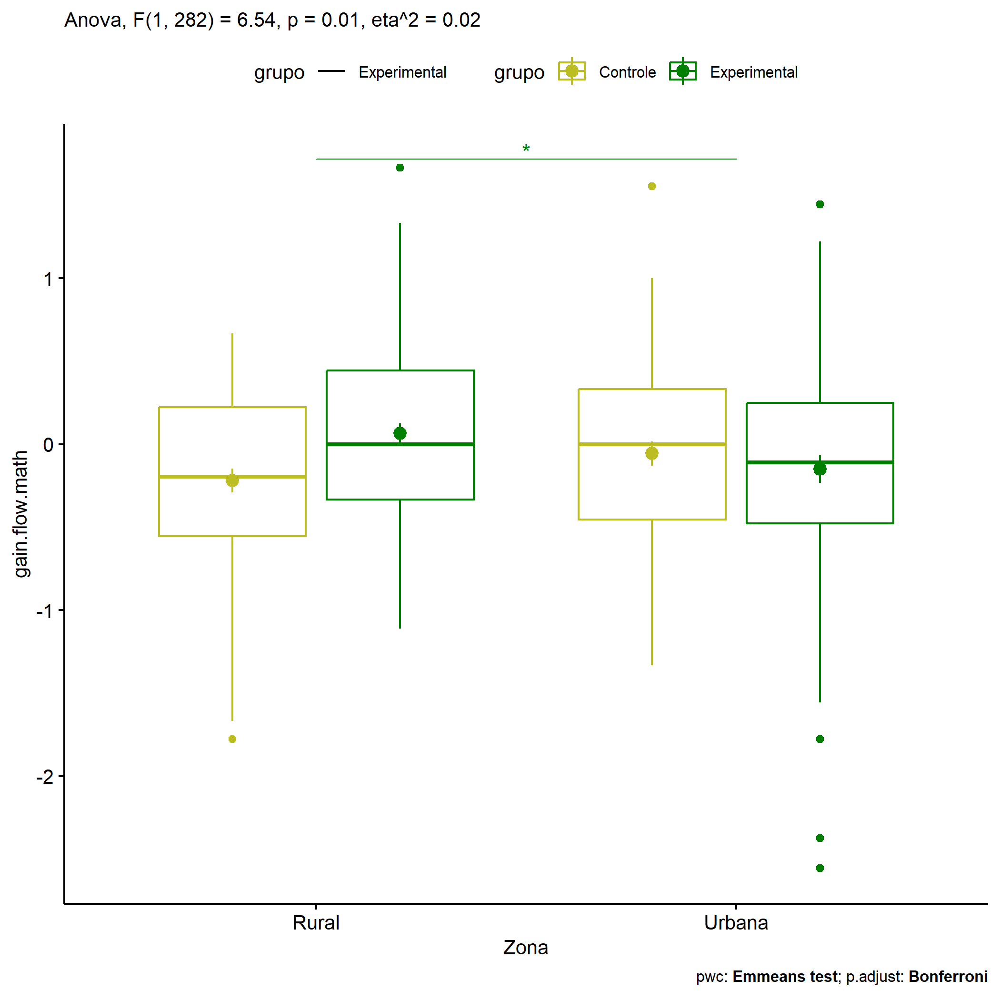
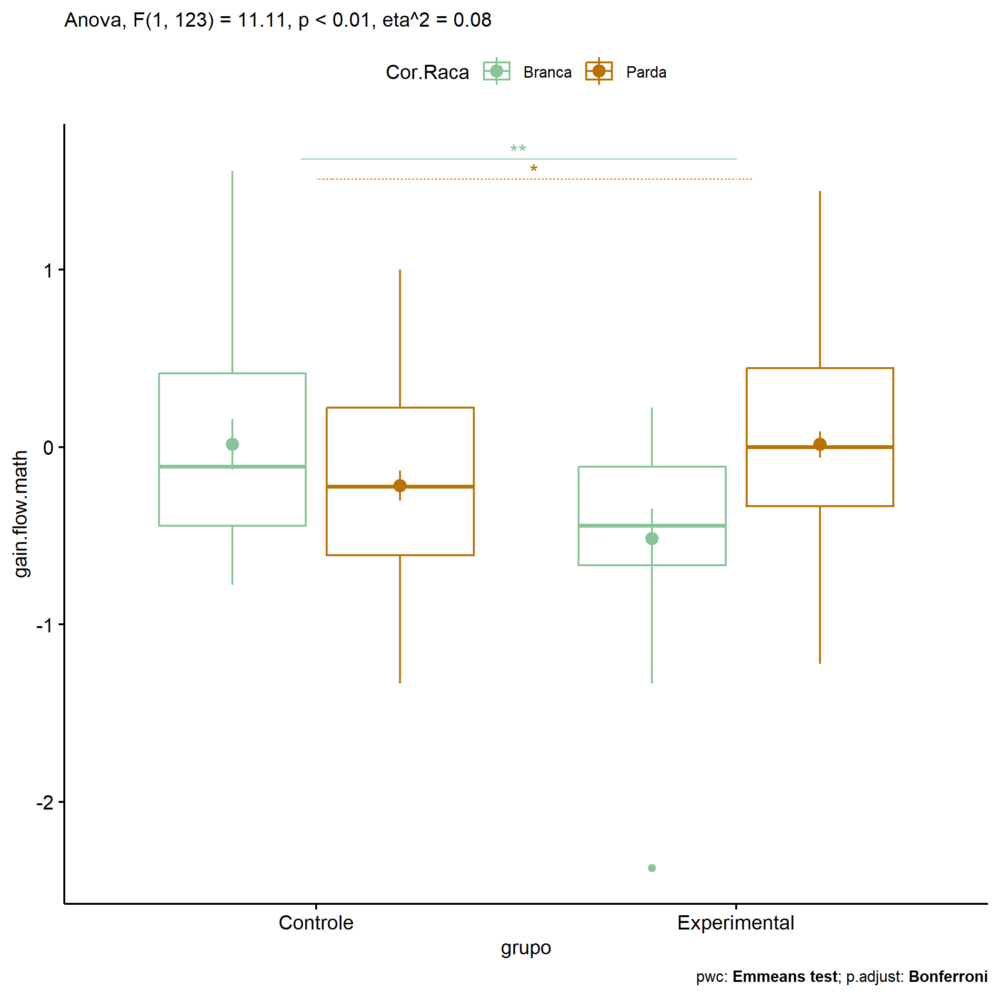

ANOVA in Gains for gain flow (prob. matemática) (gain flow (prob.
matemática))
================
Geiser C. Challco <geiser@alumni.usp.br>

- [Descriptive Statistics of Initial
  Data](#descriptive-statistics-of-initial-data)
- [Checking of Assumptions](#checking-of-assumptions)
  - [Assumption: Normality distribution of
    data](#assumption-normality-distribution-of-data)
  - [Assumption: Homogeneity of data
    distribution](#assumption-homogeneity-of-data-distribution)
- [Computation of ANCOVA test and Pairwise
  Comparison](#computation-of-ancova-test-and-pairwise-comparison)
  - [ANCOVA tests for one factor](#ancova-tests-for-one-factor)
  - [ANCOVA tests for two factors](#ancova-tests-for-two-factors)
  - [Pairwise comparisons for one factor:
    **grupo**](#pairwise-comparisons-for-one-factor-grupo)
  - [Pairwise comparisons for two
    factors](#pairwise-comparisons-for-two-factors)
    - [factores: **grupo:Sexo**](#factores-gruposexo)
    - [factores: **grupo:Zona**](#factores-grupozona)
    - [factores: **grupo:Cor.Raca**](#factores-grupocorraca)

**NOTE**

- Teste ANOVA para determinar se houve diferenças significativas no gain
  flow (prob. matemática) (medido usando a diferença entre post-test e
  pre-testes).
- ANOVA test to determine whether there were significant differences in
  gain flow (prob. matemática) (measured using the difference between
  post-test and pre-tests).

# Descriptive Statistics of Initial Data

| grupo        | Sexo | Zona   | Cor.Raca | variable       |   n |   mean | median |    min |   max |    sd |    se |    ci |   iqr |
|:-------------|:-----|:-------|:---------|:---------------|----:|-------:|-------:|-------:|------:|------:|------:|------:|------:|
| Controle     | F    |        |          | gain.flow.math |  74 | -0.216 | -0.111 | -1.778 | 1.000 | 0.561 | 0.065 | 0.130 | 0.667 |
| Controle     | M    |        |          | gain.flow.math |  62 | -0.016 |  0.048 | -1.111 | 1.556 | 0.543 | 0.069 | 0.138 | 0.667 |
| Experimental | F    |        |          | gain.flow.math |  95 | -0.026 |  0.000 | -2.556 | 1.667 | 0.694 | 0.071 | 0.141 | 0.889 |
| Experimental | M    |        |          | gain.flow.math | 103 | -0.074 |  0.000 | -2.375 | 1.444 | 0.635 | 0.063 | 0.124 | 0.778 |
| Controle     |      | Rural  |          | gain.flow.math |  58 | -0.219 | -0.194 | -1.778 | 0.667 | 0.550 | 0.072 | 0.145 | 0.778 |
| Controle     |      | Urbana |          | gain.flow.math |  60 | -0.057 |  0.000 | -1.333 | 1.556 | 0.567 | 0.073 | 0.146 | 0.788 |
| Controle     |      |        |          | gain.flow.math |  18 | -0.051 |  0.056 | -1.000 | 0.792 | 0.554 | 0.131 | 0.275 | 0.639 |
| Experimental |      | Rural  |          | gain.flow.math |  88 |  0.066 |  0.000 | -1.111 | 1.667 | 0.548 | 0.058 | 0.116 | 0.778 |
| Experimental |      | Urbana |          | gain.flow.math |  80 | -0.149 | -0.111 | -2.556 | 1.444 | 0.748 | 0.084 | 0.167 | 0.726 |
| Experimental |      |        |          | gain.flow.math |  30 | -0.134 | -0.111 | -1.333 | 1.444 | 0.695 | 0.127 | 0.260 | 0.962 |
| Controle     |      |        | Branca   | gain.flow.math |  18 |  0.016 | -0.111 | -0.778 | 1.556 | 0.606 | 0.143 | 0.301 | 0.861 |
| Controle     |      |        | Indígena | gain.flow.math |   4 | -0.083 |  0.056 | -1.111 | 0.667 | 0.756 | 0.378 | 1.202 | 0.694 |
| Controle     |      |        | Parda    | gain.flow.math |  43 | -0.217 | -0.222 | -1.333 | 1.000 | 0.552 | 0.084 | 0.170 | 0.833 |
| Controle     |      |        |          | gain.flow.math |  71 | -0.107 |  0.000 | -1.778 | 1.000 | 0.545 | 0.065 | 0.129 | 0.708 |
| Experimental |      |        | Branca   | gain.flow.math |  15 | -0.515 | -0.444 | -2.375 | 0.222 | 0.653 | 0.169 | 0.362 | 0.556 |
| Experimental |      |        | Parda    | gain.flow.math |  48 |  0.014 |  0.000 | -1.222 | 1.444 | 0.504 | 0.073 | 0.146 | 0.778 |
| Experimental |      |        |          | gain.flow.math | 135 | -0.023 |  0.000 | -2.556 | 1.667 | 0.697 | 0.060 | 0.119 | 0.889 |

# Checking of Assumptions

## Assumption: Normality distribution of data

| var            |   n |   skewness |  kurtosis | symmetry | statistic | method     |         p | p.signif | normality |
|:---------------|----:|-----------:|----------:|:---------|----------:|:-----------|----------:|:---------|:----------|
| gain.flow.math | 334 | -0.3787415 | 0.9716508 | YES      | 16.000130 | D’Agostino | 0.0003354 | \*\*     | \-        |
| gain.flow.math | 286 | -0.3686066 | 0.9993327 | YES      | 13.967023 | D’Agostino | 0.0009270 | \*\*     | \-        |
| gain.flow.math | 128 | -0.0670159 | 0.4788482 | YES      |  1.977544 | D’Agostino | 0.3720332 | ns       | QQ        |

## Assumption: Homogeneity of data distribution

| var            | method        | formula                              |   n | df1 | df2 | statistic |         p | p.signif |
|:---------------|:--------------|:-------------------------------------|----:|----:|----:|----------:|----------:|:---------|
| gain.flow.math | Levene’s test | `gain.flow.math`~`grupo`\*`Sexo`     | 334 |   3 | 330 | 0.6628240 | 0.5754210 | ns       |
| gain.flow.math | Levene’s test | `gain.flow.math`~`grupo`\*`Zona`     | 286 |   3 | 282 | 1.3522577 | 0.2577103 | ns       |
| gain.flow.math | Levene’s test | `gain.flow.math`~`grupo`\*`Cor.Raca` | 128 |   4 | 123 | 0.4244985 | 0.7907140 | ns       |

# Computation of ANCOVA test and Pairwise Comparison

## ANCOVA tests for one factor

| Effect   | DFn | DFd |   SSn |     SSd |     F |     p |   ges | p\<.05 |
|:---------|----:|----:|------:|--------:|------:|------:|------:|:-------|
| grupo    |   1 | 332 | 0.440 | 128.889 | 1.132 | 0.288 | 0.003 |        |
| Sexo     |   1 | 332 | 0.268 | 129.061 | 0.690 | 0.407 | 0.002 |        |
| Zona     |   1 | 284 | 0.281 | 109.707 | 0.728 | 0.394 | 0.003 |        |
| Cor.Raca |   2 | 125 | 0.419 |  42.167 | 0.621 | 0.539 | 0.010 |        |

## ANCOVA tests for two factors

|     | Effect         | DFn | DFd |   SSn |     SSd |      F |     p |   ges | p\<.05 |
|:----|:---------------|----:|----:|------:|--------:|-------:|------:|------:|:-------|
| 3   | grupo:Sexo     |   1 | 330 | 1.243 | 127.419 |  3.219 | 0.074 | 0.010 |        |
| 6   | grupo:Zona     |   1 | 282 | 2.472 | 106.571 |  6.540 | 0.011 | 0.023 | \*     |
| 9   | grupo:Cor.Raca |   1 | 123 | 3.491 |  38.650 | 11.110 | 0.001 | 0.083 | \*     |

## Pairwise comparisons for one factor: **grupo**

| var            | grupo        |   n |      M |    SE |
|:---------------|:-------------|----:|-------:|------:|
| gain.flow.math | Controle     | 136 | -0.125 | 0.048 |
| gain.flow.math | Experimental | 198 | -0.051 | 0.047 |

| .y.            | group1   | group2       | estimate | conf.low | conf.high |    se | statistic |     p | p.adj | p.adj.signif |
|:---------------|:---------|:-------------|---------:|---------:|----------:|------:|----------:|------:|------:|:-------------|
| gain.flow.math | Controle | Experimental |   -0.074 |    -0.21 |     0.063 | 0.069 |    -1.064 | 0.288 | 0.288 | ns           |

    ## Scale for colour is already present.
    ## Adding another scale for colour, which will replace the existing scale.

<!-- -->

## Pairwise comparisons for two factors

### factores: **grupo:Sexo**

| var            | grupo        | Sexo |   n |      M |    SE |
|:---------------|:-------------|:-----|----:|-------:|------:|
| gain.flow.math | Controle     | F    |  74 | -0.216 | 0.065 |
| gain.flow.math | Controle     | M    |  62 | -0.016 | 0.069 |
| gain.flow.math | Experimental | F    |  95 | -0.026 | 0.071 |
| gain.flow.math | Experimental | M    | 103 | -0.074 | 0.063 |

| .y.            | grupo        | Sexo | group1   | group2       | estimate | conf.low | conf.high |    se | statistic |     p | p.adj | p.adj.signif |
|:---------------|:-------------|:-----|:---------|:-------------|---------:|---------:|----------:|------:|----------:|------:|------:|:-------------|
| gain.flow.math |              | F    | Controle | Experimental |   -0.190 |   -0.380 |    -0.001 | 0.096 |    -1.977 | 0.049 | 0.049 | \*           |
| gain.flow.math |              | M    | Controle | Experimental |    0.058 |   -0.138 |     0.255 | 0.100 |     0.586 | 0.559 | 0.559 | ns           |
| gain.flow.math | Controle     |      | F        | M            |   -0.200 |   -0.411 |     0.010 | 0.107 |    -1.872 | 0.062 | 0.062 | ns           |
| gain.flow.math | Experimental |      | F        | M            |    0.049 |   -0.125 |     0.223 | 0.088 |     0.551 | 0.582 | 0.582 | ns           |

    ## Scale for colour is already present.
    ## Adding another scale for colour, which will replace the existing scale.

<!-- -->

    ## Scale for colour is already present.
    ## Adding another scale for colour, which will replace the existing scale.

<!-- -->

### factores: **grupo:Zona**

| var            | grupo        | Zona   |   n |      M |    SE |
|:---------------|:-------------|:-------|----:|-------:|------:|
| gain.flow.math | Controle     | Rural  |  58 | -0.219 | 0.072 |
| gain.flow.math | Controle     | Urbana |  60 | -0.057 | 0.073 |
| gain.flow.math | Experimental | Rural  |  88 |  0.066 | 0.058 |
| gain.flow.math | Experimental | Urbana |  80 | -0.149 | 0.084 |

| .y.            | grupo        | Zona   | group1   | group2       | estimate | conf.low | conf.high |    se | statistic |     p | p.adj | p.adj.signif |
|:---------------|:-------------|:-------|:---------|:-------------|---------:|---------:|----------:|------:|----------:|------:|------:|:-------------|
| gain.flow.math |              | Rural  | Controle | Experimental |   -0.285 |   -0.490 |    -0.080 | 0.104 |    -2.742 | 0.006 | 0.006 | \*\*         |
| gain.flow.math |              | Urbana | Controle | Experimental |    0.093 |   -0.114 |     0.299 | 0.105 |     0.884 | 0.378 | 0.378 | ns           |
| gain.flow.math | Controle     |        | Rural    | Urbana       |   -0.162 |   -0.385 |     0.061 | 0.113 |    -1.432 | 0.153 | 0.153 | ns           |
| gain.flow.math | Experimental |        | Rural    | Urbana       |    0.216 |    0.029 |     0.403 | 0.095 |     2.272 | 0.024 | 0.024 | \*           |

    ## Scale for colour is already present.
    ## Adding another scale for colour, which will replace the existing scale.

<!-- -->

    ## Scale for colour is already present.
    ## Adding another scale for colour, which will replace the existing scale.

<!-- -->

### factores: **grupo:Cor.Raca**

| var            | grupo        | Cor.Raca |   n |      M |    SE |
|:---------------|:-------------|:---------|----:|-------:|------:|
| gain.flow.math | Controle     | Branca   |  18 |  0.016 | 0.143 |
| gain.flow.math | Controle     | Parda    |  43 | -0.217 | 0.084 |
| gain.flow.math | Experimental | Branca   |  15 | -0.515 | 0.169 |
| gain.flow.math | Experimental | Parda    |  48 |  0.014 | 0.073 |

| .y.            | grupo        | Cor.Raca | group1   | group2       | estimate | conf.low | conf.high |    se | statistic |     p | p.adj | p.adj.signif |
|:---------------|:-------------|:---------|:---------|:-------------|---------:|---------:|----------:|------:|----------:|------:|------:|:-------------|
| gain.flow.math |              | Branca   | Controle | Experimental |    0.531 |    0.147 |     0.915 | 0.194 |     2.738 | 0.007 | 0.007 | \*\*         |
| gain.flow.math |              | Parda    | Controle | Experimental |   -0.231 |   -0.462 |     0.000 | 0.116 |    -1.983 | 0.050 | 0.050 | \*           |
| gain.flow.math | Controle     |          | Branca   | Parda        |    0.233 |   -0.075 |     0.541 | 0.156 |     1.496 | 0.137 | 0.137 | ns           |
| gain.flow.math | Experimental |          | Branca   | Parda        |   -0.529 |   -0.854 |    -0.204 | 0.164 |    -3.223 | 0.002 | 0.002 | \*\*         |

    ## Scale for colour is already present.
    ## Adding another scale for colour, which will replace the existing scale.

<!-- -->

    ## Scale for colour is already present.
    ## Adding another scale for colour, which will replace the existing scale.

<!-- -->
