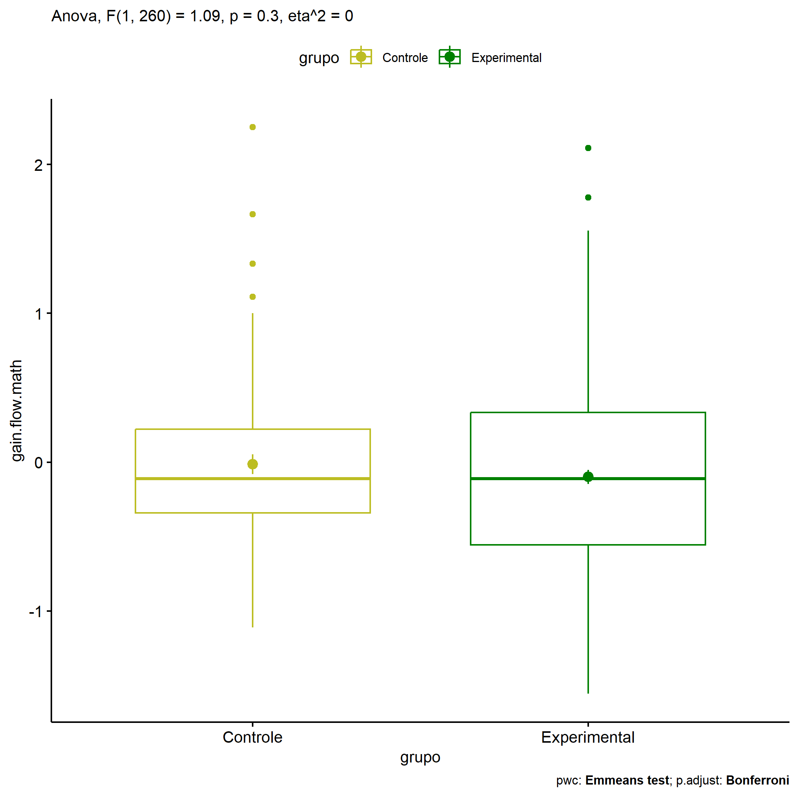
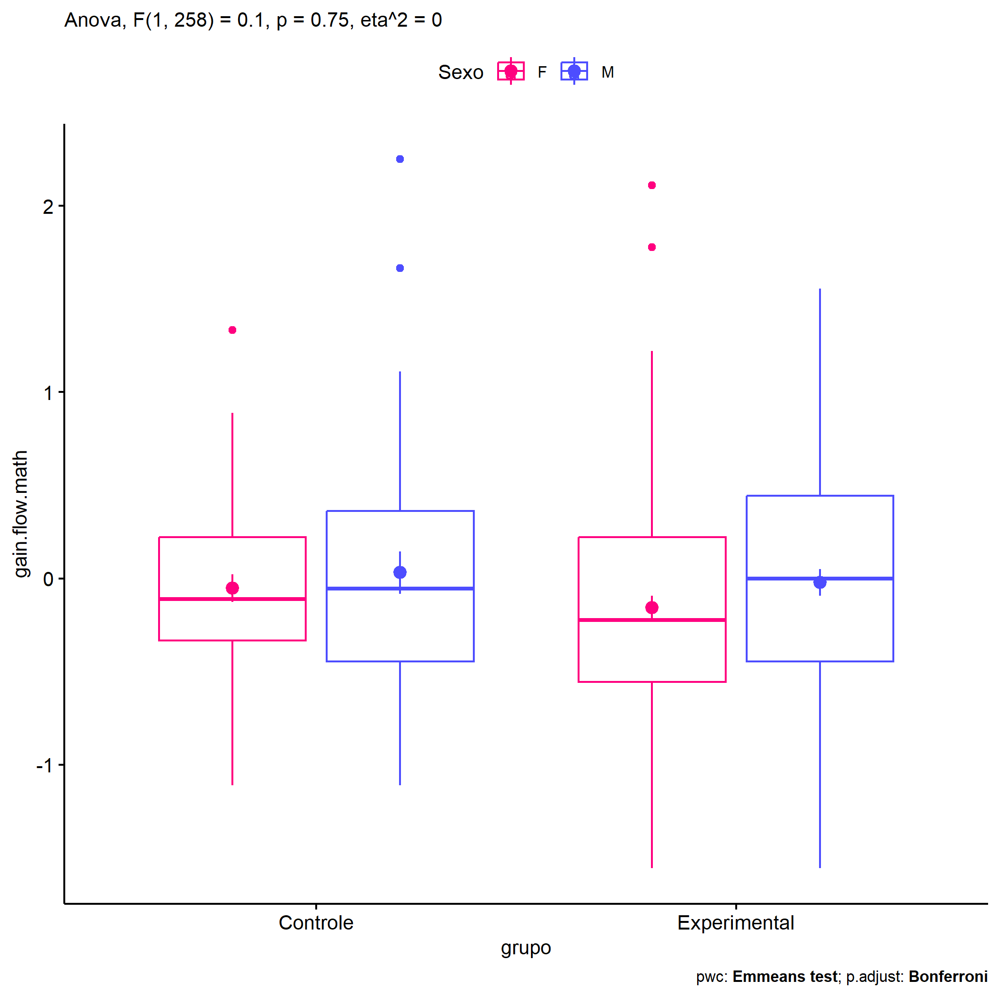
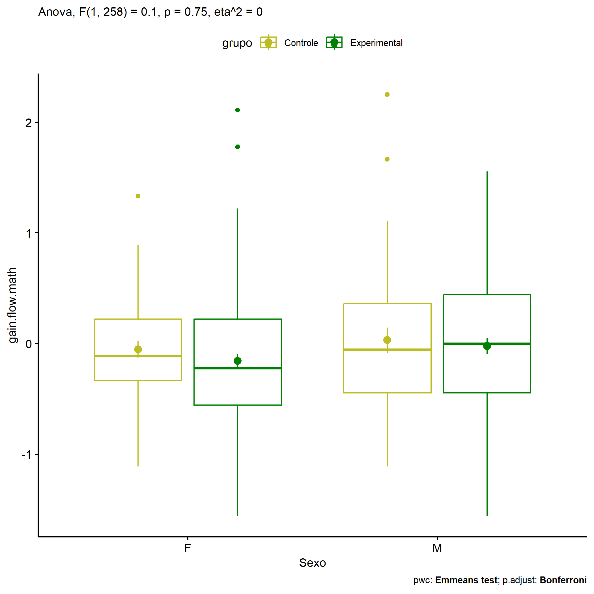
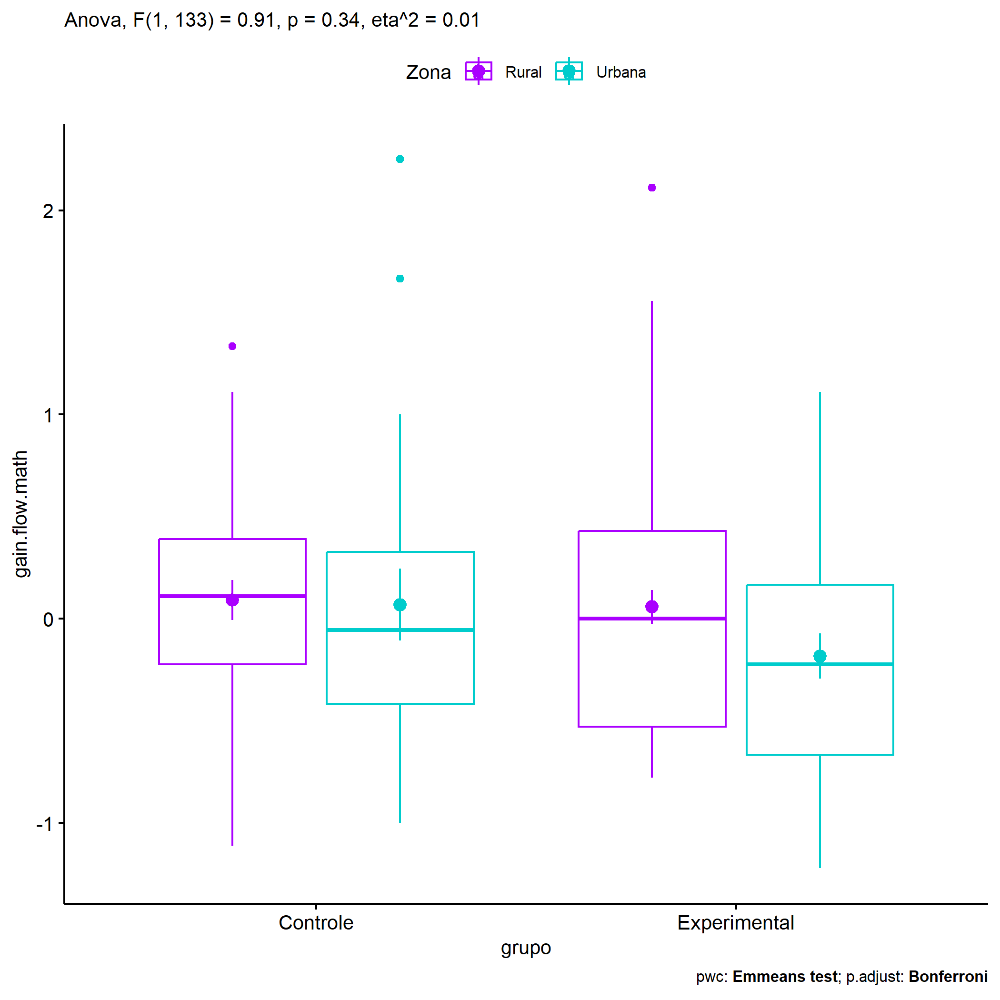
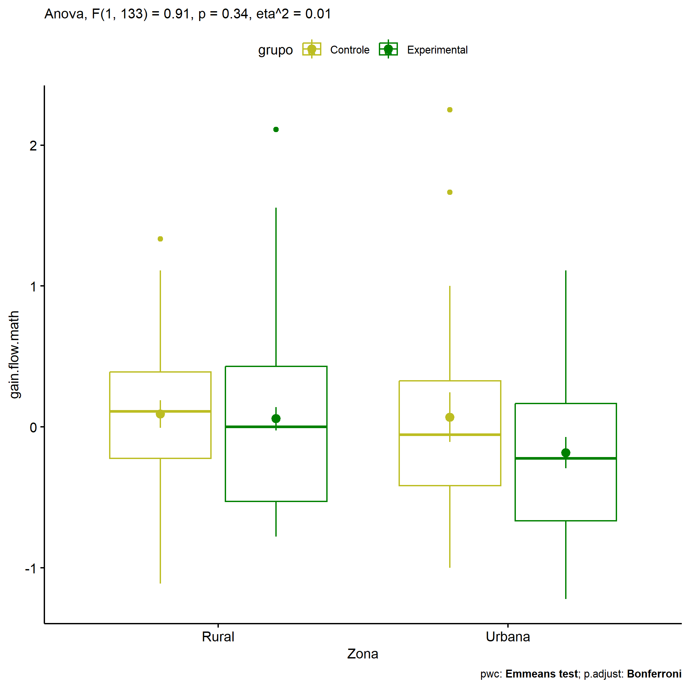

ANOVA in Gains for gain flow (prob. matemática) (gain flow (prob.
matemática))
================
Geiser C. Challco <geiser@alumni.usp.br>

- [Descriptive Statistics of Initial
  Data](#descriptive-statistics-of-initial-data)
- [Checking of Assumptions](#checking-of-assumptions)
  - [Assumption: Normality distribution of
    data](#assumption-normality-distribution-of-data)
  - [Assumption: Homogeneity of data
    distribution](#assumption-homogeneity-of-data-distribution)
- [Computation of ANCOVA test and Pairwise
  Comparison](#computation-of-ancova-test-and-pairwise-comparison)
  - [ANCOVA tests for one factor](#ancova-tests-for-one-factor)
  - [ANCOVA tests for two factors](#ancova-tests-for-two-factors)
  - [Pairwise comparisons for one factor:
    **grupo**](#pairwise-comparisons-for-one-factor-grupo)
  - [Pairwise comparisons for two
    factors](#pairwise-comparisons-for-two-factors)
    - [factores: **grupo:Sexo**](#factores-gruposexo)
    - [factores: **grupo:Zona**](#factores-grupozona)
    - [factores: **grupo:Cor.Raca**](#factores-grupocorraca)

**NOTE**

- Teste ANOVA para determinar se houve diferenças significativas no gain
  flow (prob. matemática) (medido usando a diferença entre post-test e
  pre-testes).
- ANOVA test to determine whether there were significant differences in
  gain flow (prob. matemática) (measured using the difference between
  post-test and pre-tests).

# Descriptive Statistics of Initial Data

| grupo        | Sexo | Zona   | Cor.Raca | variable       |   n |   mean | median |    min |   max |    sd |    se |    ci |   iqr |
|:-------------|:-----|:-------|:---------|:---------------|----:|-------:|-------:|-------:|------:|------:|------:|------:|------:|
| Controle     | F    |        |          | gain.flow.math |  47 | -0.052 | -0.111 | -1.111 | 1.333 | 0.507 | 0.074 | 0.149 | 0.556 |
| Controle     | M    |        |          | gain.flow.math |  40 |  0.032 | -0.056 | -1.111 | 2.250 | 0.719 | 0.114 | 0.230 | 0.806 |
| Experimental | F    |        |          | gain.flow.math | 100 | -0.157 | -0.222 | -1.556 | 2.111 | 0.643 | 0.064 | 0.128 | 0.778 |
| Experimental | M    |        |          | gain.flow.math |  75 | -0.021 |  0.000 | -1.556 | 1.556 | 0.613 | 0.071 | 0.141 | 0.889 |
| Controle     |      | Rural  |          | gain.flow.math |  31 |  0.092 |  0.111 | -1.111 | 1.333 | 0.549 | 0.099 | 0.201 | 0.611 |
| Controle     |      | Urbana |          | gain.flow.math |  22 |  0.069 | -0.056 | -1.000 | 2.250 | 0.823 | 0.175 | 0.365 | 0.743 |
| Controle     |      |        |          | gain.flow.math |  34 | -0.162 | -0.111 | -1.111 | 0.778 | 0.482 | 0.083 | 0.168 | 0.722 |
| Experimental |      | Rural  |          | gain.flow.math |  53 |  0.058 |  0.000 | -0.778 | 2.111 | 0.609 | 0.084 | 0.168 | 0.958 |
| Experimental |      | Urbana |          | gain.flow.math |  31 | -0.183 | -0.222 | -1.222 | 1.111 | 0.615 | 0.110 | 0.226 | 0.833 |
| Experimental |      |        |          | gain.flow.math |  91 | -0.162 | -0.222 | -1.556 | 1.778 | 0.642 | 0.067 | 0.134 | 0.833 |
| Controle     |      |        | Branca   | gain.flow.math |   4 |  0.111 |  0.000 | -0.333 | 0.778 | 0.471 | 0.236 | 0.750 | 0.278 |
| Controle     |      |        | Parda    | gain.flow.math |  32 |  0.081 |  0.111 | -1.111 | 1.333 | 0.609 | 0.108 | 0.219 | 0.833 |
| Controle     |      |        |          | gain.flow.math |  51 | -0.082 | -0.111 | -1.111 | 2.250 | 0.624 | 0.087 | 0.175 | 0.619 |
| Experimental |      |        | Amarela  | gain.flow.math |   2 |  0.167 |  0.167 | -0.111 | 0.444 | 0.393 | 0.278 | 3.530 | 0.278 |
| Experimental |      |        | Branca   | gain.flow.math |  17 | -0.086 |  0.111 | -1.000 | 0.778 | 0.527 | 0.128 | 0.271 | 0.889 |
| Experimental |      |        | Parda    | gain.flow.math |  44 | -0.057 | -0.056 | -0.889 | 1.111 | 0.508 | 0.077 | 0.154 | 0.948 |
| Experimental |      |        |          | gain.flow.math | 112 | -0.122 | -0.146 | -1.556 | 2.111 | 0.695 | 0.066 | 0.130 | 0.833 |

# Checking of Assumptions

## Assumption: Normality distribution of data

| var            |   n |  skewness |   kurtosis | symmetry | statistic | method     |         p | p.signif | normality |
|:---------------|----:|----------:|-----------:|:---------|----------:|:-----------|----------:|:---------|:----------|
| gain.flow.math | 262 | 0.4903246 |  0.8273725 | YES      | 15.641420 | D’Agostino | 0.0004013 | \*\*     | \-        |
| gain.flow.math | 137 | 0.7456475 |  0.7638173 | NO       | 15.112746 | D’Agostino | 0.0005228 | \*\*     | QQ        |
| gain.flow.math |  99 | 0.0556800 | -0.7478722 | YES      |  3.679412 | D’Agostino | 0.1588642 | ns       | YES       |

## Assumption: Homogeneity of data distribution

| var            | method        | formula                              |   n | df1 | df2 | statistic |         p | p.signif |
|:---------------|:--------------|:-------------------------------------|----:|----:|----:|----------:|----------:|:---------|
| gain.flow.math | Levene’s test | `gain.flow.math`~`grupo`\*`Sexo`     | 262 |   3 | 258 | 1.4467440 | 0.2296423 | ns       |
| gain.flow.math | Levene’s test | `gain.flow.math`~`grupo`\*`Zona`     | 137 |   3 | 133 | 0.9021948 | 0.4420253 | ns       |
| gain.flow.math | Levene’s test | `gain.flow.math`~`grupo`\*`Cor.Raca` |  99 |   4 |  94 | 0.5679178 | 0.6865350 | ns       |

# Computation of ANCOVA test and Pairwise Comparison

## ANCOVA tests for one factor

| Effect   | DFn | DFd |   SSn |     SSd |     F |     p |   ges | p\<.05 |
|:---------|----:|----:|------:|--------:|------:|------:|------:|:-------|
| grupo    |   1 | 260 | 0.428 | 101.807 | 1.092 | 0.297 | 0.004 |        |
| Sexo     |   1 | 260 | 0.947 | 101.288 | 2.431 | 0.120 | 0.009 |        |
| Zona     |   1 | 135 | 0.719 |  54.732 | 1.773 | 0.185 | 0.013 |        |
| Cor.Raca |   2 |  96 | 0.101 |  28.305 | 0.172 | 0.842 | 0.004 |        |

## ANCOVA tests for two factors

|     | Effect         | DFn | DFd |   SSn |     SSd |     F |     p |   ges | p\<.05 |
|:----|:---------------|----:|----:|------:|--------:|------:|------:|------:|:-------|
| 3   | grupo:Sexo     |   1 | 258 | 0.039 | 100.857 | 0.101 | 0.751 | 0.000 |        |
| 6   | grupo:Zona     |   1 | 133 | 0.368 |  53.895 | 0.908 | 0.342 | 0.007 |        |
| 9   | grupo:Cor.Raca |   1 |  94 | 0.010 |  27.828 | 0.033 | 0.857 | 0.000 |        |

## Pairwise comparisons for one factor: **grupo**

| var            | grupo        |   n |      M |    SE |
|:---------------|:-------------|----:|-------:|------:|
| gain.flow.math | Controle     |  87 | -0.013 | 0.066 |
| gain.flow.math | Experimental | 175 | -0.099 | 0.048 |

| .y.            | group1   | group2       | estimate | conf.low | conf.high |    se | statistic |     p | p.adj | p.adj.signif |
|:---------------|:---------|:-------------|---------:|---------:|----------:|------:|----------:|------:|------:|:-------------|
| gain.flow.math | Controle | Experimental |    0.086 |   -0.076 |     0.247 | 0.082 |     1.045 | 0.297 | 0.297 | ns           |

    ## Scale for colour is already present.
    ## Adding another scale for colour, which will replace the existing scale.

<!-- -->

## Pairwise comparisons for two factors

### factores: **grupo:Sexo**

| var            | grupo        | Sexo |   n |      M |    SE |
|:---------------|:-------------|:-----|----:|-------:|------:|
| gain.flow.math | Controle     | F    |  47 | -0.052 | 0.074 |
| gain.flow.math | Controle     | M    |  40 |  0.032 | 0.114 |
| gain.flow.math | Experimental | F    | 100 | -0.157 | 0.064 |
| gain.flow.math | Experimental | M    |  75 | -0.021 | 0.071 |

| .y.            | grupo        | Sexo | group1   | group2       | estimate | conf.low | conf.high |    se | statistic |     p | p.adj | p.adj.signif |
|:---------------|:-------------|:-----|:---------|:-------------|---------:|---------:|----------:|------:|----------:|------:|------:|:-------------|
| gain.flow.math |              | F    | Controle | Experimental |    0.106 |   -0.112 |     0.323 | 0.111 |     0.955 | 0.340 | 0.340 | ns           |
| gain.flow.math |              | M    | Controle | Experimental |    0.053 |   -0.188 |     0.294 | 0.122 |     0.435 | 0.664 | 0.664 | ns           |
| gain.flow.math | Controle     |      | F        | M            |   -0.084 |   -0.349 |     0.181 | 0.135 |    -0.625 | 0.533 | 0.533 | ns           |
| gain.flow.math | Experimental |      | F        | M            |   -0.136 |   -0.324 |     0.052 | 0.096 |    -1.428 | 0.154 | 0.154 | ns           |

    ## Scale for colour is already present.
    ## Adding another scale for colour, which will replace the existing scale.

<!-- -->

    ## Scale for colour is already present.
    ## Adding another scale for colour, which will replace the existing scale.

<!-- -->

### factores: **grupo:Zona**

| var            | grupo        | Zona   |   n |      M |    SE |
|:---------------|:-------------|:-------|----:|-------:|------:|
| gain.flow.math | Controle     | Rural  |  31 |  0.092 | 0.099 |
| gain.flow.math | Controle     | Urbana |  22 |  0.069 | 0.175 |
| gain.flow.math | Experimental | Rural  |  53 |  0.058 | 0.084 |
| gain.flow.math | Experimental | Urbana |  31 | -0.183 | 0.110 |

| .y.            | grupo        | Zona   | group1   | group2       | estimate | conf.low | conf.high |    se | statistic |     p | p.adj | p.adj.signif |
|:---------------|:-------------|:-------|:---------|:-------------|---------:|---------:|----------:|------:|----------:|------:|------:|:-------------|
| gain.flow.math |              | Rural  | Controle | Experimental |    0.034 |   -0.251 |     0.319 | 0.144 |     0.236 | 0.814 | 0.814 | ns           |
| gain.flow.math |              | Urbana | Controle | Experimental |    0.252 |   -0.099 |     0.603 | 0.177 |     1.418 | 0.159 | 0.159 | ns           |
| gain.flow.math | Controle     |        | Rural    | Urbana       |    0.023 |   -0.328 |     0.374 | 0.177 |     0.129 | 0.897 | 0.897 | ns           |
| gain.flow.math | Experimental |        | Rural    | Urbana       |    0.241 |   -0.044 |     0.525 | 0.144 |     1.672 | 0.097 | 0.097 | ns           |

    ## Scale for colour is already present.
    ## Adding another scale for colour, which will replace the existing scale.

<!-- -->

    ## Scale for colour is already present.
    ## Adding another scale for colour, which will replace the existing scale.

<!-- -->

### factores: **grupo:Cor.Raca**

| var            | grupo        | Cor.Raca |   n |      M |    SE |
|:---------------|:-------------|:---------|----:|-------:|------:|
| gain.flow.math | Controle     | Parda    |  32 |  0.081 | 0.108 |
| gain.flow.math | Experimental | Branca   |  17 | -0.086 | 0.128 |
| gain.flow.math | Experimental | Parda    |  44 | -0.057 | 0.077 |

|     | .y.            | grupo        | Cor.Raca | group1   | group2       | estimate | conf.low | conf.high |    se | statistic |     p | p.adj | p.adj.signif |
|:----|:---------------|:-------------|:---------|:---------|:-------------|---------:|---------:|----------:|------:|----------:|------:|------:|:-------------|
| 2   | gain.flow.math |              | Parda    | Controle | Experimental |    0.138 |   -0.115 |     0.391 | 0.127 |     1.082 | 0.282 | 0.282 | ns           |
| 4   | gain.flow.math | Experimental |          | Branca   | Parda        |   -0.029 |   -0.340 |     0.282 | 0.156 |    -0.187 | 0.852 | 0.852 | ns           |
