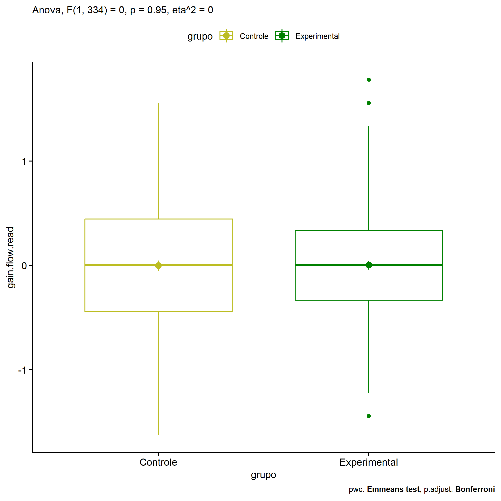
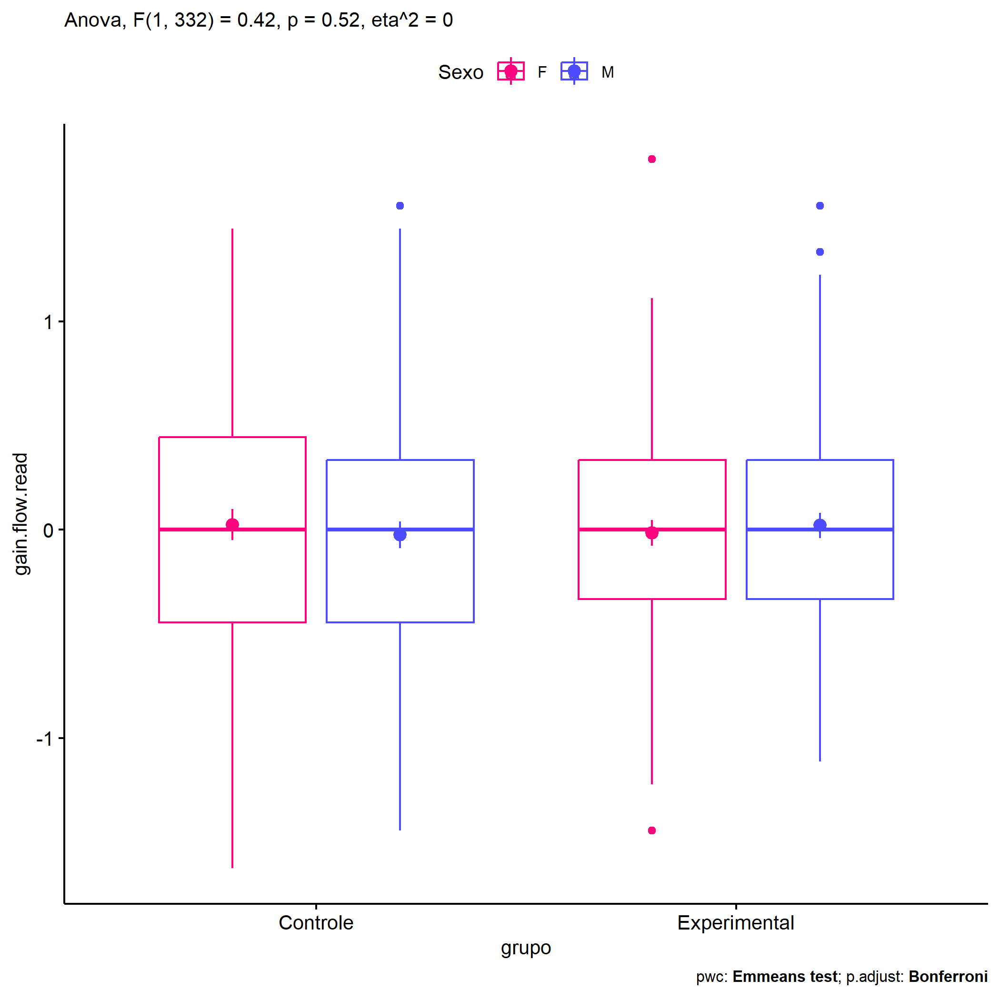
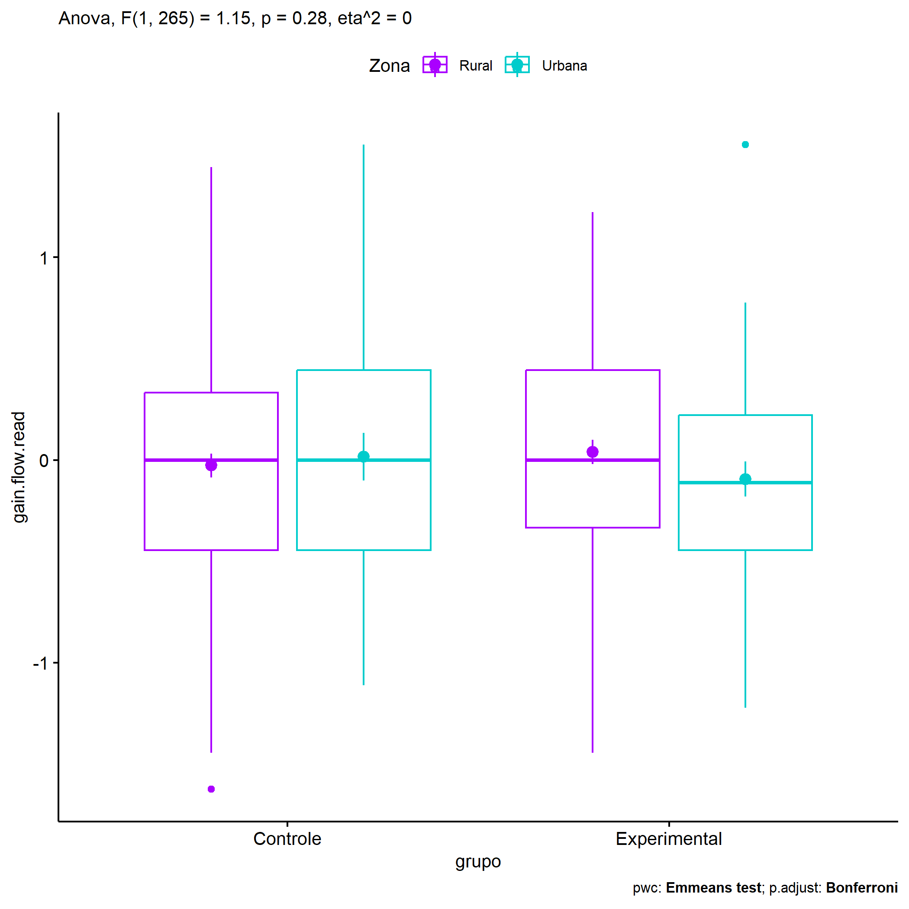
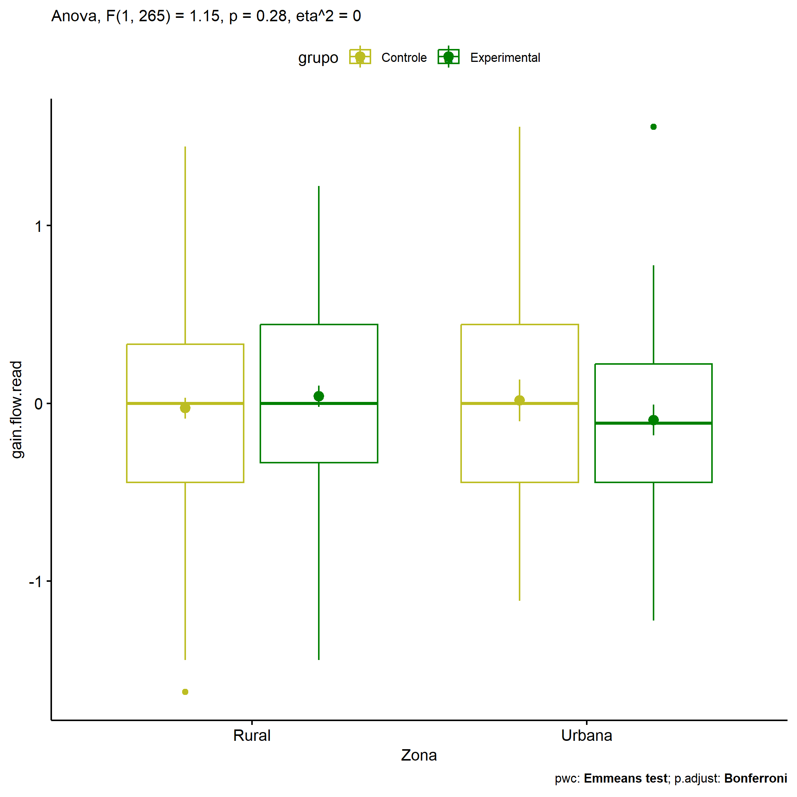
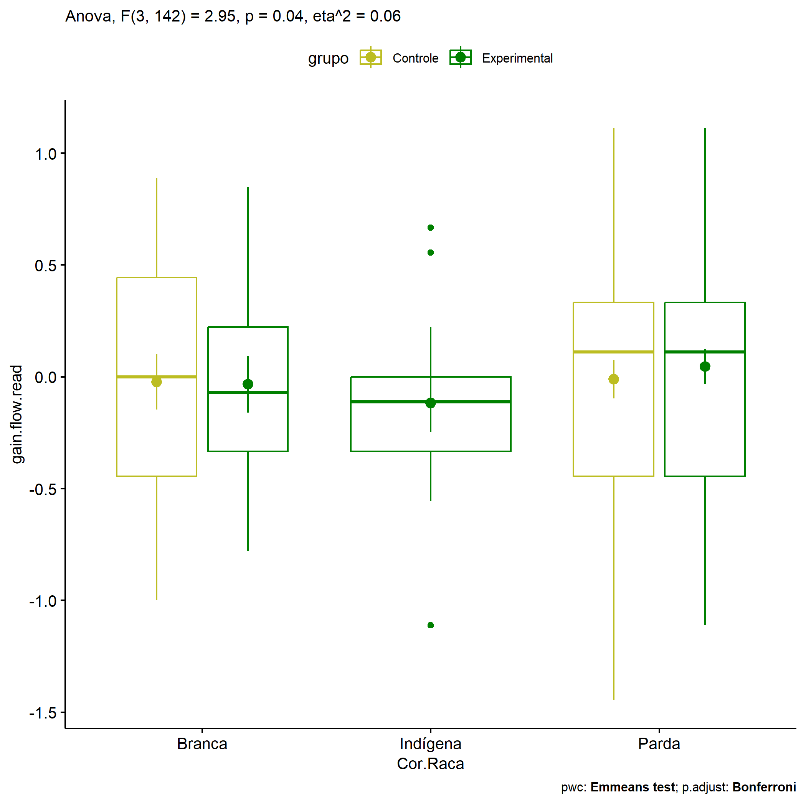

ANOVA in Gains for gain flow (ativ. leitura) (gain flow (ativ. leitura))
================
Geiser C. Challco <geiser@alumni.usp.br>

- [Descriptive Statistics of Initial
  Data](#descriptive-statistics-of-initial-data)
- [Checking of Assumptions](#checking-of-assumptions)
  - [Assumption: Normality distribution of
    data](#assumption-normality-distribution-of-data)
  - [Assumption: Homogeneity of data
    distribution](#assumption-homogeneity-of-data-distribution)
- [Computation of ANCOVA test and Pairwise
  Comparison](#computation-of-ancova-test-and-pairwise-comparison)
  - [ANCOVA tests for one factor](#ancova-tests-for-one-factor)
  - [ANCOVA tests for two factors](#ancova-tests-for-two-factors)
  - [Pairwise comparisons for one factor:
    **grupo**](#pairwise-comparisons-for-one-factor-grupo)
  - [Pairwise comparisons for two
    factors](#pairwise-comparisons-for-two-factors)
    - [factores: **grupo:Sexo**](#factores-gruposexo)
    - [factores: **grupo:Zona**](#factores-grupozona)
    - [factores: **grupo:Cor.Raca**](#factores-grupocorraca)

**NOTE**

- Teste ANOVA para determinar se houve diferenças significativas no gain
  flow (ativ. leitura) (medido usando a diferença entre post-test e
  pre-testes).
- ANOVA test to determine whether there were significant differences in
  gain flow (ativ. leitura) (measured using the difference between
  post-test and pre-tests).

# Descriptive Statistics of Initial Data

| grupo        | Sexo | Zona   | Cor.Raca | variable       |   n |   mean | median |    min |   max |    sd |    se |    ci |   iqr |
|:-------------|:-----|:-------|:---------|:---------------|----:|-------:|-------:|-------:|------:|------:|------:|------:|------:|
| Controle     | F    |        |          | gain.flow.read |  73 |  0.024 |  0.000 | -1.625 | 1.444 | 0.636 | 0.074 | 0.148 | 0.889 |
| Controle     | M    |        |          | gain.flow.read |  85 | -0.025 |  0.000 | -1.444 | 1.556 | 0.588 | 0.064 | 0.127 | 0.778 |
| Experimental | F    |        |          | gain.flow.read |  93 | -0.015 |  0.000 | -1.444 | 1.778 | 0.589 | 0.061 | 0.121 | 0.667 |
| Experimental | M    |        |          | gain.flow.read |  85 |  0.021 |  0.000 | -1.111 | 1.556 | 0.557 | 0.060 | 0.120 | 0.667 |
| Controle     |      | Rural  |          | gain.flow.read | 107 | -0.027 |  0.000 | -1.625 | 1.444 | 0.606 | 0.059 | 0.116 | 0.778 |
| Controle     |      | Urbana |          | gain.flow.read |  29 |  0.016 |  0.000 | -1.111 | 1.556 | 0.631 | 0.117 | 0.240 | 0.889 |
| Controle     |      |        |          | gain.flow.read |  22 |  0.096 |  0.222 | -0.931 | 1.111 | 0.616 | 0.131 | 0.273 | 0.909 |
| Experimental |      | Rural  |          | gain.flow.read |  89 |  0.039 |  0.000 | -1.444 | 1.222 | 0.563 | 0.060 | 0.119 | 0.778 |
| Experimental |      | Urbana |          | gain.flow.read |  44 | -0.094 | -0.111 | -1.222 | 1.556 | 0.571 | 0.086 | 0.174 | 0.667 |
| Experimental |      |        |          | gain.flow.read |  45 |  0.023 |  0.000 | -1.111 | 1.778 | 0.593 | 0.088 | 0.178 | 0.444 |
| Controle     |      |        | Branca   | gain.flow.read |  20 | -0.022 |  0.000 | -1.000 | 0.889 | 0.557 | 0.125 | 0.261 | 0.889 |
| Controle     |      |        | Indígena | gain.flow.read |   3 |  0.926 |  0.667 |  0.667 | 1.444 | 0.449 | 0.259 | 1.116 | 0.389 |
| Controle     |      |        | Parda    | gain.flow.read |  46 | -0.011 |  0.111 | -1.444 | 1.111 | 0.584 | 0.086 | 0.174 | 0.778 |
| Controle     |      |        | Preta    | gain.flow.read |   1 |  0.000 |  0.000 |  0.000 | 0.000 |       |       |       | 0.000 |
| Controle     |      |        |          | gain.flow.read |  88 | -0.025 |  0.000 | -1.625 | 1.556 | 0.625 | 0.067 | 0.132 | 0.889 |
| Experimental |      |        | Branca   | gain.flow.read |  17 | -0.033 | -0.069 | -0.778 | 0.847 | 0.525 | 0.127 | 0.270 | 0.556 |
| Experimental |      |        | Indígena | gain.flow.read |  13 | -0.118 | -0.111 | -1.111 | 0.667 | 0.467 | 0.130 | 0.282 | 0.333 |
| Experimental |      |        | Parda    | gain.flow.read |  49 |  0.045 |  0.111 | -1.111 | 1.111 | 0.547 | 0.078 | 0.157 | 0.778 |
| Experimental |      |        | Preta    | gain.flow.read |   1 |  0.000 |  0.000 |  0.000 | 0.000 |       |       |       | 0.000 |
| Experimental |      |        |          | gain.flow.read |  98 |  0.002 |  0.000 | -1.444 | 1.778 | 0.611 | 0.062 | 0.123 | 0.667 |

# Checking of Assumptions

## Assumption: Normality distribution of data

| var            |   n |   skewness |   kurtosis | symmetry | statistic | method     |         p | p.signif | normality |
|:---------------|----:|-----------:|-----------:|:---------|----------:|:-----------|----------:|:---------|:----------|
| gain.flow.read | 336 |  0.0706303 | -0.0445049 | YES      | 0.3006777 | D’Agostino | 0.8604164 | ns       | \-        |
| gain.flow.read | 269 |  0.0031028 | -0.1292316 | YES      | 0.0336463 | D’Agostino | 0.9833176 | ns       | \-        |
| gain.flow.read | 150 | -0.1274753 | -0.6027178 | YES      | 3.5817559 | D’Agostino | 0.1668137 | ns       | QQ        |

## Assumption: Homogeneity of data distribution

| var            | method        | formula                              |   n | df1 | df2 | statistic |         p | p.signif |
|:---------------|:--------------|:-------------------------------------|----:|----:|----:|----------:|----------:|:---------|
| gain.flow.read | Levene’s test | `gain.flow.read`~`grupo`\*`Sexo`     | 336 |   3 | 332 | 0.8386718 | 0.4734330 | ns       |
| gain.flow.read | Levene’s test | `gain.flow.read`~`grupo`\*`Zona`     | 269 |   3 | 265 | 0.2445721 | 0.8651596 | ns       |
| gain.flow.read | Levene’s test | `gain.flow.read`~`grupo`\*`Cor.Raca` | 150 |   7 | 142 | 0.9637216 | 0.4601528 | ns       |

# Computation of ANCOVA test and Pairwise Comparison

## ANCOVA tests for one factor

| Effect   | DFn | DFd |   SSn |     SSd |     F |     p |   ges | p\<.05 |
|:---------|----:|----:|------:|--------:|------:|------:|------:|:-------|
| grupo    |   1 | 334 | 0.002 | 116.250 | 0.004 | 0.947 | 0.000 |        |
| Sexo     |   1 | 334 | 0.001 | 116.250 | 0.004 | 0.950 | 0.000 |        |
| Zona     |   1 | 267 | 0.150 |  92.407 | 0.434 | 0.510 | 0.002 |        |
| Cor.Raca |   3 | 146 | 0.130 |  45.803 | 0.138 | 0.937 | 0.003 |        |

## ANCOVA tests for two factors

|     | Effect         | DFn | DFd |   SSn |     SSd |     F |     p |   ges | p\<.05 |
|:----|:---------------|----:|----:|------:|--------:|------:|------:|------:|:-------|
| 3   | grupo:Sexo     |   1 | 332 | 0.148 | 116.100 | 0.425 | 0.515 | 0.001 |        |
| 6   | grupo:Zona     |   1 | 265 | 0.400 |  91.981 | 1.151 | 0.284 | 0.004 |        |
| 9   | grupo:Cor.Raca |   3 | 142 | 2.681 |  43.074 | 2.947 | 0.035 | 0.059 | \*     |

## Pairwise comparisons for one factor: **grupo**

| var            | grupo        |   n |      M |    SE |
|:---------------|:-------------|----:|-------:|------:|
| gain.flow.read | Controle     | 158 | -0.002 | 0.048 |
| gain.flow.read | Experimental | 178 |  0.002 | 0.043 |

| .y.            | group1   | group2       | estimate | conf.low | conf.high |    se | statistic |     p | p.adj | p.adj.signif |
|:---------------|:---------|:-------------|---------:|---------:|----------:|------:|----------:|------:|------:|:-------------|
| gain.flow.read | Controle | Experimental |   -0.004 |   -0.131 |     0.123 | 0.064 |    -0.067 | 0.947 | 0.947 | ns           |

    ## Scale for colour is already present.
    ## Adding another scale for colour, which will replace the existing scale.

<!-- -->

## Pairwise comparisons for two factors

### factores: **grupo:Sexo**

| var            | grupo        | Sexo |   n |      M |    SE |
|:---------------|:-------------|:-----|----:|-------:|------:|
| gain.flow.read | Controle     | F    |  73 |  0.024 | 0.074 |
| gain.flow.read | Controle     | M    |  85 | -0.025 | 0.064 |
| gain.flow.read | Experimental | F    |  93 | -0.015 | 0.061 |
| gain.flow.read | Experimental | M    |  85 |  0.021 | 0.060 |

| .y.            | grupo        | Sexo | group1   | group2       | estimate | conf.low | conf.high |    se | statistic |     p | p.adj | p.adj.signif |
|:---------------|:-------------|:-----|:---------|:-------------|---------:|---------:|----------:|------:|----------:|------:|------:|:-------------|
| gain.flow.read |              | F    | Controle | Experimental |    0.039 |   -0.143 |     0.221 | 0.092 |     0.421 | 0.674 | 0.674 | ns           |
| gain.flow.read |              | M    | Controle | Experimental |   -0.045 |   -0.224 |     0.133 | 0.091 |    -0.501 | 0.617 | 0.617 | ns           |
| gain.flow.read | Controle     |      | F        | M            |    0.049 |   -0.137 |     0.234 | 0.094 |     0.515 | 0.607 | 0.607 | ns           |
| gain.flow.read | Experimental |      | F        | M            |   -0.036 |   -0.210 |     0.139 | 0.089 |    -0.404 | 0.687 | 0.687 | ns           |

    ## Scale for colour is already present.
    ## Adding another scale for colour, which will replace the existing scale.

<!-- -->

    ## Scale for colour is already present.
    ## Adding another scale for colour, which will replace the existing scale.

<!-- -->

### factores: **grupo:Zona**

| var            | grupo        | Zona   |   n |      M |    SE |
|:---------------|:-------------|:-------|----:|-------:|------:|
| gain.flow.read | Controle     | Rural  | 107 | -0.027 | 0.059 |
| gain.flow.read | Controle     | Urbana |  29 |  0.016 | 0.117 |
| gain.flow.read | Experimental | Rural  |  89 |  0.039 | 0.060 |
| gain.flow.read | Experimental | Urbana |  44 | -0.094 | 0.086 |

| .y.            | grupo        | Zona   | group1   | group2       | estimate | conf.low | conf.high |    se | statistic |     p | p.adj | p.adj.signif |
|:---------------|:-------------|:-------|:---------|:-------------|---------:|---------:|----------:|------:|----------:|------:|------:|:-------------|
| gain.flow.read |              | Rural  | Controle | Experimental |   -0.066 |   -0.233 |     0.100 | 0.085 |    -0.786 | 0.433 | 0.433 | ns           |
| gain.flow.read |              | Urbana | Controle | Experimental |    0.110 |   -0.168 |     0.387 | 0.141 |     0.780 | 0.436 | 0.436 | ns           |
| gain.flow.read | Controle     |        | Rural    | Urbana       |   -0.043 |   -0.286 |     0.200 | 0.123 |    -0.350 | 0.726 | 0.726 | ns           |
| gain.flow.read | Experimental |        | Rural    | Urbana       |    0.133 |   -0.081 |     0.347 | 0.109 |     1.226 | 0.221 | 0.221 | ns           |

    ## Scale for colour is already present.
    ## Adding another scale for colour, which will replace the existing scale.

<!-- -->

    ## Scale for colour is already present.
    ## Adding another scale for colour, which will replace the existing scale.

<!-- -->

### factores: **grupo:Cor.Raca**

| var            | grupo        | Cor.Raca |   n |      M |    SE |
|:---------------|:-------------|:---------|----:|-------:|------:|
| gain.flow.read | Controle     | Branca   |  20 | -0.022 | 0.125 |
| gain.flow.read | Controle     | Parda    |  46 | -0.011 | 0.086 |
| gain.flow.read | Experimental | Branca   |  17 | -0.033 | 0.127 |
| gain.flow.read | Experimental | Indígena |  13 | -0.118 | 0.130 |
| gain.flow.read | Experimental | Parda    |  49 |  0.045 | 0.078 |

|     | .y.            | grupo        | Cor.Raca | group1   | group2       | estimate | conf.low | conf.high |    se | statistic |     p | p.adj | p.adj.signif |
|:----|:---------------|:-------------|:---------|:---------|:-------------|---------:|---------:|----------:|------:|----------:|------:|------:|:-------------|
| 1   | gain.flow.read |              | Branca   | Controle | Experimental |    0.010 |   -0.350 |     0.371 | 0.182 |     0.057 | 0.954 | 0.954 | ns           |
| 3   | gain.flow.read |              | Parda    | Controle | Experimental |   -0.056 |   -0.280 |     0.168 | 0.113 |    -0.494 | 0.622 | 0.622 | ns           |
| 5   | gain.flow.read | Controle     |          | Branca   | Parda        |   -0.012 |   -0.304 |     0.281 | 0.148 |    -0.078 | 0.938 | 0.938 | ns           |
| 7   | gain.flow.read | Experimental |          | Branca   | Indígena     |    0.085 |   -0.317 |     0.487 | 0.203 |     0.417 | 0.677 | 1.000 | ns           |
| 8   | gain.flow.read | Experimental |          | Branca   | Parda        |   -0.078 |   -0.385 |     0.229 | 0.155 |    -0.502 | 0.616 | 1.000 | ns           |
| 9   | gain.flow.read | Experimental |          | Indígena | Parda        |   -0.163 |   -0.503 |     0.178 | 0.172 |    -0.946 | 0.346 | 1.000 | ns           |

    ## Scale for colour is already present.
    ## Adding another scale for colour, which will replace the existing scale.

<!-- -->
