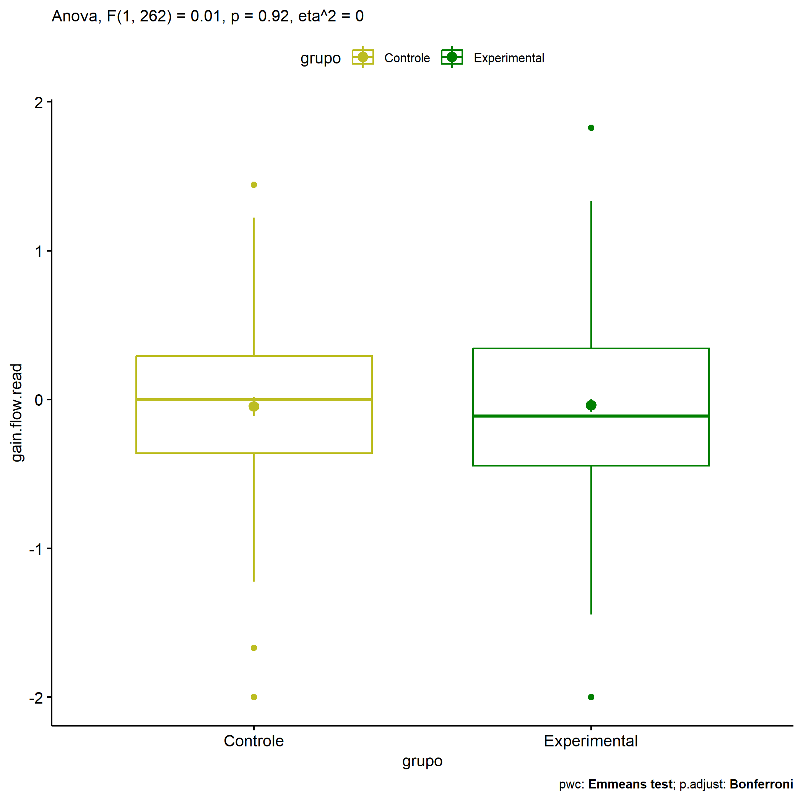
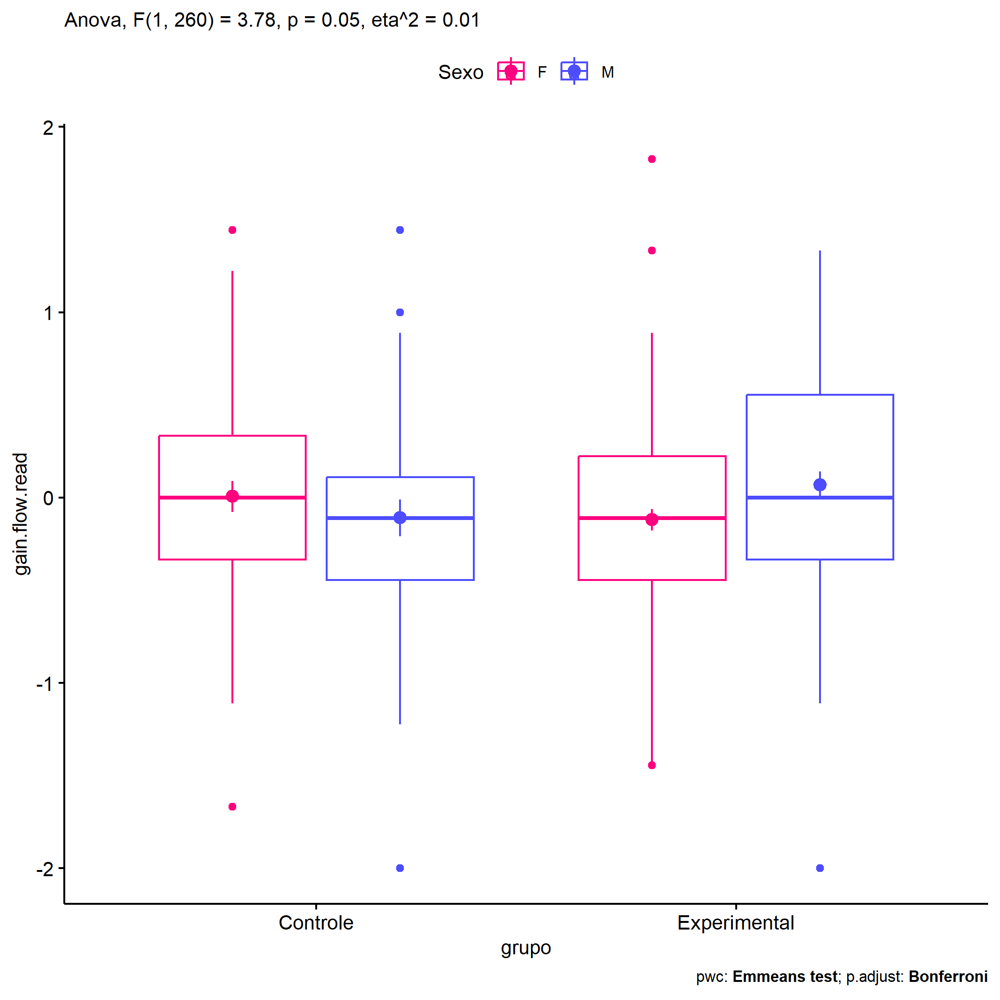
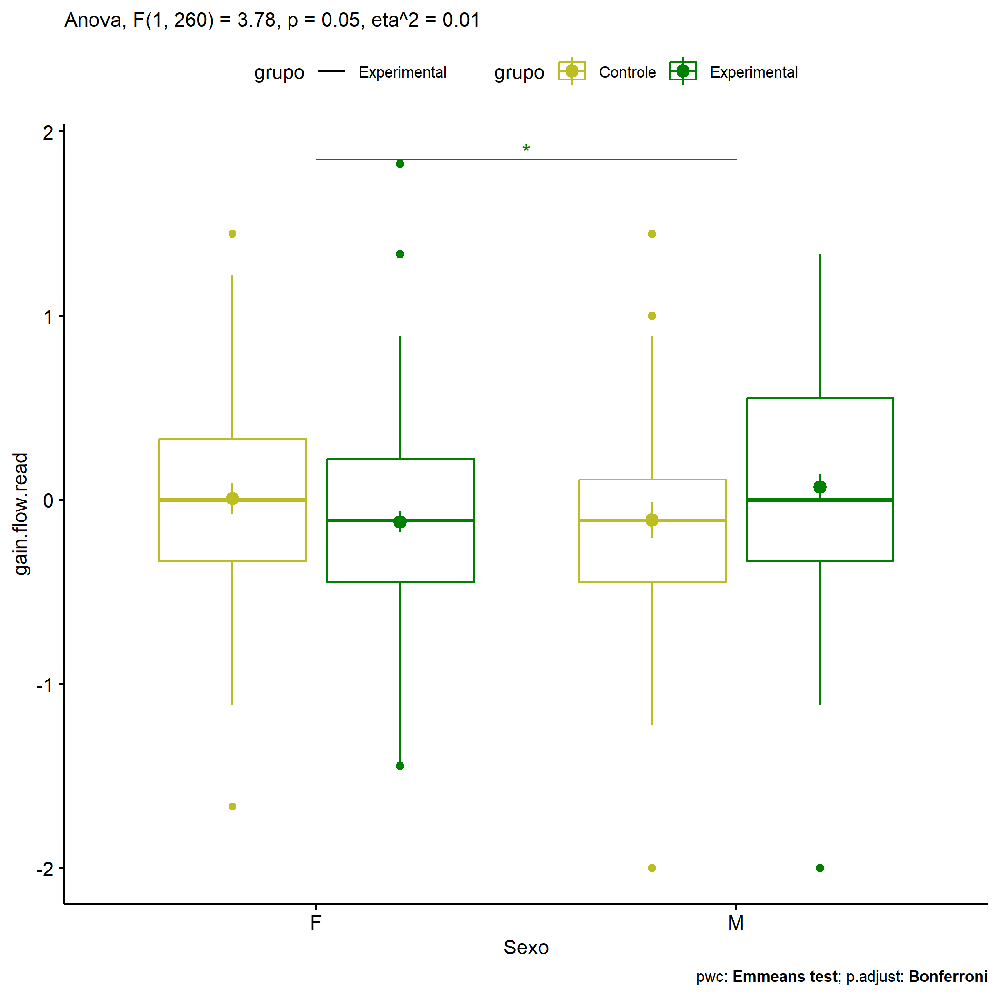
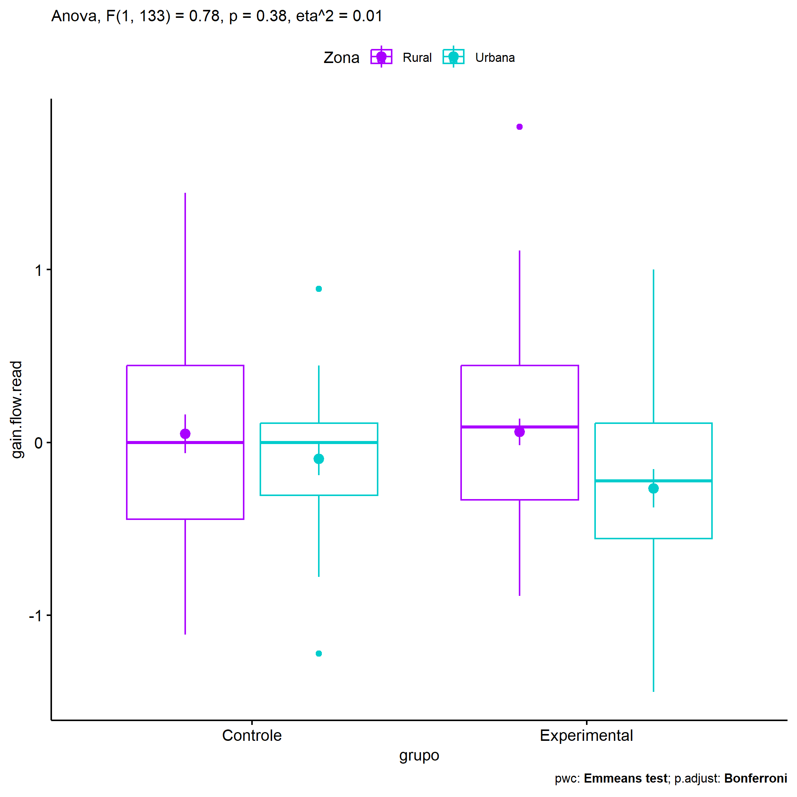
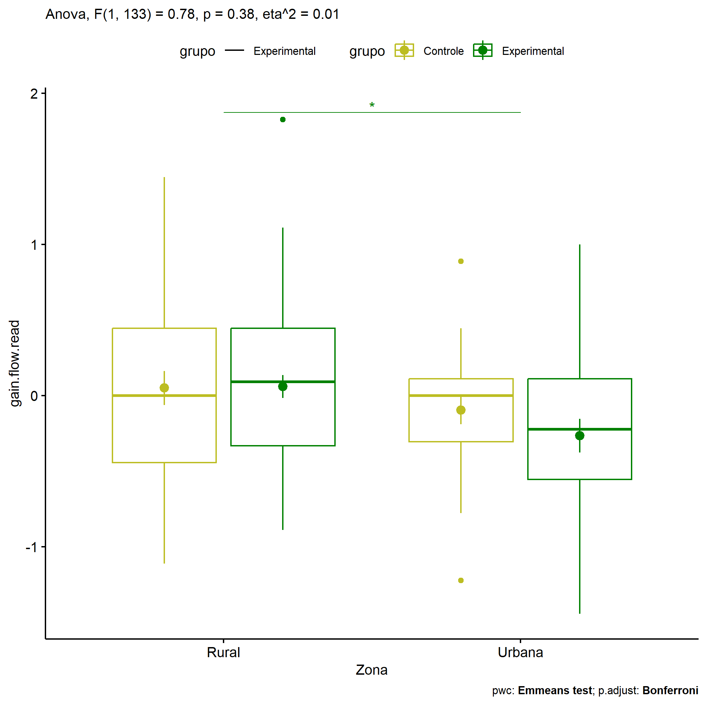

ANOVA in Gains for gain flow (ativ. leitura) (gain flow (ativ. leitura))
================
Geiser C. Challco <geiser@alumni.usp.br>

- [Descriptive Statistics of Initial
  Data](#descriptive-statistics-of-initial-data)
- [Checking of Assumptions](#checking-of-assumptions)
  - [Assumption: Normality distribution of
    data](#assumption-normality-distribution-of-data)
  - [Assumption: Homogeneity of data
    distribution](#assumption-homogeneity-of-data-distribution)
- [Computation of ANCOVA test and Pairwise
  Comparison](#computation-of-ancova-test-and-pairwise-comparison)
  - [ANCOVA tests for one factor](#ancova-tests-for-one-factor)
  - [ANCOVA tests for two factors](#ancova-tests-for-two-factors)
  - [Pairwise comparisons for one factor:
    **grupo**](#pairwise-comparisons-for-one-factor-grupo)
  - [Pairwise comparisons for two
    factors](#pairwise-comparisons-for-two-factors)
    - [factores: **grupo:Sexo**](#factores-gruposexo)
    - [factores: **grupo:Zona**](#factores-grupozona)
    - [factores: **grupo:Cor.Raca**](#factores-grupocorraca)

**NOTE**

- Teste ANOVA para determinar se houve diferenças significativas no gain
  flow (ativ. leitura) (medido usando a diferença entre post-test e
  pre-testes).
- ANOVA test to determine whether there were significant differences in
  gain flow (ativ. leitura) (measured using the difference between
  post-test and pre-tests).

# Descriptive Statistics of Initial Data

| grupo        | Sexo | Zona   | Cor.Raca | variable       |   n |   mean | median |    min |   max |    sd |    se |    ci |   iqr |
|:-------------|:-----|:-------|:---------|:---------------|----:|-------:|-------:|-------:|------:|------:|------:|------:|------:|
| Controle     | F    |        |          | gain.flow.read |  47 |  0.007 |  0.000 | -1.667 | 1.444 | 0.566 | 0.083 | 0.166 | 0.667 |
| Controle     | M    |        |          | gain.flow.read |  41 | -0.109 | -0.111 | -2.000 | 1.444 | 0.629 | 0.098 | 0.198 | 0.556 |
| Experimental | F    |        |          | gain.flow.read | 101 | -0.119 | -0.111 | -1.444 | 1.825 | 0.574 | 0.057 | 0.113 | 0.667 |
| Experimental | M    |        |          | gain.flow.read |  75 |  0.068 |  0.000 | -2.000 | 1.333 | 0.619 | 0.071 | 0.142 | 0.889 |
| Controle     |      | Rural  |          | gain.flow.read |  31 |  0.050 |  0.000 | -1.111 | 1.444 | 0.626 | 0.113 | 0.230 | 0.889 |
| Controle     |      | Urbana |          | gain.flow.read |  22 | -0.095 |  0.000 | -1.222 | 0.889 | 0.447 | 0.095 | 0.198 | 0.417 |
| Controle     |      |        |          | gain.flow.read |  35 | -0.104 | -0.111 | -2.000 | 1.222 | 0.651 | 0.110 | 0.224 | 0.639 |
| Experimental |      | Rural  |          | gain.flow.read |  54 |  0.061 |  0.090 | -0.889 | 1.825 | 0.558 | 0.076 | 0.152 | 0.778 |
| Experimental |      | Urbana |          | gain.flow.read |  30 | -0.266 | -0.222 | -1.444 | 1.000 | 0.608 | 0.111 | 0.227 | 0.667 |
| Experimental |      |        |          | gain.flow.read |  92 | -0.024 | -0.111 | -2.000 | 1.333 | 0.607 | 0.063 | 0.126 | 0.847 |
| Controle     |      |        | Branca   | gain.flow.read |   4 |  0.278 |  0.111 | -0.333 | 1.222 | 0.717 | 0.359 | 1.141 | 0.889 |
| Controle     |      |        | Parda    | gain.flow.read |  32 |  0.066 |  0.000 | -0.889 | 1.444 | 0.607 | 0.107 | 0.219 | 0.806 |
| Controle     |      |        |          | gain.flow.read |  52 | -0.142 |  0.000 | -2.000 | 0.889 | 0.570 | 0.079 | 0.159 | 0.583 |
| Experimental |      |        | Amarela  | gain.flow.read |   2 |  0.389 |  0.389 | -0.111 | 0.889 | 0.707 | 0.500 | 6.353 | 0.500 |
| Experimental |      |        | Branca   | gain.flow.read |  17 |  0.085 |  0.111 | -0.889 | 1.000 | 0.479 | 0.116 | 0.246 | 0.556 |
| Experimental |      |        | Parda    | gain.flow.read |  45 | -0.087 | -0.222 | -0.889 | 1.111 | 0.475 | 0.071 | 0.143 | 0.597 |
| Experimental |      |        |          | gain.flow.read | 112 | -0.046 | -0.056 | -2.000 | 1.825 | 0.658 | 0.062 | 0.123 | 0.847 |

# Checking of Assumptions

## Assumption: Normality distribution of data

| var            |   n |   skewness |   kurtosis | symmetry | statistic | method     |         p | p.signif | normality |
|:---------------|----:|-----------:|-----------:|:---------|----------:|:-----------|----------:|:---------|:----------|
| gain.flow.read | 264 | -0.0277040 |  0.7295747 | YES      |  4.728656 | D’Agostino | 0.0940124 | ns       | \-        |
| gain.flow.read | 137 |  0.2927308 |  0.1103002 | YES      |  2.549703 | D’Agostino | 0.2794725 | ns       | QQ        |
| gain.flow.read | 100 |  0.5070742 | -0.2723498 | NO       |  4.585191 | D’Agostino | 0.1010040 | ns       | YES       |

## Assumption: Homogeneity of data distribution

| var            | method        | formula                              |   n | df1 | df2 | statistic |         p | p.signif |
|:---------------|:--------------|:-------------------------------------|----:|----:|----:|----------:|----------:|:---------|
| gain.flow.read | Levene’s test | `gain.flow.read`~`grupo`\*`Sexo`     | 264 |   3 | 260 | 0.4058731 | 0.7489040 | ns       |
| gain.flow.read | Levene’s test | `gain.flow.read`~`grupo`\*`Zona`     | 137 |   3 | 133 | 1.6050352 | 0.1912347 | ns       |
| gain.flow.read | Levene’s test | `gain.flow.read`~`grupo`\*`Cor.Raca` | 100 |   4 |  95 | 0.8047823 | 0.5251171 | ns       |

# Computation of ANCOVA test and Pairwise Comparison

## ANCOVA tests for one factor

| Effect   | DFn | DFd |   SSn |    SSd |     F |     p |   ges | p\<.05 |
|:---------|----:|----:|------:|-------:|------:|------:|------:|:-------|
| grupo    |   1 | 262 | 0.004 | 93.731 | 0.011 | 0.916 | 0.000 |        |
| Sexo     |   1 | 262 | 0.467 | 93.267 | 1.313 | 0.253 | 0.005 |        |
| Zona     |   1 | 135 | 2.023 | 43.566 | 6.269 | 0.013 | 0.044 | \*     |
| Cor.Raca |   2 |  97 | 0.634 | 27.612 | 1.113 | 0.333 | 0.022 |        |

## ANCOVA tests for two factors

|     | Effect         | DFn | DFd |   SSn |    SSd |     F |     p |   ges | p\<.05 |
|:----|:---------------|----:|----:|------:|-------:|------:|------:|------:|:-------|
| 3   | grupo:Sexo     |   1 | 260 | 1.336 | 91.923 | 3.779 | 0.053 | 0.014 |        |
| 6   | grupo:Zona     |   1 | 133 | 0.252 | 43.195 | 0.777 | 0.380 | 0.006 |        |
| 9   | grupo:Cor.Raca |   1 |  95 | 0.004 | 27.052 | 0.015 | 0.902 | 0.000 |        |

## Pairwise comparisons for one factor: **grupo**

| var            | grupo        |   n |      M |    SE |
|:---------------|:-------------|----:|-------:|------:|
| gain.flow.read | Controle     |  88 | -0.048 | 0.063 |
| gain.flow.read | Experimental | 176 | -0.039 | 0.045 |

| .y.            | group1   | group2       | estimate | conf.low | conf.high |    se | statistic |     p | p.adj | p.adj.signif |
|:---------------|:---------|:-------------|---------:|---------:|----------:|------:|----------:|------:|------:|:-------------|
| gain.flow.read | Controle | Experimental |   -0.008 |   -0.162 |     0.146 | 0.078 |    -0.106 | 0.916 | 0.916 | ns           |

    ## Scale for colour is already present.
    ## Adding another scale for colour, which will replace the existing scale.

<!-- -->

## Pairwise comparisons for two factors

### factores: **grupo:Sexo**

| var            | grupo        | Sexo |   n |      M |    SE |
|:---------------|:-------------|:-----|----:|-------:|------:|
| gain.flow.read | Controle     | F    |  47 |  0.007 | 0.083 |
| gain.flow.read | Controle     | M    |  41 | -0.109 | 0.098 |
| gain.flow.read | Experimental | F    | 101 | -0.119 | 0.057 |
| gain.flow.read | Experimental | M    |  75 |  0.068 | 0.071 |

| .y.            | grupo        | Sexo | group1   | group2       | estimate | conf.low | conf.high |    se | statistic |     p | p.adj | p.adj.signif |
|:---------------|:-------------|:-----|:---------|:-------------|---------:|---------:|----------:|------:|----------:|------:|------:|:-------------|
| gain.flow.read |              | F    | Controle | Experimental |    0.126 |   -0.081 |     0.332 | 0.105 |     1.197 | 0.232 | 0.232 | ns           |
| gain.flow.read |              | M    | Controle | Experimental |   -0.178 |   -0.405 |     0.050 | 0.115 |    -1.539 | 0.125 | 0.125 | ns           |
| gain.flow.read | Controle     |      | F        | M            |    0.116 |   -0.134 |     0.366 | 0.127 |     0.912 | 0.362 | 0.362 | ns           |
| gain.flow.read | Experimental |      | F        | M            |   -0.187 |   -0.366 |    -0.009 | 0.091 |    -2.069 | 0.040 | 0.040 | \*           |

    ## Scale for colour is already present.
    ## Adding another scale for colour, which will replace the existing scale.

<!-- -->

    ## Scale for colour is already present.
    ## Adding another scale for colour, which will replace the existing scale.

<!-- -->

### factores: **grupo:Zona**

| var            | grupo        | Zona   |   n |      M |    SE |
|:---------------|:-------------|:-------|----:|-------:|------:|
| gain.flow.read | Controle     | Rural  |  31 |  0.050 | 0.113 |
| gain.flow.read | Controle     | Urbana |  22 | -0.095 | 0.095 |
| gain.flow.read | Experimental | Rural  |  54 |  0.061 | 0.076 |
| gain.flow.read | Experimental | Urbana |  30 | -0.266 | 0.111 |

| .y.            | grupo        | Zona   | group1   | group2       | estimate | conf.low | conf.high |    se | statistic |     p | p.adj | p.adj.signif |
|:---------------|:-------------|:-------|:---------|:-------------|---------:|---------:|----------:|------:|----------:|------:|------:|:-------------|
| gain.flow.read |              | Rural  | Controle | Experimental |   -0.010 |   -0.264 |     0.244 | 0.128 |    -0.081 | 0.936 | 0.936 | ns           |
| gain.flow.read |              | Urbana | Controle | Experimental |    0.170 |   -0.146 |     0.487 | 0.160 |     1.065 | 0.289 | 0.289 | ns           |
| gain.flow.read | Controle     |        | Rural    | Urbana       |    0.146 |   -0.169 |     0.460 | 0.159 |     0.916 | 0.361 | 0.361 | ns           |
| gain.flow.read | Experimental |        | Rural    | Urbana       |    0.326 |    0.070 |     0.583 | 0.130 |     2.514 | 0.013 | 0.013 | \*           |

    ## Scale for colour is already present.
    ## Adding another scale for colour, which will replace the existing scale.

<!-- -->

    ## Scale for colour is already present.
    ## Adding another scale for colour, which will replace the existing scale.

<!-- -->

### factores: **grupo:Cor.Raca**

| var            | grupo        | Cor.Raca |   n |      M |    SE |
|:---------------|:-------------|:---------|----:|-------:|------:|
| gain.flow.read | Controle     | Parda    |  32 |  0.066 | 0.107 |
| gain.flow.read | Experimental | Branca   |  17 |  0.085 | 0.116 |
| gain.flow.read | Experimental | Parda    |  45 | -0.087 | 0.071 |

|     | .y.            | grupo        | Cor.Raca | group1   | group2       | estimate | conf.low | conf.high |    se | statistic |     p | p.adj | p.adj.signif |
|:----|:---------------|:-------------|:---------|:---------|:-------------|---------:|---------:|----------:|------:|----------:|------:|------:|:-------------|
| 2   | gain.flow.read |              | Parda    | Controle | Experimental |    0.153 |   -0.087 |     0.394 | 0.121 |     1.265 | 0.209 | 0.209 | ns           |
| 4   | gain.flow.read | Experimental |          | Branca   | Parda        |    0.172 |   -0.124 |     0.469 | 0.149 |     1.155 | 0.251 | 0.251 | ns           |
